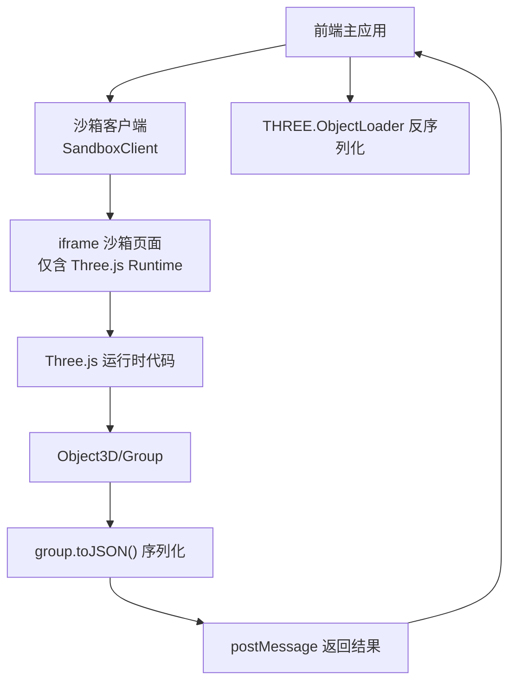
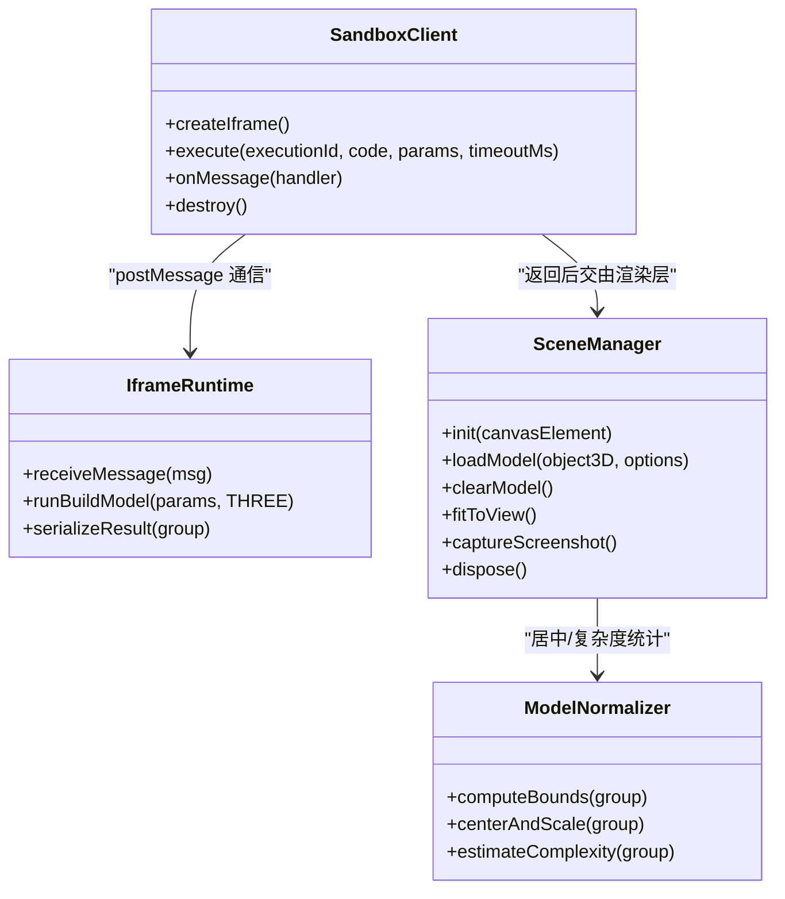
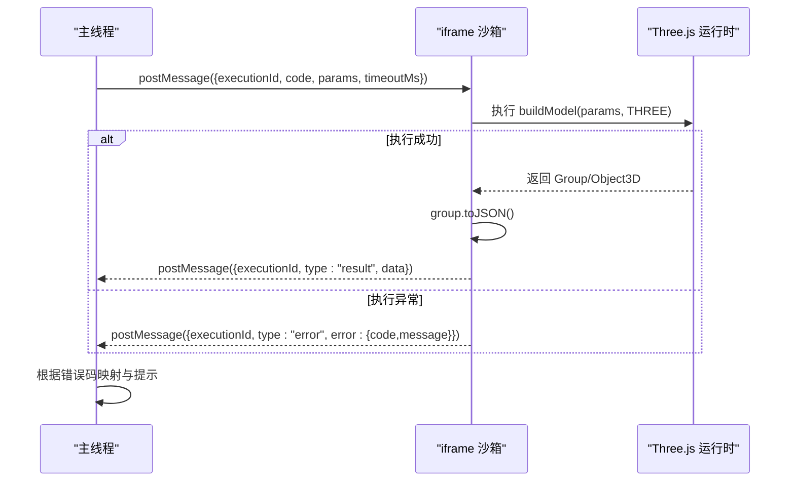
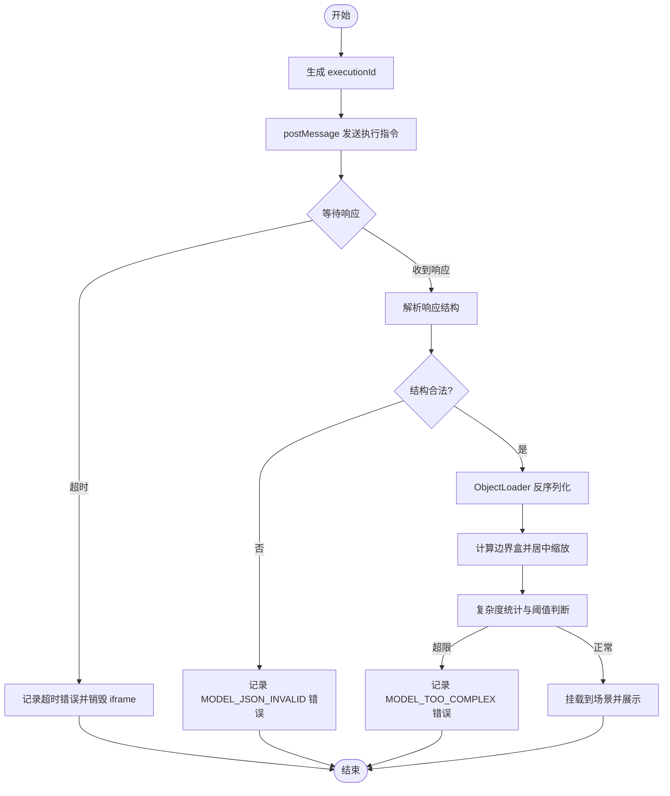
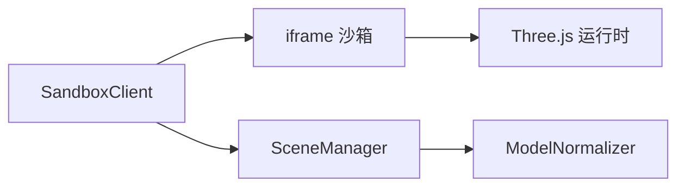

# 沙箱安全环境

<cite>
**本文引用的文件**
- [产品技术设计文档](file://tech/product-technical-design.md)
- [产品需求文档](file://prd.md)
</cite>

## 目录
1. [引言](#引言)
2. [项目结构](#项目结构)
3. [核心组件](#核心组件)
4. [架构总览](#架构总览)
5. [详细组件分析](#详细组件分析)
6. [依赖关系分析](#依赖关系分析)
7. [性能与资源限制](#性能与资源限制)
8. [故障排查指南](#故障排查指南)
9. [结论](#结论)
10. [附录：示例与清单](#附录示例与清单)

## 引言
本文件聚焦于 ApexForge 的沙箱安全环境，围绕 iframe 隔离、CSP 策略、同源访问限制、postMessage 通信协议、执行流程链路、运行时保护（超时、内存监控、异常捕获）、安全策略配置、白名单 API 与危险行为检测等主题进行系统化说明。目标是帮助读者理解从代码包装、参数传递到结果验证的完整链路，并提供可操作的实现建议与排障方法。

## 项目结构
本项目为设计与需求文档仓库，未包含具体源码实现。以下基于文档中的架构与模块划分，梳理与沙箱相关的前端模块职责与交互边界。



图表来源
- [产品技术设计文档:472-518](file://tech/product-technical-design.md#L472-L518)
- [产品需求文档:105-117](file://prd.md#L105-L117)

章节来源
- [产品技术设计文档:472-518](file://tech/product-technical-design.md#L472-L518)
- [产品需求文档:105-117](file://prd.md#L105-L117)

## 核心组件
- 沙箱客户端（SandboxClient）
  - 负责创建与管理 iframe、发送执行指令、处理 postMessage 响应、超时控制、错误映射与重试。
- iframe 沙箱页面
  - 仅加载受控的 Three.js 静态运行时，暴露最小能力集；通过 postMessage 接收执行任务并返回结构化结果。
- 场景管理器（SceneManager）
  - 负责模型加载、居中缩放、截图、释放资源等渲染侧能力，与沙箱解耦。
- 模型归一化器（ModelNormalizer）
  - 计算边界盒、自动居中缩放、复杂度统计，用于质量评估与展示优化。

章节来源
- [产品技术设计文档:539-571](file://tech/product-technical-design.md#L539-L571)
- [产品需求文档:59-70](file://prd.md#L59-L70)

## 架构总览
整体生成与渲染链路中，沙箱位于浏览器端，承担“不可信代码”的执行与隔离。服务端完成 Prompt 编排、LLM 调用、AST 校验与模板匹配，最终将受控代码下发至前端，由沙箱在受限环境中执行并返回序列化模型数据。

```mermaid
sequenceDiagram
participant U as "用户"
participant FE as "前端主应用"
participant API as "API 网关/后端"
participant GEN as "生成服务"
participant VAL as "校验服务"
participant BOX as "iframe 沙箱"
participant RT as "Three.js 运行时"
U->>FE : 输入描述并触发生成
FE->>API : POST /api/v1/generations
API->>GEN : 创建生成任务
GEN->>VAL : 输出协议/AST/黑名单校验
VAL-->>GEN : 校验报告
GEN-->>API : 返回受控代码与参数
API-->>FE : 生成载荷(code, params, timeoutMs)
FE->>BOX : postMessage({executionId, code, params, timeoutMs})
BOX->>RT : 执行 buildModel(params, THREE)
RT-->>BOX : 返回 Object3D/Group
BOX->>BOX : group.toJSON() 序列化
BOX-->>FE : postMessage({executionId, result|error})
FE->>FE : ObjectLoader 反序列化/居中/复杂度统计
FE-->>U : 展示模型或错误提示
```

图表来源
- [产品技术设计文档:359-390](file://tech/product-technical-design.md#L359-L390)
- [产品技术设计文档:472-518](file://tech/product-technical-design.md#L472-L518)
- [产品需求文档:126-140](file://prd.md#L126-L140)

## 详细组件分析

### iframe 隔离方案
- sandbox 属性
  - 使用 allow-scripts，禁止同源访问、表单、弹窗与顶级导航，阻断跨域读取与 DOM 操作。
- CSP 策略
  - 仅允许加载预构建的 Three.js 静态运行时，禁用内联脚本与外部未知来源。
- 同源限制
  - 禁止访问 window.top/window.parent、document、localStorage/sessionStorage 等全局对象。
- 最小暴露面
  - 仅暴露 THREE、安全构建函数与 params，禁止动态导入与网络请求。
- 结果约束
  - 只允许返回结构化 JSON，禁止回传函数或 DOM 引用。

章节来源
- [产品技术设计文档:490-496](file://tech/product-technical-design.md#L490-L496)
- [产品需求文档:105-117](file://prd.md#L105-L117)

#### 类图：沙箱相关组件


图表来源
- [产品技术设计文档:539-571](file://tech/product-technical-design.md#L539-L571)
- [产品技术设计文档:472-518](file://tech/product-technical-design.md#L472-L518)

### postMessage 通信协议
- 消息格式
  - 执行请求：{ executionId, code, params, timeoutMs }
  - 成功响应：{ executionId, type: "result", data: objectJson }
  - 失败响应：{ executionId, type: "error", error: { code, message } }
- 超时控制
  - 主线程计时器监听，若未在 timeoutMs 内收到响应则销毁 iframe 并返回超时错误。
- 错误映射
  - 将运行时错误映射为统一错误码（如 SANDBOX_TIMEOUT、SANDBOX_RUNTIME_ERROR、MODEL_JSON_INVALID、MODEL_TOO_COMPLEX、MODEL_EMPTY），便于前端提示与日志追踪。

章节来源
- [产品技术设计文档:498-517](file://tech/product-technical-design.md#L498-L517)

#### 时序图：postMessage 执行与错误处理


图表来源
- [产品技术设计文档:498-517](file://tech/product-technical-design.md#L498-L517)

### 执行流程链路
- 步骤概览
  1) 主页面生成 executionId。
  2) 向 iframe 发送执行指令（含代码、参数、超时）。
  3) iframe 包装代码并执行 buildModel(params, THREE)。
  4) 成功后调用 group.toJSON() 序列化。
  5) 主页面使用 ObjectLoader 反序列化。
  6) 计算边界盒并自动居中缩放。
  7) 超时或异常时销毁 iframe 并返回错误。
- 关键约束
  - 每次执行创建独立 iframe，避免状态污染。
  - 严格限制可访问的全局对象与方法。
  - 结果必须为纯 JSON，禁止函数或引用类型。

章节来源
- [产品技术设计文档:498-506](file://tech/product-technical-design.md#L498-L506)

#### 流程图：执行与结果验证


图表来源
- [产品技术设计文档:498-506](file://tech/product-technical-design.md#L498-L506)

### 运行时保护措施
- 执行时间限制
  - 基于 timeoutMs 的主线程计时器，超时即销毁 iframe，防止死循环与阻塞。
- 内存使用监控
  - 建议在 Worker 中进行 JSON 解析与复杂度分析，降低主线程压力；对大模型设置上限并在 UI 提示降级。
- 异常捕获处理
  - 统一错误码体系，区分超时、运行时错误、模型非法、复杂度过限与空模型，提供用户友好提示与重试策略。

章节来源
- [产品技术设计文档:490-517](file://tech/product-technical-design.md#L490-L517)
- [产品需求文档:105-117](file://prd.md#L105-L117)

### 安全策略配置
- 输入安全
  - Prompt 长度限制与敏感词过滤，品牌与侵权内容进入更严格审核。
- 输出安全
  - 协议校验、黑名单扫描、AST 白名单校验；开放 API 默认私有。
- 数据安全
  - 密钥管理、脱敏日志、企业版数据隔离与审计。

章节来源
- [产品技术设计文档:910-930](file://tech/product-technical-design.md#L910-L930)

### 白名单 API 列表与危险行为检测
- 白名单语法与 API
  - 变量声明、函数声明、对象/数组字面量。
  - 基础数学运算与 Math 白名单方法。
  - 允许的 Three.js 构造器与方法（如 Group、基础几何体、材质、Mesh、Line、add、position.set、rotation.set）。
- 黑名单与危险行为
  - 动态执行：eval、Function、字符串参数的 setTimeout/setInterval。
  - 网络访问：fetch、XMLHttpRequest、WebSocket、EventSource、navigator.sendBeacon。
  - DOM 访问：document、window.top、window.parent、localStorage、sessionStorage。
  - 动态加载：import、importScripts、require。
  - 原型污染：__proto__、prototype、constructor 链式异常访问。
  - 计算风险：while(true)、无限递归、过深嵌套循环。
- 复杂度限制
  - 最大代码长度、AST 深度、循环层数、Mesh 数量、顶点估算等。

章节来源
- [产品技术设计文档:441-469](file://tech/product-technical-design.md#L441-L469)

## 依赖关系分析
- 组件耦合
  - SandboxClient 与 iframe 强耦合（通信协议与生命周期），与 SceneManager 松耦合（仅传递结果）。
  - SceneManager 与 ModelNormalizer 组合关系，负责渲染与归一化。
- 外部依赖
  - Three.js 运行时（静态资源，受 CSP 控制）。
  - 可选 Worker 用于 JSON 解析与复杂度分析。
- 潜在循环依赖
  - 无直接循环依赖；注意避免在沙箱中引入额外库导致依赖膨胀。



图表来源
- [产品技术设计文档:539-571](file://tech/product-technical-design.md#L539-L571)
- [产品技术设计文档:472-518](file://tech/product-technical-design.md#L472-L518)

章节来源
- [产品技术设计文档:539-571](file://tech/product-technical-design.md#L539-L571)

## 性能与资源限制
- 前端优化
  - 动态加载 Three.js 与沙箱 runtime，降低首屏体积。
  - 模型 JSON 解析放入 Worker，主线程只做渲染挂载。
  - 重复几何体优先 InstancedMesh；加载前复杂度检查与降级提示。
  - 释放旧模型时遍历 dispose geometry、material、texture；页面不可见时暂停渲染循环。
- 资源限制建议
  - MVP 最大 Mesh 数量约 80，Beta 可按套餐配置。
  - AST 深度小于 30，循环层数不超过 2。
  - 代码长度上限（MVP 20KB，Beta 可配置）。

章节来源
- [产品技术设计文档:563-571](file://tech/product-technical-design.md#L563-L571)
- [产品技术设计文档:461-469](file://tech/product-technical-design.md#L461-L469)

## 故障排查指南
- 常见错误码与定位
  - SANDBOX_TIMEOUT：检查 timeoutMs 是否过小、是否存在死循环或复杂几何体。
  - SANDBOX_RUNTIME_ERROR：查看 iframe 控制台与错误信息，确认 buildModel 签名与可用 API。
  - MODEL_JSON_INVALID：校验 group.toJSON() 输出结构与大小。
  - MODEL_TOO_COMPLEX：降低 Mesh 数量或几何复杂度，启用模板模式。
  - MODEL_EMPTY：检查生成逻辑是否返回有效 Group。
- 调试技巧
  - 在主线程打印 executionId 与耗时，关联 traceId 进行全链路追踪。
  - 在 iframe 中仅输出必要日志，避免泄露敏感信息。
  - 使用质量评分与复杂度指标辅助定位问题。

章节来源
- [产品技术设计文档:508-517](file://tech/product-technical-design.md#L508-L517)
- [产品技术设计文档:868-907](file://tech/product-technical-design.md#L868-L907)

## 结论
ApexForge 的沙箱安全环境以 iframe 为核心隔离边界，结合 CSP 与严格的同源限制，配合 postMessage 协议与统一的错误码体系，实现了“不可信代码”的安全执行与可控返回。通过 AST 白名单、黑名单与复杂度限制，以及运行时超时与资源释放策略，系统在安全性与可用性之间取得平衡。后续可在 Worker 中进一步下沉解析与统计工作，提升主线程性能与稳定性。

## 附录：示例与清单
- 沙箱客户端实现要点
  - 创建隐藏 iframe，设置 sandbox="allow-scripts" 与严格 CSP。
  - 发送执行指令并维护 executionId 与超时计时器。
  - 接收 postMessage 响应，解析并映射错误码。
  - 调用 SceneManager 加载模型并进行居中缩放与复杂度统计。
- 错误处理与调试
  - 统一错误码映射与用户提示。
  - 结合 traceId 与质量评分进行问题定位与回归测试。
- 安全策略清单
  - 输入长度与敏感词过滤。
  - 输出协议校验、AST 白名单与黑名单。
  - 运行时限制（超时、内存、复杂度）。
  - 密钥管理与脱敏日志。

章节来源
- [产品技术设计文档:472-518](file://tech/product-technical-design.md#L472-L518)
- [产品技术设计文档:910-930](file://tech/product-technical-design.md#L910-L930)
- [产品需求文档:105-117](file://prd.md#L105-L117)