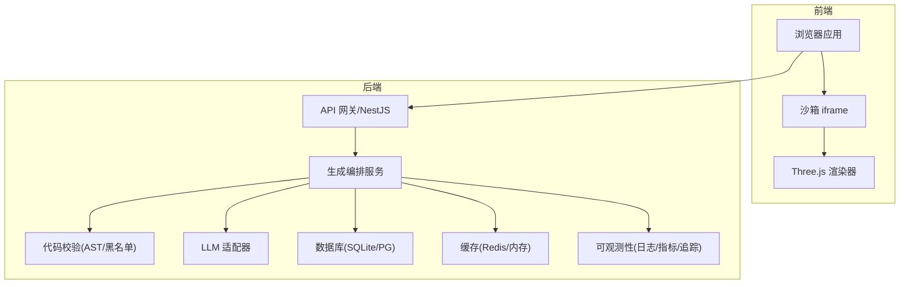
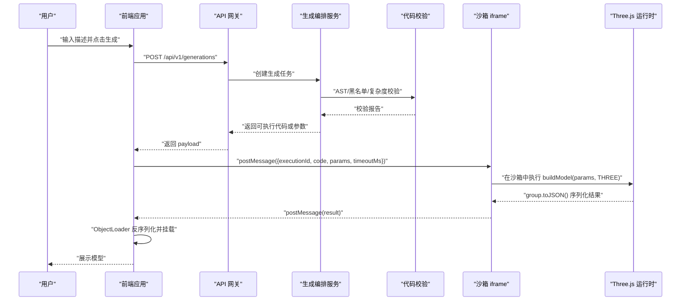
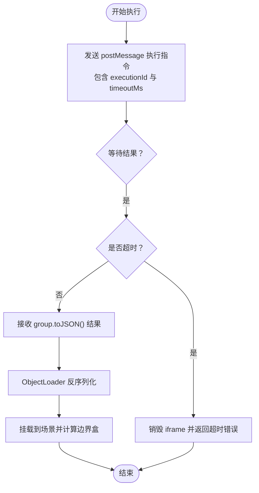
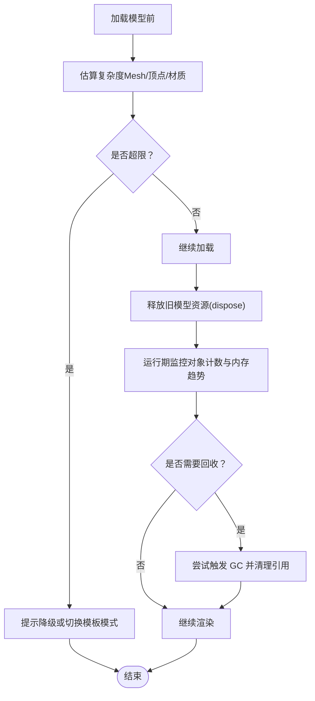
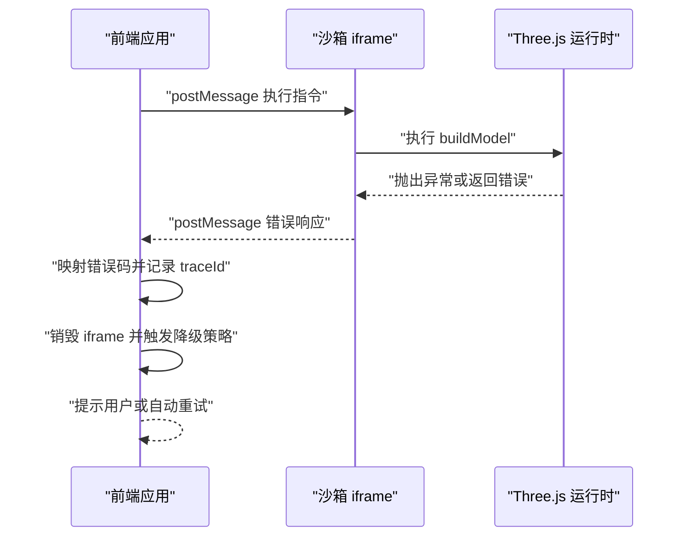
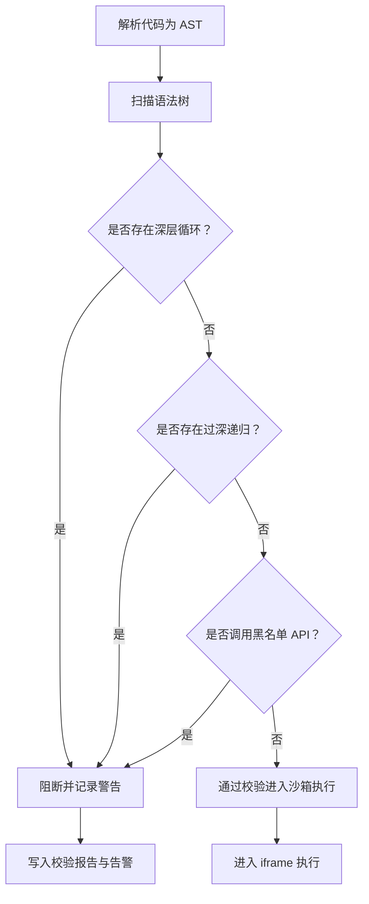
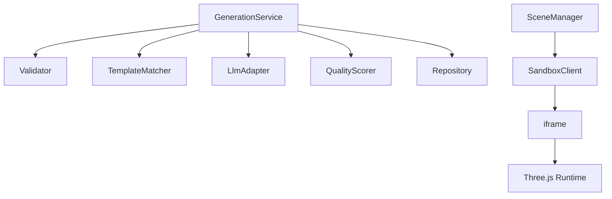

# 运行时保护措施

<cite>
**本文引用的文件**   
- [tech/product-technical-design.md](file://tech/product-technical-design.md)
- [prd.md](file://prd.md)
</cite>

## 目录
1. [引言](#引言)
2. [项目结构](#项目结构)
3. [核心组件](#核心组件)
4. [架构总览](#架构总览)
5. [详细组件分析](#详细组件分析)
6. [依赖关系分析](#依赖关系分析)
7. [性能考量](#性能考量)
8. [故障排查指南](#故障排查指南)
9. [结论](#结论)
10. [附录：实现要点与示例路径](#附录实现要点与示例路径)

## 引言
本设计文档聚焦于 ApexForge 的“运行时保护措施”，围绕执行时间限制、内存使用监控、异常捕获处理、危险行为检测以及性能监控、日志记录与故障恢复等主题，给出可落地的安全设计与工程实践。内容基于仓库中的产品技术设计与需求文档进行提炼与扩展，确保读者既能理解整体架构，也能按图索骥定位到具体实现位置。

## 项目结构
ApexForge 采用前后端分离与模块化组织方式，前端以 React + Three.js 为主，后端以 NestJS 为核心，结合 SQLite/PostgreSQL、缓存与队列等基础设施。MVP 阶段强调快速落地与可控风险，Beta/Scale 阶段逐步引入微服务化、多供应商 LLM 适配与平台化能力。

图表来源
- [tech/product-technical-design.md:38-100](file://tech/product-technical-design.md#L38-L100)
- [tech/product-technical-design.md:478-518](file://tech/product-technical-design.md#L478-L518)
- [tech/product-technical-design.md:594-610](file://tech/product-technical-design.md#L594-L610)

章节来源
- [tech/product-technical-design.md:34-100](file://tech/product-technical-design.md#L34-L100)
- [tech/product-technical-design.md:1001-1036](file://tech/product-technical-design.md#L1001-L1036)
- [prd.md:33-53](file://prd.md#L33-L53)

## 核心组件
- 沙箱运行时（iframe）：隔离 AI 生成的 JS 代码执行环境，提供 postMessage 通信、超时销毁与结果序列化。
- 代码校验器（服务端）：协议校验、文本黑名单、AST 白名单与复杂度限制。
- 生成编排服务：任务路由、模板匹配、Prompt 构建、质量评分与重试修复。
- 可观测性：traceId 贯穿全链路，记录耗时、状态、错误码与质量分。
- 前端渲染与模型管理：加载模型、自动居中缩放、释放资源与复杂度统计。

章节来源
- [tech/product-technical-design.md:472-518](file://tech/product-technical-design.md#L472-L518)
- [tech/product-technical-design.md:428-470](file://tech/product-technical-design.md#L428-L470)
- [tech/product-technical-design.md:594-610](file://tech/product-technical-design.md#L594-L610)
- [tech/product-technical-design.md:868-907](file://tech/product-technical-design.md#L868-L907)

## 架构总览
下图展示从用户发起请求到沙箱执行与结果返回的关键流程，并标注了运行时保护点（超时、异常、复杂度控制）。

图表来源
- [tech/product-technical-design.md:362-390](file://tech/product-technical-design.md#L362-L390)
- [tech/product-technical-design.md:498-507](file://tech/product-technical-design.md#L498-L507)

## 详细组件分析

### 执行时间限制（定时器监控、CPU 使用率检测、强制终止）
- 定时器监控
  - 前端为每次执行分配 executionId 与 timeoutMs，向 iframe 发送执行指令；若未在限定时间内收到结果，则销毁 iframe 并返回超时错误码。
  - 服务端对生成任务设置最大执行时长，配合队列与熔断策略避免长时间占用资源。
- CPU 使用率检测
  - 前端可通过 Performance API 或 requestAnimationFrame 的帧率变化间接感知卡顿；当帧率持续低于阈值时提示降级或中止渲染。
  - 服务端通过可观测性采集各阶段耗时与失败率，识别高延迟与阻塞场景。
- 强制终止机制
  - 沙箱 iframe 支持 sandbox 属性与 CSP 限制，结合超时销毁实现强隔离与强制终止。
  - 服务端在任务状态机中定义 failed/retrying 等状态，触发重试或回退逻辑。

图表来源
- [tech/product-technical-design.md:498-507](file://tech/product-technical-design.md#L498-L507)
- [tech/product-technical-design.md:508-517](file://tech/product-technical-design.md#L508-L517)

章节来源
- [tech/product-technical-design.md:498-517](file://tech/product-technical-design.md#L498-L517)
- [tech/product-technical-design.md:898-907](file://tech/product-technical-design.md#L898-L907)

### 内存使用监控（堆内存统计、对象数量限制、垃圾回收触发）
- 堆内存统计
  - 前端可利用 performance.memory（如可用）或自定义计数器跟踪几何体、材质、纹理数量与大小，超过阈值时提示用户降低细节或使用模板模式。
- 对象数量限制
  - 服务端 AST 校验限制 Mesh 数量、循环层数与 AST 深度；前端加载前再次评估复杂度，防止大模型导致页面卡顿。
- 垃圾回收触发
  - 前端在替换模型时遍历 dispose geometry、material、texture，必要时主动触发 GC（受浏览器策略限制），并释放旧场景引用。
  - 服务端将大字段（代码、模型 JSON、截图）迁移至对象存储，仅保存 URL 与摘要，减少内存压力。

图表来源
- [tech/product-technical-design.md:563-570](file://tech/product-technical-design.md#L563-L570)
- [tech/product-technical-design.md:452-470](file://tech/product-technical-design.md#L452-L470)
- [tech/product-technical-design.md:952-958](file://tech/product-technical-design.md#L952-L958)

章节来源
- [tech/product-technical-design.md:563-570](file://tech/product-technical-design.md#L563-L570)
- [tech/product-technical-design.md:452-470](file://tech/product-technical-design.md#L452-L470)
- [tech/product-technical-design.md:952-958](file://tech/product-technical-design.md#L952-L958)

### 异常捕获处理（全局错误监听、未捕获异常、优雅降级）
- 全局错误监听
  - 前端注册 window.onerror 与 unhandledrejection，统一映射为错误码（如 SANDBOX_RUNTIME_ERROR），并上报 traceId 与上下文。
- 未捕获异常处理
  - 沙箱 iframe 内发生异常时，主线程捕获 postMessage 的错误响应，销毁 iframe 并返回友好提示。
- 优雅降级
  - 当模型过于复杂或执行失败时，自动回退到模板模式或简化渲染（LOD、InstancedMesh），并记录失败原因用于后续优化。

图表来源
- [tech/product-technical-design.md:508-517](file://tech/product-technical-design.md#L508-L517)
- [tech/product-technical-design.md:498-507](file://tech/product-technical-design.md#L498-L507)

章节来源
- [tech/product-technical-design.md:508-517](file://tech/product-technical-design.md#L508-L517)
- [tech/product-technical-design.md:498-507](file://tech/product-technical-design.md#L498-L507)

### 危险行为检测算法（无限循环检测、递归深度限制、系统调用拦截）
- 无限循环检测
  - 服务端 AST 校验限制循环嵌套层数与最大代码长度；前端执行期间监控帧率与执行时长，超限时中止。
- 递归深度限制
  - AST 扫描函数调用链与递归深度，超过阈值直接阻断。
- 系统调用拦截
  - 黑名单禁止 eval、Function、fetch、WebSocket、DOM 访问、动态导入等；CSP 与 iframe sandbox 进一步限制网络与同源权限。

图表来源
- [tech/product-technical-design.md:441-470](file://tech/product-technical-design.md#L441-L470)
- [tech/product-technical-design.md:478-518](file://tech/product-technical-design.md#L478-L518)

章节来源
- [tech/product-technical-design.md:441-470](file://tech/product-technical-design.md#L441-L470)
- [tech/product-technical-design.md:478-518](file://tech/product-technical-design.md#L478-L518)

### 运行时保护器实现要点与示例路径
- 前端沙箱客户端（SandboxClient）
  - 职责：与 iframe 通信、超时控制、错误映射、结果反序列化与挂载。
  - 参考路径：[tech/product-technical-design.md:539-550](file://tech/product-technical-design.md#L539-L550)、[tech/product-technical-design.md:498-507](file://tech/product-technical-design.md#L498-L507)
- 代码校验器（Validator）
  - 职责：协议校验、黑名单扫描、AST 白名单与复杂度限制。
  - 参考路径：[tech/product-technical-design.md:428-470](file://tech/product-technical-design.md#L428-L470)
- 生成编排服务（GenerationService）
  - 职责：任务路由、模板匹配、Prompt 构建、质量评分与重试修复。
  - 参考路径：[tech/product-technical-design.md:594-610](file://tech/product-technical-design.md#L594-L610)
- 可观测性（ObservabilityModule）
  - 职责：traceId 贯穿、日志字段、告警规则。
  - 参考路径：[tech/product-technical-design.md:868-907](file://tech/product-technical-design.md#L868-L907)

章节来源
- [tech/product-technical-design.md:539-550](file://tech/product-technical-design.md#L539-L550)
- [tech/product-technical-design.md:428-470](file://tech/product-technical-design.md#L428-L470)
- [tech/product-technical-design.md:594-610](file://tech/product-technical-design.md#L594-L610)
- [tech/product-technical-design.md:868-907](file://tech/product-technical-design.md#L868-L907)

## 依赖关系分析
- 模块耦合
  - GenerationService 依赖 Validator、TemplateMatcher、LlmAdapter、QualityScorer 与 Repository。
  - 前端 SceneManager 依赖 SandboxClient 与 ObjectLoader。
- 外部依赖
  - LLM 供应商（DeepSeek、Qwen 等）、缓存（Redis/内存）、数据库（SQLite/PG）、对象存储（S3/MinIO/OSS）。
- 潜在环路与解耦
  - 通过接口抽象（LlmAdapter、TemplateMatcher）与服务分层降低耦合；使用消息队列与事件驱动提升可扩展性。

图表来源
- [tech/product-technical-design.md:594-610](file://tech/product-technical-design.md#L594-L610)
- [tech/product-technical-design.md:478-518](file://tech/product-technical-design.md#L478-L518)

章节来源
- [tech/product-technical-design.md:594-610](file://tech/product-technical-design.md#L594-L610)
- [tech/product-technical-design.md:478-518](file://tech/product-technical-design.md#L478-L518)

## 性能考量
- 前端
  - 动态加载 Three.js 与沙箱 runtime，降低首屏体积。
  - 模型 JSON 解析放入 Worker，主线程只做渲染挂载。
  - 重复几何体优先使用 InstancedMesh；加载前统计复杂度，超过阈值提示降级。
  - 释放旧模型时必须遍历 dispose geometry、material、texture；使用 requestAnimationFrame 控制渲染循环，页面不可见时暂停。
- 后端
  - 相似 Prompt 缓存，向量相似度大于阈值时复用结果。
  - 模板模式跳过 LLM 代码生成，改为参数生成。
  - 生成任务异步化，避免 HTTP 长连接占用；LLM 供应商并发与熔断控制。
  - 热门模板与参数 Schema 缓存在 Redis；大字段迁移至对象存储。

章节来源
- [tech/product-technical-design.md:563-570](file://tech/product-technical-design.md#L563-L570)
- [tech/product-technical-design.md:933-958](file://tech/product-technical-design.md#L933-L958)

## 故障排查指南
- 常见错误码与提示
  - SANDBOX_TIMEOUT：执行超时，已终止渲染。
  - SANDBOX_RUNTIME_ERROR：运行时报错，可重试。
  - MODEL_JSON_INVALID：返回结构非法，系统将重新生成。
  - MODEL_TOO_COMPLEX：模型复杂度超限，请降低细节或使用模板模式。
  - MODEL_EMPTY：未生成有效对象，请补充模型主体。
- 排查步骤
  - 检查 traceId 与日志字段，确认各阶段耗时与失败原因。
  - 查看校验报告（blockedReasons、warnings、complexity、astSummary）。
  - 复核沙箱执行超时与错误映射，确认 iframe 销毁与降级策略生效。
  - 对比质量评分维度（可渲染性、Prompt 匹配度、结构完整性、性能表现、可编辑性），定位问题根因。

章节来源
- [tech/product-technical-design.md:508-517](file://tech/product-technical-design.md#L508-L517)
- [tech/product-technical-design.md:882-907](file://tech/product-technical-design.md#L882-L907)
- [tech/product-technical-design.md:807-840](file://tech/product-technical-design.md#L807-L840)

## 结论
ApexForge 的运行时保护体系以“沙箱隔离 + 严格校验 + 可观测性”为核心，通过执行时间限制、内存监控、异常处理与危险行为检测，保障 AI 生成代码的安全与稳定。结合模板优先与质量闭环，系统在灵活性与可控性之间取得平衡，并为平台化演进预留了清晰的扩展边界。

## 附录：实现要点与示例路径
- 沙箱配置与执行流程
  - 参考路径：[tech/product-technical-design.md:490-507](file://tech/product-technical-design.md#L490-L507)
- 错误分类与用户提示
  - 参考路径：[tech/product-technical-design.md:508-517](file://tech/product-technical-design.md#L508-L517)
- 代码安全校验与黑名单
  - 参考路径：[tech/product-technical-design.md:441-470](file://tech/product-technical-design.md#L441-L470)
- 可观测性与告警规则
  - 参考路径：[tech/product-technical-design.md:868-907](file://tech/product-technical-design.md#L868-L907)
- 前端性能策略与资源释放
  - 参考路径：[tech/product-technical-design.md:563-570](file://tech/product-technical-design.md#L563-L570)
- 后端优化与数据迁移
  - 参考路径：[tech/product-technical-design.md:933-958](file://tech/product-technical-design.md#L933-L958)