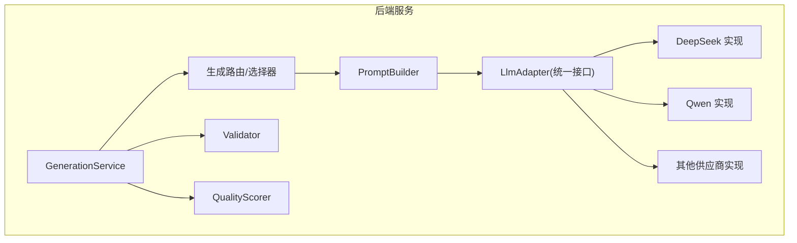
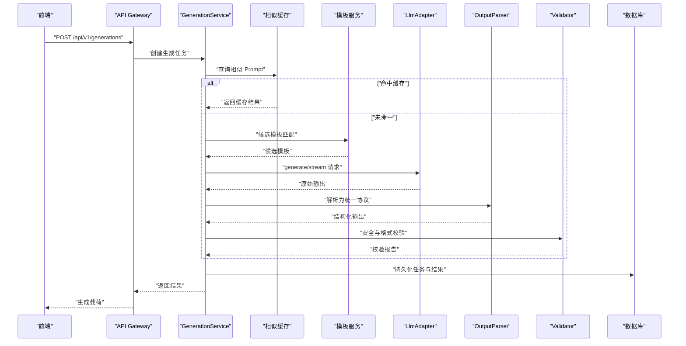
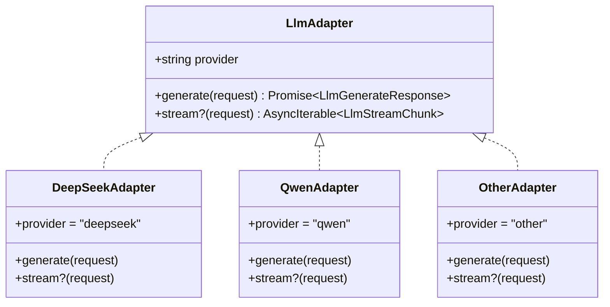
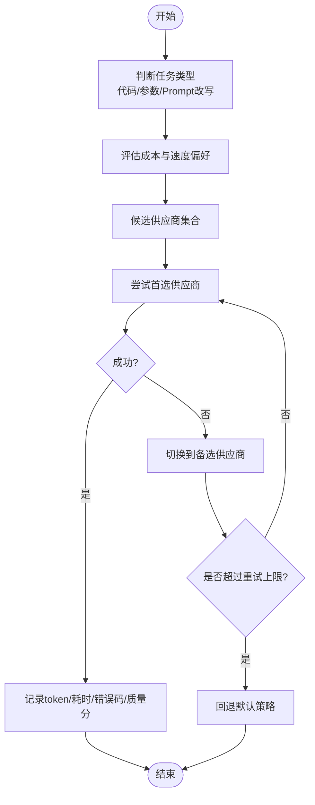
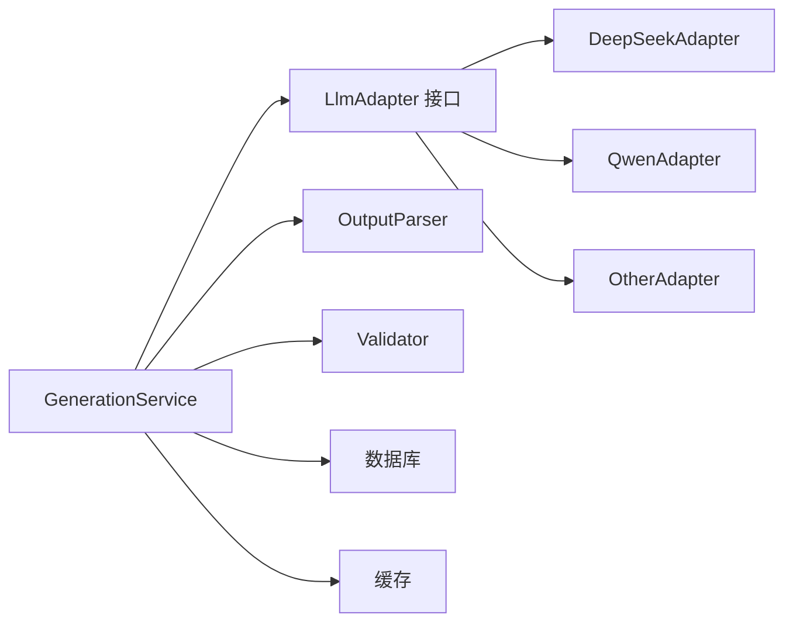

# LLM 适配器层

<cite>
**本文引用的文件**
- [产品技术设计文档](file://tech/product-technical-design.md)
- [产品需求文档](file://prd.md)
</cite>

## 目录
1. [引言](#引言)
2. [项目结构](#项目结构)
3. [核心组件](#核心组件)
4. [架构总览](#架构总览)
5. [详细组件分析](#详细组件分析)
6. [依赖关系分析](#依赖关系分析)
7. [性能与可观测性](#性能与可观测性)
8. [故障排查指南](#故障排查指南)
9. [结论](#结论)
10. [附录：新供应商接入指南与测试用例](#附录新供应商接入指南与测试用例)

## 引言
本设计文档聚焦于 ApexForge 的 LLM 适配器层，目标是构建统一、可扩展、可观测的多供应商适配能力。通过统一的 LlmAdapter 接口抽象，屏蔽 DeepSeek、Qwen 等具体供应商差异，提供 generate 同步调用与可选的 stream 流式支持；同时内置选择策略（按任务类型、成本与速度）、失败重试与降级机制，以及 token 统计、耗时记录、错误码收集与输出质量评估的全链路可观测能力。该设计既满足 MVP 快速落地，也预留平台化演进空间。

## 项目结构
从整体工程视角，LLM 适配器位于后端服务中的 LlmModule，被 GenerationService 通过 LlmAdapter 接口调用，向上承接 Prompt 编排与模板匹配，向下对接多个模型供应商。

图表来源
- [产品技术设计文档:594-630](file://tech/product-technical-design.md#L594-L630)

章节来源
- [产品技术设计文档:574-630](file://tech/product-technical-design.md#L574-L630)

## 核心组件
- 统一接口 LlmAdapter
  - provider：供应商标识，用于路由与可观测性记录。
  - generate(request)：标准文本生成接口，返回结构化响应。
  - stream?(request)：可选的流式接口，返回异步迭代器以支持增量消费。
- 选择策略与路由
  - 基于任务类型（代码生成、参数生成、Prompt 改写）选择模型。
  - 基于成本与响应速度选择供应商。
  - 支持失败重试与供应商降级。
- 可观测与度量
  - 每次调用记录 token 用量、耗时、错误码与输出质量评分。
- 解析与校验
  - OutputParser 将 LLM 原始输出解析为统一协议。
  - Validator 对输出进行安全与格式校验。

章节来源
- [产品技术设计文档:611-630](file://tech/product-technical-design.md#L611-L630)

## 架构总览
下图展示 LLM 适配器在生成链路中的位置与交互关系，包括缓存、模板、校验、评分与数据库持久化。

图表来源
- [产品技术设计文档:359-391](file://tech/product-technical-design.md#L359-L391)

章节来源
- [产品技术设计文档:327-391](file://tech/product-technical-design.md#L327-L391)

## 详细组件分析

### 统一接口 LlmAdapter 设计
- 目标
  - 屏蔽多供应商差异，提供一致的调用语义。
  - 支持同步 generate 与可选的流式 stream。
- 关键成员
  - provider：字符串标识，如 deepseek、qwen。
  - generate(request)：接收统一请求体，返回统一响应体。
  - stream?(request)：可选，返回 AsyncIterable 增量片段。
- 请求/响应约定
  - 请求包含 prompt、上下文版本、模式（template/code/hybrid）、偏好设置等。
  - 响应包含 mode、templateId、params、code、explanation、warnings 等字段。
- 扩展点
  - 新增供应商只需实现 LlmAdapter 接口并注册到路由。
  - 可在实现中封装各自 SDK 的差异（鉴权、超时、分页、重试）。

图表来源
- [产品技术设计文档:611-630](file://tech/product-technical-design.md#L611-L630)

章节来源
- [产品技术设计文档:611-630](file://tech/product-technical-design.md#L611-L630)

### 多供应商适配策略
- 供应商列表
  - DeepSeek：代码生成能力强，适合 Code Mode。
  - Qwen：通用能力强，适合 Template/Hybrid 模式。
  - 其他：作为备用或特定场景补充。
- 选择策略
  - 按任务类型：
    - 代码生成：优先 DeepSeek。
    - 参数生成：优先 Qwen。
    - Prompt 改写：根据效果与成本综合选择。
  - 按成本与速度：
    - 低延迟优先：选择响应更快的供应商。
    - 低成本优先：选择单价更低的供应商。
  - 失败重试与降级：
    - 同一供应商失败后自动切换备选供应商。
    - 达到最大重试次数后回退到默认策略。
- 输出协议
  - 统一 JSON 协议，包含 mode、templateId、params、code、explanation、warnings。

章节来源
- [产品技术设计文档:611-630](file://tech/product-technical-design.md#L611-L630)
- [产品技术设计文档:403-425](file://tech/product-technical-design.md#L403-L425)

### 选择策略流程

图表来源
- [产品技术设计文档:611-630](file://tech/product-technical-design.md#L611-L630)

章节来源
- [产品技术设计文档:611-630](file://tech/product-technical-design.md#L611-L630)

### 流式支持（可选）
- 适用场景
  - 长文本生成、实时预览、用户体验优化。
- 实现要点
  - 使用 AsyncIterable 逐步产出 LlmStreamChunk。
  - 上游可聚合增量内容，结合 OutputParser 做增量解析。
  - 注意流式错误处理与中断恢复。

章节来源
- [产品技术设计文档:611-630](file://tech/product-technical-design.md#L611-L630)

### 输出解析与校验
- OutputParser
  - 将 LLM 原始输出解析为统一协议。
  - 处理异常格式、缺失字段、类型转换。
- Validator
  - 协议校验、黑名单扫描、AST 白名单校验。
  - 复杂度限制（代码长度、AST深度、循环层数、Mesh数量等）。
- 修复与重试
  - 若校验失败，触发 RepairService 自动修复或重新生成。

章节来源
- [产品技术设计文档:594-610](file://tech/product-technical-design.md#L594-L610)
- [产品技术设计文档:428-470](file://tech/product-technical-design.md#L428-L470)

## 依赖关系分析
- 模块耦合
  - GenerationService 依赖 LlmAdapter 接口，不直接依赖具体供应商。
  - LlmAdapter 实现类仅依赖各自供应商 SDK。
  - OutputParser 与 Validator 为纯函数或服务，无外部状态。
- 外部依赖
  - 各供应商 HTTP/SDK 客户端。
  - 缓存与数据库用于任务与结果持久化。
- 潜在循环依赖
  - 通过接口解耦避免循环依赖。
- 集成点
  - 认证与限流由网关或中间件处理。
  - 可观测性通过日志、指标、trace 上报。

图表来源
- [产品技术设计文档:594-630](file://tech/product-technical-design.md#L594-L630)

章节来源
- [产品技术设计文档:574-630](file://tech/product-technical-design.md#L574-L630)

## 性能与可观测性
- 性能优化
  - 相似 Prompt 缓存命中减少 LLM 调用。
  - 模板模式跳过代码生成，仅参数生成。
  - 并发控制与熔断保护供应商稳定性。
- 可观测性
  - traceId 贯穿全链路。
  - 记录 provider、promptVersion、generationMode、latencyMs、status、errorCode、qualityScore。
  - 告警规则覆盖失败率、延迟、校验失败突增、沙箱超时突增、API 错误率。

章节来源
- [产品技术设计文档:868-908](file://tech/product-technical-design.md#L868-L908)
- [产品技术设计文档:933-958](file://tech/product-technical-design.md#L933-L958)

## 故障排查指南
- 常见问题定位
  - 生成失败率高：检查供应商健康度、重试与降级策略、配额与限流。
  - 校验失败突增：审查黑名单与 AST 白名单规则、Prompt 版本变更。
  - 沙箱超时突增：评估模型复杂度阈值、前端渲染性能。
  - API 错误率过高：关注网关与供应商侧错误码分布。
- 错误码体系
  - 服务端错误码：如 GENERATION_VALIDATION_FAILED。
  - 沙箱错误码：SANDBOX_TIMEOUT、SANDBOX_RUNTIME_ERROR、MODEL_JSON_INVALID、MODEL_TOO_COMPLEX、MODEL_EMPTY。
- 建议操作
  - 查看 traceId 对应日志与指标。
  - 对比不同供应商在同一 Prompt 下的成功率与耗时。
  - 回归测试固定 Prompt 集，观察质量分变化。

章节来源
- [产品技术设计文档:632-758](file://tech/product-technical-design.md#L632-L758)
- [产品技术设计文档:508-518](file://tech/product-technical-design.md#L508-L518)

## 结论
通过统一的 LlmAdapter 接口与完善的选择策略、重试与降级机制，ApexForge 在多供应商环境下具备高可用与可扩展能力。配合输出协议约束、AST 校验与质量评分闭环，系统在保证安全与稳定性的同时持续提升生成质量。可观测性与告警体系确保问题可追踪、可量化、可治理。

## 附录：新供应商接入指南与测试用例

### 接入步骤
- 实现 LlmAdapter 接口
  - 定义 provider 标识。
  - 实现 generate 方法，封装供应商 SDK 调用与错误映射。
  - 可选实现 stream 方法，支持流式输出。
- 注册到路由
  - 将新实现注入选择器，参与按任务类型、成本与速度的选择。
- 配置密钥与安全
  - 使用 KMS/Vault 管理 API Key，避免硬编码。
  - 遵循 CSP 与最小权限原则。
- 可观测性接入
  - 记录 token、耗时、错误码与质量评分。
  - 上报 traceId 与 provider 信息。

章节来源
- [产品技术设计文档:611-630](file://tech/product-technical-design.md#L611-L630)
- [产品技术设计文档:924-931](file://tech/product-technical-design.md#L924-L931)

### 单元测试建议
- PromptBuilder 输出协议测试
- Validator 黑名单与 AST 白名单测试
- Template 参数校验测试
- SandboxClient 超时与错误映射测试
- LlmAdapter mock 响应测试（含成功、失败、超时、流式中断）

章节来源
- [产品技术设计文档:1040-1076](file://tech/product-technical-design.md#L1040-L1076)

### 集成测试建议
- 端到端链路：创建任务 → 选择供应商 → 生成 → 解析 → 校验 → 保存资产
- 模板模式与代码模式分别验证
- 鉴权、限流与错误响应一致性
- 多供应商切换与降级路径验证

章节来源
- [产品技术设计文档:1050-1076](file://tech/product-technical-design.md#L1050-L1076)

### 安全测试建议
- 恶意代码样本集阻断测试
- 沙箱逃逸尝试（动态 import、fetch、WebSocket、DOM 访问）
- 无限循环与复杂几何体压力测试

章节来源
- [产品技术设计文档:1057-1076](file://tech/product-technical-design.md#L1057-L1076)

### 质量回归测试建议
- 建立固定 Prompt 集（车辆、建筑、道具、飞行器、边界与恶意输入）
- 每次 Prompt、模板或供应商调整后执行回归，比较成功率、质量分与耗时

章节来源
- [产品技术设计文档:1064-1076](file://tech/product-technical-design.md#L1064-L1076)