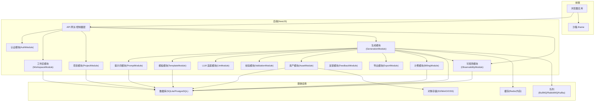
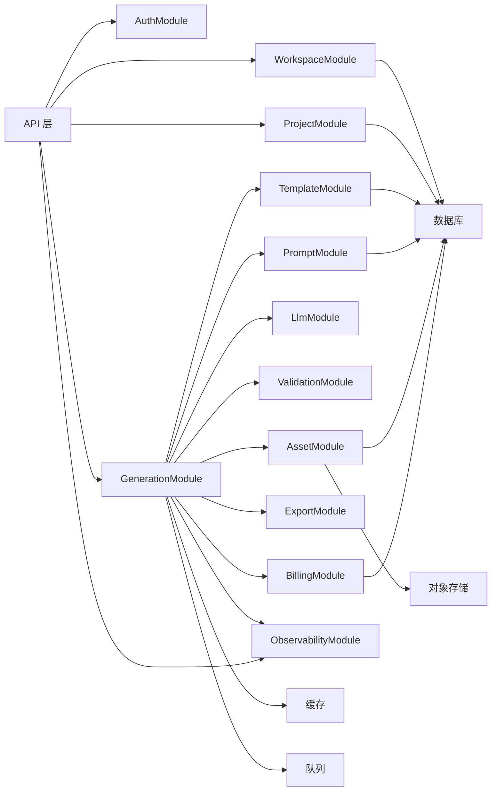
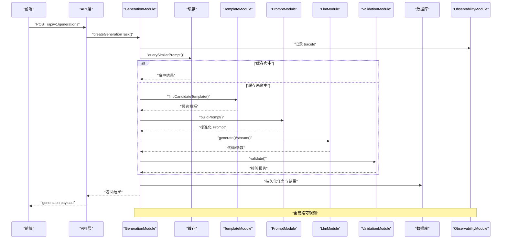
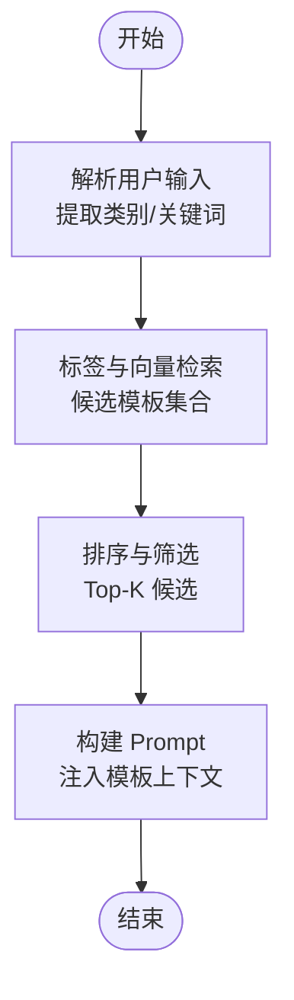
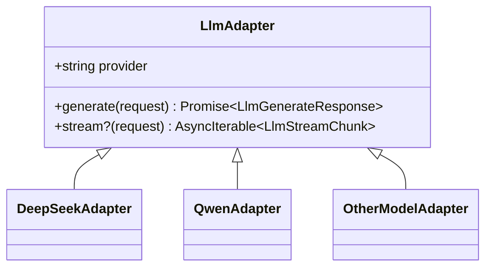
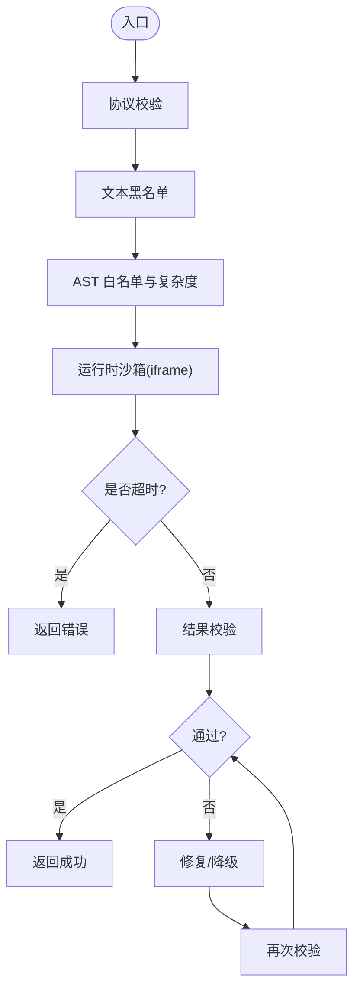
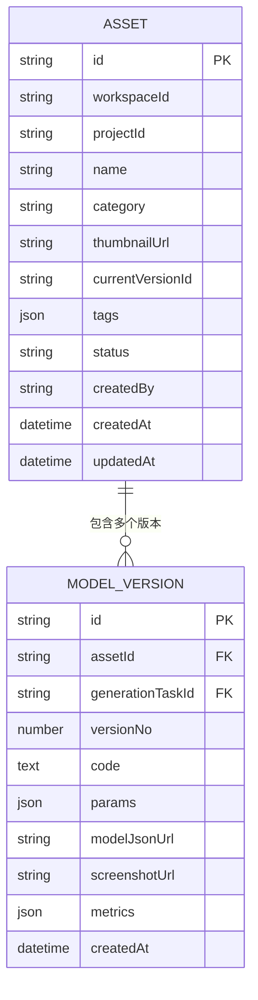
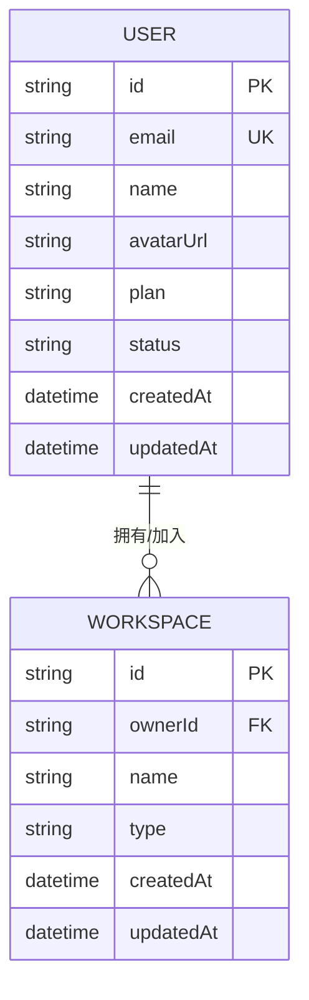
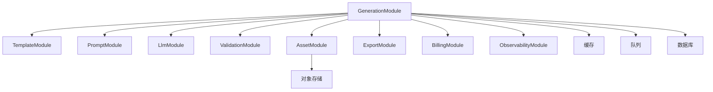

# NestJS 模块架构

<cite>
**本文引用的文件**   
- [产品技术设计文档](file://tech/product-technical-design.md)
- [产品需求文档](file://prd.md)
</cite>

## 目录
1. [引言](#引言)
2. [项目结构](#项目结构)
3. [核心组件](#核心组件)
4. [架构总览](#架构总览)
5. [详细组件分析](#详细组件分析)
6. [依赖关系分析](#依赖关系分析)
7. [性能考量](#性能考量)
8. [故障排查指南](#故障排查指南)
9. [结论](#结论)
10. [附录](#附录)

## 引言
本文件面向 ApexForge 后端，基于现有设计与需求文档，系统化梳理并输出 NestJS 模块架构说明。重点覆盖以下业务模块的职责划分与协作方式：AuthModule（用户认证、JWT、API Key）、WorkspaceModule（空间、成员、权限管理）、ProjectModule（项目管理）、GenerationModule（生成任务编排）、PromptModule（Prompt 模板和版本管理）、LlmModule（多供应商 LLM 适配）、ValidationModule（代码与参数校验）、TemplateModule（模板库和版本管理）、AssetModule（模型资产和版本管理）、FeedbackModule（用户反馈）、ExportModule（导出服务）、BillingModule（配额和套餐管理）、ObservabilityModule（日志、指标、追踪）。同时给出模块初始化配置建议、依赖注入模式与中间件集成方案，以及关键数据流向与接口契约要点。

## 项目结构
从总体逻辑与部署视角，系统由前端、网关/后端、AI 生成链路、存储与可观测性组成。MVP 阶段采用单体后端加模块化代码组织，平台化阶段演进为微服务与消息队列协同。

图表来源
- [产品技术设计文档:34-101](file://tech/product-technical-design.md#L34-L101)
- [产品技术设计文档:574-630](file://tech/product-technical-design.md#L574-L630)

章节来源
- [产品技术设计文档:34-101](file://tech/product-technical-design.md#L34-L101)
- [产品技术设计文档:574-630](file://tech/product-technical-design.md#L574-L630)

## 核心组件
本节聚焦各业务模块的职责边界、对外能力与内部协作点，结合领域模型与生成链路进行说明。

- AuthModule
  - 职责：用户注册登录、JWT 签发与校验、开放平台 API Key 鉴权与限流。
  - 关键点：统一鉴权守卫、租户级隔离（按 workspaceId）、审计日志接入 ObservabilityModule。
  - 依赖：Database、Cache（会话/令牌黑名单）、ObservabilityModule。

- WorkspaceModule
  - 职责：空间创建与管理、成员邀请与角色分配、资源可见性与访问控制。
  - 关键点：RBAC 策略、跨项目共享边界、软删除与审计。
  - 依赖：Database、ObservabilityModule。

- ProjectModule
  - 职责：项目 CRUD、可见性控制、与资产/任务的关联。
  - 关键点：与 Workspace 的归属关系、权限继承。
  - 依赖：Database、WorkspaceModule、ObservabilityModule。

- GenerationModule
  - 职责：生成任务编排、状态机流转、缓存命中、模板匹配、LLM 调用、校验与评分、结果持久化与导出。
  - 关键点：生成模式优先级（缓存→模板→混合→代码）、SSE 事件推送、重试与降级。
  - 依赖：TemplateModule、PromptModule、LlmModule、ValidationModule、AssetModule、ExportModule、BillingModule、ObservabilityModule、Cache、Queue、Database。

- PromptModule
  - 职责：Prompt 模板与版本管理、System Prompt 与 Few-shot 示例的版本化、质量回归测试基线。
  - 关键点：promptVersion 记录、回滚策略。
  - 依赖：Database、ObservabilityModule。

- TemplateModule
  - 职责：模板库与版本管理、参数 Schema 与默认值、渲染函数与示例 Prompt。
  - 关键点：模板分层（骨架/风格/细节/材质）、匹配策略（标签+向量检索）。
  - 依赖：Database、ObservabilityModule。

- AssetModule
  - 职责：模型资产与版本管理、缩略图与指标存储、当前版本切换。
  - 关键点：资产与项目的归属、版本链与快照。
  - 依赖：Database、Object Store、ObservabilityModule。

- ValidationModule
  - 职责：代码与参数校验、AST 白名单与复杂度限制、安全黑名单检查、修复建议。
  - 关键点：多层校验（协议/文本/AST/运行时），失败自动修复或降级。
  - 依赖：Database（报告）、ObservabilityModule。

- LlmModule
  - 职责：多供应商 LLM 适配、统一 generate/stream 接口、选择策略与降级、用量统计。
  - 关键点：按任务类型/成本/速度选择、失败重试、token 与耗时记录。
  - 依赖：Cache（缓存响应/错误）、ObservabilityModule、BillingModule。

- FeedbackModule
  - 职责：用户反馈收集、满意度标记、违规上报、用于 Prompt/模板优化。
  - 依赖：Database、ObservabilityModule。

- ExportModule
  - 职责：导出 JS、JSON、截图、glTF 等格式，支持批量与异步任务。
  - 依赖：Object Store、Queue、ObservabilityModule。

- BillingModule
  - 职责：配额与套餐管理、调用量统计、限额与告警。
  - 依赖：Database、ObservabilityModule。

- ObservabilityModule
  - 职责：结构化日志、指标采集、全链路 traceId 透传、健康检查与告警。
  - 依赖：Database（可选）、外部监控栈（Prometheus/Grafana/OpenTelemetry）。

章节来源
- [产品技术设计文档:574-630](file://tech/product-technical-design.md#L574-L630)
- [产品技术设计文档:327-426](file://tech/product-technical-design.md#L327-L426)
- [产品技术设计文档:428-518](file://tech/product-technical-design.md#L428-L518)
- [产品技术设计文档:132-171](file://tech/product-technical-design.md#L132-L171)

## 架构总览
下图展示模块间的主要依赖与数据流向，突出 GenerationModule 作为编排中心，串联模板、提示词、LLM、校验、资产与导出，并通过 ObservabilityModule 贯穿可观测性。

图表来源
- [产品技术设计文档:574-630](file://tech/product-technical-design.md#L574-L630)
- [产品技术设计文档:34-101](file://tech/product-technical-design.md#L34-L101)

## 详细组件分析

### 生成任务编排（GenerationModule）
- 职责与流程
  - 接收请求后优先查询相似 Prompt 缓存；未命中则进入模板候选匹配与 Prompt 构建。
  - 根据模式（template/code/hybrid）驱动 LLM 调用，产出代码或参数。
  - 执行校验与评分，必要时触发修复或降级策略。
  - 持久化任务与结果，通过 SSE 推送状态事件。
- 关键数据结构
  - 生成任务：包含 traceId、workspaceId、projectId、mode、status、prompt、normalizedPrompt、templateId/templateVersionId、generatedCode/generatedParams、errorCode/errorMessage、时间戳等。
  - 校验报告：passed、blockedReasons、warnings、complexity、astSummary。
  - 质量评分：totalScore、renderabilityScore、structureScore、promptMatchScore、performanceScore、details。
- 状态机
  - queued → generating → validating → renderable/repairing/failed → saved/discarded/retrying。
- 接口契约
  - 创建任务：POST /api/v1/generations，返回 traceId、taskId、status、mode、模板/参数/代码、校验报告、质量评分。
  - 查询任务：GET /api/v1/generations/{taskId}。
  - SSE 事件：GET /api/v1/generations/{taskId}/events，事件包括 queued、generating、validating、repairing、renderable、failed。

图表来源
- [产品技术设计文档:359-391](file://tech/product-technical-design.md#L359-L391)
- [产品技术设计文档:594-610](file://tech/product-technical-design.md#L594-L610)

章节来源
- [产品技术设计文档:327-426](file://tech/product-technical-design.md#L327-L426)
- [产品技术设计文档:359-391](file://tech/product-technical-design.md#L359-L391)
- [产品技术设计文档:594-610](file://tech/product-technical-design.md#L594-L610)

### 模板与提示词（TemplateModule、PromptModule）
- 模板结构
  - 模板元信息（名称、分类、描述、标签、状态、创建者、时间戳）。
  - 版本信息（语义化版本、参数 Schema、默认参数、渲染函数、示例 Prompt、校验规则）。
- 模板分层
  - 骨架、风格变体、细节包、材质预设、参数 Schema。
- 匹配策略
  - 类别识别与关键词抽取，标签与向量检索候选模板。
- 提示词版本管理
  - 每次生成记录 promptVersion，System Prompt、Few-shot 示例、模板摘要均版本化，支持快速回滚。

图表来源
- [产品技术设计文档:797-800](file://tech/product-technical-design.md#L797-L800)
- [产品技术设计文档:419-426](file://tech/product-technical-design.md#L419-L426)

章节来源
- [产品技术设计文档:760-800](file://tech/product-technical-design.md#L760-L800)
- [产品技术设计文档:419-426](file://tech/product-technical-design.md#L419-L426)

### 多供应商 LLM 适配（LlmModule）
- 统一接口
  - provider、generate(request)、可选 stream(request)。
- 选择策略
  - 按任务类型（代码/参数/Prompt 改写）、成本与响应速度选择供应商。
  - 失败重试与降级，记录 token、耗时、错误码与输出质量。

图表来源
- [产品技术设计文档:611-630](file://tech/product-technical-design.md#L611-L630)

章节来源
- [产品技术设计文档:611-630](file://tech/product-technical-design.md#L611-L630)

### 代码与参数校验（ValidationModule）
- 校验分层
  - 输出协议校验、文本黑名单、AST 白名单、运行时沙箱、超时销毁、结果校验。
- 黑名单与白名单
  - 禁止动态执行、网络访问、DOM 访问、动态加载、原型污染、计算风险。
  - 允许基础语法、Math 白名单方法、THREE 白名单构造器与安全方法。
- 限制策略
  - 最大代码长度、AST 深度、循环层数、Mesh 数量、几何顶点估算、全局变量白名单。

图表来源
- [产品技术设计文档:428-518](file://tech/product-technical-design.md#L428-L518)

章节来源
- [产品技术设计文档:428-518](file://tech/product-technical-design.md#L428-L518)

### 资产与版本（AssetModule）
- 资产字段
  - id、workspaceId、projectId、name、category、thumbnailUrl、currentVersionId、tags、status、创建者与时间戳。
- 版本字段
  - id、assetId、generationTaskId、versionNo、code、params、modelJsonUrl、screenshotUrl、metrics、createdAt。
- 关系
  - 资产属于项目，版本来源于生成任务，当前版本指向最新可用版本。

图表来源
- [产品技术设计文档:238-269](file://tech/product-technical-design.md#L238-L269)

章节来源
- [产品技术设计文档:238-269](file://tech/product-technical-design.md#L238-L269)

### 认证与工作区（AuthModule、WorkspaceModule）
- 认证
  - JWT 用户侧认证、API Key 开放平台认证、统一鉴权守卫。
- 工作区
  - 空间类型（personal/team/enterprise）、所有者与成员、可见性与权限。
- 关系
  - 用户属于工作区，项目属于工作区，API Key 绑定工作区。

图表来源
- [产品技术设计文档:178-200](file://tech/product-technical-design.md#L178-L200)

章节来源
- [产品技术设计文档:178-200](file://tech/product-technical-design.md#L178-L200)

### 反馈与导出（FeedbackModule、ExportModule）
- 反馈
  - 满意度/违规上报，用于 Prompt/模板优化与质量回归。
- 导出
  - 支持 JS、JSON、截图、glTF 等格式，提供批量与异步任务能力。

章节来源
- [产品技术设计文档:574-593](file://tech/product-technical-design.md#L574-L593)

### 计费与可观测（BillingModule、ObservabilityModule）
- 计费
  - 配额与套餐、调用量统计、限额与告警。
- 可观测
  - 结构化日志、指标采集、traceId 透传、健康检查与告警。

章节来源
- [产品技术设计文档:574-593](file://tech/product-technical-design.md#L574-L593)

## 依赖关系分析
- 耦合与内聚
  - GenerationModule 高内聚于生成链路，依赖多个子模块完成端到端流程；其他模块相对独立，遵循单一职责。
- 直接依赖
  - GenerationModule → TemplateModule、PromptModule、LlmModule、ValidationModule、AssetModule、ExportModule、BillingModule、ObservabilityModule。
- 间接依赖
  - 通过 Cache、Queue、Database、Object Store 实现横向扩展与解耦。
- 外部依赖
  - LLM 供应商、对象存储、监控与日志系统。

图表来源
- [产品技术设计文档:594-610](file://tech/product-technical-design.md#L594-L610)
- [产品技术设计文档:34-101](file://tech/product-technical-design.md#L34-L101)

章节来源
- [产品技术设计文档:594-610](file://tech/product-technical-design.md#L594-L610)
- [产品技术设计文档:34-101](file://tech/product-technical-design.md#L34-L101)

## 性能考量
- 缓存优先
  - 相似 Prompt 缓存命中直接返回，降低 LLM 调用与延迟。
- 模板模式
  - 参数化生成仅需毫秒级，避免大模型调用。
- 队列与异步
  - 导出与复杂任务入队处理，提升吞吐与稳定性。
- 前端渲染
  - 动态加载 Three.js 与沙箱 runtime，Worker 反序列化，InstancedMesh 复用几何体，页面不可见时暂停渲染。

章节来源
- [产品技术设计文档:155-165](file://prd.md#L155-L165)
- [产品技术设计文档:563-571](file://tech/product-technical-design.md#L563-L571)

## 故障排查指南
- 常见问题定位
  - 生成失败：查看校验报告 blockedReasons 与 warnings，确认 AST 复杂度与黑名单命中情况。
  - 渲染异常：检查 sandbox 错误码（超时、运行时报错、模型 JSON 非法、复杂度超限、空模型）。
  - 性能问题：观察 traceId 对应耗时分布，定位 LLM 调用、校验与导出瓶颈。
- 可观测手段
  - 使用 ObservabilityModule 的日志、指标与追踪，结合 Prometheus/Grafana 可视化。
- 恢复策略
  - 自动修复与降级、重试机制、Prompt/模板版本回滚。

章节来源
- [产品技术设计文档:428-518](file://tech/product-technical-design.md#L428-L518)
- [产品技术设计文档:574-593](file://tech/product-technical-design.md#L574-L593)

## 结论
ApexForge 后端以 GenerationModule 为核心编排器，围绕模板、提示词、LLM、校验、资产与导出形成闭环，配合 ObservabilityModule 实现全链路可观测。通过缓存与模板模式显著提升性能与稳定性，借助多供应商 LLM 适配与降级策略保障可用性。整体架构在 MVP 阶段保持轻量，预留平台化演进路径，满足企业级安全与可扩展需求。

## 附录

### 模块初始化配置建议
- 根模块
  - 导入所有业务模块，注册全局中间件（鉴权、限流、CORS、请求日志）。
  - 配置 ObservabilityModule 的全局拦截器与过滤器，注入 traceId。
- 认证模块
  - 配置 JWT 策略与 API Key 守卫，支持按 workspaceId 的租户隔离。
- 数据库与缓存
  - 配置 ORM 连接（SQLite/PostgreSQL），启用事务与迁移脚本。
  - 配置 Redis/内存缓存，设置 TTL 与失效策略。
- 队列与导出
  - 配置 BullMQ/RabbitMQ/Kafka 连接，定义导出任务处理器。
- 对象存储
  - 配置 S3/MinIO/OSS 客户端，设置桶与访问策略。

### 依赖注入模式
- 模块级 Provider
  - 每个模块暴露 Service 与 Repository，Controller 仅负责路由与参数校验。
- 工厂与适配器
  - LlmModule 使用工厂模式创建具体适配器实例，支持运行时选择与降级。
- 配置与服务发现
  - 使用 ConfigService 读取环境变量，结合 HealthCheck 暴露健康端点。

### 中间件集成方案
- 鉴权中间件
  - 统一解析 JWT/API Key，注入用户与工作区上下文。
- 限流中间件
  - 基于令牌桶或滑动窗口，按用户或 API Key 维度限流。
- 请求日志中间件
  - 记录请求头、路径、耗时与 traceId，便于问题定位。
- CORS 与安全头
  - 配置允许的域名、方法与头，设置 CSP 与 HSTS。