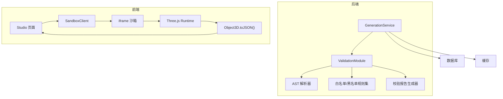
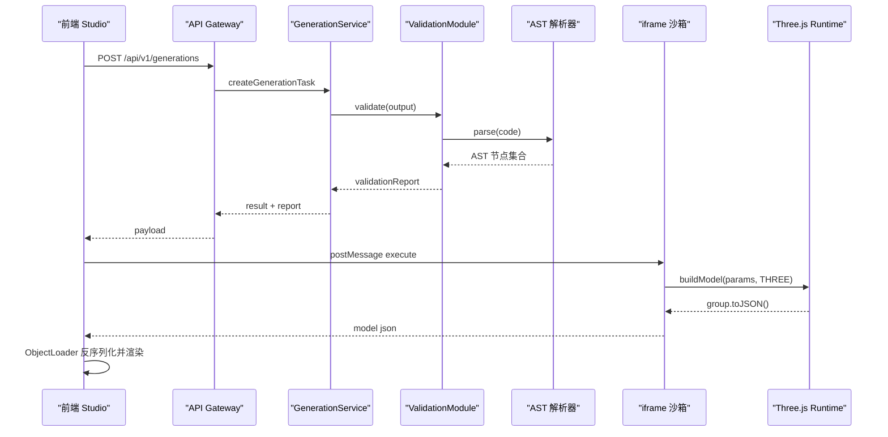
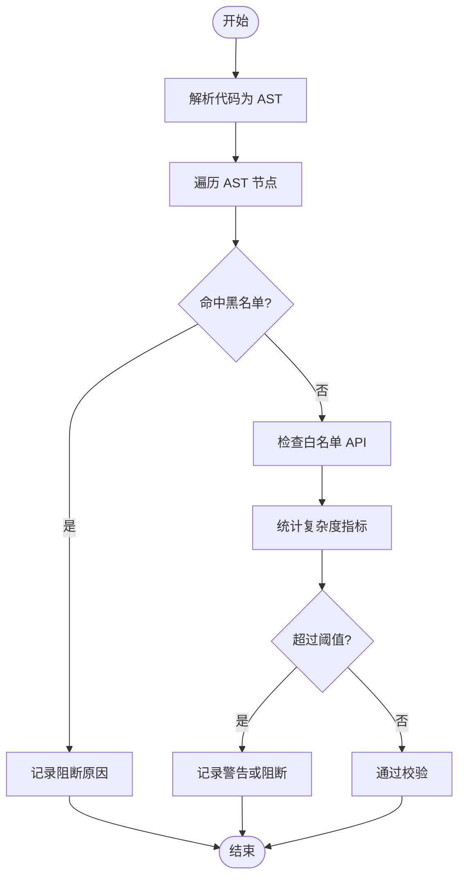
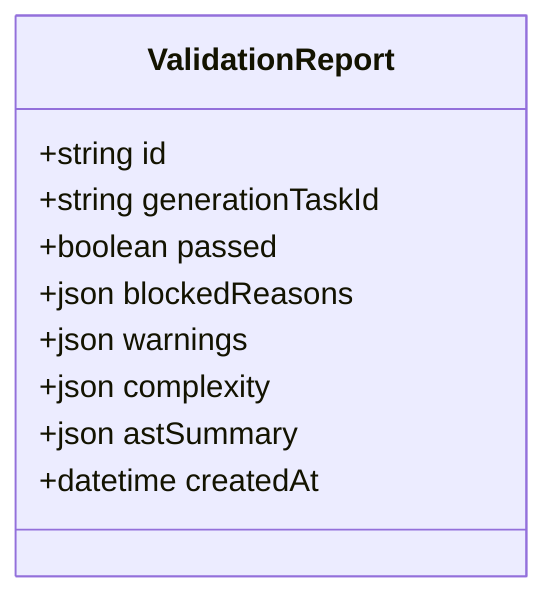
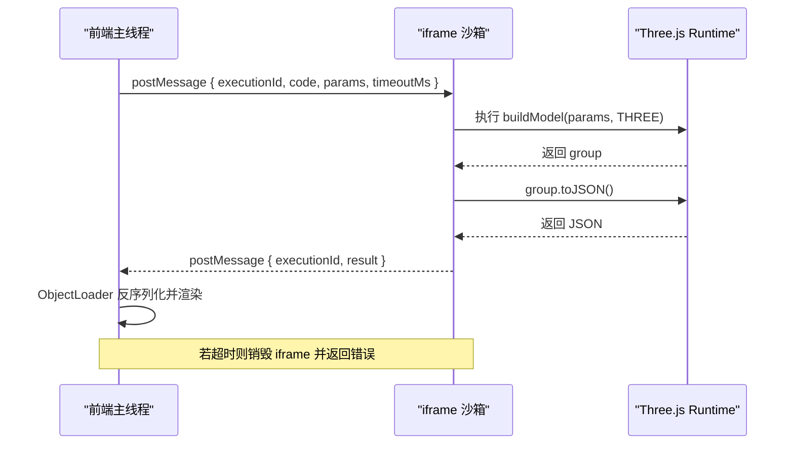
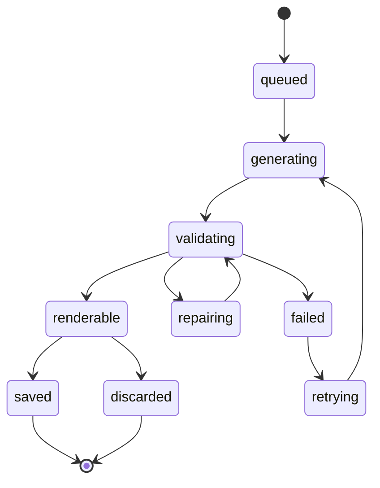
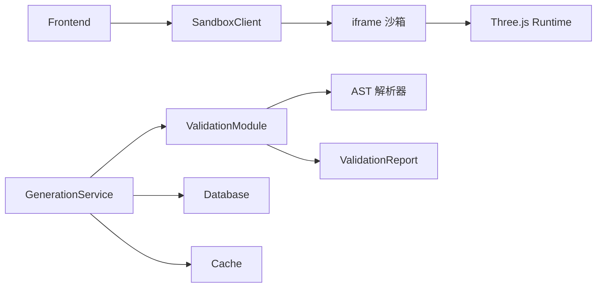

# 代码安全校验模块 (ValidationModule)

<cite>
**本文引用的文件**   
- [产品技术设计文档](file://tech/product-technical-design.md)
- [产品需求文档](file://prd.md)
</cite>

## 目录
1. [引言](#引言)
2. [项目结构](#项目结构)
3. [核心组件](#核心组件)
4. [架构总览](#架构总览)
5. [详细组件分析](#详细组件分析)
6. [依赖关系分析](#依赖关系分析)
7. [性能考量](#性能考量)
8. [故障排查指南](#故障排查指南)
9. [结论](#结论)
10. [附录](#附录)

## 引言
本章节为 ApexForge 平台的“代码安全校验模块（ValidationModule）”提供系统化、可落地的设计与实现说明。该模块贯穿服务端与前端，负责 AI 生成代码的安全性与质量保障，包括：AST 语法树分析、白名单 API 检查、复杂度评估与安全规则验证；黑名单检测、运行时沙箱集成、超时控制与内存保护；以及校验报告生成、警告信息收集与修复建议。同时给出安全策略配置、自定义规则扩展与性能调优指南，帮助工程团队在 MVP 到平台化阶段稳定落地。

## 项目结构
根据技术设计文档的推荐目录结构，ValidationModule 在后端 NestJS 中位于 modules/validation，并在 packages/code-validator 中沉淀可复用的校验能力。前端侧通过 SandboxClient 与 iframe 沙箱交互，结合 SceneManager 完成模型加载与可视化。

图表来源
- [产品技术设计文档:576-610](file://tech/product-technical-design.md#L576-L610)
- [产品技术设计文档:472-518](file://tech/product-technical-design.md#L472-L518)

章节来源
- [产品技术设计文档:1001-1036](file://tech/product-technical-design.md#L1001-L1036)

## 核心组件
- 输出协议校验器：确保 LLM 返回的结构符合 JSON 协议，包含 mode、templateId、params、code 等字段。
- 文本黑名单扫描器：快速阻断明显危险调用与关键字。
- AST 白名单校验器：基于 AST 精确限制 API、语法结构与复杂度指标。
- 复杂度评估器：统计代码长度、AST 深度、循环层数、Mesh/几何体数量、顶点估算等。
- 校验报告生成器：汇总阻断原因、警告项、复杂度指标与 AST 摘要，持久化为 ValidationReport。
- 沙箱客户端（前端）：管理 postMessage 通信、执行超时、错误映射与结果反序列化。
- 沙箱运行时（iframe）：受限环境执行 buildModel，仅暴露 THREE 与必要工具函数。

章节来源
- [产品技术设计文档:428-470](file://tech/product-technical-design.md#L428-L470)
- [产品技术设计文档:472-518](file://tech/product-technical-design.md#L472-L518)
- [产品技术设计文档:539-571](file://tech/product-technical-design.md#L539-L571)

## 架构总览
校验分层覆盖从服务端到前端的完整链路，形成“协议校验 → 文本黑名单 → AST 白名单 → 沙箱执行 → 结果校验”的多层防线。

图表来源
- [产品技术设计文档:359-391](file://tech/product-technical-design.md#L359-L391)
- [产品技术设计文档:472-518](file://tech/product-technical-design.md#L472-L518)

## 详细组件分析

### 组件一：AST 白名单与黑名单校验器
- 功能要点
  - 黑名单 API：动态执行（eval、Function、字符串参数定时器）、网络访问（fetch、XMLHttpRequest、WebSocket、EventSource、navigator.sendBeacon）、DOM 访问（document、window.top、window.parent、localStorage、sessionStorage）、动态加载（import、importScripts、require）、原型污染、计算风险（无限循环、过深嵌套）。
  - 白名单 API：基础变量声明、函数声明、对象/数组字面量、Math 白名单方法、THREE.Group 及基础几何体/材质构造器、安全的组与变换方法。
  - 复杂度限制：最大代码长度、AST 深度、循环层数、Mesh 数量、几何体顶点估算、全局变量白名单。
- 数据结构与复杂度
  - AST 遍历采用深度优先或广度优先，时间复杂度 O(N)，N 为 AST 节点数；空间复杂度取决于递归栈与中间集合。
  - 对关键节点（CallExpression、NewExpression、MemberExpression、ForStatement、WhileStatement、IfStatement 等）进行计数与阈值比较。
- 优化建议
  - 预编译正则与规则表，减少重复匹配开销。
  - 对热点路径（如循环与函数调用）做增量统计，避免全量二次遍历。
  - 将复杂规则拆分为独立 Pass，按需启用，降低冷启动成本。

图表来源
- [产品技术设计文档:441-470](file://tech/product-technical-design.md#L441-L470)

章节来源
- [产品技术设计文档:441-470](file://tech/product-technical-design.md#L441-L470)

### 组件二：校验报告生成器（ValidationReport）
- 职责
  - 汇总阻断原因（blockedReasons）、警告信息（warnings）、复杂度指标（complexity）、AST 摘要（astSummary），并标记是否通过（passed）。
  - 关联任务 ID（generationTaskId），便于追溯与质量闭环。
- 数据模型
  - 字段包括 id、generationTaskId、passed、blockedReasons、warnings、complexity、astSummary、createdAt。
- 使用场景
  - 生成失败时用于定位问题（例如：检测到 fetch 调用、循环层数超限）。
  - 质量评分输入之一，辅助 Prompt 与模板优化。

图表来源
- [产品技术设计文档:298-310](file://tech/product-technical-design.md#L298-L310)

章节来源
- [产品技术设计文档:298-310](file://tech/product-technical-design.md#L298-L310)

### 组件三：沙箱运行时与超时控制（iframe）
- 隔离方案
  - 隐藏 iframe，sandbox="allow-scripts"，CSP 仅允许内联脚本与指定 CDN 的 Three.js。
  - 主线程通过 postMessage 发送 { executionId, code, params, timeoutMs }。
  - iframe 内仅暴露 THREE、安全构建函数与 params，禁止 DOM/网络/同源访问。
- 执行流程
  - 包装并执行 buildModel(params, THREE)。
  - 成功后调用 group.toJSON()，返回结构化 JSON。
  - 主线程使用 THREE.ObjectLoader 反序列化并挂载。
  - 若执行超时或异常，销毁 iframe 并返回错误码。
- 错误分类
  - SANDBOX_TIMEOUT、SANDBOX_RUNTIME_ERROR、MODEL_JSON_INVALID、MODEL_TOO_COMPLEX、MODEL_EMPTY。

图表来源
- [产品技术设计文档:472-518](file://tech/product-technical-design.md#L472-L518)

章节来源
- [产品技术设计文档:472-518](file://tech/product-technical-design.md#L472-L518)

### 组件四：前端沙箱客户端（SandboxClient）
- 职责
  - 与 iframe 通信、超时控制、错误映射、结果反序列化。
  - 与 SceneManager 协作，完成模型居中、缩放与自动适配视角。
- 关键能力
  - 创建/销毁 iframe、监听 postMessage、设置执行超时、捕获运行时报错。
  - 将模型 JSON 交由 ObjectLoader 加载，并触发渲染管线更新。

章节来源
- [产品技术设计文档:539-571](file://tech/product-technical-design.md#L539-L571)

### 组件五：后端 GenerationService 中的校验编排
- 内部结构
  - GenerationController -> GenerationService -> Validator -> RepairService -> QualityScorer -> Repository。
  - 校验失败时可进入 repairing 状态，尝试自动修复后再次校验。
- 状态机
  - queued -> generating -> validating -> renderable/saved/failed/repairing/retrying。

图表来源
- [产品技术设计文档:342-357](file://tech/product-technical-design.md#L342-L357)
- [产品技术设计文档:594-610](file://tech/product-technical-design.md#L594-L610)

章节来源
- [产品技术设计文档:594-610](file://tech/product-technical-design.md#L594-L610)

## 依赖关系分析
- 模块耦合
  - ValidationModule 依赖 AST 解析器与规则集，输出 ValidationReport。
  - GenerationService 编排校验、修复与评分，并与数据库和缓存交互。
  - 前端 SandboxClient 与 iframe 沙箱强耦合，受限于 CSP 与 sandbox 属性。
- 外部依赖
  - AST 解析器（Babel/Acorn 等）。
  - 浏览器原生 API（postMessage、ObjectLoader、setTimeout 等）。
  - 数据库（SQLite/PostgreSQL）与缓存（Redis/内存）。

图表来源
- [产品技术设计文档:576-610](file://tech/product-technical-design.md#L576-L610)
- [产品技术设计文档:472-518](file://tech/product-technical-design.md#L472-L518)

章节来源
- [产品技术设计文档:576-610](file://tech/product-technical-design.md#L576-L610)

## 性能考量
- 服务端
  - 相似 Prompt 缓存复用，减少 LLM 调用与校验开销。
  - 模板模式优先，跳过代码生成，直接参数渲染。
  - 校验规则按 Pass 拆分，按需启用，降低冷启动与遍历成本。
- 前端
  - 动态加载 Three.js 与沙箱 runtime，首屏体积最小化。
  - 大模型 JSON 解析放入 Worker，主线程专注渲染。
  - 旧模型释放 geometry/material/texture，避免内存泄漏。
  - InstancedMesh 批量渲染重复元素，降低绘制调用。

章节来源
- [产品技术设计文档:933-958](file://tech/product-technical-design.md#L933-L958)
- [产品技术设计文档:563-571](file://tech/product-technical-design.md#L563-L571)

## 故障排查指南
- 常见错误码与处理
  - SANDBOX_TIMEOUT：执行超时，提示用户模型过于复杂或系统已终止渲染。
  - SANDBOX_RUNTIME_ERROR：运行时报错，提示可重试或调整描述。
  - MODEL_JSON_INVALID：返回结构非法，系统将重新生成。
  - MODEL_TOO_COMPLEX：复杂度超限，建议降级或使用模板模式。
  - MODEL_EMPTY：未生成有效对象，需补充主体描述。
- 日志与追踪
  - 每个请求携带 traceId，贯穿前端、网关、服务、校验、数据库与沙箱执行。
  - 记录耗时、状态、错误码、质量分，便于告警与复盘。
- 告警规则
  - 生成失败率过高、LLM 延迟过高、校验失败突增、沙箱超时突增、API 错误率过高。

章节来源
- [产品技术设计文档:508-518](file://tech/product-technical-design.md#L508-L518)
- [产品技术设计文档:868-908](file://tech/product-technical-design.md#L868-L908)

## 结论
ValidationModule 通过多层校验与沙箱隔离，构建了从服务端到前端的完整安全防线。AST 白名单与黑名单机制、复杂度评估与校验报告体系，为 AI 生成代码的可控性提供了坚实基础。配合沙箱超时控制与内存保护，平台可在保证用户体验的同时，有效规避安全风险。后续可通过规则扩展、性能调优与质量闭环持续增强稳定性与生成质量。

## 附录

### 安全策略配置清单
- 代码注入防护：禁用 eval/Function/字符串定时器；沙箱无网络权限。
- LLM 输出过滤：正则黑名单 + AST 扫描 + token 上限。
- API 安全：JWT 认证 + Rate Limiting + 输入长度限制 + ORM 防注入。
- 内容合规：Prompt 敏感词过滤；生成模型不含品牌标志或违规符号。
- 基础设施：K8s NetworkPolicy 隔离；Secret 管理密钥。

章节来源
- [产品技术设计文档:143-152](file://tech/product-technical-design.md#L143-L152)

### 自定义规则添加指南
- 新增黑名单 API：在规则集中追加匹配项，并通过单元测试覆盖恶意样本。
- 新增白名单 API：明确允许的方法与构造器，限定参数范围与返回值类型。
- 新增复杂度阈值：在评估器中增加维度（如递归深度、分支因子），并定义默认阈值与告警级别。
- 发布与回滚：规则版本化管理，支持灰度与快速回滚。

章节来源
- [产品技术设计文档:441-470](file://tech/product-technical-design.md#L441-L470)

### 性能调优建议
- 服务端
  - 相似 Prompt 向量相似度 > 0.95 时直接复用结果。
  - 模板模式优先，减少 LLM 调用。
  - 校验规则按需启用，热点路径增量统计。
- 前端
  - 模型加载前复杂度阈值检查，超限提示降级。
  - 旧模型资源释放与 LOD 策略。
  - 使用 InstancedMesh 与 requestAnimationFrame 控制渲染。

章节来源
- [产品技术设计文档:933-958](file://tech/product-technical-design.md#L933-L958)
- [产品技术设计文档:563-571](file://tech/product-technical-design.md#L563-L571)