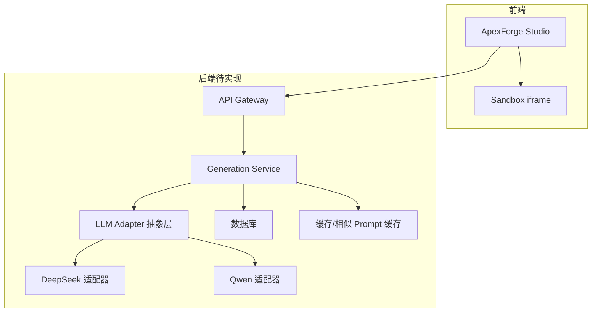
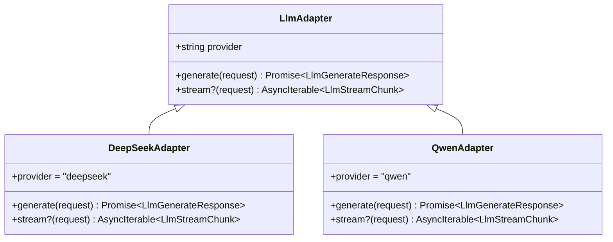
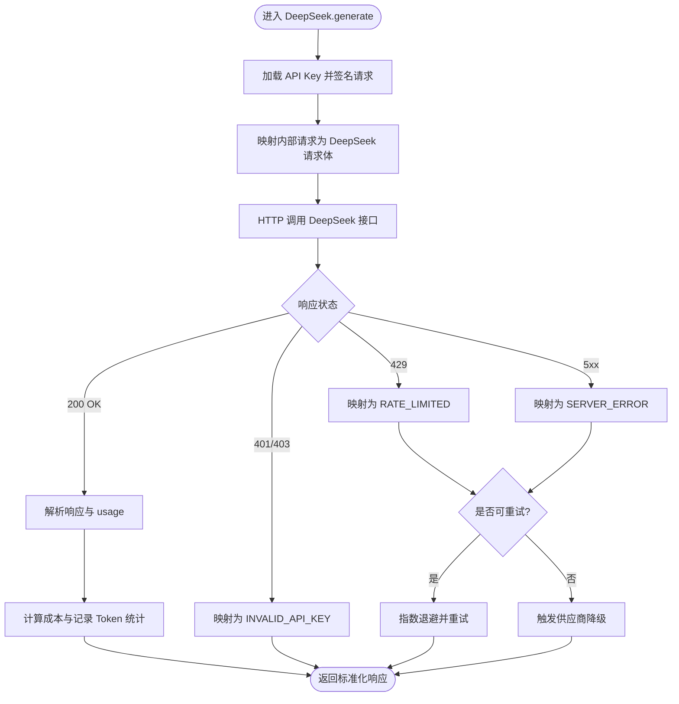
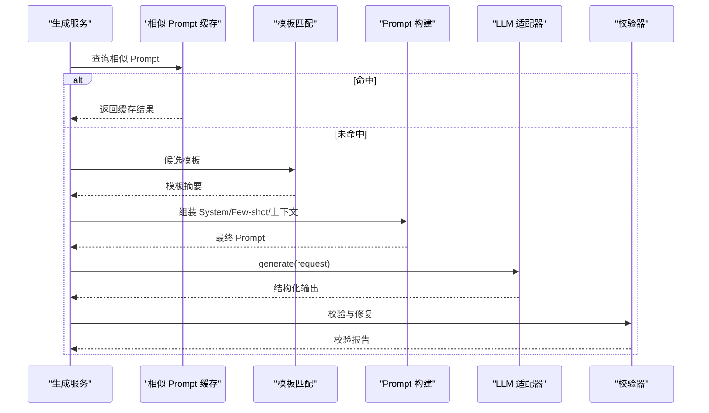
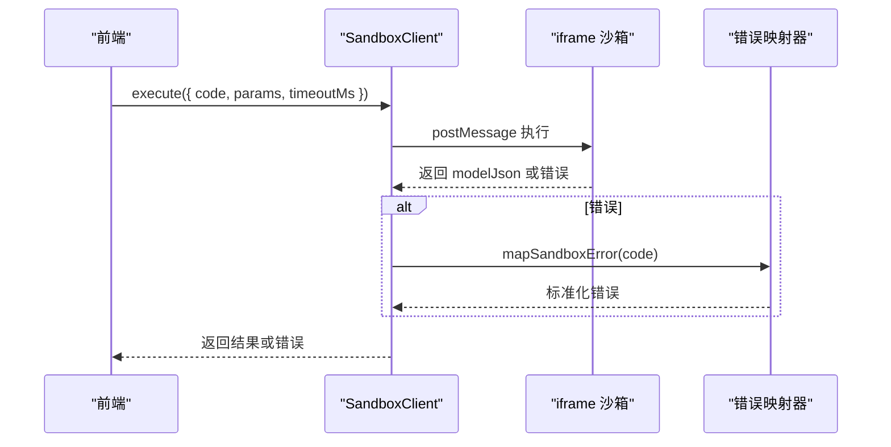
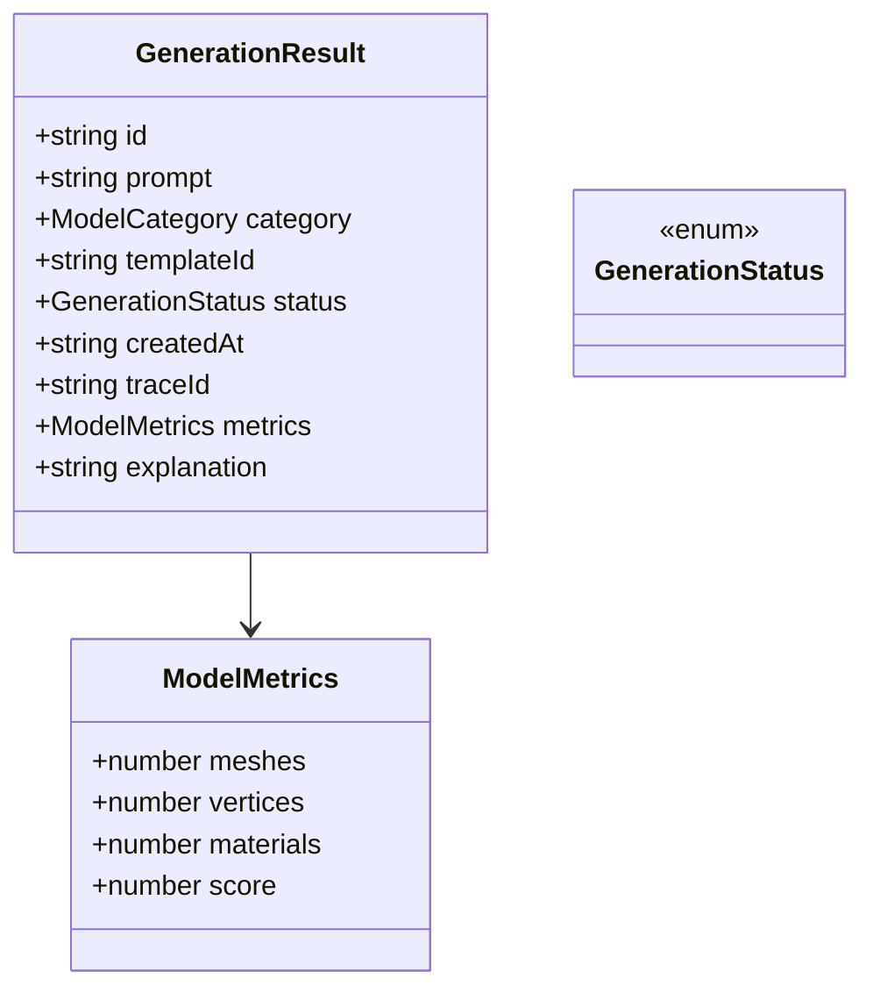
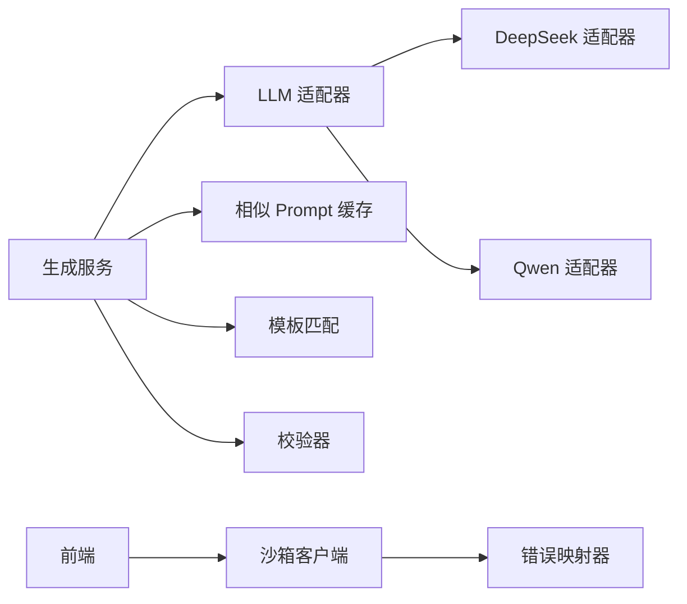

# DeepSeek 供应商实现

<cite>
**本文引用的文件**   
- [产品技术设计文档](file://tech/product-technical-design.md)
- [产品需求文档](file://prd.md)
- [生成服务（本地模拟）](file://src/modules/studio/services/generationService.ts)
- [沙箱客户端](file://src/modules/sandbox/SandboxClient.ts)
- [错误映射器](file://src/modules/sandbox/errorMapper.ts)
- [生成类型定义](file://src/shared/types/generation.ts)
</cite>

## 目录
1. [简介](#简介)
2. [项目结构](#项目结构)
3. [核心组件](#核心组件)
4. [架构总览](#架构总览)
5. [详细组件分析](#详细组件分析)
6. [依赖关系分析](#依赖关系分析)
7. [性能与成本优化](#性能与成本优化)
8. [故障排查指南](#故障排查指南)
9. [结论](#结论)
10. [附录：配置与调试清单](#附录配置与调试清单)

## 简介
本文件为 ApexForge 平台中“DeepSeek 供应商适配器”的实现与集成说明，聚焦以下目标：
- 统一 LLM 调用接口与多供应商适配策略
- DeepSeek API 的认证、请求参数映射与响应解析
- 模型选择策略、Token 统计与成本计算
- 限流、重试、降级与错误码映射
- 可观测性与调试方法

本项目当前处于前端原型阶段，后端与 LLM 适配层尚未落地代码。本文基于产品与技术设计文档中的架构约定，给出面向实现的完整方案与对接规范，便于后续在 NestJS 后端中快速落地。

## 项目结构
当前仓库包含前端原型与产品/技术设计文档。与 DeepSeek 供应商适配直接相关的规划位于技术设计文档的“多供应商 LLM Adapter”章节，以及前端沙箱与生成流程的类型与服务。



图示来源
- [产品技术设计文档:38-62](file://tech/product-technical-design.md#L38-L62)
- [产品技术设计文档:574-631](file://tech/product-technical-design.md#L574-L631)

章节来源
- [产品技术设计文档:38-62](file://tech/product-technical-design.md#L38-L62)
- [产品技术设计文档:574-631](file://tech/product-technical-design.md#L574-L631)

## 核心组件
- LLM 适配器抽象层：定义统一的 generate/stream 接口与选择策略，屏蔽底层供应商差异。
- DeepSeek 适配器：实现具体到 DeepSeek 的请求构造、鉴权、参数映射、响应解析、错误码归一化、Token 统计与成本计算。
- 生成编排服务：负责 Prompt 构建、模板匹配、缓存命中、校验与质量评分，并调用 LLM 适配器。
- 前端沙箱：执行生成的 Three.js 代码，返回序列化模型数据。

章节来源
- [产品技术设计文档:611-631](file://tech/product-technical-design.md#L611-L631)
- [生成服务（本地模拟）:1-30](file://src/modules/studio/services/generationService.ts#L1-L30)
- [沙箱客户端:1-18](file://src/modules/sandbox/SandboxClient.ts#L1-L18)

## 架构总览
下图展示从用户发起生成到最终渲染的端到端流程，其中 LLM 层通过适配器选择 DeepSeek 或其他模型。

```mermaid
sequenceDiagram
participant U as "用户"
participant FE as "前端"
participant API as "API 网关"
participant GEN as "生成服务"
participant LLM as "LLM 适配器"
participant DS as "DeepSeek 适配器"
participant VAL as "校验器"
participant BOX as "沙箱 iframe"
U->>FE : 输入描述并点击生成
FE->>API : POST /api/v1/generations
API->>GEN : 创建任务
GEN->>GEN : 相似 Prompt 缓存查询
alt 命中缓存
GEN-->>API : 返回缓存结果
else 未命中
GEN->>LLM : 调用 generate(request)
LLM->>DS : 构造 DeepSeek 请求并发送
DS-->>LLM : 返回结构化输出
LLM-->>GEN : 标准化响应
GEN->>VAL : 安全与复杂度校验
VAL-->>GEN : 校验报告
end
GEN-->>API : 返回任务结果
API-->>FE : 推送结果
FE->>BOX : 在 iframe 中执行代码
BOX-->>FE : 返回模型 JSON
```

图示来源
- [产品技术设计文档:362-391](file://tech/product-technical-design.md#L362-L391)
- [产品技术设计文档:611-631](file://tech/product-technical-design.md#L611-L631)

## 详细组件分析

### LLM 适配器抽象层
- 统一接口
  - provider：标识供应商名称
  - generate(request)：同步返回生成结果
  - stream?(request)：可选流式返回
- 选择策略
  - 按任务类型选择模型（代码生成、参数生成、Prompt 改写）
  - 按成本与延迟选择供应商
  - 失败重试与供应商降级
  - 记录 token、耗时、错误码与质量指标



图示来源
- [产品技术设计文档:611-631](file://tech/product-technical-design.md#L611-L631)

章节来源
- [产品技术设计文档:611-631](file://tech/product-technical-design.md#L611-L631)

### DeepSeek 适配器实现要点
- 认证机制
  - 使用环境变量或密钥管理服务注入 API Key
  - 请求头携带 Authorization: Bearer <API_KEY>
- 请求参数映射
  - 将内部 LlmGenerateRequest 映射为 DeepSeek 聊天接口所需字段（如 model、messages、temperature、max_tokens、top_p、frequency_penalty、presence_penalty、tools/function_call 等）
  - 支持流式与非流式两种模式
- 响应数据解析
  - 将 DeepSeek 返回的结构化内容转换为内部 LlmGenerateResponse
  - 提取文本、工具调用、usage（token 统计）等
- Token 统计与成本计算
  - 读取 usage.prompt_tokens、usage.completion_tokens、usage.total_tokens
  - 根据模型定价表计算本次成本（可按 prompt/completion 分别计价）
- 限流与重试
  - 令牌桶/滑动窗口限流，按用户或租户维度
  - 指数退避重试，针对 429/5xx 等临时错误
- 错误码映射
  - 将 DeepSeek 错误码映射为平台统一错误码（如 INVALID_API_KEY、RATE_LIMITED、MODEL_NOT_FOUND、SERVER_ERROR）
- 降级策略
  - 当 DeepSeek 不可用或持续高错误率时，自动切换至备用供应商（如 Qwen）
  - 降级后继续记录 traceId 与质量指标，保证链路可追踪



图示来源
- [产品技术设计文档:611-631](file://tech/product-technical-design.md#L611-L631)

章节来源
- [产品技术设计文档:611-631](file://tech/product-technical-design.md#L611-L631)

### 生成编排与 Prompt 构建
- 生成模式优先级：Cache Mode → Template Mode → Hybrid Mode → Code Mode
- Prompt 编排
  - System Prompt 约束输出协议与安全边界
  - Few-shot 示例提升稳定性
  - 输出协议包含 mode、templateId、params、code、explanation、warnings
- 校验与修复
  - 服务端进行 JSON 协议校验、黑名单扫描、AST 白名单校验
  - 失败时可触发 RepairService 自动修复并重试



图示来源
- [产品技术设计文档:362-391](file://tech/product-technical-design.md#L362-L391)
- [产品技术设计文档:392-425](file://tech/product-technical-design.md#L392-L425)

章节来源
- [产品技术设计文档:362-391](file://tech/product-technical-design.md#L362-L391)
- [产品技术设计文档:392-425](file://tech/product-technical-design.md#L392-L425)

### 前端沙箱与错误映射
- SandboxClient 提供 execute 接口，用于在 iframe 中执行生成的 JS 代码
- errorMapper 将运行时错误映射为统一错误码，便于前端提示与重试



图示来源
- [沙箱客户端:1-18](file://src/modules/sandbox/SandboxClient.ts#L1-L18)
- [错误映射器:1-?:1-200](file://src/modules/sandbox/errorMapper.ts#L1-L200)

章节来源
- [沙箱客户端:1-18](file://src/modules/sandbox/SandboxClient.ts#L1-L18)
- [错误映射器:1-?:1-200](file://src/modules/sandbox/errorMapper.ts#L1-L200)

### 类型与数据结构
- GenerationResult 与 GenerationStatus 定义了生成任务的状态与指标
- ModelMetrics 包含 meshes、vertices、materials、score 等关键指标



图示来源
- [生成类型定义:1-29](file://src/shared/types/generation.ts#L1-L29)

章节来源
- [生成类型定义:1-29](file://src/shared/types/generation.ts#L1-L29)

## 依赖关系分析
- 生成服务依赖 LLM 适配器抽象层，适配器再依赖具体供应商（DeepSeek/Qwen）
- 生成服务依赖缓存、模板匹配、校验与质量评分模块
- 前端依赖沙箱执行与错误映射



图示来源
- [产品技术设计文档:594-610](file://tech/product-technical-design.md#L594-L610)
- [产品技术设计文档:611-631](file://tech/product-technical-design.md#L611-L631)

章节来源
- [产品技术设计文档:594-610](file://tech/product-technical-design.md#L594-L610)
- [产品技术设计文档:611-631](file://tech/product-technical-design.md#L611-L631)

## 性能与成本优化
- 模型选择策略
  - 简单变体优先走模板模式或参数化生成，避免 LLM 调用
  - 复杂自由生成使用 DeepSeek 强代码能力模型；对成本敏感场景可回退至 Qwen
- 缓存与去重
  - 相似 Prompt 缓存命中率提升，减少重复 LLM 调用
- 流式输出
  - 采用流式接口降低首字节延迟，提升用户体验
- Token 与成本监控
  - 记录每次调用的 prompt/completion/total tokens，结合定价表计算成本
  - 设置预算阈值与告警，防止异常消耗
- 限流与熔断
  - 令牌桶限流保护上游服务
  - 连续错误率超过阈值触发熔断，自动降级至备用供应商

[本节为通用指导，不直接分析具体文件]

## 故障排查指南
- 常见错误码映射
  - INVALID_API_KEY：检查密钥配置与权限
  - RATE_LIMITED：调整限流策略或等待退避
  - MODEL_NOT_FOUND：确认模型名与版本可用
  - SERVER_ERROR：查看上游日志与重试次数
- 重试与降级
  - 指数退避重试，最大重试次数可配置
  - 连续失败触发降级，记录 traceId 以便定位
- 前端沙箱问题
  - SANDBOX_TIMEOUT：模型过于复杂，建议简化或改用模板模式
  - SANDBOX_RUNTIME_ERROR：检查生成代码是否符合白名单
  - MODEL_JSON_INVALID：重新生成或人工修复
- 可观测性
  - 全链路 traceId 贯穿前端、网关、生成服务、LLM 适配器与数据库
  - 记录耗时、错误码、Token 用量与质量评分

章节来源
- [产品技术设计文档:508-518](file://tech/product-technical-design.md#L508-L518)
- [产品技术设计文档:611-631](file://tech/product-technical-design.md#L611-L631)

## 结论
通过统一的 LLM 适配器抽象与 DeepSeek 适配器实现，ApexForge 可在保持前端稳定性的同时，灵活接入多种大模型供应商。配合缓存、模板、校验与质量评分体系，平台能够在安全性、稳定性与成本之间取得良好平衡。后续建议在 NestJS 后端中落地上述适配器与编排逻辑，完善可观测与计费统计，逐步推进企业级部署。

[本节为总结，不直接分析具体文件]

## 附录：配置与调试清单
- 环境变量
  - DEEPSEEK_API_KEY：DeepSeek API 密钥
  - DEEPSEEK_MODEL：默认模型名（如 deepseek-coder-v2）
  - DEEPSEEK_BASE_URL：API 基础地址（如需代理或自定义域名）
  - DEEPSEEK_TIMEOUT_MS：请求超时时间
  - DEEPSEEK_MAX_RETRIES：最大重试次数
  - DEEPSEEK_RATE_LIMIT_RPM：每分钟请求上限
- 适配器配置项
  - temperature/top_p/frequency_penalty/presence_penalty：控制生成多样性与稳定性
  - max_tokens：限制输出长度，避免过长代码
  - tools/function_call：启用函数调用以支持模板参数生成
- 调试方法
  - 开启详细日志，记录请求体与响应体（脱敏）
  - 使用 traceId 串联前后端与 LLM 调用
  - 对比不同模型的输出质量与成本，建立回归测试集
  - 在前端沙箱中打印执行日志，定位运行期错误

[本节为通用指导，不直接分析具体文件]