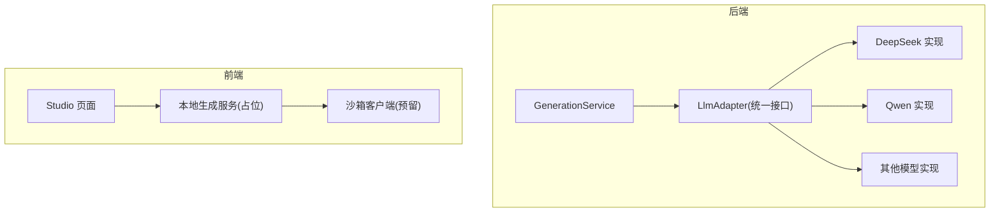
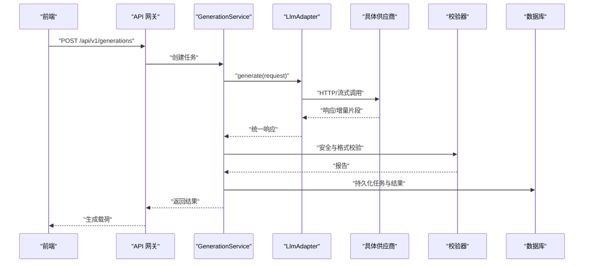
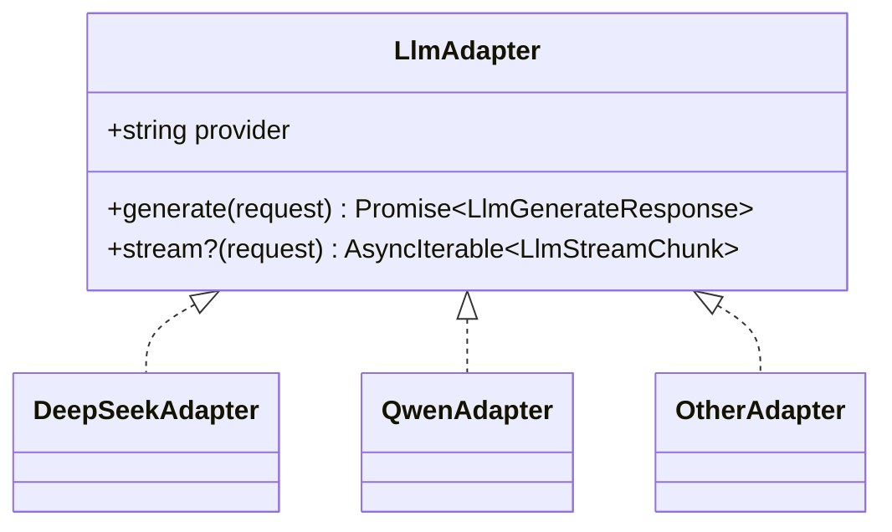
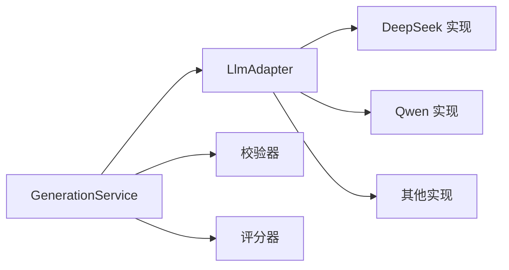
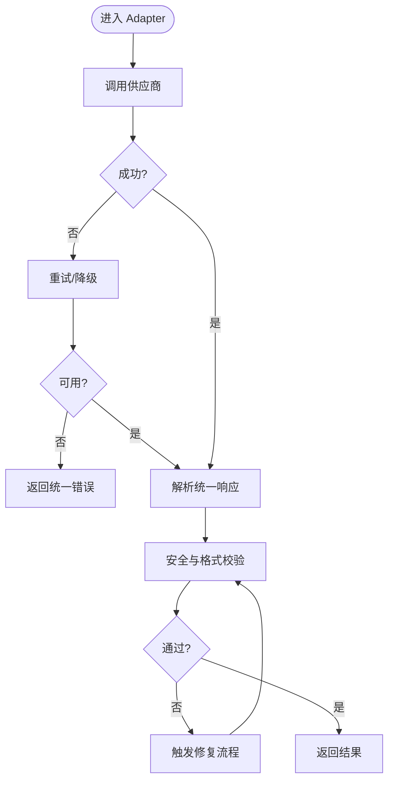

# LLM 适配器接口设计

<cite>
**本文引用的文件**   
- [product-technical-design.md](file://tech/product-technical-design.md)
- [prd.md](file://prd.md)
- [generation.ts](file://src/shared/types/generation.ts)
- [common.ts](file://src/shared/types/common.ts)
- [SandboxClient.ts](file://src/modules/sandbox/SandboxClient.ts)
- [errorMapper.ts](file://src/modules/sandbox/errorMapper.ts)
- [generationService.ts](file://src/modules/studio/services/generationService.ts)
</cite>

## 目录
1. [引言](#引言)
2. [项目结构](#项目结构)
3. [核心组件](#核心组件)
4. [架构总览](#架构总览)
5. [详细组件分析](#详细组件分析)
6. [依赖关系分析](#依赖关系分析)
7. [性能与超时控制](#性能与超时控制)
8. [错误处理策略](#错误处理策略)
9. [接口版本与兼容性](#接口版本与兼容性)
10. [新供应商接入指南](#新供应商接入指南)
11. [测试用例建议](#测试用例建议)
12. [结论](#结论)

## 引言
本文件面向 ApexForge 的 LLM 适配层，定义统一的 LlmAdapter 接口、统一请求/响应数据结构、流式处理契约，并给出错误处理、超时控制、版本管理与向后兼容策略。同时提供新供应商接入步骤与测试建议，确保多模型供应商可插拔、可观测、可回退。

## 项目结构
- 后端（NestJS）将引入 LlmModule，负责多供应商适配；GenerationService 通过 LlmAdapter 调用具体实现。
- 前端在 MVP 阶段使用本地模板模拟生成，后续将对接服务端 API 并通过沙箱执行 AI 返回代码。
- 文档中涉及的后端接口与数据模型以技术设计为准，前端类型用于展示链路状态与指标。

图表来源
- [product-technical-design.md:594-631](file://tech/product-technical-design.md#L594-L631)
- [generationService.ts:1-30](file://src/modules/studio/services/generationService.ts#L1-L30)
- [SandboxClient.ts:1-18](file://src/modules/sandbox/SandboxClient.ts#L1-L18)

章节来源
- [product-technical-design.md:574-631](file://tech/product-technical-design.md#L574-L631)
- [prd.md:126-154](file://prd.md#L126-L154)

## 核心组件
- LlmAdapter：统一抽象，屏蔽不同供应商差异，暴露 generate 与可选 stream 方法。
- LlmGenerateRequest：统一入参，包含模型选择、Prompt 上下文、输出协议约束、超时等。
- LlmGenerateResponse：统一出参，包含模式、模板/参数/代码、质量提示、追踪信息等。
- LlmStreamChunk：流式增量片段，支持 SSE/WebSocket 推送。
- 通用响应包装 ApiResponse 与 AppError：保证全链路 traceId 与错误结构一致。

章节来源
- [product-technical-design.md:611-631](file://tech/product-technical-design.md#L611-L631)
- [common.ts:1-11](file://src/shared/types/common.ts#L1-L11)

## 架构总览
LLM 适配器位于 GenerationService 与外部模型之间，承担路由、重试、降级、度量与协议转换职责。

图表来源
- [product-technical-design.md:359-390](file://tech/product-technical-design.md#L359-L390)
- [product-technical-design.md:611-631](file://tech/product-technical-design.md#L611-L631)

## 详细组件分析

### LlmAdapter 接口定义
- provider：标识供应商名称，便于日志与监控。
- generate(request)：同步阻塞式调用，返回统一响应。
- stream?(request)：可选流式接口，返回增量片段迭代器，供 SSE/WebSocket 消费。

图表来源
- [product-technical-design.md:611-631](file://tech/product-technical-design.md#L611-L631)

章节来源
- [product-technical-design.md:611-631](file://tech/product-technical-design.md#L611-L631)

### 统一请求结构 LlmGenerateRequest
字段说明（示例字段，实际以内部 DTO 为准）：
- model：目标模型标识或供应商路由键。
- prompt：用户原始输入与系统提示的组合文本。
- mode：template | code | hybrid，决定输出协议分支。
- templateId：当 mode=template/hybrid 时指定模板。
- params：模板参数对象（可选）。
- outputSchema：期望输出的结构化协议版本。
- timeoutMs：最大等待时间（毫秒），用于服务端限流与熔断。
- traceId：全链路追踪 ID。
- metadata：扩展信息（如 quality/style 偏好）。

设计要点：
- 所有必填字段具备默认值或校验失败快速拒绝。
- 通过 outputSchema 与 version 字段支撑协议演进。
- 通过 timeoutMs 驱动下游 HTTP 超时与上游 SSE 心跳。

章节来源
- [product-technical-design.md:611-631](file://tech/product-technical-design.md#L611-L631)

### 统一响应结构 LlmGenerateResponse
字段说明（示例字段，实际以内部 DTO 为准）：
- mode：template | code | hybrid。
- templateId：命中的模板 ID。
- params：生成的参数对象。
- code：生成的 Three.js 函数代码（仅 code/hybrid 模式）。
- explanation：简要说明。
- warnings：警告列表（如复杂度、潜在风险）。
- metrics：基础指标（token 用量、耗时等）。
- traceId：全链路追踪 ID。

解析机制：
- 先按 mode 分支解析，再校验 JSON 结构与白名单字段。
- 对 code 分支进行 AST 扫描与黑名单匹配。
- 对 params 分支进行 Schema 校验。

章节来源
- [product-technical-design.md:611-631](file://tech/product-technical-design.md#L611-L631)

### 流式处理接口设计
- stream(request) 返回 AsyncIterable<LlmStreamChunk>。
- LlmStreamChunk 至少包含：
  - delta：增量内容（文本/JSON 片段）。
  - done：是否结束。
  - usage：累计 token 统计（可选）。
  - error：错误码（可选）。
- 上层可将流转换为 SSE 事件或 WebSocket 帧，保持 traceId 透传。

章节来源
- [product-technical-design.md:611-631](file://tech/product-technical-design.md#L611-L631)

### 统一请求/响应封装与错误结构
- ApiResponse<T>：统一包裹 data 与 traceId。
- AppError：统一错误码、消息与详情数组。
- 所有对外接口必须携带 traceId，便于定位问题。

章节来源
- [common.ts:1-11](file://src/shared/types/common.ts#L1-L11)

### 前端生成链路（MVP 占位）
- 当前前端使用本地模板模拟生成，返回 GenerationResult，包含 traceId、status、metrics 等。
- 后续将替换为真实 LLM 调用，并保持相同的数据结构以便 UI 复用。

章节来源
- [generation.ts:1-29](file://src/shared/types/generation.ts#L1-L29)
- [generationService.ts:1-30](file://src/modules/studio/services/generationService.ts#L1-L30)

## 依赖关系分析
- GenerationService 依赖 LlmAdapter 抽象，不感知具体供应商。
- LlmAdapter 的具体实现依赖各自 SDK/HTTP 客户端。
- 校验器与评分器在 Adapter 之后消费统一响应。
- 前端通过统一 API 与后端交互，不直接依赖 LLM。

图表来源
- [product-technical-design.md:594-631](file://tech/product-technical-design.md#L594-L631)

章节来源
- [product-technical-design.md:594-631](file://tech/product-technical-design.md#L594-L631)

## 性能与超时控制
- 超时控制：
  - 请求级：timeoutMs 传入 Adapter，驱动下游 HTTP 超时。
  - 流式：设置心跳与空闲超时，避免长连接挂起。
- 缓存与去重：
  - 相似 Prompt 命中缓存直接返回，减少 LLM 调用。
- 并发与限流：
  - 基于令牌桶限制每用户 QPS，保护下游供应商。
- 资源限制：
  - 限制输出长度、AST 深度、Mesh 数量等，防止复杂度过高。

章节来源
- [prd.md:126-154](file://prd.md#L126-L154)
- [product-technical-design.md:338-390](file://tech/product-technical-design.md#L338-L390)

## 错误处理策略
- 错误分类：
  - 网络/超时：重试+降级到备选供应商。
  - 协议不合法：返回结构化错误，附带 details。
  - 安全校验失败：阻断并记录审计日志。
- 错误映射：
  - 沙箱侧错误码映射为用户友好提示，便于前端展示。
- 幂等与补偿：
  - 生成任务唯一 ID，支持查询与重试。
  - 失败自动修复流程（repairing→validating）。

图表来源
- [product-technical-design.md:340-390](file://tech/product-technical-design.md#L340-L390)
- [errorMapper.ts:1-12](file://src/modules/sandbox/errorMapper.ts#L1-L12)

章节来源
- [errorMapper.ts:1-12](file://src/modules/sandbox/errorMapper.ts#L1-L12)
- [product-technical-design.md:340-390](file://tech/product-technical-design.md#L340-L390)

## 接口版本与兼容性
- 版本管理：
  - 请求/响应均带 version 或 schema 标识，服务端根据版本路由解析逻辑。
  - 新增字段采用可选字段，旧客户端忽略未知字段。
- 向后兼容：
  - 废弃字段保留但标记 deprecated，逐步移除。
  - 行为变更通过 feature flag 控制灰度。
- 回归保障：
  - 针对每个 Prompt 版本建立回归集，自动化评估质量指标。

章节来源
- [product-technical-design.md:419-425](file://tech/product-technical-design.md#L419-L425)

## 新供应商接入指南
步骤：
1. 新建实现类，继承 LlmAdapter 抽象，实现 generate 与可选 stream。
2. 配置 provider 标识与路由键，注册到供应商选择器。
3. 实现鉴权、重试、超时、计量上报与错误映射。
4. 编写单元测试与集成测试，覆盖正常、异常、超时、降级路径。
5. 灰度上线，观察延迟、成功率、成本与质量评分。

验收清单：
- 统一请求/响应结构正确解析。
- 流式增量片段顺序正确且最终完成。
- 错误码与消息符合统一规范。
- 超时与重试策略生效。
- 指标上报完整（token、耗时、错误码）。

章节来源
- [product-technical-design.md:611-631](file://tech/product-technical-design.md#L611-L631)

## 测试用例建议
- 单测
  - 请求构造与校验：必填字段缺失、超长、非法 mode。
  - 响应解析：各 mode 分支、字段缺失、类型不符。
  - 流式处理：增量拼接、中断恢复、错误片段。
  - 超时与重试：下游超时、瞬时失败、全部失败。
- 集成测试
  - 端到端：从 GenerationService 到 Adapter 再到供应商。
  - 错误注入：网络异常、协议不合法、安全拦截。
- 性能测试
  - 高并发下延迟分布、吞吐与资源占用。
  - 流式场景下的内存增长与背压处理。

章节来源
- [product-technical-design.md:611-631](file://tech/product-technical-design.md#L611-L631)

## 结论
通过 LlmAdapter 统一抽象与标准化请求/响应结构，ApexForge 实现了多供应商可插拔、可观测与可回退的 LLM 接入能力。配合严格的错误处理、超时控制与版本管理机制，平台可在保证稳定性的前提下持续扩展新的模型供应商，并为前端渲染与安全沙箱提供高质量、可控的输出。