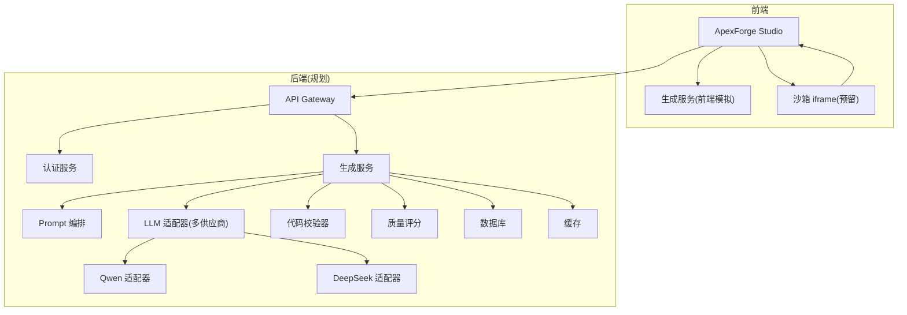
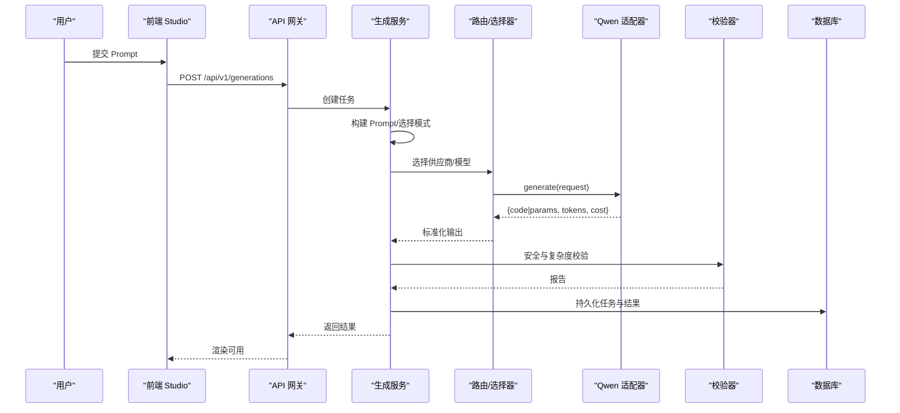
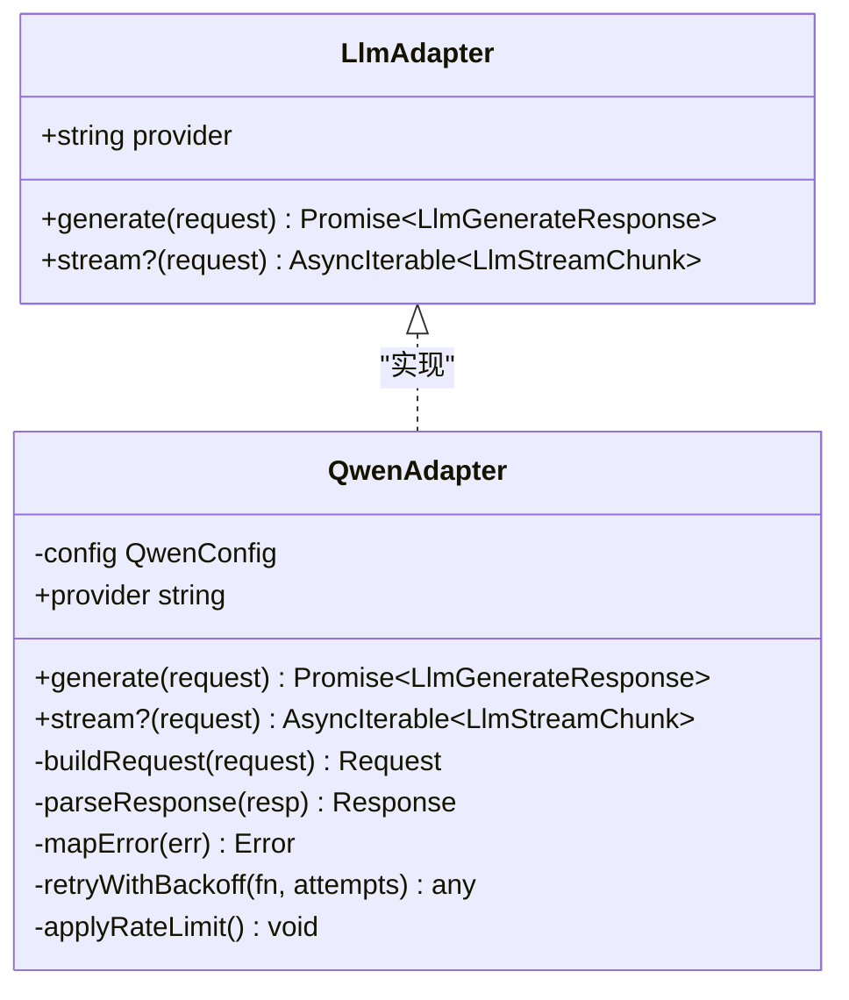
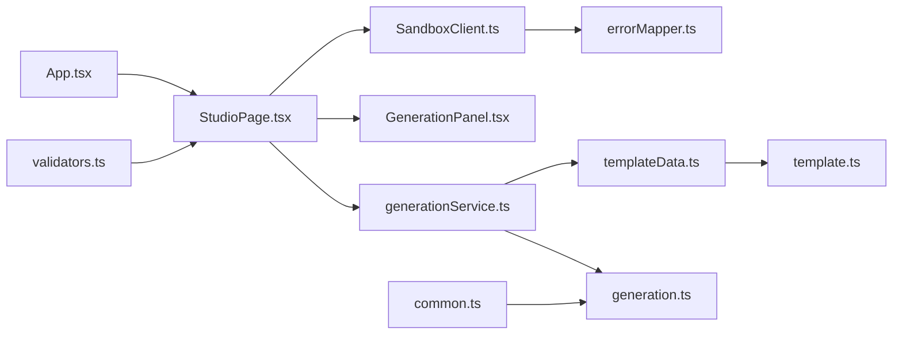

# Qwen 供应商实现

<cite>
**本文引用的文件**
- [产品技术设计文档](file://tech/product-technical-design.md)
- [prd.md](file://prd.md)
- [App.tsx](file://src/App.tsx)
- [StudioPage.tsx](file://src/modules/studio/pages/StudioPage.tsx)
- [generationService.ts](file://src/modules/studio/services/generationService.ts)
- [GenerationPanel.tsx](file://src/modules/studio/components/GenerationPanel.tsx)
- [SandboxClient.ts](file://src/modules/sandbox/SandboxClient.ts)
- [errorMapper.ts](file://src/modules/sandbox/errorMapper.ts)
- [templateData.ts](file://src/modules/templates/templateData.ts)
- [TemplateLibrary.tsx](file://src/modules/templates/TemplateLibrary.tsx)
- [generation.ts](file://src/shared/types/generation.ts)
- [template.ts](file://src/shared/types/template.ts)
- [common.ts](file://src/shared/types/common.ts)
- [validators.ts](file://src/shared/utils/validators.ts)
</cite>

## 目录
1. [引言](#引言)
2. [项目结构](#项目结构)
3. [核心组件](#核心组件)
4. [架构总览](#架构总览)
5. [详细组件分析](#详细组件分析)
6. [依赖分析](#依赖分析)
7. [性能考虑](#性能考虑)
8. [故障排查指南](#故障排查指南)
9. [结论](#结论)
10. [附录](#附录)

## 引言
本文件为 ApexForge 平台中“Qwen 供应商适配器”的实现与集成说明，聚焦以下目标：
- 明确 Qwen API 调用方式、认证机制、请求参数映射与响应解析
- 解释模型选择策略、Token 统计、成本计算与限流处理
- 提供错误码映射、重试机制、降级策略与性能优化建议
- 给出完整配置示例与调试方法

当前仓库处于 MVP 阶段，后端尚未落地，前端通过本地模板模拟生成。本文在现有代码基础上，定义 Qwen 适配器的接口契约、数据流与工程化方案，确保后续接入可插拔、可观测、可治理。

## 项目结构
MVP 前端采用 React + TypeScript，模块按功能划分；后端计划使用 NestJS，并预留多供应商 LLM Adapter 扩展点。Qwen 适配器将作为 LlmAdapter 的一个具体实现，被 Generation Service 统一编排调用。

图表来源
- [产品技术设计文档:38-100](file://tech/product-technical-design.md#L38-L100)
- [App.tsx:1-6](file://src/App.tsx#L1-L6)
- [StudioPage.tsx:99-138](file://src/modules/studio/pages/StudioPage.tsx#L99-L138)

章节来源
- [产品技术设计文档:38-100](file://tech/product-technical-design.md#L38-L100)
- [prd.md:33-53](file://prd.md#L33-L53)
- [App.tsx:1-6](file://src/App.tsx#L1-L6)
- [StudioPage.tsx:99-138](file://src/modules/studio/pages/StudioPage.tsx#L99-L138)

## 核心组件
- LlmAdapter 统一接口：定义 provider、generate、可选 stream 能力，供多供应商实现
- Qwen 适配器：基于统一接口实现 Qwen 的 HTTP 调用、鉴权、参数映射、响应解析、错误映射、重试与限流
- Generation Service：负责 Prompt 编排、模板匹配、调用 LlmAdapter、结果校验与持久化
- Sandbox 客户端：前端执行 AI 返回代码（MVP 未启用）
- 模板库：用于快速原型与回退路径

章节来源
- [产品技术设计文档:611-631](file://tech/product-technical-design.md#L611-L631)
- [generation.ts:1-29](file://src/shared/types/generation.ts#L1-L29)
- [SandboxClient.ts:1-18](file://src/modules/sandbox/SandboxClient.ts#L1-L18)
- [templateData.ts:1-54](file://src/modules/templates/templateData.ts#L1-L54)

## 架构总览
下图展示从用户输入到 Qwen 适配器调用的端到端流程，包括认证、限流、重试与降级。

图表来源
- [产品技术设计文档:362-391](file://tech/product-technical-design.md#L362-L391)
- [product-technical-design.md:611-631](file://tech/product-technical-design.md#L611-L631)

## 详细组件分析

### Qwen 适配器接口与职责
- 统一接口遵循 LlmAdapter，暴露 provider、generate、可选 stream
- 职责边界：
  - 鉴权：Bearer Token 或 API Key 注入
  - 请求构造：消息体、系统提示、工具/函数调用、温度等
  - 响应解析：结构化 JSON 协议、文本补全、流式增量
  - 指标采集：token 用量、耗时、错误码
  - 可靠性：重试、熔断、超时、限流
  - 降级：失败时回退至 DeepSeek 或其他模型

图表来源
- [产品技术设计文档:611-631](file://tech/product-technical-design.md#L611-L631)

章节来源
- [product-technical-design.md:611-631](file://tech/product-technical-design.md#L611-L631)

### 认证机制
- 推荐方式：HTTP Header Authorization: Bearer <access_token>
- 备选方式：查询参数或自定义 Header（需与网关策略一致）
- 密钥管理：通过环境变量或密钥管理服务注入，避免硬编码
- 刷新策略：支持自动续期与失败重试

章节来源
- [prd.md:149-152](file://prd.md#L149-L152)

### 请求参数映射
- 输入：
  - messages：包含 system、user、assistant 的多轮对话
  - model：根据选择策略确定具体模型名
  - temperature/top_p/max_tokens：控制生成稳定性与长度
  - tools/function_calling：如需结构化输出或函数调用
- 输出协议：
  - 优先返回结构化 JSON（mode、templateId、params、code、explanation、warnings）
  - 若返回文本，由 OutputParser 转换为协议对象

章节来源
- [product-technical-design.md:403-418](file://tech/product-technical-design.md#L403-L418)

### 响应数据解析
- 成功：
  - 解析 JSON 协议字段，校验必填项与类型
  - 提取 code/params/templateId 等关键信息
  - 记录 token 用量与耗时
- 失败：
  - 映射业务错误码与网络错误
  - 触发重试或降级

章节来源
- [product-technical-design.md:403-418](file://tech/product-technical-design.md#L403-L418)

### 模型选择策略
- 规则优先级：
  - 任务类型：代码生成、参数生成、Prompt 改写
  - 成本与延迟：低成本优先，高实时性优先
  - 质量与稳定性：复杂场景选择更强模型
- 动态切换：
  - 健康检查与成功率监控
  - 失败自动降级到其他供应商或更稳定模型

章节来源
- [product-technical-design.md:623-629](file://tech/product-technical-design.md#L623-L629)

### Token 使用统计与成本计算
- 统计维度：
  - 输入/输出 token 数、总 token、耗时(ms)、错误次数
- 成本计算：
  - 按供应商定价表折算费用
  - 结合套餐/配额进行计费与限额
- 上报与可视化：
  - 写入 Observability 指标与日志
  - 关联 traceId 便于追踪

章节来源
- [product-technical-design.md:623-629](file://tech/product-technical-design.md#L623-L629)

### 限流与重试
- 限流：
  - 令牌桶/滑动窗口限制每秒/每分钟请求数
  - 按用户/租户维度隔离
- 重试：
  - 指数退避与抖动
  - 仅对幂等且可恢复错误重试
- 熔断：
  - 连续失败阈值触发熔断，快速失败并降级

章节来源
- [prd.md:131-132](file://prd.md#L131-L132)

### 错误码映射
- 内部错误码：
  - 网络错误、鉴权失败、限流、超时、格式错误
- 业务错误码：
  - 生成失败、校验失败、模板不匹配等
- 映射策略：
  - 供应商错误码 -> 内部错误码 -> 用户友好提示
  - 保留原始错误上下文用于排障

章节来源
- [product-technical-design.md:641-652](file://tech/product-technical-design.md#L641-L652)

### 降级策略
- 供应商级降级：
  - Qwen 失败 -> 尝试 DeepSeek 或其他模型
- 模式级降级：
  - Code 模式失败 -> 回退 Template/Hybrid 模式
- 结果级降级：
  - 校验失败 -> 修复服务尝试修正后重试

章节来源
- [product-technical-design.md:623-629](file://tech/product-technical-design.md#L623-L629)

### 性能优化
- 连接池与复用：HTTP 长连接、并发控制
- 压缩与缓存：Gzip/Brotli、相似 Prompt 缓存
- 流式输出：大响应分块传输，降低首字节延迟
- 前端并行：加载 Three.js 与沙箱 runtime 异步化

章节来源
- [prd.md:155-165](file://prd.md#L155-L165)

### 配置示例
- 环境变量：
  - QWEN_BASE_URL、QWEN_API_KEY、QWEN_MODEL、QWEN_TIMEOUT_MS、QWEN_MAX_RETRIES、QWEN_RATE_LIMIT_RPM
- 运行时配置：
  - 模型选择策略、重试次数、熔断阈值、限流速率
- 安全：
  - 密钥通过 Vault 或 Secret 管理，禁止明文存储

章节来源
- [prd.md:149-152](file://prd.md#L149-L152)

### 调试方法
- 链路追踪：
  - 每个请求携带 traceId，贯穿前端、网关、生成服务、适配器
- 日志与指标：
  - 记录请求/响应摘要、token 用量、耗时、错误码
- 本地模拟：
  - 使用本地模板与 mock 适配器验证端到端流程

章节来源
- [prd.md:122-123](file://prd.md#L122-L123)
- [generation.ts:12-22](file://src/shared/types/generation.ts#L12-L22)

## 依赖分析
- 前端依赖：
  - App 入口 -> StudioPage -> generationService（本地模拟）
  - SandboxClient 预留执行能力
- 后端依赖（规划）：
  - GenerationService -> LlmAdapter -> QwenAdapter
  - ValidationModule、TemplateModule、ObservabilityModule

图表来源
- [App.tsx:1-6](file://src/App.tsx#L1-L6)
- [StudioPage.tsx:99-138](file://src/modules/studio/pages/StudioPage.tsx#L99-L138)
- [generationService.ts:1-30](file://src/modules/studio/services/generationService.ts#L1-L30)
- [GenerationPanel.tsx:1-21](file://src/modules/studio/components/GenerationPanel.tsx#L1-L21)
- [SandboxClient.ts:1-18](file://src/modules/sandbox/SandboxClient.ts#L1-L18)
- [errorMapper.ts:1-12](file://src/modules/sandbox/errorMapper.ts#L1-L12)
- [templateData.ts:1-54](file://src/modules/templates/templateData.ts#L1-L54)
- [template.ts:1-19](file://src/shared/types/template.ts#L1-L19)
- [generation.ts:1-29](file://src/shared/types/generation.ts#L1-L29)
- [common.ts:1-10](file://src/shared/types/common.ts#L1-L10)
- [validators.ts:1-13](file://src/shared/utils/validators.ts#L1-L13)

章节来源
- [App.tsx:1-6](file://src/App.tsx#L1-L6)
- [StudioPage.tsx:99-138](file://src/modules/studio/pages/StudioPage.tsx#L99-L138)
- [generationService.ts:1-30](file://src/modules/studio/services/generationService.ts#L1-L30)
- [GenerationPanel.tsx:1-21](file://src/modules/studio/components/GenerationPanel.tsx#L1-L21)
- [SandboxClient.ts:1-18](file://src/modules/sandbox/SandboxClient.ts#L1-L18)
- [errorMapper.ts:1-12](file://src/modules/sandbox/errorMapper.ts#L1-L12)
- [templateData.ts:1-54](file://src/modules/templates/templateData.ts#L1-L54)
- [template.ts:1-19](file://src/shared/types/template.ts#L1-L19)
- [generation.ts:1-29](file://src/shared/types/generation.ts#L1-L29)
- [common.ts:1-10](file://src/shared/types/common.ts#L1-L10)
- [validators.ts:1-13](file://src/shared/utils/validators.ts#L1-L13)

## 性能考虑
- 服务端：
  - 连接复用、并发控制、缓存命中优先
  - 模板模式优先，减少 LLM 调用
- 前端：
  - 动态加载与 Worker 反序列化
  - InstancedMesh 批量渲染重复元素
- 网络：
  - CDN 静态资源、压缩与增量更新

章节来源
- [prd.md:155-165](file://prd.md#L155-L165)

## 故障排查指南
- 常见问题：
  - 鉴权失败：检查密钥与 Header 注入
  - 限流触发：调整 RPM 或排队策略
  - 超时：增大超时或优化 Prompt/模型
  - 校验失败：查看 AST 黑名单与复杂度指标
- 定位手段：
  - 使用 traceId 串联日志
  - 观察指标面板中的 token 用量与错误率
  - 回放请求与响应摘要

章节来源
- [prd.md:122-123](file://prd.md#L122-L123)
- [product-technical-design.md:641-652](file://tech/product-technical-design.md#L641-L652)

## 结论
Qwen 适配器以 LlmAdapter 统一接口为核心，提供鉴权、参数映射、响应解析、指标采集、重试与限流等能力，并与 Generation Service 协同完成 Prompt 编排、模板匹配与安全校验。通过模型选择策略与降级机制，平台可在不同负载与质量需求下灵活调度，保障稳定性与成本可控。

## 附录
- 术语：
  - LlmAdapter：多供应商抽象接口
  - TraceId：全链路追踪标识
  - 模板模式：AI 仅生成参数，前端渲染
  - 代码模式：AI 生成完整 Three.js 代码
- 参考：
  - 生成链路时序与状态机
  - 前端沙箱与执行流程