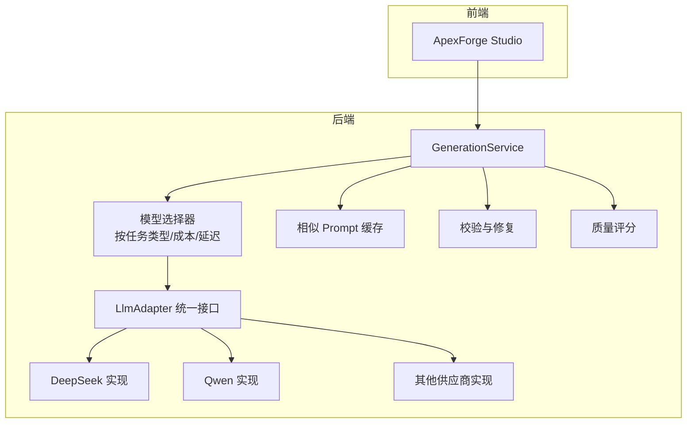
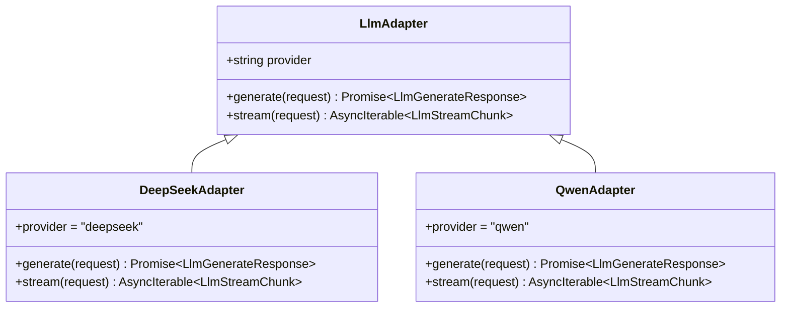
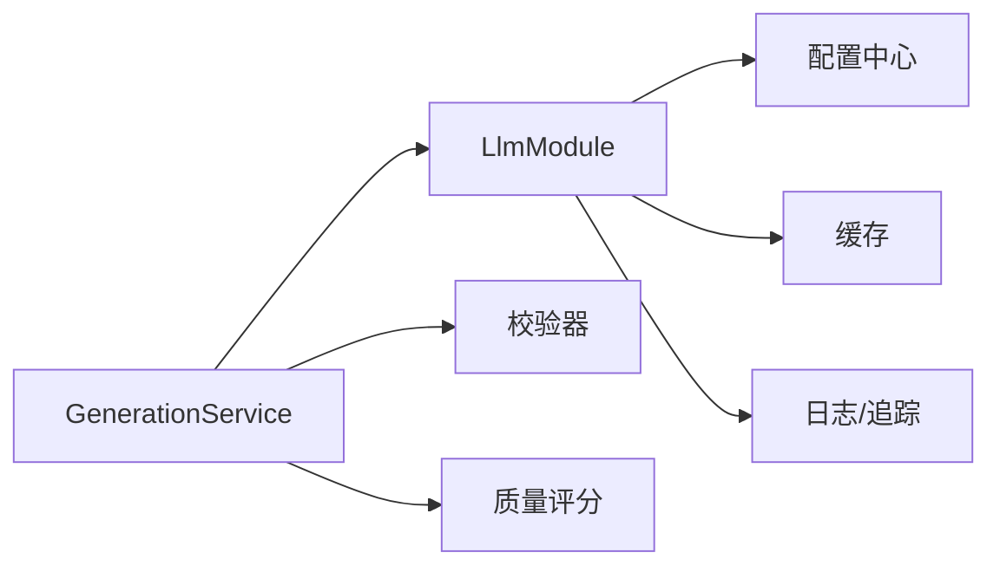
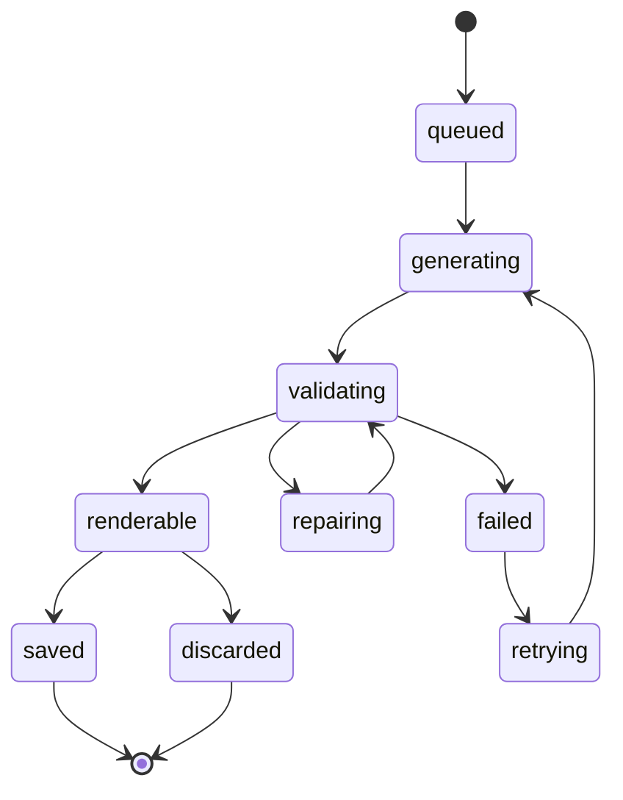

# 多供应商 LLM 适配模块 (LlmModule)

<cite>
**本文引用的文件**
- [tech/product-technical-design.md](file://tech/product-technical-design.md)
- [prd.md](file://prd.md)
- [src/modules/studio/services/generationService.ts](file://src/modules/studio/services/generationService.ts)
- [src/shared/types/common.ts](file://src/shared/types/common.ts)
- [src/shared/utils/validators.ts](file://src/shared/utils/validators.ts)
</cite>

## 目录
1. [引言](#引言)
2. [项目结构](#项目结构)
3. [核心组件](#核心组件)
4. [架构总览](#架构总览)
5. [详细组件分析](#详细组件分析)
6. [依赖分析](#依赖分析)
7. [性能考虑](#性能考虑)
8. [故障排查指南](#故障排查指南)
9. [结论](#结论)
10. [附录](#附录)

## 引言
本文件面向 ApexForge 的“多供应商 LLM 适配模块（LlmModule）”，围绕统一接口设计、DeepSeek 与 Qwen 等供应商实现、模型选择策略、负载均衡与故障转移机制，以及请求格式化、响应解析、流式处理、错误映射、成本优化、调用频率限制与结果缓存进行系统化说明。同时提供新供应商接入指南与测试方法，帮助团队快速扩展并稳定落地。

## 项目结构
从产品技术设计与工程实践角度，后端采用 NestJS 模块化组织，其中 LlmModule 作为多供应商适配层，向上暴露统一能力，向下对接不同厂商 API；生成服务 GenerationService 负责编排 Prompt、路由到具体 LLM 适配器、解析输出并进入校验与质量评分流程。前端通过 Studio 发起生成任务，服务端完成 LLM 调用后返回可渲染产物或参数化模板结果。



图表来源
- [tech/product-technical-design.md:574-631](file://tech/product-technical-design.md#L574-L631)
- [tech/product-technical-design.md:338-390](file://tech/product-technical-design.md#L338-L390)

章节来源
- [tech/product-technical-design.md:574-631](file://tech/product-technical-design.md#L574-L631)
- [tech/product-technical-design.md:338-390](file://tech/product-technical-design.md#L338-L390)

## 核心组件
- LlmAdapter 统一接口：定义 provider、generate 与可选 stream 能力，屏蔽底层差异。
- 模型选择器：根据任务类型（代码生成/参数生成/Prompt 改写）、成本与延迟指标选择供应商与模型。
- 请求格式化器：将内部请求对象转换为各供应商所需格式。
- 响应解析器：将各供应商返回标准化为统一的 LlmGenerateResponse。
- 流式处理器：对支持 SSE/流式的供应商，将增量片段聚合为统一流式协议。
- 错误映射器：将供应商错误码映射为平台统一错误码，便于重试与降级。
- 限流与熔断：基于令牌桶/滑动窗口控制并发与速率，结合熔断器避免雪崩。
- 缓存层：相似 Prompt 向量相似度命中直接复用结果，降低 LLM 调用成本。

章节来源
- [tech/product-technical-design.md:574-631](file://tech/product-technical-design.md#L574-L631)
- [tech/product-technical-design.md:338-390](file://tech/product-technical-design.md#L338-L390)

## 架构总览
下图展示一次完整的生成链路，包括缓存命中、模板匹配、LLM 调用、校验与质量评分、持久化与前端渲染。

```mermaid
sequenceDiagram
participant FE as "前端"
participant API as "API 网关"
participant GEN as "生成服务"
participant CACHE as "相似缓存"
participant TPL as "模板服务"
participant LLM as "LLM 适配器"
participant VAL as "校验器"
participant DB as "数据库"
participant BOX as "沙箱"
FE->>API : "POST /api/v1/generations"
API->>GEN : "创建生成任务"
GEN->>CACHE : "查询相似 Prompt"
alt "缓存命中"
CACHE-->>GEN : "返回缓存结果"
else "缓存未命中"
GEN->>TPL : "查找候选模板"
TPL-->>GEN : "返回候选模板"
GEN->>LLM : "生成代码或参数"
LLM-->>GEN : "返回结构化输出"
GEN->>VAL : "安全与协议校验"
VAL-->>GEN : "校验报告"
end
GEN->>DB : "持久化任务与结果"
GEN-->>API : "返回结果"
API-->>FE : "生成载荷"
FE->>BOX : "在 iframe 中执行"
BOX-->>FE : "模型 JSON 或错误"
```

图表来源
- [tech/product-technical-design.md:338-390](file://tech/product-technical-design.md#L338-L390)

## 详细组件分析

### LlmAdapter 接口设计
- 统一能力
  - provider：标识供应商名称。
  - generate：同步调用，返回统一响应。
  - stream：可选异步迭代器，用于流式增量返回。
- 选择策略
  - 按任务类型选择模型（代码生成、参数生成、Prompt 改写）。
  - 按成本与响应速度动态选择供应商。
  - 失败重试与供应商降级。
  - 记录 token、耗时、错误码与输出质量。



图表来源
- [tech/product-technical-design.md:611-631](file://tech/product-technical-design.md#L611-L631)

章节来源
- [tech/product-technical-design.md:611-631](file://tech/product-technical-design.md#L611-L631)

### DeepSeek 与 Qwen 实现要点
- 请求格式化
  - 将内部 LlmGenerateRequest 转换为对应供应商的请求体（包含系统提示、用户输入、模式与约束）。
  - 注入模板摘要、Few-shot 示例与输出协议约束，确保 JSON 结构一致。
- 响应解析
  - 解析供应商返回，提取 mode、templateId、params、code、explanation、warnings 等字段。
  - 对异常返回进行兜底与修复尝试。
- 流式处理
  - 若供应商支持流式，将增量片段合并为统一 LlmStreamChunk，供上层实时拼接与展示。
- 错误映射
  - 将供应商错误码映射为平台统一错误码，便于重试、降级与观测。

章节来源
- [tech/product-technical-design.md:611-631](file://tech/product-technical-design.md#L611-L631)

### 模型选择策略
- 维度
  - 任务类型：代码生成、参数生成、Prompt 改写。
  - 成本与延迟：优先低成本低延迟模型，必要时回退高质量模型。
  - 历史表现：依据最近 N 次调用的成功率、时延与质量评分加权选择。
- 策略实现
  - 维护供应商权重表与阈值配置。
  - 支持 A/B 分流与灰度放量。
  - 失败自动降级至备选供应商。

章节来源
- [tech/product-technical-design.md:611-631](file://tech/product-technical-design.md#L611-L631)

### 负载均衡与故障转移
- 负载均衡
  - 基于令牌桶/滑动窗口限制并发与速率。
  - 按供应商健康度动态调整流量比例。
- 故障转移
  - 超时、网络错误、鉴权失败、配额耗尽等触发降级。
  - 重试策略：指数退避、最大重试次数、幂等键去重。
  - 熔断：连续失败超过阈值暂停调用，半开探测恢复。

章节来源
- [tech/product-technical-design.md:933-960](file://tech/product-technical-design.md#L933-L960)

### 请求格式化与响应解析
- 请求侧
  - 组装 System Prompt、上下文版本、模板摘要与输出协议。
  - 注入偏好设置（风格、质量等级）与约束条件。
- 响应侧
  - 严格校验 JSON 结构与字段类型。
  - 提取 code/params/templateId 并进入校验与评分流程。
  - 对不完整或非法输出进行修复与二次生成。

章节来源
- [tech/product-technical-design.md:392-425](file://tech/product-technical-design.md#L392-L425)
- [tech/product-technical-design.md:338-390](file://tech/product-technical-design.md#L338-L390)

### 流式处理
- 上游流式事件
  - 将供应商增量文本转换为统一 LlmStreamChunk。
- 下游消费
  - 前端逐步拼接显示，提升首字时延体验。
  - 支持中断与取消，释放资源。

章节来源
- [tech/product-technical-design.md:611-631](file://tech/product-technical-design.md#L611-L631)

### 错误映射
- 统一错误结构
  - traceId、error.code、error.message、error.details。
- 常见错误分类
  - 鉴权失败、配额不足、超时、网络异常、输出不合法、校验失败等。
- 错误传播
  - 向上传播统一错误码，便于前端提示与重试策略。

章节来源
- [tech/product-technical-design.md:632-652](file://tech/product-technical-design.md#L632-L652)
- [src/shared/types/common.ts:1-10](file://src/shared/types/common.ts#L1-L10)

### 成本优化策略
- 缓存优先
  - 相似 Prompt 向量相似度命中直接复用结果。
- 模板优先
  - 模板模式仅生成参数，跳过 LLM 代码生成，显著降低成本与时延。
- 供应商路由
  - 低成本模型优先，复杂任务再使用高质量模型。
- 配额与统计
  - 记录每次调用的 token、耗时与质量，支撑计费与优化。

章节来源
- [tech/product-technical-design.md:933-960](file://tech/product-technical-design.md#L933-L960)
- [prd.md:155-168](file://prd.md#L155-L168)

### 调用频率限制
- 令牌桶/滑动窗口
  - 按用户/租户维度限制请求速率。
- 队列与背压
  - 高并发场景下入队处理，避免过载。
- 熔断与退避
  - 保护下游稳定性，防止雪崩。

章节来源
- [tech/product-technical-design.md:933-960](file://tech/product-technical-design.md#L933-L960)

### 结果缓存机制
- 缓存键
  - 基于 Prompt 归一化与上下文版本计算指纹。
- 相似度阈值
  - 大于阈值则命中缓存，否则走 LLM。
- 失效策略
  - 过期时间、模板/提示词版本变更触发失效。

章节来源
- [tech/product-technical-design.md:338-390](file://tech/product-technical-design.md#L338-L390)
- [prd.md:155-168](file://prd.md#L155-L168)

### 新供应商接入指南
- 步骤
  - 实现 LlmAdapter 接口，注册 provider 名称。
  - 实现请求格式化与响应解析逻辑。
  - 如支持流式，实现 stream 方法。
  - 添加错误映射规则。
  - 配置模型选择策略与权重。
- 验证
  - 单元测试：覆盖成功、失败、超时、流式中断等路径。
  - 集成测试：端到端调用，校验输出协议与质量评分。
  - 回归测试：对比历史 Prompt 版本的生成质量。

章节来源
- [tech/product-technical-design.md:611-631](file://tech/product-technical-design.md#L611-L631)

### 测试方法
- 单测
  - 模拟供应商返回，断言统一响应结构与字段。
  - 模拟错误码，断言错误映射与重试行为。
- 集成
  - 使用沙箱环境调用真实供应商，校验时延与成功率。
- 负载
  - 压测并发与限流效果，观察熔断与降级行为。
- 回归
  - 基于历史数据集评估质量评分变化。

章节来源
- [tech/product-technical-design.md:933-960](file://tech/product-technical-design.md#L933-L960)

## 依赖分析
- 模块耦合
  - GenerationService 依赖 LlmModule 的统一接口，解耦具体供应商。
  - LlmModule 依赖配置中心（模型选择策略、权重、限流阈值）。
  - 校验与评分模块位于 LLM 之后，形成稳定的流水线。
- 外部依赖
  - 供应商 SDK/HTTP 客户端。
  - 缓存（Redis/内存）。
  - 日志与追踪（traceId 贯穿全链路）。



图表来源
- [tech/product-technical-design.md:594-631](file://tech/product-technical-design.md#L594-L631)

章节来源
- [tech/product-technical-design.md:594-631](file://tech/product-technical-design.md#L594-L631)

## 性能考虑
- 前端
  - Three.js runtime 按需加载，大模型解析移至 Worker。
  - 旧模型及时释放 geometry/material/texture。
- 后端
  - 相似 Prompt 缓存与模板模式优先，减少 LLM 调用。
  - 并发与熔断控制，热门模板与 Schema 缓存。
- 数据库
  - 关键索引与归档策略，大字段迁移对象存储。

章节来源
- [tech/product-technical-design.md:933-960](file://tech/product-technical-design.md#L933-L960)
- [prd.md:155-168](file://prd.md#L155-L168)

## 故障排查指南
- 常见问题
  - 鉴权失败：检查密钥与权限范围。
  - 配额耗尽：确认套餐与用量上限。
  - 超时：检查网络与供应商状态，适当提高超时阈值或启用降级。
  - 输出不合法：检查输出协议与校验规则，必要时触发修复与重试。
- 定位手段
  - 通过 traceId 追踪全链路日志。
  - 查看错误映射后的统一错误码与详情。
  - 核对模型选择策略与权重配置。

章节来源
- [tech/product-technical-design.md:632-652](file://tech/product-technical-design.md#L632-L652)
- [src/shared/types/common.ts:1-10](file://src/shared/types/common.ts#L1-L10)

## 结论
LlmModule 通过统一接口抽象与灵活的模型选择策略，有效解耦多供应商差异，保障系统在成本、时延与稳定性之间的平衡。配合缓存、限流、熔断与错误映射，可在大规模生产环境中稳健运行。建议持续完善供应商健康度指标与自动化回归测试，以驱动质量与成本的持续优化。

## 附录

### 生成任务状态机


图表来源
- [tech/product-technical-design.md:338-357](file://tech/product-technical-design.md#L338-L357)

### 前端本地生成示例（参考）
- 该示例展示了本地模板匹配与结果构造流程，可作为 LLM 调用前的快速原型或降级路径。

章节来源
- [src/modules/studio/services/generationService.ts:1-29](file://src/modules/studio/services/generationService.ts#L1-L29)

### 输入校验（参考）
- 对 Prompt 长度与空值进行基础校验，避免无效请求进入 LLM。

章节来源
- [src/shared/utils/validators.ts:1-13](file://src/shared/utils/validators.ts#L1-L13)