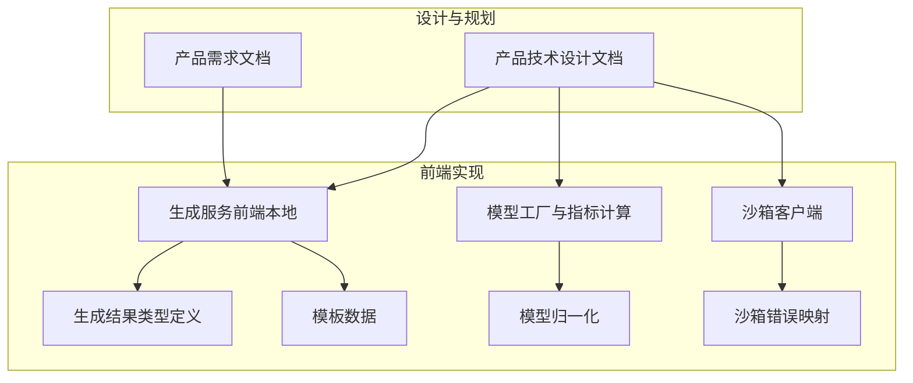
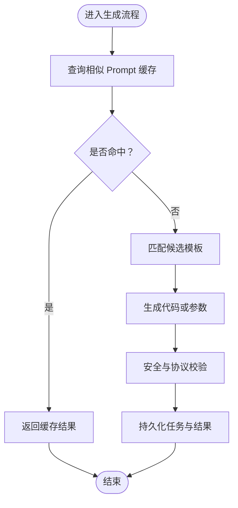
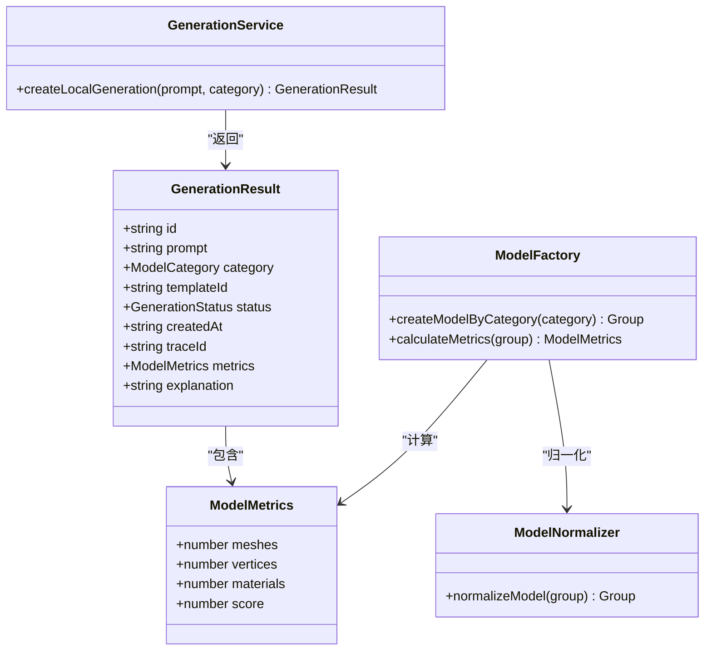
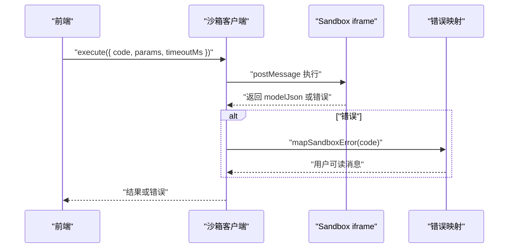
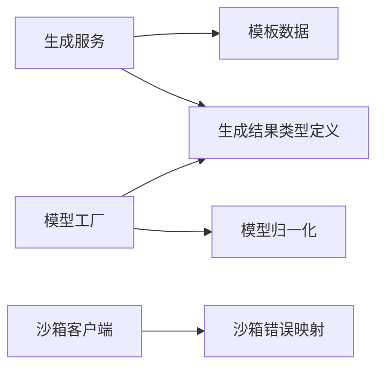

# 成本优化与缓存策略

<cite>
**本文引用的文件**   
- [产品技术设计文档](file://tech/product-technical-design.md)
- [产品需求文档](file://prd.md)
- [生成服务（前端本地）](file://src/modules/studio/services/generationService.ts)
- [生成结果类型定义](file://src/shared/types/generation.ts)
- [模板数据](file://src/modules/templates/templateData.ts)
- [模型工厂与指标计算](file://src/modules/viewer/utils/modelFactory.ts)
- [模型归一化](file://src/modules/viewer/utils/modelNormalizer.ts)
- [沙箱客户端](file://src/modules/sandbox/SandboxClient.ts)
- [沙箱错误映射](file://src/modules/sandbox/errorMapper.ts)
</cite>

## 目录
1. [引言](#引言)
2. [项目结构](#项目结构)
3. [核心组件](#核心组件)
4. [架构总览](#架构总览)
5. [详细组件分析](#详细组件分析)
6. [依赖关系分析](#依赖关系分析)
7. [性能与成本考量](#性能与成本考量)
8. [故障排查指南](#故障排查指南)
9. [结论](#结论)
10. [附录](#附录)

## 引言
本文件聚焦 ApexForge 的成本优化与缓存策略，围绕 Token 使用统计、成本计算方法、相似 Prompt 缓存机制与结果复用策略展开。同时覆盖缓存键生成算法、过期策略、命中率监控、存储优化、批量请求优化、模型降级策略与预算控制机制，并提供可落地的成本分析报告与优化建议。内容基于仓库中的产品与技术设计文档及前端实现进行系统化梳理。

## 项目结构
从成本与缓存视角，本项目相关的关键位置包括：
- 后端/平台化设计：包含缓存、队列、多供应商 LLM 适配、可观测性与性能优化等章节
- 前端实现：本地生成模拟、模板选择、模型指标计算、沙箱执行与错误映射



图示来源
- [产品技术设计文档](file://tech/product-technical-design.md)
- [产品需求文档](file://prd.md)
- [生成服务（前端本地）](file://src/modules/studio/services/generationService.ts)
- [生成结果类型定义](file://src/shared/types/generation.ts)
- [模板数据](file://src/modules/templates/templateData.ts)
- [模型工厂与指标计算](file://src/modules/viewer/utils/modelFactory.ts)
- [模型归一化](file://src/modules/viewer/utils/modelNormalizer.ts)
- [沙箱客户端](file://src/modules/sandbox/SandboxClient.ts)
- [沙箱错误映射](file://src/modules/sandbox/errorMapper.ts)

章节来源
- [产品技术设计文档](file://tech/product-technical-design.md)
- [产品需求文档](file://prd.md)

## 核心组件
- 生成编排与模式优先级：Cache Mode → Template Mode → Hybrid Mode → Code Mode
- 相似 Prompt 缓存：向量相似度命中直接复用结果
- 模板优先：参数化渲染避免 LLM 调用
- 多供应商 LLM 适配器：按成本/速度选择、失败重试与降级
- 可观测性：traceId 贯穿全链路，记录 token、耗时、质量分等
- 前端指标：meshes、vertices、materials、score 用于复杂度评估与回退

章节来源
- [产品技术设计文档](file://tech/product-technical-design.md)
- [生成结果类型定义](file://src/shared/types/generation.ts)
- [模型工厂与指标计算](file://src/modules/viewer/utils/modelFactory.ts)

## 架构总览
下图展示生成链路中缓存与成本优化的关键路径，包括相似 Prompt 缓存、模板匹配、LLM 调用与校验、以及前端沙箱执行。

```mermaid
sequenceDiagram
participant FE as "前端"
participant API as "API 网关"
participant GEN as "生成服务"
participant CACHE as "相似 Prompt 缓存"
participant TPL as "模板服务"
participant LLM as "LLM 适配器"
participant VAL as "代码校验器"
participant DB as "数据库"
participant BOX as "沙箱 iframe"
FE->>API : "POST /api/v1/generations"
API->>GEN : "创建任务"
GEN->>CACHE : "查询相似 Prompt"
alt "命中缓存"
CACHE-->>GEN : "返回已缓存结果"
else "未命中"
GEN->>TPL : "候选模板匹配"
TPL-->>GEN : "模板候选"
GEN->>LLM : "生成代码或参数"
LLM-->>GEN : "输出"
GEN->>VAL : "安全与协议校验"
VAL-->>GEN : "校验报告"
end
GEN->>DB : "持久化任务与结果"
GEN-->>API : "返回结果"
API-->>FE : "生成载荷"
FE->>BOX : "在 iframe 中执行"
BOX-->>FE : "模型 JSON 或错误"
```

图示来源
- [产品技术设计文档](file://tech/product-technical-design.md)

## 详细组件分析

### 相似 Prompt 缓存机制与结果复用
- 缓存目标：对相同或高度相似的 Prompt 直接复用历史生成结果，避免重复 LLM 调用
- 命中条件：向量相似度大于阈值时视为命中
- 复用范围：可直接返回模板参数或完整代码，结合后续校验与沙箱执行
- 状态机支持：命中后直接进入 renderable 阶段，减少 generating/validating 开销



图示来源
- [产品技术设计文档](file://tech/product-technical-design.md)

章节来源
- [产品技术设计文档](file://tech/product-technical-design.md)

### 缓存键生成算法
- 输入要素：用户原始 Prompt、上下文版本、类别、模式、偏好设置等
- 归一化处理：去除空白差异、大小写统一、同义词替换、参数标准化
- 特征提取：可选文本嵌入向量 + 结构化字段哈希
- 键构造：将归一化后的 Prompt 与元信息拼接为稳定键；若采用向量检索，则以向量索引为主、键为辅
- 版本隔离：不同 promptVersion 的键需区分，确保 Prompt 版本演进不影响旧缓存

说明：该方案为设计建议，便于在平台化阶段落地到 Redis 或向量库。

### 过期策略与存储优化
- 过期策略：TTL 按热度分层，热门模板/参数 Schema 长期保留；冷数据按时间归档
- 存储优化：大字段（代码、模型 JSON、截图）迁移至对象存储，仅保存 URL 与摘要；Redis 仅存热点键与轻量结果
- 去重与压缩：对高频相似键做合并与压缩，降低内存占用

章节来源
- [产品技术设计文档](file://tech/product-technical-design.md)

### 命中率监控与成本关联
- 指标维度：缓存命中率、平均延迟、LLM 调用次数、Token 用量、失败率
- 告警规则：命中率异常下降、LLM 延迟突增、失败率飙升
- 成本关联：通过 traceId 串联每次调用的 token、耗时与质量分，形成成本报表

章节来源
- [产品技术设计文档](file://tech/product-technical-design.md)

### 批量请求优化
- 批处理策略：对同一批次内相似 Prompt 进行去重与合并，共享一次 LLM 调用并分发结果
- 并发控制：限制并发度与令牌桶限流，避免突发流量导致成本失控
- 异步化：生成任务入队，HTTP 短轮询或 SSE 推送结果，释放连接资源

章节来源
- [产品技术设计文档](file://tech/product-technical-design.md)

### 模型降级策略
- 复杂度阈值：根据 meshes、vertices、materials 估算复杂度，超过阈值自动降级
- 降级路径：Code Mode → Hybrid Mode → Template Mode → Cache Mode
- 前端提示：当模型过于复杂时提示用户降低细节或使用模板模式

章节来源
- [产品技术设计文档](file://tech/product-technical-design.md)
- [生成结果类型定义](file://src/shared/types/generation.ts)
- [模型工厂与指标计算](file://src/modules/viewer/utils/modelFactory.ts)

### 预算控制机制
- 配额维度：每日生成次数、每分钟请求数、并发生成任务数、最大模型复杂度、存储空间、API 调用量、高级模型额度
- 动态调整：根据套餐与实时成本曲线动态调整模型选择与降级阈值
- 审计与合规：敏感日志脱敏，API Key 只展示一次，数据库仅保存哈希

章节来源
- [产品技术设计文档](file://tech/product-technical-design.md)

### Token 使用统计与成本计算方法
- 采集点：LLM Adapter 记录每次调用的输入/输出 token、耗时、错误码与质量分
- 聚合维度：按用户、空间、项目、模板、供应商、Prompt 版本汇总
- 成本公式：成本 = Σ(各供应商单价 × 对应 token 数) + 额外费用（如高并发溢价、失败重试）
- 可视化：结合 traceId 与质量评分，输出成本-质量对比报表，辅助决策

章节来源
- [产品技术设计文档](file://tech/product-technical-design.md)

### 前端本地生成与指标计算（参考实现）
- 本地生成：根据类别选择模板，返回带 traceId 的结果，便于追踪
- 指标计算：遍历模型树统计 meshes、vertices、materials，并给出 score
- 归一化：对模型进行居中与缩放，保证展示一致性



图示来源
- [生成服务（前端本地）](file://src/modules/studio/services/generationService.ts)
- [生成结果类型定义](file://src/shared/types/generation.ts)
- [模型工厂与指标计算](file://src/modules/viewer/utils/modelFactory.ts)
- [模型归一化](file://src/modules/viewer/utils/modelNormalizer.ts)

章节来源
- [生成服务（前端本地）](file://src/modules/studio/services/generationService.ts)
- [生成结果类型定义](file://src/shared/types/generation.ts)
- [模型工厂与指标计算](file://src/modules/viewer/utils/modelFactory.ts)
- [模型归一化](file://src/modules/viewer/utils/modelNormalizer.ts)

### 模板系统与参数化生成
- 模板分类：vehicle、architecture、aircraft、furniture、prop
- 默认 Prompt 与复杂度标签：用于快速选择与成本预估
- 参数化渲染：跳过 LLM 代码生成，直接以参数驱动渲染，显著降低成本与延迟

章节来源
- [模板数据](file://src/modules/templates/templateData.ts)
- [产品技术设计文档](file://tech/product-technical-design.md)

### 沙箱执行与错误映射
- 执行流程：主线程发送执行指令，iframe 内执行代码并返回序列化模型数据
- 错误分类：超时、运行时报错、模型 JSON 无效等，提供友好提示与重试建议
- 成本控制：超时销毁防止死循环，避免无谓资源消耗



图示来源
- [沙箱客户端](file://src/modules/sandbox/SandboxClient.ts)
- [沙箱错误映射](file://src/modules/sandbox/errorMapper.ts)

章节来源
- [沙箱客户端](file://src/modules/sandbox/SandboxClient.ts)
- [沙箱错误映射](file://src/modules/sandbox/errorMapper.ts)

## 依赖关系分析
- 生成服务依赖模板数据与类型定义，产出带 traceId 的结果
- 模型工厂负责构建具体模型并计算复杂度指标
- 模型归一化确保展示一致性与性能稳定
- 沙箱客户端与错误映射保障执行安全与用户体验



图示来源
- [生成服务（前端本地）](file://src/modules/studio/services/generationService.ts)
- [生成结果类型定义](file://src/shared/types/generation.ts)
- [模板数据](file://src/modules/templates/templateData.ts)
- [模型工厂与指标计算](file://src/modules/viewer/utils/modelFactory.ts)
- [模型归一化](file://src/modules/viewer/utils/modelNormalizer.ts)
- [沙箱客户端](file://src/modules/sandbox/SandboxClient.ts)
- [沙箱错误映射](file://src/modules/sandbox/errorMapper.ts)

## 性能与成本考量
- 相似 Prompt 缓存：命中即复用，显著降低 LLM 调用与 Token 消耗
- 模板优先：参数化渲染避免代码生成，成本更低、延迟更短
- 多供应商选择：按成本与速度择优，失败重试与降级保障稳定性
- 前端复杂度控制：依据指标阈值触发降级，避免高成本渲染
- 异步与限流：队列与令牌桶控制并发，平滑峰值成本

章节来源
- [产品技术设计文档](file://tech/product-technical-design.md)
- [产品需求文档](file://prd.md)

## 故障排查指南
- 常见错误：
  - 执行超时：检查模型复杂度与超时配置，必要时降级
  - 运行时报错：查看校验报告与错误映射，定位问题代码片段
  - 模型 JSON 无效：确认序列化与反序列化流程，验证数据结构
- 排查步骤：
  - 通过 traceId 拉取全链路日志，定位失败阶段
  - 核对缓存命中率与 LLM 调用记录，判断是否因缓存失效导致成本上升
  - 检查配额与限流配置，确认是否被限流或熔断

章节来源
- [产品技术设计文档](file://tech/product-technical-design.md)
- [沙箱错误映射](file://src/modules/sandbox/errorMapper.ts)

## 结论
通过相似 Prompt 缓存、模板优先、多供应商适配与前端复杂度控制，ApexForge 可在保证生成质量的前提下显著降低 Token 使用与整体成本。配合完善的可观测性与预算控制机制，可实现成本透明、风险可控的平台化运营。

## 附录
- 成本分析报告建议：
  - 按月/周维度输出 Token 用量、调用次数、命中率、失败率、平均延迟
  - 按供应商与模板维度拆解成本贡献，识别高成本场景
  - 结合质量评分，评估“成本-质量”平衡点，指导模型选择与降级策略
- 优化建议清单：
  - 提升缓存命中率：优化归一化与特征提取，扩大相似范围
  - 强化模板体系：扩展高质量模板与参数 Schema，提高参数化覆盖率
  - 精细化限流与熔断：按用户/空间/项目设置差异化配额
  - 持续监控与告警：建立成本与质量的联动告警，及时干预异常