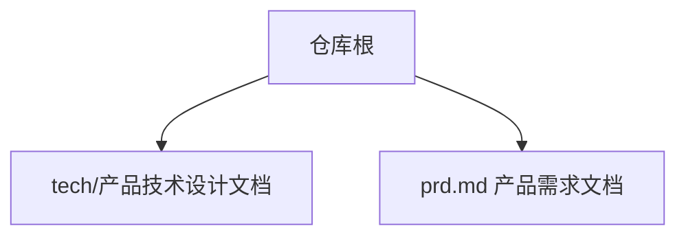
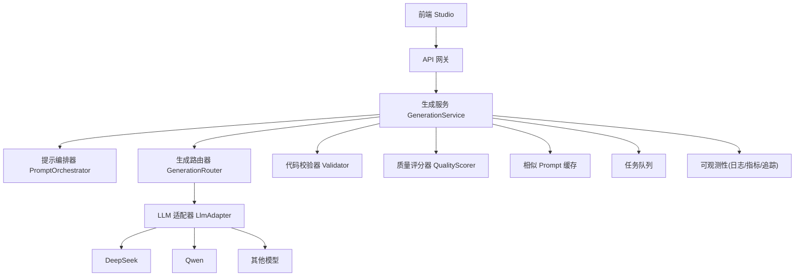
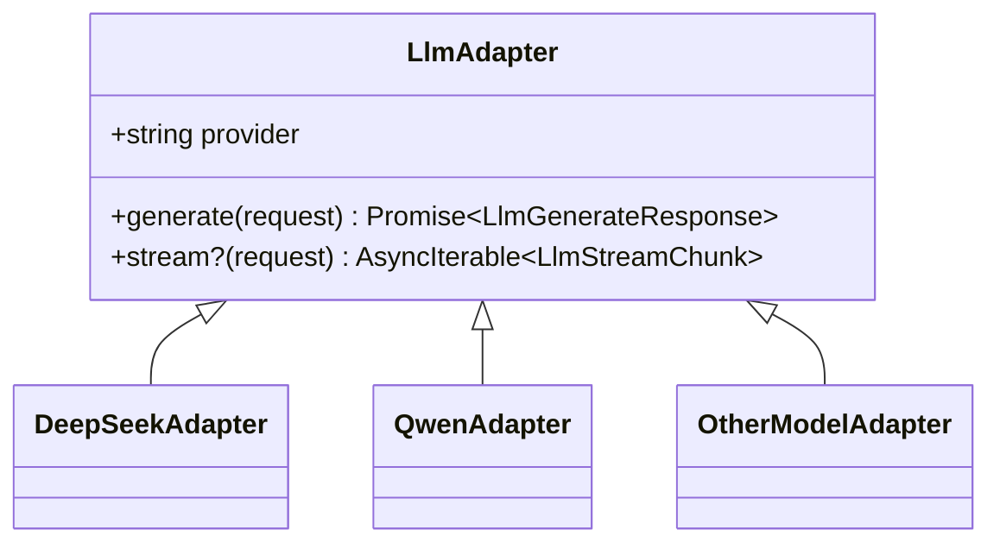
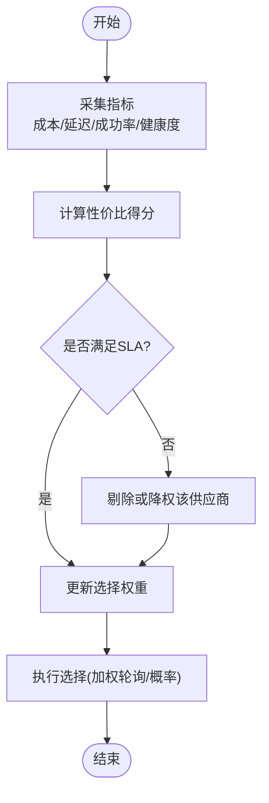
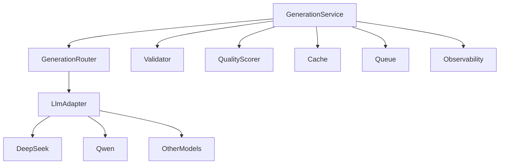

# 模型选择与负载均衡

<cite>
**本文引用的文件**   
- [产品技术设计文档](file://tech/product-technical-design.md)
- [产品需求文档](file://prd.md)
</cite>

## 目录
1. [引言](#引言)
2. [项目结构](#项目结构)
3. [核心组件](#核心组件)
4. [架构总览](#架构总览)
5. [详细组件分析](#详细组件分析)
6. [依赖关系分析](#依赖关系分析)
7. [性能考量](#性能考量)
8. [故障排查指南](#故障排查指南)
9. [结论](#结论)
10. [附录：配置示例与指标清单](#附录配置示例与指标清单)

## 引言
本文件聚焦于 ApexForge 的“模型选择与负载均衡”能力，围绕多供应商路由策略、按任务类型选择模型、成本与响应速度权衡算法、健康检查机制、故障转移策略、权重动态调整与容量规划展开。同时给出负载均衡算法实现要点、监控指标收集与性能调优建议，并提供可操作的配置示例与故障排查指南。内容基于仓库中的产品与技术设计文档进行系统化梳理与扩展说明，确保读者既能把握整体架构，也能落地实施。

## 项目结构
仓库包含两份关键文档：
- 产品需求文档：定义平台目标、核心模块、数据流与安全策略等总体方向。
- 产品技术设计文档：给出从 MVP 到平台化的架构演进、领域模型、生成链路、模板系统、质量评分、可观测性与工程落地计划。

章节来源
- [产品需求文档:1-168](file://prd.md#L1-L168)
- [产品技术设计文档:1-120](file://tech/product-technical-design.md#L1-L120)

## 核心组件
围绕模型选择与负载均衡，以下组件最为关键：
- LLM 适配器（多供应商适配层）：统一接口抽象不同模型供应商，屏蔽差异。
- 生成路由器（GenerationRouter）：根据任务类型、偏好与约束选择具体模型或模式。
- 提示编排器（Prompt Orchestrator）：构建 Prompt 并注入模板上下文，驱动生成。
- 代码校验器（Validator）：对输出进行协议、语法与复杂度校验。
- 质量评分器（Quality Scorer）：评估生成结果的可渲染性、结构与性能等维度。
- 缓存与队列：相似 Prompt 缓存、异步任务队列，提升吞吐与稳定性。
- 可观测性：日志、指标、追踪贯穿全链路，支撑决策与优化。

章节来源
- [产品技术设计文档:594-630](file://tech/product-technical-design.md#L594-L630)
- [产品技术设计文档:327-426](file://tech/product-technical-design.md#L327-L426)
- [产品技术设计文档:807-841](file://tech/product-technical-design.md#L807-L841)
- [产品技术设计文档:868-908](file://tech/product-technical-design.md#L868-L908)

## 架构总览
下图展示逻辑架构中模型选择与负载均衡相关的关键交互：API 网关将请求路由至生成服务；生成服务通过提示编排器构造输入，由 LLM 适配器在多供应商间选择并调用；校验器与评分器保障输出质量；缓存与队列提升稳定性与吞吐；可观测性贯穿全流程。

图表来源
- [产品技术设计文档:38-62](file://tech/product-technical-design.md#L38-L62)
- [产品技术设计文档:594-630](file://tech/product-technical-design.md#L594-L630)

章节来源
- [产品技术设计文档:38-62](file://tech/product-technical-design.md#L38-L62)
- [产品技术设计文档:594-630](file://tech/product-technical-design.md#L594-L630)

## 详细组件分析

### 多供应商路由策略与按任务类型选择模型
- 统一接口：所有供应商通过统一的 LlmAdapter 接口暴露 generate/stream 方法，便于替换与扩展。
- 选择维度：
  - 任务类型：如“完整代码生成”、“模板参数生成”、“Prompt 改写”。
  - 成本与延迟：结合历史统计与实时健康状态，优先低延迟或低成本供应商。
  - 成功率与质量：依据最近窗口内的失败率与质量分动态调整权重。
- 降级与重试：当主选供应商不可用或质量不达标时，自动切换备用供应商并重试。

图表来源
- [产品技术设计文档:611-630](file://tech/product-technical-design.md#L611-L630)

章节来源
- [产品技术设计文档:611-630](file://tech/product-technical-design.md#L611-L630)

### 成本与响应速度权衡算法
- 目标函数：在满足 SLA（最大延迟、最低成功率）的前提下最小化期望成本。
- 输入特征：
  - 供应商价格（按 token 或请求计费）。
  - 历史延迟分布（P50/P95/P99）。
  - 近期成功率与错误码分布。
  - 当前负载与健康度（熔断、限流阈值）。
- 决策流程：
  - 计算各候选供应商的“性价比得分”= f(成本, 延迟, 成功率)。
  - 若某供应商延迟超过阈值或成功率低于阈值，则降权或剔除。
  - 使用加权轮询或概率选择，避免单点过载。
- 动态调整：
  - 滑动窗口统计（如最近 5/15/60 分钟），实时更新权重。
  - 突发流量触发快速回退到更稳定但可能稍慢的供应商。

[本节为概念性流程图，无需图表来源]

### 健康检查机制
- 主动探测：周期性向供应商发起轻量请求，记录响应时间与错误码。
- 被动探测：基于实际业务调用失败率与超时比例判断健康状态。
- 熔断与恢复：连续失败达到阈值进入熔断，冷却后逐步试探恢复。
- 指标上报：将健康状态、延迟、错误率上报至可观测系统，用于告警与可视化。

章节来源
- [产品技术设计文档:868-908](file://tech/product-technical-design.md#L868-L908)

### 故障转移策略
- 主备切换：主供应商异常时自动切换到备用供应商。
- 重试与退避：指数退避重试，避免雪崩。
- 降级模式：在高负载或高失败率时，切换到更稳定的模板模式或简化 Prompt。
- 结果兜底：返回部分可用结果或提示用户重试，保证用户体验。

章节来源
- [产品技术设计文档:611-630](file://tech/product-technical-design.md#L611-L630)
- [产品技术设计文档:898-908](file://tech/product-technical-design.md#L898-L908)

### 权重动态调整与容量规划
- 权重动态调整：
  - 基于滑动窗口的成功率、延迟、成本进行自适应权重更新。
  - 引入平滑因子，避免权重剧烈抖动。
- 容量规划：
  - 根据峰值 QPS、平均延迟与供应商配额，估算所需实例数与并发上限。
  - 设置熔断与限流阈值，保护下游与自身资源。
  - 结合队列与缓存，削峰填谷，提高吞吐。

章节来源
- [产品技术设计文档:868-908](file://tech/product-technical-design.md#L868-L908)
- [产品技术设计文档:933-958](file://tech/product-technical-design.md#L933-L958)

### 负载均衡算法实现要点
- 算法选型：
  - 加权轮询：适合静态权重场景。
  - 概率选择：适合动态权重与多目标优化。
  - 一致性哈希：适合会话绑定或热点键路由（可选）。
- 实现细节：
  - 维护候选供应商列表与其权重。
  - 每次选择前刷新权重（基于最新指标）。
  - 记录每次选择的供应商、耗时、结果，用于后续分析与回归测试。

章节来源
- [产品技术设计文档:611-630](file://tech/product-technical-design.md#L611-L630)

### 监控指标收集与性能调优建议
- 指标收集：
  - 供应商维度：延迟分位、成功率、错误码分布、token 用量、成本。
  - 任务维度：模式（template/code/hybrid）、质量分、校验报告摘要。
  - 系统维度：CPU/内存、队列长度、缓存命中率、数据库读写延迟。
- 性能调优：
  - 相似 Prompt 缓存命中优先，减少 LLM 调用。
  - 模板模式优先，降低延迟与成本。
  - 合理设置并发与熔断阈值，避免级联失败。
  - 大对象解析移至 Worker，释放主线程。

章节来源
- [产品技术设计文档:868-908](file://tech/product-technical-design.md#L868-L908)
- [产品技术设计文档:933-958](file://tech/product-technical-design.md#L933-L958)

## 依赖关系分析
- 耦合与内聚：
  - LlmAdapter 与各供应商实现解耦，便于替换与扩展。
  - GenerationRouter 聚合选择策略，集中管理权重与降级逻辑。
  - Validator 与 QualityScorer 作为后置保障，形成稳定的质量闭环。
- 外部依赖：
  - 缓存与队列提供弹性与容错。
  - 可观测性为决策与优化提供数据基础。

图表来源
- [产品技术设计文档:594-630](file://tech/product-technical-design.md#L594-L630)
- [产品技术设计文档:868-908](file://tech/product-technical-design.md#L868-L908)

章节来源
- [产品技术设计文档:594-630](file://tech/product-technical-design.md#L594-L630)
- [产品技术设计文档:868-908](file://tech/product-technical-design.md#L868-L908)

## 性能考量
- 前端：
  - Three.js runtime 按需加载，模型 JSON 解析放入 Worker。
  - 旧模型及时释放 geometry/material/texture，避免内存泄漏。
- 后端：
  - 相似 Prompt 缓存复用，模板模式跳过 LLM 代码生成。
  - 生成任务异步化，避免长连接占用。
  - 供应商并发与熔断控制，热门模板与 Schema 缓存。
- 数据库：
  - 关键索引与归档策略，大字段迁移至对象存储。

章节来源
- [产品技术设计文档:933-958](file://tech/product-technical-design.md#L933-L958)

## 故障排查指南
- 常见问题定位：
  - 生成失败率高：检查供应商健康状态、熔断阈值与重试策略。
  - 延迟过高：查看延迟分位与供应商负载，必要时切换更稳定供应商。
  - 校验失败突增：审查黑名单与 AST 白名单规则，确认 Prompt 版本变更影响。
  - 沙箱超时突增：评估模型复杂度与模板匹配度，必要时降级模式。
- 排查步骤：
  - 通过 traceId 串联前后端日志与指标。
  - 核对供应商错误码与消息，定位网络或服务端问题。
  - 对比历史基线，识别回归点（Prompt/模板/供应商）。
  - 调整权重与阈值，观察效果并持续迭代。

章节来源
- [产品技术设计文档:868-908](file://tech/product-technical-design.md#L868-L908)
- [产品技术设计文档:428-470](file://tech/product-technical-design.md#L428-L470)

## 结论
ApexForge 的模型选择与负载均衡以统一适配器为核心，结合任务类型、成本与延迟等多维指标进行动态路由与权重调整。通过健康检查、熔断与降级策略保障稳定性，配合缓存与队列提升吞吐与弹性。完善的可观测性与质量评分体系为持续优化提供数据支撑，使系统在复杂多变的外部环境下保持高可用与高性价比。

## 附录：配置示例与指标清单

### 配置示例（文本描述）
- 供应商路由策略：
  - 启用多供应商，设置默认主备顺序。
  - 配置 SLA 阈值（最大延迟、最低成功率）。
  - 开启动态权重调整与平滑因子。
- 熔断与限流：
  - 设置连续失败次数与冷却时间。
  - 限制每供应商最大并发与 QPS。
- 缓存与队列：
  - 开启相似 Prompt 缓存，设置 TTL 与相似度阈值。
  - 配置队列大小与消费者数量，启用重试与死信队列。
- 可观测性：
  - 启用 traceId 透传，记录关键指标与错误码。
  - 配置告警规则（失败率、延迟、错误率）。

章节来源
- [产品技术设计文档:868-908](file://tech/product-technical-design.md#L868-L908)
- [产品技术设计文档:933-958](file://tech/product-technical-design.md#L933-L958)

### 指标清单（文本描述）
- 供应商指标：
  - 延迟分位（P50/P95/P99）、成功率、错误码分布、token 用量、成本。
- 任务指标：
  - 模式（template/code/hybrid）、质量分、校验报告摘要、重试次数。
- 系统指标：
  - CPU/内存、队列长度、缓存命中率、数据库读写延迟、GC 停顿。
- 告警规则：
  - 生成失败率过高、LLM 延迟过高、校验失败突增、沙箱超时突增、API 错误率过高。

章节来源
- [产品技术设计文档:868-908](file://tech/product-technical-design.md#L868-L908)