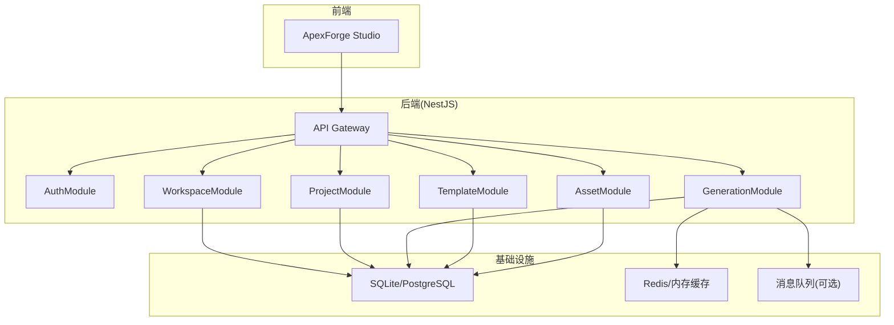
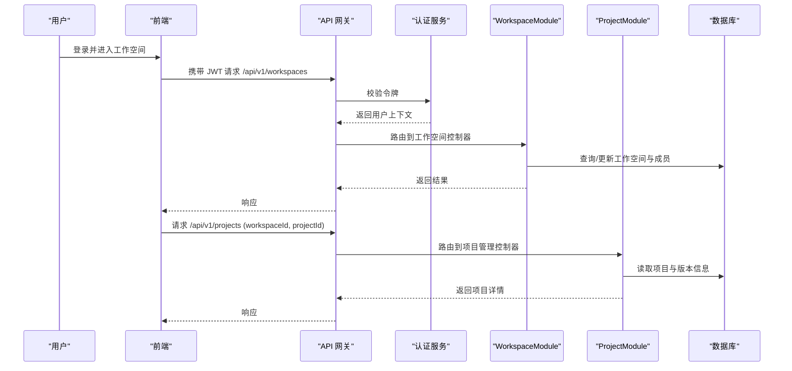
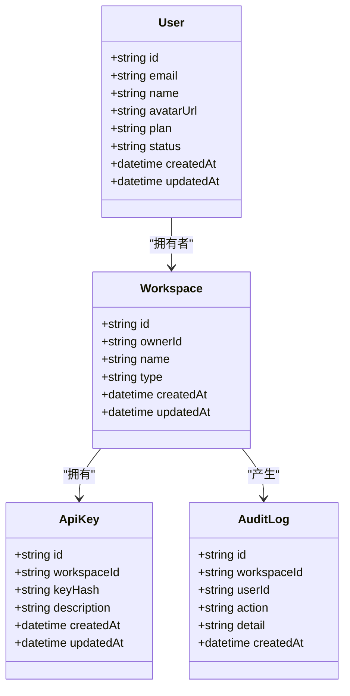
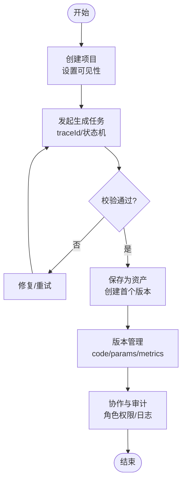
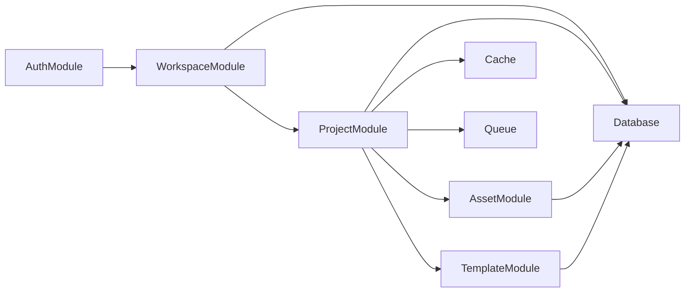

# 工作空间与项目管理模块

<cite>
**本文引用的文件**
- [产品需求文档](file://prd.md)
- [产品技术设计文档](file://tech/product-technical-design.md)
</cite>

## 目录
1. [引言](#引言)
2. [项目结构](#项目结构)
3. [核心组件](#核心组件)
4. [架构总览](#架构总览)
5. [详细组件分析](#详细组件分析)
6. [依赖关系分析](#依赖关系分析)
7. [性能考虑](#性能考虑)
8. [故障排查指南](#故障排查指南)
9. [结论](#结论)
10. [附录](#附录)

## 引言
本章节聚焦于 ApexForge 的“工作空间与项目管理”能力，围绕 WorkspaceModule 与 ProjectModule 的职责边界、数据模型、API 接口、权限控制、版本协作与性能优化进行系统化说明。内容基于仓库中的产品需求与技术设计文档整理而成，旨在帮助读者快速理解并落地企业级团队空间与项目协作方案。

## 项目结构
当前仓库包含产品需求与技术设计文档，未提供后端源码实现。因此，本节以文档为依据，梳理模块在整体系统中的位置与职责：
- 后端采用 NestJS 模块化架构，WorkspaceModule 与 ProjectModule 作为独立领域模块存在，分别负责“空间/成员/权限”和“项目生命周期/版本/协作”。
- 前端为 React SPA + Three.js 渲染，Studio 与资产库等页面通过 API 访问工作空间与项目资源。
- 数据库 MVP 使用 SQLite，平台化阶段迁移至 PostgreSQL；缓存与队列用于生成任务与模板检索。

图表来源
- [产品技术设计文档:34-100](file://tech/product-technical-design.md#L34-L100)
- [产品技术设计文档:574-593](file://tech/product-technical-design.md#L574-L593)

章节来源
- [产品技术设计文档:34-100](file://tech/product-technical-design.md#L34-L100)
- [产品技术设计文档:574-593](file://tech/product-technical-design.md#L574-L593)

## 核心组件
- WorkspaceModule
  - 职责：工作空间的创建、成员管理、角色与权限控制、审计日志与 API Key 管理。
  - 关键实体：User、Workspace、ApiKey、AuditLog。
- ProjectModule
  - 职责：项目的创建、可见性控制、版本化（关联 ModelAsset/ModelVersion）、协作编辑与导出。
  - 关键实体：Project、ModelAsset、ModelVersion、GenerationTask、PromptRecord、ValidationReport、QualityScore。

章节来源
- [产品技术设计文档:132-170](file://tech/product-technical-design.md#L132-L170)
- [产品技术设计文档:574-593](file://tech/product-technical-design.md#L574-L593)

## 架构总览
从系统视角看，WorkspaceModule 与 ProjectModule 位于业务层，向上承接认证与网关鉴权，向下持久化到数据库，并通过缓存与队列提升性能与可扩展性。

图表来源
- [产品技术设计文档:34-100](file://tech/product-technical-design.md#L34-L100)
- [产品技术设计文档:574-593](file://tech/product-technical-design.md#L574-L593)

## 详细组件分析

### 工作空间模块（WorkspaceModule）
- 功能范围
  - 工作空间 CRUD：支持个人、团队与企业三种类型。
  - 成员管理：邀请、加入、移除、变更角色。
  - 权限控制：基于角色的访问控制（Owner/Admin/Editor/Viewer/API Client）。
  - 审计与密钥：记录操作审计日志，管理开放 API Key。
- 数据模型
  - users：用户主体信息。
  - workspaces：空间基本信息与所有者。
  - ApiKey：开放平台调用凭证。
  - AuditLog：审计日志。
- 权限模型
  - Owner：空间管理、成员管理、计费、全部项目。
  - Admin：项目管理、模板管理、审核。
  - Editor：创建和编辑模型资产。
  - Viewer：查看和导出授权资产。
  - API Client：通过 API 调用限定能力。
- 典型流程
  - 创建工作空间：鉴权后创建记录，设置 owner，写入审计日志。
  - 邀请成员：校验配额与角色上限，写入成员表，发送通知。
  - 权限校验：在每次访问 workspace/project 资源时，按角色判定读写权限。
- 安全与合规
  - 敏感日志脱敏，不记录完整密钥与鉴权头。
  - API Key 仅展示一次，数据库保存哈希值。
  - 企业版支持数据隔离与私有化部署。

图表来源
- [产品技术设计文档:178-200](file://tech/product-technical-design.md#L178-L200)
- [产品技术设计文档:844-866](file://tech/product-technical-design.md#L844-L866)
- [产品技术设计文档:924-930](file://tech/product-technical-design.md#L924-L930)

章节来源
- [产品技术设计文档:178-200](file://tech/product-technical-design.md#L178-L200)
- [产品技术设计文档:844-866](file://tech/product-technical-design.md#L844-L866)
- [产品技术设计文档:924-930](file://tech/product-technical-design.md#L924-L930)

### 项目管理模块（ProjectModule）
- 功能范围
  - 项目生命周期：创建、编辑、归档、删除。
  - 可见性控制：private/shared/public。
  - 版本化：与 ModelAsset/ModelVersion 关联，支持回滚与对比。
  - 协作开发：多成员协同编辑、评论与变更追踪。
- 数据模型
  - projects：项目基本信息与可见性。
  - model_assets：成功生成的模型资产，含分类、标签、缩略图。
  - model_versions：版本代码、参数、截图、指标。
  - generation_tasks：生成任务状态机与链路追踪。
  - PromptRecord/ValidationReport/QualityScore：质量闭环数据。
- 版本与协作
  - 版本链：每个 ModelVersion 对应一次 GenerationTask，保留 code/params/metrics。
  - 协作：基于工作空间角色控制读写，审计日志记录关键操作。
- 典型流程
  - 创建项目：在工作空间下新建项目，设置可见性与创建者。
  - 保存资产：将可渲染结果保存为 ModelAsset，并创建首个版本。
  - 版本切换：根据 versionNo 或语义化版本选择目标版本加载。

图表来源
- [产品技术设计文档:202-269](file://tech/product-technical-design.md#L202-L269)
- [产品技术设计文档:215-236](file://tech/product-technical-design.md#L215-L236)
- [产品技术设计文档:342-357](file://tech/product-technical-design.md#L342-L357)

章节来源
- [产品技术设计文档:202-269](file://tech/product-technical-design.md#L202-L269)
- [产品技术设计文档:215-236](file://tech/product-technical-design.md#L215-L236)
- [产品技术设计文档:342-357](file://tech/product-technical-design.md#L342-L357)

### API 接口定义（与工作空间/项目相关）
- 通用规范
  - Base URL：/api/v1
  - 认证：JWT（用户侧）、API Key（开放平台）
  - 响应：统一包含 traceId，错误结构一致
- 工作空间接口（建议）
  - POST /api/v1/workspaces：创建工作空间
  - GET /api/v1/workspaces/{id}：获取工作空间详情
  - PUT /api/v1/workspaces/{id}/members：添加/移除成员或变更角色
  - GET /api/v1/workspaces/{id}/audit-log：查询审计日志
  - POST /api/v1/workspaces/{id}/api-keys：生成 API Key
- 项目接口（建议）
  - POST /api/v1/projects：在项目所属工作空间下创建项目
  - GET /api/v1/projects/{id}：获取项目详情
  - PUT /api/v1/projects/{id}：编辑项目（名称、描述、可见性）
  - DELETE /api/v1/projects/{id}：归档或删除项目
  - GET /api/v1/projects/{id}/assets：列出项目内资产
  - GET /api/v1/assets/{assetId}/versions：查询资产版本列表
- 生成任务接口（与项目协作紧密相关）
  - POST /api/v1/generations：创建生成任务
  - GET /api/v1/generations/{taskId}：查询任务状态与结果
  - GET /api/v1/generations/{taskId}/events：SSE 事件流

章节来源
- [产品技术设计文档:632-757](file://tech/product-technical-design.md#L632-L757)

### 权限控制与协作最佳实践
- 角色与权限
  - Owner：空间管理、成员管理、计费、全部项目。
  - Admin：项目管理、模板管理、审核。
  - Editor：创建和编辑模型资产。
  - Viewer：查看和导出授权资产。
  - API Client：通过 API 调用限定能力。
- 协作建议
  - 所有写操作需记录审计日志，便于追溯。
  - 对敏感操作（如删除项目、变更可见性）增加二次确认与审批流。
  - 对外部 API 调用限制能力范围与配额，避免滥用。

章节来源
- [产品技术设计文档:844-866](file://tech/product-technical-design.md#L844-L866)

## 依赖关系分析
- 模块耦合
  - WorkspaceModule 与 AuthModule 强耦合（鉴权与角色解析）。
  - ProjectModule 依赖 WorkspaceModule（项目归属与权限继承）。
  - ProjectModule 与 AssetModule/TemplateModule 协作（资产与模板引用）。
- 外部依赖
  - 数据库：SQLite（MVP）→ PostgreSQL（平台化）。
  - 缓存：相似 Prompt 与热门模板缓存。
  - 队列：异步生成任务与 SSE/WebSocket 推送。

图表来源
- [产品技术设计文档:574-593](file://tech/product-technical-design.md#L574-L593)
- [产品技术设计文档:34-100](file://tech/product-technical-design.md#L34-L100)

章节来源
- [产品技术设计文档:574-593](file://tech/product-technical-design.md#L574-L593)
- [产品技术设计文档:34-100](file://tech/product-technical-design.md#L34-L100)

## 性能考虑
- 数据库优化
  - 为常用查询字段建立索引：generation_tasks.traceId、workspaceId、createdAt；model_assets.workspaceId、projectId、updatedAt。
  - 大字段（代码、模型 JSON、截图）迁移至对象存储，仅保存 URL 与摘要。
  - 历史任务按时间归档，降低热表体积。
- 缓存与队列
  - 相似 Prompt 缓存复用结果，减少 LLM 调用。
  - 热门模板与参数 Schema 缓存至 Redis。
  - 生成任务异步化，避免 HTTP 长连接占用。
- 前端渲染
  - 模型加载前检查复杂度阈值，必要时提示降级。
  - 旧模型释放 geometry/material/texture，避免内存泄漏。
  - 大模型解析移至 Worker，主线程专注渲染。

章节来源
- [产品技术设计文档:933-958](file://tech/product-technical-design.md#L933-L958)

## 故障排查指南
- 常见错误码（沙箱执行）
  - SANDBOX_TIMEOUT：执行超时，模型过于复杂。
  - SANDBOX_RUNTIME_ERROR：运行时报错，可重试。
  - MODEL_JSON_INVALID：返回结构非法，系统将重新生成。
  - MODEL_TOO_COMPLEX：复杂度超限，请降低细节或使用模板模式。
  - MODEL_EMPTY：未生成有效对象，描述过于模糊。
- 排查步骤
  - 通过 traceId 定位全链路日志，检查各阶段耗时与错误码。
  - 校验 AST 报告与质量评分，定位失败原因。
  - 检查权限与审计日志，确认是否因权限不足导致操作失败。
  - 对于频繁超时或失败，评估模板命中率与缓存命中率，优化 Prompt 与模板覆盖。

章节来源
- [产品技术设计文档:508-517](file://tech/product-technical-design.md#L508-L517)
- [产品技术设计文档:868-907](file://tech/product-technical-design.md#L868-L907)

## 结论
WorkspaceModule 与 ProjectModule 构成了 ApexForge 团队协作与资产管理的基础设施。通过清晰的权限模型、版本化机制与质量闭环，平台能够在保证安全与稳定的前提下，支撑大规模 AI 驱动的 3D 模型生成与协作。后续演进应重点关注数据库迁移、队列化与多供应商适配，以提升扩展性与稳定性。

## 附录
- 工程里程碑建议
  - MVP：完成基础生成接口、安全校验、沙箱运行时、历史记录与基础模板。
  - Beta：模板平台化、参数编辑器、版本回滚、导出服务、API Key 与可观测性。
  - Scale：数据库迁移、队列化、多模型供应商、团队权限与计费、私有化部署。

章节来源
- [产品技术设计文档:961-998](file://tech/product-technical-design.md#L961-L998)