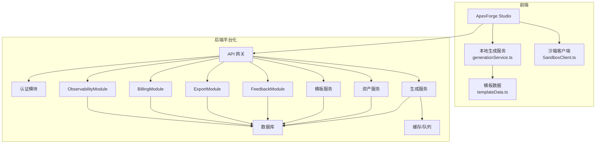
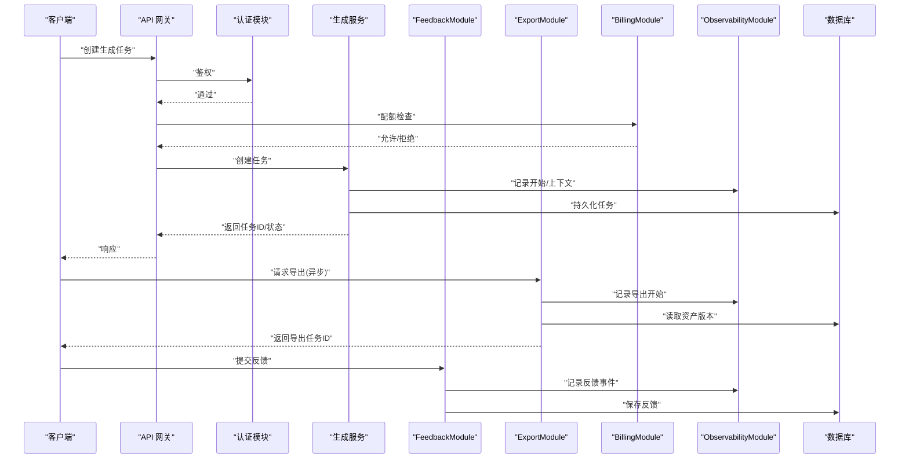
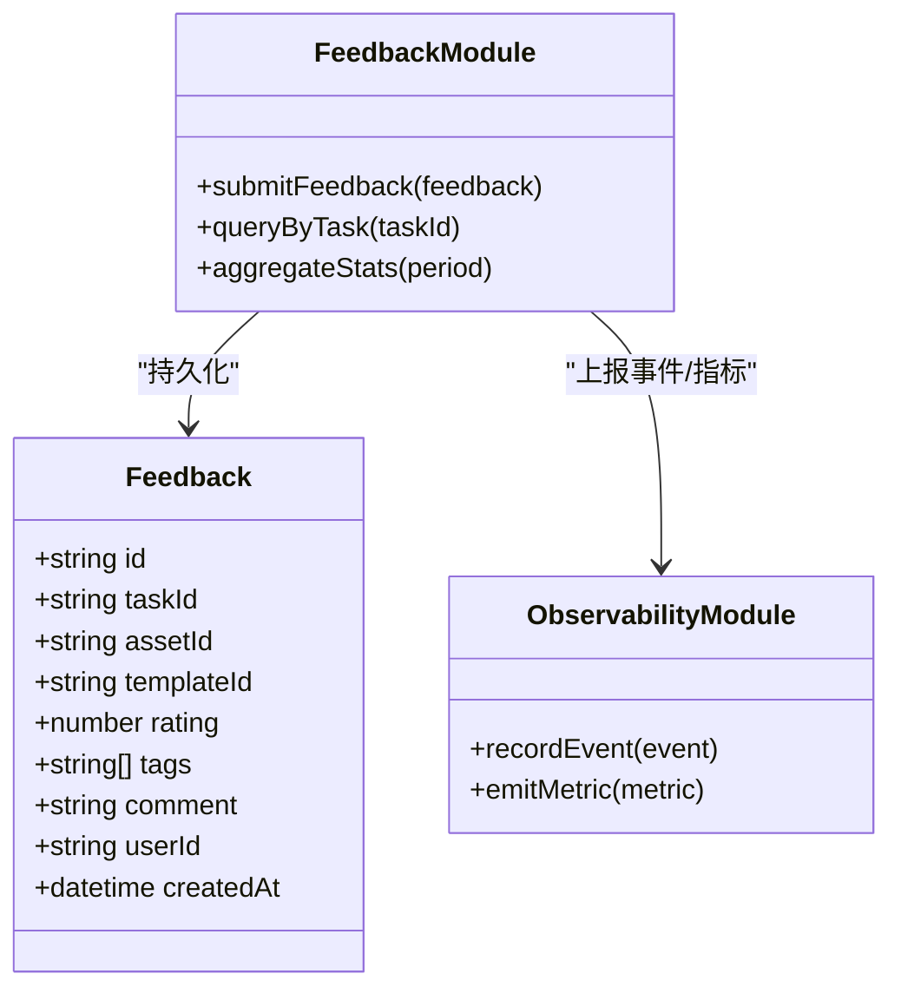
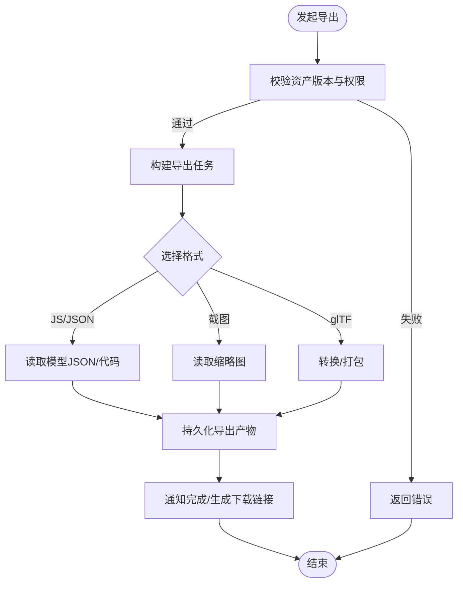
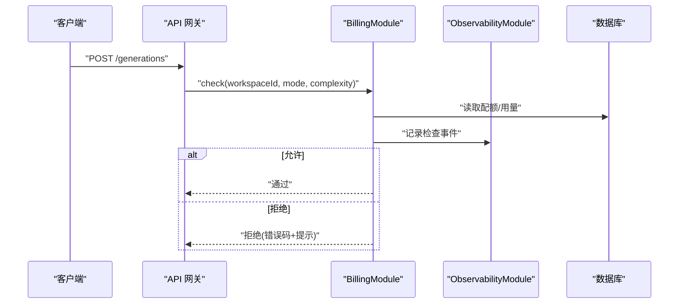
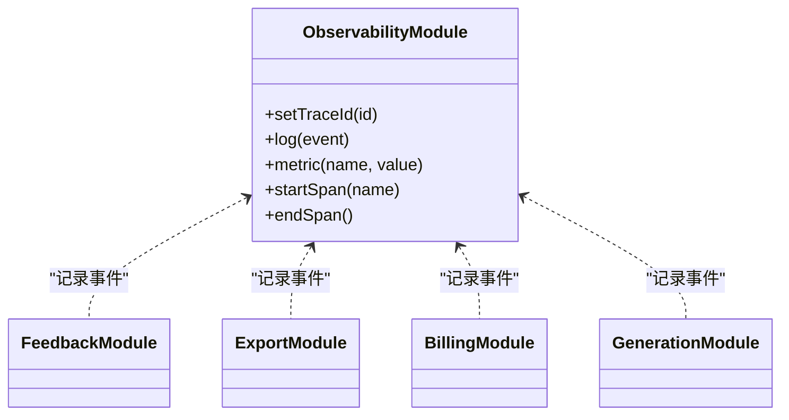
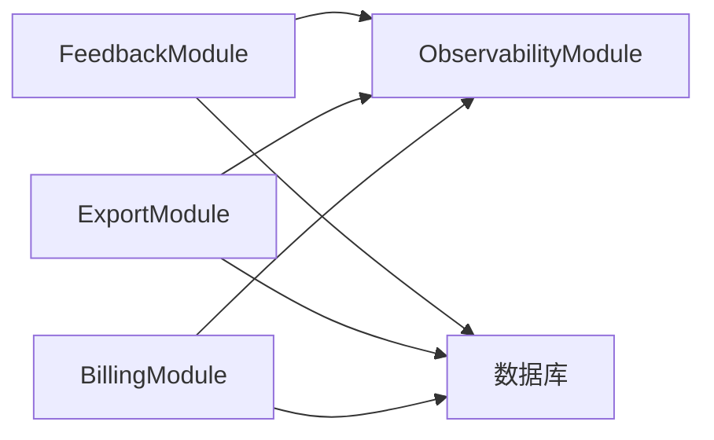

# 支撑服务模块

<cite>
**本文引用的文件**
- [tech/product-technical-design.md](file://tech/product-technical-design.md)
- [prd.md](file://prd.md)
- [src/modules/studio/services/generationService.ts](file://src/modules/studio/services/generationService.ts)
- [src/modules/sandbox/SandboxClient.ts](file://src/modules/sandbox/SandboxClient.ts)
- [src/modules/templates/templateData.ts](file://src/modules/templates/templateData.ts)
- [src/shared/types/common.ts](file://src/shared/types/common.ts)
- [src/shared/types/generation.ts](file://src/shared/types/generation.ts)
</cite>

## 目录
1. [引言](#引言)
2. [项目结构](#项目结构)
3. [核心组件](#核心组件)
4. [架构总览](#架构总览)
5. [详细组件分析](#详细组件分析)
6. [依赖分析](#依赖分析)
7. [性能考虑](#性能考虑)
8. [故障排查指南](#故障排查指南)
9. [结论](#结论)
10. [附录](#附录)

## 引言
本文件聚焦 ApexForge 的“支撑服务模块”，围绕以下四个辅助模块进行设计与实现说明：
- FeedbackModule（用户反馈收集与分析）
- ExportModule（多格式导出服务）
- BillingModule（配额管理与套餐计费）
- ObservabilityModule（日志、指标与链路追踪）

这些模块在平台化阶段承担关键的非功能性能力，贯穿认证、生成、模板、资产等核心流程，提供可观测性、合规审计、资源治理与交付扩展。文档将明确各模块的职责边界、接口设计、与其他核心模块的集成方式，并给出配置管理、错误处理与监控告警机制建议。

## 项目结构
当前仓库包含产品与技术设计文档以及前端 MVP 代码骨架。支撑服务模块主要在后端 NestJS 层规划，并在前端通过类型与通用响应结构与之对齐。

图表来源
- [tech/product-technical-design.md:574-631](file://tech/product-technical-design.md#L574-L631)
- [src/modules/studio/services/generationService.ts:1-30](file://src/modules/studio/services/generationService.ts#L1-L30)
- [src/modules/templates/templateData.ts:1-54](file://src/modules/templates/templateData.ts#L1-L54)
- [src/modules/sandbox/SandboxClient.ts:1-19](file://src/modules/sandbox/SandboxClient.ts#L1-L19)

章节来源
- [tech/product-technical-design.md:574-631](file://tech/product-technical-design.md#L574-L631)
- [src/modules/studio/services/generationService.ts:1-30](file://src/modules/studio/services/generationService.ts#L1-L30)
- [src/modules/templates/templateData.ts:1-54](file://src/modules/templates/templateData.ts#L1-L54)
- [src/modules/sandbox/SandboxClient.ts:1-19](file://src/modules/sandbox/SandboxClient.ts#L1-L19)

## 核心组件
本节概述四大支撑服务模块的职责与协作关系，并指出与核心模块的集成点。

- FeedbackModule
  - 职责：采集用户对生成结果的使用体验与质量反馈，形成闭环用于 Prompt 优化、模板筛选与模型评分校准。
  - 集成点：与 GenerationModule、AssetModule、TemplateModule 关联；为 ObservabilityModule 提供事件源。
- ExportModule
  - 职责：将模型资产以多种格式导出（JS、JSON、截图、glTF），支持批量导出与异步任务。
  - 集成点：读取 AssetModule 的版本与渲染产物，调用 ObservabilityModule 记录导出耗时与成功率。
- BillingModule
  - 职责：管理用户/空间的配额、套餐、并发度、复杂度上限与用量统计，驱动限流与降级策略。
  - 集成点：在 API 网关与 GenerationModule 入口执行配额校验；与 ObservabilityModule 上报用量与成本。
- ObservabilityModule
  - 职责：统一日志、指标与链路追踪，提供告警规则与可视化面板。
  - 集成点：贯穿所有模块，注入 traceId，输出结构化日志与指标。

章节来源
- [tech/product-technical-design.md:574-631](file://tech/product-technical-design.md#L574-L631)
- [tech/product-technical-design.md:856-922](file://tech/product-technical-design.md#L856-L922)

## 架构总览
支撑服务模块与核心模块的交互遵循“网关统一鉴权与路由 + 领域服务编排 + 支撑服务横切”的模式。

图表来源
- [tech/product-technical-design.md:574-631](file://tech/product-technical-design.md#L574-L631)
- [tech/product-technical-design.md:856-922](file://tech/product-technical-design.md#L856-L922)

## 详细组件分析

### FeedbackModule（用户反馈收集与分析）
- 职责边界
  - 接收用户对单次生成或资产的反馈（满意/不满意/违规等）。
  - 与生成任务、资产、模板建立关联，沉淀到反馈表。
  - 为质量评分与 Prompt 迭代提供数据基础。
- 接口设计（概念）
  - POST /api/v1/feedbacks：提交反馈，携带 taskId/assetId/templateId、评分、标签、备注。
  - GET /api/v1/feedbacks?taskId=...：查询某任务的反馈列表。
  - GET /api/v1/feedbacks/stats?period=...：聚合统计（按类别、模板、时间窗口）。
- 与核心模块集成
  - 与 GenerationModule 联动：根据 taskId 定位 Prompt、模式、模板与质量分。
  - 与 TemplateModule 联动：基于反馈对模板有效性打分与排序。
  - 与 ObservabilityModule 联动：记录反馈事件、失败率、满意度趋势。
- 配置管理
  - 反馈字段白名单、必填项、敏感词过滤规则。
  - 去重策略（同一用户+任务+评分类型仅保留最新）。
- 错误处理
  - 参数校验失败返回统一错误结构。
  - 写入失败重试与降级（落盘后补偿）。
- 监控告警
  - 负面反馈占比突增告警。
  - 特定模板/类别的差评率阈值告警。

图表来源
- [tech/product-technical-design.md:574-631](file://tech/product-technical-design.md#L574-L631)
- [tech/product-technical-design.md:856-922](file://tech/product-technical-design.md#L856-L922)

章节来源
- [tech/product-technical-design.md:574-631](file://tech/product-technical-design.md#L574-L631)
- [tech/product-technical-design.md:856-922](file://tech/product-technical-design.md#L856-L922)

### ExportModule（多格式导出服务）
- 职责边界
  - 将模型资产导出为 JS、JSON、截图、glTF 等格式。
  - 支持同步小体积导出与异步大体积导出（任务化）。
  - 维护导出历史与下载链接生命周期。
- 接口设计（概念）
  - POST /api/v1/exports：发起导出，指定 format、assetVersionId、options。
  - GET /api/v1/exports/{exportId}：查询导出任务状态与下载链接。
  - GET /api/v1/assets/{assetId}/versions：获取可导出版本清单。
- 与核心模块集成
  - 从 AssetModule 拉取版本元数据与模型 JSON/截图。
  - 使用 ObservabilityModule 记录导出耗时、大小、失败原因。
  - 可选接入对象存储（S3/MinIO/OSS）存放导出产物。
- 配置管理
  - 支持的导出格式开关、最大文件大小、并发导出数。
  - 临时文件清理策略与过期时间。
- 错误处理
  - 版本不存在/无权限：返回未授权/未找到。
  - 导出失败：记录错误码与堆栈，支持重试。
- 监控告警
  - 导出失败率、平均耗时、存储空间增长速率告警。

图表来源
- [tech/product-technical-design.md:574-631](file://tech/product-technical-design.md#L574-L631)
- [tech/product-technical-design.md:856-922](file://tech/product-technical-design.md#L856-L922)

章节来源
- [tech/product-technical-design.md:574-631](file://tech/product-technical-design.md#L574-L631)
- [tech/product-technical-design.md:856-922](file://tech/product-technical-design.md#L856-L922)

### BillingModule（配额管理与套餐计费）
- 职责边界
  - 定义并校验用户/空间维度的配额：每日次数、每分钟请求、并发任务、最大复杂度、存储空间、API 调用量、高级模型额度。
  - 记录用量并触发限流、排队或降级策略。
  - 与 ObservabilityModule 上报用量与成本。
- 接口设计（概念）
  - GET /api/v1/billing/quota?workspaceId=...：查询剩余配额。
  - POST /api/v1/billing/check：预检是否允许本次调用（含复杂度/并发）。
  - GET /api/v1/billing/usage?period=...：用量统计。
- 与核心模块集成
  - 在 API 网关与 GenerationModule 入口处执行配额检查。
  - 与 TemplateModule/GenerationModule 联动：根据模板复杂度与生成模式限制资源。
- 配置管理
  - 套餐定义（免费/专业/企业）、动态配额调整、灰度策略。
  - 限流算法（令牌桶/漏桶）与退避策略。
- 错误处理
  - 配额不足返回明确错误码与升级指引。
  - 用量统计异常时回退到默认配额。
- 监控告警
  - 高拒批率、配额耗尽用户比例、异常用量突增告警。

图表来源
- [tech/product-technical-design.md:856-922](file://tech/product-technical-design.md#L856-L922)
- [tech/product-technical-design.md:574-631](file://tech/product-technical-design.md#L574-L631)

章节来源
- [tech/product-technical-design.md:856-922](file://tech/product-technical-design.md#L856-L922)
- [tech/product-technical-design.md:574-631](file://tech/product-technical-design.md#L574-L631)

### ObservabilityModule（日志、指标与链路追踪）
- 职责边界
  - 为全链路注入 traceId，记录结构化日志与指标。
  - 提供告警规则与可视化面板对接。
- 接口设计（概念）
  - 内部 SDK：log(event)、metric(name, value)、trace(span)。
  - 对外暴露健康检查与指标端点（如 /metrics）。
- 与核心模块集成
  - 贯穿认证、生成、校验、导出、配额等所有环节。
  - 与 FeedbackModule 联动：将负面反馈作为事件上报。
- 配置管理
  - 采样率、日志级别、指标维度、告警阈值。
- 错误处理
  - 上报失败不阻塞主流程，采用本地缓冲与重试。
- 监控告警
  - 生成失败率、LLM 延迟、校验失败突增、沙箱超时、API 错误率等告警。

图表来源
- [tech/product-technical-design.md:856-922](file://tech/product-technical-design.md#L856-L922)
- [tech/product-technical-design.md:574-631](file://tech/product-technical-design.md#L574-L631)

章节来源
- [tech/product-technical-design.md:856-922](file://tech/product-technical-design.md#L856-L922)
- [tech/product-technical-design.md:574-631](file://tech/product-technical-design.md#L574-L631)

## 依赖分析
支撑服务模块之间的耦合关系如下：
- FeedbackModule 依赖 ObservabilityModule 进行事件上报。
- ExportModule 依赖 ObservabilityModule 记录导出过程指标。
- BillingModule 依赖 ObservabilityModule 上报配额检查与用量。
- 三者均与数据库交互，但彼此之间无直接依赖，保持松耦合。

图表来源
- [tech/product-technical-design.md:574-631](file://tech/product-technical-design.md#L574-L631)
- [tech/product-technical-design.md:856-922](file://tech/product-technical-design.md#L856-L922)

章节来源
- [tech/product-technical-design.md:574-631](file://tech/product-technical-design.md#L574-L631)
- [tech/product-technical-design.md:856-922](file://tech/product-technical-design.md#L856-L922)

## 性能考虑
- FeedbackModule
  - 批量写入与异步落库，避免阻塞主流程。
  - 对高频反馈进行去重与合并。
- ExportModule
  - 大文件导出走异步任务与分片上传。
  - 导出产物压缩与 CDN 分发。
- BillingModule
  - 配额检查使用内存缓存（Redis）降低 DB 压力。
  - 用量统计采用增量计数与定时汇总。
- ObservabilityModule
  - 日志采样与指标降采样，避免写放大。
  - 指标端点缓存与分页。

[本节为通用指导，无需列出具体文件来源]

## 故障排查指南
- 统一错误结构
  - 使用统一的 AppError 结构返回 code、message、details，便于前端展示与后端聚合分析。
- 常见错误场景
  - 配额不足：检查 BillingModule 的配额缓存与用量统计一致性。
  - 导出失败：查看 ExportModule 的错误码与日志，确认资产版本是否存在与权限。
  - 反馈写入失败：观察 ObservabilityModule 的上报通道与本地缓冲队列。
- 快速定位
  - 通过 traceId 串联前后端日志，定位失败节点。
  - 结合指标面板查看失败率与耗时分布。

章节来源
- [src/shared/types/common.ts:1-10](file://src/shared/types/common.ts#L1-L10)
- [tech/product-technical-design.md:856-922](file://tech/product-technical-design.md#L856-L922)

## 结论
支撑服务模块为 ApexForge 的平台化落地提供了关键的非功能保障：FeedbackModule 构建质量闭环，ExportModule 提升交付灵活性，BillingModule 确保资源可控与公平使用，ObservabilityModule 提供全链路可见性与告警能力。通过清晰的职责边界、标准化接口与横切集成，这些模块能够与核心模块高效协作，支撑从 MVP 到企业级平台的平滑演进。

[本节为总结性内容，无需列出具体文件来源]

## 附录

### 前端相关参考（与支撑服务模块的间接关联）
- 本地生成服务与模板数据
  - 本地生成服务负责构造 traceId 与模拟生成结果，便于前端联调与演示。
  - 模板数据提供分类与默认提示，帮助前端选择合适模板。
- 沙箱客户端
  - 提供统一的执行接口与错误映射，便于后续接入真实 iframe 沙箱。

章节来源
- [src/modules/studio/services/generationService.ts:1-30](file://src/modules/studio/services/generationService.ts#L1-L30)
- [src/modules/templates/templateData.ts:1-54](file://src/modules/templates/templateData.ts#L1-L54)
- [src/modules/sandbox/SandboxClient.ts:1-19](file://src/modules/sandbox/SandboxClient.ts#L1-L19)
- [src/shared/types/generation.ts:1-29](file://src/shared/types/generation.ts#L1-L29)