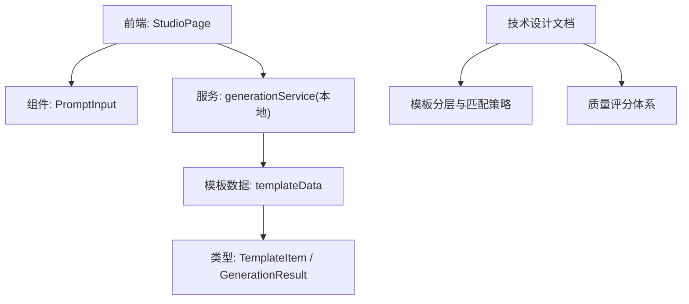
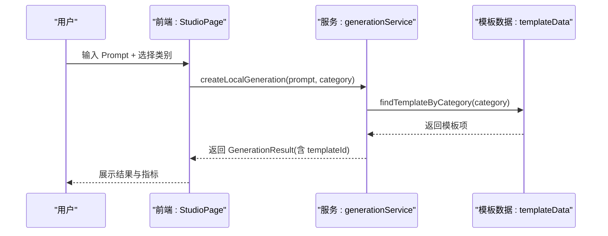
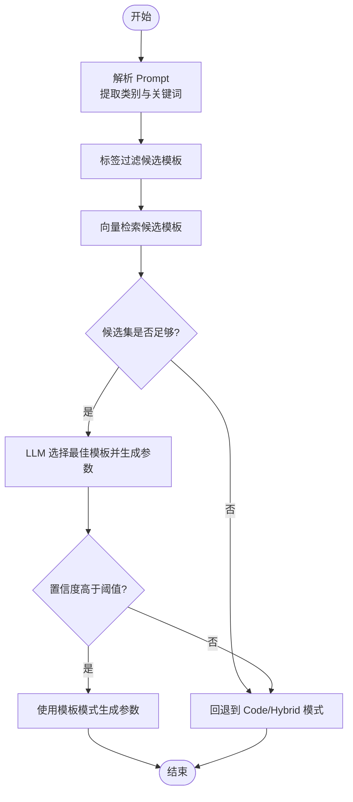
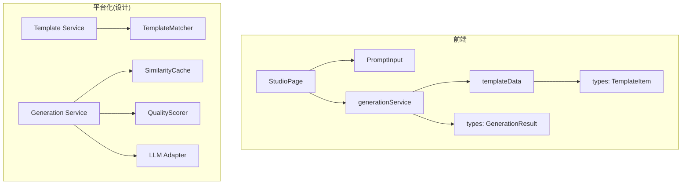

# 模板匹配算法

<cite>
**本文引用的文件列表**
- [产品技术设计文档](file://tech/product-technical-design.md)
- [产品需求文档](file://prd.md)
- [模板类型定义](file://src/shared/types/template.ts)
- [生成任务类型定义](file://src/shared/types/generation.ts)
- [本地生成服务（MVP）](file://src/modules/studio/services/generationService.ts)
- [模板数据与分类查找](file://src/modules/templates/templateData.ts)
- [工作室页面（状态机与流程）](file://src/modules/studio/pages/StudioPage.tsx)
- [提示词输入组件](file://src/modules/studio/components/PromptInput.tsx)
</cite>

## 目录
1. [引言](#引言)
2. [项目结构](#项目结构)
3. [核心组件](#核心组件)
4. [架构总览](#架构总览)
5. [详细组件分析](#详细组件分析)
6. [依赖分析](#依赖分析)
7. [性能考虑](#性能考虑)
8. [故障排查指南](#故障排查指南)
9. [结论](#结论)
10. [附录](#附录)

## 引言
本文件聚焦于 ApexForge 的“模板匹配算法”，围绕以下目标展开：
- Prompt 类别识别、关键词抽取、向量检索与相似度计算的设计与实现路径
- 候选模板筛选策略、权重评分机制与排序算法
- 语义理解、上下文分析与用户偏好学习
- 匹配精度优化、冷启动处理与个性化推荐策略

当前仓库处于 MVP 阶段，模板匹配以“基于类别的精确匹配”为主，并在技术设计文档中明确了后续引入 LLM 进行候选选择、向量检索与质量闭环的演进路线。

## 项目结构
与模板匹配相关的关键位置：
- 类型定义：模板与生成结果的结构化描述
- 模板数据：内置模板集合及按类别查找能力
- 生成服务（MVP）：基于类别的模板选择与模拟生成
- 前端页面：展示生成链路状态、默认提示词与交互入口
- 技术设计文档：模板分层、匹配策略、质量评分与平台化演进

图表来源
- [工作室页面（状态机与流程）:21-79](file://src/modules/studio/pages/StudioPage.tsx#L21-L79)
- [本地生成服务（MVP）:1-29](file://src/modules/studio/services/generationService.ts#L1-L29)
- [模板数据与分类查找:1-53](file://src/modules/templates/templateData.ts#L1-L53)
- [模板类型定义:1-18](file://src/shared/types/template.ts#L1-L18)
- [生成任务类型定义:1-28](file://src/shared/types/generation.ts#L1-L28)
- [产品技术设计文档:797-804](file://tech/product-technical-design.md#L797-L804)

章节来源
- [工作室页面（状态机与流程）:21-79](file://src/modules/studio/pages/StudioPage.tsx#L21-L79)
- [本地生成服务（MVP）:1-29](file://src/modules/studio/services/generationService.ts#L1-L29)
- [模板数据与分类查找:1-53](file://src/modules/templates/templateData.ts#L1-L53)
- [模板类型定义:1-18](file://src/shared/types/template.ts#L1-L18)
- [生成任务类型定义:1-28](file://src/shared/types/generation.ts#L1-L28)
- [产品技术设计文档:797-804](file://tech/product-technical-design.md#L797-L804)

## 核心组件
- 模板数据结构：包含 id、name、category、description、tags、defaultPrompt、complexity 等字段，用于分类、标签与复杂度控制。
- 生成结果结构：包含 prompt、category、templateId、status、traceId、metrics 等，用于记录匹配到的模板与生成指标。
- 模板数据与查找：提供模板数组与按 category 查找函数，作为 MVP 阶段的匹配基础。
- 本地生成服务：根据传入 category 从模板库中选择模板并返回可渲染结果，作为 MVP 的端到端演示。

章节来源
- [模板类型定义:1-18](file://src/shared/types/template.ts#L1-L18)
- [生成任务类型定义:1-28](file://src/shared/types/generation.ts#L1-L28)
- [模板数据与分类查找:1-53](file://src/modules/templates/templateData.ts#L1-L53)
- [本地生成服务（MVP）:1-29](file://src/modules/studio/services/generationService.ts#L1-L29)

## 架构总览
MVP 阶段的模板匹配流程如下：
- 用户在 Studio 页面输入 Prompt 并选择类别
- 前端调用本地生成服务
- 生成服务按类别在模板库中查找模板
- 返回模板命中结果与模拟指标

图表来源
- [工作室页面（状态机与流程）:21-79](file://src/modules/studio/pages/StudioPage.tsx#L21-L79)
- [本地生成服务（MVP）:1-29](file://src/modules/studio/services/generationService.ts#L1-L29)
- [模板数据与分类查找:1-53](file://src/modules/templates/templateData.ts#L1-L53)

章节来源
- [工作室页面（状态机与流程）:21-79](file://src/modules/studio/pages/StudioPage.tsx#L21-L79)
- [本地生成服务（MVP）:1-29](file://src/modules/studio/services/generationService.ts#L1-L29)
- [模板数据与分类查找:1-53](file://src/modules/templates/templateData.ts#L1-L53)

## 详细组件分析

### 模板匹配算法（MVP 到平台化）
- MVP 阶段：基于 category 的精确匹配。通过 templates.find(item => item.category === category) 直接定位模板。
- 平台化阶段（设计文档规划）：
  - 对 Prompt 做类别识别与关键词抽取
  - 使用标签与向量检索找出候选模板
  - 让 LLM 在候选模板中选择最匹配模板并生成参数
  - 置信度低于阈值时切换 Hybrid 或 Code Mode
  - 保存模板命中数据用于优化覆盖率

图表来源
- [产品技术设计文档:797-804](file://tech/product-technical-design.md#L797-L804)

章节来源
- [产品技术设计文档:797-804](file://tech/product-technical-design.md#L797-L804)

### 候选模板筛选策略
- 类别优先：将 Prompt 归一化为 ModelCategory，缩小搜索空间
- 标签匹配：利用 tags 与 description 中的关键词进行初步过滤
- 复杂度约束：结合 complexity 与用户偏好（如低复杂度优先）进行二次筛选
- 缓存命中：相似 Prompt 命中缓存可直接复用结果，避免重复匹配

章节来源
- [模板类型定义:1-18](file://src/shared/types/template.ts#L1-L18)
- [模板数据与分类查找:1-53](file://src/modules/templates/templateData.ts#L1-L53)
- [产品技术设计文档:797-804](file://tech/product-technical-design.md#L797-L804)

### 权重评分机制与排序算法
- 维度建议（参考质量评分体系）：
  - 可渲染性（成功生成 Object3D 并加载）
  - Prompt 匹配度（输出是否符合用户描述）
  - 结构完整性（主体、关键部件、比例合理）
  - 性能表现（Mesh/顶点/材质数量可控）
  - 可编辑性（参数清晰、代码结构化）
- 排序方式：加权总分排序，Top-K 进入 LLM 精排或直接采用最高分模板
- 动态权重：根据用户反馈与历史成功率调整各维度权重

章节来源
- [产品技术设计文档:807-841](file://tech/product-technical-design.md#L807-L841)

### 语义理解、上下文分析与用户偏好学习
- 语义理解：通过 LLM 对 Prompt 进行意图识别与实体抽取（类别、风格、材质、尺寸等）
- 上下文分析：结合最近 N 次生成的 category、模板命中率、用户修改行为构建短期上下文
- 用户偏好学习：统计用户对模板的选择、保存、评分与二次编辑行为，形成长期偏好画像，影响候选排序与权重

章节来源
- [产品技术设计文档:807-841](file://tech/product-technical-design.md#L807-L841)

### 匹配精度优化
- 多源特征融合：类别、标签、描述、示例 Prompt、用户偏好、历史命中率
- 向量检索增强：为模板与 Prompt 建立嵌入表示，使用余弦相似度召回 Top-N
- 规则+模型混合：先规则过滤再模型打分，降低误召回率
- 回归测试：固定 Prompt 集评估匹配准确率与生成成功率，持续迭代

章节来源
- [产品技术设计文档:807-841](file://tech/product-technical-design.md#L807-L841)

### 冷启动处理
- 默认模板兜底：当无明确类别或置信度不足时，使用默认模板或高命中率模板
- 引导式 Prompt：提供 defaultPrompt 与示例，帮助用户快速获得可用结果
- 渐进式细化：先给出粗粒度模板，再通过参数面板逐步细化

章节来源
- [模板数据与分类查找:1-53](file://src/modules/templates/templateData.ts#L1-L53)
- [产品技术设计文档:797-804](file://tech/product-technical-design.md#L797-L804)

### 个性化推荐策略
- 基于用户历史选择与保存行为的协同过滤
- 基于类别偏好的权重提升
- 基于场景（项目/空间）的模板热度排序
- 结合质量评分与用户满意度进行个性化排序

章节来源
- [产品技术设计文档:807-841](file://tech/product-technical-design.md#L807-L841)

## 依赖分析
- 前端依赖：
  - StudioPage 依赖 PromptInput 与 generationService
  - generationService 依赖 templateData 与类型定义
- 后端/平台化依赖（设计文档）：
  - Template Service 负责模板管理与版本
  - Generation Service 内部包含 TemplateMatcher、SimilarityCache、QualityScorer 等模块
  - LLM Adapter 负责候选选择与参数生成

图表来源
- [工作室页面（状态机与流程）:21-79](file://src/modules/studio/pages/StudioPage.tsx#L21-L79)
- [本地生成服务（MVP）:1-29](file://src/modules/studio/services/generationService.ts#L1-L29)
- [模板数据与分类查找:1-53](file://src/modules/templates/templateData.ts#L1-L53)
- [模板类型定义:1-18](file://src/shared/types/template.ts#L1-L18)
- [生成任务类型定义:1-28](file://src/shared/types/generation.ts#L1-L28)
- [产品技术设计文档:594-610](file://tech/product-technical-design.md#L594-L610)

章节来源
- [工作室页面（状态机与流程）:21-79](file://src/modules/studio/pages/StudioPage.tsx#L21-L79)
- [本地生成服务（MVP）:1-29](file://src/modules/studio/services/generationService.ts#L1-L29)
- [模板数据与分类查找:1-53](file://src/modules/templates/templateData.ts#L1-L53)
- [模板类型定义:1-18](file://src/shared/types/template.ts#L1-L18)
- [生成任务类型定义:1-28](file://src/shared/types/generation.ts#L1-L28)
- [产品技术设计文档:594-610](file://tech/product-technical-design.md#L594-L610)

## 性能考虑
- 前端：
  - 动态加载 Three.js 与沙箱 runtime，降低首屏体积
  - 大模型 JSON 解析放入 Worker，主线程专注渲染
  - 使用 InstancedMesh 减少重复几何体开销
- 后端：
  - 相似 Prompt 缓存命中直接返回，避免重复匹配与 LLM 调用
  - 模板模式仅生成参数，跳过完整代码生成
  - 热门模板与 Schema 缓存至 Redis
- 数据库：
  - 针对常用查询字段建索引
  - 大字段迁移对象存储，仅保留 URL 与摘要

章节来源
- [产品技术设计文档:933-958](file://tech/product-technical-design.md#L933-L958)

## 故障排查指南
- 常见问题与定位：
  - 生成失败：检查 traceId 与错误码，确认校验报告与质量评分详情
  - 模板未命中：查看类别识别与标签过滤逻辑，必要时回退到 Code/Hybrid 模式
  - 渲染异常：检查沙箱执行超时、模型复杂度与边界盒检测
- 日志与追踪：
  - 全链路 traceId 贯穿前端、网关、生成服务、LLM、校验、数据库与沙箱
  - 记录耗时、状态、错误码与质量分，便于问题定位与回归对比

章节来源
- [产品技术设计文档:868-908](file://tech/product-technical-design.md#L868-L908)

## 结论
- MVP 阶段以“类别精确匹配 + 模板数据”为核心，快速验证端到端流程
- 平台化阶段引入“类别识别 + 关键词抽取 + 向量检索 + LLM 精排”的混合匹配策略
- 通过质量评分与用户反馈闭环持续提升匹配精度与个性化体验
- 冷启动与个性化推荐确保新用户与长尾场景的可得性与满意度

## 附录

### API 与数据流要点
- 创建生成任务接口支持 mode、contextVersionId、preferences 等字段，便于注入上下文与偏好
- SSE 事件用于实时推送生成状态，便于前端状态同步与用户体验优化

章节来源
- [产品技术设计文档:654-757](file://tech/product-technical-design.md#L654-L757)

### 模板分层与结构
- 模板分层包括骨架、风格变体、细节包、材质预设与参数 Schema
- 模板版本管理包含参数 Schema、默认参数、渲染函数代码、示例 Prompt 与校验规则

章节来源
- [产品技术设计文档:760-796](file://tech/product-technical-design.md#L760-L796)