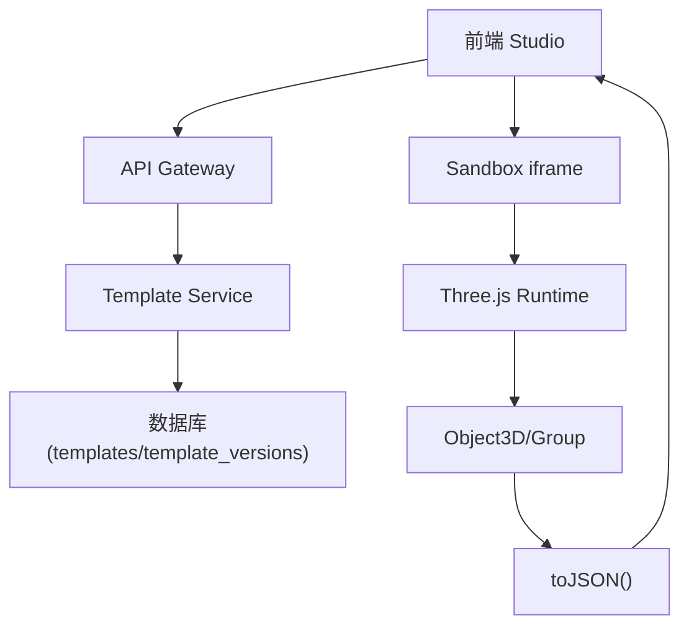
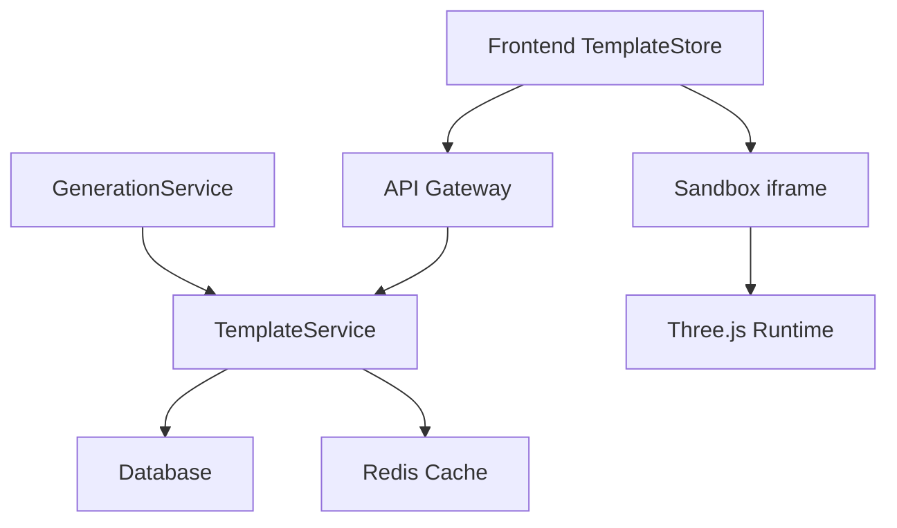
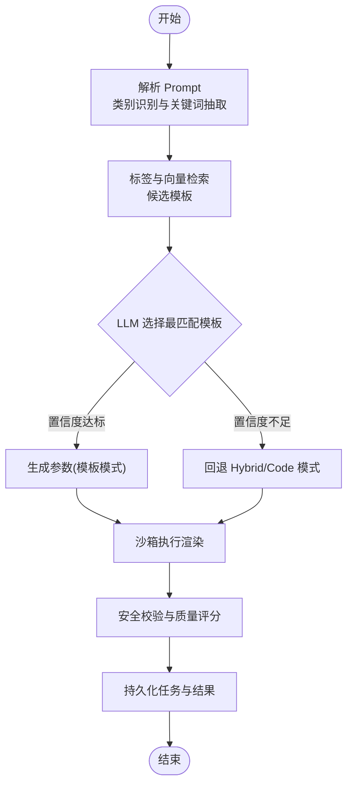

# 模板架构设计

<cite>
**本文引用的文件**   
- [产品技术设计文档](file://tech/product-technical-design.md)
- [产品需求文档](file://prd.md)
</cite>

## 目录
1. [引言](#引言)
2. [项目结构](#项目结构)
3. [核心组件](#核心组件)
4. [架构总览](#架构总览)
5. [详细组件分析](#详细组件分析)
6. [依赖关系分析](#依赖关系分析)
7. [性能考量](#性能考量)
8. [故障排查指南](#故障排查指南)
9. [结论](#结论)
10. [附录](#附录)

## 引言
本文件面向 ApexForge 模板系统的架构设计与实现规范，聚焦以下目标：
- 明确模板分层结构（Skeleton、Style Variant、Detail Pack、Material Preset）及其职责边界与组合方式。
- 定义模板 Schema 规范、参数类型系统与版本管理机制。
- 阐述模板元数据设计、分类体系与标签系统。
- 给出模板文件组织结构、命名规范与依赖管理策略。
- 提供模板开发最佳实践与性能优化建议。

## 项目结构
从工程视角，模板系统贯穿前后端与运行时：
- 后端 TemplateService 负责模板检索、匹配、版本管理与渲染执行编排。
- 前端 TemplateStore 负责模板列表、详情与参数 Schema 的展示与交互。
- 沙箱运行时在 iframe 中加载 Three.js 并执行模板渲染函数，返回序列化模型数据。
- 数据库持久化模板与模板版本信息，包括参数 Schema、默认参数、校验规则等。



图表来源
- [产品技术设计文档:38-62](file://tech/product-technical-design.md#L38-L62)
- [产品技术设计文档:478-506](file://tech/product-technical-design.md#L478-L506)
- [产品技术设计文档:524-550](file://tech/product-technical-design.md#L524-L550)
- [产品技术设计文档:760-804](file://tech/product-technical-design.md#L760-L804)

章节来源
- [产品技术设计文档:38-62](file://tech/product-technical-design.md#L38-L62)
- [产品技术设计文档:524-550](file://tech/product-technical-design.md#L524-L550)
- [产品技术设计文档:760-804](file://tech/product-technical-design.md#L760-L804)

## 核心组件
- 模板服务（Template Service）
  - 职责：模板检索、候选匹配、版本选择、参数校验、渲染执行编排。
  - 关键能力：按类别/标签/向量检索候选；置信度阈值控制回退到 Hybrid/Code 模式；命中记录用于优化覆盖率。
- 模板版本（TemplateVersion）
  - 职责：承载语义化版本、参数 Schema、默认参数、渲染函数代码、示例 Prompt、校验规则。
- 模板元数据（Template）
  - 职责：模板名称、分类、描述、标签、状态、创建/更新时间等。
- 前端模板库（TemplateStore）
  - 职责：维护模板列表、详情、参数 Schema，动态生成表单，支持二次编辑与预览。
- 沙箱运行时（iframe + Three.js）
  - 职责：隔离执行模板渲染函数，返回结构化 JSON，主线程反序列化为可渲染对象。

章节来源
- [产品技术设计文档:576-592](file://tech/product-technical-design.md#L576-L592)
- [产品技术设计文档:760-804](file://tech/product-technical-design.md#L760-L804)
- [产品技术设计文档:524-550](file://tech/product-technical-design.md#L524-L550)
- [产品技术设计文档:478-506](file://tech/product-technical-design.md#L478-L506)

## 架构总览
模板系统在生成链路中的位置与交互如下：
- 用户输入 Prompt 后，Generation Service 调用 Template Service 进行候选模板匹配。
- 若命中且置信度达标，进入 Template Mode，仅生成参数；否则回退至 Hybrid/Code 模式。
- 模板渲染函数在沙箱中执行，产出 Object3D 并序列化返回。
- 结果经安全校验与质量评分后保存为资产版本。

```mermaid
sequenceDiagram
participant FE as "前端"
participant API as "API 网关"
participant GEN as "生成服务"
participant TPL as "模板服务"
participant LLM as "LLM 适配器"
participant VAL as "校验器"
participant DB as "数据库"
participant BOX as "沙箱"
FE->>API : "POST /api/v1/generations"
API->>GEN : "createGenerationTask"
GEN->>TPL : "findCandidateTemplate"
TPL-->>GEN : "候选模板(含版本)"
alt "置信度达标"
GEN->>LLM : "生成参数(模板模式)"
LLM-->>GEN : "参数对象"
else "置信度不足"
GEN->>LLM : "生成代码或混合输出"
LLM-->>GEN : "代码/混合结果"
end
GEN->>VAL : "校验输出"
VAL-->>GEN : "校验报告"
GEN->>BOX : "执行渲染(模板或代码)"
BOX-->>GEN : "模型JSON"
GEN->>DB : "持久化任务与结果"
GEN-->>API : "返回结果"
API-->>FE : "渲染载荷"
```

图表来源
- [产品技术设计文档:361-390](file://tech/product-technical-design.md#L361-L390)
- [产品技术设计文档:760-804](file://tech/product-technical-design.md#L760-L804)
- [产品技术设计文档:478-506](file://tech/product-technical-design.md#L478-L506)

## 详细组件分析

### 模板分层结构与组合
模板采用分层解耦设计，便于复用与组合：
- Skeleton（骨架）：定义主体比例、关键部件位置与结构约束。
- Style Variant（风格变体）：在同一骨架上调整曲线、比例与装饰元素以形成不同风格。
- Detail Pack（细节包）：附加装饰件（灯带、轮毂、天线、纹理等）。
- Material Preset（材质预设）：统一材质表现（金属、玻璃、塑料、发光等）。
- Param Schema（参数 Schema）：定义参数范围、默认值与校验规则。

组合原则：
- 先确定 Skeleton，再叠加 Style Variant，随后按需引入 Detail Pack 与 Material Preset。
- 所有层级通过统一的参数接口暴露，避免硬耦合。
- 变更应遵循语义化版本，确保向后兼容。

章节来源
- [产品技术设计文档:787-796](file://tech/product-technical-design.md#L787-L796)

### 模板 Schema 定义规范
Schema 是模板参数的契约，需满足：
- 字段类型：string、number、boolean、enum、array、object 等。
- 格式与约束：如 color、url、min/max、pattern、required、default。
- 校验规则：服务端 validationRules 与前端动态表单联动。
- 示例与说明：examplePrompts 与字段注释提升可用性。

推荐约定：
- 使用小驼峰命名，保持可读性与一致性。
- 对数值型参数提供合理 min/max 与 step。
- 对颜色类参数使用 format=color，并提供默认色板。
- 对枚举类参数提供可选值集合与默认项。

章节来源
- [产品技术设计文档:760-785](file://tech/product-technical-design.md#L760-L785)
- [产品技术设计文档:284-296](file://tech/product-technical-design.md#L284-L296)

### 参数类型系统与校验
- 类型系统：基础类型与复合类型（数组、对象），支持嵌套与条件显示。
- 校验流程：
  - 协议层：检查 mode、templateId、params 结构。
  - 文本黑名单：快速阻断危险内容。
  - AST 白名单：限制语法与 API 使用。
  - 运行时沙箱：隔离执行与超时销毁。
  - 结果校验：检查模型 JSON 与复杂度指标。
- 错误分类：超时、运行时报错、模型 JSON 非法、复杂度超限、空模型等。

章节来源
- [产品技术设计文档:428-470](file://tech/product-technical-design.md#L428-L470)
- [产品技术设计文档:508-517](file://tech/product-technical-design.md#L508-L517)

### 版本管理机制
- 模板与版本分离：Template 表存储元数据，TemplateVersion 表存储具体实现与 Schema。
- 语义化版本：major.minor.patch，保证兼容性演进。
- 默认参数与示例 Prompt：每个版本独立维护，便于回归测试与演示。
- 命中追踪：记录模板命中情况，用于优化覆盖率和匹配策略。

章节来源
- [产品技术设计文档:270-296](file://tech/product-technical-design.md#L270-L296)
- [产品技术设计文档:797-804](file://tech/product-technical-design.md#L797-L804)

### 模板元数据、分类与标签
- 元数据：id、name、category、description、tags、status、createdBy、createdAt、updatedAt。
- 分类体系：按领域划分（vehicle、architecture、aircraft、furniture、prop 等）。
- 标签系统：多维标签（风格、材质、复杂度、适用场景），支持检索与筛选。
- 状态管理：draft、published、deprecated，配合发布流程与灰度策略。

章节来源
- [产品技术设计文档:270-283](file://tech/product-technical-design.md#L270-L283)

### 模板文件组织与命名规范
- 文件组织：
  - 模板清单与元数据集中管理。
  - 各层级（Skeleton、Style Variant、Detail Pack、Material Preset）独立文件，便于复用。
  - 参数 Schema 与默认参数随版本绑定。
- 命名规范：
  - 模板 ID 使用点分隔的层次结构，如 vehicle.sport_car.v1。
  - 文件名与模块名保持一致，避免歧义。
  - 版本号遵循语义化版本，增量更新时保持向后兼容。
- 依赖管理：
  - 显式声明层级依赖（如 Style Variant 依赖特定 Skeleton）。
  - 资源引用（纹理、贴图）使用稳定 URL，避免运行时动态加载。

章节来源
- [产品技术设计文档:760-785](file://tech/product-technical-design.md#L760-L785)
- [产品技术设计文档:1001-1036](file://tech/product-technical-design.md#L1001-L1036)

### 模板匹配策略与回退机制
- 匹配流程：
  - 对用户 Prompt 做类别识别与关键词抽取。
  - 使用标签与向量检索找出候选模板。
  - 让 LLM 在候选中选择最匹配模板并生成参数。
  - 置信度低于阈值时，切换 Hybrid 或 Code 模式。
- 命中记录：
  - 保存模板命中数据，用于优化模板覆盖率与匹配算法。

章节来源
- [产品技术设计文档:797-804](file://tech/product-technical-design.md#L797-L804)

### 渲染执行与沙箱集成
- 执行流程：
  - 主页面生成 executionId，向 iframe 发送执行指令。
  - iframe 包装代码并执行 buildModel(params, THREE)。
  - 成功后调用 group.toJSON()，主页面使用 ObjectLoader 反序列化。
  - 自动居中缩放，计算边界盒，统计复杂度。
  - 超时或异常则销毁 iframe 并返回错误。
- 安全配置：
  - sandbox="allow-scripts"，CSP 限制脚本来源。
  - 每次执行创建任务 ID，超时未返回则销毁。
  - 只暴露 THREE、安全构建函数与 params。

章节来源
- [产品技术设计文档:478-506](file://tech/product-technical-design.md#L478-L506)

### 模板开发最佳实践
- 优先使用模板模式，必要时再自由生成代码。
- 将复杂逻辑拆分为可复用的层级模块，减少重复代码。
- 严格遵循参数 Schema，提供合理的默认值与约束。
- 编写示例 Prompt 与单元测试，确保稳定性。
- 使用 InstancedMesh 与 LOD 优化渲染性能。
- 释放旧模型时必须遍历 dispose geometry、material、texture。

章节来源
- [产品技术设计文档:21-31](file://tech/product-technical-design.md#L21-L31)
- [产品技术设计文档:563-571](file://tech/product-technical-design.md#L563-L571)

### 性能优化建议
- 前端：
  - 动态加载 Three.js 与沙箱 runtime，降低首屏体积。
  - 模型 JSON 解析放入 Worker，主线程只做渲染挂载。
  - 对重复几何体优先使用 InstancedMesh。
  - 加载前统计复杂度，超过阈值提示降级。
- 后端：
  - 相似 Prompt 缓存，向量相似度大于阈值时复用结果。
  - 模板模式跳过 LLM 代码生成，改为参数生成。
  - 热门模板与参数 Schema 缓存在 Redis。

章节来源
- [产品技术设计文档:563-571](file://tech/product-technical-design.md#L563-L571)
- [产品技术设计文档:944-951](file://tech/product-technical-design.md#L944-L951)

## 依赖关系分析
模板系统的关键依赖与耦合关系如下：
- TemplateService 依赖数据库（templates/template_versions）与缓存（Redis）。
- GenerationService 依赖 TemplateService 进行候选匹配与参数生成。
- 前端 TemplateStore 依赖 API 获取模板列表与详情。
- 沙箱运行时依赖 Three.js 与 postMessage 通信。



图表来源
- [产品技术设计文档:594-609](file://tech/product-technical-design.md#L594-L609)
- [产品技术设计文档:524-550](file://tech/product-technical-design.md#L524-L550)
- [产品技术设计文档:478-506](file://tech/product-technical-design.md#L478-L506)

章节来源
- [产品技术设计文档:594-609](file://tech/product-technical-design.md#L594-L609)
- [产品技术设计文档:524-550](file://tech/product-technical-design.md#L524-L550)

## 性能考量
- 模板模式优先：参数生成仅需 10～50ms，避免 LLM 调用开销。
- 缓存策略：相似 Prompt 与热门模板缓存，降低延迟与成本。
- 渲染优化：InstancedMesh、LOD、Worker 解析大模型 JSON。
- 资源释放：及时 dispose geometry、material、texture，避免内存泄漏。

章节来源
- [产品技术设计文档:944-951](file://tech/product-technical-design.md#L944-L951)
- [产品技术设计文档:563-571](file://tech/product-technical-design.md#L563-L571)

## 故障排查指南
- 常见错误码与处理：
  - SANDBOX_TIMEOUT：执行超时，检查模型复杂度与超时阈值。
  - SANDBOX_RUNTIME_ERROR：运行时报错，查看生成代码与参数。
  - MODEL_JSON_INVALID：返回结构非法，检查模板渲染函数。
  - MODEL_TOO_COMPLEX：复杂度超限，提示用户降级或使用模板模式。
  - MODEL_EMPTY：未生成有效对象，补充模型主体描述。
- 日志与追踪：
  - 记录 traceId、userId、workspaceId、taskId、provider、promptVersion、generationMode、latencyMs、status、errorCode、qualityScore。
- 告警规则：
  - 生成失败率过高、LLM 延迟过高、校验失败突增、沙箱超时突增、API 错误率过高。

章节来源
- [产品技术设计文档:508-517](file://tech/product-technical-design.md#L508-L517)
- [产品技术设计文档:882-907](file://tech/product-technical-design.md#L882-L907)

## 结论
ApexForge 模板系统通过分层解耦、Schema 驱动与版本化管理，实现了高可用、高性能与可扩展的模板生态。结合严格的校验与安全策略，以及完善的观测与反馈闭环，平台能够在保证稳定性的同时持续进化生成质量。建议在后续迭代中继续完善模板覆盖率、匹配算法与性能优化，推动从 MVP 向企业级平台平滑演进。

## 附录

### 模板 Schema 示例结构
- templateId、version、category、paramSchema、defaultParams、renderer。
- paramSchema 包含 type、format、default、min/max、pattern 等约束。

章节来源
- [产品技术设计文档:760-785](file://tech/product-technical-design.md#L760-L785)

### 模板匹配流程图


图表来源
- [产品技术设计文档:797-804](file://tech/product-technical-design.md#L797-L804)
- [产品技术设计文档:428-470](file://tech/product-technical-design.md#L428-L470)