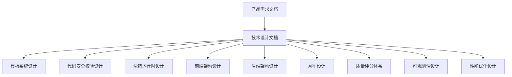
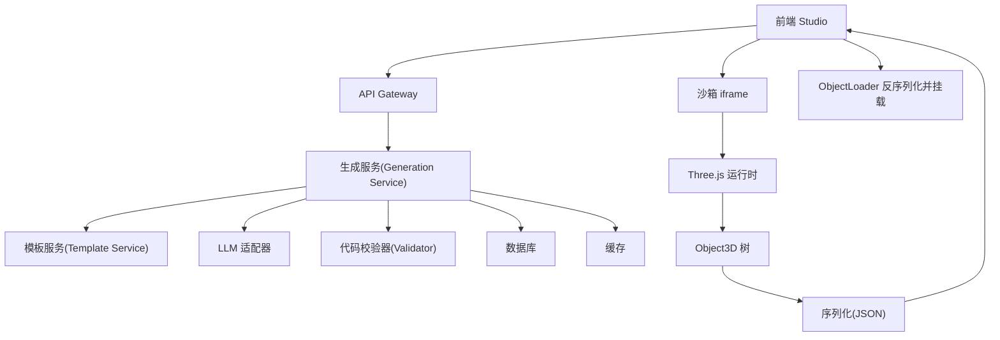
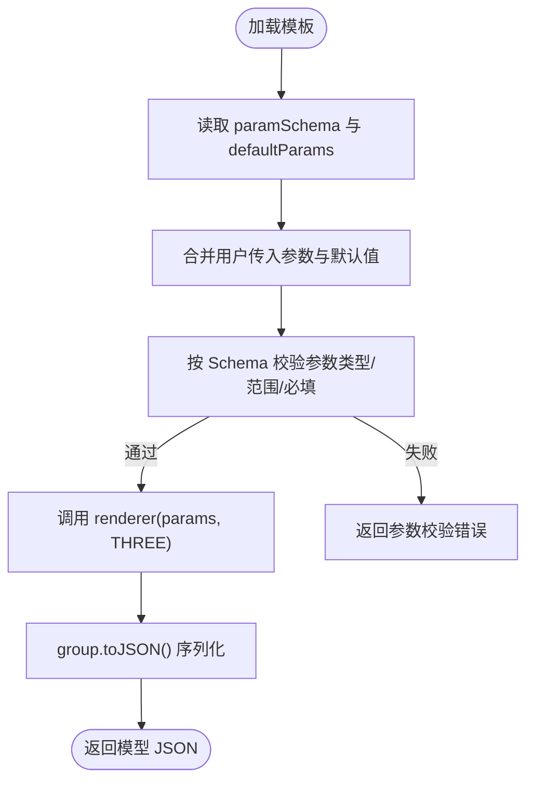
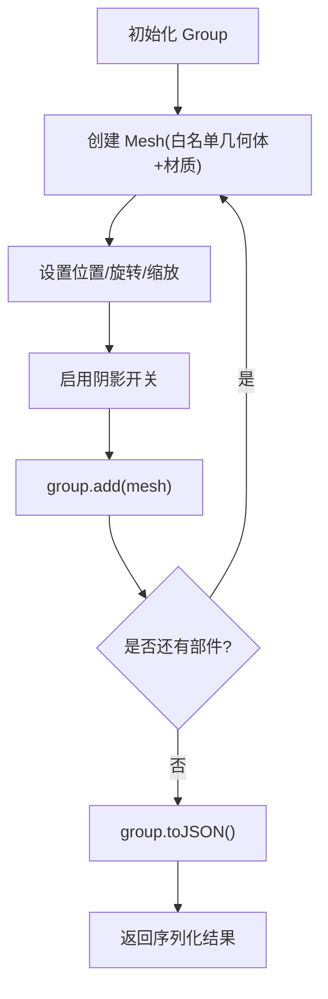
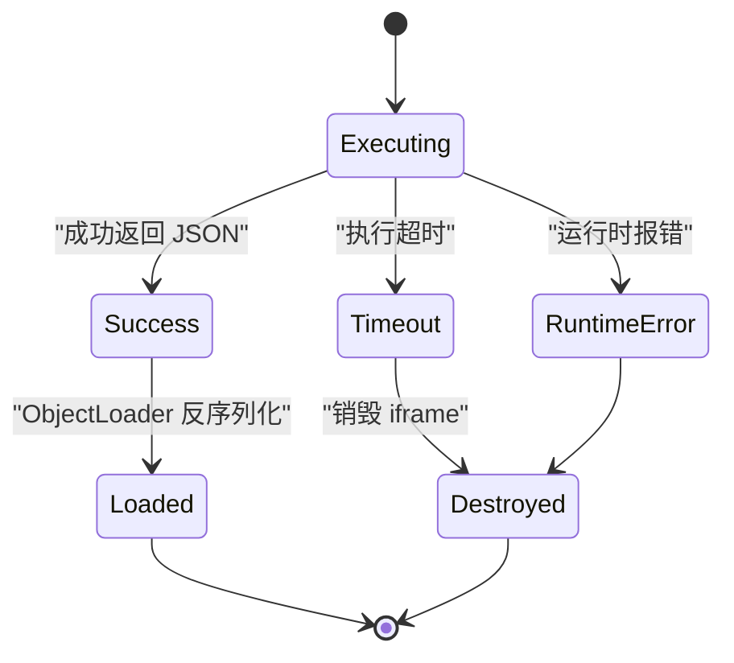
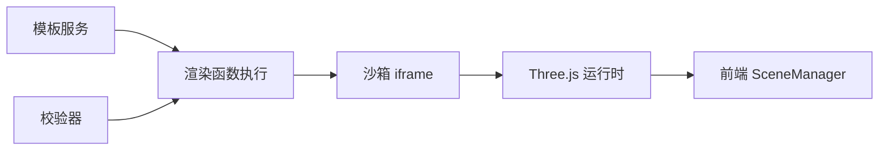

# 模板渲染引擎

<cite>
**本文引用的文件**
- [产品需求文档](file://prd.md)
- [产品技术设计文档](file://tech/product-technical-design.md)
</cite>

## 目录
1. [引言](#引言)
2. [项目结构](#项目结构)
3. [核心组件](#核心组件)
4. [架构总览](#架构总览)
5. [详细组件分析](#详细组件分析)
6. [依赖关系分析](#依赖关系分析)
7. [性能考虑](#性能考虑)
8. [故障排查指南](#故障排查指南)
9. [结论](#结论)
10. [附录](#附录)

## 引言
本文件面向 ApexForge 的“模板渲染引擎”，聚焦于以下目标：
- 明确模板渲染函数的执行环境、参数验证与默认值处理机制。
- 解释 Three.js 模型构建流程，包括几何体生成与材质应用约束。
- 提供渲染性能监控、错误处理与调试工具建议。
- 给出渲染器安全沙箱、资源管理与内存优化策略。

该文档基于仓库中的产品需求与技术设计文档进行系统化整理，旨在为前后端工程师、算法工程师与运维人员提供可落地的实现参考。

## 项目结构
当前仓库包含两份关键文档：
- 产品需求文档：定义平台目标、核心能力、前端/后端/AI 角色分工、安全与性能原则等。
- 产品技术设计文档：细化架构、数据模型、API、模板系统、质量评分、可观测性、工程落地计划等。



图表来源
- [产品需求文档:1-168](file://prd.md#L1-L168)
- [产品技术设计文档:1-1149](file://tech/product-technical-design.md#L1-L1149)

章节来源
- [产品需求文档:1-168](file://prd.md#L1-L168)
- [产品技术设计文档:1-1149](file://tech/product-technical-design.md#L1-L1149)

## 核心组件
围绕模板渲染引擎，核心组件包括：
- 模板系统与参数 Schema：定义模板版本、参数范围、默认值与校验规则。
- 渲染函数执行环境：在受控 iframe 中运行，仅暴露受限 API（如 THREE）。
- 参数验证与默认值处理：在服务端与前端双重校验，缺失字段按 Schema 补全。
- Three.js 模型构建流程：限制几何体与材质白名单，输出序列化 JSON 供主线程加载。
- 安全沙箱与超时销毁：iframe sandbox + CSP + 黑名单/AST 校验 + 执行超时保护。
- 性能与资源管理：复杂度阈值、实例化复用、旧对象释放、Worker 解析大模型。
- 可观测性与质量评估：traceId、日志、指标、质量评分与用户反馈闭环。

章节来源
- [产品技术设计文档:760-804](file://tech/product-technical-design.md#L760-L804)
- [产品技术设计文档:428-470](file://tech/product-technical-design.md#L428-L470)
- [产品技术设计文档:472-518](file://tech/product-technical-design.md#L472-L518)
- [产品技术设计文档:520-571](file://tech/product-technical-design.md#L520-L571)
- [产品技术设计文档:807-841](file://tech/product-technical-design.md#L807-L841)
- [产品技术设计文档:868-907](file://tech/product-technical-design.md#L868-L907)
- [产品技术设计文档:933-958](file://tech/product-technical-design.md#L933-L958)

## 架构总览
整体架构强调“模板优先、代码为辅”的安全可控路径，通过多阶段校验与隔离执行保障稳定性与安全性。



图表来源
- [产品技术设计文档:36-62](file://tech/product-technical-design.md#L36-L62)
- [产品技术设计文档:478-488](file://tech/product-technical-design.md#L478-L488)

章节来源
- [产品技术设计文档:36-62](file://tech/product-technical-design.md#L36-L62)
- [产品技术设计文档:478-488](file://tech/product-technical-design.md#L478-L488)

## 详细组件分析

### 模板系统与参数 Schema
- 模板结构包含 templateId、version、category、paramSchema、defaultParams、renderer 等字段。
- paramSchema 定义每个参数的类型、格式、取值范围与默认值；defaultParams 提供模板初始参数。
- renderer 为受控渲染函数，接收 params 与受限 THREE 上下文，返回 Group 或可序列化的对象。



图表来源
- [产品技术设计文档:760-804](file://tech/product-technical-design.md#L760-L804)

章节来源
- [产品技术设计文档:760-804](file://tech/product-technical-design.md#L760-L804)

### 渲染函数执行环境与参数验证
- 执行环境：隐藏 iframe，sandbox="allow-scripts"，CSP 仅允许预构建 runtime；仅暴露 THREE、params 与安全工具函数。
- 参数验证：服务端 AST 与文本黑名单快速阻断危险语法；客户端再次校验返回 JSON 结构与复杂度。
- 默认值处理：若用户未传参，使用模板 defaultParams 补齐；对缺失字段按 Schema 类型与范围进行二次校验。

```mermaid
sequenceDiagram
participant FE as "前端"
participant API as "API 网关"
participant GEN as "生成服务"
participant TPL as "模板服务"
participant LLM as "LLM 适配器"
participant VAL as "校验器"
participant BOX as "沙箱 iframe"
participant RT as "Three.js 运行时"
FE->>API : "POST /api/v1/generations"
API->>GEN : "创建任务"
GEN->>TPL : "匹配候选模板"
TPL-->>GEN : "返回模板与参数 Schema"
GEN->>LLM : "生成参数或代码"
LLM-->>GEN : "输出结果"
GEN->>VAL : "AST/黑名单校验"
VAL-->>GEN : "校验报告"
GEN-->>FE : "返回可执行代码/参数"
FE->>BOX : "postMessage { executionId, code, params }"
BOX->>RT : "执行 buildModel(params, THREE)"
RT-->>BOX : "group.toJSON()"
BOX-->>FE : "返回模型 JSON"
```

图表来源
- [产品技术设计文档:362-390](file://tech/product-technical-design.md#L362-L390)
- [产品技术设计文档:498-506](file://tech/product-technical-design.md#L498-L506)

章节来源
- [产品技术设计文档:472-518](file://tech/product-technical-design.md#L472-L518)
- [产品技术设计文档:362-390](file://tech/product-technical-design.md#L362-L390)

### Three.js 模型构建流程与约束
- 几何体与材质白名单：仅允许基础几何体与标准/物理材质，确保渲染一致性与性能可控。
- 阴影与可见性：要求开启 castShadow 与 receiveShadow，提升真实感与交互体验。
- 输出规范：必须返回 Group 或可序列化对象，禁止回传函数或 DOM 引用。



图表来源
- [产品技术设计文档:452-469](file://tech/product-technical-design.md#L452-L469)
- [产品技术设计文档:498-506](file://tech/product-technical-design.md#L498-L506)

章节来源
- [产品技术设计文档:452-469](file://tech/product-technical-design.md#L452-L469)
- [产品技术设计文档:498-506](file://tech/product-technical-design.md#L498-L506)

### 安全沙箱与错误分类
- 隔离方案：iframe sandbox + CSP，禁止网络、DOM、同源访问；每次执行分配 executionId，超时自动销毁。
- 错误分类：SANDBOX_TIMEOUT、SANDBOX_RUNTIME_ERROR、MODEL_JSON_INVALID、MODEL_TOO_COMPLEX、MODEL_EMPTY 等，便于前端提示与重试策略。



图表来源
- [产品技术设计文档:478-518](file://tech/product-technical-design.md#L478-L518)

章节来源
- [产品技术设计文档:478-518](file://tech/product-technical-design.md#L478-L518)

### 性能监控与调试工具
- 前端性能策略：动态加载 Three.js 与沙箱 runtime；模型 JSON 解析放入 Worker；重复几何体使用 InstancedMesh；页面不可见时暂停渲染循环；释放旧模型 geometry/material/texture。
- 可观测性：traceId 贯穿全流程；记录耗时、状态、错误码、质量分；告警规则覆盖失败率、延迟突增、校验失败突增、沙箱超时突增、API 错误率。
- 调试建议：在沙箱内打印执行摘要（不泄露敏感信息）；记录 AST 摘要与复杂度指标；保存截图与边界盒尺寸用于回归对比。

章节来源
- [产品技术设计文档:520-571](file://tech/product-technical-design.md#L520-L571)
- [产品技术设计文档:868-907](file://tech/product-technical-design.md#L868-L907)
- [产品技术设计文档:807-841](file://tech/product-technical-design.md#L807-L841)

### 资源管理与内存优化策略
- 模型加载前复杂度检查：超过阈值提示降级或切换模板模式。
- 旧模型释放：遍历 dispose geometry、material、texture，避免内存泄漏。
- 大模型解析移至 Worker：降低主线程阻塞风险。
- 相机与控制器状态解耦：模型替换不影响视角与交互。

章节来源
- [产品技术设计文档:520-571](file://tech/product-technical-design.md#L520-L571)
- [产品技术设计文档:933-958](file://tech/product-technical-design.md#L933-L958)

## 依赖关系分析
模板渲染引擎的关键依赖如下：
- 模板服务：提供模板元数据、参数 Schema、默认值与渲染函数。
- 校验器：AST 与黑名单校验，限制危险 API 与复杂度。
- 沙箱 iframe：隔离执行环境，控制生命周期与通信协议。
- Three.js 运行时：提供受限 API 与序列化能力。
- 前端 SceneManager：负责场景初始化、模型加载与视图适配。



图表来源
- [产品技术设计文档:594-609](file://tech/product-technical-design.md#L594-L609)
- [产品技术设计文档:478-518](file://tech/product-technical-design.md#L478-L518)

章节来源
- [产品技术设计文档:594-609](file://tech/product-technical-design.md#L594-L609)
- [产品技术设计文档:478-518](file://tech/product-technical-design.md#L478-L518)

## 性能考虑
- 前端优化：按需加载 Three.js 与沙箱 runtime；模型解析放入 Worker；InstancedMesh 批量渲染；LOD 与低面数基础几何体；页面不可见时暂停渲染。
- 后端优化：相似 Prompt 缓存；模板模式跳过 LLM；异步生成任务；供应商并发与熔断；热门模板与 Schema 缓存。
- 数据库优化：索引 traceId、workspaceId、createdAt 等；大字段迁移至对象存储；历史任务归档。

章节来源
- [产品技术设计文档:933-958](file://tech/product-technical-design.md#L933-L958)

## 故障排查指南
- 常见错误码与处理：
  - SANDBOX_TIMEOUT：执行超时，提示用户降低细节或改用模板模式。
  - SANDBOX_RUNTIME_ERROR：运行时报错，引导重试或调整参数。
  - MODEL_JSON_INVALID：返回结构非法，系统自动重新生成。
  - MODEL_TOO_COMPLEX：复杂度超限，建议降级或使用模板模式。
  - MODEL_EMPTY：未生成有效对象，提示补充描述主体。
- 定位方法：
  - 查看 traceId 关联日志，确认各阶段耗时与状态。
  - 检查 AST 摘要与复杂度指标，定位危险语法或过度复杂结构。
  - 对比截图与边界盒尺寸，识别空模型或比例异常。
  - 复现问题并收集沙箱执行摘要（不含敏感信息），辅助回归测试。

章节来源
- [产品技术设计文档:498-518](file://tech/product-technical-design.md#L498-L518)
- [产品技术设计文档:868-907](file://tech/product-technical-design.md#L868-L907)
- [产品技术设计文档:807-841](file://tech/product-technical-design.md#L807-L841)

## 结论
ApexForge 模板渲染引擎以“模板优先、代码为辅”为核心策略，通过严格的参数 Schema、AST 与黑名单校验、iframe 沙箱隔离与超时销毁，确保生成结果的可渲染性与安全性。配合前端性能优化、资源管理与可观测性体系，形成从生成到渲染的全链路稳定闭环。后续可在模板覆盖率、质量评分与多供应商路由方面持续演进，进一步提升生成成功率与用户体验。

## 附录

### API 与事件速览
- 创建生成任务：POST /api/v1/generations
- 查询生成任务：GET /api/v1/generations/{taskId}
- 保存为资产：POST /api/v1/assets
- 查询资产版本：GET /api/v1/assets/{assetId}/versions
- SSE 事件：GET /api/v1/generations/{taskId}/events

章节来源
- [产品技术设计文档:632-757](file://tech/product-technical-design.md#L632-L757)