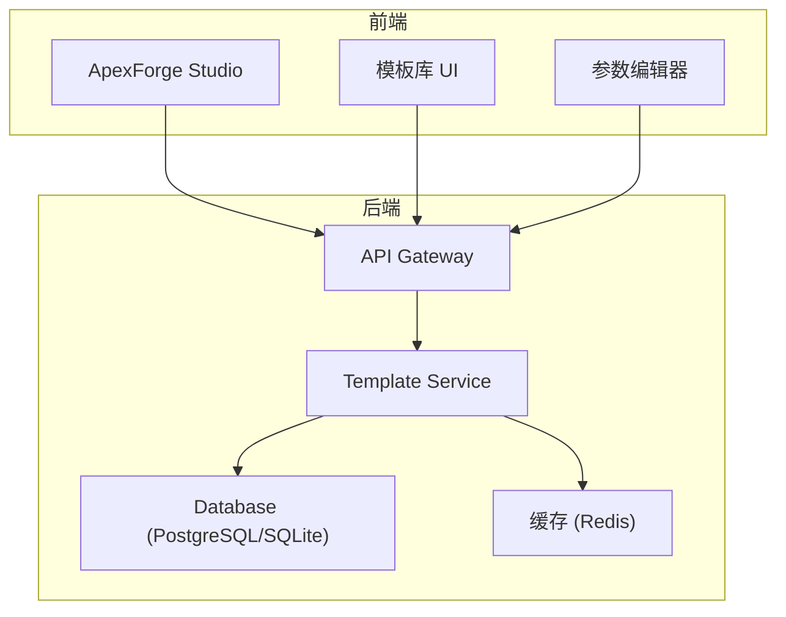
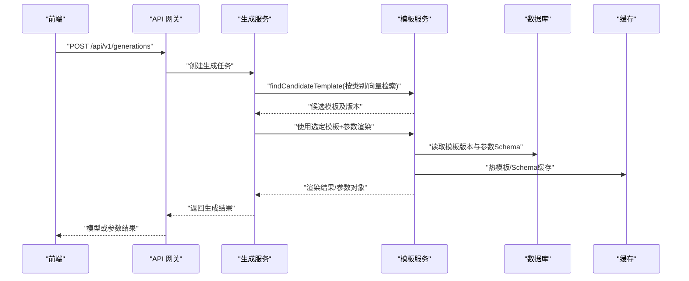
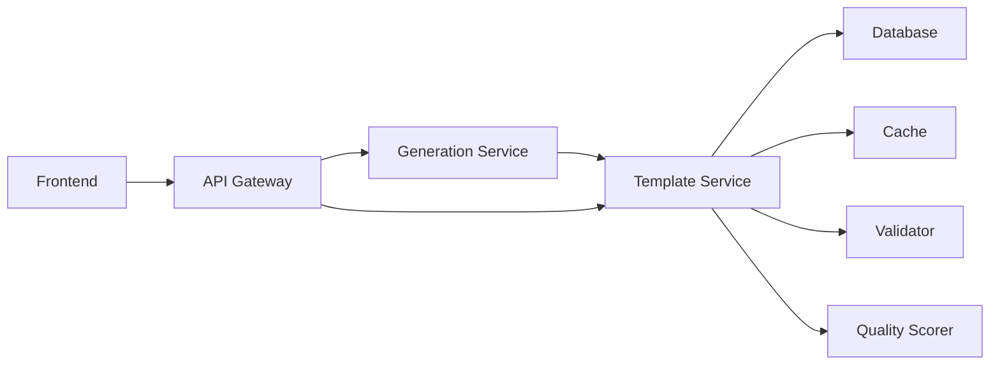
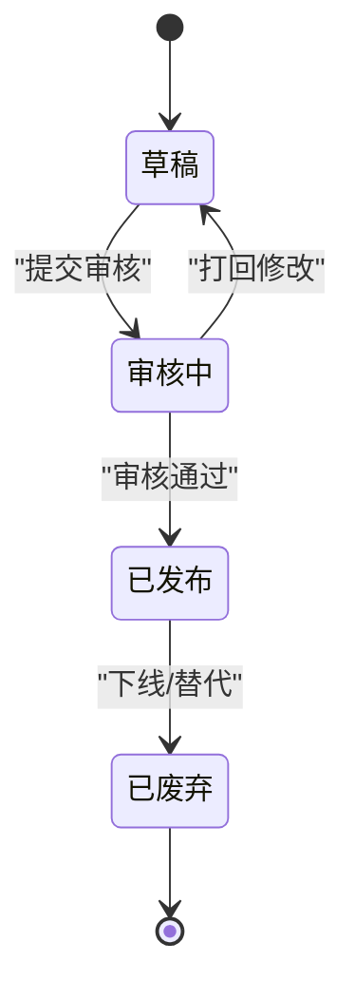

# 模板版本管理

<cite>
**本文引用的文件**   
- [产品技术设计文档](file://tech/product-technical-design.md)
- [产品需求文档](file://prd.md)
</cite>

## 目录
1. [引言](#引言)
2. [项目结构](#项目结构)
3. [核心组件](#核心组件)
4. [架构总览](#架构总览)
5. [详细组件分析](#详细组件分析)
6. [依赖分析](#依赖分析)
7. [性能考虑](#性能考虑)
8. [故障排查指南](#故障排查指南)
9. [结论](#结论)
10. [附录](#附录)

## 引言
本文件面向 ApexForge 的模板系统，聚焦“模板版本管理”的全生命周期：版本控制策略、语义化版本规范、变更日志与发布流程、兼容性检查与迁移策略、回滚机制、版本对比工具、影响分析与依赖管理。内容基于仓库中的产品与技术设计文档进行系统化梳理与扩展，确保可落地执行并兼顾向后兼容与风险控制。

## 项目结构
ApexForge 采用前后端分离与模块化服务架构，模板相关能力由后端 Template Service 与前端 Template Store/Template Library 共同支撑；数据库层提供 templates 与 template_versions 表以承载模板元数据与版本信息。

图示来源
- [产品技术设计文档:38-100](file://tech/product-technical-design.md#L38-L100)
- [产品技术设计文档:576-592](file://tech/product-technical-design.md#L576-L592)
- [产品技术设计文档:724-733](file://tech/product-technical-design.md#L724-L733)

章节来源
- [产品技术设计文档:38-100](file://tech/product-technical-design.md#L38-L100)
- [产品技术设计文档:576-592](file://tech/product-technical-design.md#L576-L592)
- [产品技术设计文档:724-733](file://tech/product-technical-design.md#L724-L733)

## 核心组件
- 模板实体与版本实体
  - templates：模板元数据（名称、分类、描述、标签、状态等）
  - template_versions：模板版本（语义化版本、参数 Schema、默认参数、渲染函数代码、示例 Prompt、校验规则等）
- 模板服务
  - 负责模板 CRUD、版本发布、参数 Schema 校验、匹配与渲染
- 生成链路集成
  - Generation Service 在模板模式下通过 Template Service 选择模板并生成参数
- 前端模板模块
  - 模板列表、详情、参数编辑、预览与二次生成

章节来源
- [产品技术设计文档:270-296](file://tech/product-technical-design.md#L270-L296)
- [产品技术设计文档:576-592](file://tech/product-technical-design.md#L576-L592)
- [产品技术设计文档:724-733](file://tech/product-technical-design.md#L724-L733)

## 架构总览
模板版本管理与生成链路的交互如下：

图示来源
- [产品技术设计文档:362-390](file://tech/product-technical-design.md#L362-L390)
- [产品技术设计文档:724-733](file://tech/product-technical-design.md#L724-L733)
- [产品技术设计文档:797-804](file://tech/product-technical-design.md#L797-L804)

## 详细组件分析

### 模板版本控制策略
- 版本粒度
  - 模板级版本：每个模板独立维护版本序列，避免跨模板耦合
  - 参数 Schema 版本：当参数定义变更时，必须升版
  - 渲染函数版本：渲染逻辑变更需升版，保证可追溯
- 版本标识
  - 采用语义化版本（主.次.修订），用于 template_versions.version 字段
- 版本关系
  - 模板与版本为一对多关系；生成任务记录命中模板与具体版本 ID
- 状态机
  - 模板状态：草稿、已发布、已废弃
  - 版本状态：建议引入 draft/published/deprecated，便于灰度与回滚

章节来源
- [产品技术设计文档:270-296](file://tech/product-technical-design.md#L270-L296)
- [产品技术设计文档:362-390](file://tech/product-technical-design.md#L362-390)

### 语义化版本规范
- 版本号格式：MAJOR.MINOR.PATCH
  - MAJOR：破坏性变更（如参数 Schema 不兼容、渲染函数签名变更）
  - MINOR：新增功能（如新增可选参数、新增示例 Prompt）
  - PATCH：缺陷修复与行为修正（如默认值调整、边界条件修复）
- 版本命名约定
  - 禁止使用预发布后缀（如 alpha/beta）对外暴露，内部可用分支或环境隔离
- 版本发布门槛
  - 必须通过参数 Schema 校验、回归测试集、安全扫描与质量评分基线

章节来源
- [产品技术设计文档:284-296](file://tech/product-technical-design.md#L284-L296)

### 变更日志管理
- 变更记录项
  - 变更类型（新增/修改/删除）、变更范围（参数/渲染/示例/校验）、影响面（下游模板/生成模式）
- 记录位置
  - 建议在模板版本元数据中增加 changelog 字段或关联变更日志表
- 审计与回溯
  - 结合 AuditLog 与 traceId，定位每次变更的影响与问题根因

章节来源
- [产品技术设计文档:284-296](file://tech/product-technical-design.md#L284-L296)

### 版本兼容性检查
- 向后兼容原则
  - 新增参数为可选且具备默认值
  - 移除参数需保留兼容映射并在下一主版本彻底清理
  - 渲染函数签名不得破坏已有调用方式
- 兼容性矩阵
  - 维护模板版本与参数 Schema 的兼容矩阵，供匹配器与校验器使用
- 自动化检查
  - 构建期运行 Schema 差异比对与回归用例，阻断不兼容发布

章节来源
- [产品技术设计文档:284-296](file://tech/product-technical-design.md#L284-L296)

### 向后兼容性与迁移策略
- 渐进式迁移
  - 先发布兼容版本，再逐步淘汰旧参数；通过默认值与映射表平滑过渡
- 数据迁移
  - 历史任务的 templateVersionId 保持不变，仅在新版本发布后生效
- 降级与回退
  - 支持将模板指向上一稳定版本，快速恢复业务

章节来源
- [产品技术设计文档:284-296](file://tech/product-technical-design.md#L284-L296)

### 模板发布流程与审核机制
- 发布流程
  - 草稿 -> 提交审核 -> 合规与安全扫描 -> 回归测试 -> 灰度发布 -> 全量发布
- 审核要点
  - 参数 Schema 正确性、示例 Prompt 覆盖、渲染稳定性、复杂度阈值、安全白名单
- 灰度策略
  - 按空间/用户比例灰度，监控失败率与质量分，达标后全量

章节来源
- [产品技术设计文档:724-733](file://tech/product-technical-design.md#L724-L733)

### 回滚操作
- 触发条件
  - 线上异常、质量指标跌破阈值、安全告警
- 回滚步骤
  - 将模板当前活跃版本切换至上一稳定版本
  - 清理缓存，重新加载 Schema 与渲染函数
  - 观察关键指标，必要时继续回退或发布修复版本

章节来源
- [产品技术设计文档:284-296](file://tech/product-technical-design.md#L284-L296)

### 版本对比工具
- 对比维度
  - 参数 Schema 差异（新增/删除/类型变更/默认值变化）
  - 渲染函数差异（AST 级别比较，检测危险 API 与复杂度）
  - 示例 Prompt 与输出样例差异
- 输出产物
  - 差异报告、风险等级、影响面清单、回归用例建议

章节来源
- [产品技术设计文档:284-296](file://tech/product-technical-design.md#L284-L296)

### 影响分析与依赖管理
- 影响分析
  - 统计使用该模板的生成任务数量、成功率、质量分分布
  - 评估对下游资产版本与导出制品的影响
- 依赖管理
  - 模板间复用关系（骨架/风格变体/材质预设）需在元数据中标注
  - 变更时需检查被依赖模板的版本约束

章节来源
- [产品技术设计文档:284-296](file://tech/product-technical-design.md#L284-L296)

## 依赖分析
模板版本管理与生成链路的依赖关系如下：

图示来源
- [产品技术设计文档:594-609](file://tech/product-technical-design.md#L594-L609)
- [产品技术设计文档:724-733](file://tech/product-technical-design.md#L724-L733)

章节来源
- [产品技术设计文档:594-609](file://tech/product-technical-design.md#L594-L609)
- [产品技术设计文档:724-733](file://tech/product-technical-design.md#L724-L733)

## 性能考虑
- 缓存策略
  - 热门模板与参数 Schema 缓存于 Redis，减少数据库压力
- 渲染优化
  - 模板模式优先，跳过 LLM 代码生成，降低延迟与成本
- 索引与归档
  - 对常用查询字段建立索引，历史版本归档以降低在线存储压力

章节来源
- [产品技术设计文档:944-958](file://tech/product-technical-design.md#L944-L958)

## 故障排查指南
- 常见问题
  - 模板命中失败：检查类别识别与向量检索命中率
  - 参数校验失败：核对 Schema 与默认值、必填项
  - 渲染异常：查看 AST 校验与沙箱执行错误码
- 定位手段
  - 通过 traceId 串联前端、网关、生成服务、模板服务与数据库
  - 结合 ValidationReport 与 QualityScore 定位失败原因

章节来源
- [产品技术设计文档:362-390](file://tech/product-technical-design.md#L362-L390)
- [产品技术设计文档:882-907](file://tech/product-technical-design.md#L882-L907)

## 结论
通过严格的语义化版本规范、完善的兼容性检查与迁移策略、标准化的发布与回滚流程，以及配套的版本对比与影响分析工具，ApexForge 的模板系统能够在保障稳定性的同时持续演进。配合缓存、索引与回归测试体系，可实现高可用、低风险的模板版本治理。

## 附录

### 模板版本状态机（概念图）

[此图为概念示意，无需源码对应]