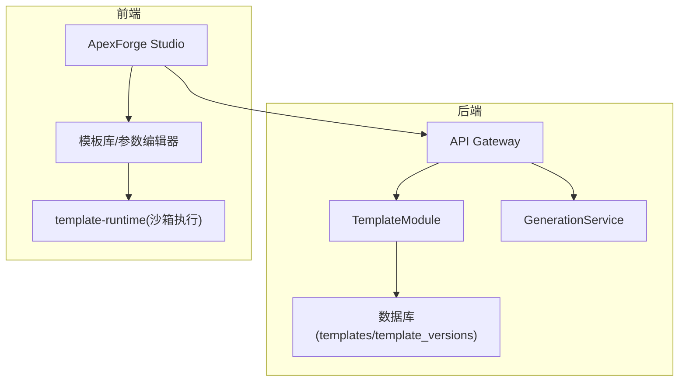
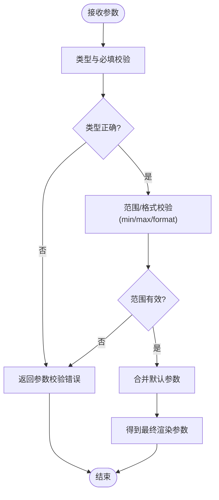
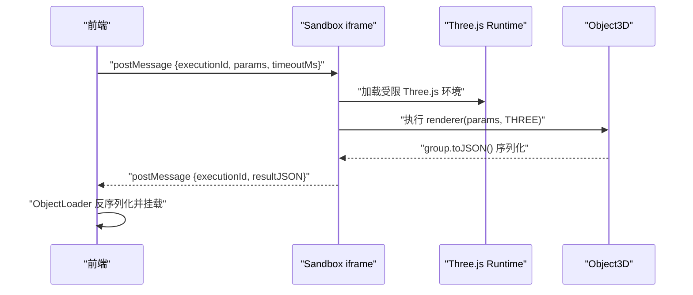
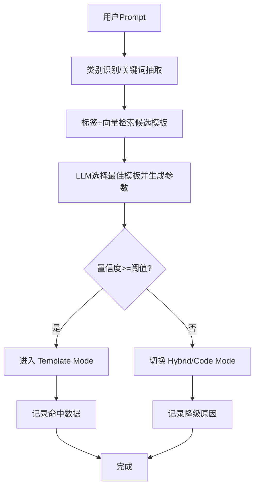
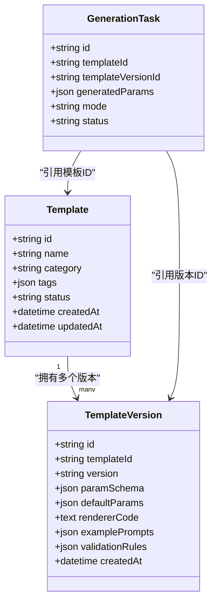
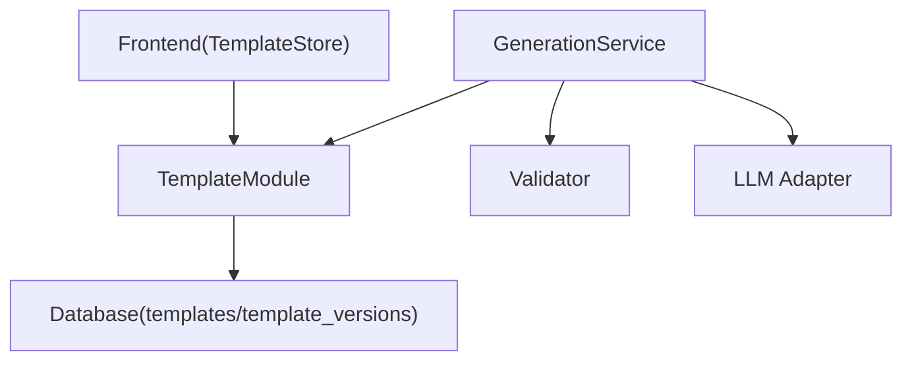

# 模板系统模块 (TemplateModule)

<cite>
**本文引用的文件**   
- [产品技术设计文档](file://tech/product-technical-design.md)
- [产品需求文档](file://prd.md)
</cite>

## 目录
1. [引言](#引言)
2. [项目结构](#项目结构)
3. [核心组件](#核心组件)
4. [架构总览](#架构总览)
5. [详细组件分析](#详细组件分析)
6. [依赖分析](#依赖分析)
7. [性能考虑](#性能考虑)
8. [故障排查指南](#故障排查指南)
9. [结论](#结论)
10. [附录](#附录)

## 引言
本章节聚焦于 ApexForge 的模板系统模块（TemplateModule），围绕模板架构设计、参数化建模原理、模板匹配算法与版本管理机制展开，覆盖模板 Schema 定义、渲染函数执行、默认参数处理与变体生成；并说明模板库管理、发布流程与社区贡献机制。同时提供模板开发指南、调试工具与性能优化建议，帮助开发者高效构建、维护与扩展模板生态。

## 项目结构
从工程落地角度，模板系统在后端以 NestJS 模块组织，在前端通过模板库与参数编辑器协同工作。推荐目录结构中，后端包含 templates 模块，前端包含 templates 模块以及 shared 下的 template-runtime 包用于运行时执行。



图表来源
- [产品技术设计文档:576-592](file://tech/product-technical-design.md#L576-L592)
- [产品技术设计文档:1001-1036](file://tech/product-technical-design.md#L1001-L1036)

章节来源
- [产品技术设计文档:576-592](file://tech/product-technical-design.md#L576-L592)
- [产品技术设计文档:1001-1036](file://tech/product-technical-design.md#L1001-L1036)

## 核心组件
- 模板元数据与版本：模板基本信息、分类、标签、状态与多版本信息（语义化版本、参数 Schema、默认参数、渲染函数代码、示例 Prompt、校验规则）。
- 模板匹配器：基于类别识别、关键词抽取、标签与向量检索，结合 LLM 选择候选模板并生成参数。
- 渲染引擎：在受控环境中执行模板渲染函数，返回可序列化的模型对象或 JSON。
- 参数校验与默认值填充：依据 Schema 对输入参数进行类型、范围、格式校验，并合并默认参数。
- 模板库管理与发布：创建、编辑、发布模板版本，支持草稿、已发布、废弃等状态流转。
- 前端模板库与参数编辑器：展示模板列表与详情，根据 Schema 动态生成表单，支持预览与二次生成。

章节来源
- [产品技术设计文档:270-296](file://tech/product-technical-design.md#L270-L296)
- [产品技术设计文档:760-804](file://tech/product-technical-design.md#L760-L804)
- [产品技术设计文档:586-592](file://tech/product-technical-design.md#L586-L592)

## 架构总览
模板系统在整体生成链路中承担“可控生成”的关键角色，优先使用模板模式降低不稳定性和安全风险。

```mermaid
sequenceDiagram
participant FE as "前端(ApexForge Studio)"
participant API as "API Gateway"
participant GEN as "GenerationService"
participant TMPL as "TemplateModule"
participant LLM as "LLM Adapter"
participant VAL as "Validator"
participant DB as "Database"
participant BOX as "Sandbox"
FE->>API : "POST /api/v1/generations"
API->>GEN : "createGenerationTask()"
GEN->>TMPL : "findCandidateTemplate(prompt, category)"
TMPL-->>GEN : "候选模板(含paramSchema/defaultParams/rendererCode)"
alt "命中模板且置信度达标"
GEN->>LLM : "仅生成参数(params)"
LLM-->>GEN : "params"
GEN->>VAL : "校验参数与模板输出协议"
VAL-->>GEN : "校验报告"
GEN->>DB : "持久化任务与结果"
GEN-->>API : "返回模板模式结果"
API-->>FE : "renderable 结果"
FE->>BOX : "在沙箱执行 renderer(params, THREE)"
BOX-->>FE : "序列化模型(JSON/Object3D)"
else "未命中或置信度低"
GEN->>LLM : "生成完整代码或混合模式"
LLM-->>GEN : "code/params"
GEN->>VAL : "AST/黑名单/复杂度校验"
VAL-->>GEN : "校验报告"
GEN->>DB : "持久化任务与结果"
GEN-->>API : "返回 code 模式结果"
end
```

图表来源
- [产品技术设计文档:361-390](file://tech/product-technical-design.md#L361-L390)
- [产品技术设计文档:724-732](file://tech/product-technical-design.md#L724-L732)
- [产品技术设计文档:760-804](file://tech/product-technical-design.md#L760-L804)

## 详细组件分析

### 模板 Schema 定义与参数校验
- 字段类型与约束：支持字符串、数字、布尔、枚举、颜色格式等，并提供 min/max、format、default 等约束。
- 校验流程：先做必填与类型检查，再做范围与格式校验，最后合并默认参数形成最终渲染参数。
- 错误反馈：为每个参数提供明确的错误码与提示，便于前端表单级校验与用户修正。



图表来源
- [产品技术设计文档:284-296](file://tech/product-technical-design.md#L284-L296)
- [产品技术设计文档:760-785](file://tech/product-technical-design.md#L760-L785)

章节来源
- [产品技术设计文档:284-296](file://tech/product-technical-design.md#L284-L296)
- [产品技术设计文档:760-785](file://tech/product-technical-design.md#L760-L785)

### 渲染函数执行与沙箱隔离
- 执行入口：模板版本中的渲染函数代码在受控环境中执行，接受参数与 Three.js 运行环境。
- 安全边界：采用 iframe 沙箱隔离，限制网络、DOM、全局访问，并通过 CSP 控制脚本来源。
- 结果规范：只允许返回结构化 JSON 或 Object3D 序列化数据，禁止回传函数或 DOM 引用。
- 超时与销毁：每次执行分配 executionId，超时自动销毁 iframe，避免阻塞主线程。



图表来源
- [产品技术设计文档:478-506](file://tech/product-technical-design.md#L478-L506)
- [产品技术设计文档:284-296](file://tech/product-technical-design.md#L284-L296)

章节来源
- [产品技术设计文档:478-506](file://tech/product-technical-design.md#L478-L506)
- [产品技术设计文档:284-296](file://tech/product-technical-design.md#L284-L296)

### 模板匹配算法与生成路由
- 候选召回：基于类别识别、关键词抽取、标签与向量检索获取候选模板集合。
- LLM 决策：让大模型在候选模板中选择最匹配的模板并生成参数。
- 阈值策略：若置信度低于阈值，则切换 Hybrid 或 Code Mode，保证成功率。
- 数据闭环：保存模板命中数据，持续优化模板覆盖率与匹配质量。



图表来源
- [产品技术设计文档:797-804](file://tech/product-technical-design.md#L797-L804)

章节来源
- [产品技术设计文档:797-804](file://tech/product-technical-design.md#L797-L804)

### 版本管理机制
- 模板与版本：模板实体与模板版本实体分离，版本采用语义化版本，存储 paramSchema、defaultParams、rendererCode、examplePrompts、validationRules 等。
- 状态流转：模板状态包括草稿、已发布、废弃；版本发布后不可变，确保可追溯与回滚能力。
- 关联关系：生成任务记录命中的模板 ID 与模板版本 ID，便于审计与回归测试。



图表来源
- [产品技术设计文档:270-296](file://tech/product-technical-design.md#L270-L296)
- [产品技术设计文档:215-236](file://tech/product-technical-design.md#L215-L236)

章节来源
- [产品技术设计文档:270-296](file://tech/product-technical-design.md#L270-L296)
- [产品技术设计文档:215-236](file://tech/product-technical-design.md#L215-L236)

### 默认参数处理与变体生成
- 默认参数：模板版本提供 defaultParams，当用户未提供某参数时自动填充，保证渲染稳定性。
- 变体生成：基于同一骨架模板，通过调整风格、细节、材质预设与参数范围快速生成多样变体。
- 分层模板：Skeleton 控制主体比例与关键部件位置；Style Variant 控制风格；Detail Pack 控制装饰件；Material Preset 控制材质。

章节来源
- [产品技术设计文档:284-296](file://tech/product-technical-design.md#L284-L296)
- [产品技术设计文档:787-795](file://tech/product-technical-design.md#L787-L795)

### 模板库管理与发布流程
- 管理接口：提供查询模板列表、查询模板详情、使用模板和参数生成模型、创建模板、发布模板版本等接口。
- 发布流程：草稿编写 -> 参数 Schema 与默认参数完善 -> 示例 Prompt 与校验规则配置 -> 发布新版本 -> 上线生效。
- 权限控制：管理端权限用于创建与发布模板，普通用户仅能查看与使用。

章节来源
- [产品技术设计文档:724-732](file://tech/product-technical-design.md#L724-L732)

### 社区贡献机制
- 贡献路径：社区成员提交模板草案与示例 Prompt，经审核通过后纳入官方模板库。
- 质量控制：引入质量评分体系与回归数据集，确保新增模板满足可渲染性、结构与性能要求。
- 版本治理：遵循语义化版本，重大变更提升主版本，兼容变更提升次版本，修复问题提升修订版本。

章节来源
- [产品技术设计文档:807-840](file://tech/product-technical-design.md#L807-L840)

## 依赖分析
模板系统与生成服务、校验服务、数据库紧密耦合，同时为前端提供稳定的模板与参数 Schema 能力。



图表来源
- [产品技术设计文档:594-609](file://tech/product-technical-design.md#L594-L609)
- [产品技术设计文档:270-296](file://tech/product-technical-design.md#L270-L296)

章节来源
- [产品技术设计文档:594-609](file://tech/product-technical-design.md#L594-L609)
- [产品技术设计文档:270-296](file://tech/product-technical-design.md#L270-L296)

## 性能考虑
- 缓存策略：热门模板与参数 Schema 缓存在 Redis，减少数据库压力。
- 生成模式优先级：优先 Cache Mode 与 Template Mode，跳过 LLM 代码生成，显著降低延迟与成本。
- 前端优化：按需加载 Three.js runtime，复杂模型解析放入 Worker，旧模型释放 geometry/material/texture。
- 数据库优化：为常用查询字段建立索引，大字段迁移至对象存储，历史任务按时间归档。

章节来源
- [产品技术设计文档:933-958](file://tech/product-technical-design.md#L933-L958)
- [产品技术设计文档:563-571](file://tech/product-technical-design.md#L563-L571)

## 故障排查指南
- 常见错误码：SANDBOX_TIMEOUT、SANDBOX_RUNTIME_ERROR、MODEL_JSON_INVALID、MODEL_TOO_COMPLEX、MODEL_EMPTY。
- 定位方法：通过 traceId 串联前后端日志，关注生成模式、模板命中情况、校验失败原因与复杂度指标。
- 恢复策略：模板模式失败时自动降级到 Hybrid/Code Mode；多次失败触发告警与人工审核。

章节来源
- [产品技术设计文档:508-516](file://tech/product-technical-design.md#L508-L516)
- [产品技术设计文档:898-907](file://tech/product-technical-design.md#L898-L907)

## 结论
模板系统模块通过分层模板、参数化建模、严格校验与沙箱执行，实现了高稳定、高性能、可扩展的 3D 模型生成能力。配合版本管理与质量闭环，平台能够在保障安全的前提下持续提升生成质量与用户体验。

## 附录

### 模板开发指南
- 明确模板层级：Skeleton 控制主体结构，Style Variant 控制风格，Detail Pack 控制装饰，Material Preset 控制材质。
- 定义参数 Schema：为每个参数指定类型、范围、格式与默认值，确保前端表单自动生成与校验。
- 编写渲染函数：在受限环境中使用白名单 API，返回可序列化的模型对象或 JSON。
- 提供示例 Prompt：覆盖典型用法与边界场景，辅助 LLM 匹配与参数生成。
- 配置校验规则：定义参数校验规则与警告项，提升鲁棒性。

章节来源
- [产品技术设计文档:787-795](file://tech/product-technical-design.md#L787-L795)
- [产品技术设计文档:284-296](file://tech/product-technical-design.md#L284-L296)

### 调试工具
- 参数编辑器：根据 Schema 动态生成表单，实时预览渲染效果。
- 模板命中分析：查看候选模板、匹配得分与降级原因，优化匹配策略。
- 沙箱控制台：捕获执行异常与超时信息，辅助定位渲染函数问题。
- 质量评分面板：查看可渲染性、结构完整性、性能表现与 Prompt 匹配度。

章节来源
- [产品技术设计文档:586-592](file://tech/product-technical-design.md#L586-L592)
- [产品技术设计文档:807-840](file://tech/product-technical-design.md#L807-L840)

### 性能优化建议
- 服务端：相似 Prompt 缓存、模板模式优先、异步生成任务、供应商并发与熔断控制。
- 前端：InstancedMesh 批量渲染重复元素、LOD 细节层级、Worker 反序列化、相机与控制器解耦。
- 数据库：索引优化与大字段外置、历史归档与冷热分离。

章节来源
- [产品技术设计文档:933-958](file://tech/product-technical-design.md#L933-L958)
- [产品技术设计文档:563-571](file://tech/product-technical-design.md#L563-L571)