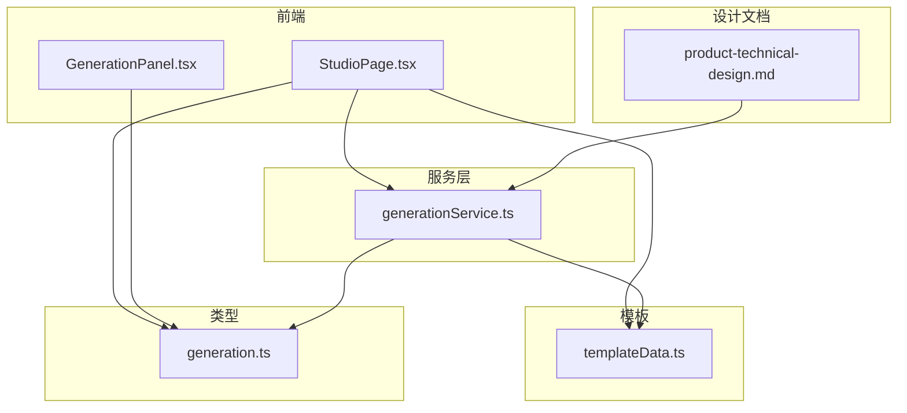
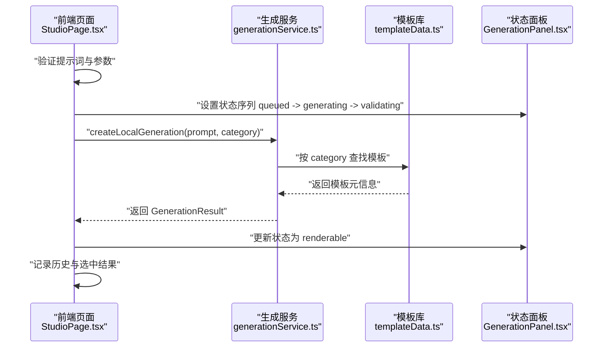
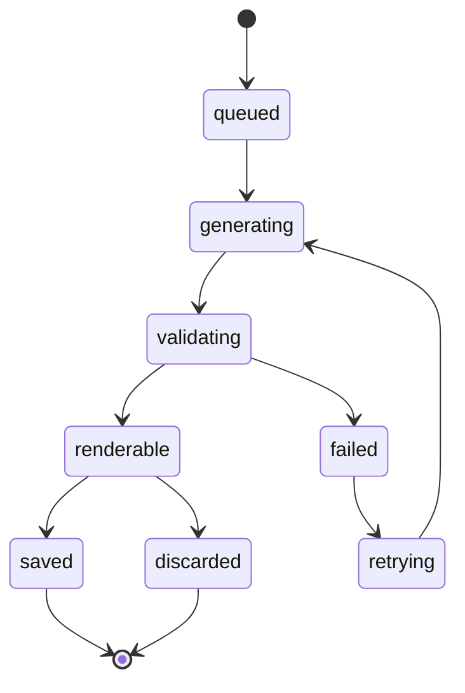
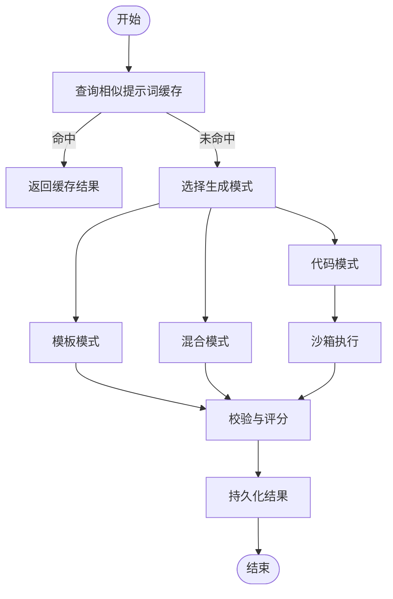
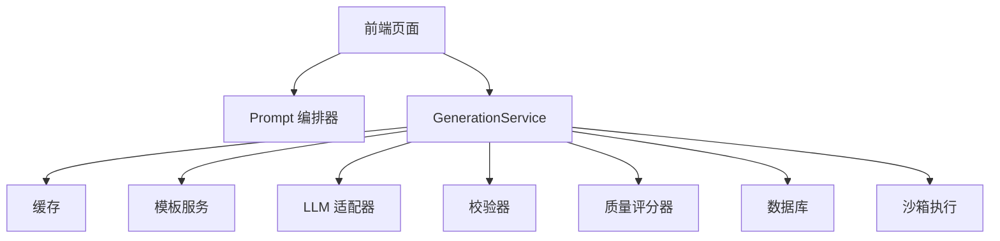
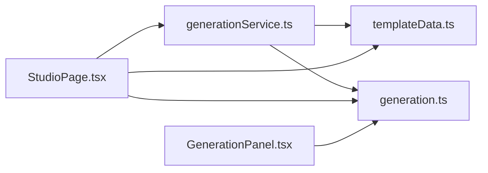

# GenerationService 核心服务

<cite>
**本文引用的文件**
- [generationService.ts](file://src/modules/studio/services/generationService.ts)
- [generation.ts](file://src/shared/types/generation.ts)
- [templateData.ts](file://src/modules/templates/templateData.ts)
- [StudioPage.tsx](file://src/modules/studio/pages/StudioPage.tsx)
- [GenerationPanel.tsx](file://src/modules/studio/components/GenerationPanel.tsx)
- [product-technical-design.md](file://tech/product-technical-design.md)
</cite>

## 目录
1. [简介](#简介)
2. [项目结构](#项目结构)
3. [核心组件](#核心组件)
4. [架构总览](#架构总览)
5. [详细组件分析](#详细组件分析)
6. [依赖关系分析](#依赖关系分析)
7. [性能与可观测性](#性能与可观测性)
8. [故障排查指南](#故障排查指南)
9. [结论](#结论)
10. [附录：使用模式与示例路径](#附录使用模式与示例路径)

## 简介
本文件面向 ApexForge 的 GenerationService 核心服务，聚焦当前 MVP 阶段的本地生成实现，并基于产品技术设计文档给出未来扩展方向。内容涵盖：
- 任务生命周期管理与状态机转换逻辑
- 生成模式路由决策（模板模式、代码模式、混合模式）
- 缓存策略、重试机制与错误恢复流程
- 与 Prompt 编排器、LLM 适配器、校验器、质量评分器的协作关系
- 任务队列管理、并发控制、性能监控与可观测性
- 具体使用模式与代码片段路径

## 项目结构
当前仓库中与 GenerationService 相关的核心文件分布如下：
- 服务层：src/modules/studio/services/generationService.ts
- 类型定义：src/shared/types/generation.ts
- 模板数据：src/modules/templates/templateData.ts
- 页面集成：src/modules/studio/pages/StudioPage.tsx
- 状态面板：src/modules/studio/components/GenerationPanel.tsx
- 系统设计：tech/product-technical-design.md

图表来源
- [StudioPage.tsx:1-245](file://src/modules/studio/pages/StudioPage.tsx#L1-L245)
- [generationService.ts:1-30](file://src/modules/studio/services/generationService.ts#L1-L30)
- [templateData.ts:1-54](file://src/modules/templates/templateData.ts#L1-L54)
- [generation.ts:1-29](file://src/shared/types/generation.ts#L1-L29)
- [product-technical-design.md:338-390](file://tech/product-technical-design.md#L338-L390)

章节来源
- [StudioPage.tsx:1-245](file://src/modules/studio/pages/StudioPage.tsx#L1-L245)
- [generationService.ts:1-30](file://src/modules/studio/services/generationService.ts#L1-L30)
- [templateData.ts:1-54](file://src/modules/templates/templateData.ts#L1-L54)
- [generation.ts:1-29](file://src/shared/types/generation.ts#L1-L29)
- [product-technical-design.md:338-390](file://tech/product-technical-design.md#L338-L390)

## 核心组件
- GenerationService（本地实现）
  - 职责：根据输入提示词与模型类别，选择模板并返回可渲染结果；提供 traceId 用于追踪；模拟耗时以体现异步流程。
  - 关键函数：createLocalGeneration(prompt, category)
- 类型系统
  - GenerationStatus：任务状态枚举
  - ModelCategory：模型分类
  - GenerationResult：生成结果对象
  - GenerationProgress：进度对象（用于 UI 展示）
- 模板库
  - templates：内置模板集合，包含 id、name、category、默认 prompt、复杂度等元信息
- 页面集成
  - StudioPage：驱动状态序列、调用服务、维护历史与预览
  - GenerationPanel：将状态映射为可视化标签与图标

章节来源
- [generationService.ts:1-30](file://src/modules/studio/services/generationService.ts#L1-L30)
- [generation.ts:1-29](file://src/shared/types/generation.ts#L1-L29)
- [templateData.ts:1-54](file://src/modules/templates/templateData.ts#L1-L54)
- [StudioPage.tsx:1-245](file://src/modules/studio/pages/StudioPage.tsx#L1-L245)
- [GenerationPanel.tsx:1-21](file://src/modules/studio/components/GenerationPanel.tsx#L1-L21)

## 架构总览
当前 MVP 采用“前端本地模板 + 轻量服务”的方式完成生成链路，后续按设计文档逐步接入后端服务、缓存、LLM、校验与沙箱执行。

图表来源
- [StudioPage.tsx:41-65](file://src/modules/studio/pages/StudioPage.tsx#L41-L65)
- [generationService.ts:8-29](file://src/modules/studio/services/generationService.ts#L8-L29)
- [templateData.ts:1-54](file://src/modules/templates/templateData.ts#L1-L54)
- [GenerationPanel.tsx:10-21](file://src/modules/studio/components/GenerationPanel.tsx#L10-L21)

## 详细组件分析

### 任务生命周期与状态机
- 当前前端在调用服务前，显式推进状态：queued → generating → validating，随后在服务返回后设置为 renderable；异常时置为 failed。
- 设计文档定义了更完整的状态机，包括 repairing、retrying、saved、discarded 等终态与中间态，便于后续扩展。

图表来源
- [product-technical-design.md:340-357](file://tech/product-technical-design.md#L340-L357)

章节来源
- [StudioPage.tsx:19-65](file://src/modules/studio/pages/StudioPage.tsx#L19-L65)
- [product-technical-design.md:340-357](file://tech/product-technical-design.md#L340-L357)

### 生成模式路由决策（模板模式、代码模式、混合模式）
- 当前实现为“模板模式”：根据 category 匹配模板，直接构造结果。
- 设计文档建议优先级：Cache Mode → Template Mode → Hybrid Mode → Code Mode。
- 可扩展路由策略：
  - Cache Mode：先查相似提示词缓存命中则直接返回
  - Template Mode：按模板参数化生成
  - Hybrid Mode：模板参数 + LLM 微调
  - Code Mode：由 LLM 生成可执行代码并在沙箱中运行

图表来源
- [product-technical-design.md:338-390](file://tech/product-technical-design.md#L338-L390)

章节来源
- [product-technical-design.md:338-390](file://tech/product-technical-design.md#L338-L390)

### 缓存策略实现
- 当前本地实现未包含缓存逻辑。
- 设计文档建议在生成前进行相似提示词检索，命中则直接返回缓存结果，以降低延迟与成本。
- 建议实现要点：
  - 键空间：基于提示词指纹（如哈希或向量相似度）
  - TTL：按模板复杂度与领域动态设置
  - 失效策略：模板版本变更或质量阈值变化触发失效

[本节为概念性说明，不直接分析具体文件]

### 重试机制与错误恢复流程
- 当前前端捕获异常后将状态置为 failed，并提示用户稍后重试。
- 设计文档定义了 failed → retrying → generating 的重试路径，支持自动或手动重试。
- 建议实现要点：
  - 指数退避与最大重试次数
  - 失败原因分类（网络、超时、校验失败、LLM 不可用）
  - 幂等性与去重（traceId 关联）

章节来源
- [StudioPage.tsx:61-65](file://src/modules/studio/pages/StudioPage.tsx#L61-L65)
- [product-technical-design.md:340-357](file://tech/product-technical-design.md#L340-L357)

### 与外部组件的协作关系
- 与 Prompt 编排器：前端负责提示词校验与组装，后续可扩展为编排器统一处理多源输入与上下文拼接。
- 与 LLM 适配器：在 Hybrid/Code 模式下调用，返回代码或参数；需考虑超时、限流与降级。
- 与校验器：对输出进行结构与语义校验，必要时进入 repairing 分支。
- 与质量评分器：计算 score 等指标，辅助路由与排序。
- 与沙箱执行：Code 模式下隔离执行生成的代码，确保安全性。

图表来源
- [product-technical-design.md:360-390](file://tech/product-technical-design.md#L360-L390)

章节来源
- [product-technical-design.md:360-390](file://tech/product-technical-design.md#L360-L390)

### 任务队列管理与并发控制
- 当前为单请求同步调用，无队列与并发控制。
- 建议扩展：
  - 任务队列：基于内存或消息队列（如 Redis Streams）
  - 并发限制：按模板复杂度与资源配额限制并行度
  - 优先级：高价值模板或付费用户优先
  - 背压与节流：避免瞬时峰值导致雪崩

[本节为概念性说明，不直接分析具体文件]

### 性能监控与可观测性
- 当前已生成 traceId，可用于端到端追踪。
- 建议指标：
  - 生成耗时（P50/P95）、成功率、失败原因分布
  - 缓存命中率、重试次数、平均重试间隔
  - LLM 调用延迟与错误率
  - 模板命中率与替换率
- 建议埋点位置：
  - 入口：请求到达与参数校验
  - 路由：模式选择与分支耗时
  - 下游：缓存、LLM、校验、沙箱
  - 出口：结果持久化与响应

章节来源
- [generationService.ts:4-6](file://src/modules/studio/services/generationService.ts#L4-L6)

## 依赖关系分析
- 服务层依赖模板数据与类型定义
- 页面层依赖服务、类型与模板库，并通过状态面板展示任务状态
- 设计文档作为架构蓝图指导后续演进

图表来源
- [generationService.ts:1-30](file://src/modules/studio/services/generationService.ts#L1-L30)
- [templateData.ts:1-54](file://src/modules/templates/templateData.ts#L1-L54)
- [generation.ts:1-29](file://src/shared/types/generation.ts#L1-L29)
- [StudioPage.tsx:1-245](file://src/modules/studio/pages/StudioPage.tsx#L1-L245)
- [GenerationPanel.tsx:1-21](file://src/modules/studio/components/GenerationPanel.tsx#L1-L21)

章节来源
- [generationService.ts:1-30](file://src/modules/studio/services/generationService.ts#L1-L30)
- [templateData.ts:1-54](file://src/modules/templates/templateData.ts#L1-L54)
- [generation.ts:1-29](file://src/shared/types/generation.ts#L1-L29)
- [StudioPage.tsx:1-245](file://src/modules/studio/pages/StudioPage.tsx#L1-L245)
- [GenerationPanel.tsx:1-21](file://src/modules/studio/components/GenerationPanel.tsx#L1-L21)

## 性能与可观测性
- 当前本地实现通过固定延时模拟生成过程，便于演示状态流转。
- 建议优化：
  - 引入缓存减少重复计算
  - 异步任务与批处理提升吞吐
  - 指标上报与日志聚合，结合 traceId 定位问题
  - 针对 LLM 与沙箱执行增加熔断与降级策略

[本节为通用性能建议，不直接分析具体文件]

## 故障排查指南
- 常见问题
  - 提示词校验失败：检查前端校验逻辑与错误提示
  - 模板未找到：确认 category 与模板库一致性
  - 生成失败：查看前端错误状态与重试提示
- 定位方法
  - 使用 traceId 关联前后端日志
  - 观察状态面板的状态切换是否符合预期
  - 检查历史记录是否保存成功

章节来源
- [StudioPage.tsx:41-65](file://src/modules/studio/pages/StudioPage.tsx#L41-L65)
- [generationService.ts:8-29](file://src/modules/studio/services/generationService.ts#L8-L29)

## 结论
当前 GenerationService 的本地实现以模板模式为核心，配合前端状态机与基础可观测性（traceId），完成了 MVP 的端到端闭环。下一步应依据设计文档逐步引入缓存、LLM 适配、校验与沙箱执行，完善状态机、重试与并发控制，构建稳定、可观测、高性能的生成服务。

[本节为总结性内容，不直接分析具体文件]

## 附录：使用模式与示例路径
- 基本调用
  - 页面发起生成：[StudioPage.tsx:41-65](file://src/modules/studio/pages/StudioPage.tsx#L41-L65)
  - 服务创建本地生成：[generationService.ts:8-29](file://src/modules/studio/services/generationService.ts#L8-L29)
  - 模板选择逻辑：[templateData.ts:1-54](file://src/modules/templates/templateData.ts#L1-L54)
- 状态展示
  - 状态映射与图标：[GenerationPanel.tsx:10-21](file://src/modules/studio/components/GenerationPanel.tsx#L10-L21)
- 类型定义
  - 状态与结果结构：[generation.ts:1-29](file://src/shared/types/generation.ts#L1-L29)
- 架构蓝图
  - 状态机与时序图：[product-technical-design.md:338-390](file://tech/product-technical-design.md#L338-L390)