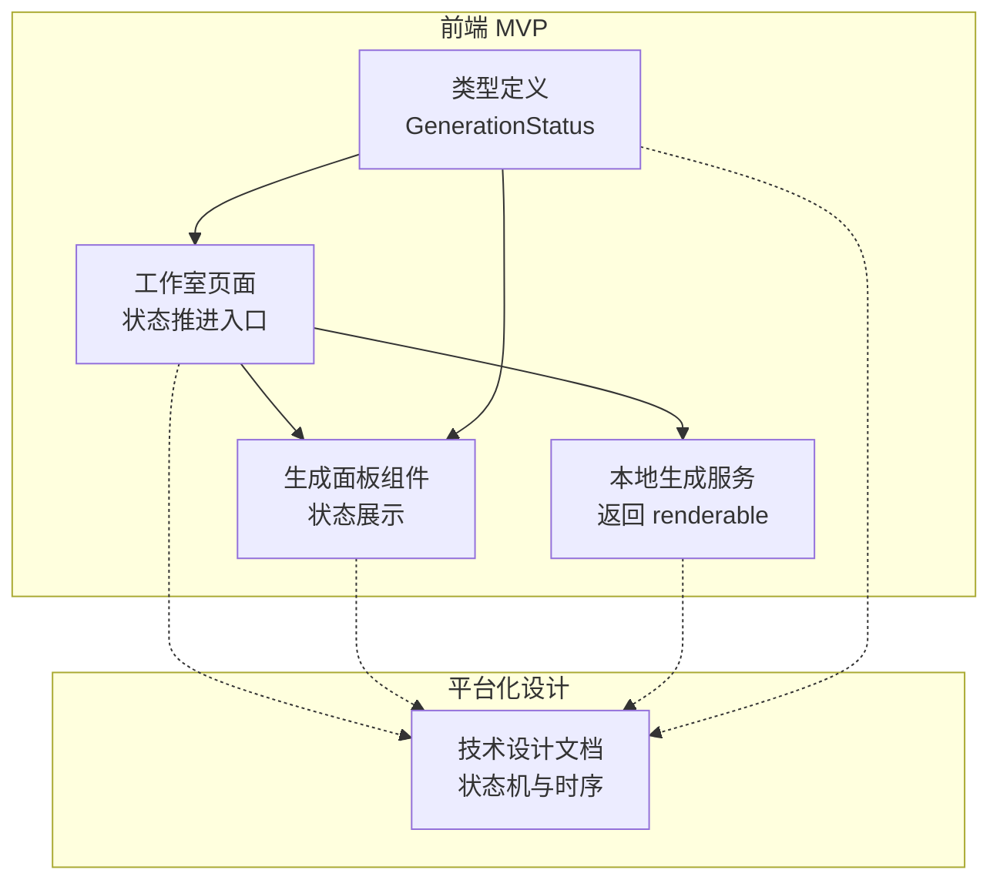
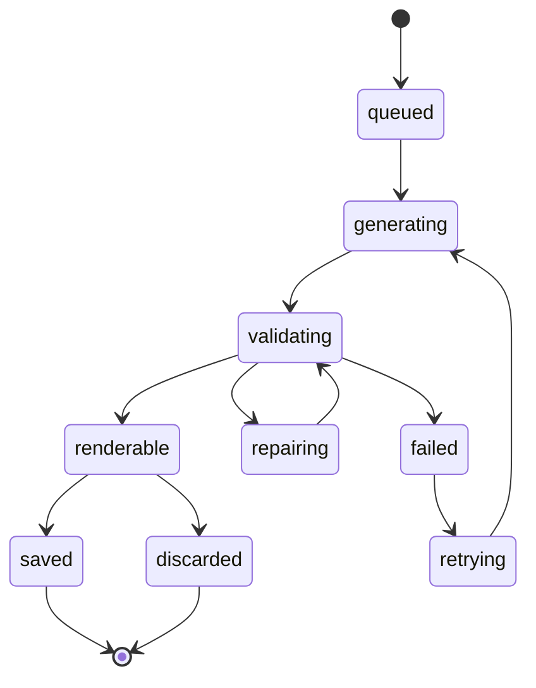
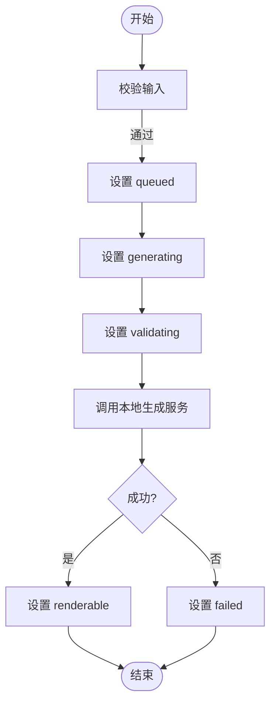
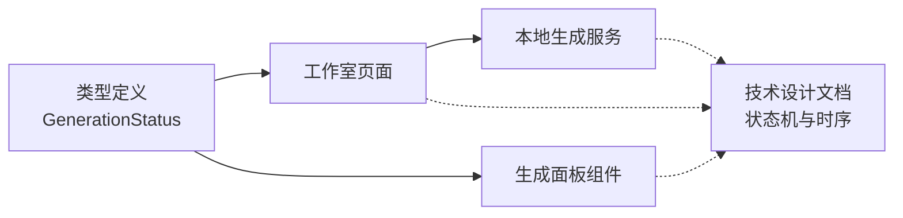

# 任务状态机管理

<cite>
**本文引用的文件**
- [产品技术设计文档](file://tech/product-technical-design.md)
- [生成类型定义](file://src/shared/types/generation.ts)
- [本地生成服务（MVP）](file://src/modules/studio/services/generationService.ts)
- [工作室页面（状态流转入口）](file://src/modules/studio/pages/StudioPage.tsx)
- [生成面板组件（状态展示）](file://src/modules/studio/components/GenerationPanel.tsx)
</cite>

## 目录
1. [引言](#引言)
2. [项目结构](#项目结构)
3. [核心组件](#核心组件)
4. [架构总览](#架构总览)
5. [详细组件分析](#详细组件分析)
6. [依赖关系分析](#依赖关系分析)
7. [性能与可靠性考虑](#性能与可靠性考虑)
8. [故障排查指南](#故障排查指南)
9. [结论](#结论)
10. [附录：配置、扩展点与最佳实践](#附录配置扩展点与最佳实践)

## 引言
本文件围绕 ApexForge 的 GenerationTask 状态机进行系统化说明，覆盖状态定义、转换规则、持久化策略、回滚机制、异常恢复与监听事件，并给出配置项、扩展点与最佳实践。内容同时兼顾前端 MVP 实现与平台化设计文档中的目标态，帮助读者从原型到生产逐步理解并落地。

## 项目结构
当前仓库包含产品与技术设计文档以及前端 MVP 代码。与任务状态机直接相关的代码集中在前端模块中，用于演示状态推进与展示；完整的状态机规范与平台化目标在技术设计文档中定义。



图表来源
- [工作室页面（状态流转入口）:1-245](file://src/modules/studio/pages/StudioPage.tsx#L1-L245)
- [生成面板组件（状态展示）:1-39](file://src/modules/studio/components/GenerationPanel.tsx#L1-L39)
- [本地生成服务（MVP）:1-30](file://src/modules/studio/services/generationService.ts#L1-L30)
- [生成类型定义:1-29](file://src/shared/types/generation.ts#L1-L29)
- [产品技术设计文档:340-390](file://tech/product-technical-design.md#L340-L390)

章节来源
- [工作室页面（状态流转入口）:1-245](file://src/modules/studio/pages/StudioPage.tsx#L1-L245)
- [生成面板组件（状态展示）:1-39](file://src/modules/studio/components/GenerationPanel.tsx#L1-L39)
- [本地生成服务（MVP）:1-30](file://src/modules/studio/services/generationService.ts#L1-L30)
- [生成类型定义:1-29](file://src/shared/types/generation.ts#L1-L29)
- [产品技术设计文档:340-390](file://tech/product-technical-design.md#L340-L390)

## 核心组件
- 类型定义层：统一 GenerationStatus 枚举，约束前端可呈现的状态集合。
- 页面控制层：按顺序推进 queued → generating → validating，并在成功时置为 renderable，失败时置为 failed。
- 展示层：根据当前状态渲染标签、图标与 traceId，辅助用户感知进度。
- 平台化设计：定义更完整的状态机（含 repairing、retrying、saved、discarded），并提供端到端时序与 SSE 事件模型。

章节来源
- [生成类型定义:1-29](file://src/shared/types/generation.ts#L1-L29)
- [工作室页面（状态流转入口）:1-245](file://src/modules/studio/pages/StudioPage.tsx#L1-L245)
- [生成面板组件（状态展示）:1-39](file://src/modules/studio/components/GenerationPanel.tsx#L1-L39)
- [产品技术设计文档:340-390](file://tech/product-technical-design.md#L340-L390)

## 架构总览
下图展示了从请求到结果的全链路，以及状态机在其中的位置。MVP 阶段由前端模拟推进状态，平台化阶段由后端 Generation Service 驱动状态流转并通过 SSE/WebSocket 推送。

```mermaid
sequenceDiagram
participant FE as "前端"
participant API as "API 网关"
participant GEN as "生成服务"
participant TPL as "模板服务"
participant LLM as "LLM 适配器"
participant VAL as "校验器"
participant DB as "数据库"
participant BOX as "沙箱 iframe"
FE->>API : "POST /api/v1/generations"
API->>GEN : "创建任务"
GEN->>DB : "写入 queued"
GEN->>TPL : "匹配模板/构建 Prompt"
GEN->>LLM : "生成代码或参数"
LLM-->>GEN : "输出"
GEN->>VAL : "安全与质量校验"
VAL-->>GEN : "报告"
alt 通过
GEN->>DB : "更新为 renderable"
GEN-->>FE : "SSE 推送 renderable"
FE->>BOX : "iframe 执行并预览"
else 不通过
GEN->>DB : "更新为 failed/repairing"
GEN-->>FE : "SSE 推送 failed/repairing"
end
```

图表来源
- [产品技术设计文档:360-390](file://tech/product-technical-design.md#L360-L390)

## 详细组件分析

### GenerationTask 状态定义与转换规则
- 平台化目标状态集：queued、generating、validating、renderable、failed、repairing、retrying、saved、discarded。
- 转换规则（来自设计文档的状态图）：
  - queued → generating
  - generating → validating
  - validating → renderable
  - validating → repairing
  - repairing → validating
  - validating → failed
  - renderable → saved
  - renderable → discarded
  - failed → retrying
  - retrying → generating
  - saved/discard 为终态



图表来源
- [产品技术设计文档:340-357](file://tech/product-technical-design.md#L340-L357)

章节来源
- [产品技术设计文档:340-357](file://tech/product-technical-design.md#L340-L357)

### 前端 MVP 的状态推进与展示
- 类型约束：GenerationStatus 包含 idle、queued、generating、validating、renderable、failed。
- 推进逻辑：页面依次设置 queued → generating → validating，成功后置为 renderable，异常置为 failed。
- 展示逻辑：根据当前状态映射文案、图标与颜色，并显示 traceId。



图表来源
- [工作室页面（状态流转入口）:41-65](file://src/modules/studio/pages/StudioPage.tsx#L41-L65)
- [本地生成服务（MVP）:8-29](file://src/modules/studio/services/generationService.ts#L8-L29)
- [生成类型定义:1-29](file://src/shared/types/generation.ts#L1-L29)
- [生成面板组件（状态展示）:10-17](file://src/modules/studio/components/GenerationPanel.tsx#L10-L17)

章节来源
- [工作室页面（状态流转入口）:1-245](file://src/modules/studio/pages/StudioPage.tsx#L1-L245)
- [本地生成服务（MVP）:1-30](file://src/modules/studio/services/generationService.ts#L1-L30)
- [生成类型定义:1-29](file://src/shared/types/generation.ts#L1-L29)
- [生成面板组件（状态展示）:1-39](file://src/modules/studio/components/GenerationPanel.tsx#L1-L39)

### 状态持久化策略
- 平台化目标：
  - 任务表 generation_tasks 包含 status 字段，记录 queued、generating、validating、renderable、failed、cancelled 等。
  - 关键时间戳 startedAt、completedAt 用于追踪生命周期。
- MVP 现状：
  - 前端内存维护历史列表，最近 20 条记录保留于页面状态，未落库。
  - 生成结果对象中包含 createdAt、traceId、metrics 等元数据。

章节来源
- [产品技术设计文档:215-237](file://tech/product-technical-design.md#L215-L237)
- [工作室页面（状态流转入口）:57-65](file://src/modules/studio/pages/StudioPage.tsx#L57-L65)
- [本地生成服务（MVP）:13-29](file://src/modules/studio/services/generationService.ts#L13-L29)

### 状态回滚机制
- 平台化目标：
  - 当校验失败进入 repairing，修复后重新进入 validating，形成闭环。
  - 若最终仍失败，则进入 failed，支持重试流程。
- 建议实现要点：
  - 使用幂等状态更新接口，避免并发导致状态抖动。
  - 对 repairing 与 retrying 增加最大次数与退避策略。
  - 保存每次失败的错误码与错误信息，便于定位与自动修复策略选择。

章节来源
- [产品技术设计文档:340-357](file://tech/product-technical-design.md#L340-L357)

### 异常状态恢复
- 触发条件：
  - 校验失败 → failed
  - 可尝试修复 → repairing
  - 失败后可重试 → retrying → generating
- 恢复策略：
  - 基于错误分类（如运行时错误、超时、复杂度超限）选择不同修复路径。
  - 结合模板模式优先原则，必要时回退到模板参数化生成。

章节来源
- [产品技术设计文档:340-357](file://tech/product-technical-design.md#L340-L357)

### 状态监听事件
- 平台化目标：
  - 通过 SSE 推送 queued、generating、validating、repairing、renderable、failed 等事件。
  - 事件体包含 event、traceId、taskId、message 等字段。
- 前端对接：
  - 订阅事件流，将服务端状态同步至 UI，保证多端一致性。

章节来源
- [产品技术设计文档:734-756](file://tech/product-technical-design.md#L734-L756)

## 依赖关系分析
- 前端类型定义被页面与组件共同消费，确保状态语义一致。
- 页面负责状态推进，组件仅负责展示，职责清晰。
- 平台化设计中，Generation Service 作为状态机编排者，协调模板、LLM、校验与存储。



图表来源
- [生成类型定义:1-29](file://src/shared/types/generation.ts#L1-L29)
- [工作室页面（状态流转入口）:1-245](file://src/modules/studio/pages/StudioPage.tsx#L1-L245)
- [生成面板组件（状态展示）:1-39](file://src/modules/studio/components/GenerationPanel.tsx#L1-L39)
- [本地生成服务（MVP）:1-30](file://src/modules/studio/services/generationService.ts#L1-L30)
- [产品技术设计文档:340-390](file://tech/product-technical-design.md#L340-L390)

章节来源
- [生成类型定义:1-29](file://src/shared/types/generation.ts#L1-L29)
- [工作室页面（状态流转入口）:1-245](file://src/modules/studio/pages/StudioPage.tsx#L1-L245)
- [生成面板组件（状态展示）:1-39](file://src/modules/studio/components/GenerationPanel.tsx#L1-L39)
- [本地生成服务（MVP）:1-30](file://src/modules/studio/services/generationService.ts#L1-L30)
- [产品技术设计文档:340-390](file://tech/product-technical-design.md#L340-L390)

## 性能与可靠性考虑
- 状态推进应避免阻塞主线程，长耗时操作应下沉至 Worker 或服务端。
- 状态变更需幂等，防止网络重试导致重复推进。
- 对于 repairing/retrying，引入指数退避与熔断，避免雪崩。
- 前端展示层只读状态，所有变更走单一数据源（Store 或 SSE）。

[本节为通用指导，无需具体文件引用]

## 故障排查指南
- 常见问题定位：
  - 状态卡住：检查 SSE 连接是否断开，确认服务端是否正确推送事件。
  - 状态不一致：核对客户端缓存与服务端最新状态，强制拉取一次。
  - 频繁失败：查看错误码与错误信息，判断是否为模板不匹配或校验规则过严。
- 建议日志与指标：
  - 每个任务附带 traceId，贯穿前后端。
  - 记录各状态停留时长、失败原因分布、重试次数。

章节来源
- [产品技术设计文档:734-756](file://tech/product-technical-design.md#L734-L756)

## 结论
ApexForge 的任务状态机以“模板优先、安全可控、可观测”为核心原则。MVP 已在前端实现了基础状态推进与展示，平台化设计进一步定义了完整状态图、持久化模型与事件协议。后续演进建议优先补齐服务端状态机、持久化与 SSE 事件通道，并完善 repairing/retrying 的自动化修复策略。

[本节为总结性内容，无需具体文件引用]

## 附录：配置、扩展点与最佳实践

### 状态机配置项（建议）
- 最大重试次数：限制 failed → retrying → generating 的循环次数。
- 修复策略开关：是否启用自动修复（repairing），以及修复策略优先级。
- 超时阈值：各阶段最长等待时间，超过则标记为 failed。
- 降级策略：当 LLM 不可用时，回退到模板参数化生成。

[本节为概念性配置建议，无需具体文件引用]

### 扩展点
- LLM 供应商适配：通过统一接口切换不同模型提供商。
- 模板引擎：支持更多模板类别与参数 Schema。
- 校验器：可扩展 AST 规则、复杂度阈值与安全黑名单。
- 导出服务：支持导出 JS、JSON、截图、glTF 等格式。

章节来源
- [产品技术设计文档:574-630](file://tech/product-technical-design.md#L574-L630)

### 最佳实践
- 状态命名与语义稳定：新增状态需谨慎评估对前端展示与事件的影响。
- 幂等与事务：状态更新接口需幂等，复杂流程使用事务包裹。
- 可观测性：全链路 traceId、指标埋点与告警。
- 渐进式演进：MVP 先跑通闭环，再逐步替换为真实后端与沙箱执行。

[本节为通用实践建议，无需具体文件引用]