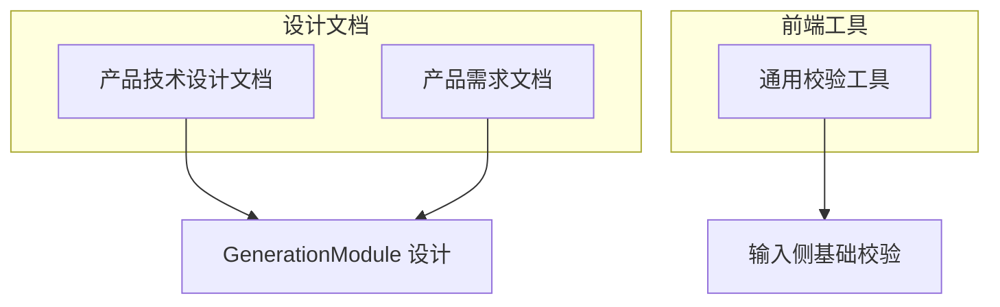
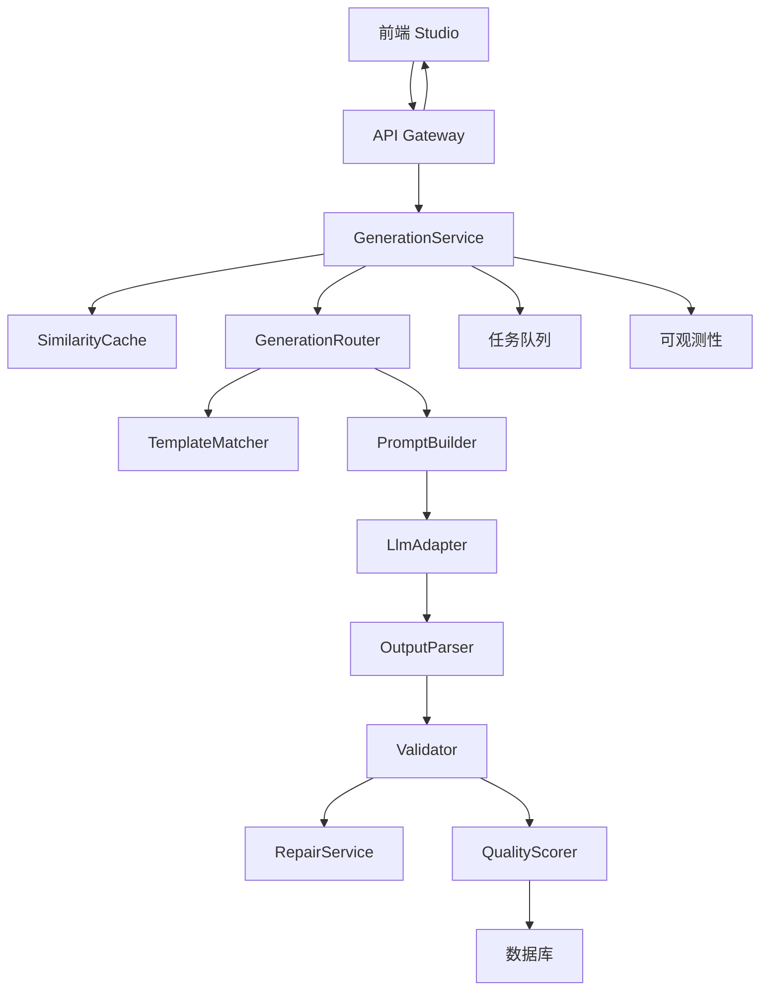
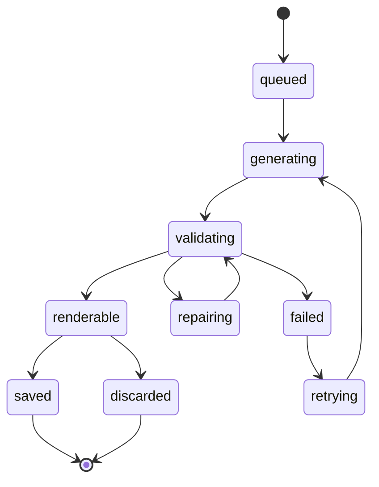
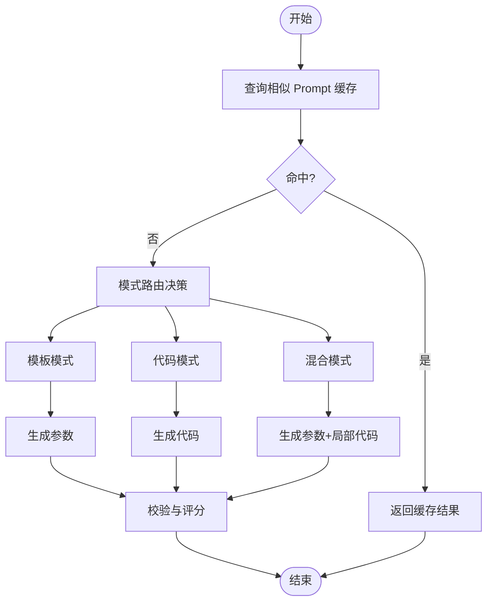
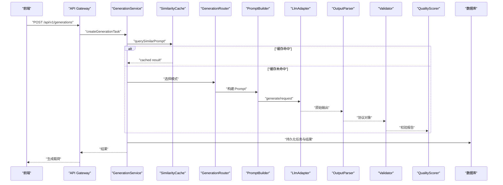
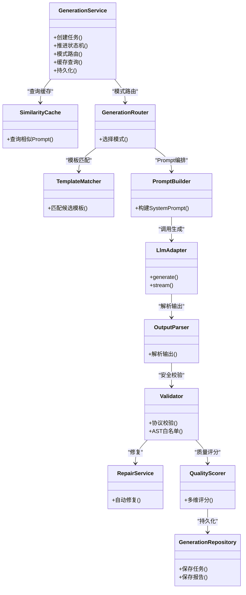

# 生成任务编排模块 (GenerationModule)

<cite>
**本文引用的文件**   
- [产品技术设计文档](file://tech/product-technical-design.md)
- [产品需求文档](file://prd.md)
- [通用校验工具](file://src/shared/utils/validators.ts)
</cite>

## 目录
1. [引言](#引言)
2. [项目结构](#项目结构)
3. [核心组件](#核心组件)
4. [架构总览](#架构总览)
5. [详细组件分析](#详细组件分析)
6. [依赖关系分析](#依赖关系分析)
7. [性能与并发](#性能与并发)
8. [故障排查指南](#故障排查指南)
9. [结论](#结论)
10. [附录](#附录)

## 引言
本章节聚焦于 ApexForge 的“生成任务编排模块”，围绕 GenerationService 的职责边界、任务状态机、生成模式路由（模板模式、代码模式、混合模式）、缓存策略、重试机制与错误恢复，以及与 Prompt 编排器、LLM 适配器、校验器和质量评分器的协作关系展开。同时补充任务队列管理、并发控制与性能监控的实现要点，帮助读者从整体到细节理解该模块的设计与落地方案。

## 项目结构
当前仓库包含产品与技术设计文档以及少量前端共享工具。生成任务编排模块的核心设计与实现约定主要沉淀在技术设计文档中，包括：
- 逻辑架构与部署架构
- GenerationService 内部结构与依赖
- 生成链路时序与状态机
- 数据模型（generation_tasks、validation_reports、quality_scores 等）
- 可观测性与告警规则
- 后端优化与工程里程碑

图表来源
- [产品技术设计文档:34-100](file://tech/product-technical-design.md#L34-L100)
- [产品需求文档:1-168](file://prd.md#L1-L168)
- [通用校验工具:1-14](file://src/shared/utils/validators.ts#L1-L14)

章节来源
- [产品技术设计文档:34-100](file://tech/product-technical-design.md#L34-L100)
- [产品需求文档:1-168](file://prd.md#L1-L168)
- [通用校验工具:1-14](file://src/shared/utils/validators.ts#L1-L14)

## 核心组件
- GenerationService：负责生成任务的端到端编排，包括状态机推进、模式路由、缓存命中、调用 LLM、结果校验、修复与评分、持久化与事件推送。
- SimilarityCache：相似 Prompt 缓存层，命中则直接返回历史结果，降低 LLM 调用成本。
- GenerationRouter：根据任务上下文选择生成模式（template/code/hybrid），并驱动后续流程。
- TemplateMatcher：基于类别识别、关键词抽取与向量检索匹配候选模板。
- PromptBuilder：组装 System Prompt、Few-shot 示例与约束，输出结构化协议。
- LlmAdapter：多供应商统一接口，支持同步/流式生成、失败重试与降级。
- OutputParser：解析 LLM 输出为内部协议对象。
- Validator：对输出进行协议、文本黑名单与 AST 白名单校验。
- RepairService：针对校验失败的自动修复或二次生成。
- QualityScorer：计算多维质量分（可渲染性、结构、Prompt 匹配度、性能等）。
- GenerationRepository：持久化任务、报告与评分。

章节来源
- [产品技术设计文档:594-631](file://tech/product-technical-design.md#L594-L631)

## 架构总览
下图展示了 GenerationModule 在整体系统中的位置与关键交互：API Gateway 接收请求后交由 GenerationService 编排；服务内部通过缓存、模板匹配、Prompt 编排、LLM 适配、校验与评分完成一次生成闭环；最终将结果持久化并通过 SSE/WebSocket 推送给前端。

图表来源
- [产品技术设计文档:34-100](file://tech/product-technical-design.md#L34-L100)
- [产品技术设计文档:594-631](file://tech/product-technical-design.md#L594-L631)

## 详细组件分析

### GenerationService 职责与状态机
- 职责范围
  - 创建任务并写入初始状态 queued
  - 查询相似 Prompt 缓存，命中则快速返回
  - 未命中时进入模式路由，选择 template/code/hybrid
  - 构建 Prompt 并调用 LLM 适配器
  - 解析输出、执行校验与修复、质量评分
  - 持久化任务与报告、更新状态
  - 通过事件通道推送进度与结果
- 状态机定义
  - 状态集合：queued、generating、validating、repairing、renderable、failed、retrying、saved、discarded
  - 流转路径：queued→generating→validating→(renderable|repairing|failed)，repairing→validating，failed→retrying→generating，renderable→saved/discard

图表来源
- [产品技术设计文档:340-357](file://tech/product-technical-design.md#L340-L357)

章节来源
- [产品技术设计文档:340-357](file://tech/product-technical-design.md#L340-L357)
- [产品技术设计文档:594-631](file://tech/product-technical-design.md#L594-L631)

### 生成模式路由（模板/代码/混合/缓存）
- 优先级建议：Cache Mode → Template Mode → Hybrid Mode → Code Mode
- 路由决策依据
  - 是否命中相似 Prompt 缓存
  - 模板匹配得分与参数可用性
  - 用户偏好与复杂度阈值
  - 供应商能力与成本策略
- 各模式说明
  - Template Mode：AI 仅生成参数，由模板渲染函数产出模型，速度快、稳定性高
  - Code Mode：AI 生成完整 Three.js 函数，灵活但需更强校验
  - Hybrid Mode：AI 选择模板并补充局部代码，兼顾可控与扩展
  - Cache Mode：相似 Prompt 直接复用历史结果

图表来源
- [产品技术设计文档:328-338](file://tech/product-technical-design.md#L328-L338)

章节来源
- [产品技术设计文档:328-338](file://tech/product-technical-design.md#L328-L338)

### 缓存策略
- 缓存键：归一化后的 Prompt 与上下文版本
- 相似度阈值：向量相似度大于阈值即命中
- 缓存内容：生成的 code/params、验证报告、质量评分、模板信息
- 失效策略：按时间或 Prompt 版本变更失效
- 收益：显著降低 LLM 调用量与延迟，提升重复请求吞吐

章节来源
- [产品技术设计文档:328-338](file://tech/product-technical-design.md#L328-L338)
- [产品技术设计文档:944-951](file://tech/product-technical-design.md#L944-L951)

### 重试机制与错误恢复
- 触发条件：校验失败、运行时异常、沙箱超时、模型为空或过于复杂
- 修复策略：自动修复（如补全必要结构、替换受限 API）、二次生成（调整 Prompt 或切换模式）
- 重试上限：可配置最大次数，避免无限循环
- 降级策略：当某供应商不可用时切换到备用模型或回退到模板模式
- 记录与追踪：每次重试记录 traceId、错误码、耗时与原因，便于分析与告警

章节来源
- [产品技术设计文档:340-357](file://tech/product-technical-design.md#L340-L357)
- [产品技术设计文档:611-631](file://tech/product-technical-design.md#L611-L631)
- [产品技术设计文档:508-517](file://tech/product-technical-design.md#L508-L517)

### 与 Prompt 编排器、LLM 适配器、校验器、质量评分器的协作
- Prompt 编排器（PromptBuilder）
  - 角色设定、强制约束、Few-shot 示例注入
  - 输出协议定义（mode/templateId/params/code/explanation/warnings）
- LLM 适配器（LlmAdapter）
  - 统一接口 generate/stream
  - 供应商选择、失败重试与降级
- 校验器（Validator）
  - 协议校验、文本黑名单、AST 白名单、复杂度限制
- 质量评分器（QualityScorer）
  - 多维度评分：可渲染性、结构、Prompt 匹配度、性能
  - 评分详情用于反馈闭环与 Prompt 迭代

图表来源
- [产品技术设计文档:359-390](file://tech/product-technical-design.md#L359-L390)
- [产品技术设计文档:594-631](file://tech/product-technical-design.md#L594-L631)

章节来源
- [产品技术设计文档:359-390](file://tech/product-technical-design.md#L359-L390)
- [产品技术设计文档:594-631](file://tech/product-technical-design.md#L594-L631)

### 任务队列管理与并发控制
- 队列选型：BullMQ/RabbitMQ/Kafka（随规模演进）
- 任务入队：创建任务后入队，Worker 拉取并推进状态机
- 并发控制：按用户/空间维度限流，全局并发上限，供应商熔断与退避
- 背压与削峰：队列长度阈值、丢弃策略、优先级队列
- 幂等与去重：相同任务去重，避免重复生成

章节来源
- [产品技术设计文档:78-100](file://tech/product-technical-design.md#L78-L100)
- [产品技术设计文档:988-998](file://tech/product-technical-design.md#L988-L998)

### 性能监控与可观测性
- Trace 链路：traceId 贯穿前端、网关、服务、LLM、校验、存储、沙箱
- 日志字段：traceId、userId、workspaceId、taskId、provider、promptVersion、generationMode、latencyMs、status、errorCode、qualityScore
- 指标与告警：失败率、LLM 延迟、校验失败突增、沙箱超时突增、API 错误率
- 可视化：Prometheus/Grafana、OpenTelemetry 集成

章节来源
- [产品技术设计文档:868-907](file://tech/product-technical-design.md#L868-L907)

## 依赖关系分析
GenerationService 与其子组件的依赖关系如下：

图表来源
- [产品技术设计文档:594-631](file://tech/product-technical-design.md#L594-L631)

章节来源
- [产品技术设计文档:594-631](file://tech/product-technical-design.md#L594-L631)

## 性能与并发
- 前端优化
  - 动态加载 Three.js 与沙箱 runtime
  - 大模型 JSON 解析放入 Worker
  - InstancedMesh 批量渲染重复元素
  - 旧模型释放 geometry/material/texture
- 后端优化
  - 相似 Prompt 缓存复用
  - 模板模式跳过 LLM 代码生成
  - 生成任务异步化与队列化
  - LLM 供应商并发与熔断控制
  - 热门模板与 Schema 缓存至 Redis
- 数据库优化
  - 索引：traceId、workspaceId、createdAt
  - 大字段迁移对象存储，仅保留 URL 与摘要
  - 历史任务按时间归档

章节来源
- [产品技术设计文档:933-958](file://tech/product-technical-design.md#L933-L958)

## 故障排查指南
- 常见错误分类（沙箱侧）
  - SANDBOX_TIMEOUT：执行超时，提示模型过于复杂
  - SANDBOX_RUNTIME_ERROR：运行时报错，可重试
  - MODEL_JSON_INVALID：返回结构非法，系统重新生成
  - MODEL_TOO_COMPLEX：复杂度超限，建议降级
  - MODEL_EMPTY：未生成有效对象，提示补充描述
- 排查步骤
  - 检查 traceId 定位全链路日志
  - 查看 validation_report 与 quality_score 明细
  - 确认 LLM 供应商状态与配额
  - 评估 Prompt 版本与模板匹配情况
  - 复核队列积压与并发上限

章节来源
- [产品技术设计文档:508-517](file://tech/product-technical-design.md#L508-L517)
- [产品技术设计文档:868-907](file://tech/product-technical-design.md#L868-L907)

## 结论
GenerationModule 以 GenerationService 为核心，通过清晰的状态机与模式路由，结合缓存、校验、修复与评分形成稳定的生成闭环。配合任务队列、并发控制与完善的可观测体系，能够在不同规模下保持高可用与高性能。未来可按工程里程碑逐步引入平台化能力（多供应商、团队空间、计费与私有化部署），持续优化质量与体验。

## 附录

### 数据模型要点（与生成相关）
- generation_tasks：任务 ID、traceId、模式、状态、Prompt、模板信息、生成结果、错误信息、时间戳
- validation_reports：是否通过、阻断原因、警告、复杂度、AST 摘要
- quality_scores：总分与分项评分、详情

章节来源
- [产品技术设计文档:215-236](file://tech/product-technical-design.md#L215-L236)
- [产品技术设计文档:298-310](file://tech/product-technical-design.md#L298-L310)
- [产品技术设计文档:311-324](file://tech/product-technical-design.md#L311-L324)

### 前端输入校验（辅助）
- validatePrompt：空值与长度限制（≤2000 字符）

章节来源
- [通用校验工具:1-14](file://src/shared/utils/validators.ts#L1-L14)