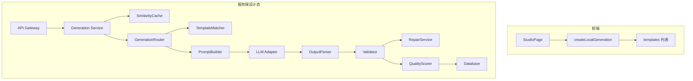
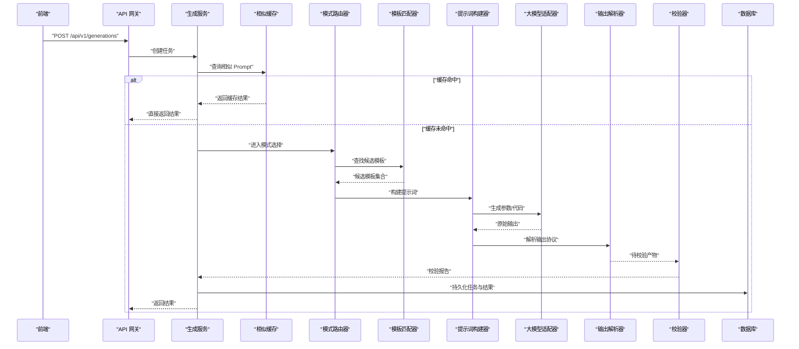
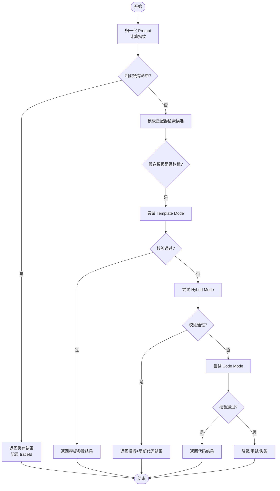
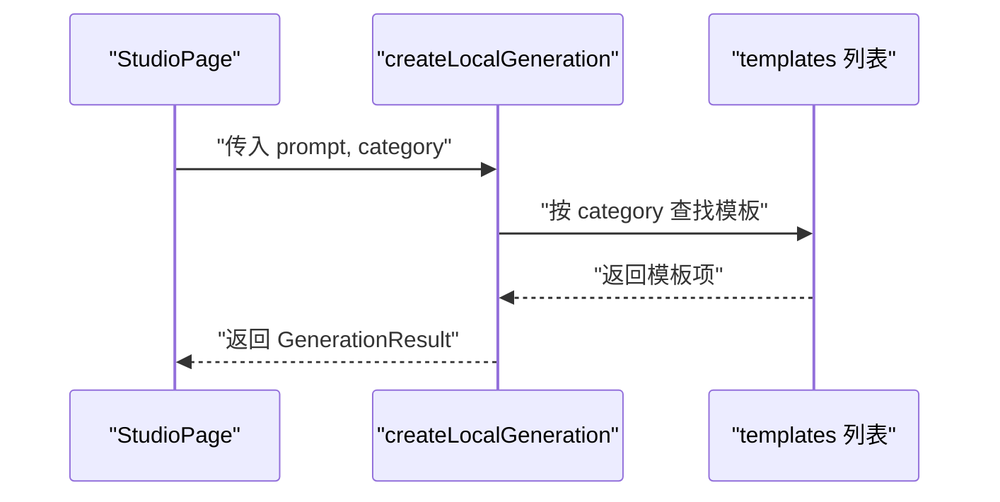
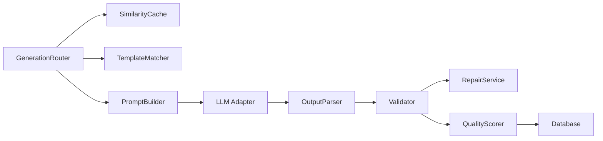
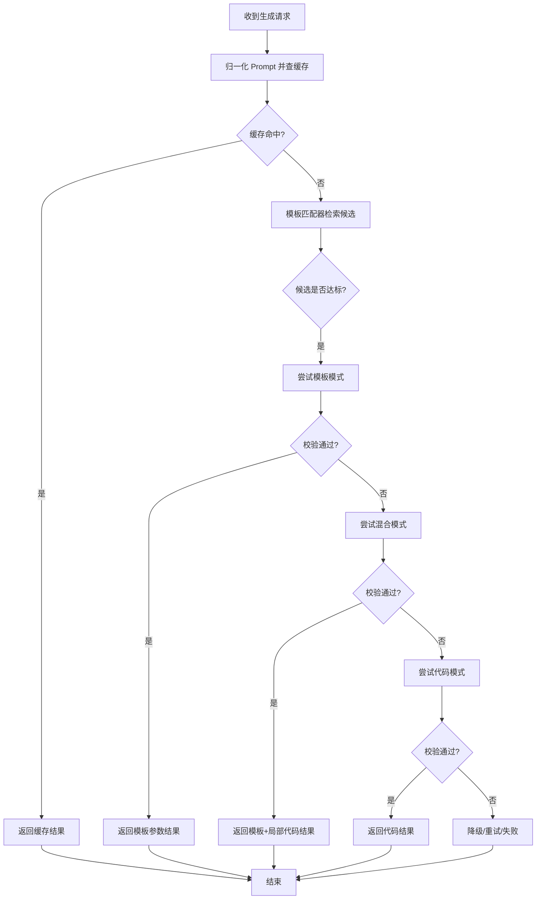

# 生成模式路由器

<cite>
**本文引用的文件**   
- [product-technical-design.md](file://tech/product-technical-design.md)
- [generationService.ts](file://src/modules/studio/services/generationService.ts)
- [templateData.ts](file://src/modules/templates/templateData.ts)
- [generation.ts](file://src/shared/types/generation.ts)
- [template.ts](file://src/shared/types/template.ts)
</cite>

## 目录
1. [简介](#简介)
2. [项目结构](#项目结构)
3. [核心组件](#核心组件)
4. [架构总览](#架构总览)
5. [详细组件分析](#详细组件分析)
6. [依赖关系分析](#依赖关系分析)
7. [性能考量](#性能考量)
8. [故障排查指南](#故障排查指南)
9. [结论](#结论)
10. [附录](#附录)

## 简介
本文件聚焦于 ApexForge 的“生成模式路由器”（GenerationRouter）设计，围绕以下目标展开：
- 明确 GenerationRouter 的职责与实现原理
- 阐述自动模式选择算法与优先级策略（Cache Mode → Template Mode → Hybrid Mode → Code Mode）
- 说明模式切换条件与决策逻辑
- 解释与 TemplateMatcher、SimilarityCache 的协作关系
- 给出模式选择的性能优化策略
- 提供自定义模式路由器的扩展接口与配置方法
- 包含模式选择流程图与实际使用示例

## 项目结构
当前仓库为 MVP/原型阶段，前端以 React + TypeScript 为主，后端尚未落地。文档中涉及的 GenerationRouter、TemplateMatcher、SimilarityCache 等属于服务端生成链路的核心模块，其职责与交互在技术设计文档中有明确定义；前端侧提供了本地模拟生成流程与模板数据，便于理解整体工作流。

图示来源
- [product-technical-design.md:594-609](file://tech/product-technical-design.md#L594-L609)
- [generationService.ts:8-29](file://src/modules/studio/services/generationService.ts#L8-L29)
- [templateData.ts:1-54](file://src/modules/templates/templateData.ts#L1-L54)

章节来源
- [product-technical-design.md:594-609](file://tech/product-technical-design.md#L594-L609)
- [generationService.ts:8-29](file://src/modules/studio/services/generationService.ts#L8-L29)
- [templateData.ts:1-54](file://src/modules/templates/templateData.ts#L1-L54)

## 核心组件
- GenerationRouter（生成模式路由器）
  - 职责：根据输入 Prompt、类别、上下文与质量偏好，按优先级顺序尝试不同生成模式，并返回最终执行路径与结果摘要。
  - 关键能力：缓存命中判定、候选模板检索、混合模式编排、纯代码生成编排、降级与重试策略。
- SimilarityCache（相似缓存）
  - 职责：对归一化后的 Prompt 进行相似度检索，若命中则直接复用历史结果，显著降低 LLM 调用成本与延迟。
- TemplateMatcher（模板匹配器）
  - 职责：基于类别识别、关键词抽取、标签与向量检索，从模板库中筛选候选模板，并输出排序后的候选集。
- PromptBuilder（提示词构建器）
  - 职责：将用户 Prompt、系统指令、模板摘要与约束拼装为结构化请求，驱动 LLM 生成参数或代码。
- OutputParser（输出解析器）
  - 职责：校验 LLM 输出协议，提取 mode、templateId、params、code 等字段，确保后续处理稳定可靠。
- Validator（校验器）
  - 职责：对生成的代码/参数进行安全与复杂度校验，必要时触发 RepairService 修复或回退到更低自由度模式。
- QualityScorer（质量评分器）
  - 职责：对结果进行多维度评分，辅助模式选择与回归测试。

章节来源
- [product-technical-design.md:594-609](file://tech/product-technical-design.md#L594-L609)
- [product-technical-design.md:329-338](file://tech/product-technical-design.md#L329-L338)

## 架构总览
下图展示了 GenerationRouter 在服务端生成链路中的位置及其与缓存、模板、LLM、校验等组件的交互关系。

图示来源
- [product-technical-design.md:359-390](file://tech/product-technical-design.md#L359-L390)
- [product-technical-design.md:594-609](file://tech/product-technical-design.md#L594-L609)

## 详细组件分析

### GenerationRouter 设计与实现要点
- 模式优先级
  - Cache Mode → Template Mode → Hybrid Mode → Code Mode
  - 该优先级在技术设计中明确推荐，用于在保证可控性的前提下最大化性能与稳定性。
- 自动模式选择算法
  - 步骤概览：
    1) 计算 Prompt 归一化指纹，查询 SimilarityCache；命中则走 Cache Mode。
    2) 未命中时，交由 TemplateMatcher 检索候选模板，评估匹配度与复杂度。
    3) 若存在高置信度候选且满足约束，优先走 Template Mode（仅生成参数）。
    4) 若需要局部定制但主体仍可由模板承载，走 Hybrid Mode（模板 + 局部代码）。
    5) 否则回退至 Code Mode（全量代码生成），并在校验失败时逐级降级。
  - 决策依据：
    - 相似度阈值、模板匹配分数、复杂度预算、质量评分、用户偏好（如风格、质量档位）。
- 模式切换条件
  - 当 Template Mode 产出无法通过校验或复杂度超标时，可切换到 Hybrid Mode；若仍不满足，再降级至 Code Mode。
  - 当 Code Mode 多次失败或质量低于阈值，可回退到 Template Mode 或 Hybrid Mode 以提升成功率。
- 与 TemplateMatcher、SimilarityCache 的协作
  - SimilarityCache 作为第一道快速通道，减少不必要的 LLM 调用。
  - TemplateMatcher 提供候选模板及匹配分数，辅助 Router 决定采用 Template/Hybrid 模式。
  - 三者共同构成“快路径优先、慢路径兜底”的决策闭环。

图示来源
- [product-technical-design.md:329-338](file://tech/product-technical-design.md#L329-L338)
- [product-technical-design.md:594-609](file://tech/product-technical-design.md#L594-L609)

章节来源
- [product-technical-design.md:329-338](file://tech/product-technical-design.md#L329-L338)
- [product-technical-design.md:594-609](file://tech/product-technical-design.md#L594-L609)

### 与 TemplateMatcher 的协作
- 输入：类别、关键词、标签、向量特征、用户偏好。
- 输出：候选模板列表（含匹配分数、复杂度、默认参数、渲染函数签名等）。
- 作用：为 Router 提供“模板可用性与适配度”的量化指标，支撑 Template/Hybrid 模式决策。

章节来源
- [product-technical-design.md:594-609](file://tech/product-technical-design.md#L594-L609)

### 与 SimilarityCache 的协作
- 输入：归一化后的 Prompt 指纹。
- 输出：命中则返回历史结果（含模板 ID、参数、代码、质量评分等）。
- 作用：极大降低重复请求的延迟与成本，提升吞吐。

章节来源
- [product-technical-design.md:594-609](file://tech/product-technical-design.md#L594-L609)

### 前端本地生成流程（参考）
前端通过 createLocalGeneration 模拟一次生成过程，内部基于 templates 列表选择对应模板并返回结果对象，便于演示端到端体验。

图示来源
- [generationService.ts:8-29](file://src/modules/studio/services/generationService.ts#L8-L29)
- [templateData.ts:1-54](file://src/modules/templates/templateData.ts#L1-L54)

章节来源
- [generationService.ts:8-29](file://src/modules/studio/services/generationService.ts#L8-L29)
- [templateData.ts:1-54](file://src/modules/templates/templateData.ts#L1-L54)

## 依赖关系分析
- GenerationRouter 依赖：
  - SimilarityCache：用于快速命中与复用
  - TemplateMatcher：用于候选模板检索与排序
  - PromptBuilder：用于构造 LLM 请求
  - LLM Adapter：用于实际生成
  - OutputParser：用于解析 LLM 输出协议
  - Validator/RepairService/QualityScorer：用于安全与质量保障
- 外部依赖：
  - Database：持久化任务与结果
  - Cache：存储相似 Prompt 映射与结果

图示来源
- [product-technical-design.md:594-609](file://tech/product-technical-design.md#L594-L609)

章节来源
- [product-technical-design.md:594-609](file://tech/product-technical-design.md#L594-L609)

## 性能考量
- 缓存优先
  - 相似 Prompt 命中可直接返回，避免 LLM 调用，显著降低延迟与成本。
- 模板优先
  - 模板模式下仅需参数化生成，耗时通常在毫秒级，远快于 LLM 生成。
- 渐进式降级
  - 当高级模式失败或超时，快速降级到低自由度模式，提高成功率与用户体验。
- 资源限制
  - 对代码长度、AST 深度、循环层数、Mesh 数量等进行限制，防止复杂度过高导致渲染失败。
- 观测与追踪
  - 每个任务携带 traceId，便于定位瓶颈与回归问题。

章节来源
- [prd.md:155-168](file://prd.md#L155-L168)
- [product-technical-design.md:329-338](file://tech/product-technical-design.md#L329-L338)

## 故障排查指南
- 常见问题
  - 缓存未命中：检查归一化策略与相似度阈值设置。
  - 模板匹配不佳：调整模板标签、向量索引与匹配权重。
  - 校验失败：查看 Validator 报告，关注黑名单 API、AST 深度与复杂度指标。
  - 渲染失败：检查 Sandbox 错误码（如超时、模型为空、JSON 非法等）。
- 建议操作
  - 开启详细日志与 traceId 追踪
  - 针对高频失败场景增加 Few-shot 示例与约束
  - 对复杂模型启用 LOD 与实例化渲染优化

章节来源
- [product-technical-design.md:428-470](file://tech/product-technical-design.md#L428-L470)
- [product-technical-design.md:508-517](file://tech/product-technical-design.md#L508-L517)

## 结论
GenerationRouter 通过“缓存优先、模板优先、混合增强、代码兜底”的策略，在保证安全与可控的前提下，最大化生成效率与质量。结合 TemplateMatcher 与 SimilarityCache，形成稳定的快路径与可靠的慢路径组合，配合完善的校验与观测体系，可在大规模场景下保持高可用与高性能。

## 附录

### 自定义模式路由器扩展接口（建议）
为实现可扩展的模式路由，建议在后端引入如下抽象（概念性接口，便于团队落地）：
- IModeRouter
  - selectMode(prompt, category, preferences): Promise<ModeDecision>
  - execute(mode, decision): Promise<ExecutionResult>
- ITemplateMatcher
  - findCandidates(category, keywords, tags, vectorFeatures): Promise<TemplateCandidate[]>
- ISimilarityCache
  - query(normalizedPrompt): Promise<CachedResult | null>
  - put(normalizedPrompt, result): Promise<void>
- IPromptBuilder
  - build(request): Promise<LlmGenerateRequest>
- ILlmAdapter
  - generate(request): Promise<LlmGenerateResponse>
- IOutputParser
  - parse(raw): Promise<ParsedOutput>
- IValidator
  - validate(output): Promise<ValidationReport>
- IQualityScorer
  - score(task, output): Promise<QualityScore>

说明：以上接口为设计态建议，便于替换具体实现与接入不同供应商与存储方案。

章节来源
- [product-technical-design.md:594-609](file://tech/product-technical-design.md#L594-L609)

### 模式选择流程图（面向读者）

[此图为概念性流程示意，无需图示来源]

### 实际使用示例（前端本地）
- 入口：StudioPage 调用 createLocalGeneration(prompt, category)
- 行为：根据 category 从 templates 列表中选择模板，返回 GenerationResult
- 用途：演示从输入到结果的完整链路，便于验证 UI 与渲染流程

章节来源
- [generationService.ts:8-29](file://src/modules/studio/services/generationService.ts#L8-L29)
- [templateData.ts:1-54](file://src/modules/templates/templateData.ts#L1-L54)
- [generation.ts:12-22](file://src/shared/types/generation.ts#L12-L22)
- [template.ts:3-11](file://src/shared/types/template.ts#L3-L11)