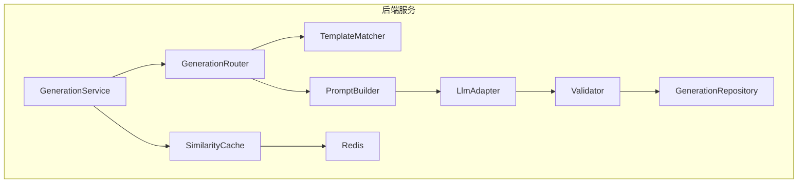
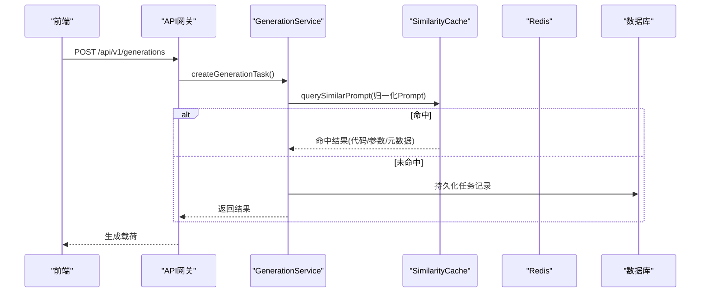
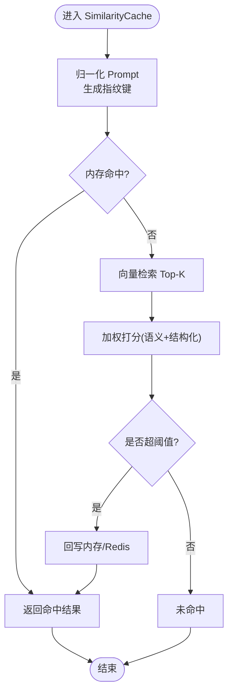
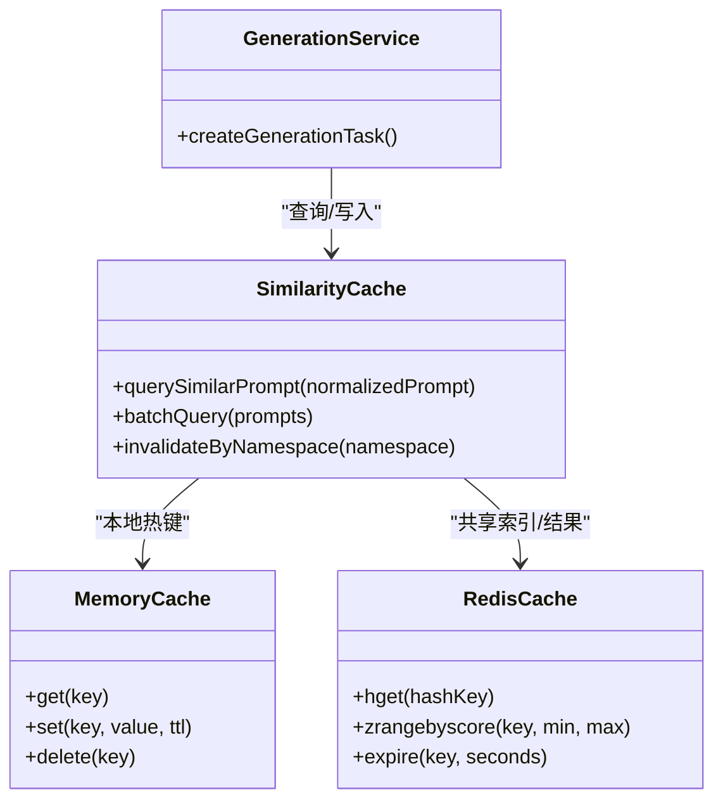

# 缓存策略实现

<cite>
**本文引用的文件**
- [产品技术设计文档](file://tech/product-technical-design.md)
- [产品需求文档](file://prd.md)
</cite>

## 目录
1. [引言](#引言)
2. [项目结构](#项目结构)
3. [核心组件](#核心组件)
4. [架构总览](#架构总览)
5. [详细组件分析](#详细组件分析)
6. [依赖分析](#依赖分析)
7. [性能考虑](#性能考虑)
8. [故障排查指南](#故障排查指南)
9. [结论](#结论)
10. [附录](#附录)

## 引言
本文件面向 ApexForge 的“相似 Prompt 缓存”能力，给出从设计到落地的完整策略说明。重点覆盖：
- SimilarityCache 的设计原理与关键流程（相似检测、键生成、失效、命中率优化）
- 缓存层级（内存 + Redis）与数据结构/存储格式
- 预热策略、批量操作与监控指标
- 配置参数与调优建议

## 项目结构
后端采用 NestJS 模块化架构，Generation Service 内部包含 SimilarityCache 作为独立组件；平台化阶段引入 Redis 作为分布式缓存层。前端不涉及服务端缓存逻辑。

图表来源
- [产品技术设计文档:594-609](file://tech/product-technical-design.md#L594-L609)
- [产品技术设计文档:944-950](file://tech/product-technical-design.md#L944-L950)

章节来源
- [产品技术设计文档:574-630](file://tech/product-technical-design.md#L574-L630)
- [产品技术设计文档:944-950](file://tech/product-technical-design.md#L944-L950)

## 核心组件
- SimilarityCache：负责相似 Prompt 的检索与命中返回，屏蔽底层内存与 Redis 的差异，提供统一接口。
- GenerationService：在创建生成任务前优先查询缓存；命中则直接复用结果，未命中再走模板匹配与 LLM 生成链路。
- Redis：用于跨进程/实例共享的相似 Prompt 向量索引与结果缓存。
- 内存缓存：用于单进程内热点数据的极速访问与二次加速。

章节来源
- [产品技术设计文档:594-609](file://tech/product-technical-design.md#L594-L609)
- [产品技术设计文档:944-950](file://tech/product-technical-design.md#L944-L950)

## 架构总览
相似 Prompt 缓存贯穿“创建生成任务”主流程，位于路由与 LLM 调用之前，显著降低重复请求成本并提升响应时延。

图表来源
- [产品技术设计文档:361-390](file://tech/product-technical-design.md#L361-L390)

章节来源
- [产品技术设计文档:361-390](file://tech/product-technical-design.md#L361-L390)

## 详细组件分析

### SimilarityCache 设计与实现要点
- 职责边界
  - 输入：用户原始 Prompt 经归一化后的文本或特征向量
  - 输出：若相似度超过阈值，返回已验证的生成结果（模式、模板ID、参数、代码等）
  - 副作用：统计命中率、更新最近使用信息、触发异步写入持久层
- 相似 Prompt 检测算法
  - 候选召回：基于向量相似度（如余弦相似度）快速检索 Top-K
  - 精确打分：结合语义与结构化字段（类别、风格标签、参数范围）进行加权评分
  - 阈值判定：当综合得分大于设定阈值时视为命中
- 缓存键生成策略
  - 一级键：归一化 Prompt 的指纹（去空白、大小写归一、同义词替换、标点标准化）
  - 二级键：版本化维度（Prompt 模板版本、系统提示版本、模型供应商版本）
  - 三级键：业务上下文（workspaceId/projectId 可选，按租户隔离）
- 缓存失效机制
  - TTL：按热度分层设置过期时间（热门短 TTL、长尾较长 TTL）
  - 主动失效：模板/系统提示/模型供应商升级后，按命名空间批量失效
  - 淘汰策略：LRU/LFU 混合淘汰，控制内存占用上限
- 命中率优化
  - 预归一化：对常见变体做规则级归一，减少无效分支
  - 近似去重：编辑距离/模糊匹配前置过滤，降低向量计算开销
  - 局部热点：将高频键常驻内存，避免频繁网络往返
  - 批量合并：同一会话内的多次微调请求可合并为一次向量检索

图表来源
- [产品技术设计文档:944-950](file://tech/product-technical-design.md#L944-L950)

章节来源
- [产品技术设计文档:944-950](file://tech/product-technical-design.md#L944-L950)

### 缓存层级设计（内存 + Redis）
- 内存缓存
  - 用途：进程内热点键、最近使用、防抖合并
  - 结构：键 -> {value, lastAccess, accessCount, ttl}
  - 容量：可配置上限，达到上限触发 LRU/LFU 淘汰
- Redis 缓存
  - 用途：跨实例共享、持久化热点、向量索引
  - 结构：
    - Hash：prompt_key -> {normalized_prompt, version_tags, result_json, created_at, updated_at, score}
    - ZSET：scored_index -> {prompt_key: score} 用于 Top-K 检索
    - String：meta:{namespace} -> {version, ttl_policy, stats}
  - 一致性：先读内存，再读 Redis，最后回源；写路径遵循 Cache-Aside
- 存储格式
  - value 为 JSON，包含 mode/templateId/params/code/metrics 等字段，便于下游直接使用

章节来源
- [产品技术设计文档:944-950](file://tech/product-technical-design.md#L944-L950)

### 缓存预热策略
- 启动预热
  - 加载历史高命中 Prompt 集合及其结果至内存
  - 构建初始向量索引（Top-N 热门），写入 Redis
- 增量预热
  - 后台任务定期扫描“近 N 天高命中但未入缓存”的条目，分批回填
- 事件驱动预热
  - 模板发布/系统提示升级后，根据影响范围选择性预热相关子集

章节来源
- [产品技术设计文档:944-950](file://tech/product-technical-design.md#L944-L950)

### 批量缓存操作
- 批量查询：支持传入多个归一化 Prompt，一次性返回命中集合
- 批量写入：对 LLM 生成的结果进行批处理写入，减少网络 RTT
- 批量失效：按命名空间或版本标签批量删除/标记失效

章节来源
- [产品技术设计文档:944-950](file://tech/product-technical-design.md#L944-L950)

### 监控指标与观测
- 命中率：命中次数 / 总查询次数
- 延迟分布：P50/P95/P99（含内存/Redis/回源）
- 资源占用：内存缓存大小、Redis 键数量与体积
- 质量指标：平均打分、阈值命中率、误命中率（人工抽检）
- 业务指标：LLM 调用节省比例、模板模式占比

章节来源
- [产品技术设计文档:944-950](file://tech/product-technical-design.md#L944-L950)

## 依赖分析
- 模块耦合
  - GenerationService 强依赖 SimilarityCache；SimilarityCache 依赖 Redis 与内存缓存
  - 与 TemplateMatcher、PromptBuilder、LlmAdapter 解耦，通过返回值契约交互
- 外部依赖
  - Redis：需保证低延迟与高可用，必要时启用集群与哨兵
  - 向量库：可在 Redis 中实现或使用专用向量服务（未来扩展）

图表来源
- [产品技术设计文档:594-609](file://tech/product-technical-design.md#L594-L609)
- [产品技术设计文档:944-950](file://tech/product-technical-design.md#L944-L950)

章节来源
- [产品技术设计文档:594-609](file://tech/product-technical-design.md#L594-L609)
- [产品技术设计文档:944-950](file://tech/product-technical-design.md#L944-L950)

## 性能考虑
- 相似检测
  - 先用轻量规则归一与模糊匹配过滤，再进行向量检索，降低计算成本
  - 动态调整 Top-K 与阈值，平衡命中率与延迟
- 读写路径
  - 读多写少场景下，优先命中内存；写路径采用异步落盘与批量提交
- 热点保护
  - 对极端热点键进行本地常驻，避免抖动
- 降级策略
  - Redis 不可用时自动退化为纯内存模式，保障可用性

章节来源
- [产品技术设计文档:944-950](file://tech/product-technical-design.md#L944-L950)

## 故障排查指南
- 症状：命中率异常下降
  - 检查归一化规则变更、阈值上调、模板/系统提示版本升级导致命名空间失效
- 症状：延迟升高
  - 检查 Redis 连接池、慢查询、向量检索 Top-K 过大
- 症状：内存增长过快
  - 检查内存缓存上限与淘汰策略是否生效，是否存在未设置 TTL 的键
- 症状：结果不一致
  - 核对版本标签与命名空间隔离是否正确，确认失效策略是否覆盖受影响范围

章节来源
- [产品技术设计文档:944-950](file://tech/product-technical-design.md#L944-L950)

## 结论
通过“相似 Prompt 缓存”，ApexForge 能在不牺牲生成质量的前提下，显著降低重复请求的 LLM 调用成本与端到端时延。配合内存+Redis 的双层缓存、严格的键与失效策略、完善的监控与预热机制，可在不同规模部署下稳定提升整体吞吐与用户体验。

## 附录

### 配置参数清单（建议）
- 相似检测
  - similarity_threshold：相似度阈值（默认 0.95）
  - vector_top_k：向量检索候选数（默认 10）
  - normalize_rules：归一化规则开关（同义词、标点、大小写等）
- 缓存层级
  - memory_cache_max_size：内存缓存最大条目数
  - memory_cache_ttl_seconds：内存缓存默认 TTL
  - redis_namespace：命名空间前缀（按环境/租户区分）
  - redis_ttl_policy：TTL 策略（hot/normal/longtail）
- 失效与预热
  - invalidate_on_version_change：版本变更是否触发失效
  - warmup_batch_size：预热批次大小
  - warmup_schedule_cron：定时预热任务调度

章节来源
- [产品技术设计文档:944-950](file://tech/product-technical-design.md#L944-L950)

### 性能调优建议
- 阈值与 Top-K 联合调参：以 A/B 实验评估命中率与延迟权衡
- 热点键常驻：对 Top-1% 键开启常驻内存，缩短 P99
- 批量写入：合并 LLM 结果写入，降低 Redis 压力
- 索引瘦身：仅保留必要字段，大对象（如代码）存对象存储，缓存只保存 URL 与摘要
- 降级与熔断：Redis 异常时快速回退内存模式，避免雪崩

章节来源
- [产品技术设计文档:944-950](file://tech/product-technical-design.md#L944-L950)