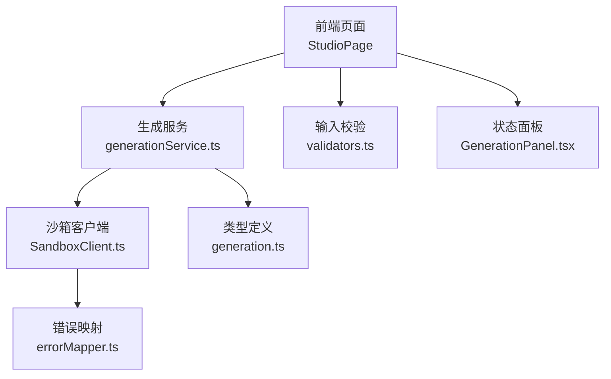
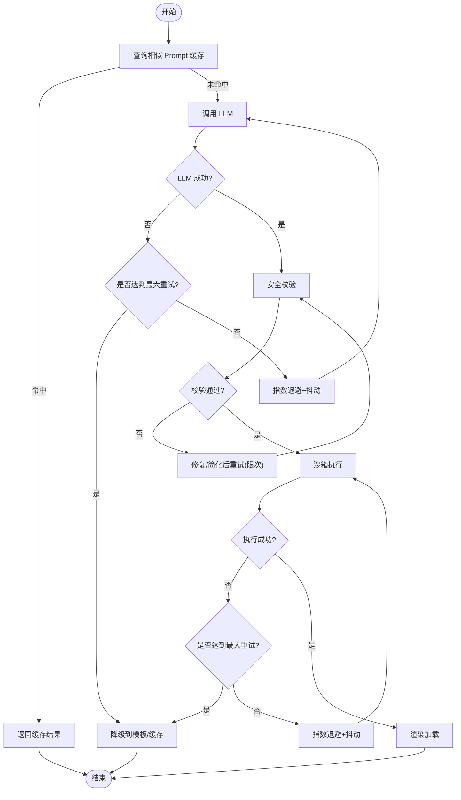
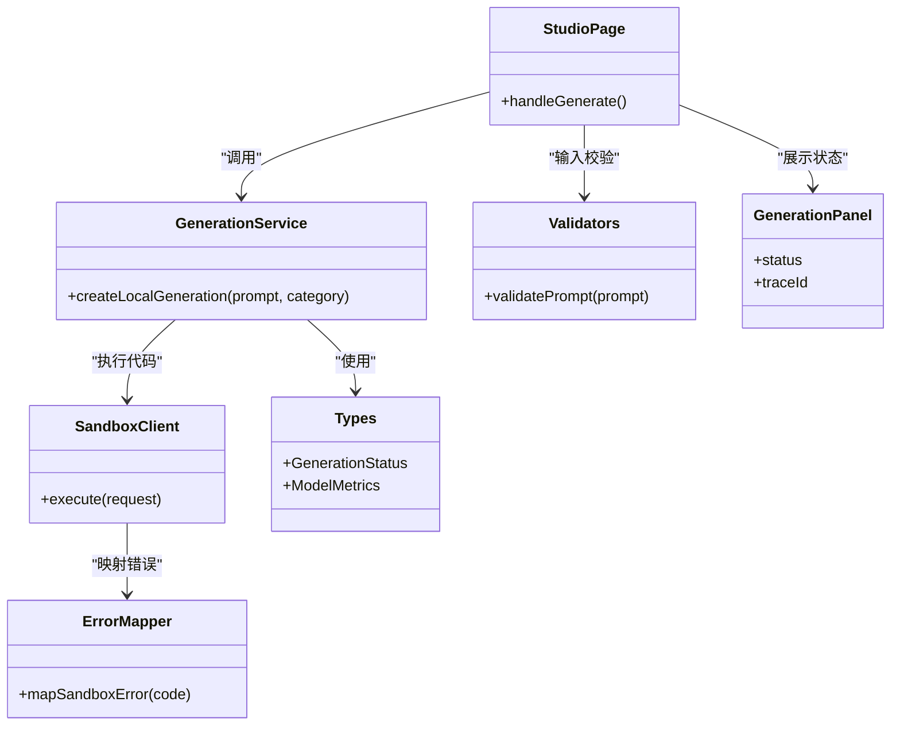

# 错误恢复机制

<cite>
**本文引用的文件**
- [tech/product-technical-design.md](file://tech/product-technical-design.md)
- [prd.md](file://prd.md)
- [src/modules/studio/services/generationService.ts](file://src/modules/studio/services/generationService.ts)
- [src/modules/sandbox/SandboxClient.ts](file://src/modules/sandbox/SandboxClient.ts)
- [src/modules/sandbox/errorMapper.ts](file://src/modules/sandbox/errorMapper.ts)
- [src/shared/types/generation.ts](file://src/shared/types/generation.ts)
- [src/shared/utils/validators.ts](file://src/shared/utils/validators.ts)
- [src/modules/studio/pages/StudioPage.tsx](file://src/modules/studio/pages/StudioPage.tsx)
- [src/modules/studio/components/GenerationPanel.tsx](file://src/modules/studio/components/GenerationPanel.tsx)
</cite>

## 目录
1. [引言](#引言)
2. [项目结构](#项目结构)
3. [核心组件](#核心组件)
4. [架构总览](#架构总览)
5. [详细组件分析](#详细组件分析)
6. [依赖关系分析](#依赖关系分析)
7. [性能与稳定性考量](#性能与稳定性考量)
8. [故障排查指南](#故障排查指南)
9. [结论](#结论)
10. [附录](#附录)

## 引言
本文件面向 ApexForge 的 GenerationService 及相关前端链路，系统化阐述错误分类、处理策略、重试与退避、降级与熔断、日志与监控告警、以及故障排查与最佳实践。文档基于仓库中的产品技术设计、MVP 实现与类型定义进行归纳，确保与实际代码和设计一致。

## 项目结构
当前仓库包含产品需求与技术设计文档，以及 MVP 前端实现（React + Three.js）。与错误恢复直接相关的模块包括：
- 生成服务（本地模拟）：用于演示生成流程与状态流转
- 沙箱客户端与错误映射：用于隔离执行与错误归一化
- 类型与校验：统一状态、指标与输入校验
- UI 状态面板：展示 traceId 与状态，便于追踪与排障



图表来源
- [src/modules/studio/pages/StudioPage.tsx:1-245](file://src/modules/studio/pages/StudioPage.tsx#L1-L245)
- [src/modules/studio/services/generationService.ts:1-30](file://src/modules/studio/services/generationService.ts#L1-L30)
- [src/modules/sandbox/SandboxClient.ts:1-19](file://src/modules/sandbox/SandboxClient.ts#L1-L19)
- [src/modules/sandbox/errorMapper.ts:1-12](file://src/modules/sandbox/errorMapper.ts#L1-L12)
- [src/shared/types/generation.ts:1-29](file://src/shared/types/generation.ts#L1-L29)
- [src/shared/utils/validators.ts:1-13](file://src/shared/utils/validators.ts#L1-L13)
- [src/modules/studio/components/GenerationPanel.tsx:1-39](file://src/modules/studio/components/GenerationPanel.tsx#L1-L39)

章节来源
- [src/modules/studio/pages/StudioPage.tsx:1-245](file://src/modules/studio/pages/StudioPage.tsx#L1-L245)
- [src/modules/studio/services/generationService.ts:1-30](file://src/modules/studio/services/generationService.ts#L1-L30)
- [src/modules/sandbox/SandboxClient.ts:1-19](file://src/modules/sandbox/SandboxClient.ts#L1-L19)
- [src/modules/sandbox/errorMapper.ts:1-12](file://src/modules/sandbox/errorMapper.ts#L1-L12)
- [src/shared/types/generation.ts:1-29](file://src/shared/types/generation.ts#L1-L29)
- [src/shared/utils/validators.ts:1-13](file://src/shared/utils/validators.ts#L1-L13)
- [src/modules/studio/components/GenerationPanel.tsx:1-39](file://src/modules/studio/components/GenerationPanel.tsx#L1-L39)

## 核心组件
- 生成服务（本地模拟）
  - 职责：根据类别选择模板，模拟耗时并返回可渲染结果；附带 traceId 与质量指标
  - 错误点：当前实现未抛出异常，但预留了上层捕获与失败态切换
- 沙箱客户端
  - 职责：在 iframe 中执行 AI 生成的代码，返回序列化模型数据
  - 错误点：当前抛出一个运行时错误，并通过错误映射转换为可读消息
- 错误映射
  - 职责：将内部错误码映射为用户友好的中文提示
- 类型与校验
  - 职责：统一 GenerationStatus、ModelMetrics、Prompt 长度限制等
- UI 状态面板
  - 职责：可视化生成状态与 traceId，辅助定位问题

章节来源
- [src/modules/studio/services/generationService.ts:1-30](file://src/modules/studio/services/generationService.ts#L1-L30)
- [src/modules/sandbox/SandboxClient.ts:1-19](file://src/modules/sandbox/SandboxClient.ts#L1-L19)
- [src/modules/sandbox/errorMapper.ts:1-12](file://src/modules/sandbox/errorMapper.ts#L1-L12)
- [src/shared/types/generation.ts:1-29](file://src/shared/types/generation.ts#L1-L29)
- [src/shared/utils/validators.ts:1-13](file://src/shared/utils/validators.ts#L1-L13)
- [src/modules/studio/components/GenerationPanel.tsx:1-39](file://src/modules/studio/components/GenerationPanel.tsx#L1-L39)

## 架构总览
从端到端视角，错误恢复贯穿“输入校验 → 生成编排 → LLM 调用 → 安全校验 → 沙箱执行 → 渲染加载”的全链路。

```mermaid
sequenceDiagram
participant U as "用户"
participant FE as "前端页面"
participant GEN as "生成服务"
participant LLM as "LLM 适配器"
participant VAL as "安全校验"
participant BOX as "沙箱执行"
participant UI as "状态面板"
U->>FE : 提交 Prompt
FE->>FE : 输入校验
FE->>GEN : 创建生成任务
GEN->>LLM : 调用大模型
LLM-->>GEN : 返回代码或参数
GEN->>VAL : AST/黑名单/复杂度校验
VAL-->>GEN : 校验报告
alt 校验通过
GEN->>BOX : 执行代码并序列化模型
BOX-->>GEN : 模型 JSON 或错误
GEN-->>FE : 成功结果
else 校验失败或执行异常
GEN-->>FE : 失败结果
end
FE->>UI : 更新状态与 traceId
```

图表来源
- [tech/product-technical-design.md:360-390](file://tech/product-technical-design.md#L360-L390)
- [src/modules/studio/pages/StudioPage.tsx:41-65](file://src/modules/studio/pages/StudioPage.tsx#L41-L65)
- [src/modules/studio/services/generationService.ts:8-29](file://src/modules/studio/services/generationService.ts#L8-L29)
- [src/modules/sandbox/SandboxClient.ts:14-18](file://src/modules/sandbox/SandboxClient.ts#L14-L18)
- [src/modules/sandbox/errorMapper.ts:1-12](file://src/modules/sandbox/errorMapper.ts#L1-L12)

## 详细组件分析

### GenerationService 错误分类与处理策略
- 错误分类
  - 输入层错误：Prompt 为空或超长
  - 生成层错误：LLM 调用失败、超时、返回格式不合法
  - 校验层错误：AST/黑名单/复杂度不通过
  - 执行层错误：沙箱运行时报错、超时、返回模型 JSON 非法
  - 渲染层错误：ObjectLoader 反序列化失败、模型过于复杂导致渲染卡顿
- 处理策略
  - 输入层：立即阻断并提示修正
  - 生成层：触发重试与降级（见下节）
  - 校验层：记录校验报告，必要时进入修复流程
  - 执行层：按错误码映射为友好提示，支持自动重试或回退到模板模式
  - 渲染层：复杂度阈值告警，建议降低细节或切换模板

章节来源
- [src/shared/utils/validators.ts:1-13](file://src/shared/utils/validators.ts#L1-L13)
- [src/modules/sandbox/errorMapper.ts:1-12](file://src/modules/sandbox/errorMapper.ts#L1-L12)
- [tech/product-technical-design.md:428-470](file://tech/product-technical-design.md#L428-L470)
- [tech/product-technical-design.md:508-518](file://tech/product-technical-design.md#L508-L518)

### 重试机制：次数、退避、降级与熔断
- 重试次数限制
  - 建议上限：LLM 调用最多 2 次；沙箱执行最多 1 次（避免重复执行副作用）
- 退避策略
  - 指数退避：首次等待 1s，第二次 2s，第三次 4s（受上限控制）
  - 抖动：±20% 随机抖动，避免雪崩
- 错误降级
  - LLM 失败时回退到模板模式或缓存命中结果
  - 校验失败时尝试简化 Prompt 或切换更保守模板
- 熔断保护
  - 当连续失败超过阈值（如 5 次/分钟），临时关闭该供应商或功能入口，冷却时间 5 分钟
  - 熔断期间仅允许使用模板模式与缓存



图表来源
- [tech/product-technical-design.md:360-390](file://tech/product-technical-design.md#L360-L390)
- [tech/product-technical-design.md:340-357](file://tech/product-technical-design.md#L340-L357)
- [src/modules/studio/services/generationService.ts:8-29](file://src/modules/studio/services/generationService.ts#L8-L29)
- [src/modules/sandbox/SandboxClient.ts:14-18](file://src/modules/sandbox/SandboxClient.ts#L14-L18)

章节来源
- [tech/product-technical-design.md:340-357](file://tech/product-technical-design.md#L340-L357)
- [tech/product-technical-design.md:360-390](file://tech/product-technical-design.md#L360-L390)
- [src/modules/studio/services/generationService.ts:8-29](file://src/modules/studio/services/generationService.ts#L8-L29)
- [src/modules/sandbox/SandboxClient.ts:14-18](file://src/modules/sandbox/SandboxClient.ts#L14-L18)

### 错误日志记录、监控告警与可观测性
- 日志记录
  - 全链路 traceId：贯穿请求、生成、校验、执行与渲染
  - 关键事件：排队、生成、校验、修复、可预览、失败
- 监控指标
  - 成功率、失败率、各阶段耗时、重试次数、熔断触发次数
- 告警规则
  - 失败率突增、LLM 超时比例升高、沙箱执行失败集中出现、复杂度超限频繁
- 可观测性
  - 结合 OpenTelemetry 采集 Span，Prometheus/Grafana 展示趋势与热点

章节来源
- [tech/product-technical-design.md:360-390](file://tech/product-technical-design.md#L360-L390)
- [src/modules/studio/components/GenerationPanel.tsx:19-38](file://src/modules/studio/components/GenerationPanel.tsx#L19-L38)

### 前端错误处理与用户体验
- 输入校验失败：即时提示，阻止无效请求
- 生成失败：状态切换为 failed，显示通用提示，保留 traceId 以便排查
- 沙箱错误：根据错误码映射为友好文案，提供“重试/降低复杂度/切换模板”引导

章节来源
- [src/shared/utils/validators.ts:1-13](file://src/shared/utils/validators.ts#L1-L13)
- [src/modules/studio/pages/StudioPage.tsx:41-65](file://src/modules/studio/pages/StudioPage.tsx#L41-L65)
- [src/modules/sandbox/errorMapper.ts:1-12](file://src/modules/sandbox/errorMapper.ts#L1-L12)

## 依赖关系分析
- 生成服务依赖模板数据与类型定义
- 沙箱客户端依赖错误映射以输出可读消息
- 页面组件依赖生成服务与状态面板，负责状态推进与错误展示



图表来源
- [src/modules/studio/services/generationService.ts:1-30](file://src/modules/studio/services/generationService.ts#L1-L30)
- [src/modules/sandbox/SandboxClient.ts:1-19](file://src/modules/sandbox/SandboxClient.ts#L1-L19)
- [src/modules/sandbox/errorMapper.ts:1-12](file://src/modules/sandbox/errorMapper.ts#L1-L12)
- [src/shared/types/generation.ts:1-29](file://src/shared/types/generation.ts#L1-L29)
- [src/shared/utils/validators.ts:1-13](file://src/shared/utils/validators.ts#L1-L13)
- [src/modules/studio/pages/StudioPage.tsx:1-245](file://src/modules/studio/pages/StudioPage.tsx#L1-L245)
- [src/modules/studio/components/GenerationPanel.tsx:1-39](file://src/modules/studio/components/GenerationPanel.tsx#L1-L39)

## 性能与稳定性考量
- 重试与退避：避免瞬时抖动引发级联失败
- 降级与熔断：保障核心路径可用性与系统整体稳定
- 复杂度控制：对模型面数、顶点数、材质数量设置阈值，超限则提示降级
- 缓存优先：相似 Prompt 命中缓存，减少 LLM 压力与失败概率

[本节为通用指导，无需具体文件引用]

## 故障排查指南
- 快速定位
  - 查看 traceId，关联日志与指标
  - 检查 GenerationStatus 流转是否符合预期
- 常见问题
  - LLM 调用失败：检查网络、密钥、配额与供应商健康度；启用熔断与降级
  - 校验失败：查看校验报告，定位黑名单/复杂度问题；简化 Prompt 或切换模板
  - 沙箱执行失败：确认错误码（超时/运行时报错/JSON 非法），调整复杂度或重试
  - 渲染失败：检查 ObjectLoader 反序列化与模型复杂度，必要时降低细节
- 操作建议
  - 开启详细日志与埋点
  - 配置告警阈值与通知渠道
  - 建立回归测试集，覆盖典型失败场景

章节来源
- [src/modules/studio/components/GenerationPanel.tsx:19-38](file://src/modules/studio/components/GenerationPanel.tsx#L19-L38)
- [src/modules/studio/pages/StudioPage.tsx:41-65](file://src/modules/studio/pages/StudioPage.tsx#L41-L65)
- [src/modules/sandbox/errorMapper.ts:1-12](file://src/modules/sandbox/errorMapper.ts#L1-L12)
- [tech/product-technical-design.md:428-470](file://tech/product-technical-design.md#L428-L470)
- [tech/product-technical-design.md:508-518](file://tech/product-technical-design.md#L508-L518)

## 结论
ApexForge 的错误恢复机制围绕“分类清晰、策略完备、可观测性强”的目标构建。通过重试与退避、降级与熔断、严格的安全校验与沙箱隔离，以及完善的日志与监控，系统在保障用户体验的同时提升了鲁棒性与可维护性。后续可在后端 GenerationService 中落地上述策略，并与前端状态面板联动，形成闭环。

[本节为总结，无需具体文件引用]

## 附录
- 状态机参考：queued → generating → validating → renderable/failed/repairing
- 错误码参考：SANDBOX_TIMEOUT、SANDBOX_RUNTIME_ERROR、MODEL_JSON_INVALID

章节来源
- [tech/product-technical-design.md:340-357](file://tech/product-technical-design.md#L340-L357)
- [src/modules/sandbox/errorMapper.ts:1-12](file://src/modules/sandbox/errorMapper.ts#L1-L12)