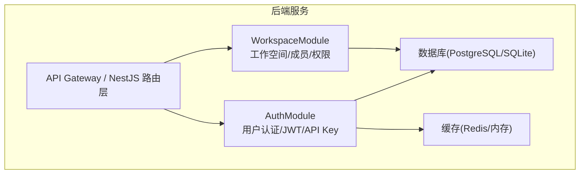
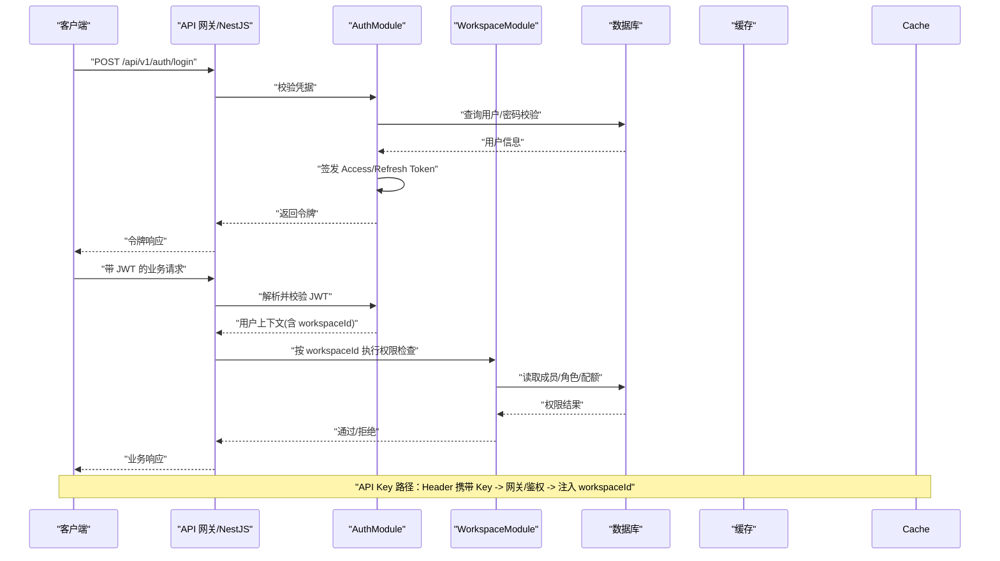
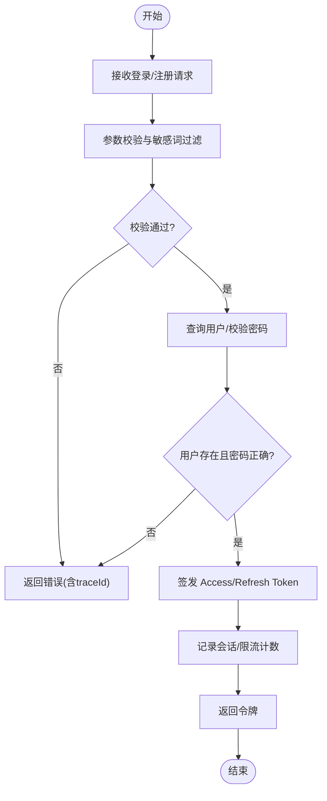
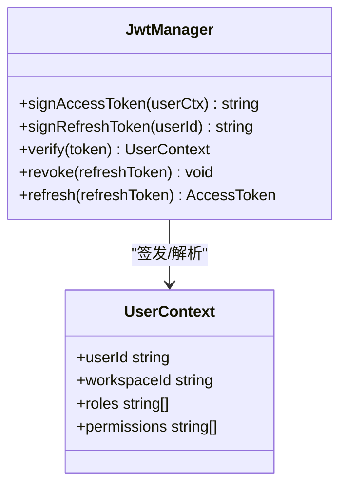
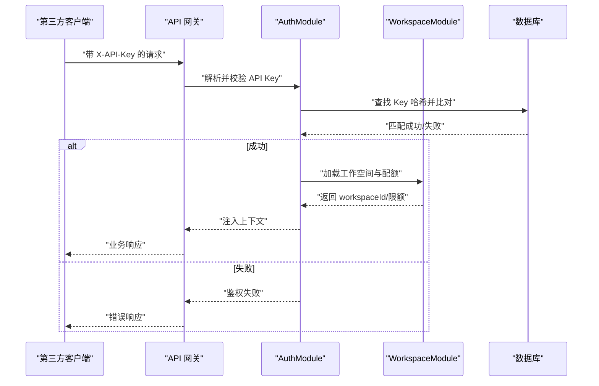
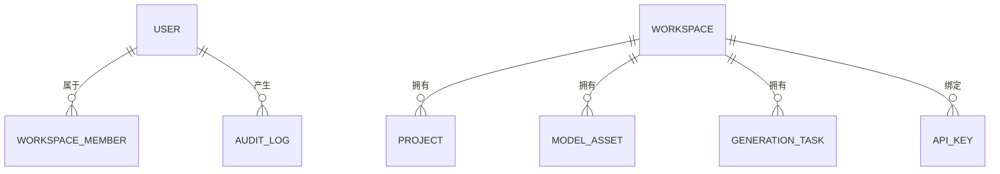
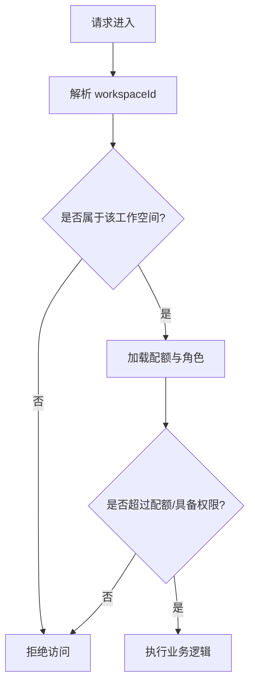
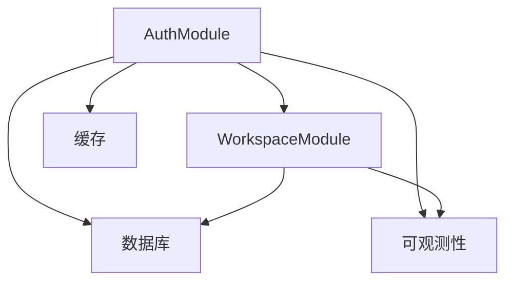

# 认证授权模块 (AuthModule)

<cite>
**本文引用的文件**   
- [产品技术设计文档](file://tech/product-technical-design.md)
- [产品需求文档](file://prd.md)
</cite>

## 目录
1. [简介](#简介)
2. [项目结构](#项目结构)
3. [核心组件](#核心组件)
4. [架构总览](#架构总览)
5. [详细组件分析](#详细组件分析)
6. [依赖分析](#依赖分析)
7. [性能考虑](#性能考虑)
8. [故障排查指南](#故障排查指南)
9. [结论](#结论)
10. [附录：接口与错误处理示例](#附录接口与错误处理示例)

## 简介
本章节为 ApexForge 的认证授权模块（AuthModule）提供系统化、可落地的设计与实现说明。内容覆盖用户认证流程、JWT Token 管理、API Key 生成与验证机制、权限控制、会话管理与安全策略，并重点解释多租户空间隔离的认证方案，包括工作空间级别的访问控制与角色权限模型。同时给出面向开发者的接口示例与错误处理建议，帮助团队快速落地企业级安全能力。

## 项目结构
根据后端架构设计，NestJS 采用模块化组织，其中 AuthModule 负责用户认证、JWT 签发与校验、API Key 管理；WorkspaceModule 负责工作空间与成员、权限等。整体模块划分如下：

图示来源
- [产品技术设计文档:574-593](file://tech/product-technical-design.md#L574-L593)

章节来源
- [产品技术设计文档:574-593](file://tech/product-technical-design.md#L574-L593)

## 核心组件
- 用户认证与登录注册
  - 支持邮箱/用户名 + 密码登录，返回 JWT。
  - 注册时进行输入校验与敏感词过滤，状态机驱动账号激活流程。
- JWT Token 管理
  - Access Token 短期有效，Refresh Token 长期有效且可刷新。
  - 服务端维护黑名单或过期窗口，支持强制登出与批量失效。
- API Key 管理
  - 按工作空间维度生成与绑定，仅展示一次，数据库保存哈希。
  - 请求头携带 API Key，网关或服务端鉴权后注入当前工作空间上下文。
- 权限控制与会话管理
  - 基于角色的访问控制（RBAC），结合工作空间维度进行资源隔离。
  - 会话信息（如最近活跃时间、设备指纹）用于风控与审计。
- 多租户空间隔离
  - 所有资源查询默认附加 workspaceId 条件，防止跨空间数据泄露。
  - 工作空间类型（个人/团队/企业）影响配额与功能开关。

章节来源
- [产品技术设计文档:574-593](file://tech/product-technical-design.md#L574-L593)
- [产品技术设计文档:132-170](file://tech/product-technical-design.md#L132-L170)
- [产品技术设计文档:174-200](file://tech/product-technical-design.md#L174-L200)
- [产品技术设计文档:844-865](file://tech/product-technical-design.md#L844-L865)
- [产品需求文档:143-152](file://prd.md#L143-L152)

## 架构总览
认证授权在系统中的作用贯穿 API 网关与各业务模块，确保每个请求具备可信身份与工作空间上下文。

图示来源
- [产品技术设计文档:574-593](file://tech/product-technical-design.md#L574-L593)
- [产品技术设计文档:132-170](file://tech/product-technical-design.md#L132-L170)
- [产品技术设计文档:174-200](file://tech/product-technical-design.md#L174-L200)

## 详细组件分析

### 用户认证与登录注册
- 登录流程
  - 客户端提交邮箱/用户名与密码。
  - 服务端校验凭据，成功则签发 Access Token 与 Refresh Token。
  - 失败返回统一错误结构，包含 traceId 便于追踪。
- 注册流程
  - 校验邮箱唯一性与输入长度限制。
  - 创建用户记录，初始状态为待激活或已激活（视策略）。
  - 发送激活邮件或自动激活。
- 刷新令牌
  - 使用 Refresh Token 换取新的 Access Token。
  - 支持一次性使用与滑动过期策略，降低重放风险。

章节来源
- [产品技术设计文档:574-593](file://tech/product-technical-design.md#L574-L593)
- [产品需求文档:143-152](file://prd.md#L143-L152)

### JWT Token 管理
- 令牌结构
  - Access Token：短有效期，携带用户 ID、工作空间 ID、角色与权限摘要。
  - Refresh Token：长有效期，独立存储并可撤销。
- 令牌校验
  - 网关或中间件解析 Header，校验签名与过期时间。
  - 将用户上下文注入请求对象，供后续模块使用。
- 令牌刷新与登出
  - 刷新接口校验 Refresh Token，成功后签发新 Access Token。
  - 登出接口将旧 Refresh Token 加入黑名单或标记失效。
- 安全策略
  - 最小化载荷，避免敏感信息入 Token。
  - 支持强制登出与批量失效（例如重置密码、安全事件）。

图示来源
- [产品技术设计文档:574-593](file://tech/product-technical-design.md#L574-L593)

章节来源
- [产品技术设计文档:574-593](file://tech/product-technical-design.md#L574-L593)

### API Key 生成与验证机制
- 生成策略
  - 按工作空间维度生成，支持前缀标识与版本控制。
  - 首次展示完整 Key，之后仅显示掩码；数据库保存哈希值。
- 验证流程
  - 请求头携带 X-API-Key，网关/鉴权中间件解析并校验。
  - 校验通过后注入 workspaceId 与配额信息到请求上下文。
- 安全与审计
  - 记录每次调用来源 IP、UA、耗时与结果。
  - 支持按 Key 维度限流与配额控制。

图示来源
- [产品技术设计文档:132-170](file://tech/product-technical-design.md#L132-L170)
- [产品技术设计文档:174-200](file://tech/product-technical-design.md#L174-L200)

章节来源
- [产品技术设计文档:132-170](file://tech/product-technical-design.md#L132-L170)
- [产品技术设计文档:174-200](file://tech/product-technical-design.md#L174-L200)

### 权限控制与会话管理
- 角色与权限模型（RBAC）
  - 角色：Owner、Admin、Editor、Viewer、API Client。
  - 权限：针对工作空间内资源（项目、资产、模板、任务）的操作粒度控制。
- 会话管理
  - 记录最近活跃时间、设备指纹、登录地点。
  - 异常行为触发二次校验或临时封禁。
- 工作空间级别访问控制
  - 所有资源操作必须附带 workspaceId。
  - 成员关系与角色决定允许的操作集合。

图示来源
- [产品技术设计文档:132-170](file://tech/product-technical-design.md#L132-L170)

章节来源
- [产品技术设计文档:844-865](file://tech/product-technical-design.md#L844-L865)
- [产品技术设计文档:132-170](file://tech/product-technical-design.md#L132-L170)

### 多租户空间隔离的认证方案
- 空间类型
  - personal、team、enterprise，影响配额、功能开关与合规要求。
- 数据隔离
  - 所有查询默认附加 workspaceId 条件，禁止跨空间访问。
  - 索引优化：workspaceId、createdAt 等高频字段建索引。
- 配额与计费
  - 每日生成次数、每分钟请求数、并发任务数、存储空间、API 调用量等维度。

章节来源
- [产品技术设计文档:174-200](file://tech/product-technical-design.md#L174-L200)
- [产品技术设计文档:844-865](file://tech/product-technical-design.md#L844-L865)

## 依赖分析
- 模块耦合
  - AuthModule 依赖 WorkspaceModule 获取成员与角色信息。
  - 两者共同依赖数据库与缓存（Redis/内存）以支撑鉴权与限流。
- 外部依赖
  - 密钥管理（KMS/Vault）用于存储 LLM API Key 与内部密钥。
  - 日志与可观测性（OpenTelemetry/Prometheus/Grafana）用于审计与告警。

图示来源
- [产品技术设计文档:574-593](file://tech/product-technical-design.md#L574-L593)

章节来源
- [产品技术设计文档:574-593](file://tech/product-technical-design.md#L574-L593)

## 性能考虑
- 鉴权链路优化
  - 热点用户与常用工作空间的权限缓存至 Redis，减少数据库压力。
  - JWT 校验走无状态中间件，避免额外 I/O。
- 限流与配额
  - 令牌桶算法对 API Key 与用户维度进行限流，保护后端稳定性。
- 数据库索引
  - 针对 workspaceId、userId、createdAt 建立索引，加速权限与配额查询。

[本节为通用性能指导，不直接分析具体文件]

## 故障排查指南
- 常见问题
  - 鉴权失败：检查 JWT 签名、过期时间与黑名单状态。
  - API Key 无效：确认 Key 是否存在、是否被禁用或超出配额。
  - 跨空间访问：确认请求是否携带正确的 workspaceId，以及用户是否具备相应角色。
- 日志与追踪
  - 统一错误响应包含 traceId，便于全链路定位。
  - 记录鉴权关键步骤：解析、校验、注入上下文、权限判定。
- 告警规则
  - API 错误率过高、鉴权失败突增、配额超限频繁等指标纳入监控。

章节来源
- [产品技术设计文档:868-907](file://tech/product-technical-design.md#L868-L907)
- [产品技术设计文档:924-930](file://tech/product-technical-design.md#L924-L930)

## 结论
AuthModule 作为平台的安全基石，围绕用户认证、JWT 管理、API Key 机制与 RBAC 权限模型构建起多租户空间隔离的访问控制体系。通过统一的鉴权中间件、细粒度的权限判定与完善的可观测性，保障系统在规模化部署下的安全性与稳定性。建议在实施中优先完善鉴权中间件与权限缓存，逐步引入更严格的配额与审计策略，以满足企业级合规需求。

[本节为总结性内容，不直接分析具体文件]

## 附录：接口与错误处理示例

- 通用规范
  - Base URL：/api/v1
  - 认证：用户侧 JWT，开放平台 API Key
  - 响应必须包含 traceId
  - 错误响应统一结构

- 登录接口
  - POST /api/v1/auth/login
  - 请求体：邮箱/用户名、密码
  - 响应：Access Token、Refresh Token、过期时间

- 刷新令牌
  - POST /api/v1/auth/refresh
  - 请求体：Refresh Token
  - 响应：新的 Access Token

- 登出接口
  - POST /api/v1/auth/logout
  - 请求体：Refresh Token
  - 响应：成功/失败

- API Key 管理
  - POST /api/v1/workspaces/{workspaceId}/api-keys
  - 请求体：名称、描述、权限范围
  - 响应：首次展示的完整 Key（仅一次）、Key ID、过期策略

- 错误结构示例
  - 统一 JSON 结构包含 traceId、error.code、error.message、error.details

章节来源
- [产品技术设计文档:632-652](file://tech/product-technical-design.md#L632-L652)
- [产品技术设计文档:574-593](file://tech/product-technical-design.md#L574-L593)