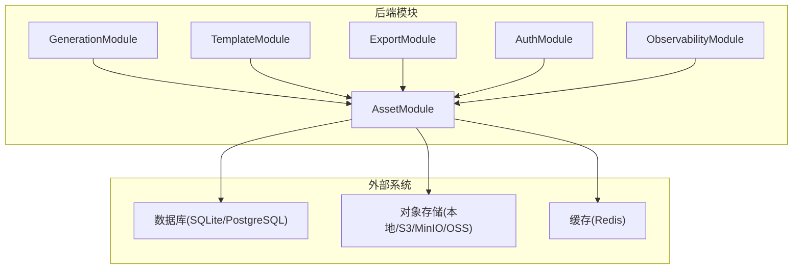
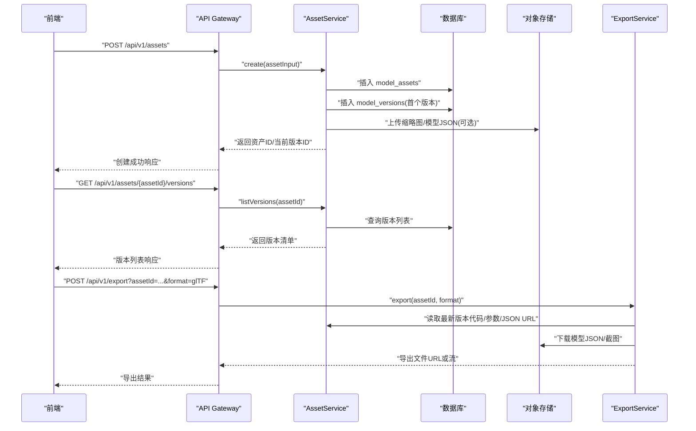
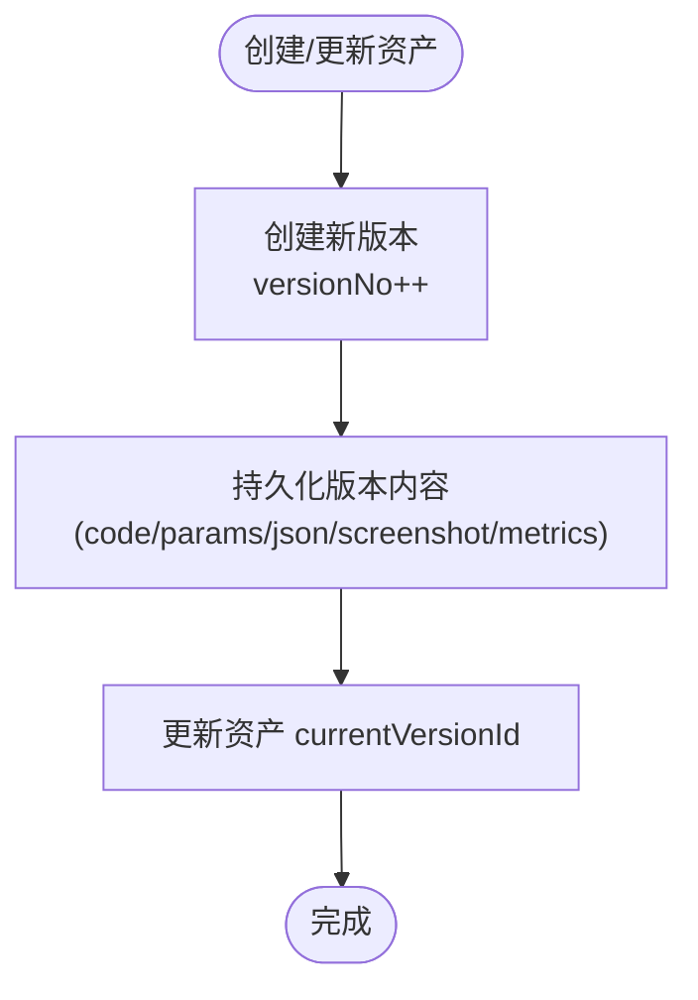
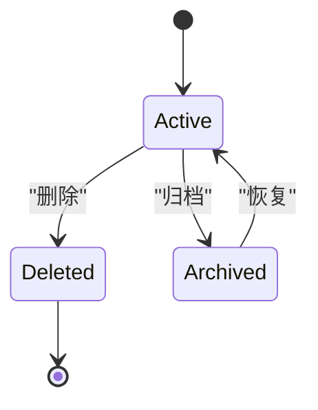
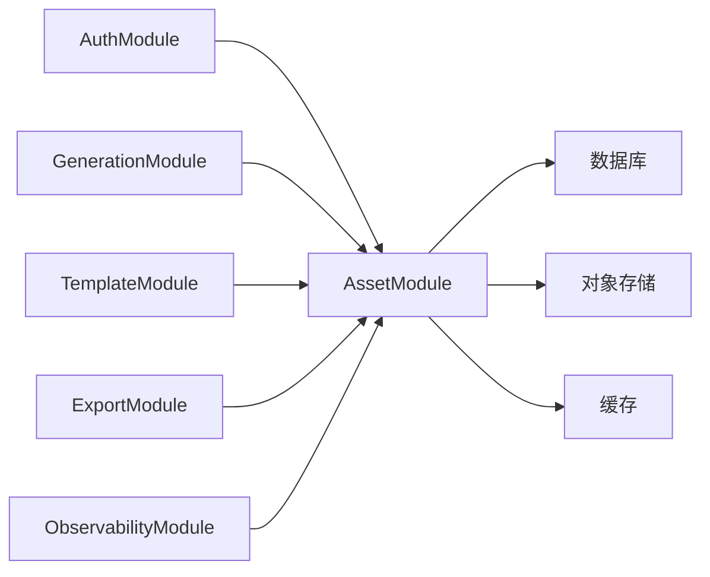

# 资产管理模块 (AssetModule)

<cite>
**本文引用的文件**
- [产品需求文档](file://prd.md)
- [产品技术设计文档](file://tech/product-technical-design.md)
</cite>

## 目录
1. [引言](#引言)
2. [项目结构](#项目结构)
3. [核心组件](#核心组件)
4. [架构总览](#架构总览)
5. [详细组件分析](#详细组件分析)
6. [依赖关系分析](#依赖关系分析)
7. [性能考量](#性能考量)
8. [故障排查指南](#故障排查指南)
9. [结论](#结论)
10. [附录](#附录)

## 引言
本章节面向 ApexForge 的资产管理模块（AssetModule），围绕 ModelAsset 与 ModelVersion 的数据模型、版本控制策略、文件存储管理、元数据维护、资产生命周期、批量操作、搜索索引、权限控制，以及与导出服务集成、缩略图生成、统计指标计算和备份恢复机制进行系统化说明。同时提供最佳实践与性能优化建议，帮助团队在 MVP 到平台化演进过程中稳定落地。

## 项目结构
从整体工程视角，资产管理模块属于后端 NestJS 的一个领域模块，负责模型资产的创建、查询、版本管理与关联文件的持久化。其职责边界清晰：不直接参与 AI 代码生成与渲染，而是承接“可渲染结果”的持久化与对外访问能力。

图表来源
- [产品技术设计文档:576-592](file://tech/product-technical-design.md#L576-L592)
- [产品技术设计文档:1001-1036](file://tech/product-technical-design.md#L1001-L1036)

章节来源
- [产品技术设计文档:576-592](file://tech/product-technical-design.md#L576-L592)
- [产品技术设计文档:1001-1036](file://tech/product-technical-design.md#L1001-L1036)

## 核心组件
本节聚焦 AssetModule 的核心实体与职责：
- ModelAsset：代表一个成功生成的模型资产，包含名称、分类、标签、当前版本指针、缩略图地址等元信息。
- ModelVersion：代表某资产的具体版本，包含 Three.js 代码、参数、模型 JSON 地址、截图地址、质量指标等。

关键职责
- 资产 CRUD 与状态管理（active/deleted/archived）
- 版本创建、切换与回滚
- 元数据维护（名称、分类、标签、缩略图、指标摘要）
- 与导出服务协作，输出 JS/JSON/截图/glTF
- 与权限体系联动，按空间/项目维度控制访问
- 与可观测性模块对接，记录 traceId、耗时、错误码

章节来源
- [产品技术设计文档:238-269](file://tech/product-technical-design.md#L238-L269)
- [产品技术设计文档:576-592](file://tech/product-technical-design.md#L576-L592)

## 架构总览
资产管理模块在整体系统中的位置如下：
- 上游：GenerationModule 将“可渲染结果”落库为资产与版本；TemplateModule 提供模板渲染产物作为版本来源之一。
- 下游：ExportModule 基于资产与版本导出多种格式；前端通过 API 获取资产列表、详情与版本历史。
- 横向：AuthModule 提供鉴权；ObservabilityModule 提供日志、指标与链路追踪；Cache 用于热点资产与版本元数据的加速读取。

图表来源
- [产品技术设计文档:704-722](file://tech/product-technical-design.md#L704-L722)
- [产品技术设计文档:576-592](file://tech/product-technical-design.md#L576-L592)

## 详细组件分析

### 数据模型设计
- ModelAsset
  - 标识与归属：id、workspaceId、projectId
  - 描述与组织：name、category、tags
  - 版本指针：currentVersionId
  - 展示与状态：thumbnailUrl、status(active/deleted/archived)
  - 审计字段：createdBy、createdAt、updatedAt
- ModelVersion
  - 版本标识：id、assetId、generationTaskId、versionNo
  - 内容：code、params、modelJsonUrl、screenshotUrl
  - 指标：metrics（几何体数量、顶点数、材质数等）
  - 时间戳：createdAt

复杂度与索引建议
- 高频查询：按 workspaceId/projectId/status 过滤资产；按 assetId 查询版本；按 updatedAt 排序分页。
- 建议索引：assets(workspaceId, projectId, status, updatedAt)、versions(assetId, versionNo)。

章节来源
- [产品技术设计文档:238-269](file://tech/product-technical-design.md#L238-L269)

### 版本控制策略
- 版本号递增：每新增一次可渲染结果即创建新版本，versionNo 自增。
- 当前版本指针：ModelAsset.currentVersionId 指向最新可用版本，支持手动切换。
- 回滚与对比：通过版本 ID 快速回滚；结合 metrics 与截图实现可视化对比。
- 来源追溯：每个版本保留 generationTaskId，便于回溯 Prompt、校验报告与质量评分。

图表来源
- [产品技术设计文档:238-269](file://tech/product-technical-design.md#L238-L269)

### 文件存储管理
- 存储对象
  - 缩略图：screenshotUrl
  - 模型 JSON：modelJsonUrl
  - 其他导出产物：由 ExportModule 产出并落盘
- 存储介质
  - MVP：本地文件系统
  - 平台化：S3/MinIO/OSS 等对象存储
- 一致性策略
  - 先写对象存储，成功后再落库 URL，失败则清理临时文件
  - 大文件分片上传与断点续传（平台化阶段）

章节来源
- [产品技术设计文档:238-269](file://tech/product-technical-design.md#L238-L269)

### 元数据维护
- 基础元数据：名称、分类、标签、缩略图
- 指标元数据：metrics（几何体、顶点、材质、面数估算等）
- 审计元数据：createdBy、更新时间
- 版本元数据：versionNo、来源任务、参数、截图、模型 JSON 地址

章节来源
- [产品技术设计文档:238-269](file://tech/product-technical-design.md#L238-L269)

### 资产生命周期管理
- 状态定义：active、deleted、archived
- 流转规则
  - 新建资产默认 active
  - 删除为软删除，标记 deleted
  - 归档为 archived（长期保存但不再活跃）
- 触发点
  - 用户操作：删除/归档
  - 定时任务：超期未访问自动归档
  - 合规策略：违规资产强制归档或删除

图表来源
- [产品技术设计文档:238-269](file://tech/product-technical-design.md#L238-L269)

### 批量操作
- 批量导入：从 CSV/JSON 批量创建资产与初始版本（含元数据与缩略图）
- 批量迁移：跨项目/空间移动资产
- 批量归档/删除：按条件筛选后执行
- 幂等与事务：批量操作需保证原子性与重试幂等

章节来源
- [产品技术设计文档:576-592](file://tech/product-technical-design.md#L576-L592)

### 搜索索引
- 检索维度：名称、分类、标签、创建/更新时间、状态
- 索引方案
  - MVP：数据库全文索引或 LIKE 模糊匹配（配合索引列）
  - 平台化：引入搜索引擎（如 Elasticsearch/OpenSearch）以支持高并发与复杂查询
- 同步策略：数据库变更后异步更新索引

章节来源
- [产品技术设计文档:952-958](file://tech/product-technical-design.md#L952-L958)

### 权限控制
- 角色与范围
  - Owner/Admin/Editor/Viewer/API Client
  - 资源范围：Workspace → Project → Asset/Version
- 鉴权流程
  - JWT 认证 + 资源级授权检查（RBAC）
  - API Key 限定调用能力与配额
- 审计日志：记录敏感操作（删除、归档、导出）

章节来源
- [产品技术设计文档:846-865](file://tech/product-technical-design.md#L846-L865)
- [产品技术设计文档:576-592](file://tech/product-technical-design.md#L576-L592)

### 导出服务集成
- 导出格式：JS、JSON、截图、glTF（Beta+）
- 输入：assetId、format、目标版本（可选）
- 处理流程
  - 读取最新版本 code/params/modelJsonUrl/screenshotUrl
  - 根据格式组装导出任务
  - 写入对象存储并返回下载链接
- 并发与限流：按租户/用户配额限制导出速率

章节来源
- [产品技术设计文档:704-722](file://tech/product-technical-design.md#L704-L722)
- [产品技术设计文档:576-592](file://tech/product-technical-design.md#L576-L592)

### 缩略图生成
- 触发时机：创建版本时自动生成
- 生成方式：使用沙箱执行 code 并截图，或从模型 JSON 预渲染
- 存储：上传至对象存储，记录 screenshotUrl
- 质量控制：分辨率、尺寸上限、超时保护

章节来源
- [产品技术设计文档:238-269](file://tech/product-technical-design.md#L238-L269)

### 统计指标计算
- 指标项：几何体数量、顶点数、材质数、面数估算、空模型检测、边界盒尺寸
- 采集位置：沙箱执行后或服务端解析模型 JSON
- 用途：质量评分、性能预警、前端加载提示

章节来源
- [产品技术设计文档:238-269](file://tech/product-technical-design.md#L238-L269)

### 备份恢复机制
- 备份范围：数据库（资产、版本、元数据）、对象存储（缩略图、模型 JSON、导出产物）
- 策略：定期全量 + 增量快照；跨地域复制（企业版）
- 恢复演练：定期验证备份可用性，确保 RTO/RPO 达标

章节来源
- [产品技术设计文档:952-958](file://tech/product-technical-design.md#L952-L958)

## 依赖关系分析
- 内部依赖
  - AuthModule：鉴权与授权
  - GenerationModule：将可渲染结果落库为资产与版本
  - TemplateModule：模板渲染产物作为版本来源
  - ExportModule：导出 JS/JSON/截图/glTF
  - ObservabilityModule：traceId、日志、指标
- 外部依赖
  - 数据库：SQLite（MVP）→ PostgreSQL（平台化）
  - 对象存储：本地文件 → S3/MinIO/OSS
  - 缓存：Redis（热点资产/版本元数据）

图表来源
- [产品技术设计文档:576-592](file://tech/product-technical-design.md#L576-L592)

章节来源
- [产品技术设计文档:576-592](file://tech/product-technical-design.md#L576-L592)

## 性能考量
- 数据库
  - 合理索引：workspaceId、projectId、status、updatedAt、assetId、versionNo
  - 大字段外置：代码、模型 JSON、截图仅存 URL，避免膨胀
  - 历史归档：按时间归档旧任务与低活资产
- 缓存
  - 热点资产与版本元数据缓存（TTL 可控）
  - 相似 Prompt 缓存复用（与 GenerationModule 协同）
- 导出
  - 异步导出队列，避免阻塞主线程
  - 分片与压缩传输，降低带宽占用
- 前端
  - 按需加载 Three.js 与沙箱 runtime
  - 模型加载前复杂度阈值检查，必要时降级

章节来源
- [产品技术设计文档:933-958](file://tech/product-technical-design.md#L933-L958)

## 故障排查指南
- 常见问题
  - 缩略图缺失：检查截图生成任务是否成功、对象存储权限与路径
  - 版本回滚失败：确认 currentVersionId 更新是否落库、是否存在并发冲突
  - 导出失败：核对模型 JSON 地址有效性、导出格式支持情况
  - 权限拒绝：检查 JWT 令牌、角色与资源范围绑定
- 定位手段
  - 通过 traceId 串联日志，定位请求链路
  - 查看质量评分与校验报告，辅助判断版本质量
  - 监控告警：导出失败率、缩略图生成失败率、权限拒绝比例

章节来源
- [产品技术设计文档:868-907](file://tech/product-technical-design.md#L868-L907)

## 结论
资产管理模块以 ModelAsset 与 ModelVersion 为核心，构建了完整的版本化、可追溯、可导出的 3D 模型资产管理体系。通过清晰的权限控制、完善的元数据与指标、以及可扩展的文件存储与导出能力，支撑从 MVP 到平台化的平滑演进。建议在 Beta 阶段优先完善模板模式下的参数化版本、导出服务与质量闭环，在 Scale 阶段推进多供应商、队列化与团队权限体系。

## 附录

### 最佳实践
- 命名与分类：统一命名规范与分类体系，提升检索效率
- 版本粒度：每次显著变更创建新版本，保持可回滚与可对比
- 元数据完整：尽量丰富 tags、metrics、截图，提升可发现性与可评估性
- 安全先行：严格权限校验与审计，防止越权访问与误删
- 性能优先：大文件外置、热点缓存、异步导出，保障用户体验

### 参考接口（节选）
- 创建资产：POST /api/v1/assets
- 查询版本：GET /api/v1/assets/{assetId}/versions
- 模板渲染：POST /api/v1/templates/{id}/render

章节来源
- [产品技术设计文档:704-732](file://tech/product-technical-design.md#L704-L732)