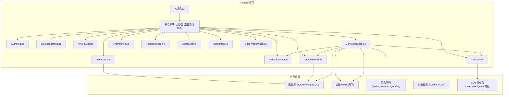
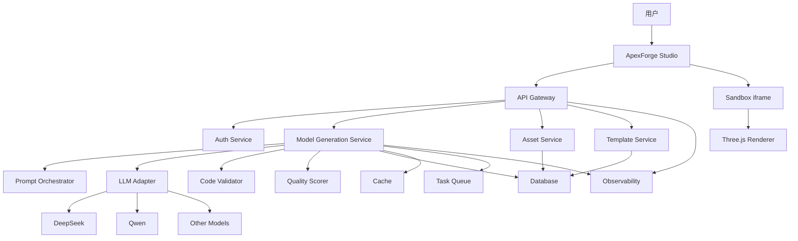
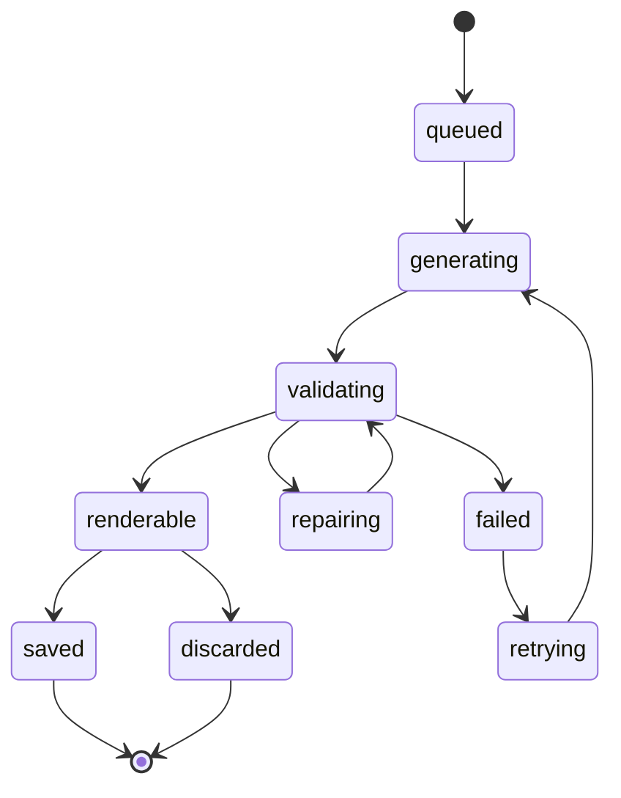
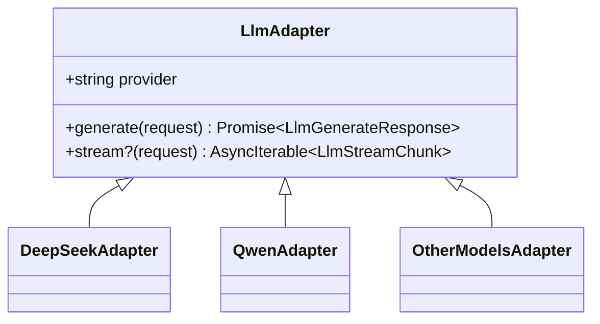
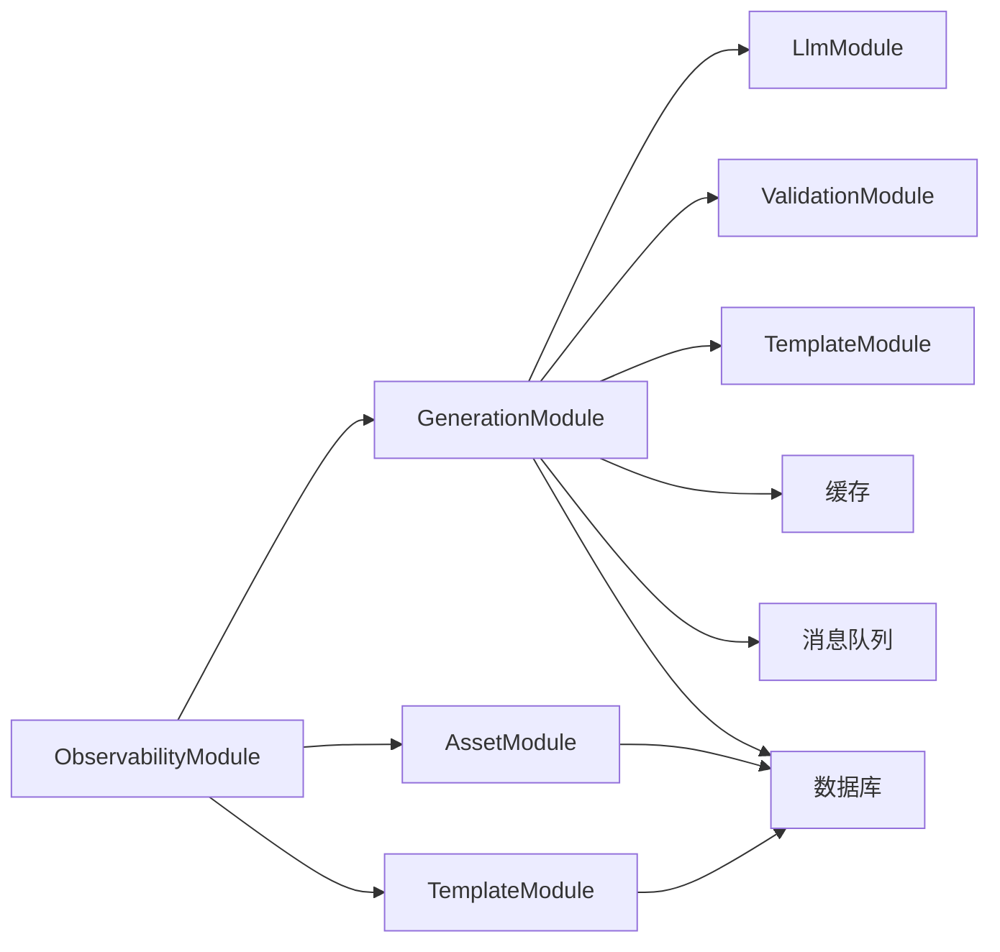

# 后端架构设计

<cite>
**本文引用的文件**   
- [产品技术设计文档](file://tech/product-technical-design.md)
- [产品需求文档](file://prd.md)
</cite>

## 目录
1. [引言](#引言)
2. [项目结构](#项目结构)
3. [核心组件](#核心组件)
4. [架构总览](#架构总览)
5. [详细组件分析](#详细组件分析)
6. [依赖分析](#依赖分析)
7. [性能考虑](#性能考虑)
8. [故障排查指南](#故障排查指南)
9. [结论](#结论)
10. [附录](#附录)

## 引言
本文件面向 ApexForge 后端，基于 NestJS 的模块化服务架构进行系统化设计说明。内容覆盖模块划分、依赖注入与中间件设计、GenerationService 内部编排（任务编排、Prompt 构建、LLM 适配器与代码验证）、多供应商 LLM Adapter 的统一接口与选择策略、各业务模块职责边界（AuthModule、WorkspaceModule、TemplateModule、AssetModule 等），以及从 MVP 单体到平台化微服务的演进路径。同时给出服务间通信、消息队列、缓存与数据库访问的设计模式建议。

## 项目结构
当前仓库包含产品与技术设计文档，用于指导后端实现。后端采用 NestJS 模块化组织，按领域能力拆分为多个模块，并通过控制器、服务、仓储、DTO 和拦截器/守卫/过滤器等横切关注点完成分层与解耦。



图表来源
- [产品技术设计文档:574-630](file://tech/product-technical-design.md#L574-L630)
- [产品技术设计文档:64-100](file://tech/product-technical-design.md#L64-L100)

章节来源
- [产品技术设计文档:574-630](file://tech/product-technical-design.md#L574-L630)
- [产品技术设计文档:64-100](file://tech/product-technical-design.md#L64-L100)

## 核心组件
- GenerationModule：生成任务编排中心，负责状态机推进、模板匹配、Prompt 构建、调用 LLM、输出解析、校验与评分、结果持久化与事件推送。
- LlmModule：统一 LLM 适配层，抽象多供应商差异，提供选择策略、重试降级与指标采集。
- ValidationModule：安全校验与质量评估，包括协议校验、AST 白名单、复杂度限制、沙箱执行与结果校验。
- TemplateModule：模板库与版本管理，支持参数 Schema、默认值、渲染函数与示例 Prompt。
- AssetModule：模型资产与版本管理，记录缩略图、指标、截图与导出产物。
- AuthModule：用户认证、JWT、API Key 管理与权限控制。
- WorkspaceModule：空间与成员、资源隔离与权限。
- ProjectModule：项目管理与可见性控制。
- FeedbackModule：用户反馈收集与质量闭环。
- ExportModule：导出 JS、JSON、截图、glTF 等。
- BillingModule：配额、套餐与用量统计。
- ObservabilityModule：日志、指标、链路追踪。

章节来源
- [产品技术设计文档:574-630](file://tech/product-technical-design.md#L574-L630)

## 架构总览
整体逻辑架构强调“前端零后端 3D 计算”，服务端聚焦 AI 推理、安全校验与数据持久化；平台化阶段引入 API Gateway、消息队列与独立 Worker，支撑高并发与可扩展性。



图表来源
- [产品技术设计文档:38-62](file://tech/product-technical-design.md#L38-L62)

## 详细组件分析

### GenerationService 内部结构与流程
GenerationService 是生成链路的编排者，串联缓存命中、模板匹配、Prompt 构建、LLM 调用、输出解析、校验与评分、结果保存与事件推送。

```mermaid
sequenceDiagram
participant FE as "前端"
participant API as "API 网关"
participant GEN as "GenerationService"
participant CACHE as "相似提示缓存"
participant TPL as "模板服务"
participant LLM as "LLM 适配器"
participant VAL as "校验器"
participant DB as "数据库"
participant BOX as "沙箱"
FE->>API : "POST /api/v1/generations"
API->>GEN : "创建生成任务"
GEN->>CACHE : "查询相似提示"
alt "缓存命中"
CACHE-->>GEN : "返回缓存结果"
else "缓存未命中"
GEN->>TPL : "查找候选模板"
TPL-->>GEN : "返回候选模板"
GEN->>LLM : "生成代码或参数"
LLM-->>GEN : "返回生成输出"
GEN->>VAL : "校验输出"
VAL-->>GEN : "返回校验报告"
end
GEN->>DB : "持久化任务与结果"
GEN-->>API : "返回结果"
API-->>FE : "生成载荷"
FE->>BOX : "在 iframe 中执行"
BOX-->>FE : "模型 JSON 或错误"
```

图表来源
- [产品技术设计文档:361-390](file://tech/product-technical-design.md#L361-L390)

#### 生成模式与优先级
- 模式：模板模式、代码模式、混合模式、缓存模式。
- 推荐优先级：缓存模式 > 模板模式 > 混合模式 > 代码模式。

章节来源
- [产品技术设计文档:329-338](file://tech/product-technical-design.md#L329-L338)

#### 任务状态机


图表来源
- [产品技术设计文档:342-357](file://tech/product-technical-design.md#L342-L357)

#### Prompt 编排策略
- System Prompt 要点：角色设定、固定 JSON 协议、仅暴露 buildModel(params, THREE) 或返回参数对象、禁止危险 API、几何体与材质白名单、复杂度限制。
- 输出协议：mode、templateId、params、code、explanation、warnings。
- Prompt 版本管理：每次生成记录 promptVersion，System Prompt、Few-shot、模板摘要均版本化，支持回滚。

章节来源
- [产品技术设计文档:392-425](file://tech/product-technical-design.md#L392-L425)

#### 代码安全校验设计
- 校验分层：输出协议校验、文本黑名单、AST 校验、运行时沙箱、超时销毁、结果校验。
- 黑名单 API：动态执行、网络访问、DOM 访问、动态加载、原型污染、计算风险。
- AST 白名单策略：允许基础语法与 Three.js 白名单构造器与方法，限制长度、深度、循环层数、Mesh 数量与顶点估算。

章节来源
- [产品技术设计文档:428-470](file://tech/product-technical-design.md#L428-L470)

#### 沙箱运行时设计
- iframe 隔离方案：隐藏或可控 iframe，postMessage 传递执行指令与结果。
- iframe 配置：sandbox 属性、CSP 限制、任务 ID 与超时销毁、仅暴露安全对象。
- 执行流程：主线程生成 executionId，发送执行指令，iframe 包装并执行 buildModel，成功后序列化 group.toJSON，主线程反序列化并居中缩放，异常则销毁并返回错误。
- 错误分类：SANDBOX_TIMEOUT、SANDBOX_RUNTIME_ERROR、MODEL_JSON_INVALID、MODEL_TOO_COMPLEX、MODEL_EMPTY。

章节来源
- [产品技术设计文档:472-518](file://tech/product-technical-design.md#L472-L518)

### 多供应商 LLM Adapter 统一接口与选择策略
- 统一接口：provider、generate(request)、可选 stream(request)。
- 选择策略：按任务类型选择模型、按成本与响应速度选择供应商、失败重试与降级、记录 token/耗时/错误码/输出质量。



图表来源
- [产品技术设计文档:611-629](file://tech/product-technical-design.md#L611-L629)

章节来源
- [产品技术设计文档:611-629](file://tech/product-technical-design.md#L611-L629)

### 模块职责边界
- AuthModule：用户认证、JWT、API Key 管理。
- WorkspaceModule：空间、成员、权限与资源隔离。
- ProjectModule：项目管理与可见性控制。
- GenerationModule：生成任务编排与生命周期管理。
- PromptModule：Prompt 模板与版本管理。
- LlmModule：多供应商适配与选择策略。
- ValidationModule：代码与参数校验、质量评分。
- TemplateModule：模板库与版本、参数 Schema 与渲染函数。
- AssetModule：模型资产与版本、截图与指标。
- FeedbackModule：用户反馈收集与质量闭环。
- ExportModule：导出 JS、JSON、截图、glTF。
- BillingModule：配额、套餐与调用量统计。
- ObservabilityModule：日志、指标、trace。

章节来源
- [产品技术设计文档:574-593](file://tech/product-technical-design.md#L574-L593)

### API 设计与交互契约
- 通用规范：Base URL、认证方式、traceId、统一错误结构。
- 关键接口：创建生成任务、查询生成任务、保存为资产、查询资产版本、模板接口、SSE 事件。
- SSE 事件类型：queued、generating、validating、repairing、renderable、failed。

章节来源
- [产品技术设计文档:632-757](file://tech/product-technical-design.md#L632-L757)

### 模板系统设计
- 模板结构：templateId、version、category、paramSchema、defaultParams、renderer。
- 模板分层：Skeleton、Style Variant、Detail Pack、Material Preset、Param Schema。
- 模板匹配策略：类别识别与关键词抽取、标签与向量检索候选模板。

章节来源
- [产品技术设计文档:760-800](file://tech/product-technical-design.md#L760-L800)

## 依赖分析
- 模块耦合与内聚：GenerationModule 作为编排中心，依赖 LlmModule、ValidationModule、TemplateModule、Cache、Queue、DB；其他模块相对独立，通过 API 与事件协作。
- 直接依赖：GenerationModule → LlmModule、ValidationModule、TemplateModule、Cache、Queue、DB。
- 间接依赖：TemplateModule、AssetModule → DB；ObservabilityModule → 全局日志与指标。
- 外部集成：LLM 供应商、对象存储、消息队列、缓存。
- 潜在循环依赖：应避免 GenerationModule 反向依赖 TemplateModule 的业务细节，通过 DTO 与接口解耦。



图表来源
- [产品技术设计文档:574-630](file://tech/product-technical-design.md#L574-L630)

章节来源
- [产品技术设计文档:574-630](file://tech/product-technical-design.md#L574-L630)

## 性能考虑
- 前端：动态加载 Three.js 与沙箱 runtime、Worker 解析模型 JSON、InstancedMesh 批量渲染、复杂度阈值提示、释放旧模型时 dispose geometry/material/texture、页面不可见暂停渲染。
- 服务端：相似 Prompt 缓存、模板模式参数化快速生成、异步 I/O 与连接池优化、队列削峰填谷。
- 网络：静态资源 CDN 缓存、Gzip/Brotli 压缩、增量更新。

章节来源
- [产品技术设计文档:563-571](file://tech/product-technical-design.md#L563-L571)
- [产品技术设计文档:155-165](file://prd.md#L155-L165)

## 故障排查指南
- 生成链路问题：检查 traceId 与 SSE 事件序列，确认状态机流转是否符合预期。
- LLM 调用失败：查看供应商选择策略、重试与降级日志，核对 token 与耗时指标。
- 校验失败：定位输出协议、AST 白名单与黑名单规则，结合校验报告与警告信息。
- 沙箱执行异常：根据错误码分类处理超时、运行时报错、模型 JSON 非法、复杂度过高与空模型。
- 缓存与队列：确认缓存命中率与队列积压情况，必要时扩容或调整消费速率。

章节来源
- [产品技术设计文档:361-390](file://tech/product-technical-design.md#L361-L390)
- [产品技术设计文档:428-470](file://tech/product-technical-design.md#L428-L470)
- [产品技术设计文档:472-518](file://tech/product-technical-design.md#L472-L518)

## 结论
本设计以 GenerationService 为核心，围绕 Prompt 编排、多供应商 LLM 适配与安全校验构建稳定高效的生成链路。通过模块化拆分与清晰的职责边界，系统可在 MVP 阶段快速落地，并在平台化阶段平滑演进为微服务架构，配合消息队列、缓存与对象存储提升扩展性与可靠性。

## 附录

### 微服务拆分策略与演进路径
- MVP 单体：NestJS 单体后端 + SQLite + 本地文件存储，降低工程复杂度。
- Beta 平台化：API Gateway + 独立 Generation/Template/Asset/Auth 等服务，PostgreSQL + Redis + BullMQ/RabbitMQ/Kafka + S3/MinIO/OSS。
- 服务间通信：REST/SSE/WebSocket，异步任务通过消息队列驱动 Worker。
- 数据迁移：ORM 抽象、UUID/CUID、JSON 字段兼容、迁移脚本导入历史数据。

章节来源
- [产品技术设计文档:64-100](file://tech/product-technical-design.md#L64-L100)
- [产品技术设计文档:122-129](file://tech/product-technical-design.md#L122-L129)

### 数据库访问与缓存模式
- 数据库访问：Repository/ORM 抽象，避免方言特性，统一 ID 策略。
- 缓存策略：相似 Prompt 缓存、任务状态缓存、限流计数。
- 对象存储：截图、导出文件、模型 JSON 地址。

章节来源
- [产品技术设计文档:122-129](file://tech/product-technical-design.md#L122-L129)
- [产品技术设计文档:114-121](file://tech/product-technical-design.md#L114-L121)