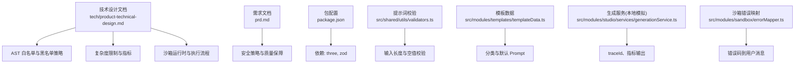
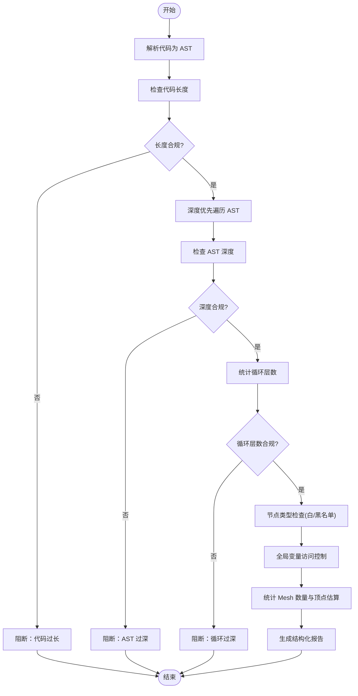
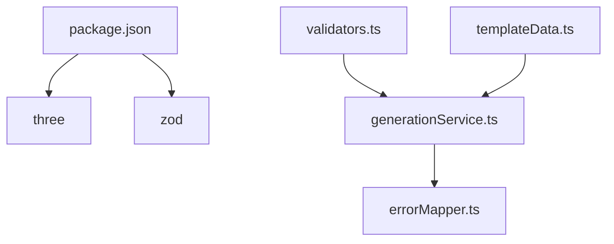

# AST 语法树校验

<cite>
**本文引用的文件**
- [tech/product-technical-design.md](file://tech/product-technical-design.md)
- [prd.md](file://prd.md)
- [package.json](file://package.json)
- [src/shared/utils/validators.ts](file://src/shared/utils/validators.ts)
- [src/modules/sandbox/errorMapper.ts](file://src/modules/sandbox/errorMapper.ts)
- [src/modules/studio/services/generationService.ts](file://src/modules/studio/services/generationService.ts)
- [src/modules/templates/templateData.ts](file://src/modules/templates/templateData.ts)
</cite>

## 目录
1. [引言](#引言)
2. [项目结构](#项目结构)
3. [核心组件](#核心组件)
4. [架构总览](#架构总览)
5. [详细组件分析](#详细组件分析)
6. [依赖分析](#依赖分析)
7. [性能考量](#性能考量)
8. [故障排查指南](#故障排查指南)
9. [结论](#结论)
10. [附录](#附录)

## 引言
本文件面向 ApexForge 的 AST 语法树校验系统，聚焦于基于 Babel Parser 或 Acorn 的代码静态分析机制。文档覆盖白名单语法允许列表、Three.js API 白名单、代码复杂度限制、AST 遍历算法与节点类型检查、全局变量访问控制、自定义校验规则扩展，以及结构化报告与可视化调试工具使用指南。内容严格依据仓库中的产品技术设计与需求文档进行提炼与组织，确保可落地性与一致性。

## 项目结构
当前仓库包含产品与技术设计文档、前端基础工程配置与少量模块示例。AST 校验相关策略在技术设计文档中明确定义，前端侧提供模板数据、生成服务与错误映射等辅助能力。



图表来源
- [tech/product-technical-design.md:441-469](file://tech/product-technical-design.md#L441-L469)
- [tech/product-technical-design.md:472-507](file://tech/product-technical-design.md#L472-L507)
- [prd.md:105-123](file://prd.md#L105-L123)
- [package.json:12-30](file://package.json#L12-L30)
- [src/shared/utils/validators.ts:1-14](file://src/shared/utils/validators.ts#L1-L14)
- [src/modules/templates/templateData.ts:1-54](file://src/modules/templates/templateData.ts#L1-L54)
- [src/modules/studio/services/generationService.ts:1-30](file://src/modules/studio/services/generationService.ts#L1-L30)
- [src/modules/sandbox/errorMapper.ts:1-12](file://src/modules/sandbox/errorMapper.ts#L1-L12)

章节来源
- [tech/product-technical-design.md:441-507](file://tech/product-technical-design.md#L441-L507)
- [prd.md:105-123](file://prd.md#L105-L123)
- [package.json:12-30](file://package.json#L12-L30)
- [src/shared/utils/validators.ts:1-14](file://src/shared/utils/validators.ts#L1-L14)
- [src/modules/templates/templateData.ts:1-54](file://src/modules/templates/templateData.ts#L1-L54)
- [src/modules/studio/services/generationService.ts:1-30](file://src/modules/studio/services/generationService.ts#L1-L30)
- [src/modules/sandbox/errorMapper.ts:1-12](file://src/modules/sandbox/errorMapper.ts#L1-L12)

## 核心组件
本节概述 AST 校验系统的核心要素：解析器选择、白名单/黑名单策略、复杂度阈值、遍历与统计、报告结构与可视化。

- 解析器选型
  - 推荐 Babel Parser 或 Acorn，用于将 AI 生成的 JS 代码转换为 AST，以便进行精确的语法与语义级约束。
- 白名单语法
  - 变量声明、函数声明、对象字面量、数组字面量。
  - 基础数学运算与 Math 白名单方法。
  - Three.js 白名单构造器与方法调用（见后文）。
- 黑名单 API
  - 动态执行、网络访问、DOM 访问、动态加载、原型污染、计算风险等。
- 复杂度限制
  - 最大代码长度、AST 深度、循环层数、Mesh 数量、顶点估算等。
- 全局变量访问控制
  - 仅允许 THREE、Math、params 与安全工具函数。
- 报告与可视化
  - 结构化报告字段包括通过状态、阻断原因、警告、复杂度指标、AST 摘要等；配合可视化调试工具定位问题节点。

章节来源
- [tech/product-technical-design.md:441-469](file://tech/product-technical-design.md#L441-L469)
- [tech/product-technical-design.md:298-310](file://tech/product-technical-design.md#L298-L310)

## 架构总览
下图展示从生成到校验再到沙箱执行的端到端流程，突出 AST 校验在服务端的关键位置。

```mermaid
sequenceDiagram
participant FE as "前端"
participant API as "API 网关"
participant GEN as "生成服务"
participant VAL as "校验服务(AST)"
participant BOX as "沙箱 iframe"
participant DB as "数据库"
FE->>API : "POST /api/v1/generations"
API->>GEN : "创建任务"
GEN->>VAL : "AST 校验(白名单/黑名单/复杂度)"
VAL-->>GEN : "校验报告(通过/失败+详情)"
alt 通过
GEN->>BOX : "postMessage 执行"
BOX-->>GEN : "序列化模型 JSON"
GEN->>DB : "持久化结果与报告"
GEN-->>FE : "返回渲染结果"
else 失败
GEN-->>FE : "返回错误与修复建议"
end
```

图表来源
- [tech/product-technical-design.md:362-390](file://tech/product-technical-design.md#L362-L390)
- [tech/product-technical-design.md:472-507](file://tech/product-technical-design.md#L472-L507)

## 详细组件分析

### 白名单语法与 Three.js API 白名单
- 允许的 JavaScript 语法
  - 变量声明、函数声明、对象字面量、数组字面量。
  - 基础数学运算与 Math 白名单方法。
- 允许的 Three.js 构造器与方法
  - new THREE.Group()、基础几何体、基础材质、Mesh、Line 等构造器。
  - group.add()、mesh.position.set()、mesh.rotation.set() 等安全方法。
- 实现要点
  - 在 AST 遍历阶段对 CallExpression、NewExpression、MemberExpression 等节点进行匹配与放行。
  - 维护白名单集合，支持按版本或套餐动态扩展。

章节来源
- [tech/product-technical-design.md:452-469](file://tech/product-technical-design.md#L452-L469)

### 黑名单 API 与危险模式检测
- 禁止项类别
  - 动态执行：eval、Function、setTimeout/setInterval 字符串参数。
  - 网络访问：fetch、XMLHttpRequest、WebSocket、EventSource、navigator.sendBeacon。
  - DOM 访问：document、window.top、window.parent、localStorage、sessionStorage。
  - 动态加载：import、importScripts、require。
  - 原型污染：__proto__、prototype、constructor 链式异常访问。
  - 计算风险：while(true)、无限递归、过深嵌套循环。
- 实现要点
  - 在 AST 中识别 Identifier、CallExpression、ForStatement、WhileStatement、IfStatement 等节点，结合正则与上下文判断。
  - 命中黑名单立即阻断并记录阻断原因。

章节来源
- [tech/product-technical-design.md:441-451](file://tech/product-technical-design.md#L441-L451)

### 代码复杂度限制与指标
- 限制项
  - 最大代码长度：MVP 20KB，Beta 可配置。
  - 最大 AST 深度：建议小于 30。
  - 最大循环层数：2。
  - 最大 Mesh 数量：MVP 80，Beta 通过套餐配置。
  - 最大几何体顶点估算：可按几何参数预估。
  - 全局变量访问控制：除 THREE、Math、params、安全工具函数外禁止访问未声明全局变量。
- 指标输出
  - 复杂度指标与 AST 摘要纳入校验报告，便于后续分析与优化。

章节来源
- [tech/product-technical-design.md:461-469](file://tech/product-technical-design.md#L461-L469)
- [tech/product-technical-design.md:298-310](file://tech/product-technical-design.md#L298-L310)

### AST 遍历算法与节点类型检查
- 遍历策略
  - 采用深度优先遍历，累计 AST 深度与循环层数。
  - 对关键节点类型进行检查与计数：
    - NewExpression：统计 THREE.* 构造器实例化次数（如 Mesh、几何体）。
    - CallExpression：统计安全方法调用（如 add、set）与黑名单方法。
    - MemberExpression：检查属性访问是否命中白名单。
    - ForStatement/WhileStatement：统计循环层数与条件表达式。
    - FunctionDeclaration/VariableDeclaration：确认仅允许声明。
- 节点类型检查
  - 白名单匹配：使用名称与路径双重校验（如 THREE.BoxGeometry）。
  - 黑名单匹配：关键字与模式组合，避免误报。
- 复杂度统计
  - 代码长度、AST 深度、循环层数、Mesh 数量、顶点估算等指标汇总至报告。

章节来源
- [tech/product-technical-design.md:452-469](file://tech/product-technical-design.md#L452-L469)

### 全局变量访问控制
- 允许的全局
  - THREE、Math、params、安全工具函数。
- 控制策略
  - 在 ReferenceIdentifier 或 MemberExpression 上下文中校验访问目标是否在白名单内。
  - 未声明全局访问直接阻断并记录原因。

章节来源
- [tech/product-technical-design.md:468-469](file://tech/product-technical-design.md#L468-L469)

### 自定义校验规则扩展
- 扩展点
  - 白名单/黑名单集合可配置化，支持按环境或套餐切换。
  - 新增节点类型检查逻辑时，遵循“最小权限”原则，仅放行必要 API。
- 测试与回归
  - 建立恶意代码样本集与边界用例，持续回归验证。
  - 结合质量评分与用户反馈闭环，迭代规则。

章节来源
- [tech/product-technical-design.md:1057-1074](file://tech/product-technical-design.md#L1057-L1074)

### 结构化报告与可视化调试
- 报告结构
  - passed：是否通过。
  - blockedReasons：阻断原因列表。
  - warnings：警告信息。
  - complexity：复杂度指标。
  - astSummary：AST 摘要（如节点计数、深度、循环层数、Mesh 数量等）。
- 可视化调试
  - 将 AST 摘要与阻断原因以交互式视图呈现，支持高亮问题节点、查看上下文与修复建议。
  - 结合 traceId 与时间戳，快速定位问题链路。

章节来源
- [tech/product-technical-design.md:298-310](file://tech/product-technical-design.md#L298-L310)

### 概念性流程图：AST 校验主流程


[此图为概念性流程，不直接映射具体源码文件]

## 依赖分析
- 外部依赖
  - three：Three.js 运行时库，供沙箱执行与模型渲染。
  - zod：运行时类型校验，可用于模板参数与生成结果的校验。
- 内部模块
  - validators.ts：提示词输入校验（长度与空值），作为前置过滤。
  - templateData.ts：模板元数据，辅助生成服务选择模板。
  - generationService.ts：本地模拟生成服务，输出 traceId 与指标。
  - errorMapper.ts：沙箱错误码到用户友好消息的映射。



图表来源
- [package.json:12-30](file://package.json#L12-L30)
- [src/shared/utils/validators.ts:1-14](file://src/shared/utils/validators.ts#L1-L14)
- [src/modules/templates/templateData.ts:1-54](file://src/modules/templates/templateData.ts#L1-L54)
- [src/modules/studio/services/generationService.ts:1-30](file://src/modules/studio/services/generationService.ts#L1-L30)
- [src/modules/sandbox/errorMapper.ts:1-12](file://src/modules/sandbox/errorMapper.ts#L1-L12)

章节来源
- [package.json:12-30](file://package.json#L12-L30)
- [src/shared/utils/validators.ts:1-14](file://src/shared/utils/validators.ts#L1-L14)
- [src/modules/templates/templateData.ts:1-54](file://src/modules/templates/templateData.ts#L1-L54)
- [src/modules/studio/services/generationService.ts:1-30](file://src/modules/studio/services/generationService.ts#L1-L30)
- [src/modules/sandbox/errorMapper.ts:1-12](file://src/modules/sandbox/errorMapper.ts#L1-L12)

## 性能考量
- 解析与遍历
  - 控制 AST 深度与循环层数以降低解析与遍历开销。
  - 白名单/黑名单匹配尽量使用常量集合与哈希查找，减少正则滥用。
- 指标统计
  - Mesh 数量与顶点估算应在遍历过程中增量计算，避免二次扫描。
- 缓存与复用
  - 对相似 Prompt 的生成结果进行缓存，减少重复解析与校验。
- 前端渲染
  - 使用 InstancedMesh 批量渲染重复元素，降低绘制调用。
  - 模型 JSON 解析放入 Worker，主线程专注渲染挂载。

[本节为通用指导，不直接分析具体文件]

## 故障排查指南
- 常见错误与处理
  - SANDBOX_TIMEOUT：执行超时，已安全终止。检查模型复杂度与循环层数。
  - SANDBOX_RUNTIME_ERROR：运行时报错，建议重试或降低复杂度。
  - MODEL_JSON_INVALID：模型数据结构无效，无法加载到场景。检查序列化与反序列化流程。
- 错误映射
  - 使用错误码到用户消息的映射，提升用户体验与排障效率。
- 定位手段
  - 借助 traceId 与校验报告中的 astSummary 与 blockedReasons，快速定位问题节点与上下文。

章节来源
- [src/modules/sandbox/errorMapper.ts:1-12](file://src/modules/sandbox/errorMapper.ts#L1-L12)
- [tech/product-technical-design.md:472-507](file://tech/product-technical-design.md#L472-L507)

## 结论
ApexForge 的 AST 语法树校验系统以白名单为核心、黑名单为兜底，结合严格的复杂度限制与全局变量访问控制，确保 AI 生成的 Three.js 代码在安全性与可控性上达到企业级标准。通过结构化报告与可视化调试工具，开发者可以快速定位与修复问题，持续提升生成质量与稳定性。

[本节为总结性内容，不直接分析具体文件]

## 附录
- 术语表
  - AST：抽象语法树，表示源代码的结构化形式。
  - 白名单：允许使用的语法与 API 集合。
  - 黑名单：禁止使用的语法与 API 集合。
  - 复杂度指标：衡量代码规模与结构的量化指标。
- 参考链接
  - 技术设计文档中关于 AST 白名单与黑名单策略、复杂度限制与沙箱执行流程的详细描述。

[本节为补充说明，不直接分析具体文件]