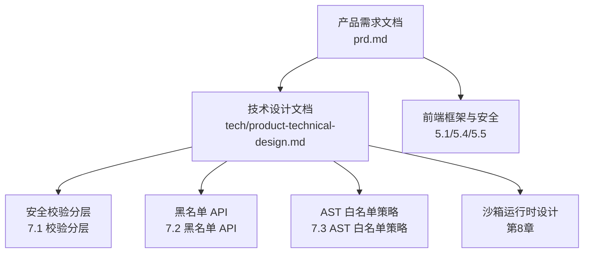
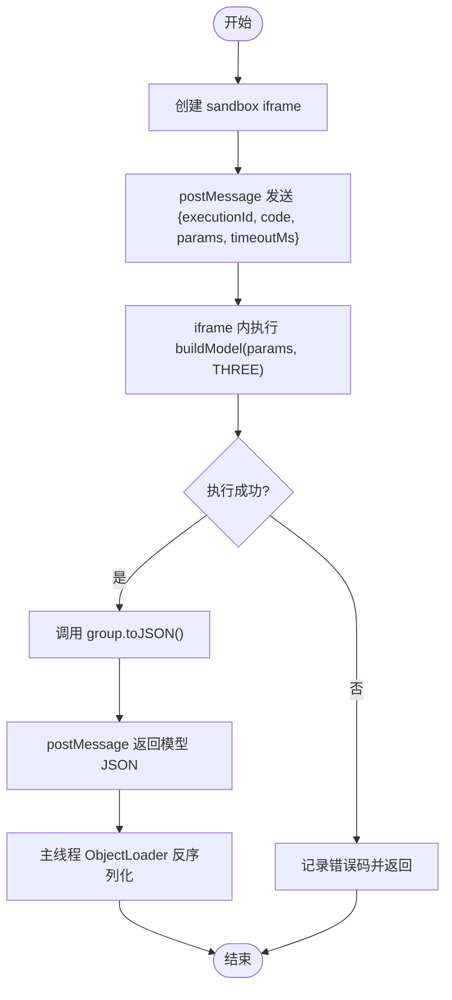
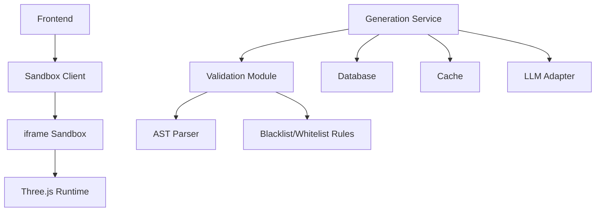

# 安全校验系统

<cite>
**本文引用的文件**
- [产品技术设计文档](file://tech/product-technical-design.md)
- [产品需求文档](file://prd.md)
</cite>

## 目录
1. [引言](#引言)
2. [项目结构](#项目结构)
3. [核心组件](#核心组件)
4. [架构总览](#架构总览)
5. [详细组件分析](#详细组件分析)
6. [依赖关系分析](#依赖关系分析)
7. [性能考量](#性能考量)
8. [故障排查指南](#故障排查指南)
9. [结论](#结论)
10. [附录](#附录)

## 引言
本文件为 ApexForge 的安全校验系统设计文档，聚焦“多层校验机制”的落地方案与策略。目标是在 AI 生成 Three.js 代码的全链路中，通过输出协议校验、文本黑名单、AST 白名单、运行时沙箱隔离、超时销毁与结果校验等多层防线，确保生成代码的安全性、可执行性与模型质量可控。同时明确黑名单 API 类别与 AST 白名单策略，给出配置项建议、性能优化与误报处理机制，帮助工程团队快速实现并持续演进。

## 项目结构
本项目仓库包含产品与技术设计文档，用于指导安全校验系统的整体设计与实施路径。安全校验相关的设计要点集中在技术设计文档的“代码安全校验设计”“沙箱运行时设计”“后端模块划分”等章节，以及产品需求文档中的“前端框架关键实现”“代码执行沙箱”“监控与质量保证”等部分。



图表来源
- [产品技术设计文档:428-470](file://tech/product-technical-design.md#L428-L470)
- [产品技术设计文档:472-518](file://tech/product-technical-design.md#L472-L518)
- [产品需求文档:59-83](file://prd.md#L59-L83)
- [产品需求文档:105-122](file://prd.md#L105-L122)

章节来源
- [产品技术设计文档:428-470](file://tech/product-technical-design.md#L428-L470)
- [产品技术设计文档:472-518](file://tech/product-technical-design.md#L472-L518)
- [产品需求文档:59-83](file://prd.md#L59-L83)
- [产品需求文档:105-122](file://prd.md#L105-L122)

## 核心组件
- 输出协议校验：对 LLM 返回的结构化 JSON（mode、templateId、params、code、explanation、warnings）进行强类型校验，确保字段完整与取值合法。
- 文本黑名单：基于正则与关键词的快速阻断，覆盖动态执行、网络访问、DOM 访问、动态加载、原型污染、计算风险等高危模式。
- AST 白名单：使用解析器构建语法树，仅允许安全语法与 API，限制复杂度（深度、循环层数、Mesh/几何体数量、顶点估算等）。
- 运行时沙箱：在 iframe 中执行生成代码，严格限制权限与上下文，仅暴露受控 API 与 THREE 对象。
- 超时销毁：为每次执行分配 executionId 与 timeoutMs，超时或异常时销毁 iframe，防止死循环阻塞。
- 结果校验：对 group.toJSON() 返回的模型 JSON 进行结构与复杂度检查，结合边界盒与空模型检测，保障渲染可用性与性能。

章节来源
- [产品技术设计文档:428-470](file://tech/product-technical-design.md#L428-L470)
- [产品技术设计文档:472-518](file://tech/product-technical-design.md#L472-L518)
- [产品需求文档:73-83](file://prd.md#L73-L83)
- [产品需求文档:105-122](file://prd.md#L105-L122)

## 架构总览
安全校验贯穿“服务端生成—校验—持久化—前端沙箱执行—结果校验”的完整链路。下图展示从请求到执行的端到端流程，突出校验节点与错误分支。

```mermaid
sequenceDiagram
participant FE as "前端"
participant API as "API 网关"
participant GEN as "生成服务"
participant VAL as "校验服务"
participant DB as "数据库"
participant BOX as "沙箱 iframe"
participant RENDER as "Three.js 渲染"
FE->>API : "POST /api/v1/generations"
API->>GEN : "创建任务"
GEN->>VAL : "输出协议校验 + 黑名单 + AST 白名单"
VAL-->>GEN : "校验报告(通过/失败)"
alt 通过
GEN->>DB : "保存任务与结果"
GEN-->>FE : "返回 code/params"
FE->>BOX : "postMessage execute(executionId, code, params, timeoutMs)"
BOX->>RENDER : "buildModel(params, THREE)"
RENDER-->>BOX : "group.toJSON()"
BOX-->>FE : "模型JSON/错误码"
FE->>FE : "结果校验(结构/复杂度/空模型)"
else 失败
GEN-->>FE : "错误响应(含 details)"
end
```

图表来源
- [产品技术设计文档:361-390](file://tech/product-technical-design.md#L361-L390)
- [产品技术设计文档:428-470](file://tech/product-technical-design.md#L428-L470)
- [产品技术设计文档:472-518](file://tech/product-technical-design.md#L472-L518)

## 详细组件分析

### 输出协议校验
- 目标：确保 LLM 返回符合固定 JSON 协议，避免后续解析与执行阶段出现结构性错误。
- 关键点：
  - 强制字段：mode、templateId（可选）、params、code、explanation、warnings。
  - mode 枚举约束：template | code | hybrid。
  - code 函数签名约定：buildModel(params, THREE)。
  - explanation/warnings 用于审计与提示。
- 配置建议：
  - 字段必填性、枚举值、长度上限、模板 ID 白名单。
  - 版本化协议，支持向后兼容与灰度切换。

章节来源
- [产品技术设计文档:403-418](file://tech/product-technical-design.md#L403-L418)
- [产品技术设计文档:392-402](file://tech/product-technical-design.md#L392-L402)

### 文本黑名单
- 目标：以最小开销快速阻断明显危险代码，降低 AST 解析压力与安全风险。
- 禁止类别与示例：
  - 动态执行：eval、Function、setTimeout/setInterval 字符串参数。
  - 网络访问：fetch、XMLHttpRequest、WebSocket、EventSource、navigator.sendBeacon。
  - DOM 访问：document、window.top、window.parent、localStorage、sessionStorage。
  - 动态加载：import、importScripts、require。
  - 原型污染：__proto__、prototype、constructor 链式异常访问。
  - 计算风险：while(true)、无限递归、过深嵌套循环。
- 配置建议：
  - 规则按类别分组，支持热更新与灰度发布。
  - 提供命中统计与误报反馈入口，定期复盘优化。

章节来源
- [产品技术设计文档:441-451](file://tech/product-technical-design.md#L441-L451)
- [产品需求文档:73-83](file://prd.md#L73-L83)

### AST 白名单策略
- 目标：精确限制 API 与语法复杂度，确保生成的 Three.js 代码安全且可渲染。
- 允许语法与 API：
  - 变量声明、函数声明、对象/数组字面量。
  - 基础数学运算与 Math 白名单方法。
  - new THREE.Group()、基础几何体、基础材质、Mesh、Line 等构造器。
  - group.add()、mesh.position.set()、mesh.rotation.set() 等安全方法。
- 限制策略与阈值：
  - 最大代码长度：MVP 20KB，Beta 可配置。
  - 最大 AST 深度：建议小于 30。
  - 最大循环层数：2。
  - 最大 Mesh 数量：MVP 80，Beta 通过套餐配置。
  - 最大几何体顶点估算：按几何参数预估。
  - 全局变量白名单：THREE、Math、params、安全工具函数。
- 配置建议：
  - 阈值按套餐/租户维度可配。
  - 提供 AST 摘要与违规节点定位，便于调试与回归测试。

章节来源
- [产品技术设计文档:452-469](file://tech/product-technical-design.md#L452-L469)

### 运行时沙箱隔离
- 目标：将 AI 代码在受限环境中执行，避免影响主线程与页面安全。
- 方案要点：
  - 隐藏 iframe，sandbox="allow-scripts"，CSP 仅允许预构建 runtime。
  - 仅暴露 THREE、安全构建函数与 params；禁止同源访问、表单、弹窗、顶级导航。
  - 每次执行分配 executionId 与 timeoutMs，超时未返回则销毁 iframe。
  - 执行成功后调用 group.toJSON()，主线程使用 ObjectLoader 反序列化。
- 错误分类与用户提示：
  - SANDBOX_TIMEOUT：执行超时，提示模型过于复杂。
  - SANDBOX_RUNTIME_ERROR：运行时报错，提示可重试。
  - MODEL_JSON_INVALID：返回结构非法，系统将重新生成。
  - MODEL_TOO_COMPLEX：复杂度超限，建议降级或模板模式。
  - MODEL_EMPTY：未生成有效对象，提示补充描述。



图表来源
- [产品技术设计文档:472-518](file://tech/product-technical-design.md#L472-L518)
- [产品需求文档:105-122](file://prd.md#L105-L122)

章节来源
- [产品技术设计文档:472-518](file://tech/product-technical-design.md#L472-L518)
- [产品需求文档:105-122](file://prd.md#L105-L122)

### 超时销毁
- 目标：防止死循环或长时间阻塞导致浏览器卡顿。
- 机制：
  - 为每次执行设置 timeoutMs，到达时限后主动销毁 iframe 并返回超时错误。
  - 结合错误码 SANDBOX_TIMEOUT 与用户提示，引导降级或重试。
- 配置建议：
  - 默认超时时间可按套餐/设备能力调整。
  - 记录超时原因与耗时分布，用于容量规划与告警。

章节来源
- [产品技术设计文档:472-518](file://tech/product-technical-design.md#L472-L518)

### 结果校验
- 目标：确保模型 JSON 结构正确、复杂度可控、可被渲染。
- 检查项：
  - 结构合法性：Object3D 层级、材质引用、纹理 URL 白名单。
  - 复杂度指标：Mesh 数量、几何体数量、顶点估算、材质数量。
  - 空模型检测：无有效对象或边界盒为空。
  - 自动居中缩放：计算边界盒并适配视角。
- 配置建议：
  - 阈值与套餐绑定，支持动态调整。
  - 记录 metrics 到 quality_scores，形成质量闭环。

章节来源
- [产品技术设计文档:472-518](file://tech/product-technical-design.md#L472-L518)
- [产品技术设计文档:807-840](file://tech/product-technical-design.md#L807-L840)

## 依赖关系分析
- 模块耦合：
  - 生成服务依赖校验服务（协议、黑名单、AST），校验服务依赖解析器与规则引擎。
  - 前端依赖沙箱客户端与 SceneManager，沙箱客户端负责 postMessage 通信与超时控制。
- 外部依赖：
  - LLM 供应商适配器（DeepSeek、Qwen 等）。
  - 存储（SQLite/PostgreSQL、对象存储）。
  - 缓存（Redis）与队列（BullMQ/RabbitMQ/Kafka）。
- 潜在循环依赖：
  - 生成服务与校验服务之间单向依赖，避免双向耦合。
  - 前端与沙箱通过消息接口解耦，不直接共享状态。



图表来源
- [产品技术设计文档:594-610](file://tech/product-technical-design.md#L594-L610)
- [产品技术设计文档:472-518](file://tech/product-technical-design.md#L472-L518)

章节来源
- [产品技术设计文档:594-610](file://tech/product-technical-design.md#L594-L610)
- [产品技术设计文档:472-518](file://tech/product-technical-design.md#L472-L518)

## 性能考量
- 前端优化：
  - 动态加载 Three.js 与沙箱 runtime，降低首屏体积。
  - 模型 JSON 解析放入 Worker，主线程专注渲染挂载。
  - 重复几何体优先 InstancedMesh，远距使用 LOD。
  - 释放旧模型 geometry/material/texture，不可见页暂停渲染循环。
- 后端优化：
  - 相似 Prompt 缓存复用结果，模板模式跳过 LLM 代码生成。
  - 生成任务异步化，避免长连接占用。
  - LLM 并发与熔断控制，热门模板与 Schema 缓存至 Redis。
- 数据库优化：
  - traceId/workspaceId/createdAt 建索引。
  - 大字段迁移至对象存储，仅保存 URL 与摘要。
  - 历史任务按时间归档。

章节来源
- [产品技术设计文档:933-958](file://tech/product-technical-design.md#L933-L958)
- [产品需求文档:155-165](file://prd.md#L155-L165)

## 故障排查指南
- 常见错误码与定位：
  - SANDBOX_TIMEOUT：检查超时配置、模型复杂度与循环层数。
  - SANDBOX_RUNTIME_ERROR：查看 AST 摘要与违规节点，确认全局变量白名单。
  - MODEL_JSON_INVALID：核对 Object3D 层级与材质引用，检查纹理 URL 白名单。
  - MODEL_TOO_COMPLEX：降低 Mesh/几何体数量或启用模板模式。
  - MODEL_EMPTY：补充 Prompt 主体描述，增加 Few-shot 示例。
- 日志与追踪：
  - 全链路 traceId 贯穿前端、网关、生成服务、校验服务、数据库与沙箱执行。
  - 记录耗时、状态、错误码、质量分与复杂度指标，便于回溯与告警。
- 告警规则：
  - 生成失败率过高、LLM 延迟过高、校验失败突增、沙箱超时突增、API 错误率过高。

章节来源
- [产品技术设计文档:508-518](file://tech/product-technical-design.md#L508-L518)
- [产品技术设计文档:868-907](file://tech/product-technical-design.md#L868-L907)

## 结论
ApexForge 的安全校验系统通过“协议—文本—AST—沙箱—超时—结果”的多层防线，兼顾安全性与可用性。建议在 MVP 阶段优先实现黑名单与基础 AST 校验、iframe 沙箱与超时销毁，并在 Beta 阶段引入模板模式、质量评分与可观测体系。通过配置化阈值与误报反馈闭环，持续优化生成质量与用户体验。

## 附录

### 校验规则配置清单（建议）
- 输出协议：
  - 字段必填性、枚举值、长度上限、模板 ID 白名单、版本化协议。
- 黑名单：
  - 按类别分组，支持热更新与灰度发布，命中统计与误报反馈。
- AST 白名单：
  - 允许语法/API 列表、全局变量白名单、复杂度阈值（深度、循环层数、Mesh/几何体数量、顶点估算）。
- 沙箱：
  - sandbox 属性、CSP 白名单、executionId/timeoutMs、错误码映射。
- 结果校验：
  - 结构合法性、复杂度指标、空模型检测、自动居中缩放。

章节来源
- [产品技术设计文档:428-470](file://tech/product-technical-design.md#L428-L470)
- [产品技术设计文档:472-518](file://tech/product-technical-design.md#L472-L518)