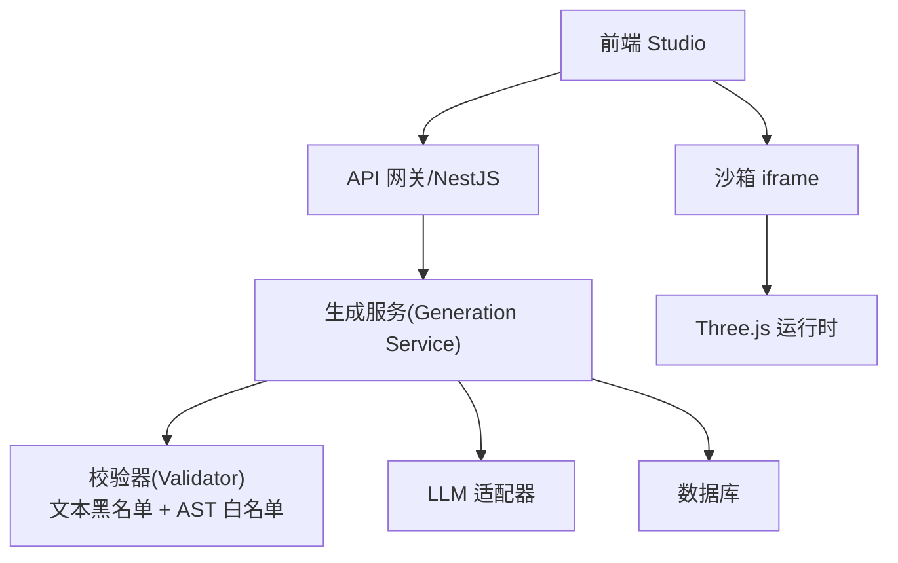
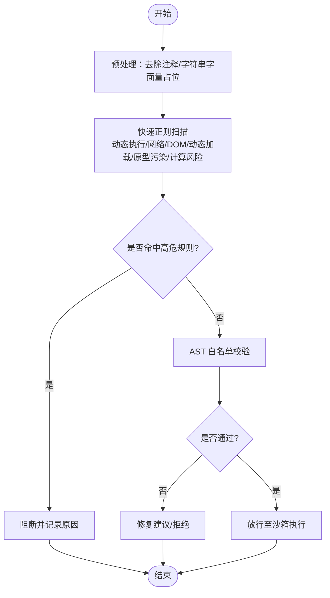
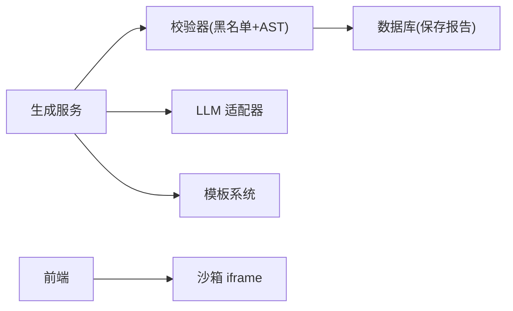

# 文本黑名单校验

<cite>
**本文引用的文件**   
- [prd.md](file://prd.md)
- [product-technical-design.md](file://tech/product-technical-design.md)
</cite>

## 目录
1. [引言](#引言)
2. [项目结构](#项目结构)
3. [核心组件](#核心组件)
4. [架构总览](#架构总览)
5. [详细组件分析](#详细组件分析)
6. [依赖关系分析](#依赖关系分析)
7. [性能考虑](#性能考虑)
8. [故障排查指南](#故障排查指南)
9. [结论](#结论)
10. [附录](#附录)

## 引言
本文件面向 ApexForge 的“文本黑名单校验”子系统，聚焦于在 AI 生成代码进入沙箱执行前，通过快速、可配置的文本匹配策略阻断危险代码。目标是在保证高吞吐与低延迟的前提下，覆盖动态执行 API、网络访问 API、DOM 访问 API、动态加载 API、原型污染攻击以及计算风险等关键威胁面，并提供正则策略、性能优化与误报处理机制，以及完整的配置示例与扩展方法。

## 项目结构
本项目为设计与需求文档仓库，未包含实现代码。以下基于设计文档梳理与黑名单校验相关的模块边界与职责：
- 服务端侧：负责 Prompt/输出协议校验、文本黑名单扫描、AST 白名单校验、质量评分与结果持久化。
- 客户端侧：iframe 沙箱隔离执行、超时销毁、模型序列化与反序列化。
- 模板系统：优先使用可控模板，必要时再自由生成代码，降低黑名单命中概率。



图表来源
- [product-technical-design.md:36-62](file://tech/product-technical-design.md#L36-L62)
- [product-technical-design.md:594-609](file://tech/product-technical-design.md#L594-L609)

章节来源
- [product-technical-design.md:36-62](file://tech/product-technical-design.md#L36-L62)
- [product-technical-design.md:594-609](file://tech/product-technical-design.md#L594-L609)

## 核心组件
- 文本黑名单扫描器：对 LLM 返回的代码进行快速关键词与正则匹配，拦截高危模式。
- AST 白名单校验器：在黑名单之后进行更精确的语法级限制（仅允许安全 API、限制复杂度）。
- 沙箱执行器：在 iframe 中执行并限制能力，配合超时销毁与错误分类。
- 模板匹配器：优先选择模板或参数化渲染，减少自由代码生成带来的风险。
- 质量评分器：结合 AST 指标、沙箱执行结果与用户反馈进行综合评估。

章节来源
- [product-technical-design.md:428-470](file://tech/product-technical-design.md#L428-L470)
- [product-technical-design.md:472-518](file://tech/product-technical-design.md#L472-L518)
- [product-technical-design.md:594-609](file://tech/product-technical-design.md#L594-L609)

## 架构总览
黑名单校验位于“生成链路”的关键节点，承担“快速阻断”的职责，后续由 AST 白名单进一步精细化约束。

```mermaid
sequenceDiagram
participant FE as "前端"
participant API as "API 网关"
participant GEN as "生成服务"
participant LLM as "LLM 适配器"
participant VAL as "校验器(黑名单+AST)"
participant DB as "数据库"
participant BOX as "沙箱 iframe"
FE->>API : "POST /api/v1/generations"
API->>GEN : "创建任务"
GEN->>CACHE : "相似 Prompt 缓存查询"
alt "命中缓存"
CACHE-->>GEN : "复用结果"
else "未命中"
GEN->>LLM : "生成代码/参数"
LLM-->>GEN : "原始输出"
GEN->>VAL : "文本黑名单扫描"
VAL-->>GEN : "阻断/放行"
alt "放行"
GEN->>VAL : "AST 白名单校验"
VAL-->>GEN : "报告/修复建议"
end
end
GEN->>DB : "持久化任务与报告"
GEN-->>API : "返回结果"
API-->>FE : "生成载荷"
FE->>BOX : "在 iframe 中执行"
BOX-->>FE : "模型 JSON 或错误"
```

图表来源
- [product-technical-design.md:361-390](file://tech/product-technical-design.md#L361-L390)
- [product-technical-design.md:594-609](file://tech/product-technical-design.md#L594-L609)

## 详细组件分析

### 文本黑名单规则集
- 动态执行 API
  - 禁止项：eval、Function、setTimeout/setInterval 字符串参数、with 语句等。
  - 检测要点：函数名直接调用、构造器调用、字符串字面量作为定时器参数的组合。
- 网络访问 API
  - 禁止项：fetch、XMLHttpRequest、WebSocket、EventSource、navigator.sendBeacon 等。
  - 检测要点：构造函数调用、全局对象属性访问、new 关键字组合。
- DOM 访问 API
  - 禁止项：document、window.top、window.parent、localStorage、sessionStorage 等。
  - 检测要点：全局对象访问、链式访问、属性赋值。
- 动态加载 API
  - 禁止项：import、importScripts、require 等。
  - 检测要点：关键字出现位置、是否处于字符串内（需避免误报）。
- 原型污染攻击
  - 禁止项：__proto__、prototype、constructor 链式异常访问。
  - 检测要点：属性名匹配、链式访问深度、赋值操作。
- 计算风险代码
  - 禁止项：while(true)、无限递归、过深嵌套循环。
  - 检测要点：条件表达式常量 true、递归调用自身、循环嵌套层数阈值。

章节来源
- [product-technical-design.md:441-451](file://tech/product-technical-design.md#L441-L451)

### 正则表达式匹配策略
- 匹配粒度
  - 词法级：关键字与常见调用形态（如 new Function(...)、fetch(...)）。
  - 上下文级：区分字符串字面量与真实调用（例如注释/字符串中的 eval 不应触发）。
  - 组合级：针对 setTimeout("...") 这类“字符串参数”场景进行联合匹配。
- 性能优化
  - 预编译正则、按类别分组顺序执行（高频类别优先）。
  - 短路策略：一旦命中高危规则立即阻断，减少后续扫描开销。
  - 批量扫描：将多规则合并为一次性扫描，减少多次遍历成本。
- 误报处理
  - 白名单豁免：对受控库函数或模板注入点进行豁免。
  - 二次确认：对疑似但非确定命中的条目，交由 AST 白名单做最终判定。
  - 告警与审计：记录命中详情与上下文片段，便于持续优化规则。

章节来源
- [product-technical-design.md:428-470](file://tech/product-technical-design.md#L428-L470)

### 与 AST 白名单的协同
- 分层校验
  - 第一层：文本黑名单快速阻断明显危险代码。
  - 第二层：AST 白名单精确限制 API、语法和复杂度。
- 白名单允许范围
  - 变量声明、函数声明、对象/数组字面量。
  - 基础数学运算与 Math 白名单方法。
  - 安全的 Three.js 构造器与方法（Group、基础几何体、材质、Mesh、Line 等）。
- 限制策略
  - 最大代码长度、AST 深度、循环层数、Mesh 数量、顶点估算上限。
  - 禁止访问未声明全局变量，仅允许 THREE、Math、params 与安全工具函数。

章节来源
- [product-technical-design.md:452-470](file://tech/product-technical-design.md#L452-L470)

### 沙箱执行与错误分类
- 隔离方案
  - 隐藏 iframe，sandbox="allow-scripts"，CSP 限制脚本来源。
  - 仅暴露 THREE、安全构建函数与 params；结果只允许结构化 JSON。
- 执行流程
  - 主线程发送 { executionId, code, params, timeoutMs }。
  - iframe 包装并执行 buildModel(params, THREE)，成功后 group.toJSON()。
  - 主线程 ObjectLoader 反序列化并自动居中缩放。
  - 超时或异常则销毁 iframe 并返回错误。
- 错误分类
  - SANDBOX_TIMEOUT、SANDBOX_RUNTIME_ERROR、MODEL_JSON_INVALID、MODEL_TOO_COMPLEX、MODEL_EMPTY。

章节来源
- [product-technical-design.md:472-518](file://tech/product-technical-design.md#L472-L518)

### 模板系统与黑名单的关系
- 模板优先策略
  - 优先选择模板或参数化渲染，减少自由代码生成，从而降低黑名单命中概率。
  - 当置信度低于阈值时，再切换 Hybrid 或 Code Mode。
- 模板版本与 Schema
  - 模板版本管理、参数 Schema 定义与默认值，确保生成过程可控。

章节来源
- [product-technical-design.md:760-804](file://tech/product-technical-design.md#L760-L804)

### 流程图：黑名单扫描与决策


图表来源
- [product-technical-design.md:428-470](file://tech/product-technical-design.md#L428-L470)
- [product-technical-design.md:472-518](file://tech/product-technical-design.md#L472-L518)

## 依赖关系分析
- 生成服务依赖校验器进行安全过滤，校验器内部包含文本黑名单与 AST 白名单两个阶段。
- 沙箱执行在前端完成，依赖 iframe 隔离与 postMessage 通信。
- 模板系统作为上游输入，影响黑名单命中率与整体稳定性。



图表来源
- [product-technical-design.md:594-609](file://tech/product-technical-design.md#L594-L609)
- [product-technical-design.md:361-390](file://tech/product-technical-design.md#L361-L390)

章节来源
- [product-technical-design.md:594-609](file://tech/product-technical-design.md#L594-L609)
- [product-technical-design.md:361-390](file://tech/product-technical-design.md#L361-L390)

## 性能考虑
- 正则优化
  - 预编译与分组执行，短路策略，批量扫描减少重复遍历。
  - 对高频类别优先匹配，降低平均耗时。
- 流水线并行
  - 黑名单与 AST 校验串行，但可在不同请求间并行执行。
  - 模板命中可直接跳过 LLM 与校验，显著降低延迟。
- 资源控制
  - 代码长度、AST 深度、循环层数、Mesh 数量等限制，防止复杂度过高导致阻塞。
  - 沙箱超时销毁，避免长时间占用。

章节来源
- [product-technical-design.md:452-470](file://tech/product-technical-design.md#L452-L470)
- [product-technical-design.md:472-518](file://tech/product-technical-design.md#L472-L518)

## 故障排查指南
- 常见问题定位
  - 黑名单误报：检查是否命中字符串/注释中的关键字，调整正则上下文判断与白名单豁免。
  - 沙箱超时：关注模型复杂度与循环嵌套，适当放宽或引导用户使用模板模式。
  - 模型无效：检查 group.toJSON 返回结构与 ObjectLoader 兼容性。
- 错误码参考
  - SANDBOX_TIMEOUT、SANDBOX_RUNTIME_ERROR、MODEL_JSON_INVALID、MODEL_TOO_COMPLEX、MODEL_EMPTY。
- 日志与追踪
  - 每个请求携带 traceId，记录黑名单命中详情、AST 报告与沙箱错误信息，便于回溯。

章节来源
- [product-technical-design.md:472-518](file://tech/product-technical-design.md#L472-L518)
- [product-technical-design.md:868-907](file://tech/product-technical-design.md#L868-L907)

## 结论
ApexForge 的文本黑名单校验以“快速阻断 + 精准校验”的分层策略为核心，结合模板优先与沙箱隔离，有效降低恶意与高风险代码的执行风险。通过合理的正则策略、性能优化与误报处理机制，在保证用户体验的同时提升系统安全性与稳定性。

## 附录

### 黑名单配置示例（概念性）
以下为配置项的结构说明，用于指导实现与运维配置：
- 规则集合
  - dynamic_exec: 动态执行相关规则（eval、Function、定时器字符串参数等）
  - network_api: 网络访问相关规则（fetch、XMLHttpRequest、WebSocket 等）
  - dom_access: DOM 访问相关规则（document、window.top、localStorage 等）
  - dynamic_load: 动态加载相关规则（import、importScripts、require 等）
  - proto_pollution: 原型污染相关规则（__proto__、prototype、constructor 链式访问）
  - compute_risk: 计算风险相关规则（while(true)、无限递归、过深嵌套循环）
- 规则项字段
  - id: 规则唯一标识
  - category: 所属分类
  - pattern: 正则表达式
  - severity: 严重级别（critical/high/medium/low）
  - context_sensitive: 是否启用上下文敏感匹配（区分字符串/注释）
  - whitelist_exemptions: 豁免列表（如特定库函数名）
  - enabled: 是否启用
- 全局开关
  - strict_mode: 严格模式（开启后对疑似模式采取更保守策略）
  - max_code_length: 最大代码长度
  - ast_limits: AST 限制（深度、循环层数、Mesh 数量等）

章节来源
- [product-technical-design.md:428-470](file://tech/product-technical-design.md#L428-L470)

### 扩展方法
- 新增规则
  - 在对应分类下添加新规则项，设置 severity 与 context_sensitive。
  - 若涉及第三方库，加入 whitelist_exemptions 以避免误报。
- 灰度发布
  - 通过 enabled 字段逐步放开新规则，观察命中率与误报率。
  - 结合 traceId 与错误码统计，评估规则效果。
- 回归测试
  - 维护固定 Prompt 集与恶意样本集，定期执行回归，确保规则演进不引入退化。

章节来源
- [product-technical-design.md:428-470](file://tech/product-technical-design.md#L428-L470)
- [prd.md:74-83](file://prd.md#L74-L83)