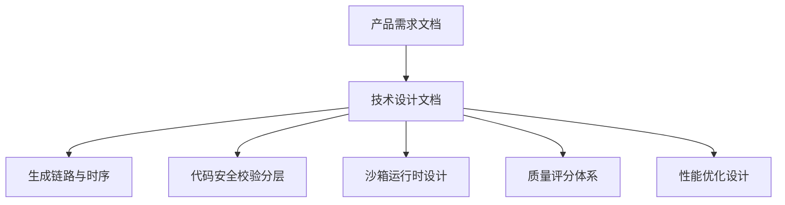
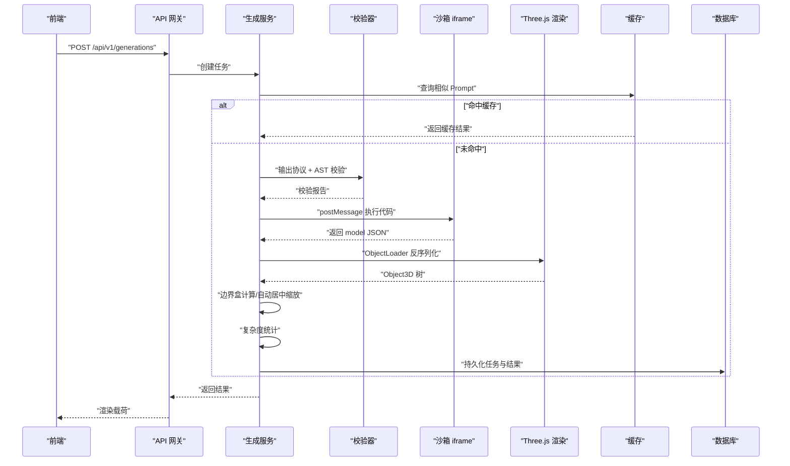
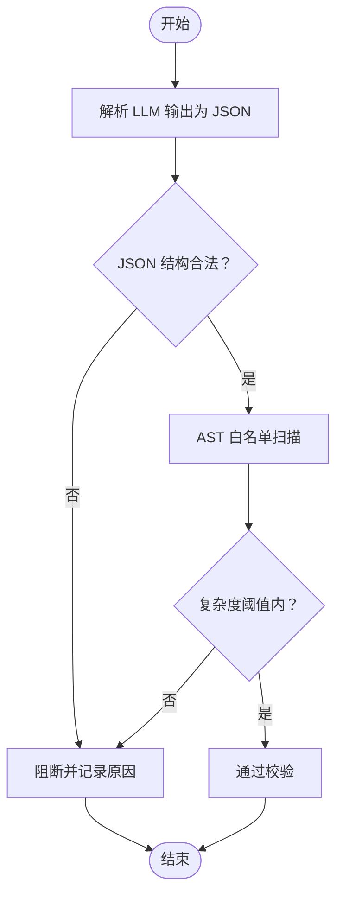
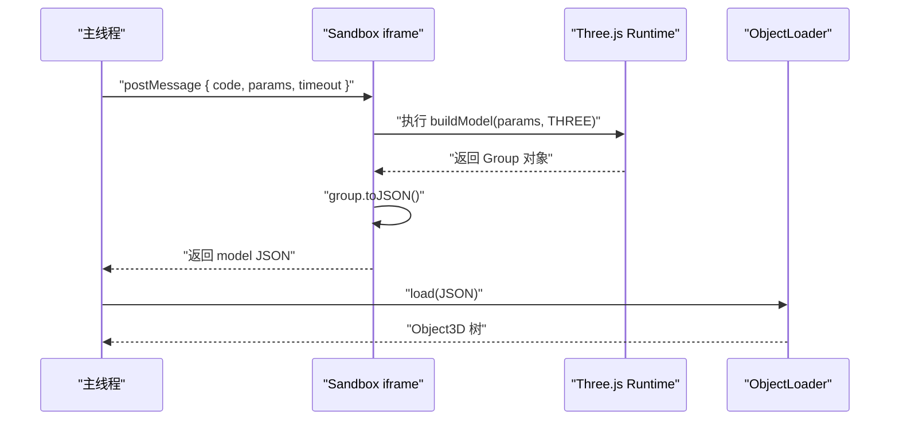
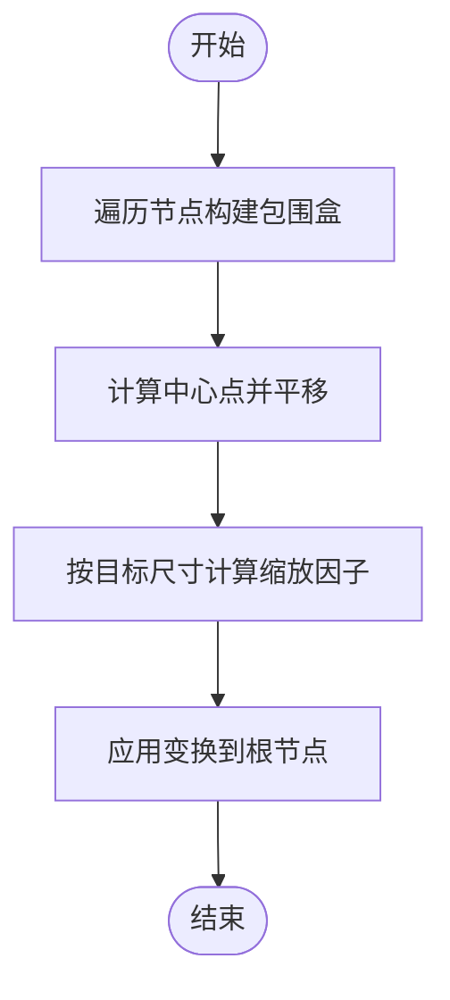
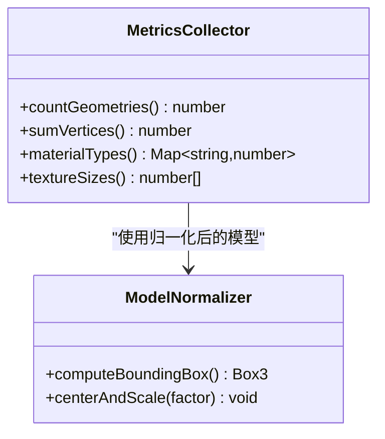
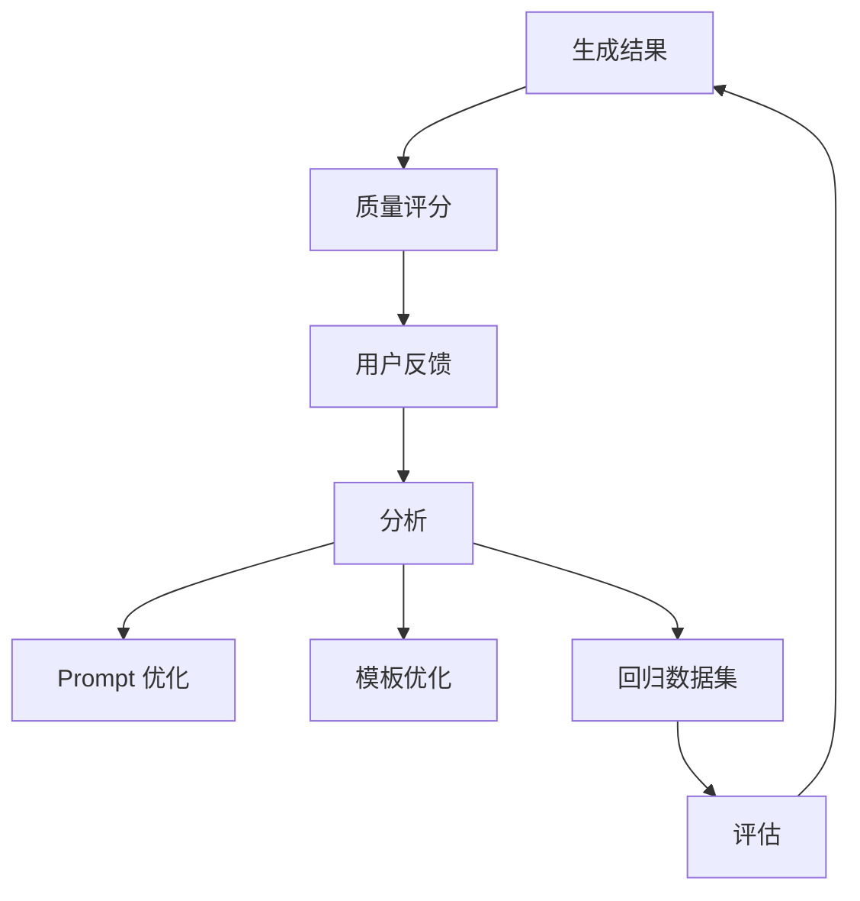
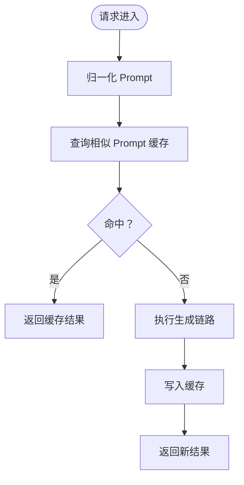
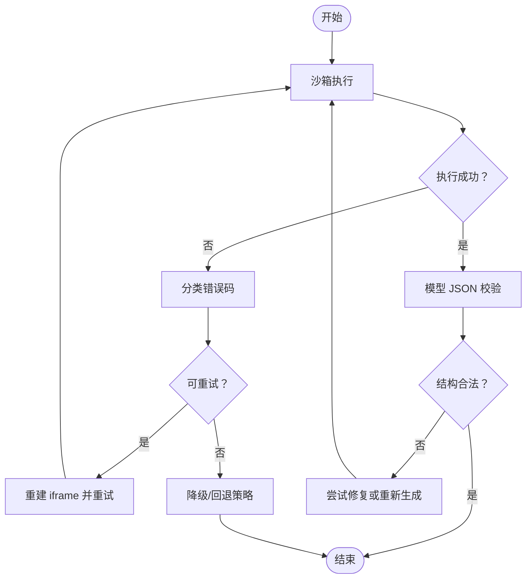
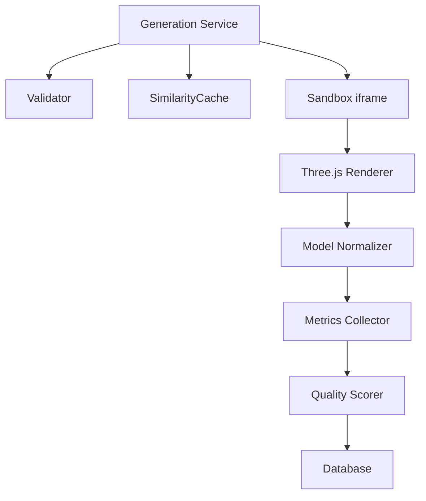

# 结果校验机制

<cite>
**本文引用的文件**   
- [产品需求文档](file://prd.md)
- [产品技术设计文档](file://tech/product-technical-design.md)
</cite>

## 目录
1. [引言](#引言)
2. [项目结构](#项目结构)
3. [核心组件](#核心组件)
4. [架构总览](#架构总览)
5. [详细组件分析](#详细组件分析)
6. [依赖关系分析](#依赖关系分析)
7. [性能考量](#性能考量)
8. [故障排查指南](#故障排查指南)
9. [结论](#结论)
10. [附录](#附录)

## 引言
本文件聚焦 ApexForge 的“结果校验机制”，覆盖客户端与服务端对生成结果的二次验证、模型 JSON 结构校验、Three.js Object3D 序列化数据完整性检查、模型复杂度评估（几何体数量、顶点总数、材质类型、纹理大小）、边界盒计算与自动居中缩放算法、性能指标统计与质量评分关联，以及结果缓存策略、重复检测机制和异常结果处理流程。同时提供可配置项与性能调优建议，帮助工程团队在 MVP 到平台化阶段稳定落地。

## 项目结构
当前仓库包含产品需求与技术设计文档，用于定义系统目标、架构、模块职责与关键流程。结果校验机制贯穿服务端代码安全校验、沙箱执行、前端加载与归一化、质量评分与缓存等链路。

图表来源
- [产品技术设计文档:327-391](file://tech/product-technical-design.md#L327-L391)
- [产品技术设计文档:428-470](file://tech/product-technical-design.md#L428-L470)
- [产品技术设计文档:472-518](file://tech/product-technical-design.md#L472-L518)
- [产品技术设计文档:807-841](file://tech/product-technical-design.md#L807-L841)
- [产品技术设计文档:933-958](file://tech/product-technical-design.md#L933-L958)

章节来源
- [产品需求文档:1-168](file://prd.md#L1-L168)
- [产品技术设计文档:1-1149](file://tech/product-technical-design.md#L1-L1149)

## 核心组件
围绕结果校验的关键组件与职责如下：
- 输出协议校验器：确保 LLM 返回的结构符合固定 JSON 协议，字段完整且类型正确。
- AST 白名单校验器：限制危险 API、语法与复杂度，保障代码安全与可控性。
- 沙箱执行器（iframe）：隔离执行 AI 生成的 Three.js 代码，返回序列化模型数据。
- 模型反序列化工具：使用 ObjectLoader 将 JSON 还原为 Object3D 树。
- 模型归一化器：计算边界盒、自动居中与缩放，保证展示一致性。
- 复杂度评估器：统计几何体数量、顶点总数、材质类型与纹理大小等指标。
- 质量评分器：综合可渲染性、Prompt 匹配度、结构完整性、性能表现与可编辑性打分。
- 缓存与重复检测：基于相似 Prompt 或参数指纹命中缓存，避免重复生成。
- 异常处理与重试：分类错误码、超时销毁、自动修复与降级策略。

章节来源
- [产品技术设计文档:428-470](file://tech/product-technical-design.md#L428-L470)
- [产品技术设计文档:472-518](file://tech/product-technical-design.md#L472-L518)
- [产品技术设计文档:807-841](file://tech/product-technical-design.md#L807-L841)
- [产品技术设计文档:933-958](file://tech/product-technical-design.md#L933-L958)

## 架构总览
结果校验在“生成链路”中承担多重角色：服务端侧进行协议与 AST 校验；客户端侧在 iframe 沙箱执行并返回序列化数据；主线程完成反序列化、归一化与复杂度统计；最终写入质量评分与缓存。

图表来源
- [产品技术设计文档:327-391](file://tech/product-technical-design.md#L327-L391)
- [产品技术设计文档:472-518](file://tech/product-technical-design.md#L472-L518)

## 详细组件分析

### 服务端：输出协议与 AST 校验
- 输出协议校验：要求返回 JSON 包含模式选择、模板 ID、参数对象、可选代码片段与说明，字段结构与类型严格约束。
- AST 白名单：仅允许基础语法、数学运算、受控的 THREE 构造器与安全方法；限制最大代码长度、AST 深度、循环层数、Mesh 数量与顶点估算上限。
- 黑名单扫描：阻断动态执行、网络访问、DOM 访问、动态加载、原型污染与高风险循环。

图表来源
- [产品技术设计文档:428-470](file://tech/product-technical-design.md#L428-L470)

章节来源
- [产品技术设计文档:428-470](file://tech/product-technical-design.md#L428-L470)

### 客户端：沙箱执行与模型反序列化
- iframe 隔离：sandbox 属性与 CSP 限制脚本来源与权限，仅暴露受控全局与构建函数。
- 执行流程：主线程发送执行指令，iframe 执行 buildModel 并调用 group.toJSON() 返回结构化 JSON。
- 反序列化：主线程使用 ObjectLoader 将 JSON 还原为 Object3D 树，挂载至场景。

图表来源
- [产品技术设计文档:472-518](file://tech/product-technical-design.md#L472-L518)

章节来源
- [产品技术设计文档:472-518](file://tech/product-technical-design.md#L472-L518)

### 模型归一化：边界盒计算与自动居中缩放
- 边界盒计算：遍历 Object3D 树，聚合所有 Mesh 的局部包围盒，得到世界坐标下的整体包围盒。
- 自动居中缩放：以包围盒中心为基准平移模型，按最大维度缩放到目标尺寸，保持比例一致。
- 目的：统一展示效果，便于相机适配与后续复杂度统计。

[此图为概念流程图，不直接映射具体源码文件]

章节来源
- [产品技术设计文档:472-518](file://tech/product-technical-design.md#L472-L518)

### 复杂度评估：几何体、顶点、材质与纹理
- 几何体数量：统计 Mesh 实例数量，结合 InstancedMesh 计数逻辑。
- 顶点总数：汇总各几何体的顶点数，必要时根据几何参数估算。
- 材质类型：区分标准物理材质与自定义材质，统计材质种类与复用率。
- 纹理大小：统计纹理分辨率与内存占用，超限则标记警告或降级。

图表来源
- [产品技术设计文档:807-841](file://tech/product-technical-design.md#L807-L841)

章节来源
- [产品技术设计文档:807-841](file://tech/product-technical-design.md#L807-L841)

### 质量评分体系与指标关联
- 评分维度：可渲染性、Prompt 匹配度、结构完整性、性能表现、可编辑性。
- 输入指标：AST 校验结果、几何体数量、顶点数、材质数、沙箱执行状态、边界盒与空模型检测、用户反馈与保存行为。
- 闭环优化：评分驱动 Prompt 与模板优化，建立回归数据集与评估流水线。

图表来源
- [产品技术设计文档:807-841](file://tech/product-technical-design.md#L807-L841)

章节来源
- [产品技术设计文档:807-841](file://tech/product-technical-design.md#L807-L841)

### 结果缓存与重复检测
- 相似 Prompt 缓存：向量相似度高于阈值时直接复用历史结果，降低 LLM 调用成本。
- 模板模式优先：命中模板后仅生成参数，跳过代码生成，显著提升稳定性与速度。
- 缓存键策略：基于 Prompt 归一化文本、模板 ID、参数指纹与版本信息组合。

图表来源
- [产品技术设计文档:327-391](file://tech/product-technical-design.md#L327-L391)
- [产品技术设计文档:933-958](file://tech/product-technical-design.md#L933-L958)

章节来源
- [产品技术设计文档:327-391](file://tech/product-technical-design.md#L327-L391)
- [产品技术设计文档:933-958](file://tech/product-technical-design.md#L933-L958)

### 异常结果处理流程
- 错误分类：沙箱超时、运行时报错、模型 JSON 非法、模型过于复杂、未生成有效对象。
- 处理策略：超时销毁 iframe、自动重试（最多 N 次）、回退到模板模式或降级参数、记录失败日志与 traceId。
- 用户提示：根据错误码给出友好提示与操作建议。

图表来源
- [产品技术设计文档:472-518](file://tech/product-technical-design.md#L472-L518)

章节来源
- [产品技术设计文档:472-518](file://tech/product-technical-design.md#L472-L518)

## 依赖关系分析
结果校验涉及多模块协作：生成服务编排、校验器、沙箱、渲染与缓存。下图展示主要依赖关系。

图表来源
- [产品技术设计文档:594-610](file://tech/product-technical-design.md#L594-L610)
- [产品技术设计文档:472-518](file://tech/product-technical-design.md#L472-L518)
- [产品技术设计文档:807-841](file://tech/product-technical-design.md#L807-L841)

章节来源
- [产品技术设计文档:594-610](file://tech/product-technical-design.md#L594-L610)
- [产品技术设计文档:472-518](file://tech/product-technical-design.md#L472-L518)
- [产品技术设计文档:807-841](file://tech/product-technical-design.md#L807-L841)

## 性能考量
- 前端优化：按需加载 Three.js runtime；大模型解析放入 Worker；旧模型释放 geometry/material/texture；InstancedMesh 批量渲染；LOD 与相机状态解耦。
- 后端优化：相似 Prompt 缓存；模板模式跳过 LLM；异步任务队列；供应商并发与熔断控制；热门模板与 Schema 缓存。
- 数据库优化：索引设计；大字段迁移对象存储；历史任务归档。

章节来源
- [产品技术设计文档:933-958](file://tech/product-technical-design.md#L933-L958)

## 故障排查指南
- 常见错误码与定位：
  - 沙箱超时：检查模型复杂度与执行时间，考虑降级或模板模式。
  - 运行时报错：查看 AST 校验与黑名单规则，确认受限 API 使用情况。
  - 模型 JSON 非法：核对 ObjectLoader 反序列化路径与字段完整性。
  - 模型过于复杂：调整几何体数量与顶点上限，启用 LOD 或 InstancedMesh。
  - 未生成有效对象：补充 Prompt 细节或切换 Hybrid/Code 模式。
- 观测与追踪：
  - 全链路 traceId 贯穿前后端与沙箱执行。
  - 记录耗时、状态、错误码与质量分，便于告警与复盘。

章节来源
- [产品技术设计文档:472-518](file://tech/product-technical-design.md#L472-L518)
- [产品技术设计文档:868-908](file://tech/product-technical-design.md#L868-L908)

## 结论
ApexForge 的结果校验机制通过“服务端协议与 AST 校验 + 客户端沙箱执行 + 模型归一化与复杂度评估 + 质量评分与缓存”的多层协同，确保生成结果的安全、稳定与高质量。配合清晰的错误分类、重试与降级策略，可在 MVP 到平台化阶段持续演进，兼顾性能与用户体验。

## 附录

### 配置选项与调优建议
- 复杂度阈值：
  - 最大 Mesh 数量、最大顶点估算、最大 AST 深度、最大循环层数、最大代码长度。
- 沙箱策略：
  - 执行超时毫秒数、iframe 重建次数、CSP 白名单资源列表。
- 缓存策略：
  - 相似 Prompt 相似度阈值、缓存过期时间、键组成策略（Prompt 归一化 + 模板 ID + 参数指纹）。
- 质量评分权重：
  - 可渲染性、Prompt 匹配度、结构完整性、性能表现、可编辑性的权重分配。
- 性能调优：
  - 前端：Worker 解析、InstancedMesh、LOD、纹理压缩与复用。
  - 后端：Redis 缓存、模板模式优先、异步队列与熔断。

章节来源
- [产品技术设计文档:428-470](file://tech/product-technical-design.md#L428-L470)
- [产品技术设计文档:472-518](file://tech/product-technical-design.md#L472-L518)
- [产品技术设计文档:807-841](file://tech/product-technical-design.md#L807-L841)
- [产品技术设计文档:933-958](file://tech/product-technical-design.md#L933-L958)