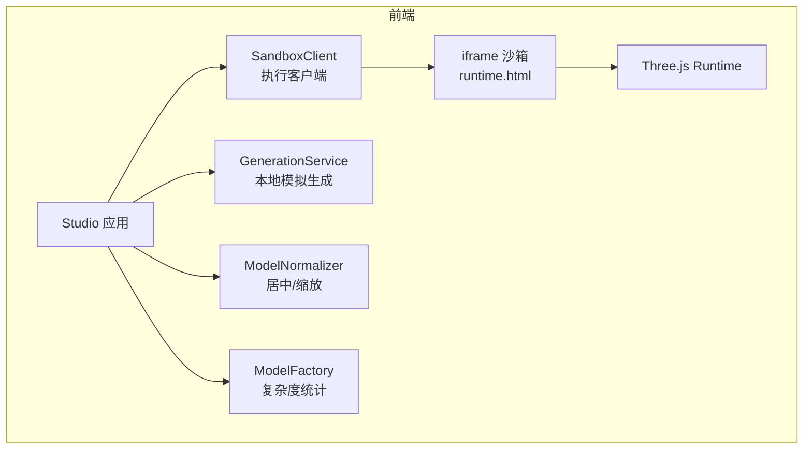
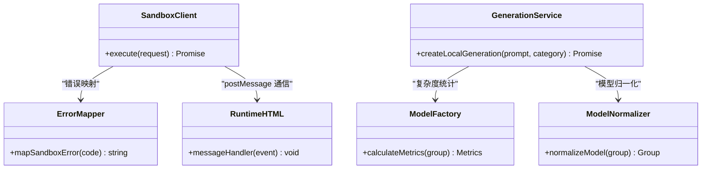

# 超时销毁机制

<cite>
**本文引用的文件列表**
- [产品技术设计文档](file://tech/product-technical-design.md)
- [产品需求文档](file://prd.md)
- [SandboxClient.ts](file://src/modules/sandbox/SandboxClient.ts)
- [errorMapper.ts](file://src/modules/sandbox/errorMapper.ts)
- [runtime.html](file://public/runtime.html)
- [generationService.ts](file://src/modules/studio/services/generationService.ts)
- [modelNormalizer.ts](file://src/modules/viewer/utils/modelNormalizer.ts)
- [modelFactory.ts](file://src/modules/viewer/utils/modelFactory.ts)
</cite>

## 目录
1. [引言](#引言)
2. [项目结构](#项目结构)
3. [核心组件](#核心组件)
4. [架构总览](#架构总览)
5. [详细组件分析](#详细组件分析)
6. [依赖关系分析](#依赖关系分析)
7. [性能与资源管理](#性能与资源管理)
8. [监控指标与告警](#监控指标与告警)
9. [故障排查指南](#故障排查指南)
10. [结论](#结论)

## 引言
本文件聚焦于 ApexForge 的“超时销毁机制”，围绕防止死循环和阻塞执行的超时控制策略，系统阐述执行时间限制配置、iframe 生命周期管理、资源清理机制、超时检测算法、定时器管理、消息队列清理与内存释放。同时给出不同场景下的阈值建议（简单模型、复杂模型、批量生成）、重试策略与用户体验优化方案，并提供可观测性指标与故障排查指引。

## 项目结构
本项目采用前端模块化组织，沙箱执行与错误映射位于独立模块；运行时占位页面用于 iframe 隔离；生成服务负责任务编排与追踪；视图工具提供模型归一化与复杂度统计。



图表来源
- [SandboxClient.ts:1-18](file://src/modules/sandbox/SandboxClient.ts#L1-L18)
- [errorMapper.ts:1-11](file://src/modules/sandbox/errorMapper.ts#L1-L11)
- [runtime.html:1-21](file://public/runtime.html#L1-L21)
- [generationService.ts:1-30](file://src/modules/studio/services/generationService.ts#L1-L30)
- [modelNormalizer.ts:1-15](file://src/modules/viewer/utils/modelNormalizer.ts#L1-L15)
- [modelFactory.ts:1-192](file://src/modules/viewer/utils/modelFactory.ts#L1-L192)

章节来源
- [产品技术设计文档:472-519](file://tech/product-technical-design.md#L472-L519)
- [产品需求文档:105-117](file://prd.md#L105-L117)

## 核心组件
- SandboxClient：封装与 iframe 的通信接口，定义执行请求/结果类型，承载超时控制与错误映射入口。
- errorMapper：统一将内部错误码映射为用户可读提示。
- runtime.html：iframe 运行时代码占位，接收主线程消息并回传状态。
- generationService：本地模拟生成流程，包含 traceId 生成与耗时模拟，便于串联端到端链路。
- modelNormalizer：对加载后的模型进行边界盒计算、居中与等比缩放，避免过大或偏移导致渲染异常。
- modelFactory：按类别创建示例模型，并提供复杂度统计（meshes、vertices、materials、score），为阈值决策提供依据。

章节来源
- [SandboxClient.ts:1-18](file://src/modules/sandbox/SandboxClient.ts#L1-L18)
- [errorMapper.ts:1-11](file://src/modules/sandbox/errorMapper.ts#L1-L11)
- [runtime.html:1-21](file://public/runtime.html#L1-L21)
- [generationService.ts:1-30](file://src/modules/studio/services/generationService.ts#L1-L30)
- [modelNormalizer.ts:1-15](file://src/modules/viewer/utils/modelNormalizer.ts#L1-L15)
- [modelFactory.ts:1-192](file://src/modules/viewer/utils/modelFactory.ts#L1-L192)

## 架构总览
从用户发起生成到模型在沙箱中执行，再到结果返回与渲染，整体时序如下：

```mermaid
sequenceDiagram
participant FE as "前端主进程"
participant GEN as "GenerationService"
participant BOX as "SandboxClient"
participant IF as "iframe 沙箱"
participant RT as "Three.js Runtime"
FE->>GEN : "创建生成任务(含traceId)"
GEN-->>FE : "返回待执行代码/参数"
FE->>BOX : "execute({code, params, timeoutMs})"
BOX->>IF : "postMessage({executionId, code, params, timeoutMs})"
IF->>RT : "包装并执行 buildModel(params, THREE)"
RT-->>IF : "group.toJSON() 序列化结果"
IF-->>BOX : "postMessage({executionId, modelJson})"
BOX-->>FE : "返回执行结果"
FE->>FE : "ObjectLoader 反序列化 + normalizeModel"
```

图表来源
- [product-technical-design.md:359-390](file://tech/product-technical-design.md#L359-L390)
- [product-technical-design.md:498-506](file://tech/product-technical-design.md#L498-L506)
- [SandboxClient.ts:1-18](file://src/modules/sandbox/SandboxClient.ts#L1-L18)
- [runtime.html:1-21](file://public/runtime.html#L1-L21)
- [modelNormalizer.ts:1-15](file://src/modules/viewer/utils/modelNormalizer.ts#L1-L15)

## 详细组件分析

### 1) 超时检测与定时器管理
- 超时输入：SandboxExecuteRequest 支持传入 timeoutMs，作为本次执行的硬性上限。
- 超时判定：当 iframe 未在 timeoutMs 内返回 executionId 对应的结果时，视为超时。
- 定时器策略：
  - 每次执行前创建唯一 executionId，并在主进程维护一个以 executionId 为键的定时器集合。
  - 使用单例调度器集中管理所有活跃定时器，避免重复创建与泄漏。
  - 定时器触发后，立即终止当前执行上下文（见下文“iframe 生命周期管理”）。
- 超时事件：
  - 记录日志与指标（traceId、taskId、timeoutMs、elapsedMs）。
  - 映射错误码 SANDBOX_TIMEOUT，并返回给用户友好提示。

章节来源
- [SandboxClient.ts:1-18](file://src/modules/sandbox/SandboxClient.ts#L1-L18)
- [errorMapper.ts:1-11](file://src/modules/sandbox/errorMapper.ts#L1-L11)
- [product-technical-design.md:498-506](file://tech/product-technical-design.md#L498-L506)

### 2) iframe 生命周期管理
- 创建：每次执行前按需创建隐藏 iframe，设置 sandbox="allow-scripts"，并通过 CSP 仅允许加载预构建 runtime。
- 通信：主进程通过 postMessage 发送 { executionId, code, params, timeoutMs }；iframe 收到后执行 buildModel 并返回 group.toJSON()。
- 销毁：
  - 正常完成：移除 DOM 引用、清空定时器、断开监听，确保无残留引用。
  - 超时或异常：强制销毁 iframe，回收其内存空间，避免阻塞主线程。
- 隔离：iframe 内仅暴露安全 API（THREE、params、安全工具函数），禁止网络与 DOM 访问。

章节来源
- [product-technical-design.md:490-506](file://tech/product-technical-design.md#L490-L506)
- [runtime.html:1-21](file://public/runtime.html#L1-L21)

### 3) 资源清理机制
- 模型对象释放：
  - 卸载旧模型前遍历 dispose geometry、material、texture，避免 GPU/CPU 内存泄漏。
  - 使用 normalizeModel 对模型进行居中与缩放，减少后续渲染异常导致的额外开销。
- 消息队列清理：
  - 针对 pending 的 postMessage 回调，基于 executionId 做去重与失效清理。
  - 在销毁 iframe 时，主动移除 message 监听，防止悬挂回调。
- 定时器清理：
  - 统一由调度器维护，执行结束或超时时必须清除对应定时器。
- 缓存与队列：
  - 若存在批量任务队列，应在超时或失败后及时出队并重试或丢弃，避免堆积。

章节来源
- [modelNormalizer.ts:1-15](file://src/modules/viewer/utils/modelNormalizer.ts#L1-L15)
- [product-technical-design.md:563-571](file://tech/product-technical-design.md#L563-L571)

### 4) 错误分类与用户提示
- 错误码：
  - SANDBOX_TIMEOUT：执行超时，已安全终止。
  - SANDBOX_RUNTIME_ERROR：运行时报错，可重试或降低复杂度。
  - MODEL_JSON_INVALID：返回结构非法，无法加载到场景。
- 用户提示：
  - 根据错误码映射为简洁友好的文案，必要时引导降级模式或简化描述。

章节来源
- [errorMapper.ts:1-11](file://src/modules/sandbox/errorMapper.ts#L1-L11)
- [product-technical-design.md:508-517](file://tech/product-technical-design.md#L508-L517)

### 5) 超时阈值配置与场景建议
- 简单模型（低复杂度）：
  - 建议 timeoutMs：1~3 秒。
  - 适用：furniture、prop 等基础几何体组合。
- 复杂模型（中高复杂度）：
  - 建议 timeoutMs：3~8 秒。
  - 适用：vehicle、architecture、aircraft 等较多 mesh/顶点。
- 批量生成：
  - 建议 timeoutMs：2~5 秒/项，结合并发度与总预算控制。
  - 配合队列与退避重试，避免瞬时峰值导致大面积超时。
- 动态调整：
  - 基于历史成功率与 P95/P99 延迟，自动上调或下调阈值。
  - 结合模型复杂度指标（meshes、vertices、materials、score）进行自适应。

章节来源
- [modelFactory.ts:43-59](file://src/modules/viewer/utils/modelFactory.ts#L43-L59)
- [product-technical-design.md:461-468](file://tech/product-technical-design.md#L461-L468)

### 6) 超时重试策略
- 重试条件：
  - 仅对可恢复错误（如 SANDBOX_RUNTIME_ERROR）启用重试；SANDBOX_TIMEOUT 视场景决定是否重试。
- 重试次数：
  - 默认最多 2 次，指数退避（例如 1s、2s、4s），避免雪崩。
- 降级策略：
  - 连续失败后切换至模板模式或简化模型，保障用户体验。
- 幂等性：
  - 基于 executionId 保证同一请求不重复执行。

章节来源
- [product-technical-design.md:340-357](file://tech/product-technical-design.md#L340-L357)
- [product-technical-design.md:508-517](file://tech/product-technical-design.md#L508-L517)

### 7) 用户体验优化
- 进度反馈：
  - 在生成与执行阶段展示进度条与状态标签，提升感知。
- 渐进式降级：
  - 检测到高复杂度或频繁超时时，主动提示使用模板模式或简化描述。
- 视觉稳定：
  - 使用 normalizeModel 居中与缩放，避免模型过大或偏移影响观感。
- 首屏体验：
  - 动态加载 Three.js 与沙箱 runtime，降低首屏体积。

章节来源
- [generationService.ts:1-30](file://src/modules/studio/services/generationService.ts#L1-L30)
- [modelNormalizer.ts:1-15](file://src/modules/viewer/utils/modelNormalizer.ts#L1-L15)
- [product-technical-design.md:563-571](file://tech/product-technical-design.md#L563-L571)

## 依赖关系分析
- SandboxClient 依赖 errorMapper 进行错误映射。
- runtime.html 作为 iframe 运行时代码占位，被 SandboxClient 通过 postMessage 驱动。
- generationService 提供 traceId 与模拟耗时，便于端到端链路观测。
- modelNormalizer 与 modelFactory 为渲染与复杂度评估提供支持。



图表来源
- [SandboxClient.ts:1-18](file://src/modules/sandbox/SandboxClient.ts#L1-L18)
- [errorMapper.ts:1-11](file://src/modules/sandbox/errorMapper.ts#L1-L11)
- [runtime.html:1-21](file://public/runtime.html#L1-L21)
- [generationService.ts:1-30](file://src/modules/studio/services/generationService.ts#L1-L30)
- [modelNormalizer.ts:1-15](file://src/modules/viewer/utils/modelNormalizer.ts#L1-L15)
- [modelFactory.ts:1-192](file://src/modules/viewer/utils/modelFactory.ts#L1-L192)

## 性能与资源管理
- 渲染性能：
  - 使用 InstancedMesh 批量渲染重复元素，减少 draw call。
  - 在 Worker 中进行模型 JSON 解析，主线程专注渲染挂载。
- 内存管理：
  - 卸载旧模型时务必 dispose geometry/material/texture。
  - 销毁 iframe 后立即移除 DOM 引用与监听，避免悬挂回调。
- 队列与并发：
  - 批量生成时限制并发数，避免浏览器卡顿。
  - 队列项携带 timeoutMs 与重试策略，失败后快速失败或降级。

章节来源
- [product-technical-design.md:563-571](file://tech/product-technical-design.md#L563-L571)

## 监控指标与告警
- Trace 链路：
  - 每个生成请求贯穿 traceId，覆盖前端提交、API Gateway、生成服务、LLM、校验、数据库、沙箱执行。
- 关键指标：
  - 超时率（10 分钟内超过阈值即告警）。
  - 失败率（5 分钟内失败率大于 30% 告警）。
  - LLM 延迟（P95 大于 60 秒告警）。
  - 校验失败突增（10 分钟内翻倍告警）。
  - API 错误率（5xx 比例大于 5% 告警）。
- 日志字段：
  - traceId、userId、workspaceId、taskId、provider、promptVersion、generationMode、latencyMs、status、errorCode、qualityScore。

章节来源
- [product-technical-design.md:868-907](file://tech/product-technical-design.md#L868-L907)

## 故障排查指南
- 常见问题定位步骤：
  1. 检查 traceId 与 taskId，确认请求是否到达沙箱执行阶段。
  2. 查看错误码映射，区分 SANDBOX_TIMEOUT、SANDBOX_RUNTIME_ERROR、MODEL_JSON_INVALID。
  3. 核对 timeoutMs 配置与模型复杂度指标（meshes、vertices、materials、score），判断是否需要调优阈值或降级。
  4. 验证 iframe 生命周期：是否存在未销毁的 iframe 或悬挂监听。
  5. 检查资源清理：旧模型是否正确 dispose，是否存在内存泄漏迹象。
  6. 观察队列与并发：是否存在大量 pending 任务或并发过高导致抖动。
- 快速修复建议：
  - 临时提高 timeoutMs 或切换到模板模式。
  - 清理无效 iframe 与监听，重启沙箱实例。
  - 降低模型复杂度或使用更简单的几何体组合。

章节来源
- [errorMapper.ts:1-11](file://src/modules/sandbox/errorMapper.ts#L1-L11)
- [product-technical-design.md:508-517](file://tech/product-technical-design.md#L508-L517)
- [modelFactory.ts:43-59](file://src/modules/viewer/utils/modelFactory.ts#L43-L59)

## 结论
ApexForge 的超时销毁机制以“严格隔离 + 硬超时 + 完整清理”为核心，通过 iframe 沙箱与统一的错误映射，有效防止死循环与阻塞执行。结合复杂度指标与动态阈值、重试与降级策略，可在保证安全性的前提下提升用户体验与系统稳定性。完善的监控与告警体系为持续优化提供了数据支撑。