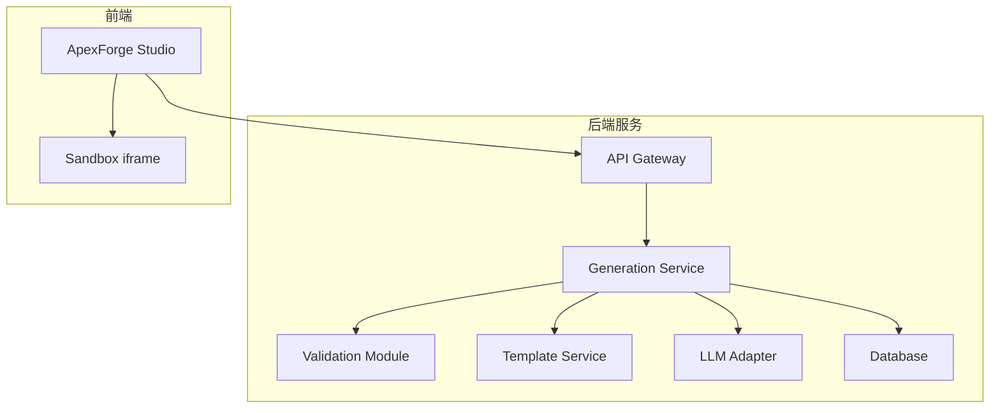
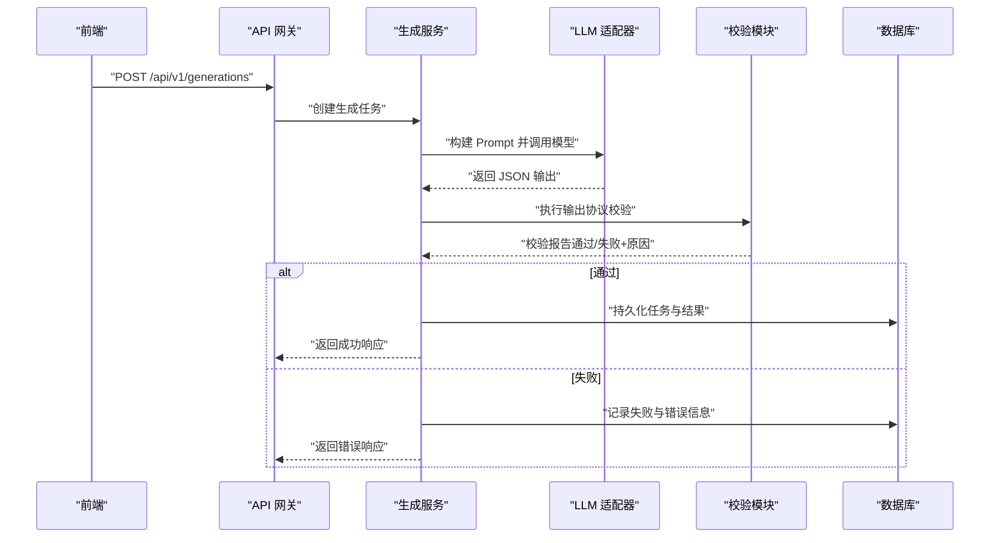
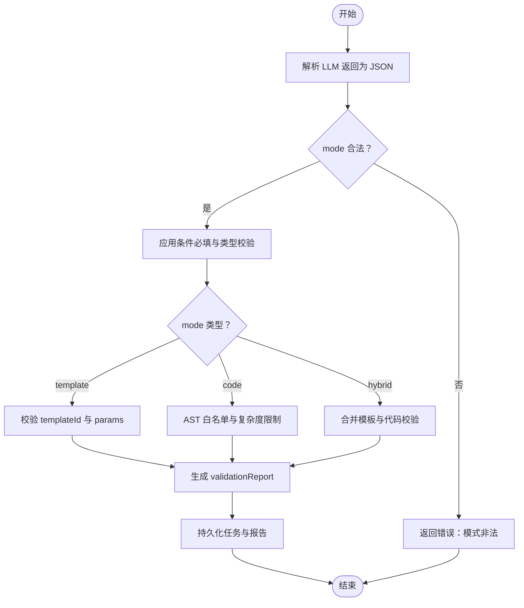
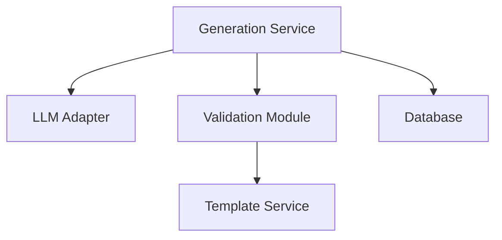

# 输出协议校验

<cite>
**本文引用的文件**   
- [产品技术设计文档](file://tech/product-technical-design.md)
- [产品需求文档](file://prd.md)
</cite>

## 目录
1. [引言](#引言)
2. [项目结构](#项目结构)
3. [核心组件](#核心组件)
4. [架构总览](#架构总览)
5. [详细组件分析](#详细组件分析)
6. [依赖分析](#依赖分析)
7. [性能考虑](#性能考虑)
8. [故障排查指南](#故障排查指南)
9. [结论](#结论)
10. [附录](#附录)

## 引言
本文件面向 ApexForge 服务端，定义并规范“AI 生成结果”的输出协议校验机制。目标包括：
- 明确 mode 字段（template、code、hybrid）的合法性与互斥规则
- 规定必需字段的完整性校验
- 对字段类型与格式进行严格验证
- 针对模板模式、代码模式、混合模式分别给出校验策略
- 提供协议版本兼容处理方案
- 统一错误响应结构与用户友好提示
- 给出 JSON Schema 定义与端到端验证流程示例

## 项目结构
当前仓库包含产品与技术设计文档，未包含后端实现源码。因此，本节仅基于文档内容说明与输出协议校验相关的模块职责与位置，便于后续工程落地时对照实现。

图表来源
- [产品技术设计文档:38-62](file://tech/product-technical-design.md#L38-L62)
- [产品技术设计文档:594-610](file://tech/product-technical-design.md#L594-L610)

章节来源
- [产品技术设计文档:38-62](file://tech/product-technical-design.md#L38-L62)
- [产品技术设计文档:594-610](file://tech/product-technical-design.md#L594-L610)

## 核心组件
围绕输出协议校验的核心组件与职责如下：
- Generation Service：编排生成链路，负责调用 LLM、触发校验、持久化任务与结果
- Validation Module：执行输出协议校验、文本黑名单扫描、AST 白名单校验、复杂度限制
- Template Service：提供模板元数据、参数 Schema、默认参数与渲染函数
- LLM Adapter：对接多模型供应商，返回结构化输出（JSON）
- Database：持久化 generation_tasks、validation_reports、quality_scores 等

章节来源
- [产品技术设计文档:594-610](file://tech/product-technical-design.md#L594-L610)
- [产品技术设计文档:298-324](file://tech/product-technical-design.md#L298-L324)

## 架构总览
下图展示一次生成请求从前端到服务端校验的完整时序，重点标注输出协议校验在链路中的位置。

图表来源
- [产品技术设计文档:361-391](file://tech/product-technical-design.md#L361-L391)
- [产品技术设计文档:632-696](file://tech/product-technical-design.md#L632-L696)

## 详细组件分析

### 输出协议定义与约束
- 根对象必须包含以下字段：
  - mode：枚举值 template | code | hybrid
  - 可选字段：templateId、params、code、explanation、warnings
- 字段类型与格式要求：
  - mode：字符串，且为上述枚举之一
  - templateId：字符串，非空且在模板库中存在对应有效版本
  - params：对象，键值对需满足模板版本的 paramSchema 约束
  - code：字符串，必须符合函数签名约定，且通过 AST 白名单校验
  - explanation：字符串，可选，用于人类可读说明
  - warnings：数组，元素为字符串，用于附加警告信息

章节来源
- [产品技术设计文档:403-417](file://tech/product-technical-design.md#L403-L417)

### 模式合法性检查
- 仅允许三种模式：template、code、hybrid
- 非法模式直接拒绝，返回统一错误结构
- 若 mode 为 auto（客户端侧），应在网关或生成服务路由层转换为具体模式后再进入校验

章节来源
- [产品技术设计文档:403-417](file://tech/product-technical-design.md#L403-L417)
- [产品技术设计文档:632-696](file://tech/product-technical-design.md#L632-L696)

### 模板模式校验（mode=template）
- 必填字段：templateId、params
- templateId 校验：
  - 非空字符串
  - 存在对应模板版本
  - 版本状态为 published
- params 校验：
  - 对象类型
  - 每个键需在模板版本的 paramSchema 中声明
  - 值类型、范围、格式符合 paramSchema 定义（如 color 格式、number 的 min/max）
  - 缺失必填参数应报错；多余参数可忽略或按策略告警
- 组合规则：
  - 当 mode=template 时，code 字段可为空；若存在则应被忽略或标记为冗余

章节来源
- [产品技术设计文档:764-785](file://tech/product-technical-design.md#L764-L785)
- [产品技术设计文档:403-417](file://tech/product-technical-design.md#L403-L417)

### 代码模式校验（mode=code）
- 必填字段：code
- code 函数签名检查：
  - 必须暴露 buildModel(params, THREE) 函数
  - 函数体不得访问危险 API（网络、DOM、动态执行等）
  - 仅允许使用白名单 API（基础几何体、材质、变换方法等）
- AST 白名单校验：
  - 语法树深度、循环嵌套层数、Mesh 数量、顶点估算等指标受控
  - 禁止访问未声明全局变量（除 THREE、Math、params、安全工具函数）
- 长度与复杂度限制：
  - 最大代码长度（MVP 建议 20KB）
  - 最大 AST 深度、循环层数、Mesh 数量等阈值

章节来源
- [产品技术设计文档:428-470](file://tech/product-technical-design.md#L428-L470)
- [产品技术设计文档:403-417](file://tech/product-technical-design.md#L403-L417)

### 混合模式校验（mode=hybrid）
- 必填字段：templateId、params、code
- 组合规则：
  - templateId 与 params 遵循模板模式校验
  - code 遵循代码模式校验，但仅作为局部增强或覆盖片段
  - 最终渲染由模板渲染器与注入代码共同决定
- 冲突处理：
  - 若注入代码修改了模板关键参数，需评估是否破坏模板约束
  - 冲突时应返回警告或阻断，并在 validationReport 中记录

章节来源
- [产品技术设计文档:403-417](file://tech/product-technical-design.md#L403-L417)
- [产品技术设计文档:764-785](file://tech/product-technical-design.md#L764-L785)

### 协议版本兼容性处理
- 每次生成记录保存 promptVersion 与模板版本 ID
- 当模板或 Prompt 版本变更时：
  - 旧任务仍可按其版本上下文解析
  - 新任务采用最新版本，若不兼容则回退或提示升级
- 质量回归测试按 Prompt 版本执行，确保变更可控

章节来源
- [产品技术设计文档:419-425](file://tech/product-technical-design.md#L419-L425)
- [产品技术设计文档:284-296](file://tech/product-technical-design.md#L284-L296)

### 错误响应格式与用户友好提示
- 统一错误结构包含 traceId、error.code、error.message、error.details
- 常见错误码与提示：
  - GENERATION_VALIDATION_FAILED：生成结果未通过安全校验
  - SANDBOX_TIMEOUT：执行超时
  - MODEL_JSON_INVALID：返回结构非法
  - MODEL_TOO_COMPLEX：模型复杂度超限
  - MODEL_EMPTY：未生成有效对象
- details 字段可包含具体校验失败项，便于前端定位问题

章节来源
- [产品技术设计文档:643-652](file://tech/product-technical-design.md#L643-L652)
- [产品技术设计文档:508-517](file://tech/product-technical-design.md#L508-L517)

### JSON Schema 定义与验证流程示例
- 根对象 schema：
  - type: object
  - required: ["mode"]
  - properties:
    - mode: { enum: ["template", "code", "hybrid"] }
    - templateId: { type: "string" }
    - params: { type: "object" }
    - code: { type: "string" }
    - explanation: { type: "string" }
    - warnings: { type: "array", items: { type: "string" } }
- 条件必填：
  - 当 mode=template：required=["templateId","params"]
  - 当 mode=code：required=["code"]
  - 当 mode=hybrid：required=["templateId","params","code"]
- 验证流程：
  1. 解析 LLM 返回为 JSON
  2. 校验根对象 schema 与 mode 枚举
  3. 根据 mode 应用条件必填与字段类型校验
  4. 模板模式加载模板版本，校验 templateId 有效性，按 paramSchema 校验 params
  5. 代码模式执行 AST 白名单与复杂度限制
  6. 混合模式合并模板与代码校验结果
  7. 生成 validationReport 并持久化
  8. 返回成功或错误响应

章节来源
- [产品技术设计文档:403-417](file://tech/product-technical-design.md#L403-L417)
- [产品技术设计文档:764-785](file://tech/product-technical-design.md#L764-L785)
- [产品技术设计文档:298-324](file://tech/product-technical-design.md#L298-L324)

#### 校验流程图

图表来源
- [产品技术设计文档:403-417](file://tech/product-technical-design.md#L403-L417)
- [产品技术设计文档:428-470](file://tech/product-technical-design.md#L428-L470)
- [产品技术设计文档:298-324](file://tech/product-technical-design.md#L298-L324)

## 依赖分析
- Generation Service 依赖 LLM Adapter 获取结构化输出
- Validation Module 依赖 Template Service 获取模板元数据与参数 Schema
- Validation Module 依赖 AST 解析器执行白名单与复杂度限制
- Database 存储 generation_tasks、validation_reports、quality_scores 等

图表来源
- [产品技术设计文档:594-610](file://tech/product-technical-design.md#L594-L610)
- [产品技术设计文档:298-324](file://tech/product-technical-design.md#L298-L324)

章节来源
- [产品技术设计文档:594-610](file://tech/product-technical-design.md#L594-L610)
- [产品技术设计文档:298-324](file://tech/product-technical-design.md#L298-L324)

## 性能考虑
- 模板模式优先，减少 LLM 调用与 AST 校验开销
- 相似 Prompt 缓存命中直接复用结果
- 复杂代码模式增加 AST 解析与复杂度统计成本，需设置合理阈值
- 将大对象解析与计算移至 Worker 或异步队列，避免阻塞主线程

[本节为通用指导，无需引用具体文件]

## 故障排查指南
- 常见问题与定位要点：
  - 模式非法：检查 mode 是否为 template/code/hybrid
  - 模板参数缺失或类型不符：核对 templateId 与 paramSchema
  - 代码模式违规：查看 AST 白名单与黑名单匹配结果
  - 沙箱执行异常：关注运行时错误码与超时
- 日志与追踪：
  - 所有响应携带 traceId
  - 记录 errorCode、errorMessage、details
  - 保存 validationReport 与 qualityScore 以便回溯

章节来源
- [产品技术设计文档:643-652](file://tech/product-technical-design.md#L643-L652)
- [产品技术设计文档:508-517](file://tech/product-technical-design.md#L508-L517)
- [产品技术设计文档:298-324](file://tech/product-technical-design.md#L298-L324)

## 结论
通过严格的输出协议校验与分层安全策略，ApexForge 可在保证生成灵活性的同时，显著提升稳定性与安全性。模板优先、参数化与 AST 白名单的组合，既降低了风险又提升了效率。统一的错误响应与友好的提示有助于快速定位问题与优化用户体验。

[本节为总结性内容，无需引用具体文件]

## 附录

### 模板参数 Schema 示例
- 字段类型与格式：
  - bodyColor：type=string，format=color，default="#111827"
  - bodyLength：type=number，min=2，max=8，default=4.2
- 默认参数与渲染函数：
  - defaultParams：对象，提供默认值
  - renderer：函数，接收 params 与 THREE，返回 Group

章节来源
- [产品技术设计文档:764-785](file://tech/product-technical-design.md#L764-L785)

### 生成任务与校验报告数据模型
- generation_tasks：
  - 关键字段：id、traceId、workspaceId、projectId、userId、mode、status、prompt、templateId、generatedCode、generatedParams、errorCode、errorMessage、startedAt、completedAt、createdAt
- validation_reports：
  - 关键字段：id、generationTaskId、passed、blockedReasons、warnings、complexity、astSummary、createdAt

章节来源
- [产品技术设计文档:215-237](file://tech/product-technical-design.md#L215-L237)
- [产品技术设计文档:298-324](file://tech/product-technical-design.md#L298-L324)