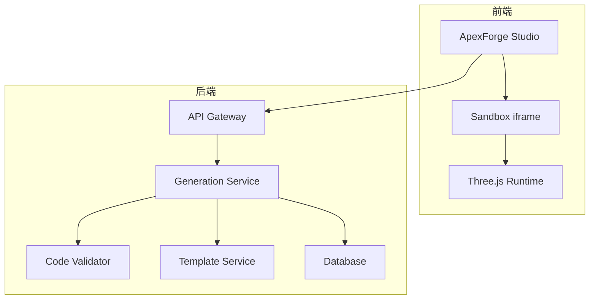
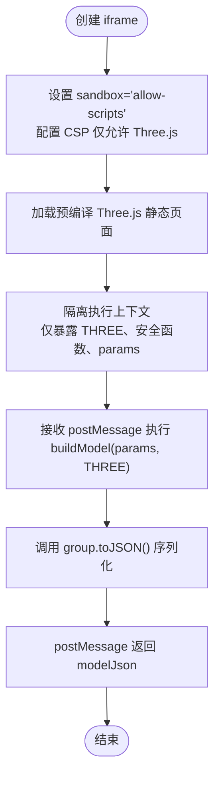
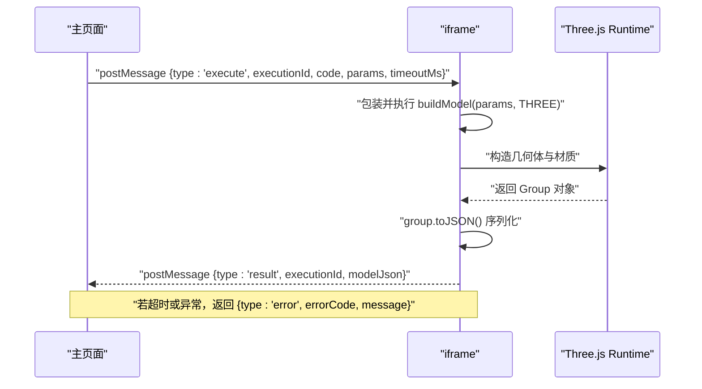
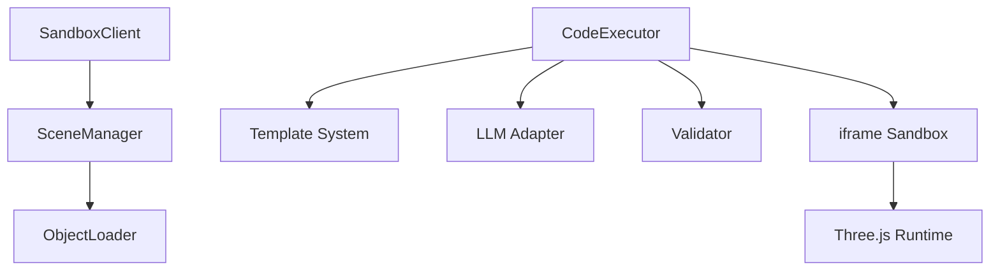

# 运行时沙箱隔离

<cite>
**本文引用的文件**
- [产品需求文档](file://prd.md)
- [产品技术设计文档](file://tech/product-technical-design.md)
</cite>

## 目录
1. [引言](#引言)
2. [项目结构](#项目结构)
3. [核心组件](#核心组件)
4. [架构总览](#架构总览)
5. [详细组件分析](#详细组件分析)
6. [依赖关系分析](#依赖关系分析)
7. [性能考量](#性能考量)
8. [故障排查指南](#故障排查指南)
9. [结论](#结论)
10. [附录](#附录)

## 引言
本章节聚焦于 ApexForge 的“运行时沙箱隔离系统”，围绕 iframe 隔离方案展开，系统性阐述以下要点：
- iframe sandbox 属性与 CSP 配置策略
- 同源访问限制、表单与弹窗禁用
- 主页面与 iframe 的 postMessage 通信协议
- 执行上下文隔离与全局对象暴露控制（THREE、安全构建函数、params）
- 执行超时控制、内存泄漏防护、异常捕获与错误分类
- 沙箱配置最佳实践与安全加固建议

该能力是平台“代码即模型”范式的关键保障，确保 AI 生成的 Three.js 代码在浏览器端安全、稳定地执行与渲染。

## 项目结构
从仓库现有文档可知，ApexForge 采用前后端分离与模块化架构，前端包含 Studio、模板库、资产库等模块；后端以 NestJS 为核心，提供生成编排、校验、模板与资产服务。MVP 阶段推荐单体部署，后续演进为微服务化与云原生架构。



图表来源
- [产品技术设计文档:38-62](file://tech/product-technical-design.md#L38-L62)
- [产品技术设计文档:68-76](file://tech/product-technical-design.md#L68-L76)

章节来源
- [产品技术设计文档:34-101](file://tech/product-technical-design.md#L34-L101)

## 核心组件
- 沙箱客户端（SandboxClient）：负责创建/销毁 iframe、postMessage 通信、超时控制、错误映射与结果校验。
- 场景管理器（SceneManager）：负责初始化 Three.js 场景、加载反序列化后的模型、自动适配视角与资源释放。
- 代码执行器（CodeExecutor）：基于 iframe 隔离执行 AI 生成的 buildModel(params, THREE)，返回可序列化的模型数据。
- 模板与参数系统：通过模板模式降低复杂度与风险，必要时回退到自由代码生成。
- 监控与质量评估：记录 traceId、耗时、失败原因、复杂度指标，形成质量闭环。

章节来源
- [产品需求文档:67-70](file://prd.md#L67-L70)
- [产品需求文档:105-117](file://prd.md#L105-L117)
- [产品技术设计文档:539-571](file://tech/product-technical-design.md#L539-L571)

## 架构总览
下图展示一次完整生成请求中，前端与后端交互以及沙箱执行的端到端流程。

```mermaid
sequenceDiagram
participant U as "用户"
participant FE as "前端(Studio)"
participant API as "API 网关"
participant GEN as "生成服务"
participant VAL as "校验器"
participant BOX as "沙箱 iframe"
participant RT as "Three.js Runtime"
U->>FE : "输入描述并点击生成"
FE->>API : "POST /api/v1/generations"
API->>GEN : "创建任务"
GEN->>VAL : "AST/黑名单校验"
VAL-->>GEN : "校验报告"
GEN-->>API : "返回可执行代码或模板参数"
API-->>FE : "推送生成结果"
FE->>BOX : "postMessage {executionId, code, params, timeoutMs}"
BOX->>RT : "执行 buildModel(params, THREE)"
RT-->>BOX : "group.toJSON() 序列化结果"
BOX-->>FE : "postMessage {executionId, modelJson}"
FE->>FE : "ObjectLoader 反序列化并挂载"
```

图表来源
- [产品技术设计文档:361-390](file://tech/product-technical-design.md#L361-L390)
- [产品技术设计文档:478-488](file://tech/product-technical-design.md#L478-L488)

## 详细组件分析

### iframe 隔离方案与 sandbox/CSP 配置
- 隔离边界
  - 使用隐藏或受控 iframe 作为执行环境，仅加载预编译的 Three.js 静态 runtime，避免引入其他第三方库。
  - 通过 sandbox="allow-scripts" 最小权限原则启用脚本执行，同时禁止网络请求、表单提交、弹窗与顶级导航。
- 内容安全策略（CSP）
  - 仅允许内联脚本与指定 CDN 的 Three.js 资源加载，阻断任意外部脚本注入。
- 同源限制
  - 禁止跨域访问与 window.top/window.parent 穿透，防止逃逸至主页面上下文。
- 执行上下文隔离
  - 仅暴露白名单全局对象：THREE、安全构建函数、params。
  - 禁止访问 DOM、localStorage、sessionStorage、navigator.sendBeacon 等敏感接口。
- 结果约束
  - 只允许返回结构化 JSON（如 group.toJSON），禁止回传函数或 DOM 引用。

章节来源
- [产品需求文档:105-117](file://prd.md#L105-L117)
- [产品技术设计文档:490-496](file://tech/product-technical-design.md#L490-L496)

#### 流程图：iframe 配置与执行入口


图表来源
- [产品技术设计文档:490-506](file://tech/product-technical-design.md#L490-L506)

### postMessage 通信协议
- 消息方向
  - 主页面 -> iframe：发送执行指令，包含 executionId、code、params、timeoutMs。
  - iframe -> 主页面：返回执行结果，包含 executionId、modelJson 或 error。
- 消息体约定
  - 执行请求：{ type: 'execute', executionId, code, params, timeoutMs }
  - 执行结果：{ type: 'result', executionId, modelJson } 或 { type: 'error', executionId, errorCode, message }
- 安全校验
  - 主页面校验 executionId 对应任务状态，拒绝重复或过期消息。
  - 仅接受结构化 JSON，拒绝函数、DOM 引用或 Blob 等非安全类型。
- 并发与幂等
  - 每个执行任务唯一 executionId，支持重试与幂等处理。

章节来源
- [产品需求文档:108-111](file://prd.md#L108-L111)
- [产品技术设计文档:500-506](file://tech/product-technical-design.md#L500-L506)

#### 时序图：postMessage 执行流程


图表来源
- [产品技术设计文档:498-506](file://tech/product-technical-design.md#L498-L506)

### 执行上下文隔离与全局对象暴露控制
- 暴露白名单
  - THREE：受限版本，仅包含基础几何体、材质、Mesh、Group 等必要能力。
  - 安全构建函数：封装安全的几何体与材质构造方法，屏蔽危险 API。
  - params：由主页面传入的参数对象，用于驱动模型变体。
- 禁止访问
  - DOM、window.top、window.parent、document、localStorage、sessionStorage、navigator.sendBeacon。
  - 动态执行：eval、Function、setTimeout/setInterval 字符串参数、import/importScripts/require。
  - 网络访问：fetch、XMLHttpRequest、WebSocket、EventSource。
- 复杂度限制
  - 最大 AST 深度、循环层数、Mesh 数量、顶点估算上限。
  - 代码长度限制（MVP 20KB）。

章节来源
- [产品技术设计文档:452-469](file://tech/product-technical-design.md#L452-L469)
- [产品技术设计文档:490-496](file://tech/product-technical-design.md#L490-L496)

### 执行超时控制与内存泄漏防护
- 超时控制
  - 每次执行分配 executionId 与 timeoutMs，iframe 内启动定时器，超时则主动终止执行并销毁 iframe。
  - 主页面监听超时事件，清理任务状态并返回错误码。
- 内存泄漏防护
  - 旧模型释放时遍历 dispose geometry、material、texture。
  - 使用 requestAnimationFrame 控制渲染循环，页面不可见时暂停。
  - 大模型解析移至 Worker，避免主线程阻塞。
- 异常捕获
  - 捕获运行时报错并分类，返回统一错误结构。
  - 对复杂度过高的模型进行降级提示或拒绝执行。

章节来源
- [产品技术设计文档:500-506](file://tech/product-technical-design.md#L500-L506)
- [产品技术设计文档:563-571](file://tech/product-technical-design.md#L563-L571)

### 异常捕获与错误分类机制
- 错误分类
  - SANDBOX_TIMEOUT：执行超时，提示模型过于复杂已终止渲染。
  - SANDBOX_RUNTIME_ERROR：运行时报错，提示可重试。
  - MODEL_JSON_INVALID：返回结构非法，系统将重新生成。
  - MODEL_TOO_COMPLEX：模型复杂度超限，建议降低细节或使用模板模式。
  - MODEL_EMPTY：未生成有效对象，提示补充描述。
- 错误上报
  - 记录 traceId、errorCode、message、复杂度指标与堆栈摘要。
  - 结合质量评分与用户反馈形成闭环优化。

章节来源
- [产品技术设计文档:508-517](file://tech/product-technical-design.md#L508-L517)

### 沙箱配置最佳实践与安全加固建议
- 最小权限原则
  - sandbox="allow-scripts"，关闭同源、表单、弹窗与顶级导航。
  - CSP 严格限定脚本来源，仅允许预编译 Three.js。
- 白名单与黑名单
  - 服务端 AST 白名单 + 文本黑名单双重校验，阻断危险 API 与语法。
  - 前端沙箱仅暴露必要全局对象，禁止访问 DOM 与存储。
- 复杂度与配额
  - 限制代码长度、AST 深度、循环层数、Mesh 数量与顶点估算。
  - 按套餐或租户维度配置复杂度阈值与并发任务数。
- 可观测与回归
  - 全链路 traceId、耗时、失败原因、复杂度统计。
  - 建立固定 Prompt 集进行回归测试，持续评估生成成功率与质量分。

章节来源
- [产品技术设计文档:428-470](file://tech/product-technical-design.md#L428-L470)
- [产品技术设计文档:908-931](file://tech/product-technical-design.md#L908-L931)

## 依赖关系分析
- 组件耦合
  - SandboxClient 依赖 SceneManager 完成模型加载与视图适配。
  - CodeExecutor 依赖模板系统与 LLM Adapter 产出可执行代码或参数。
  - 校验器与质量评分贯穿生成链路，影响沙箱执行策略。
- 外部依赖
  - Three.js 静态 runtime 作为唯一外部依赖，通过 CSP 与 sandbox 强化隔离。
  - 可选 Worker 用于模型 JSON 解析与复杂度分析，提升主线程性能。



图表来源
- [产品技术设计文档:539-571](file://tech/product-technical-design.md#L539-L571)
- [产品技术设计文档:478-488](file://tech/product-technical-design.md#L478-L488)

章节来源
- [产品技术设计文档:539-571](file://tech/product-technical-design.md#L539-L571)

## 性能考量
- 前端优化
  - 动态加载 Three.js 与沙箱 runtime，降低首屏体积。
  - 模型 JSON 解析放入 Worker，主线程只做渲染挂载。
  - 对重复几何体优先使用 InstancedMesh，减少 draw call。
  - 加载前统计复杂度，超过阈值提示降级。
  - 释放旧模型时必须遍历 dispose geometry、material、texture。
  - 使用 requestAnimationFrame 控制渲染循环，页面不可见时暂停。
- 后端优化
  - 相似 Prompt 缓存，向量相似度大于阈值时复用结果。
  - 模板模式跳过 LLM 代码生成，改为参数生成。
  - 生成任务异步化，避免 HTTP 长连接占用。
  - LLM 供应商并发与熔断控制。
  - 热门模板与参数 Schema 缓存在 Redis。

章节来源
- [产品技术设计文档:563-571](file://tech/product-technical-design.md#L563-L571)
- [产品技术设计文档:933-958](file://tech/product-technical-design.md#L933-L958)

## 故障排查指南
- 常见问题定位
  - 执行超时：检查 timeoutMs 配置与模型复杂度，适当降低 Mesh 数量或切换模板模式。
  - 运行时报错：查看错误码与堆栈摘要，确认是否触发了黑名单 API 或语法限制。
  - 模型为空或无效：验证返回 JSON 结构是否符合预期，检查是否成功调用 group.toJSON()。
  - 内存泄漏：确认旧模型是否正确释放 geometry、material、texture。
- 日志与追踪
  - 使用 traceId 串联前后端与沙箱执行链路。
  - 记录 errorCode、message、复杂度指标与耗时，便于快速定位问题。
- 回归与测试
  - 建立固定 Prompt 集，覆盖车辆、建筑、飞行器、道具与边界恶意输入。
  - 每次调整 Prompt、模板或模型供应商后执行回归，比较成功率与质量分。

章节来源
- [产品技术设计文档:508-517](file://tech/product-technical-design.md#L508-L517)
- [产品技术设计文档:868-907](file://tech/product-technical-design.md#L868-L907)
- [产品技术设计文档:1064-1075](file://tech/product-technical-design.md#L1064-L1075)

## 结论
ApexForge 的运行时沙箱隔离系统以 iframe 为核心，结合 sandbox 与 CSP 实现强隔离，配合严格的白名单/黑名单与复杂度限制，确保 AI 生成的 Three.js 代码在浏览器端安全、稳定地执行与渲染。通过 postMessage 通信协议、执行超时控制、内存泄漏防护与完善的错误分类机制，平台能够在保证用户体验的同时，有效抵御潜在安全风险。未来可进一步将模型解析与复杂度分析下沉至 Worker，并结合模板与参数化体系持续提升生成质量与性能。

## 附录
- 关键术语
  - 沙箱：隔离执行环境，限制代码对宿主页面的访问能力。
  - CSP：内容安全策略，通过响应头限制资源加载与脚本执行来源。
  - postMessage：跨窗口/跨源通信机制，用于主页面与 iframe 的安全消息传递。
  - ObjectLoader：Three.js 提供的反序列化加载器，用于将 JSON 还原为场景对象。
- 参考路径
  - 沙箱运行时设计：[产品技术设计文档:472-517](file://tech/product-technical-design.md#L472-L517)
  - 前端架构与服务：[产品技术设计文档:520-571](file://tech/product-technical-design.md#L520-L571)
  - 安全与合规：[产品技术设计文档:910-931](file://tech/product-technical-design.md#L910-L931)