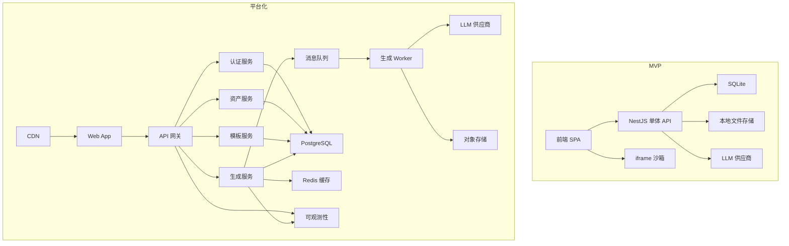
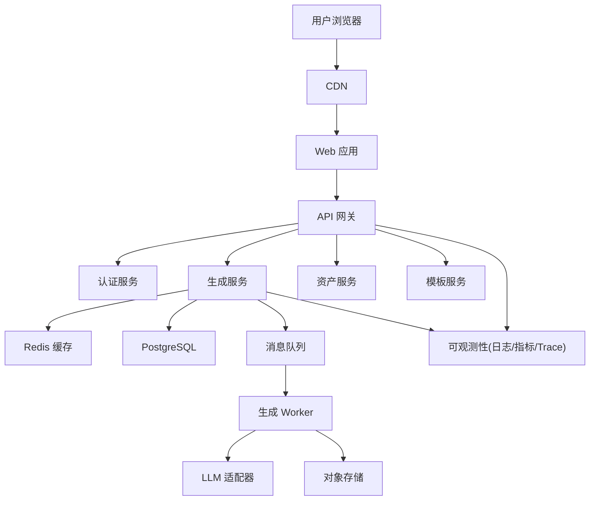
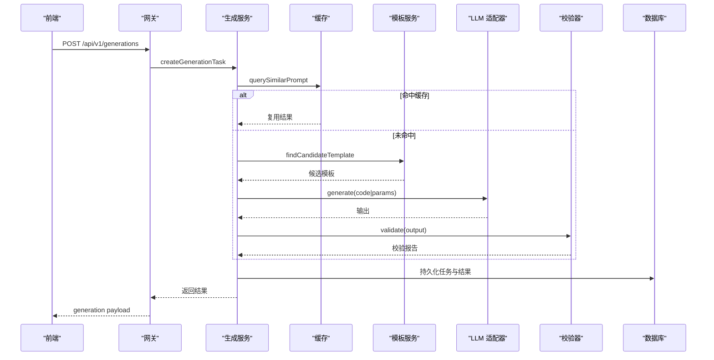
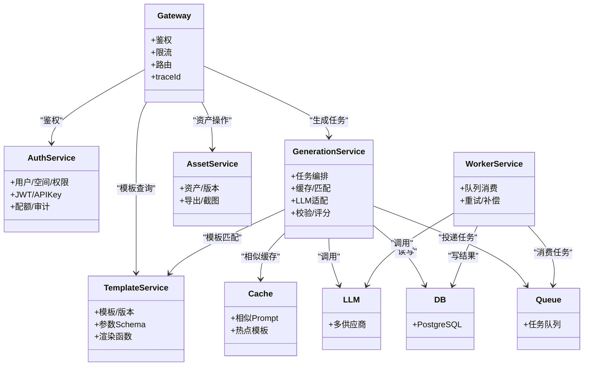
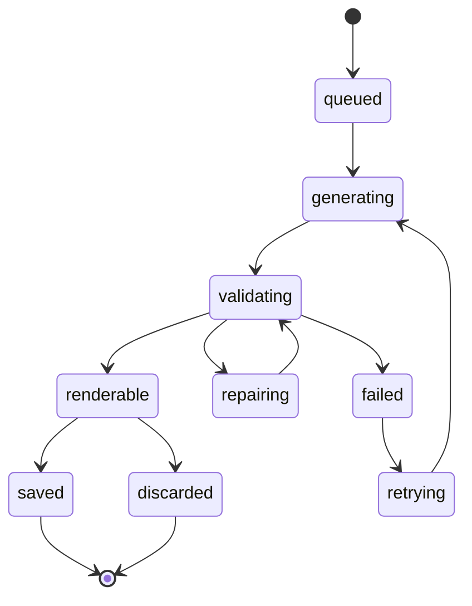

# 微服务演进策略

<cite>
**本文引用的文件**   
- [产品技术设计文档](file://tech/product-technical-design.md)
- [产品需求文档](file://prd.md)
</cite>

## 目录
1. [引言](#引言)
2. [项目结构](#项目结构)
3. [核心组件](#核心组件)
4. [架构总览](#架构总览)
5. [详细组件分析](#详细组件分析)
6. [依赖关系分析](#依赖关系分析)
7. [性能与容量规划](#性能与容量规划)
8. [故障排查指南](#故障排查指南)
9. [结论](#结论)
10. [附录](#附录)

## 引言
本文件面向 ApexForge 从 MVP 单体到平台化微服务的平滑演进，给出可落地的演进路径与工程实践。重点覆盖：
- 服务拆分边界定义
- 服务间通信协议设计
- 消息队列集成方案
- 分布式缓存策略
- 统一网关设计
- 各微服务职责（认证授权、模型生成、资产管理、模板服务、异步任务处理）
- 服务发现、负载均衡、熔断降级、链路追踪与监控告警
- 部署拓扑与容量规划建议

## 项目结构
仓库当前包含两份关键设计文档，用于指导从 MVP 到平台化的整体设计与落地计划。MVP 阶段采用单体后端加模块化代码结构；平台化阶段拆分为多服务并引入网关、队列、缓存与对象存储等基础设施。

图示来源
- [产品技术设计文档:34-100](file://tech/product-technical-design.md#L34-L100)

章节来源
- [产品技术设计文档:64-100](file://tech/product-technical-design.md#L64-L100)
- [产品需求文档:33-54](file://prd.md#L33-L54)

## 核心组件
- 统一网关：对外暴露 REST/SSE/WebSocket，负责鉴权、限流、路由、traceId 透传、错误归一化。
- 认证服务：用户/工作空间/角色权限、JWT、API Key、配额与审计日志。
- 模板服务：模板与版本管理、参数 Schema、示例 Prompt、渲染函数与校验规则。
- 生成服务：生成编排、相似 Prompt 缓存、模板匹配、Prompt 构建、LLM 适配、输出解析、安全校验、质量评分、结果持久化。
- 资产服务：模型资产与版本管理、截图与导出链接、标签与元数据。
- 异步任务处理（Worker）：从队列消费生成任务，执行 LLM 调用、校验、评分与结果落库。
- 可观测性：日志、指标、链路追踪与告警。

章节来源
- [产品技术设计文档:574-630](file://tech/product-technical-design.md#L574-L630)
- [产品技术设计文档:868-908](file://tech/product-technical-design.md#L868-L908)

## 架构总览
平台化目标架构强调“网关 + 领域微服务 + 队列 + 缓存 + 对象存储 + 可观测性”的组合，保证高可用与可扩展。

图示来源
- [产品技术设计文档:82-100](file://tech/product-technical-design.md#L82-L100)

章节来源
- [产品技术设计文档:82-100](file://tech/product-technical-design.md#L82-L100)

## 详细组件分析

### 统一网关设计
- 职责
  - 统一入口、鉴权与限流、请求路由、traceId 注入与透传、错误码归一化、SSE/WebSocket 代理。
- 关键能力
  - JWT 与 API Key 双通道鉴权
  - 令牌桶/滑动窗口限流
  - 灰度与蓝绿路由（按 header 或权重）
  - 熔断与超时控制（下游服务不可用时快速失败）
  - 全链路 traceId 贯穿
- 接口规范
  - Base URL 前缀 /api/v1
  - 响应体包含 traceId
  - 统一错误结构

章节来源
- [产品技术设计文档:632-657](file://tech/product-technical-design.md#L632-L657)
- [产品技术设计文档:734-757](file://tech/product-technical-design.md#L734-L757)

### 认证服务（Auth Service）
- 职责
  - 用户与工作空间管理、RBAC 权限、JWT 签发与刷新、API Key 管理与配额、审计日志。
- 能力
  - 登录/注册、密码策略、会话管理
  - 基于工作空间的资源访问控制
  - 开放平台 API Key 绑定租户与配额
- 数据
  - users、workspaces、projects、audit_log 等表由该服务维护

章节来源
- [产品技术设计文档:178-214](file://tech/product-technical-design.md#L178-L214)
- [产品技术设计文档:844-866](file://tech/product-technical-design.md#L844-L866)

### 模板服务（Template Service）
- 职责
  - 模板与版本管理、参数 Schema、默认参数、渲染函数、示例 Prompt、校验规则、发布与回滚。
- 能力
  - 模板检索与候选推荐
  - 参数校验与表单动态生成
  - 模板命中统计与覆盖率分析
- 数据
  - templates、template_versions 表

章节来源
- [产品技术设计文档:270-297](file://tech/product-technical-design.md#L270-L297)
- [产品技术设计文档:760-804](file://tech/product-technical-design.md#L760-L804)

### 生成服务（Generation Service）
- 职责
  - 生成任务编排、相似 Prompt 缓存、模板匹配、Prompt 构建、LLM 适配、输出解析、安全校验、质量评分、结果持久化。
- 内部结构
  - Controller -> Service -> Cache/Router -> TemplateMatcher/PromptBuilder -> LlmAdapter -> OutputParser -> Validator -> RepairService -> QualityScorer -> Repository
- 模式优先级
  - 缓存优先，其次模板模式，再混合模式，最后自由代码模式
- 状态机
  - queued -> generating -> validating -> renderable/saved/failed/repairing/retrying

图示来源
- [产品技术设计文档:361-390](file://tech/product-technical-design.md#L361-L390)
- [产品技术设计文档:594-610](file://tech/product-technical-design.md#L594-L610)

章节来源
- [产品技术设计文档:327-390](file://tech/product-technical-design.md#L327-L390)
- [产品技术设计文档:594-630](file://tech/product-technical-design.md#L594-L630)

### 资产服务（Asset Service）
- 职责
  - 模型资产与版本管理、缩略图与导出链接、标签与元数据、可见性与分享。
- 能力
  - 将成功生成的任务保存为资产与版本
  - 查询资产及其历史版本、截图与指标
- 数据
  - model_assets、model_versions 表

章节来源
- [产品技术设计文档:238-269](file://tech/product-technical-design.md#L238-L269)
- [产品技术设计文档:704-723](file://tech/product-technical-design.md#L704-L723)

### 异步任务处理（Worker Service）
- 职责
  - 从消息队列消费生成任务，执行 LLM 调用、校验、评分与结果落库，支持重试与退避。
- 能力
  - 并发拉取与幂等处理
  - 失败重试、死信队列、任务补偿
  - 指标上报与链路追踪透传
- 与生成服务协作
  - 生成服务创建任务并投递队列
  - Worker 完成处理后更新任务状态与结果

章节来源
- [产品技术设计文档:82-100](file://tech/product-technical-design.md#L82-L100)
- [产品技术设计文档:988-998](file://tech/product-technical-design.md#L988-L998)

### 安全与沙箱（前后端协同）
- 服务端
  - 输出协议校验、文本黑名单、AST 白名单、复杂度限制
- 客户端
  - iframe 隔离、CSP、postMessage 通信、超时销毁、结果 JSON 校验
- 错误分类
  - 超时、运行时报错、模型 JSON 非法、复杂度超限、空模型等

章节来源
- [产品技术设计文档:428-470](file://tech/product-technical-design.md#L428-L470)
- [产品技术设计文档:472-518](file://tech/product-technical-design.md#L472-L518)

## 依赖关系分析

图示来源
- [产品技术设计文档:574-630](file://tech/product-technical-design.md#L574-L630)
- [产品技术设计文档:82-100](file://tech/product-technical-design.md#L82-L100)

章节来源
- [产品技术设计文档:574-630](file://tech/product-technical-design.md#L574-L630)

## 性能与容量规划

### 服务拆分与边界
- 以领域边界划分服务：认证、模板、生成、资产、Worker。
- 生成服务内聚 Prompt 编排、LLM 适配、校验与评分；模板服务专注模板与参数；资产服务专注资产与版本。

### 服务间通信协议
- 同步：REST（JSON），统一错误结构与 traceId。
- 异步：消息队列（BullMQ/RabbitMQ/Kafka），任务幂等与重试。
- 实时：SSE/WebSocket（事件推送）。

### 消息队列集成方案
- 使用队列承载生成任务，解耦 HTTP 长耗时流程。
- 支持重试、退避、死信队列与补偿任务。
- 在任务中携带 traceId、userId、workspaceId、taskId 等上下文。

### 分布式缓存策略
- Redis 缓存相似 Prompt 结果、热门模板与参数 Schema、任务状态与限流计数。
- 设置合理 TTL 与失效策略，避免脏读。

### 统一网关设计要点
- 鉴权、限流、路由、traceId 透传、错误归一化、SSE/WebSocket 代理。
- 对下游服务配置熔断与超时，避免雪崩。

### 服务发现与负载均衡
- 容器化部署时通过 K8s Service 或服务网格实现服务发现与负载均衡。
- 网关层做健康检查与流量分发。

### 熔断与降级
- 对 LLM 供应商与外部依赖启用熔断与快速失败。
- 降级策略：优先模板模式与缓存命中，必要时返回友好提示。

### 链路追踪与监控告警
- 全链路 traceId 贯穿前端、网关、各服务、LLM、数据库与沙箱。
- 指标：成功率、P95/P99 延迟、错误率、队列积压、LLM 成本与 Token 用量。
- 告警：失败率突增、延迟过高、校验失败突增、沙箱超时突增、API 错误率过高等。

章节来源
- [产品技术设计文档:868-908](file://tech/product-technical-design.md#L868-L908)
- [产品技术设计文档:933-958](file://tech/product-technical-design.md#L933-L958)
- [产品技术设计文档:988-998](file://tech/product-technical-design.md#L988-L998)

### 部署拓扑与容量规划建议
- 分层部署
  - 前端静态资源走 CDN
  - 网关独立部署，水平扩容
  - 各微服务按域独立部署，Pod/实例数按 QPS 与 CPU/内存峰值评估
  - 队列与缓存独立集群，具备主备与分区
  - 数据库主从与备份恢复机制
- 容量规划
  - 根据峰值 QPS、平均响应时间、并发任务数估算实例数
  - 队列消费者按任务吞吐与 LLM 并发上限计算
  - 缓存命中率目标 > 70%，热点键分片与过期策略
  - 对象存储按体积增长预留带宽与 IOPS
- 弹性伸缩
  - 基于 CPU/内存/队列长度触发 HPA
  - 冷启动优化与连接池预热

章节来源
- [产品技术设计文档:82-100](file://tech/product-technical-design.md#L82-L100)
- [产品技术设计文档:933-958](file://tech/product-technical-design.md#L933-L958)

## 故障排查指南
- 常见问题定位
  - 生成失败率高：检查 LLM 供应商可用性、熔断阈值、重试次数与退避策略
  - 校验失败突增：审查 AST 白名单与黑名单变更、Prompt 版本与模板匹配
  - 沙箱超时突增：关注模型复杂度阈值、iframe 超时配置与资源释放
  - API 错误率过高：查看网关限流、鉴权失败、下游服务健康状态
- 可观测性抓手
  - 通过 traceId 串联全链路日志与指标
  - 结合质量评分与用户反馈定位问题根因
  - 建立回归测试集，持续验证 Prompt、模板与模型选择策略

章节来源
- [产品技术设计文档:898-908](file://tech/product-technical-design.md#L898-L908)
- [产品技术设计文档:807-841](file://tech/product-technical-design.md#L807-L841)

## 结论
ApexForge 的演进路径应遵循“先稳后快、先内聚后拆分”的原则：MVP 用单体快速验证核心价值，Beta 阶段沉淀模板与质量闭环，Scale 阶段按领域拆分微服务并引入网关、队列、缓存与可观测性体系。通过清晰的边界、稳定的协议与完善的治理机制，确保系统在高并发与复杂业务场景下的可靠性与可扩展性。

## 附录

### 生成任务状态机

图示来源
- [产品技术设计文档:342-357](file://tech/product-technical-design.md#L342-L357)

### 质量评分体系
- 维度：可渲染性、Prompt 匹配度、结构完整性、性能表现、可编辑性
- 输入：生成模式、AST 校验、几何指标、沙箱执行结果、用户反馈
- 闭环：评分驱动 Prompt 与模板优化，形成回归数据集与评估流程

章节来源
- [产品技术设计文档:807-841](file://tech/product-technical-design.md#L807-L841)