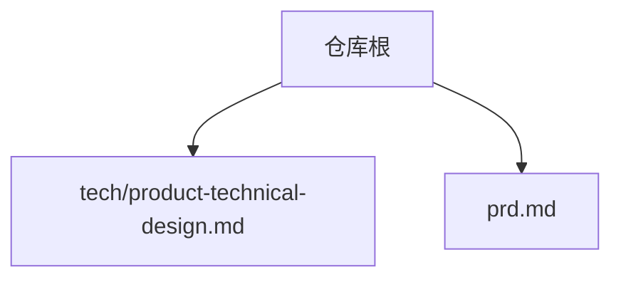
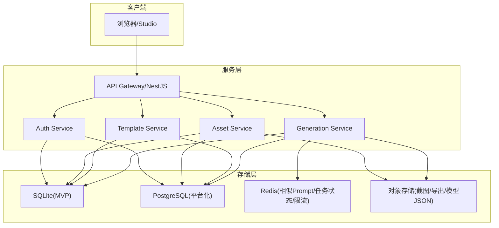
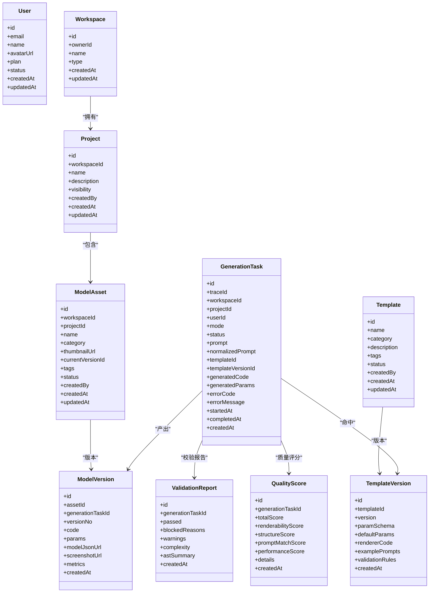
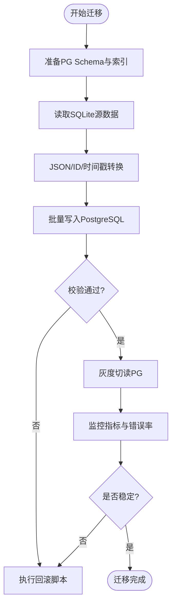
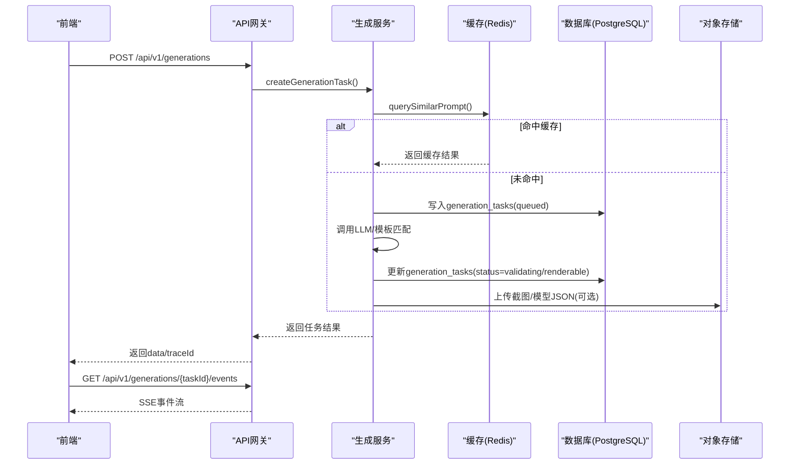
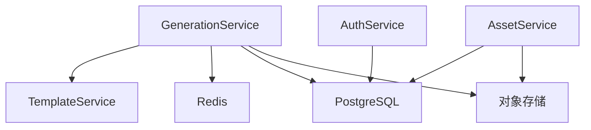

# 数据存储设计

<cite>
**本文引用的文件**
- [产品技术设计文档](file://tech/product-technical-design.md)
- [产品需求文档](file://prd.md)
</cite>

## 目录
1. [引言](#引言)
2. [项目结构](#项目结构)
3. [核心组件](#核心组件)
4. [架构总览](#架构总览)
5. [详细组件分析](#详细组件分析)
6. [依赖关系分析](#依赖关系分析)
7. [性能与优化](#性能与优化)
8. [故障排查指南](#故障排查指南)
9. [结论](#结论)
10. [附录](#附录)

## 引言
本文件面向 ApexForge 的数据存储设计与演进，覆盖从 MVP（SQLite）到平台化（PostgreSQL）的迁移策略、ORM 抽象层设计、ID 策略（UUID/CUID）、JSON 字段兼容处理、迁移脚本设计；并给出核心数据表结构定义、索引策略与约束关系；同时补充数据访问模式、缓存策略、备份恢复方案与性能优化技巧。目标是帮助团队在保持业务连续性的前提下，平滑完成数据库升级与扩展。

## 项目结构
仓库当前包含两份关键设计文档：
- 产品技术设计文档：定义了总体架构、MVP/平台化技术选型、领域模型、数据模型、生成链路、后端模块划分、API 规范、模板系统、安全与沙箱、性能优化等。
- 产品需求文档：明确了平台目标、前端渲染范式、AI 生成流程、代码执行沙箱、监控与质量保证、性能优化要点等。



**图表来源**
- [产品技术设计文档:1-120](file://tech/product-technical-design.md#L1-L120)
- [产品需求文档:1-60](file://prd.md#L1-L60)

**章节来源**
- [产品技术设计文档:1-120](file://tech/product-technical-design.md#L1-L120)
- [产品需求文档:1-60](file://prd.md#L1-L60)

## 核心组件
围绕数据存储的核心组件包括：
- ORM 抽象层：统一 Repository/Prisma/TypeORM 访问，屏蔽 SQLite/PostgreSQL 差异。
- ID 生成器：全局采用 UUID 或 CUID，避免自增主键带来的迁移风险。
- JSON 适配层：SQLite 以 TEXT 存储 JSON，PostgreSQL 使用 JSONB，通过 ORM 类型映射保证一致性。
- 迁移工具：Beta 阶段提供从 SQLite 到 PostgreSQL 的增量迁移脚本，确保历史数据可导入。
- 索引与约束：按查询热点建立复合索引，外键约束保障引用完整性。
- 对象存储集成：大字段（代码、模型 JSON、截图）落盘至对象存储，仅保留 URL 与摘要。

**章节来源**
- [产品技术设计文档:122-129](file://tech/product-technical-design.md#L122-L129)
- [产品技术设计文档:952-958](file://tech/product-technical-design.md#L952-L958)

## 架构总览
下图展示从用户请求到持久化的整体数据流，以及 SQLite 到 PostgreSQL 的演进路径。



**图表来源**
- [产品技术设计文档:64-101](file://tech/product-technical-design.md#L64-L101)
- [产品技术设计文档:104-131](file://tech/product-technical-design.md#L104-L131)

## 详细组件分析

### 1) 从 SQLite 到 PostgreSQL 的演进策略
- 统一 ORM 抽象：所有数据访问通过 Repository 或 Prisma/TypeORM，避免手写方言 SQL。
- ID 策略：全部采用 UUID 或 CUID，不依赖 SQLite 自增特性，便于跨库迁移。
- JSON 兼容：SQLite 使用 TEXT 存储 JSON，PostgreSQL 使用 JSONB；通过 ORM 类型映射与序列化/反序列化中间件屏蔽差异。
- 迁移脚本：Beta 阶段提供迁移脚本，将历史生成记录、模板和资产导入 PostgreSQL，支持幂等与断点续跑。
- 灰度切换：双写期并行写入 SQLite 与 PostgreSQL，逐步切读，验证一致性与性能后完全切换。

**章节来源**
- [产品技术设计文档:122-129](file://tech/product-technical-design.md#L122-L129)

### 2) ORM 抽象层设计
- 分层职责
  - Domain Model：领域实体（User、Workspace、Project、GenerationTask、ModelAsset、ModelVersion、Template、TemplateVersion、ValidationReport、QualityScore）。
  - Repository 接口：定义 CRUD 与复杂查询契约。
  - 实现层：SQLite/PostgreSQL 两套实现，由 ORM 驱动。
  - 适配器：JSON 字段读写适配器，自动处理 TEXT/JSONB 差异。
- 事务与重试：对关键写操作封装事务边界，结合指数退避重试。
- 审计与软删除：为需要审计的实体增加 createdAt/updatedAt 与 isDeleted 标记。



**图表来源**
- [产品技术设计文档:178-324](file://tech/product-technical-design.md#L178-L324)

### 3) ID 策略（UUID/CUID）
- 全表主键采用 UUID 或 CUID，避免自增 ID 在不同数据库间的差异。
- 对外暴露 ID 时统一前缀（如 user_、proj_、gen_），便于调试与追踪。
- 关联查询通过外键约束保证一致性，索引覆盖常用过滤条件。

**章节来源**
- [产品技术设计文档:122-129](file://tech/product-technical-design.md#L122-L129)

### 4) JSON 字段兼容性处理
- SQLite：JSON 字段以 TEXT 存储，应用层负责序列化/反序列化。
- PostgreSQL：JSON 字段使用 JSONB，支持索引与查询优化。
- ORM 层提供 JSON 适配器，屏蔽差异；迁移脚本在导入时进行格式校验与转换。

**章节来源**
- [产品技术设计文档:122-129](file://tech/product-technical-design.md#L122-L129)

### 5) 迁移脚本设计
- 阶段一：Schema 准备
  - 在 PostgreSQL 创建目标表结构与索引。
- 阶段二：数据迁移
  - 读取 SQLite 源数据，逐表转换并批量插入 PG。
  - 对 JSON 字段进行规范化（TEXT→JSONB）。
  - 对 ID 进行一致性校验（UUID/CUID）。
- 阶段三：校验与回滚
  - 统计行数、抽样比对关键字段。
  - 失败则触发回滚脚本，清理已写入数据。
- 阶段四：灰度切读
  - 先切读 PG，观察错误率与延迟，再切写。



[此图为概念流程图，无需“图表来源”]

### 6) 核心数据表结构、索引与约束

#### 6.1 users
- 字段定义：id、email、name、avatarUrl、plan、status、createdAt、updatedAt
- 索引建议：email 唯一索引；status 普通索引
- 约束：email 非空且唯一；status 枚举值限制

**章节来源**
- [产品技术设计文档:178-190](file://tech/product-technical-design.md#L178-L190)

#### 6.2 workspaces
- 字段定义：id、ownerId、name、type、createdAt、updatedAt
- 索引建议：ownerId 索引；type 普通索引
- 约束：ownerId 外键指向 users.id；type 枚举值限制

**章节来源**
- [产品技术设计文档:191-201](file://tech/product-technical-design.md#L191-L201)

#### 6.3 projects
- 字段定义：id、workspaceId、name、description、visibility、createdBy、createdAt、updatedAt
- 索引建议：workspaceId 索引；visibility 普通索引
- 约束：workspaceId 外键指向 workspaces.id；visibility 枚举值限制

**章节来源**
- [产品技术设计文档:202-214](file://tech/product-technical-design.md#L202-L214)

#### 6.4 generation_tasks
- 字段定义：id、traceId、workspaceId、projectId、userId、mode、status、prompt、normalizedPrompt、templateId、templateVersionId、generatedCode、generatedParams、errorCode、errorMessage、startedAt、completedAt、createdAt
- 索引建议：traceId 唯一索引；workspaceId+projectId 复合索引；status 索引；createdAt 索引
- 约束：workspaceId/projectId/userId/templateId/templateVersionId 外键；status 枚举值限制；generatedParams 为 JSON

**章节来源**
- [产品技术设计文档:215-237](file://tech/product-technical-design.md#L215-L237)

#### 6.5 model_assets
- 字段定义：id、workspaceId、projectId、name、category、thumbnailUrl、currentVersionId、tags、status、createdBy、createdAt、updatedAt
- 索引建议：workspaceId+projectId 复合索引；status 索引；updatedAt 索引
- 约束：workspaceId/projectId/currentVersionId 外键；tags 为 JSON；status 枚举值限制

**章节来源**
- [产品技术设计文档:238-254](file://tech/product-technical-design.md#L238-L254)

#### 6.6 model_versions
- 字段定义：id、assetId、generationTaskId、versionNo、code、params、modelJsonUrl、screenshotUrl、metrics、createdAt
- 索引建议：assetId 索引；generationTaskId 索引；versionNo 联合 assetId 唯一索引
- 约束：assetId/generationTaskId 外键；params/metrics 为 JSON；code 为大文本

**章节来源**
- [产品技术设计文档:255-269](file://tech/product-technical-design.md#L255-L269)

#### 6.7 templates
- 字段定义：id、name、category、description、tags、status、createdBy、createdAt、updatedAt
- 索引建议：category 索引；status 索引
- 约束：tags 为 JSON；status 枚举值限制

**章节来源**
- [产品技术设计文档:270-283](file://tech/product-technical-design.md#L270-L283)

#### 6.8 template_versions
- 字段定义：id、templateId、version、paramSchema、defaultParams、rendererCode、examplePrompts、validationRules、createdAt
- 索引建议：templateId+version 唯一索引
- 约束：templateId 外键；paramSchema/defaultParams/examplePrompts/validationRules 为 JSON；rendererCode 为大文本

**章节来源**
- [产品技术设计文档:284-297](file://tech/product-technical-design.md#L284-L297)

#### 6.9 validation_reports
- 字段定义：id、generationTaskId、passed、blockedReasons、warnings、complexity、astSummary、createdAt
- 索引建议：generationTaskId 唯一索引；passed 索引
- 约束：generationTaskId 外键；blockedReasons/warnings/complexity/astSummary 为 JSON

**章节来源**
- [产品技术设计文档:298-310](file://tech/product-technical-design.md#L298-L310)

#### 6.10 quality_scores
- 字段定义：id、generationTaskId、totalScore、renderabilityScore、structureScore、promptMatchScore、performanceScore、details、createdAt
- 索引建议：generationTaskId 唯一索引；totalScore 索引
- 约束：generationTaskId 外键；details 为 JSON

**章节来源**
- [产品技术设计文档:311-324](file://tech/product-technical-design.md#L311-L324)

### 7) ER 关系图
```mermaid
erDiagram
USERS {
string id PK
string email UK
string name
string avatarUrl
string plan
string status
datetime createdAt
datetime updatedAt
}
WORKSPACES {
string id PK
string ownerId FK
string name
string type
datetime createdAt
datetime updatedAt
}
PROJECTS {
string id PK
string workspaceId FK
string name
text description
string visibility
string createdBy
datetime createdAt
datetime updatedAt
}
GENERATION_TASKS {
string id PK
string traceId UK
string workspaceId FK
string projectId FK
string userId FK
string mode
string status
text prompt
text normalizedPrompt
string templateId
string templateVersionId
text generatedCode
json generatedParams
string errorCode
text errorMessage
datetime startedAt
datetime completedAt
datetime createdAt
}
MODEL_ASSETS {
string id PK
string workspaceId FK
string projectId FK
string name
string category
string thumbnailUrl
string currentVersionId FK
json tags
string status
string createdBy
datetime createdAt
datetime updatedAt
}
MODEL_VERSIONS {
string id PK
string assetId FK
string generationTaskId FK
number versionNo
text code
json params
string modelJsonUrl
string screenshotUrl
json metrics
datetime createdAt
}
TEMPLATES {
string id PK
string name
string category
text description
json tags
string status
string createdBy
datetime createdAt
datetime updatedAt
}
TEMPLATE_VERSIONS {
string id PK
string templateId FK
string version
json paramSchema
json defaultParams
text rendererCode
json examplePrompts
json validationRules
datetime createdAt
}
VALIDATION_REPORTS {
string id PK
string generationTaskId FK UK
boolean passed
json blockedReasons
json warnings
json complexity
json astSummary
datetime createdAt
}
QUALITY_SCORES {
string id PK
string generationTaskId FK UK
number totalScore
number renderabilityScore
number structureScore
number promptMatchScore
number performanceScore
json details
datetime createdAt
}
WORKSPACES ||--o{ PROJECTS : "拥有"
PROJECTS ||--o{ MODEL_ASSETS : "包含"
MODEL_ASSETS ||--o{ MODEL_VERSIONS : "版本"
GENERATION_TASKS ||--|| VALIDATION_REPORTS : "产生"
GENERATION_TASKS ||--|| QUALITY_SCORES : "评分"
GENERATION_TASKS ||--o{ MODEL_VERSIONS : "产出"
TEMPLATES ||--o{ TEMPLATE_VERSIONS : "版本"
GENERATION_TASKS ||--|| TEMPLATE_VERSIONS : "命中"
```

**图表来源**
- [产品技术设计文档:178-324](file://tech/product-technical-design.md#L178-L324)

### 8) 数据访问模式
- 同步写：创建任务、保存资产、发布模板版本等强一致写操作。
- 异步读：列表分页、详情查询、历史记录浏览等。
- 事件驱动：生成任务状态变更通过 SSE/WebSocket 推送前端。
- 缓存优先：相似 Prompt 结果复用、热门模板与参数 Schema 缓存。



**图表来源**
- [产品技术设计文档:359-391](file://tech/product-technical-design.md#L359-L391)
- [产品技术设计文档:734-757](file://tech/product-technical-design.md#L734-L757)

### 9) 缓存策略
- 相似 Prompt 缓存：向量相似度阈值命中直接复用生成结果，降低 LLM 调用成本。
- 任务状态缓存：队列中任务状态短期缓存，减少频繁轮询。
- 模板与参数 Schema 缓存：热模板常驻 Redis，加速匹配与渲染。
- 限流与配额：基于用户/空间维度的令牌桶限流，防止滥用。

**章节来源**
- [产品技术设计文档:114-116](file://tech/product-technical-design.md#L114-L116)
- [产品技术设计文档:944-951](file://tech/product-technical-design.md#L944-L951)

### 10) 备份与恢复方案
- 全量备份：每日定时快照（PostgreSQL pg_dump 或云厂商快照）。
- 增量备份：WAL 归档与时间点恢复（PITR）。
- 对象存储备份：截图、模型 JSON、导出文件独立备份策略。
- 恢复演练：定期演练恢复流程，验证 RPO/RTO 达标。
- 迁移回滚：迁移失败时快速回滚至 SQLite 或旧 PG 实例。

[本节为通用实践说明，无需“章节来源”]

### 11) 性能优化技巧
- 数据库索引：按查询热点建复合索引，如 generation_tasks.traceId/workspaceId/createdAt、model_assets.workspaceId/projectId/updatedAt。
- 大字段分离：代码、模型 JSON、截图迁移至对象存储，仅保留 URL 与摘要。
- 历史归档：按时间归档冷数据，提升热表性能。
- 连接池与超时：合理配置连接池大小与超时，避免长事务阻塞。
- 分库分表：当单表超千万级时，考虑按 workspaceId 或时间维度拆分。

**章节来源**
- [产品技术设计文档:952-958](file://tech/product-technical-design.md#L952-L958)

## 依赖关系分析
- 模块耦合：GenerationService 依赖 TemplateService、Cache、Database、Object Storage；AssetService 依赖 Database、Object Storage。
- 外部依赖：LLM 供应商、Redis、对象存储、日志与可观测性组件。
- 潜在环依赖：应避免 Service 间循环调用，通过事件总线或消息队列解耦。



**图表来源**
- [产品技术设计文档:574-610](file://tech/product-technical-design.md#L574-L610)

**章节来源**
- [产品技术设计文档:574-610](file://tech/product-technical-design.md#L574-L610)

## 性能与优化
- 前端：按需加载 Three.js runtime，Worker 解析大模型，InstancedMesh 批量渲染，释放旧模型资源。
- 后端：相似 Prompt 缓存、模板模式跳过 LLM、异步生成任务、并发与熔断控制。
- 数据库：热点索引、大字段分离、历史归档、连接池调优。

**章节来源**
- [产品技术设计文档:933-958](file://tech/product-technical-design.md#L933-L958)

## 故障排查指南
- 生成失败：检查 generation_tasks.status、errorCode、errorMessage；查看 validation_reports.passed 与 blockedReasons。
- 质量异常：核对 quality_scores.totalScore 与各分项得分，定位结构/性能/Prompt 匹配问题。
- 缓存失效：确认 Redis 连通性与 TTL，必要时清空相关键并重试。
- 迁移异常：核对迁移日志与校验结果，执行回滚脚本并修复数据后再试。

**章节来源**
- [产品技术设计文档:298-324](file://tech/product-technical-design.md#L298-L324)

## 结论
通过统一的 ORM 抽象、稳定的 ID 策略、JSON 兼容处理与完善的迁移脚本，ApexForge 可从轻量 MVP 平滑演进到企业级平台化部署。配合合理的索引、缓存与对象存储策略，可在高并发场景下保持稳定与高性能。建议在 Beta 阶段完成迁移演练与回滚预案，确保上线风险可控。

## 附录
- 术语
  - ORM：对象关系映射，屏蔽不同数据库的差异。
  - JSONB：PostgreSQL 的二进制 JSON 类型，支持高效查询与索引。
  - PITR：时间点恢复，用于精确恢复到任意时刻。
- 参考接口
  - 创建生成任务：POST /api/v1/generations
  - 查询生成任务：GET /api/v1/generations/{taskId}
  - 保存为资产：POST /api/v1/assets
  - 查询资产版本：GET /api/v1/assets/{assetId}/versions
  - SSE 事件：GET /api/v1/generations/{taskId}/events

**章节来源**
- [产品技术设计文档:632-757](file://tech/product-technical-design.md#L632-L757)