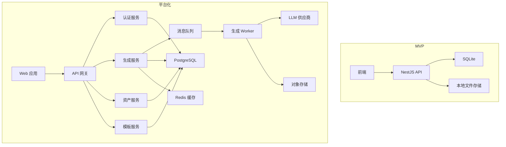
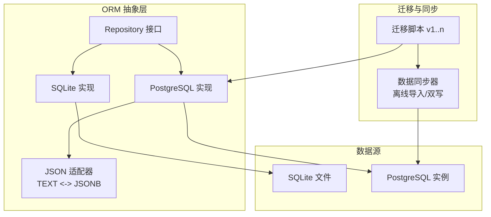
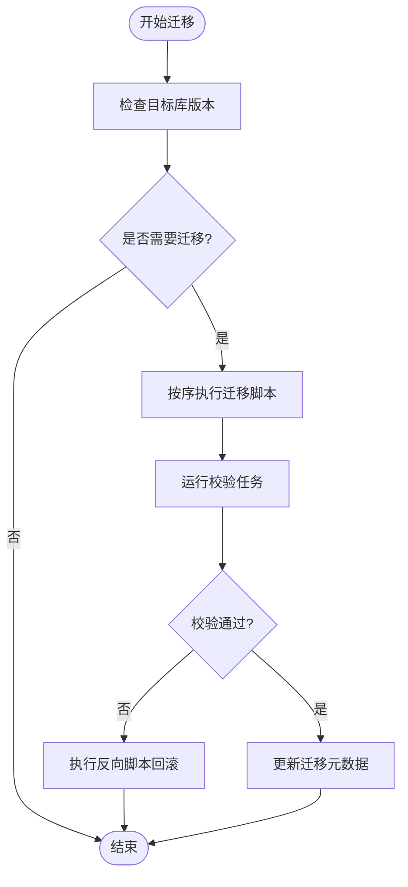
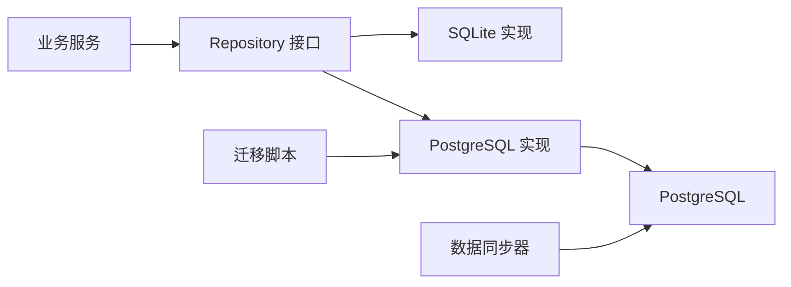

# 数据库演进策略

<cite>
**本文引用的文件**
- [产品技术设计文档](file://tech/product-technical-design.md)
- [优化版产品需求文档](file://tech/optimized-prd.md)
- [产品需求文档](file://prd.md)
</cite>

## 目录
1. [引言](#引言)
2. [项目结构](#项目结构)
3. [核心组件](#核心组件)
4. [架构总览](#架构总览)
5. [详细组件分析](#详细组件分析)
6. [依赖关系分析](#依赖关系分析)
7. [性能考量](#性能考量)
8. [故障排查指南](#故障排查指南)
9. [结论](#结论)
10. [附录](#附录)

## 引言
本文件为 ApexForge 的数据库演进策略，聚焦从 MVP 阶段 SQLite 到平台化阶段 PostgreSQL 的完整迁移路径。内容涵盖 ORM 抽象层设计、ID 策略（UUID/CUID）、JSON 字段兼容性处理、迁移脚本设计与数据同步方案、技术选型决策与性能考量、回滚策略、具体迁移步骤、验证方法与监控指标，以及连接池配置、索引优化建议与备份恢复策略。目标是在保证业务连续性的前提下，实现平滑、可观测、可回滚的数据层升级。

## 项目结构
当前仓库包含产品与技术设计文档，用于指导后端与数据层的演进方向。MVP 采用单体后端 + SQLite；平台化阶段引入服务化、消息队列、对象存储与 PostgreSQL。

图表来源
- [产品技术设计文档:64-100](file://tech/product-technical-design.md#L64-L100)

章节来源
- [产品技术设计文档:64-100](file://tech/product-technical-design.md#L64-L100)
- [产品技术设计文档:104-130](file://tech/product-technical-design.md#L104-L130)
- [优化版产品需求文档:273-280](file://tech/optimized-prd.md#L273-L280)

## 核心组件
本节定义数据库演进的关键组件与职责：
- ORM 抽象层：统一数据访问接口，屏蔽 SQLite/PostgreSQL 差异。
- ID 策略：全链路使用 UUID/CUID，避免自增主键耦合。
- JSON 兼容层：SQLite 以 TEXT 存储 JSON，PostgreSQL 使用 JSONB，提供读写适配。
- 迁移工具链：版本化迁移脚本、增量变更与回滚脚本。
- 数据同步器：双写或离线导入，保障迁移期间一致性。
- 连接池与驱动：按数据库类型配置连接池参数。
- 索引与查询优化：基于热点查询构建复合索引与覆盖索引。
- 备份与恢复：定期快照、增量日志与演练恢复。

章节来源
- [产品技术设计文档:122-129](file://tech/product-technical-design.md#L122-L129)
- [产品技术设计文档:174-325](file://tech/product-technical-design.md#L174-L325)
- [优化版产品需求文档:273-280](file://tech/optimized-prd.md#L273-L280)

## 架构总览
下图展示从 SQLite 到 PostgreSQL 的演进路径与关键集成点。

图表来源
- [产品技术设计文档:122-129](file://tech/product-technical-design.md#L122-L129)
- [产品技术设计文档:174-325](file://tech/product-technical-design.md#L174-L325)

## 详细组件分析

### ORM 抽象层设计
- 目标：通过 Repository 接口屏蔽底层数据库差异，确保后续切换数据库时业务代码无需改动。
- 设计要点：
  - 所有实体模型在 ORM 中声明，字段类型对 SQLite/PostgreSQL 做映射。
  - 针对 JSON 字段提供统一的序列化/反序列化工具，内部根据运行时数据库类型选择 TEXT 或 JSONB。
  - 事务边界由上层服务控制，Repository 仅负责持久化。
  - 分页、排序、过滤等通用能力封装在 Repository 基类中。
- 复杂度与扩展性：新增数据库只需实现对应 Repository 并提供连接配置；JSON 适配逻辑集中管理，降低扩散风险。

章节来源
- [产品技术设计文档:122-129](file://tech/product-technical-design.md#L122-L129)

### ID 策略（UUID/CUID）
- 原则：全表主键使用 UUID 或 CUID，避免依赖 SQLite 自增特性，便于跨库迁移与分布式场景。
- 影响范围：
  - 所有关联外键均使用字符串型 ID。
  - 索引与查询计划不受自增整型影响，需关注字符串索引大小与排序成本。
- 最佳实践：
  - 优先使用 CUID 提升可读性与碰撞概率控制；若需要标准 UUID，遵循 RFC 规范。
  - 在创建记录时于应用层生成 ID，禁止数据库侧生成。

章节来源
- [产品技术设计文档:122-129](file://tech/product-technical-design.md#L122-L129)

### JSON 字段兼容性处理
- 现状：
  - SQLite：无原生 JSON 类型，使用 TEXT 存储 JSON 字符串。
  - PostgreSQL：使用 JSONB 类型，支持高效查询与索引。
- 兼容策略：
  - 在 ORM 层提供 JSON 字段适配器，写入时对 SQLite 进行文本序列化，对 PostgreSQL 使用 JSONB 写入。
  - 读取时统一返回结构化对象，隐藏底层差异。
  - 对复杂查询（如 JSON 内字段过滤）在 SQLite 下降级为应用层过滤或在迁移后启用 JSONB 查询。
- 迁移注意：
  - 历史 TEXT 数据在导入 PostgreSQL 时需转换为 JSONB。
  - 校验 JSON 合法性，失败则记录并跳过或修复。

章节来源
- [产品技术设计文档:122-129](file://tech/product-technical-design.md#L122-L129)
- [产品技术设计文档:215-325](file://tech/product-technical-design.md#L215-L325)

### 迁移脚本设计与执行流程
- 版本化：每个迁移脚本带版本号与描述，支持正向与反向回滚。
- 幂等性：重复执行不产生副作用，检查已存在状态。
- 原子性：DDL/DML 在同一事务中执行，失败整体回滚。
- 执行顺序：先 DDL（建表/改列/加索引），再 DML（数据清洗/转换）。
- 回滚策略：为每个正向脚本提供对应的反向脚本，支持一键回滚。

图表来源
- [产品技术设计文档:122-129](file://tech/product-technical-design.md#L122-L129)

章节来源
- [产品技术设计文档:122-129](file://tech/product-technical-design.md#L122-L129)

### 数据同步方案
- 离线导入（推荐）：
  - 停止写入或进入只读窗口。
  - 导出 SQLite 数据，清洗并转换为 PostgreSQL 格式。
  - 批量导入至新库，完成后切换连接。
- 双写过渡（可选）：
  - 在迁移期间同时写入 SQLite 与 PostgreSQL。
  - 后台比对不一致记录并修复。
  - 稳定后关闭 SQLite 写入。
- 一致性保障：
  - 使用唯一 ID 去重。
  - 时间戳字段用于增量同步。
  - 校验报告记录差异与修复结果。

章节来源
- [产品技术设计文档:122-129](file://tech/product-technical-design.md#L122-L129)

### 连接池配置
- SQLite：
  - 单进程单文件，限制并发连接数。
  - 设置最大连接数与超时，避免锁竞争。
- PostgreSQL：
  - 合理设置最小/最大连接数、空闲超时、连接生命周期。
  - 使用健康检查与自动重试。
- NestJS 集成：
  - 通过模块配置注入连接池参数。
  - 暴露监控指标（活跃连接、等待队列、错误率）。

章节来源
- [产品技术设计文档:104-130](file://tech/product-technical-design.md#L104-L130)

### 索引优化建议
- 高频查询字段建立索引：
  - generation_tasks.status、workspaceId、projectId、userId。
  - model_assets.workspaceId、projectId、status。
  - templates.category、status。
- 复合索引：
  - (workspaceId, status)、(projectId, createdAt)。
- JSONB 索引：
  - 对常用 JSON 字段建立 GIN 索引，例如 params、metrics、tags。
- 覆盖索引：
  - 针对列表页查询，将筛选字段与排序字段组合成覆盖索引。
- 维护策略：
  - 定期统计信息更新。
  - 监控慢查询与未使用索引。

章节来源
- [产品技术设计文档:215-325](file://tech/product-technical-design.md#L215-L325)

### 备份与恢复策略
- 备份：
  - SQLite：定期文件快照，配合 WAL 模式减少锁冲突。
  - PostgreSQL：物理备份（pg_basebackup）+ 增量归档（WAL）。
- 恢复：
  - 制定 RPO/RTO 目标，定期演练恢复流程。
  - 恢复后进行数据完整性校验与冒烟测试。
- 安全：
  - 加密存储备份文件。
  - 权限最小化与审计日志。

章节来源
- [产品技术设计文档:104-130](file://tech/product-technical-design.md#L104-L130)

## 依赖关系分析
- 低耦合：ORM 抽象层隔离数据库实现，业务模块仅依赖接口。
- 明确边界：迁移脚本与同步器独立部署，不影响在线服务。
- 外部依赖：PostgreSQL 驱动、连接池库、迁移工具（如 Prisma/TypeORM）。
- 潜在循环：避免迁移脚本直接依赖业务服务，保持单向依赖。

图表来源
- [产品技术设计文档:122-129](file://tech/product-technical-design.md#L122-L129)

章节来源
- [产品技术设计文档:122-129](file://tech/product-technical-design.md#L122-L129)

## 性能考量
- 查询性能：
  - 利用 JSONB 的高效查询与索引，减少应用层过滤。
  - 合理使用覆盖索引，降低回表开销。
- 写入性能：
  - 批量写入与事务合并，减少锁竞争。
  - 对大 JSON 字段考虑分表或对象存储。
- 连接池：
  - 根据并发与延迟目标调优连接数与超时。
- 监控：
  - 跟踪慢查询、连接池饱和、锁等待与错误率。

章节来源
- [产品技术设计文档:104-130](file://tech/product-technical-design.md#L104-L130)
- [产品技术设计文档:215-325](file://tech/product-technical-design.md#L215-L325)

## 故障排查指南
- 常见问题：
  - JSON 解析失败：检查 TEXT 数据合法性，迁移时进行清洗。
  - 索引缺失导致慢查询：补充复合索引与 GIN 索引。
  - 连接池耗尽：调整最大连接数与超时，排查长事务。
  - 迁移中断：执行反向脚本回滚，修复后重试。
- 诊断手段：
  - 启用数据库慢查询日志。
  - 使用 EXPLAIN 分析执行计划。
  - 监控连接池与健康检查指标。

章节来源
- [产品技术设计文档:122-129](file://tech/product-technical-design.md#L122-L129)

## 结论
通过 ORM 抽象层、统一 ID 策略与 JSON 兼容处理，ApexForge 可从 SQLite 平滑演进到 PostgreSQL。结合版本化迁移脚本、离线导入与可选双写过渡，能够在保证一致性的前提下完成数据层升级。合理的连接池配置、索引优化与备份恢复策略，将进一步提升系统稳定性与可运维性。

## 附录

### 迁移步骤清单
- 准备阶段
  - 评估现有数据量与复杂度。
  - 设计迁移脚本与回滚脚本。
  - 搭建 PostgreSQL 环境并配置连接池。
- 实施阶段
  - 执行 DDL 迁移（建表、改列、加索引）。
  - 执行 DML 迁移（数据清洗、JSON 转换）。
  - 运行校验任务（行数、哈希、抽样对比）。
- 切换阶段
  - 灰度切换部分流量到新库。
  - 观察指标与错误率。
  - 全量切换并关闭旧库写入。
- 收尾阶段
  - 清理临时数据与中间表。
  - 归档迁移日志与报告。

章节来源
- [产品技术设计文档:122-129](file://tech/product-technical-design.md#L122-L129)

### 验证方法
- 数据一致性：
  - 行数对比、关键字段哈希对比。
  - 随机抽样人工核对。
- 功能回归：
  - 核心 API 用例覆盖。
  - 报表与导出结果一致性。
- 性能基准：
  - 关键查询耗时对比。
  - 连接池与锁等待指标。

章节来源
- [产品技术设计文档:122-129](file://tech/product-technical-design.md#L122-L129)

### 监控指标
- 可用性：数据库连接成功率、错误率。
- 性能：平均响应时间、P95/P99 延迟、慢查询数量。
- 资源：连接池使用率、CPU/内存占用、磁盘 I/O。
- 业务：生成任务成功率、渲染失败率、缓存命中率。

章节来源
- [产品技术设计文档:104-130](file://tech/product-technical-design.md#L104-L130)
- [优化版产品需求文档:349-359](file://tech/optimized-prd.md#L349-L359)