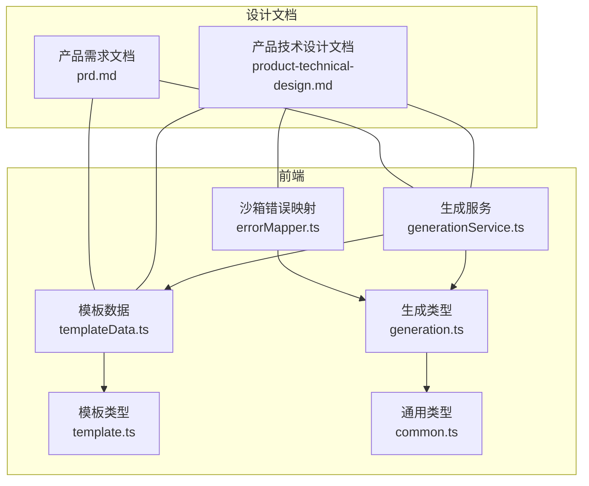
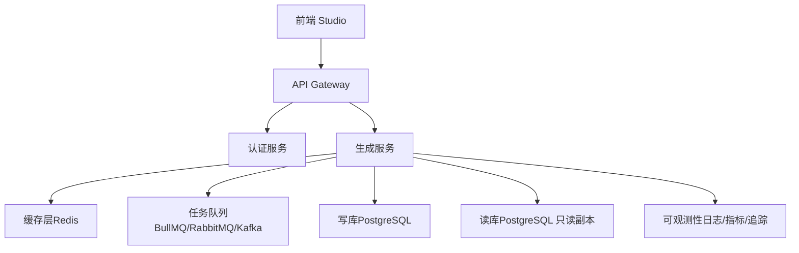
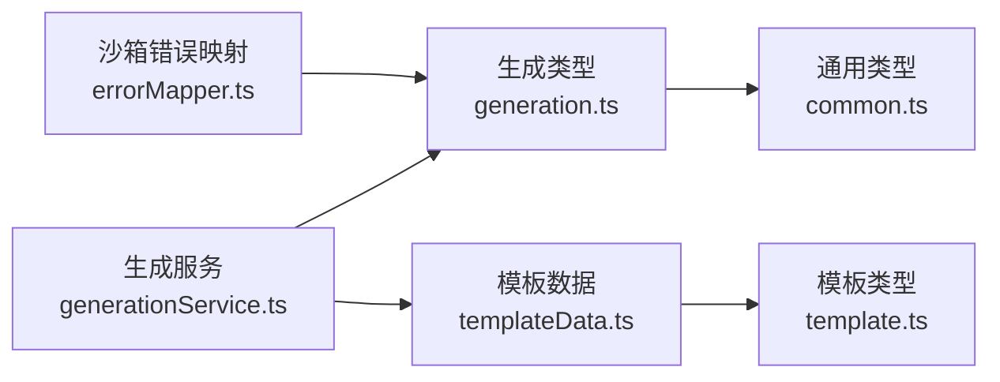
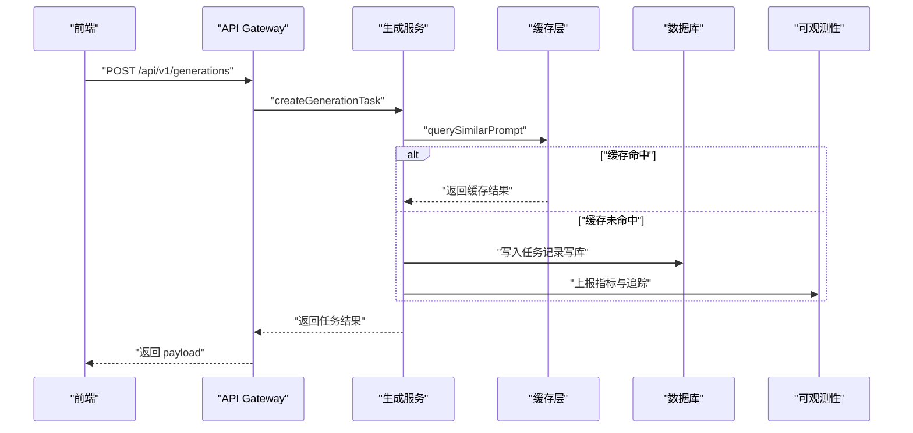

# 数据访问模式

<cite>
**本文引用的文件**   
- [产品技术设计文档](file://tech/product-technical-design.md)
- [产品需求文档](file://prd.md)
- [生成服务（前端）](file://src/modules/studio/services/generationService.ts)
- [模板数据（前端）](file://src/modules/templates/templateData.ts)
- [沙箱错误映射（前端）](file://src/modules/sandbox/errorMapper.ts)
- [生成类型定义（前端）](file://src/shared/types/generation.ts)
- [模板类型定义（前端）](file://src/shared/types/template.ts)
- [通用类型定义（前端）](file://src/shared/types/common.ts)
</cite>

## 目录
1. [引言](#引言)
2. [项目结构](#项目结构)
3. [核心组件](#核心组件)
4. [架构总览](#架构总览)
5. [详细组件分析](#详细组件分析)
6. [依赖关系分析](#依赖关系分析)
7. [性能考量](#性能考量)
8. [故障排查指南](#故障排查指南)
9. [结论](#结论)
10. [附录](#附录)

## 引言
本文件聚焦于 ApexForge 的数据访问模式，围绕 Repository 模式、Unit of Work 模式与 CQRS 架构在平台化阶段的落地方案进行系统化说明。内容涵盖事务管理、连接池配置、批量操作与并发控制策略；缓存层设计、读写分离与分库分表方案；数据一致性保证、乐观锁实现与冲突解决机制；以及性能监控、慢查询分析与数据库健康检查等实践建议。

需要特别说明的是：当前仓库以 MVP 前端为主，后端尚未提供具体代码实现。因此，本节关于后端数据访问模式的描述基于技术设计与产品需求文档中的架构规划与选型建议，旨在为后续工程落地提供可执行的蓝图与约束。

## 项目结构
从现有仓库可见，MVP 阶段主要包含前端模块与类型定义，后端采用 NestJS + SQLite/PostgreSQL 的演进路线已在设计文档中明确。数据访问相关的关键信息集中在技术设计文档与产品需求文档中，包括领域模型、API 契约、状态机与部署架构等。

图表来源
- [生成服务（前端）:1-30](file://src/modules/studio/services/generationService.ts#L1-L30)
- [模板数据（前端）:1-54](file://src/modules/templates/templateData.ts#L1-L54)
- [沙箱错误映射（前端）:1-12](file://src/modules/sandbox/errorMapper.ts#L1-L12)
- [生成类型定义（前端）:1-29](file://src/shared/types/generation.ts#L1-L29)
- [模板类型定义（前端）:1-19](file://src/shared/types/template.ts#L1-L19)
- [通用类型定义（前端）:1-11](file://src/shared/types/common.ts#L1-L11)
- [产品技术设计文档:1-1149](file://tech/product-technical-design.md#L1-L1149)
- [产品需求文档:1-168](file://prd.md#L1-L168)

章节来源
- [产品技术设计文档:1-1149](file://tech/product-technical-design.md#L1-L1149)
- [产品需求文档:1-168](file://prd.md#L1-L168)
- [生成服务（前端）:1-30](file://src/modules/studio/services/generationService.ts#L1-L30)
- [模板数据（前端）:1-54](file://src/modules/templates/templateData.ts#L1-L54)
- [沙箱错误映射（前端）:1-12](file://src/modules/sandbox/errorMapper.ts#L1-L12)
- [生成类型定义（前端）:1-29](file://src/shared/types/generation.ts#L1-L29)
- [模板类型定义（前端）:1-19](file://src/shared/types/template.ts#L1-L19)
- [通用类型定义（前端）:1-11](file://src/shared/types/common.ts#L1-L11)

## 核心组件
- 生成服务（前端）：负责本地模拟生成流程，返回结构化结果并附带 traceId 与指标，便于后续接入后端与观测体系。
- 模板数据（前端）：维护模板元数据，用于分类匹配与默认提示词，作为数据访问层的输入依据之一。
- 沙箱错误映射（前端）：将沙箱执行异常映射为用户可读的错误消息，体现错误处理的一致性。
- 类型定义（前端）：统一 GenerationResult、TemplateItem、ApiResponse 等数据结构，确保前后端契约一致。

章节来源
- [生成服务（前端）:1-30](file://src/modules/studio/services/generationService.ts#L1-L30)
- [模板数据（前端）:1-54](file://src/modules/templates/templateData.ts#L1-L54)
- [沙箱错误映射（前端）:1-12](file://src/modules/sandbox/errorMapper.ts#L1-L12)
- [生成类型定义（前端）:1-29](file://src/shared/types/generation.ts#L1-L29)
- [模板类型定义（前端）:1-19](file://src/shared/types/template.ts#L1-L19)
- [通用类型定义（前端）:1-11](file://src/shared/types/common.ts#L1-L11)

## 架构总览
平台化阶段的后端采用微服务化架构，API Gateway 统一入口，Generation Service 编排生成链路，结合缓存、队列与数据库持久化。数据访问层面建议引入 Repository 模式与 Unit of Work 模式，并通过 CQRS 分离读写路径，提升扩展性与可观测性。

图表来源
- [产品技术设计文档:34-101](file://tech/product-technical-design.md#L34-L101)
- [产品技术设计文档:104-130](file://tech/product-technical-design.md#L104-L130)
- [产品技术设计文档:574-630](file://tech/product-technical-design.md#L574-L630)

章节来源
- [产品技术设计文档:34-101](file://tech/product-technical-design.md#L34-L101)
- [产品技术设计文档:104-130](file://tech/product-technical-design.md#L104-L130)
- [产品技术设计文档:574-630](file://tech/product-technical-design.md#L574-L630)

## 详细组件分析

### Repository 模式
- 目标：抽象数据库访问细节，对外暴露领域级接口（如 createGenerationTask、findAssetById），屏蔽底层 SQL/ORM 差异。
- 适用场景：SQLite 到 PostgreSQL 迁移、多存储后端替换、复杂查询封装。
- 设计要点：
  - 每个聚合根对应一个 Repository 接口与实现（例如 GenerationTaskRepository、ModelAssetRepository）。
  - 方法签名使用领域对象而非行记录，避免泄漏基础设施细节。
  - 支持分页、过滤、排序等常见查询参数，内部组合条件构建器。
- 与 ORM 集成：通过 Prisma/TypeORM 或自研仓储适配器，保持接口稳定。

章节来源
- [产品技术设计文档:122-129](file://tech/product-technical-design.md#L122-L129)

### Unit of Work 模式
- 目标：协调多个 Repository 的事务边界，确保跨聚合的一致性提交。
- 典型用法：创建生成任务时同时写入 generation_tasks、validation_reports、quality_scores 等表，统一在一个工作单元内提交。
- 设计要点：
  - 显式 begin/commit/rollback 生命周期，失败时回滚所有变更。
  - 支持嵌套工作单元与保存点，便于重试与补偿。
  - 与事件发布器集成，提交成功后发出领域事件（如 TaskCompleted）。

章节来源
- [产品技术设计文档:215-324](file://tech/product-technical-design.md#L215-L324)

### CQRS 架构
- 目标：将命令（写）与查询（读）分离，分别优化路径与模型。
- 写侧：GenerationCommandHandler 接收请求，校验、编排、持久化，并发布领域事件。
- 读侧：QueryHandlers 针对高频查询（资产列表、版本历史、质量评分）提供投影视图，降低主库压力。
- 一致性：最终一致性，通过事件驱动更新读库投影；必要时提供强一致读（跨会话内）。

章节来源
- [产品技术设计文档:574-630](file://tech/product-technical-design.md#L574-L630)
- [产品技术设计文档:632-758](file://tech/product-technical-design.md#L632-L758)

### 事务管理
- 单服务内事务：使用数据库事务包裹 Unit of Work，确保多表写入原子性。
- 分布式事务：跨服务调用优先采用异步事件与幂等键，避免两阶段提交带来的复杂度。
- 重试与补偿：对网络抖动与临时故障进行指数退避重试；失败路径触发补偿动作（如撤销已写入的中间态）。

章节来源
- [产品技术设计文档:327-426](file://tech/product-technical-design.md#L327-L426)

### 连接池配置
- 建议：根据并发量与数据库规格配置连接池大小，设置最大空闲连接、超时与最小连接数。
- 监控：暴露连接池指标（活跃连接、等待队列长度、获取耗时），告警阈值按 P95/P99 设定。
- 调优：长事务与慢查询会占用连接，需配合查询优化与索引完善。

章节来源
- [产品技术设计文档:104-130](file://tech/product-technical-design.md#L104-L130)

### 批量操作
- 场景：导入历史数据、批量更新模板版本、批量归档资产。
- 策略：分批提交（每批 N 条），避免单次事务过大导致锁竞争与回滚成本过高。
- 幂等：为每条记录提供唯一键或批次号，支持重复执行安全。

章节来源
- [产品技术设计文档:174-324](file://tech/product-technical-design.md#L174-L324)

### 并发控制策略
- 应用层：令牌桶/漏桶限流，防止热点资源被压垮。
- 数据库层：行级锁、唯一约束、序列/UUID 避免热点自增。
- 队列层：消费者并行度与去重键控制，避免重复处理。

章节来源
- [产品技术设计文档:574-630](file://tech/product-technical-design.md#L574-L630)
- [产品需求文档:143-152](file://prd.md#L143-L152)

### 缓存层设计
- 定位：相似 Prompt 缓存、任务状态缓存、模板元数据缓存。
- 策略：TTL 过期、LRU 淘汰、热点键保护；缓存穿透防护（布隆过滤器或空值缓存）。
- 一致性：先更新数据库再删除缓存，或采用延迟双删；读多写少场景优先。

章节来源
- [产品技术设计文档:327-426](file://tech/product-technical-design.md#L327-L426)
- [产品技术设计文档:574-630](file://tech/product-technical-design.md#L574-L630)

### 读写分离
- 架构：主库承担写负载，只读副本承载查询流量；读写路由由网关或服务内部决定。
- 延迟容忍：读库存在复制延迟，关键路径可采用强制读主或本地缓存兜底。
- 监控：复制延迟、主从切换、查询命中率。

章节来源
- [产品技术设计文档:82-101](file://tech/product-technical-design.md#L82-L101)

### 分库分表方案
- 维度：按 workspaceId/projectId 水平拆分，保证同空间数据局部性。
- 路由：哈希取模或范围分区；预留扩容槽位。
- 跨分片：尽量避免跨分片 JOIN，使用聚合查询或离线 ETL 汇总。

章节来源
- [产品技术设计文档:174-324](file://tech/product-technical-design.md#L174-L324)

### 数据一致性保证
- 幂等键：为每次生成任务分配唯一 ID，避免重复提交造成重复数据。
- 最终一致性：通过事件驱动更新读库投影，提供查询补偿与重试。
- 审计日志：关键变更落盘，支持回溯与合规审计。

章节来源
- [产品技术设计文档:174-324](file://tech/product-technical-design.md#L174-L324)

### 乐观锁实现与冲突解决
- 字段：version 或 updated_at 时间戳。
- 策略：更新时携带版本号，若不一致则拒绝并返回冲突码；客户端可选择重试或合并策略。
- 冲突降级：对于非关键路径，允许覆盖并记录冲突日志；关键路径要求用户确认。

章节来源
- [产品技术设计文档:255-324](file://tech/product-technical-design.md#L255-L324)

### 性能监控、慢查询分析与健康检查
- 指标：QPS、P95/P99 延迟、错误率、连接池利用率、缓存命中率。
- 慢查询：开启慢查询日志，定期分析 Top-N 语句，补充索引或改写 SQL。
- 健康检查：数据库连通性、复制延迟、磁盘空间、连接池水位；探针失败触发自动扩缩容或熔断。

章节来源
- [产品技术设计文档:104-130](file://tech/product-technical-design.md#L104-L130)
- [产品技术设计文档:574-630](file://tech/product-technical-design.md#L574-L630)

## 依赖关系分析
以下图展示前端模块间的依赖关系，便于理解数据访问契约在前端的体现。

图表来源
- [生成服务（前端）:1-30](file://src/modules/studio/services/generationService.ts#L1-L30)
- [模板数据（前端）:1-54](file://src/modules/templates/templateData.ts#L1-L54)
- [沙箱错误映射（前端）:1-12](file://src/modules/sandbox/errorMapper.ts#L1-L12)
- [生成类型定义（前端）:1-29](file://src/shared/types/generation.ts#L1-L29)
- [模板类型定义（前端）:1-19](file://src/shared/types/template.ts#L1-L19)
- [通用类型定义（前端）:1-11](file://src/shared/types/common.ts#L1-L11)

章节来源
- [生成服务（前端）:1-30](file://src/modules/studio/services/generationService.ts#L1-L30)
- [模板数据（前端）:1-54](file://src/modules/templates/templateData.ts#L1-L54)
- [沙箱错误映射（前端）:1-12](file://src/modules/sandbox/errorMapper.ts#L1-L12)
- [生成类型定义（前端）:1-29](file://src/shared/types/generation.ts#L1-L29)
- [模板类型定义（前端）:1-19](file://src/shared/types/template.ts#L1-L19)
- [通用类型定义（前端）:1-11](file://src/shared/types/common.ts#L1-L11)

## 性能考量
- 前端：按需加载 Three.js 与沙箱运行时，Worker 解析模型 JSON，InstancedMesh 复用几何体，requestAnimationFrame 控制渲染循环。
- 服务端：模板模式参数化生成减少 LLM 调用；相似 Prompt 命中缓存直接返回；队列削峰填谷，消费者并行度可控。
- 数据库：合理索引、避免全表扫描、分页游标替代偏移；读写分离与缓存降低主库压力。

章节来源
- [产品技术设计文档:563-571](file://tech/product-technical-design.md#L563-L571)
- [产品技术设计文档:327-426](file://tech/product-technical-design.md#L327-L426)
- [产品需求文档:155-165](file://prd.md#L155-L165)

## 故障排查指南
- 沙箱错误映射：将运行时错误、超时、无效 JSON 等映射为用户友好提示，便于快速定位问题。
- 生成状态机：通过 queued → generating → validating → renderable/failed 的状态流转，结合 traceId 追踪链路。
- 错误响应规范：统一包含 traceId、错误码与消息，便于前端展示与后端日志关联。

章节来源
- [沙箱错误映射（前端）:1-12](file://src/modules/sandbox/errorMapper.ts#L1-L12)
- [产品技术设计文档:342-390](file://tech/product-technical-design.md#L342-L390)
- [通用类型定义（前端）:1-11](file://src/shared/types/common.ts#L1-L11)

## 结论
ApexForge 在平台化阶段应通过 Repository 与 Unit of Work 模式抽象数据访问，结合 CQRS 分离读写路径，辅以缓存、队列与读写分离提升可扩展性与稳定性。事务管理、连接池、批量操作与并发控制是保障高可用的关键；乐观锁与幂等设计确保一致性；性能监控与慢查询分析持续优化系统表现。当前仓库的前端已具备清晰的类型契约与错误映射，为后续后端数据访问层的工程落地提供了良好基础。

## 附录

### 生成链路时序（含数据访问）

图表来源
- [产品技术设计文档:361-390](file://tech/product-technical-design.md#L361-L390)
- [产品技术设计文档:574-630](file://tech/product-technical-design.md#L574-L630)