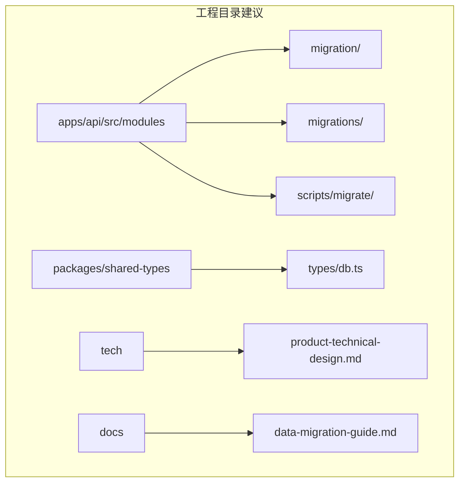
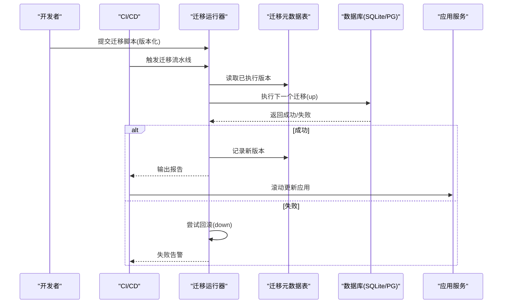
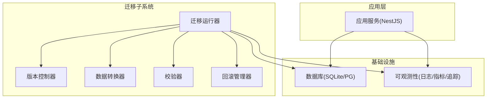
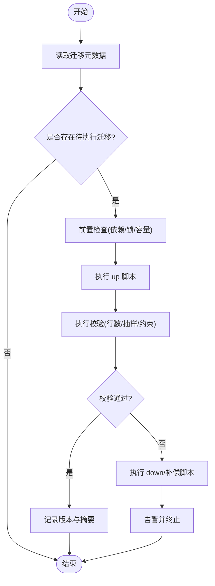

# 数据迁移管理

<cite>
**本文引用的文件**   
- [产品技术设计文档](file://tech/product-technical-design.md)
- [产品需求文档](file://prd.md)
</cite>

## 目录
1. [引言](#引言)
2. [项目结构](#项目结构)
3. [核心组件](#核心组件)
4. [架构总览](#架构总览)
5. [详细组件分析](#详细组件分析)
6. [依赖分析](#依赖分析)
7. [性能考虑](#性能考虑)
8. [故障排查指南](#故障排查指南)
9. [结论](#结论)
10. [附录](#附录)

## 引言
本文件面向 ApexForge 的数据迁移与版本治理，覆盖以下目标：
- 迁移脚本编写规范、版本控制与回滚策略
- 增量迁移、数据转换与校验方法
- 多环境部署时的执行顺序与依赖管理
- 迁移失败处理、数据修复工具与自动化测试方案
- 生产环境最佳实践、灰度发布策略与监控告警配置

依据仓库中的技术设计与产品需求，ApexForge 在 MVP 阶段使用 SQLite，平台化阶段演进至 PostgreSQL，并在 Beta/Scale 里程碑中明确“数据库迁移”任务。同时，文档强调通过 ORM 抽象、UUID/CUID 主键、JSON 字段兼容等策略降低迁移风险。

章节来源
- [产品技术设计文档:104-129](file://tech/product-technical-design.md#L104-L129)
- [产品技术设计文档:961-998](file://tech/product-technical-design.md#L961-L998)
- [产品需求文档:33-53](file://prd.md#L33-L53)

## 项目结构
当前仓库包含产品与技术设计文档，未包含具体代码实现。因此，本节聚焦于基于文档的迁移相关目录与职责划分建议，便于后续落地实施。

说明
- migration/：运行时可执行的迁移编排器（如 NestJS 模块或 CLI），负责加载、排序、幂等执行与记录。
- migrations/：按版本号命名的 SQL/TS 脚本集合，每个脚本对应一次不可逆变更或可回滚的成对 up/down。
- scripts/migrate/：辅助脚本，用于离线导入、数据清洗、校验与修复。
- types/db.ts：统一类型定义，确保 ORM 模型与迁移脚本一致。
- tech 与 docs：存放设计文档与迁移指南。

[本节为概念性结构建议，不直接分析具体源码文件]

## 核心组件
围绕数据迁移的核心能力，建议拆分为如下组件：
- 迁移编排器：读取并排序迁移脚本，维护迁移元数据表，保证幂等与事务边界。
- 版本控制器：以语义化版本或时间戳命名，支持向前/向后兼容约束检查。
- 数据转换器：针对 SQLite→PostgreSQL 的类型映射、JSON 文本到 JSONB 的转换、枚举值规范化。
- 校验器：迁移前后一致性校验（行数、抽样哈希、关键外键完整性）。
- 回滚管理器：为每个迁移提供 down 脚本或补偿逻辑，支持断点续跑与部分回滚。
- 多环境适配：按环境选择连接串、并发度、批大小与是否启用只读副本。
- 观测与告警：记录迁移耗时、错误码、影响行数、回滚次数，触发告警。

章节来源
- [产品技术设计文档:104-129](file://tech/product-technical-design.md#L104-L129)
- [产品技术设计文档:961-998](file://tech/product-technical-design.md#L961-L998)

## 架构总览
下图展示从应用启动到迁移执行的关键路径，以及迁移与业务服务的解耦关系。

图表来源
- [产品技术设计文档:104-129](file://tech/product-technical-design.md#L104-L129)
- [产品技术设计文档:961-998](file://tech/product-technical-design.md#L961-L998)

## 详细组件分析

### 迁移脚本编写规范
- 命名与排序
  - 采用“YYYYMMDDHHmmss_描述.sql/ts”或“vX.Y.Z_up.sql/ts + vX.Y.Z_down.sql/ts”形式，确保稳定排序。
  - 禁止在脚本中引入随机性或外部状态，保证幂等。
- 幂等与条件执行
  - 使用“存在则跳过”的检查（如判断索引/列是否存在），避免重复执行报错。
  - 对于数据修正类脚本，先做快照备份，再分批更新。
- 事务与原子性
  - 单条迁移尽量在一个事务内完成；跨库/跨实例操作需显式补偿。
- 兼容性约束
  - 新增字段默认值必须安全；删除字段前保留一段时间并双写。
  - 变更 JSON 字段时，保持旧格式兼容至少一个版本周期。
- 注释与审计
  - 每条迁移附带作者、关联需求/缺陷编号、风险评估与回滚步骤。

章节来源
- [产品技术设计文档:104-129](file://tech/product-technical-design.md#L104-L129)

### 版本控制与回滚策略
- 版本策略
  - 推荐语义化版本，配合“up/down”成对脚本；或使用单向迁移+补偿脚本。
  - 元数据表记录：version、applied_at、duration_ms、checksum、error_message。
- 回滚原则
  - 优先 down 脚本；若无 down，提供补偿脚本（revert）。
  - 回滚需满足反向幂等，且不影响其他并行迁移。
- 回滚窗口
  - 大表变更设置回滚窗口与阈值，超过阈值自动中止并告警。

章节来源
- [产品技术设计文档:961-998](file://tech/product-technical-design.md#L961-L998)

### 增量迁移、数据转换与校验方法
- 增量迁移
  - 每次仅变更最小必要范围；复杂变更拆分为多个小迁移。
  - 对热点表采用在线 DDL 策略（如 PG 的 CONCURRENTLY）。
- 数据转换
  - SQLite TEXT(JSON) → PostgreSQL JSONB：批量抽取、校验、写入新列，再切换读写。
  - 枚举值标准化：建立映射表，逐步替换旧值，最后清理冗余值。
  - 大字段迁移：将大对象（截图、导出文件）迁移至对象存储，仅保留 URL。
- 校验方法
  - 行级校验：对比迁移前后关键表行数差异。
  - 抽样校验：对关键字段计算哈希，抽样比对一致性。
  - 外键与唯一约束：迁移后重建并验证。
  - 业务校验：模板参数 Schema、资产版本链路的完整性检查。

章节来源
- [产品技术设计文档:104-129](file://tech/product-technical-design.md#L104-L129)
- [产品技术设计文档:952-958](file://tech/product-technical-design.md#L952-L958)

### 多环境部署的执行顺序与依赖管理
- 环境分层
  - dev/test/staging/prod 四套环境，各自独立数据库与迁移元数据。
- 执行顺序
  - 先执行迁移，再滚动更新应用；若应用需要向下兼容，则允许新旧版本共存一段时间。
- 依赖管理
  - 迁移间声明依赖（如必须先创建索引再建约束）。
  - 跨服务共享表变更需协调各服务版本与迁移顺序。
- 只读副本与延迟复制
  - 在 PG 场景下，优先在只读副本上预演迁移，确认无异常后再在主库执行。

章节来源
- [产品技术设计文档:961-998](file://tech/product-technical-design.md#L961-L998)

### 迁移失败处理与数据修复工具
- 失败处理
  - 自动重试（指数退避）、熔断与人工介入开关。
  - 失败时立即回滚或进入“暂停”状态，生成诊断包（日志、SQL、样本数据）。
- 数据修复工具
  - 提供 CLI 工具：scan（扫描不一致）、repair（修复）、verify（校验）、export/import（备份恢复）。
  - 修复脚本需幂等，支持断点续修。
- 演练与预案
  - 定期在 staging 进行迁移演练与回滚演练，记录时长与风险点。

章节来源
- [产品技术设计文档:961-998](file://tech/product-technical-design.md#L961-L998)

### 自动化测试方案
- 单元测试
  - 迁移脚本语法与幂等性测试；down 脚本反向验证。
- 集成测试
  - 在隔离数据库中执行完整迁移链路，包括 up/down 全量流程。
- 回归测试
  - 固定 Prompt 集与模板集，验证迁移后查询结果与质量评分不受影响。
- 安全测试
  - 注入非法 SQL、超大事务、长事务等边界用例。

章节来源
- [产品技术设计文档:1040-1075](file://tech/product-technical-design.md#L1040-L1075)

### 生产环境最佳实践
- 变更窗口
  - 低峰期执行，提前公告；准备快速回滚方案。
- 灰度发布
  - 先对 1% 流量开启新应用版本，观察指标正常后再全量。
  - 对大表变更采用蓝绿/金丝雀策略，分批次推进。
- 容量规划
  - 预估锁等待、IO 峰值与 CPU 占用，预留扩容资源。
- 备份与快照
  - 迁移前创建数据库快照或逻辑备份，确保可恢复到任意时间点。

章节来源
- [产品技术设计文档:961-998](file://tech/product-technical-design.md#L961-L998)

### 监控与告警配置
- 指标采集
  - 迁移开始/结束时间、耗时、影响行数、失败率、回滚次数。
- 告警规则
  - 迁移失败、长时间未完成、回滚触发、校验不一致等。
- 可观测性
  - 结合 traceId 贯穿迁移过程，集中收集日志与指标。

章节来源
- [产品技术设计文档:868-907](file://tech/product-technical-design.md#L868-L907)

## 依赖分析
迁移系统与系统其他组件的关系如下：

图表来源
- [产品技术设计文档:104-129](file://tech/product-technical-design.md#L104-L129)
- [产品技术设计文档:868-907](file://tech/product-technical-design.md#L868-L907)

章节来源
- [产品技术设计文档:104-129](file://tech/product-technical-design.md#L104-L129)
- [产品技术设计文档:868-907](file://tech/product-technical-design.md#L868-L907)

## 性能考虑
- 批量与分页
  - 大数据量转换采用分批提交，控制事务大小与锁持有时间。
- 索引与统计信息
  - 迁移过程中谨慎重建索引，必要时在空闲时段执行。
- 对象存储分流
  - 将大字段（代码、模型 JSON、截图）迁移至对象存储，减少数据库压力。
- 只读副本预热
  - 在 PG 环境下先在只读副本执行迁移，缩短主库锁定时间。

章节来源
- [产品技术设计文档:952-958](file://tech/product-technical-design.md#L952-L958)

## 故障排查指南
- 常见问题定位
  - 迁移卡住：查看锁等待、长事务、磁盘 IO。
  - 校验失败：核对抽样哈希、外键约束、枚举映射。
  - 回滚失败：检查 down 脚本幂等性与依赖顺序。
- 诊断信息
  - 收集迁移日志、错误堆栈、受影响表与行数、样本数据。
- 应急措施
  - 立即回滚或冻结变更，恢复快照，通知相关方。

章节来源
- [产品技术设计文档:961-998](file://tech/product-technical-design.md#L961-L998)

## 结论
通过规范的迁移脚本、严格的版本控制与完备的回滚策略，结合增量迁移、数据转换与校验方法，ApexForge 可在多环境中安全、可控地完成数据库演进。生产环境应遵循灰度发布、充分演练与完善的监控告警体系，确保高可用与可观测性。

[本节为总结性内容，不直接分析具体源码文件]

## 附录

### 附录A：SQLite 到 PostgreSQL 迁移要点
- 主键与自增
  - 使用 UUID/CUID 替代自增 ID，避免方言绑定。
- JSON 字段
  - SQLite TEXT(JSON) → PostgreSQL JSONB，注意索引与查询优化。
- 数据类型映射
  - 布尔、日期时间、数值精度对齐，必要时增加中间列过渡。
- 索引与约束
  - 迁移后重建索引与约束，验证查询计划与性能。
- 历史数据导入
  - 提供离线导入脚本，支持断点续传与校验。

章节来源
- [产品技术设计文档:104-129](file://tech/product-technical-design.md#L104-L129)

### 附录B：迁移流程图（算法视角）

图表来源
- [产品技术设计文档:961-998](file://tech/product-technical-design.md#L961-L998)