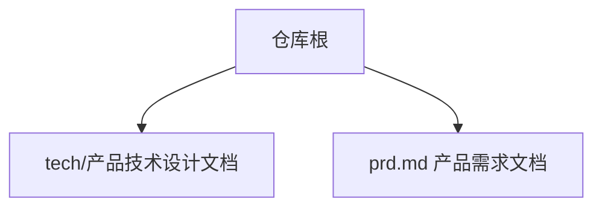
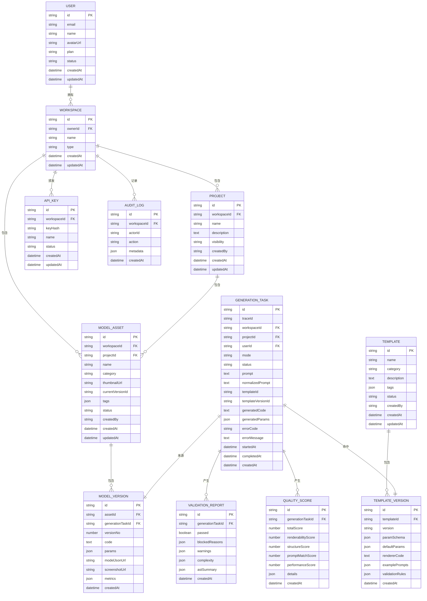
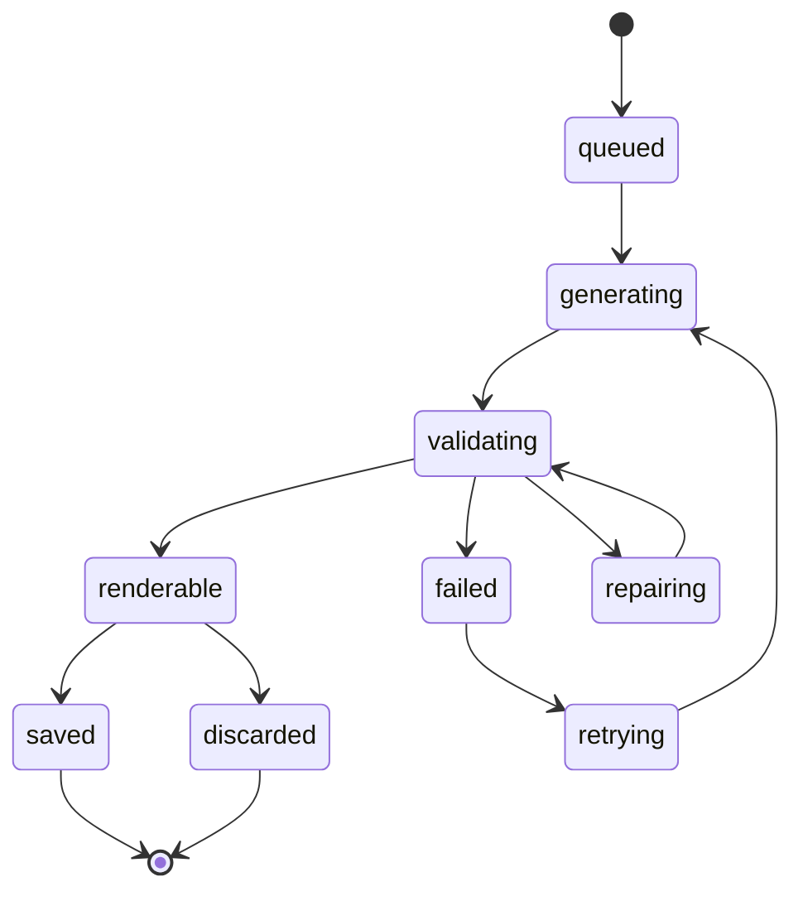
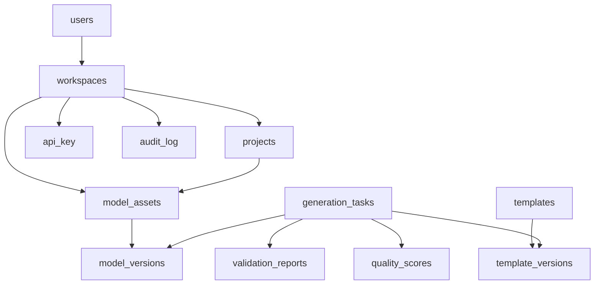

# 核心数据模型

<cite>
**本文引用的文件**
- [产品技术设计文档](file://tech/product-technical-design.md)
- [产品需求文档](file://prd.md)
</cite>

## 目录
1. [引言](#引言)
2. [项目结构](#项目结构)
3. [核心组件](#核心组件)
4. [架构总览](#架构总览)
5. [详细组件分析](#详细组件分析)
6. [依赖关系分析](#依赖关系分析)
7. [性能考虑](#性能考虑)
8. [故障排查指南](#故障排查指南)
9. [结论](#结论)
10. [附录](#附录)

## 引言
本文件聚焦于 ApexForge 的核心数据模型，围绕用户、工作空间、项目、生成任务、模型资产、模板及其版本等关键实体，系统化阐述字段定义、主外键约束、索引策略与数据完整性规则；同时给出数据访问模式、查询优化建议、缓存策略、生命周期管理、软删除实现与审计日志记录方案。内容基于仓库中的产品与技术设计文档进行提炼与结构化整理，便于不同背景的读者快速理解并落地实施。

## 项目结构
当前仓库包含产品需求文档与技术设计文档，其中数据模型与关系在技术设计文档中进行了完整描述。MVP 阶段采用 SQLite，平台化阶段迁移至 PostgreSQL，并通过 ORM 抽象数据库访问层，确保跨库兼容与可演进性。

图表来源
- [产品技术设计文档:104-129](file://tech/product-technical-design.md#L104-L129)
- [产品需求文档:33-53](file://prd.md#L33-L53)

章节来源
- [产品技术设计文档:104-129](file://tech/product-technical-design.md#L104-L129)
- [产品需求文档:33-53](file://prd.md#L33-L53)

## 核心组件
本节概述核心领域对象及其职责：
- 用户（User）：系统主体，承载身份、套餐与状态。
- 工作空间（Workspace）：团队或个人协作边界，拥有成员与权限。
- 项目（Project）：模型资产的容器，受工作空间管控。
- 生成任务（GenerationTask）：一次从 Prompt 到代码/参数的生成过程，贯穿全链路追踪。
- 模型资产（ModelAsset）：成功生成的 Three.js 模型资产，支持标签与可见性。
- 模型版本（ModelVersion）：资产的具体版本，保存代码、参数、指标与产物地址。
- 模板（Template）与模板版本（TemplateVersion）：程序化模板与其参数 Schema、渲染函数与示例。
- 校验报告（ValidationReport）、质量评分（QualityScore）、反馈（Feedback）、API Key、审计日志（AuditLog）：支撑安全、质量与合规。

章节来源
- [产品技术设计文档:132-170](file://tech/product-technical-design.md#L132-L170)

## 架构总览
下图展示核心实体之间的关系，体现“用户-空间-项目-资产-版本-任务”的主路径，以及模板与任务的关联。

图表来源
- [产品技术设计文档:174-324](file://tech/product-technical-design.md#L174-L324)

## 详细组件分析

### 用户（users）
- 业务含义：系统唯一主体，用于鉴权、配额与审计。
- 关键字段
  - id：主键，建议使用 UUID/CUID，避免自增依赖。
  - email：登录标识，需唯一。
  - name、avatarUrl：展示信息。
  - plan：套餐类型，影响配额与能力。
  - status：active/disabled，控制账号可用状态。
  - createdAt/updatedAt：审计时间戳。
- 约束与索引
  - 主键：id
  - 唯一索引：email
  - 普通索引：status、plan（用于筛选与统计）
- 数据完整性
  - 非空约束：id、email、createdAt
  - 枚举约束：status、plan（通过应用层或数据库 CHECK 约束）

章节来源
- [产品技术设计文档:178-189](file://tech/product-technical-design.md#L178-L189)

### 工作空间（workspaces）
- 业务含义：个人或团队协作边界，承载项目、资产、API Key 与审计日志。
- 关键字段
  - id：主键
  - ownerId：所有者用户 ID，外键指向 users.id
  - name：空间名称
  - type：personal/team/enterprise，区分能力与计费维度
  - createdAt/updatedAt：审计时间戳
- 约束与索引
  - 主键：id
  - 外键：ownerId -> users(id)
  - 普通索引：type、ownerId
- 数据完整性
  - 非空约束：id、name、type、createdAt
  - 外键级联：删除用户时按策略处理其拥有的空间（建议禁止直接删除，改为软禁用或转移）

章节来源
- [产品技术设计文档:191-200](file://tech/product-technical-design.md#L191-L200)

### 项目（projects）
- 业务含义：模型资产的容器，受工作空间管控。
- 关键字段
  - id：主键
  - workspaceId：所属空间，外键指向 workspaces.id
  - name、description：元信息
  - visibility：private/shared/public，控制可见范围
  - createdBy：创建者用户 ID
  - createdAt/updatedAt：审计时间戳
- 约束与索引
  - 主键：id
  - 外键：workspaceId -> workspaces(id)
  - 普通索引：workspaceId、visibility、createdBy
- 数据完整性
  - 非空约束：id、name、workspaceId、createdAt
  - 可见性枚举：private/shared/public

章节来源
- [产品技术设计文档:202-213](file://tech/product-technical-design.md#L202-L213)

### 生成任务（generation_tasks）
- 业务含义：一次从 Prompt 到代码/参数的生成过程，贯穿全链路追踪。
- 关键字段
  - id：主键
  - traceId：全链路追踪 ID，贯穿前端、网关、服务、LLM、校验、沙箱
  - workspaceId/projectId/userId：归属与发起者
  - mode：code/template/hybrid/auto
  - status：queued/generating/validating/renderable/failed/cancelled 等
  - prompt/normalizedPrompt：原始与归一化输入
  - templateId/templateVersionId：命中的模板及版本
  - generatedCode/generatedParams：输出代码或参数
  - errorCode/errorMessage：失败原因
  - startedAt/completedAt/createdAt：时间线
- 约束与索引
  - 主键：id
  - 普通索引：traceId、workspaceId、projectId、userId、status、createdAt
  - 复合索引：(workspaceId, projectId, status)、(traceId, status)
- 数据完整性
  - 非空约束：id、workspaceId、projectId、userId、status、createdAt
  - 状态机约束：仅允许合法状态转换（见后文状态图）

章节来源
- [产品技术设计文档:215-236](file://tech/product-technical-design.md#L215-L236)

### 模型资产（model_assets）
- 业务含义：成功生成的 Three.js 模型资产，支持标签与可见性。
- 关键字段
  - id：主键
  - workspaceId/projectId：归属
  - name/category/thumbnailUrl：展示与分类
  - currentVersionId：当前活跃版本
  - tags：JSON 标签列表
  - status：active/deleted/archived（软删除）
  - createdBy/createdAt/updatedAt：审计时间戳
- 约束与索引
  - 主键：id
  - 外键：workspaceId -> workspaces(id)，projectId -> projects(id)
  - 普通索引：workspaceId、projectId、category、status、updatedAt
- 数据完整性
  - 非空约束：id、name、workspaceId、projectId、status、createdAt
  - 软删除：deleted 状态不物理删除，保留历史与回滚能力

章节来源
- [产品技术设计文档:238-253](file://tech/product-technical-design.md#L238-L253)

### 模型版本（model_versions）
- 业务含义：资产的具体版本，保存代码、参数、指标与产物地址。
- 关键字段
  - id：主键
  - assetId：资产 ID，外键指向 model_assets.id
  - generationTaskId：来源任务，外键指向 generation_tasks.id
  - versionNo：版本号（递增）
  - code：Three.js 代码
  - params：参数对象（JSON）
  - modelJsonUrl/screenshotUrl：产物地址（对象存储）
  - metrics：几何体、顶点、材质等指标（JSON）
  - createdAt：创建时间
- 约束与索引
  - 主键：id
  - 外键：assetId -> model_assets(id)，generationTaskId -> generation_tasks(id)
  - 普通索引：assetId、versionNo、generationTaskId
- 数据完整性
  - 非空约束：id、assetId、versionNo、code、createdAt
  - 版本唯一性：同一资产内 versionNo 应唯一

章节来源
- [产品技术设计文档:255-268](file://tech/product-technical-design.md#L255-L268)

### 模板（templates）与模板版本（template_versions）
- 业务含义：程序化模板与其版本，提供参数 Schema、默认参数、渲染函数与示例 Prompt。
- 关键字段
  - templates：id/name/category/description/tags/status/createdBy/createdAt/updatedAt
  - template_versions：id/templateId/version/paramSchema/defaultParams/rendererCode/examplePrompts/validationRules/createdAt
- 约束与索引
  - 主键：各自 id
  - 外键：templateVersions.templateId -> templates.id
  - 普通索引：templates.category、templates.status；templateVersions.version
- 数据完整性
  - 非空约束：id、name、version、rendererCode、createdAt
  - 版本语义化：version 遵循语义化版本规范

章节来源
- [产品技术设计文档:270-296](file://tech/product-technical-design.md#L270-L296)

### 校验报告（validation_reports）与质量评分（quality_scores）
- 业务含义：记录代码与安全校验结果与质量评分，形成质量闭环。
- 关键字段
  - validation_reports：id/generationTaskId/passed/blockedReasons/warnings/complexity/astSummary/createdAt
  - quality_scores：id/generationTaskId/totalScore/renderabilityScore/structureScore/promptMatchScore/performanceScore/details/createdAt
- 约束与索引
  - 主键：各自 id
  - 外键：generationTaskId -> generation_tasks(id)
  - 普通索引：generationTaskId
- 数据完整性
  - 非空约束：id、generationTaskId、createdAt
  - JSON 字段：blockedReasons/warnings/complexity/astSummary/details 为结构化数据

章节来源
- [产品技术设计文档:298-323](file://tech/product-technical-design.md#L298-L323)

### API Key 与审计日志（audit_log）
- 业务含义：开放 API 调用凭证与工作空间级别的审计记录。
- 关键字段
  - api_key：id/workspaceId/keyHash/name/status/createdAt/updatedAt
  - audit_log：id/workspaceId/actorId/action/metadata/createdAt
- 约束与索引
  - 主键：各自 id
  - 外键：workspaceId -> workspaces(id)
  - 普通索引：workspaceId、action、createdAt
- 数据完整性
  - 非空约束：id、workspaceId、createdAt
  - 密钥安全：只保存哈希值，不在日志中记录明文

章节来源
- [产品技术设计文档:132-151](file://tech/product-technical-design.md#L132-L151)

### 生成任务状态机

图表来源
- [产品技术设计文档:342-357](file://tech/product-technical-design.md#L342-L357)

## 依赖关系分析
- 强耦合点
  - generation_tasks 与 model_versions：任务到版本的来源关系，保证可追溯。
  - model_versions 与 model_assets：版本属于资产，currentVersionId 指向最新活跃版本。
  - templates 与 template_versions：模板与版本的一对多关系。
- 弱耦合点
  - validation_reports 与 quality_scores：仅通过 generationTaskId 关联，便于独立扩展。
  - audit_log 与 api_key：通过 workspaceId 聚合，便于审计与配额统计。
- 潜在循环依赖
  - 无直接循环，但需注意外键删除策略（如资产删除不应级联删除版本，而应归档）。

图表来源
- [产品技术设计文档:153-170](file://tech/product-technical-design.md#L153-L170)

## 性能考虑
- 索引策略
  - generation_tasks.traceId、workspaceId、projectId、userId、status、createdAt 建索引，复合索引覆盖常见查询。
  - model_assets.workspaceId、projectId、category、status、updatedAt 建索引。
  - model_versions.assetId、versionNo、generationTaskId 建索引。
- 大字段与对象存储
  - code、modelJsonUrl、screenshotUrl、metrics 等大字段或二进制产物建议落对象存储，数据库仅保存 URL 与摘要。
- 缓存策略
  - 相似 Prompt 缓存：向量相似度阈值命中直接复用结果，降低 LLM 调用成本。
  - 热门模板与参数 Schema 缓存：Redis 缓存提升匹配与渲染速度。
- 异步与队列
  - 生成任务异步化，使用消息队列（BullMQ/RabbitMQ/Kafka）削峰填谷。
- 数据库演进
  - MVP 使用 SQLite，Beta 迁移至 PostgreSQL，统一通过 ORM 抽象，避免方言绑定。

章节来源
- [产品技术设计文档:933-957](file://tech/product-technical-design.md#L933-L957)
- [产品技术设计文档:122-129](file://tech/product-technical-design.md#L122-L129)

## 故障排查指南
- 错误码与分类
  - SANDBOX_TIMEOUT：执行超时，提示复杂度超限或死循环。
  - SANDBOX_RUNTIME_ERROR：运行时报错，提示重试或调整 Prompt。
  - MODEL_JSON_INVALID：返回结构非法，触发自动修复或重新生成。
  - MODEL_TOO_COMPLEX：复杂度超限，引导降级或模板模式。
  - MODEL_EMPTY：未生成有效对象，提示补充描述。
- 可观测性与追踪
  - 每个请求携带 traceId，贯穿前端、网关、服务、LLM、校验、沙箱与数据库。
  - 日志字段包括 userId、workspaceId、taskId、provider、promptVersion、generationMode、latencyMs、status、errorCode、qualityScore。
- 告警规则
  - 生成失败率过高、LLM 延迟过高、校验失败突增、沙箱超时突增、API 错误率过高等。

章节来源
- [产品技术设计文档:508-517](file://tech/product-technical-design.md#L508-L517)
- [产品技术设计文档:868-907](file://tech/product-technical-design.md#L868-L907)

## 结论
ApexForge 的数据模型以“用户-空间-项目-资产-版本-任务”为主线，辅以模板体系与质量评估、审计与开放 API 凭证，形成完整的生产闭环。通过合理的索引与缓存策略、异步队列与对象存储，兼顾性能与可扩展性。软删除与审计日志保障数据可回溯与合规，状态机与错误码体系提升可观测性与排障效率。

## 附录

### 数据访问模式与查询优化建议
- 典型查询
  - 按工作空间与项目分页查询资产列表：WHERE workspaceId=? AND projectId=? ORDER BY updatedAt DESC LIMIT ? OFFSET ?
  - 按任务 ID 获取详情与关联的校验报告、质量评分：JOIN validation_reports 与 quality_scores ON generationTaskId
  - 按模板类别与状态检索候选模板：WHERE category=? AND status='published'
- 优化建议
  - 使用覆盖索引减少回表。
  - 对大字段采用对象存储，数据库仅存 URL 与摘要。
  - 热点数据（模板、Schema）缓存至 Redis。
  - 历史任务按时间归档，冷热分离。

章节来源
- [产品技术设计文档:933-957](file://tech/product-technical-design.md#L933-L957)

### 数据生命周期管理与软删除
- 生命周期
  - 生成任务：创建->排队->生成->校验->可渲染->保存/丢弃/失败->重试
  - 模型资产：创建->活跃->归档/删除（软删除）
  - 模型版本：随资产迭代新增，保留历史以供回滚
- 软删除实现
  - model_assets.status 使用 active/deleted/archived，删除操作仅更新状态。
  - 查询默认过滤 deleted，归档后可选择性恢复。

章节来源
- [产品技术设计文档:238-253](file://tech/product-technical-design.md#L238-L253)
- [产品技术设计文档:342-357](file://tech/product-technical-design.md#L342-L357)

### 审计日志记录
- 审计范围
  - 用户行为：创建/编辑/删除资产、发布模板、修改权限等。
  - 系统事件：生成任务状态变更、校验失败、质量评分异常等。
- 字段设计
  - workspaceId、actorId、action、metadata、createdAt
- 安全要求
  - 脱敏敏感信息，不记录完整密钥与鉴权头。
  - 企业版支持数据隔离与私有化部署。

章节来源
- [产品技术设计文档:132-151](file://tech/product-technical-design.md#L132-L151)
- [产品技术设计文档:924-930](file://tech/product-technical-design.md#L924-L930)