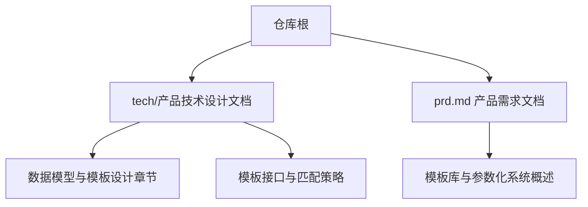
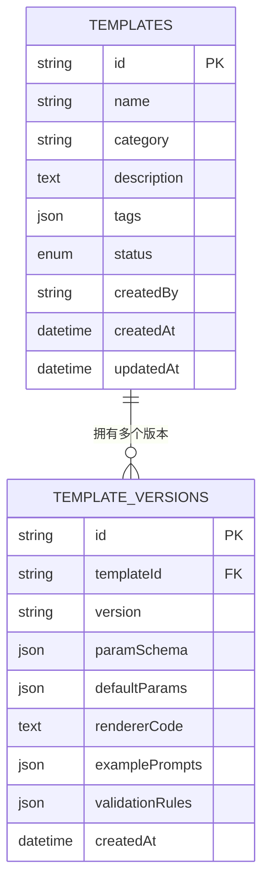
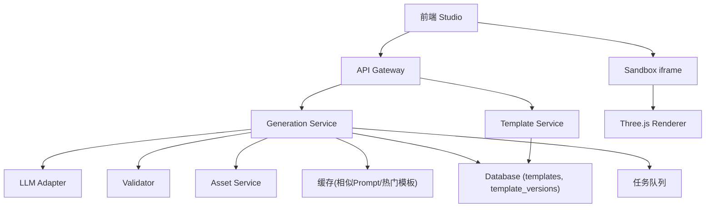
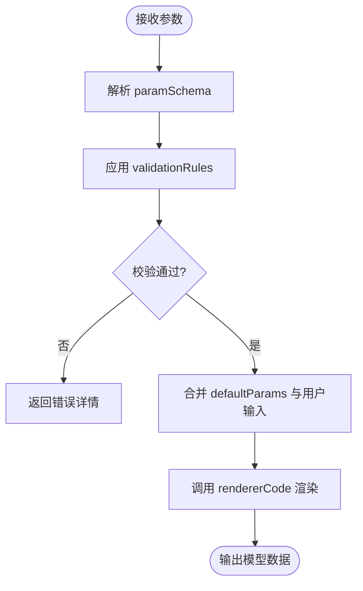
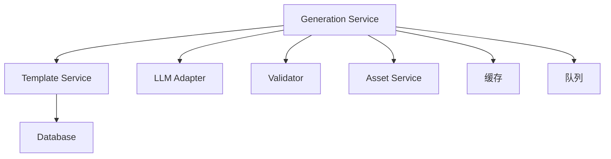

# 模板系统模型

<cite>
**本文引用的文件**   
- [产品技术设计文档](file://tech/product-technical-design.md)
- [产品需求文档](file://prd.md)
</cite>

## 目录
1. [引言](#引言)
2. [项目结构](#项目结构)
3. [核心组件](#核心组件)
4. [架构总览](#架构总览)
5. [详细组件分析](#详细组件分析)
6. [依赖关系分析](#依赖关系分析)
7. [性能考量](#性能考量)
8. [故障排查指南](#故障排查指南)
9. [结论](#结论)
10. [附录](#附录)

## 引言
本文件聚焦 ApexForge 的“模板系统数据模型”，围绕 templates、template_versions 表的设计展开，覆盖模板版本管理、参数 Schema 定义与校验、渲染函数存储、分类体系与标签、状态控制（draft、published、deprecated）、示例 Prompt 集合、模板匹配元数据、语义化版本规范、向后兼容性保证以及面向模板市场的生态支持。内容基于仓库中的产品与技术设计文档进行系统化梳理与扩展说明，便于研发、产品与运营团队统一理解与落地。

## 项目结构
仓库包含两份关键文档：
- 产品需求文档：阐述平台目标、核心能力、安全与性能策略等。
- 产品技术设计文档：给出领域模型、数据表设计、生成链路、模板系统设计、API 契约、质量评分与安全策略等。



**图表来源** 
- [产品技术设计文档:174-325](file://tech/product-technical-design.md#L174-L325)
- [产品技术设计文档:760-805](file://tech/product-technical-design.md#L760-L805)
- [产品需求文档:94-104](file://prd.md#L94-L104)

**章节来源**
- [产品技术设计文档:174-325](file://tech/product-technical-design.md#L174-L325)
- [产品需求文档:94-104](file://prd.md#L94-L104)

## 核心组件
本节聚焦模板系统的核心数据实体与字段设计，并解释其职责与约束。

- 模板主表 templates
  - 作用：描述模板元信息、分类、标签、生命周期状态等。
  - 关键字段：id、name、category、description、tags、status、createdBy、createdAt、updatedAt。
  - 状态枚举：draft、published、deprecated。
  - 标签与分类：用于检索、筛选与推荐；tags 为 JSON 数组，category 为字符串分类键。

- 模板版本表 template_versions
  - 作用：承载具体可执行与可配置内容，包括参数 Schema、默认参数、渲染函数代码、示例 Prompt、参数校验规则等。
  - 关键字段：id、templateId、version、paramSchema、defaultParams、rendererCode、examplePrompts、validationRules、createdAt。
  - 版本标识：version 采用语义化版本（如 1.0.0），便于演进与兼容管理。
  - 参数 Schema：JSON 结构，定义参数类型、格式、范围、默认值等。
  - 渲染函数：rendererCode 为服务端或沙箱执行的渲染逻辑入口。
  - 示例 Prompt：examplePrompts 提供引导用户快速使用的提示样例。
  - 校验规则：validationRules 对参数进行强约束，确保生成稳定性。

- 关联关系
  - 一对多：templates → template_versions。
  - 通过 templateId 建立外键关联，确保版本归属明确。



**图表来源** 
- [产品技术设计文档:270-297](file://tech/product-technical-design.md#L270-L297)

**章节来源**
- [产品技术设计文档:270-297](file://tech/product-technical-design.md#L270-L297)

## 架构总览
模板系统在整体架构中作为“可控生成”的关键支撑，与生成服务、模板匹配器、LLM 适配器、校验器、资产与版本管理等模块协作。



**图表来源** 
- [产品技术设计文档:38-62](file://tech/product-technical-design.md#L38-L62)
- [产品技术设计文档:594-610](file://tech/product-technical-design.md#L594-L610)

## 详细组件分析

### 模板分类体系与标签管理
- 分类（category）
  - 用于模板分组与检索，例如 vehicle、building、aircraft、furniture、prop 等。
  - 建议维护分类字典与层级映射，便于前端筛选与推荐。
- 标签（tags）
  - JSON 数组，支持多维度标记，如风格（sci-fi、retro）、材质（metal、glass）、复杂度（low、medium、high）。
  - 可用于向量检索前的粗筛与排序权重调整。
- 状态（status）
  - draft：未发布，仅供内部编辑与测试。
  - published：对外可用，参与匹配与推荐。
  - deprecated：已废弃，保留历史引用但不参与新匹配。

**章节来源**
- [产品技术设计文档:270-283](file://tech/product-technical-design.md#L270-L283)

### 模板版本管理与语义化规范
- 版本标识（version）
  - 采用语义化版本（major.minor.patch），遵循向后兼容原则：
    - major：破坏性变更（如 paramSchema 不兼容、rendererCode 接口变更）。
    - minor：新增兼容特性（如新增可选参数、新增示例 Prompt）。
    - patch：修复问题（如修正默认值、修复校验规则）。
- 版本选择策略
  - 默认使用最新 published 版本。
  - 当命中模板时记录 templateVersionId，便于追溯与回滚。
- 版本归档与迁移
  - 废弃版本保留但不再参与匹配。
  - 提供迁移脚本与兼容性层，确保旧版本渲染结果仍可加载。

**章节来源**
- [产品技术设计文档:284-297](file://tech/product-technical-design.md#L284-L297)

### 参数 Schema 定义与验证规则
- 参数 Schema（paramSchema）
  - 定义每个参数的类型、格式、取值范围、默认值、必填性等。
  - 示例类型：string（含 color 格式）、number（含 min/max）、boolean、enum。
- 默认参数（defaultParams）
  - 提供开箱即用的参数组合，降低用户上手成本。
- 校验规则（validationRules）
  - 在服务端与前端同时生效，确保输入合法。
  - 支持自定义校验函数（在受控环境中执行），返回错误消息。
- 参数编辑器
  - 根据 paramSchema 动态生成表单，支持实时预览与二次生成。



**图表来源** 
- [产品技术设计文档:284-297](file://tech/product-technical-design.md#L284-L297)

**章节来源**
- [产品技术设计文档:284-297](file://tech/product-technical-design.md#L284-L297)

### 渲染函数存储与执行
- 渲染函数（rendererCode）
  - 服务端或沙箱执行的函数入口，负责将参数转换为 Three.js 对象。
  - 需符合固定签名约定（如 buildModel(params, THREE)），并在白名单 API 范围内操作。
- 执行环境
  - 服务端 AST 校验与黑名单扫描。
  - 客户端 iframe 沙箱隔离执行，限制网络与 DOM 访问。
- 结果序列化
  - 渲染成功后序列化为 Object3D JSON，供前端加载与展示。

```mermaid
sequenceDiagram
participant Client as "前端"
participant API as "API Gateway"
participant TPL as "Template Service"
participant GEN as "Generation Service"
participant DB as "数据库"
participant BOX as "Sandbox iframe"
Client->>API : POST /api/v1/templates/{id}/render
API->>TPL : 查询模板与最新版本
TPL->>DB : SELECT template_versions WHERE templateId=? ORDER BY version DESC LIMIT 1
DB-->>TPL : 返回 paramSchema/defaultParams/rendererCode
TPL-->>API : 模板版本信息
API->>GEN : 执行渲染流程
GEN->>BOX : 发送 {code, params, timeoutMs}
BOX-->>GEN : 返回模型 JSON 或错误
GEN-->>API : 组装响应
API-->>Client : 返回渲染结果
```

**图表来源** 
- [产品技术设计文档:724-733](file://tech/product-technical-design.md#L724-L733)
- [产品技术设计文档:498-507](file://tech/product-technical-design.md#L498-L507)

**章节来源**
- [产品技术设计文档:724-733](file://tech/product-technical-design.md#L724-L733)
- [产品技术设计文档:498-507](file://tech/product-technical-design.md#L498-L507)

### 示例 Prompt 集合与模板匹配元数据
- 示例 Prompt（examplePrompts）
  - 提供高质量提示样例，帮助用户快速体验模板效果。
  - 可与分类、标签结合，形成“按类别+风格”的推荐集。
- 模板匹配元数据
  - 结合 category、tags、paramSchema 摘要与向量特征，提升候选召回率。
  - 匹配策略：关键词抽取 + 向量检索 + LLM 选择，置信度低于阈值则降级到 Hybrid 或 Code Mode。

**章节来源**
- [产品技术设计文档:284-297](file://tech/product-technical-design.md#L284-L297)
- [产品技术设计文档:797-804](file://tech/product-technical-design.md#L797-L804)

### 状态控制与生命周期
- 模板状态
  - draft：仅管理员可见与编辑。
  - published：开放检索与渲染。
  - deprecated：保留历史引用，不参与新匹配。
- 版本状态
  - 与模板状态联动，published 模板至少存在一个 published 版本。
  - 废弃模板可保留历史版本用于审计与回滚。

**章节来源**
- [产品技术设计文档:270-283](file://tech/product-technical-design.md#L270-L283)

### 向后兼容性保证
- Schema 兼容
  - 新增可选参数不影响旧版本渲染。
  - 移除或重命名参数需升级 major 版本并提供迁移脚本。
- 渲染函数兼容
  - 保持 buildModel 签名稳定，新增能力以可选参数形式暴露。
  - 提供兼容层适配不同 major 版本的差异。
- 数据迁移
  - 提供模板版本迁移工具，自动补齐缺失字段与默认值。

**章节来源**
- [产品技术设计文档:284-297](file://tech/product-technical-design.md#L284-L297)

### 模板市场生态支持
- 模板上架与审核
  - 创作者提交模板至草稿态，经审核后发布。
  - 支持版本迭代与回滚，保留变更记录。
- 发现与推荐
  - 基于分类、标签、示例 Prompt 与用户反馈进行推荐。
  - 提供评分与热度指标，辅助决策。
- 开放 API
  - 提供模板列表、详情、渲染接口，支持第三方集成。
  - 配额与限流保障平台稳定性。

**章节来源**
- [产品技术设计文档:724-733](file://tech/product-technical-design.md#L724-L733)

## 依赖关系分析
模板系统与生成链路的依赖关系如下：



**图表来源** 
- [产品技术设计文档:594-610](file://tech/product-technical-design.md#L594-L610)

**章节来源**
- [产品技术设计文档:594-610](file://tech/product-technical-design.md#L594-L610)

## 性能考量
- 缓存策略
  - 热门模板与参数 Schema 缓存于 Redis，减少数据库压力。
  - 相似 Prompt 缓存复用结果，避免重复 LLM 调用。
- 渲染优化
  - 模板模式跳过 LLM 代码生成，直接参数化渲染，耗时显著降低。
  - 前端按需加载 Three.js runtime，大模型解析移至 Worker。
- 数据库优化
  - 为常用查询字段建索引（如 workspaceId、projectId、updatedAt）。
  - 大字段（代码、模型 JSON、截图）迁移至对象存储，仅保存 URL 与摘要。

**章节来源**
- [产品技术设计文档:933-958](file://tech/product-technical-design.md#L933-L958)

## 故障排查指南
- 常见错误码与处理
  - SANDBOX_TIMEOUT：执行超时，检查模型复杂度与超时阈值。
  - SANDBOX_RUNTIME_ERROR：运行时报错，查看 AST 校验与黑名单日志。
  - MODEL_JSON_INVALID：返回结构非法，核对 rendererCode 输出协议。
  - MODEL_TOO_COMPLEX：复杂度超限，建议使用模板模式或简化参数。
  - MODEL_EMPTY：未生成有效对象，补充描述或使用示例 Prompt。
- 定位步骤
  - 通过 traceId 追踪全链路日志。
  - 检查模板版本信息与 paramSchema 是否匹配。
  - 复核 validationRules 与 defaultParams 配置。
  - 审查 LLM 输出与 Validator 报告。

**章节来源**
- [产品技术设计文档:508-517](file://tech/product-technical-design.md#L508-L517)
- [产品技术设计文档:882-897](file://tech/product-technical-design.md#L882-L897)

## 结论
ApexForge 的模板系统以 templates 与 template_versions 为核心，通过严格的参数 Schema、校验规则与渲染函数管理，实现高稳定性的程序化 3D 模型生成。配合分类、标签、示例 Prompt 与匹配元数据，构建出可扩展的模板市场生态。语义化版本与向后兼容策略保障了长期演进的可维护性，而缓存、沙箱与质量评分体系共同提升了性能与用户体验。

## 附录

### 模板接口清单
- GET /api/v1/templates：查询模板列表
- GET /api/v1/templates/{id}：查询模板详情
- POST /api/v1/templates/{id}/render：使用模板与参数生成模型
- POST /api/v1/templates：创建模板（管理端权限）
- POST /api/v1/templates/{id}/versions：发布模板版本

**章节来源**
- [产品技术设计文档:724-733](file://tech/product-technical-design.md#L724-L733)

### 模板分层与示例
- 分层：Skeleton、Style Variant、Detail Pack、Material Preset、Param Schema
- 示例 Prompt：按类别与风格组织，提供快速上手路径

**章节来源**
- [产品技术设计文档:787-796](file://tech/product-technical-design.md#L787-L796)