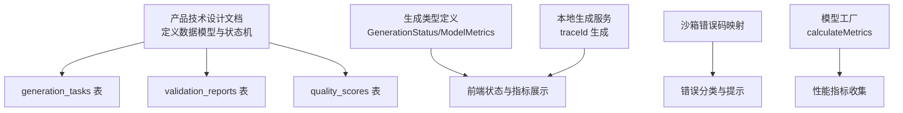
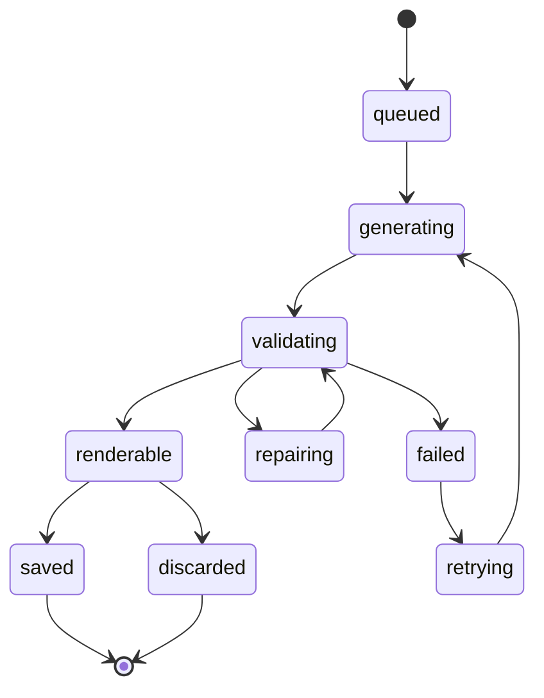
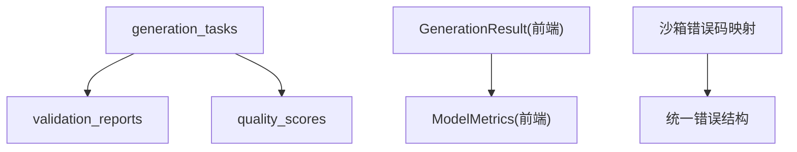

# 生成任务模型

<cite>
**本文引用的文件**   
- [产品技术设计文档](file://tech/product-technical-design.md)
- [生成类型定义](file://src/shared/types/generation.ts)
- [通用响应与错误类型](file://src/shared/types/common.ts)
- [本地生成服务（前端）](file://src/modules/studio/services/generationService.ts)
- [沙箱错误码映射](file://src/modules/sandbox/errorMapper.ts)
- [模型工厂与指标计算](file://src/modules/viewer/utils/modelFactory.ts)
- [工作室页面（状态流转演示）](file://src/modules/studio/pages/StudioPage.tsx)
</cite>

## 目录
1. [引言](#引言)
2. [项目结构](#项目结构)
3. [核心组件](#核心组件)
4. [架构总览](#架构总览)
5. [详细组件分析](#详细组件分析)
6. [依赖关系分析](#依赖关系分析)
7. [性能考量](#性能考量)
8. [故障排查指南](#故障排查指南)
9. [结论](#结论)
10. [附录](#附录)

## 引言
本文件面向 ApexForge 的“生成任务数据模型”，聚焦以下目标：
- 详细说明 generation_tasks、validation_reports、quality_scores 三张表的设计要点与字段语义。
- 解释生成模式（code、template、hybrid）的数据结构与 Prompt 记录及归一化处理策略。
- 明确任务追踪 ID、错误码体系、执行时间统计与性能指标收集方式。
- 给出任务状态机、重试机制与失败处理策略，并配套可视化图示帮助理解。

## 项目结构
围绕生成任务的数据模型，仓库中相关设计与实现主要分布在：
- 产品与技术设计文档：定义领域模型、数据库表结构、状态机与时序流程。
- 前端共享类型：定义 GenerationStatus、ModelMetrics、GenerationResult 等关键类型。
- 前端服务与页面：展示 traceId 生成、状态推进与质量指标展示。
- 沙箱错误映射：定义运行时错误码与用户提示。
- 模型工厂：提供几何体复杂度与评分指标的采集逻辑。



图表来源
- [产品技术设计文档:215-324](file://tech/product-technical-design.md#L215-L324)
- [生成类型定义:1-28](file://src/shared/types/generation.ts#L1-L28)
- [本地生成服务（前端）:1-29](file://src/modules/studio/services/generationService.ts#L1-L29)
- [沙箱错误码映射:1-12](file://src/modules/sandbox/errorMapper.ts#L1-L12)
- [模型工厂与指标计算:43-59](file://src/modules/viewer/utils/modelFactory.ts#L43-L59)

章节来源
- [产品技术设计文档:174-324](file://tech/product-technical-design.md#L174-L324)
- [生成类型定义:1-28](file://src/shared/types/generation.ts#L1-L28)
- [本地生成服务（前端）:1-29](file://src/modules/studio/services/generationService.ts#L1-L29)
- [沙箱错误码映射:1-12](file://src/modules/sandbox/errorMapper.ts#L1-L12)
- [模型工厂与指标计算:43-59](file://src/modules/viewer/utils/modelFactory.ts#L43-L59)

## 核心组件
- generation_tasks：承载一次生成任务的完整上下文，包括模式、状态、Prompt、模板信息、生成产物、错误信息与时间戳。
- validation_reports：记录代码与参数校验结果，包含通过性、阻断原因、警告、复杂度与 AST 摘要。
- quality_scores：记录多维质量评分，包括可渲染分、结构分、Prompt 匹配分、性能分与总分，以及评分详情。

上述三表共同构成“生成—校验—评分”的数据闭环，支撑后续的质量分析与优化。

章节来源
- [产品技术设计文档:215-324](file://tech/product-technical-design.md#L215-L324)

## 架构总览
从端到端视角，生成任务涉及前端交互、API 网关、生成编排、LLM 适配、校验器、评分器、存储与沙箱执行。下图展示了关键组件与数据流向。

```mermaid
sequenceDiagram
participant FE as "前端"
participant API as "API 网关"
participant GEN as "生成服务"
participant TPL as "模板服务"
participant LLM as "LLM 适配器"
participant VAL as "校验器"
participant DB as "数据库"
participant BOX as "沙箱 iframe"
FE->>API : "创建生成任务"
API->>GEN : "createGenerationTask"
GEN->>TPL : "候选模板匹配"
TPL-->>GEN : "模板候选"
GEN->>LLM : "生成代码或参数"
LLM-->>GEN : "输出"
GEN->>VAL : "安全与结构校验"
VAL-->>GEN : "校验报告"
GEN->>DB : "持久化任务与报告"
GEN-->>API : "返回结果"
API-->>FE : "生成载荷"
FE->>BOX : "在 iframe 执行"
BOX-->>FE : "模型 JSON 或错误"
```

图表来源
- [产品技术设计文档:359-390](file://tech/product-technical-design.md#L359-L390)

## 详细组件分析

### 数据模型：generation_tasks
- 关键字段
  - id：任务唯一标识
  - traceId：全链路追踪 ID，贯穿前后端与日志系统
  - workspaceId/projectId/userId：归属与发起者
  - mode：生成模式 code/template/hybrid
  - status：任务状态（queued、generating、validating、renderable、failed 等）
  - prompt/normalizedPrompt：原始输入与归一化后的 Prompt
  - templateId/templateVersionId：命中模板与版本
  - generatedCode/generatedParams：生成代码或参数
  - errorCode/errorMessage：错误码与错误信息
  - startedAt/completedAt/createdAt：时间戳用于耗时统计
- 设计要点
  - 使用 UUID/CUID 作为主键，避免自增依赖
  - normalizedPrompt 用于相似度缓存与回归测试
  - errorCode 与 errorMessage 配合统一错误结构，便于前端展示与告警
  - 时间戳支持端到端耗时统计与 SLA 监控

章节来源
- [产品技术设计文档:215-237](file://tech/product-technical-design.md#L215-L237)
- [通用响应与错误类型:1-11](file://src/shared/types/common.ts#L1-L11)

### 数据模型：validation_reports
- 关键字段
  - id：报告唯一标识
  - generationTaskId：关联任务
  - passed：是否通过
  - blockedReasons/warnings：阻断原因与警告列表
  - complexity/astSummary：复杂度与 AST 摘要
  - createdAt：创建时间
- 设计要点
  - 分层校验：协议校验、文本黑名单、AST 白名单、运行时沙箱、结果校验
  - 结构化保存：JSON 字段便于查询与分析
  - 与任务强关联：便于回溯与审计

章节来源
- [产品技术设计文档:298-310](file://tech/product-technical-design.md#L298-L310)

### 数据模型：quality_scores
- 关键字段
  - id：评分唯一标识
  - generationTaskId：关联任务
  - totalScore/renderabilityScore/structureScore/promptMatchScore/performanceScore：多维评分
  - details：评分详情（如 Mesh/Vertices/Materials 等）
  - createdAt：创建时间
- 设计要点
  - 指标来源：前端 calculateMetrics 与后端评分器结合
  - 阈值与回滚：低分触发人工审核或自动降级策略
  - 与 Prompt 版本联动：评估 Prompt 变更对质量的影响

章节来源
- [产品技术设计文档:311-324](file://tech/product-technical-design.md#L311-L324)
- [模型工厂与指标计算:43-59](file://src/modules/viewer/utils/modelFactory.ts#L43-L59)

### 生成模式与数据结构
- 模式说明
  - code：AI 生成完整 Three.js 函数
  - template：AI 仅生成模板参数
  - hybrid：AI 选择模板并补充局部代码
- 数据结构
  - 输出协议包含 mode、templateId、params、code、explanation、warnings 等字段
  - 模板版本包含 paramSchema、defaultParams、rendererCode、examplePrompts、validationRules
- 设计要点
  - 优先 Template/Hybrid，必要时 Code；Cache Mode 命中直接复用
  - 模板参数 Schema 驱动动态表单与二次编辑

章节来源
- [产品技术设计文档:329-338](file://tech/product-technical-design.md#L329-L338)
- [产品技术设计文档:284-297](file://tech/product-technical-design.md#L284-L297)

### Prompt 记录与归一化处理
- 记录内容
  - prompt：用户原始输入
  - normalizedPrompt：去噪、标准化后的 Prompt（用于相似度检索与回归）
  - promptVersion：Prompt 模板版本（System Prompt、Few-shot、模板摘要）
- 归一化策略
  - 去除多余空白与无关字符
  - 类别识别与关键词抽取
  - 同义替换与单位标准化
  - 与模板元数据对齐（category、tags）
- 版本管理
  - 每次生成记录 promptVersion
  - 质量回归按版本执行，支持快速回滚

章节来源
- [产品技术设计文档:215-237](file://tech/product-technical-design.md#L215-L237)
- [产品技术设计文档:392-425](file://tech/product-technical-design.md#L392-L425)

### 任务追踪 ID、错误码与执行时间统计
- 追踪 ID
  - traceId 贯穿请求、任务、日志与事件流，便于全链路定位
  - 前端示例：生成 traceId 并在 UI 展示
- 错误码
  - 统一错误结构包含 code/message/details
  - 沙箱错误码：SANDBOX_TIMEOUT、SANDBOX_RUNTIME_ERROR、MODEL_JSON_INVALID
- 执行时间统计
  - startedAt/completedAt/createdAt 用于端到端耗时
  - SSE 事件推送 queued/generating/validating/repairing/renderable/failed 阶段

章节来源
- [本地生成服务（前端）:1-29](file://src/modules/studio/services/generationService.ts#L1-L29)
- [通用响应与错误类型:1-11](file://src/shared/types/common.ts#L1-L11)
- [沙箱错误码映射:1-12](file://src/modules/sandbox/errorMapper.ts#L1-L12)
- [产品技术设计文档:734-757](file://tech/product-technical-design.md#L734-L757)

### 任务状态机与流转规则
- 状态集合
  - queued → generating → validating → renderable → saved/discard
  - validating 可进入 repairing 再回到 validating
  - failed 可进入 retrying 再回到 generating
- 流转规则
  - 校验失败且不可修复则标记 failed
  - 可修复路径走 repairing 再次验证
  - 成功渲染后保存为资产或丢弃
- 前端演示
  - 页面模拟状态推进与最终 renderable 结果



图表来源
- [产品技术设计文档:340-357](file://tech/product-technical-design.md#L340-L357)
- [工作室页面（状态流转演示）:51-79](file://src/modules/studio/pages/StudioPage.tsx#L51-L79)

章节来源
- [产品技术设计文档:340-357](file://tech/product-technical-design.md#L340-L357)
- [工作室页面（状态流转演示）:51-79](file://src/modules/studio/pages/StudioPage.tsx#L51-L79)

### 重试机制与失败处理策略
- 重试策略
  - 校验失败但可修复：进入 repairing，重新生成或修补后再次校验
  - 最大重试次数限制，防止无限循环
  - 失败进入 retrying，根据错误码决定重试或终止
- 失败处理
  - 记录 errorCode/errorMessage 与 validationReports.qualityScores
  - 前端展示友好提示，引导用户降低复杂度或切换模式
  - 超时与运行时报错由沙箱错误码映射统一处理

章节来源
- [产品技术设计文档:340-357](file://tech/product-technical-design.md#L340-L357)
- [沙箱错误码映射:1-12](file://src/modules/sandbox/errorMapper.ts#L1-L12)

### 性能指标收集与可视化
- 指标维度
  - meshes/vertices/materials/score：几何体数量、顶点数、材质数与综合评分
  - 评分算法：基于 mesh 数量估算，范围限定在合理区间
- 数据来源
  - 前端 calculateMetrics 遍历 Group 统计
  - 后端 qualityScorer 结合 AST 与运行时结果进行综合评分
- 可视化
  - 前端卡片展示 Mesh/Vertices/Materials/Score
  - 历史列表与详情页保留指标快照

章节来源
- [模型工厂与指标计算:43-59](file://src/modules/viewer/utils/modelFactory.ts#L43-L59)
- [工作室页面（状态流转演示）:171-185](file://src/modules/studio/pages/StudioPage.tsx#L171-L185)

## 依赖关系分析
- 模块耦合
  - generation_tasks 与 validation_reports、quality_scores 通过 generationTaskId 关联
  - 前端 GenerationResult 与 ModelMetrics 对应数据库 metrics 与 qualityScores.details
  - 沙箱错误码映射与统一错误结构协同，形成一致的失败处理体验
- 外部依赖
  - LLM 适配器、模板服务、校验器、评分器、存储与队列
- 潜在风险
  - 过度依赖前端指标可能导致不一致，建议服务端也计算并落库
  - 错误码需持续维护，避免歧义与遗漏



图表来源
- [产品技术设计文档:215-324](file://tech/product-technical-design.md#L215-L324)
- [生成类型定义:1-28](file://src/shared/types/generation.ts#L1-L28)
- [沙箱错误码映射:1-12](file://src/modules/sandbox/errorMapper.ts#L1-L12)
- [通用响应与错误类型:1-11](file://src/shared/types/common.ts#L1-L11)

章节来源
- [产品技术设计文档:215-324](file://tech/product-technical-design.md#L215-L324)
- [生成类型定义:1-28](file://src/shared/types/generation.ts#L1-L28)
- [沙箱错误码映射:1-12](file://src/modules/sandbox/errorMapper.ts#L1-L12)
- [通用响应与错误类型:1-11](file://src/shared/types/common.ts#L1-L11)

## 性能考量
- 指标采集
  - 前端遍历 Group 统计 Mesh/Vertices/Materials，时间复杂度 O(n)，n 为节点数
  - 评分公式限制在合理区间，避免极端值影响
- 缓存与复用
  - 相似 Prompt 命中缓存直接返回，减少 LLM 调用
  - 模板模式仅需参数生成，显著降低延迟
- 资源释放
  - 旧模型 dispose geometry/material/texture，避免内存泄漏
  - 页面不可见时暂停渲染循环

[本节为通用指导，不直接分析具体文件]

## 故障排查指南
- 常见问题
  - 执行超时：SANDBOX_TIMEOUT，检查模型复杂度与超时阈值
  - 运行时报错：SANDBOX_RUNTIME_ERROR，查看 validationReports.blockedReasons 与 warnings
  - 模型 JSON 无效：MODEL_JSON_INVALID，确认生成协议与序列化过程
- 排查步骤
  - 通过 traceId 定位全链路日志与事件
  - 查看 generation_tasks.errorCode/errorMessage 与 validationReports.astSummary
  - 对比 qualityScores.details 中的指标变化，判断是否因复杂度导致失败
- 恢复策略
  - 降低复杂度或切换至模板模式
  - 触发 repairing 路径进行自动修复与重试
  - 若多次失败，转入人工审核与 Prompt 版本回滚

章节来源
- [沙箱错误码映射:1-12](file://src/modules/sandbox/errorMapper.ts#L1-L12)
- [产品技术设计文档:298-324](file://tech/product-technical-design.md#L298-L324)

## 结论
ApexForge 的生成任务数据模型以 generation_tasks、validation_reports、quality_scores 为核心，构建了从生成到校验再到评分的完整闭环。通过明确的生成模式、Prompt 归一化、追踪 ID 与错误码体系，以及完善的状态机与重试策略，平台能够在保证安全与稳定的前提下持续提升生成质量与用户体验。

[本节为总结性内容，不直接分析具体文件]

## 附录
- 术语
  - 生成模式：code/template/hybrid
  - 追踪 ID：traceId
  - 沙箱错误码：SANDBOX_TIMEOUT/SANDBOX_RUNTIME_ERROR/MODEL_JSON_INVALID
- 参考接口
  - 创建生成任务、查询任务、保存资产、模板接口与 SSE 事件详见产品技术设计文档

章节来源
- [产品技术设计文档:632-757](file://tech/product-technical-design.md#L632-L757)