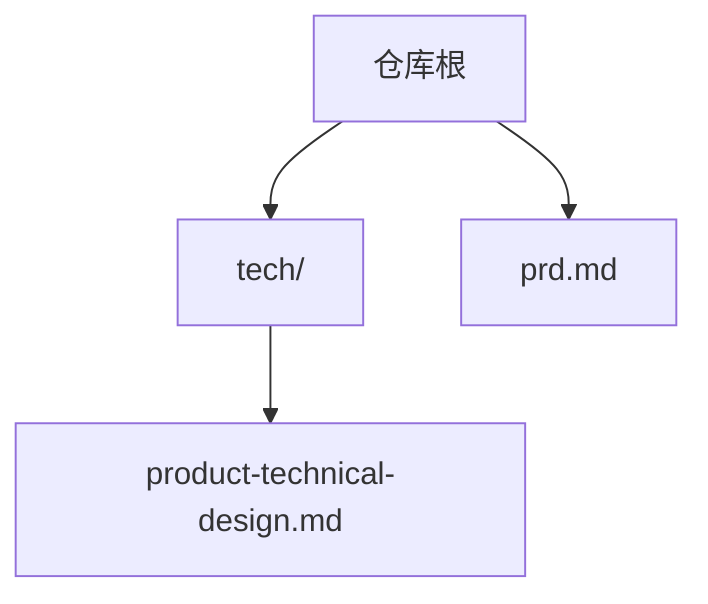
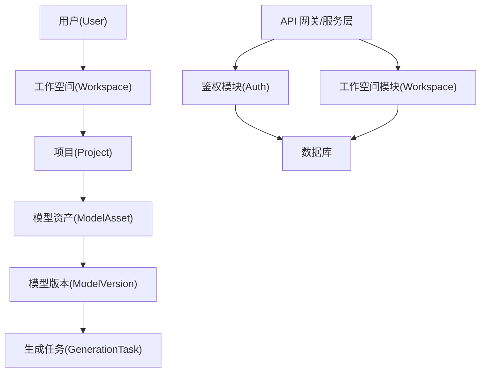
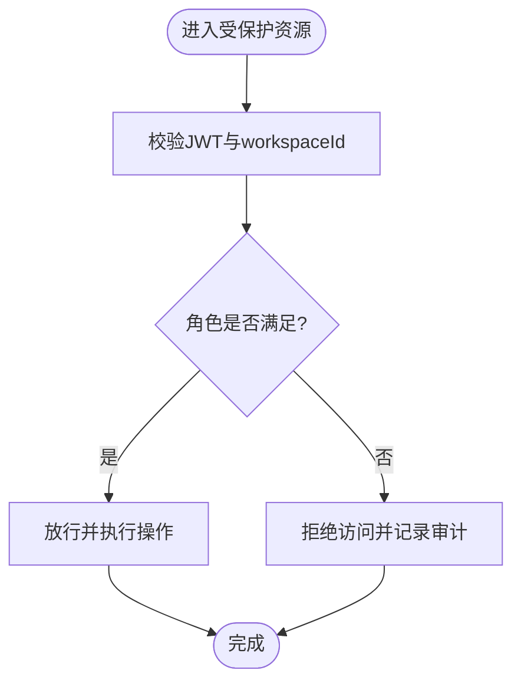
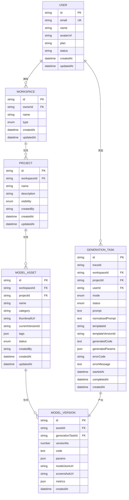

# 用户与空间模型

<cite>
**本文引用的文件**   
- [产品技术设计文档](file://tech/product-technical-design.md)
- [产品需求文档](file://prd.md)
</cite>

## 目录
1. [引言](#引言)
2. [项目结构](#项目结构)
3. [核心组件](#核心组件)
4. [架构总览](#架构总览)
5. [详细组件分析](#详细组件分析)
6. [依赖关系分析](#依赖关系分析)
7. [性能考虑](#性能考虑)
8. [故障排查指南](#故障排查指南)
9. [结论](#结论)
10. [附录](#附录)

## 引言
本章节聚焦 ApexForge 的用户与空间数据模型，围绕 users、workspaces 表的结构设计展开，说明字段定义、数据类型选择、约束条件与业务含义；并在此基础上解释用户身份管理、工作空间权限控制、成员关系与访问控制机制。同时覆盖用户注册登录流程、工作空间创建与管理、权限继承与共享策略，以及用户状态管理、套餐类型配置与工作空间类型（personal、team、enterprise）的实现方案。

## 项目结构
本项目为设计与规划阶段仓库，包含产品需求与技术设计文档，用于指导后续工程落地。当前仓库不包含数据库迁移脚本或 ORM 实体代码，因此本节仅对文档中涉及的数据模型进行梳理与解读。

图表来源
- [产品技术设计文档](file://tech/product-technical-design.md)
- [产品需求文档](file://prd.md)

章节来源
- [产品技术设计文档:1-120](file://tech/product-technical-design.md#L1-L120)
- [产品需求文档:1-60](file://prd.md#L1-L60)

## 核心组件
本节从领域模型出发，聚焦用户与空间相关实体及其关系，明确在平台化目标下的数据模型与权限边界。

- 用户（User）：平台主体，承载认证信息、基础资料、套餐与状态等。
- 工作空间（Workspace）：资源隔离与协作边界，支持 personal、team、enterprise 三种类型。
- 项目（Project）、资产（ModelAsset）、版本（ModelVersion）、生成任务（GenerationTask）等：属于空间内资源，受空间权限控制。

章节来源
- [产品技术设计文档:132-172](file://tech/product-technical-design.md#L132-L172)

## 架构总览
下图展示用户与空间在整体系统中的位置，以及与鉴权、资源访问的关系。

图表来源
- [产品技术设计文档:153-172](file://tech/product-technical-design.md#L153-L172)

## 详细组件分析

### 用户表（users）
- 字段与类型
  - id：字符串，主键，全局唯一标识用户。
  - email：字符串，邮箱地址，建议唯一索引，作为登录名与通知渠道。
  - name：字符串，显示昵称。
  - avatarUrl：字符串，头像链接。
  - plan：字符串，套餐类型，如 free、pro、enterprise 等，用于配额与功能开关。
  - status：字符串，账户状态，如 active、disabled，用于账号生命周期管理。
  - createdAt：时间戳，创建时间。
  - updatedAt：时间戳，更新时间。
- 约束与索引
  - id 为主键。
  - email 建议唯一索引，避免重复注册。
  - status 可建普通索引以支持按状态筛选。
- 业务含义
  - plan 决定用户的配额、可用模板与高级能力。
  - status 控制登录与访问能力，disabled 状态下禁止新建会话与调用接口。
- 实现要点
  - 使用 UUID/CUID 作为 id，便于跨环境迁移与分布式场景。
  - 密码哈希存储，敏感字段脱敏输出。
  - 审计日志记录关键变更（如 plan/status）。

章节来源
- [产品技术设计文档:178-190](file://tech/product-technical-design.md#L178-L190)

### 工作空间表（workspaces）
- 字段与类型
  - id：字符串，主键，全局唯一标识空间。
  - ownerId：字符串，所有者用户 ID，外键关联 users.id。
  - name：字符串，空间名称。
  - type：字符串，空间类型，枚举值 personal、team、enterprise。
  - createdAt：时间戳，创建时间。
  - updatedAt：时间戳，更新时间。
- 约束与索引
  - id 为主键。
  - ownerId 建立外键约束，确保归属关系有效。
  - type 可建普通索引，便于按类型统计与过滤。
- 业务含义
  - personal：个人空间，默认由用户注册后自动创建，资源私有。
  - team：团队空间，支持多成员协作，具备角色与权限体系。
  - enterprise：企业空间，在 team 基础上增强安全、合规与审计能力。
- 实现要点
  - 创建用户时自动生成 personal 空间，ownerId 指向该用户。
  - 空间类型影响默认可见性、配额上限与功能开关。
  - 删除用户时需处理其 personal 空间的资源迁移或回收策略。

章节来源
- [产品技术设计文档:191-201](file://tech/product-technical-design.md#L191-L201)

### 用户身份管理与登录流程
- 身份来源
  - 邮箱+密码本地认证，或第三方 OAuth（预留扩展点）。
- 登录流程
  - 客户端提交邮箱与密码至鉴权接口。
  - 服务端校验用户存在且 status=active。
  - 验证密码哈希，签发 JWT（含 userId、workspaceId、role 等声明）。
  - 返回 token 与会话信息，前端保存并在后续请求携带。
- 登出与刷新
  - 提供登出接口使 token 失效（黑名单或短期 TTL）。
  - 支持 refresh token 机制延长会话。
- 安全要求
  - 传输层强制 HTTPS。
  - 密码采用强哈希算法（如 bcrypt/argon2）。
  - 失败次数限制与验证码防刷。

章节来源
- [产品技术设计文档:576-593](file://tech/product-technical-design.md#L576-L593)
- [产品技术设计文档:632-658](file://tech/product-technical-design.md#L632-L658)

### 工作空间创建与管理
- 创建规则
  - 用户注册成功后自动创建 personal 空间，ownerId 为该用户。
  - 管理员或付费用户可创建 team/enterprise 空间。
- 空间类型差异
  - personal：默认私有，无成员管理。
  - team：支持邀请成员、角色分配、项目可见性控制。
  - enterprise：启用审计日志、数据隔离、SAML/SSO（可选）。
- 生命周期
  - 创建、更新、归档、删除。
  - 删除前需检查资源引用与成员占用，必要时迁移或冻结。

章节来源
- [产品技术设计文档:191-201](file://tech/product-technical-design.md#L191-L201)

### 权限模型与访问控制
- 角色与权限
  - Owner：空间管理、成员管理、计费、全部项目。
  - Admin：项目管理、模板管理、审核。
  - Editor：创建和编辑模型资产。
  - Viewer：查看和导出授权资产。
  - API Client：通过 API Key 调用限定能力。
- 权限粒度
  - 空间级：是否允许加入、是否可创建项目。
  - 项目级：可见性 private/shared/public。
  - 资产级：读写、导出、版本回滚。
- 权限继承
  - 项目权限继承自所属空间的角色。
  - 资产权限继承自项目，并可细化到版本级别。
- 访问控制实现
  - 基于 JWT 的 RBAC 中间件，解析 role 与 workspaceId。
  - 资源查询附加 workspaceId 与可见性过滤。
  - 操作前置校验：create/update/delete 分别校验对应角色。

图表来源
- [产品技术设计文档:846-865](file://tech/product-technical-design.md#L846-L865)

章节来源
- [产品技术设计文档:846-865](file://tech/product-technical-design.md#L846-L865)

### 成员关系与共享策略
- 成员关系
  - 通过 workspace_members 表维护用户与空间的关系及角色。
  - 支持邀请链接、邮件邀请、批量导入。
- 共享策略
  - 项目可见性：private（仅成员）、shared（指定成员/组）、public（公开只读）。
  - 资产导出：根据角色与配额决定是否允许导出 JS/JSON/截图。
- 审计与合规
  - 记录成员加入/移除、权限变更、导出行为。
  - 企业版开启细粒度审计日志与数据留存策略。

章节来源
- [产品技术设计文档:153-172](file://tech/product-technical-design.md#L153-L172)
- [产品技术设计文档:846-865](file://tech/product-technical-design.md#L846-L865)

### 用户状态管理与套餐类型配置
- 用户状态
  - active：正常登录与使用。
  - disabled：禁用，不可登录，保留历史数据。
- 套餐类型
  - plan 字段驱动配额与功能开关，如每日生成次数、并发任务数、最大复杂度、存储空间、API 调用量等。
  - 升级/降级流程：支付成功后更新 plan，并触发配额同步。
- 配额控制
  - 基于 Redis 计数器与数据库用量快照，结合限流中间件实现。
  - 超限时返回明确错误码与提示，引导升级或优化 Prompt。

章节来源
- [产品技术设计文档:178-190](file://tech/product-technical-design.md#L178-L190)
- [产品技术设计文档:856-865](file://tech/product-technical-design.md#L856-L865)

### 工作空间类型实现方案
- personal
  - 默认私有，无需成员管理。
  - 适合个人创作者与快速原型。
- team
  - 引入成员与角色，支持项目可见性与协作。
  - 适用于小型团队与工作室。
- enterprise
  - 在 team 基础上增加审计、数据隔离、SSO/SAML、合规报表。
  - 适用于企业级生产环境与合规要求。

章节来源
- [产品技术设计文档:191-201](file://tech/product-technical-design.md#L191-L201)

## 依赖关系分析
用户与工作空间与其他领域对象的依赖如下：

图表来源
- [产品技术设计文档:178-324](file://tech/product-technical-design.md#L178-L324)

章节来源
- [产品技术设计文档:178-324](file://tech/product-technical-design.md#L178-L324)

## 性能考虑
- 数据库层面
  - 为常用查询字段建立索引，如 users.email、workspaces.ownerId、projects.workspaceId、model_assets.workspaceId、generation_tasks.traceId、generation_tasks.workspaceId、generation_tasks.createdAt。
  - 大字段（代码、模型 JSON、截图 URL）建议对象存储，数据库仅存元数据。
- 缓存与限流
  - 相似 Prompt 结果缓存，降低 LLM 调用压力。
  - 基于 Redis 的配额计数与令牌桶限流，保障高并发稳定性。
- 查询优化
  - 分页与投影，避免一次性加载大量历史任务与资产。
  - 软删除与归档策略，定期清理过期数据。

[本节为通用性能建议，不直接分析具体文件]

## 故障排查指南
- 登录失败
  - 检查用户是否存在且 status=active。
  - 核对密码哈希与盐值是否正确。
  - 查看失败次数与验证码策略是否触发。
- 权限不足
  - 确认 JWT 中的 workspaceId 与 role 是否与资源匹配。
  - 检查项目可见性与资产导出权限。
- 配额超限
  - 查看 plan 与当前用量，定位是日限额还是并发限制。
  - 检查 Redis 计数器与数据库用量快照一致性。
- 审计与追踪
  - 通过 traceId 串联前后端日志，定位问题链路。
  - 关注鉴权中间件与资源访问日志。

章节来源
- [产品技术设计文档:632-658](file://tech/product-technical-design.md#L632-L658)
- [产品技术设计文档:870-907](file://tech/product-technical-design.md#L870-L907)

## 结论
ApexForge 的用户与空间模型以 users 与 workspaces 为核心，支撑个人创作与团队协作的多层次需求。通过清晰的字段定义、合理的约束与索引、完善的权限与配额体系，平台可在 MVP 阶段快速落地，并在 Scale 阶段平滑演进至企业级部署。建议在工程实现中严格遵循文档中的权限模型与安全策略，确保用户体验与系统稳定性的平衡。

[本节为总结性内容，不直接分析具体文件]

## 附录
- 术语
  - Workspace：工作空间，资源隔离与协作边界。
  - Plan：套餐类型，决定配额与功能。
  - RBAC：基于角色的访问控制。
- 参考
  - 领域模型与关系图见“核心领域模型”与“数据模型设计”章节。
  - 权限与配额设计见“权限与计费设计”章节。

章节来源
- [产品技术设计文档:132-172](file://tech/product-technical-design.md#L132-L172)
- [产品技术设计文档:174-324](file://tech/product-technical-design.md#L174-L324)
- [产品技术设计文档:844-865](file://tech/product-technical-design.md#L844-L865)