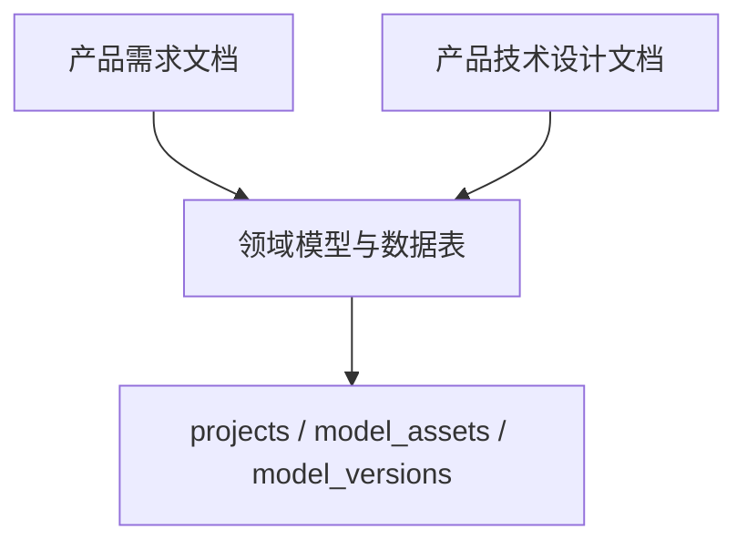
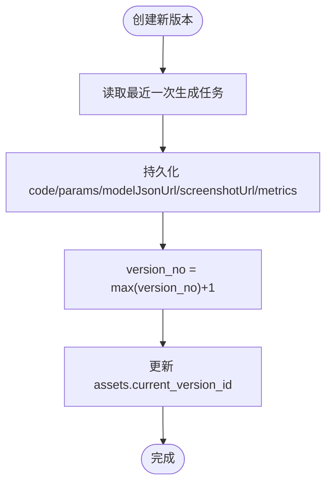
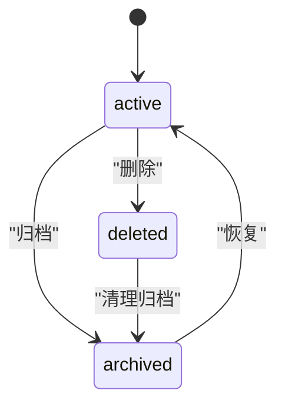
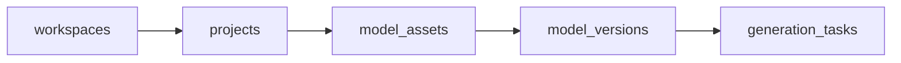

# 项目与资产模型

<cite>
**本文引用的文件**   
- [产品技术设计文档](file://tech/product-technical-design.md)
- [产品需求文档](file://prd.md)
</cite>

## 目录
1. [引言](#引言)
2. [项目结构](#项目结构)
3. [核心组件](#核心组件)
4. [架构总览](#架构总览)
5. [详细组件分析](#详细组件分析)
6. [依赖关系分析](#依赖关系分析)
7. [性能考量](#性能考量)
8. [故障排查指南](#故障排查指南)
9. [结论](#结论)
10. [附录](#附录)

## 引言
本文件聚焦于 ApexForge 的“项目与资产”数据模型，围绕 projects、model_assets、model_versions 三张核心表进行系统化说明。内容涵盖实体关系、版本管理机制、资产生命周期、项目组织结构、资产分类体系、标签系统、可见性控制、版本号生成策略、代码存储格式、参数对象结构、模型指标记录、状态管理（active/deleted/archived）、缩略图生成与文件存储策略等。文档同时给出面向不同读者的分层说明与可视化图示，帮助快速理解并落地实施。

## 项目结构
仓库包含两份关键文档：
- 产品需求文档：阐述平台目标、核心能力、前端/后端/沙箱/模板库等总体设计与流程。
- 产品技术设计文档：定义领域模型、数据表结构、API、质量评分、安全与可观测性等工程化细节。

本节仅做概览，具体字段与关系详见后续章节。

[无图表来源，因为该图为概念性结构示意]

## 核心组件
- 项目（Project）：承载一组相关模型资产的集合，具备名称、描述、可见性与创建者信息。
- 模型资产（ModelAsset）：一次成功生成的模型产物，具备名称、分类、当前版本、标签、状态与缩略图等元数据。
- 模型版本（ModelVersion）：对某一资产的具体实现快照，包含代码、参数、模型 JSON、截图与指标等。

上述三个实体构成“项目—资产—版本”的主干关系，支撑版本管理与资产生命周期。

**章节来源**
- [产品技术设计文档:202-214](file://tech/product-technical-design.md#L202-L214)
- [产品技术设计文档:238-254](file://tech/product-technical-design.md#L238-L254)
- [产品技术设计文档:255-269](file://tech/product-technical-design.md#L255-L269)

## 架构总览
从领域视角看，项目属于工作空间，资产隶属于项目，版本隶属于资产；同时每个版本来源于一次生成任务，并可关联校验报告与质量评分。

```mermaid
erDiagram
WORKSPACE {
string id PK
string owner_id
string name
enum type
datetime created_at
datetime updated_at
}
PROJECT {
string id PK
string workspace_id FK
string name
text description
enum visibility
string created_by
datetime created_at
datetime updated_at
}
MODEL_ASSET {
string id PK
string workspace_id FK
string project_id FK
string name
string category
string thumbnail_url
string current_version_id FK
json tags
enum status
string created_by
datetime created_at
datetime updated_at
}
MODEL_VERSION {
string id PK
string asset_id FK
string generation_task_id FK
number version_no
text code
json params
string model_json_url
string screenshot_url
json metrics
datetime created_at
}
GENERATION_TASK {
string id PK
string trace_id
string workspace_id FK
string project_id FK
string user_id
enum mode
enum status
text prompt
text normalized_prompt
string template_id
string template_version_id
text generated_code
json generated_params
string error_code
text error_message
datetime started_at
datetime completed_at
datetime created_at
}
WORKSPACE ||--o{ PROJECT : "拥有"
PROJECT ||--o{ MODEL_ASSET : "包含"
MODEL_ASSET ||--o{ MODEL_VERSION : "包含多个版本"
MODEL_VERSION }o--|| GENERATION_TASK : "来源于"
```

**图表来源**
- [产品技术设计文档:191-214](file://tech/product-technical-design.md#L191-L214)
- [产品技术设计文档:215-237](file://tech/product-technical-design.md#L215-L237)
- [产品技术设计文档:238-269](file://tech/product-technical-design.md#L238-L269)

**章节来源**
- [产品技术设计文档:153-170](file://tech/product-technical-design.md#L153-L170)
- [产品技术设计文档:174-269](file://tech/product-technical-design.md#L174-L269)

## 详细组件分析

### 实体关系与约束
- 一对多关系
  - 工作空间到项目：一个工作空间下可包含多个项目。
  - 项目到资产：一个项目下可包含多个模型资产。
  - 资产到版本：一个资产可拥有多个版本，current_version_id 指向最新或选定版本。
  - 版本到生成任务：每个版本由一次生成任务产出。
- 关键字段
  - 可见性（visibility）：private、shared、public，用于项目级访问控制。
  - 状态（status）：active、deleted、archived，用于资产生命周期管理。
  - 标签（tags）：JSON 数组，支持多维检索与筛选。
  - 分类（category）：用于资产归类与模板匹配。
  - 缩略图（thumbnail_url）：资产预览图，便于列表展示。
  - 指标（metrics）：几何体数量、顶点数、材质数等，用于质量评估与性能监控。

**章节来源**
- [产品技术设计文档:202-214](file://tech/product-technical-design.md#L202-L214)
- [产品技术设计文档:238-269](file://tech/product-technical-design.md#L238-L269)

### 版本管理机制
- 版本号生成策略
  - 使用递增数字 version_no 标识同一资产的不同版本。
  - 建议以“自增整数 + 唯一索引（asset_id, version_no）”保证顺序与幂等。
  - 若需语义化版本对外暴露，可在应用层维护映射（如 v1.0.0 → version_no=1）。
- 版本选择与回滚
  - current_version_id 指向当前活跃版本。
  - 通过更新 current_version_id 实现切换与回滚。
- 版本溯源
  - generation_task_id 将版本与生成链路关联，便于审计与回溯。
- 版本快照
  - code、params、model_json_url、screenshot_url、metrics 共同构成不可变快照。

**图表来源**
- [产品技术设计文档:255-269](file://tech/product-technical-design.md#L255-L269)
- [产品技术设计文档:215-237](file://tech/product-technical-design.md#L215-L237)

**章节来源**
- [产品技术设计文档:255-269](file://tech/product-technical-design.md#L255-L269)

### 资产生命周期与状态管理
- 状态枚举
  - active：正常可用。
  - deleted：逻辑删除，不再参与查询与导出。
  - archived：归档保留，降低热数据压力。
- 生命周期流转
  - 新建资产为 active。
  - 用户或系统触发删除后进入 deleted。
  - 长期未使用或合规要求可转入 archived。
- 查询与权限
  - 结合 visibility 与 workspace 权限控制可见范围。
  - deleted 资产不参与常规检索，但可通过审计接口查看。

**图表来源**
- [产品技术设计文档:238-254](file://tech/product-technical-design.md#L238-L254)

**章节来源**
- [产品技术设计文档:238-254](file://tech/product-technical-design.md#L238-L254)

### 项目组织结构与可见性控制
- 组织边界
  - 项目归属于工作空间，体现团队或个人维度隔离。
- 可见性
  - private：仅所有者与授权成员可见。
  - shared：工作空间内共享。
  - public：平台公开（需符合合规策略）。
- 权限联动
  - 结合角色（Owner/Admin/Editor/Viewer）与工作空间成员关系控制读写。

**章节来源**
- [产品技术设计文档:191-214](file://tech/product-technical-design.md#L191-L214)

### 资产分类体系与标签系统
- 分类（category）
  - 用于模板匹配与检索过滤，例如 vehicle、architecture、prop、aircraft、furniture 等。
- 标签（tags）
  - JSON 数组，支持多维度标记，如风格、用途、材质等。
  - 建议建立反向索引或全文索引以提升检索性能。

**章节来源**
- [产品技术设计文档:238-254](file://tech/product-technical-design.md#L238-L254)

### 代码存储格式与参数对象结构
- 代码（code）
  - 标准 Three.js 函数片段，遵循固定协议（buildModel 或 render），在沙箱中执行。
- 参数（params）
  - JSON 对象，对应模板参数 Schema，支持默认值与校验规则。
- 模型 JSON（model_json_url）
  - 由沙箱执行后序列化得到的 Object3D JSON，供主线程加载渲染。
- 截图（screenshot_url）
  - 渲染成功后生成的预览图，用于资产列表与详情展示。
- 指标（metrics）
  - 几何体数量、顶点数、材质数、边界盒尺寸等，用于质量评分与性能优化。

**章节来源**
- [产品技术设计文档:255-269](file://tech/product-technical-design.md#L255-L269)

### 模型指标记录与质量闭环
- 指标采集点
  - AST 复杂度、Mesh/Geometry/Material 计数、顶点估算、空模型检测、边界盒尺寸。
- 质量评分
  - 可渲染性、Prompt 匹配度、结构完整性、性能表现、可编辑性等多维打分。
- 反馈闭环
  - 用户反馈与自动评分驱动 Prompt/模板优化与回归测试。

**章节来源**
- [产品技术设计文档:298-324](file://tech/product-technical-design.md#L298-L324)
- [产品技术设计文档:807-841](file://tech/product-technical-design.md#L807-L841)

### 缩略图生成与文件存储策略
- 缩略图生成
  - 在沙箱执行成功后，基于场景截图生成缩略图，上传至对象存储并保存 URL。
- 文件存储
  - 大对象（代码、模型 JSON、截图）优先落盘对象存储（S3/MinIO/OSS），数据库仅存 URL 与摘要。
  - 本地文件作为 MVP 方案，Beta 阶段迁移至对象存储。

**章节来源**
- [产品技术设计文档:255-269](file://tech/product-technical-design.md#L255-L269)
- [产品技术设计文档:108-120](file://tech/product-technical-design.md#L108-L120)

## 依赖关系分析
- 直接依赖
  - model_versions 依赖 generation_tasks（溯源）。
  - model_assets 依赖 projects（归属）。
  - projects 依赖 workspaces（组织边界）。
- 间接依赖
  - 资产可见性受工作空间权限与项目 visibility 双重影响。
  - 版本质量与校验报告、质量评分形成可观测闭环。

**图表来源**
- [产品技术设计文档:191-214](file://tech/product-technical-design.md#L191-L214)
- [产品技术设计文档:215-237](file://tech/product-technical-design.md#L215-L237)
- [产品技术设计文档:238-269](file://tech/product-technical-design.md#L238-L269)

**章节来源**
- [产品技术设计文档:153-170](file://tech/product-technical-design.md#L153-L170)

## 性能考量
- 数据库层面
  - 对常用查询字段建索引：workspaceId、projectId、updatedAt、traceId、createdAt。
  - 大字段（code、modelJsonUrl、screenshotUrl）采用对象存储，数据库仅存 URL。
- 缓存与复用
  - 相似 Prompt 缓存命中可减少 LLM 调用与生成时间。
  - 模板模式跳过代码生成，仅生成参数，显著降低延迟。
- 前端渲染
  - 模型 JSON 解析放入 Worker，避免阻塞主线程。
  - 复杂模型限制 Mesh/顶点上限，必要时提示降级。

**章节来源**
- [产品技术设计文档:933-958](file://tech/product-technical-design.md#L933-L958)

## 故障排查指南
- 常见问题定位
  - 生成失败：检查 generation_tasks.status、errorCode、errorMessage。
  - 校验失败：查看 validation_reports.passed 与 blockedReasons。
  - 沙箱异常：关注 SANDBOX_TIMEOUT、SANDBOX_RUNTIME_ERROR、MODEL_JSON_INVALID 等错误码。
- 可观测性
  - 全链路 traceId 贯穿 API、Generation、LLM、Validator、DB、Sandbox。
  - 日志字段包含 userId、workspaceId、taskId、provider、promptVersion、latencyMs、status、errorCode、qualityScore。
- 告警规则
  - 生成失败率过高、LLM 延迟过高、校验失败突增、沙箱超时突增、API 错误率过高等。

**章节来源**
- [产品技术设计文档:327-391](file://tech/product-technical-design.md#L327-L391)
- [产品技术设计文档:428-518](file://tech/product-technical-design.md#L428-L518)
- [产品技术设计文档:868-908](file://tech/product-technical-design.md#L868-L908)

## 结论
ApexForge 的项目与资产模型以“项目—资产—版本”为核心骨架，配合生成任务、校验报告与质量评分构建完整的数据闭环。通过清晰的可见性控制、灵活的标签与分类、严格的版本快照与指标记录，平台既能保障安全性与稳定性，又能持续优化生成质量与用户体验。建议在 MVP 阶段优先落地基础表结构与最小可用流程，随后逐步引入对象存储、队列化与多供应商适配，平滑演进至企业级部署。

## 附录

### 字段速查（核心表）
- projects
  - id、workspaceId、name、description、visibility、createdBy、createdAt、updatedAt
- model_assets
  - id、workspaceId、projectId、name、category、thumbnailUrl、currentVersionId、tags、status、createdBy、createdAt、updatedAt
- model_versions
  - id、assetId、generationTaskId、versionNo、code、params、modelJsonUrl、screenshotUrl、metrics、createdAt

**章节来源**
- [产品技术设计文档:202-214](file://tech/product-technical-design.md#L202-L214)
- [产品技术设计文档:238-269](file://tech/product-technical-design.md#L238-L269)