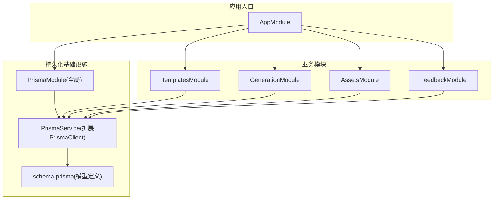
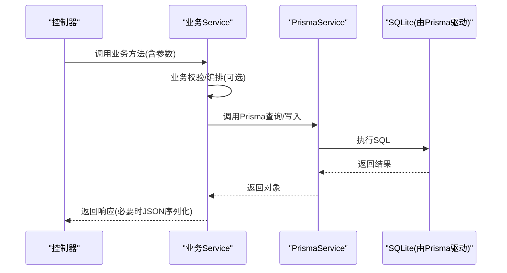
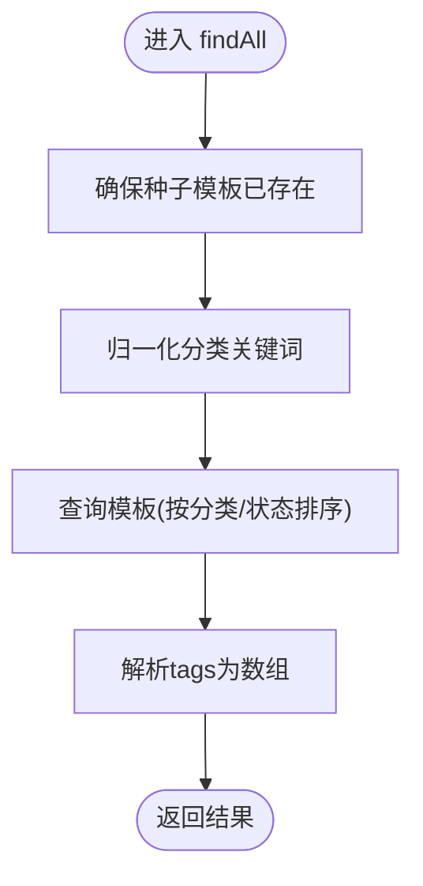
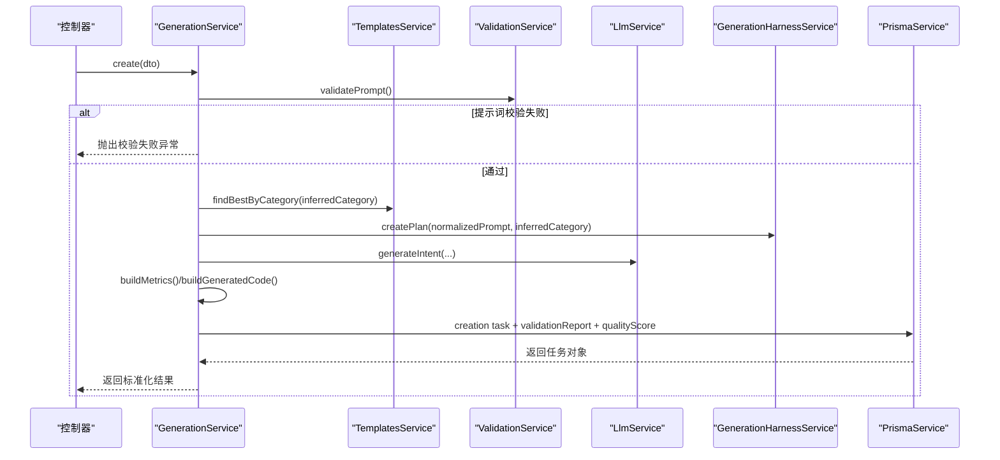
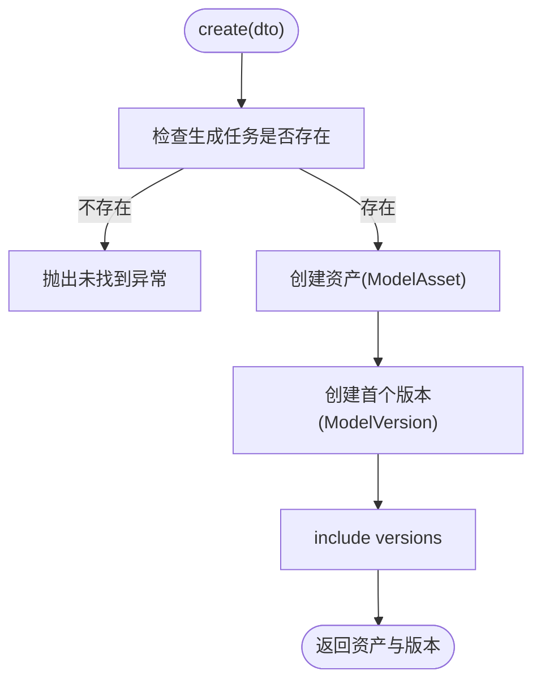
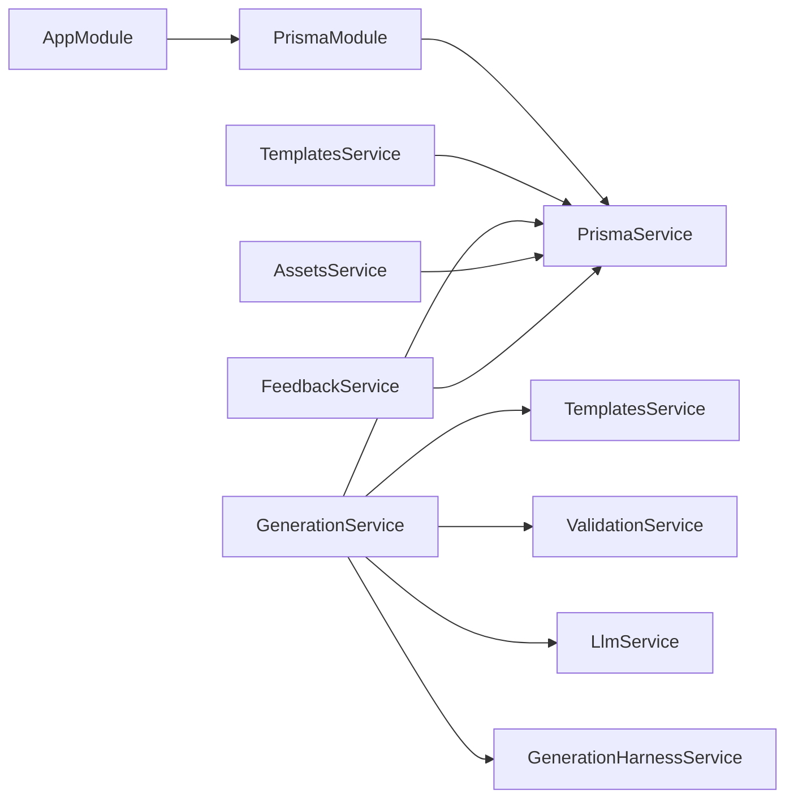

# 数据持久化层

<cite>
**本文引用的文件**
- [schema.prisma](file://prisma/schema.prisma)
- [prisma.service.ts](file://apps/api/src/prisma/prisma.service.ts)
- [prisma.module.ts](file://apps/api/src/prisma/prisma.module.ts)
- [app.module.ts](file://apps/api/src/app.module.ts)
- [templates.service.ts](file://apps/api/src/modules/templates/templates.service.ts)
- [template.seed.ts](file://apps/api/src/modules/templates/template.seed.ts)
- [generation.service.ts](file://apps/api/src/modules/generation/generation.service.ts)
- [assets.service.ts](file://apps/api/src/modules/assets/assets.service.ts)
- [feedback.service.ts](file://apps/api/src/modules/feedback/feedback.service.ts)
- [json.ts](file://apps/api/src/common/json.ts)
</cite>

## 目录
1. [简介](#简介)
2. [项目结构](#项目结构)
3. [核心组件](#核心组件)
4. [架构总览](#架构总览)
5. [详细组件分析](#详细组件分析)
6. [依赖关系分析](#依赖关系分析)
7. [性能与可扩展性](#性能与可扩展性)
8. [故障排查指南](#故障排查指南)
9. [结论](#结论)

## 简介
本文件聚焦于后端 API 的数据持久化层，围绕 Prisma 客户端、数据库模型定义以及各业务模块对数据的读写流程展开。系统采用 NestJS 模块化组织，Prisma 作为全局可注入的数据库访问服务，统一封装连接生命周期管理；业务服务通过 PrismaService 访问 SQLite 数据库，完成模板、生成任务、资产版本、反馈等实体的增删改查与关联操作。

## 项目结构
数据持久化相关的关键位置：
- 数据库模型定义位于 prisma/schema.prisma
- Prisma 客户端封装为全局模块 apps/api/src/prisma/*
- 业务模块（模板、生成、资产、反馈）在服务层直接调用 PrismaService 进行数据访问
- 通用 JSON 工具在 apps/api/src/common/json.ts 中提供 ID 生成与序列化辅助



图表来源
- [app.module.ts:1-24](file://apps/api/src/app.module.ts#L1-L24)
- [prisma.module.ts:1-10](file://apps/api/src/prisma/prisma.module.ts#L1-L10)
- [prisma.service.ts:1-14](file://apps/api/src/prisma/prisma.service.ts#L1-L14)
- [schema.prisma:1-122](file://prisma/schema.prisma#L1-L122)

章节来源
- [app.module.ts:1-24](file://apps/api/src/app.module.ts#L1-L24)
- [prisma.module.ts:1-10](file://apps/api/src/prisma/prisma.module.ts#L1-L10)
- [prisma.service.ts:1-14](file://apps/api/src/prisma/prisma.service.ts#L1-L14)
- [schema.prisma:1-122](file://prisma/schema.prisma#L1-L122)

## 核心组件
- Prisma 客户端封装
  - 通过自定义服务继承 PrismaClient，实现模块初始化时连接、销毁时断开的生命周期管理，并在应用内以全局模块形式导出，供所有业务模块注入使用。
- 数据库模型
  - 基于 schema.prisma 定义的实体包括：Template、GenerationTask、ValidationReport、QualityScore、ModelAsset、ModelVersion、Feedback，并包含必要的索引与级联删除策略。
- 业务服务的数据访问
  - TemplatesService：负责模板的“存在即更新，不存在则创建”的幂等写入与查询，并对标签字段做 JSON 序列化/反序列化。
  - GenerationService：负责生成任务的完整生命周期写入，包括任务主记录、校验报告、质量评分等关联子记录的原子创建。
  - AssetsService：将生成结果沉淀为“资产+版本”的结构，支持按资产查询其历史版本。
  - FeedbackService：为指定生成任务追加用户反馈。

章节来源
- [prisma.service.ts:1-14](file://apps/api/src/prisma/prisma.service.ts#L1-L14)
- [schema.prisma:10-122](file://prisma/schema.prisma#L10-L122)
- [templates.service.ts:1-99](file://apps/api/src/modules/templates/templates.service.ts#L1-L99)
- [generation.service.ts:1-309](file://apps/api/src/modules/generation/generation.service.ts#L1-L309)
- [assets.service.ts:1-91](file://apps/api/src/modules/assets/assets.service.ts#L1-L91)
- [feedback.service.ts:1-35](file://apps/api/src/modules/feedback/feedback.service.ts#L1-L35)

## 架构总览
从请求到落库的整体路径如下：
- 控制器接收请求后调用对应 Service
- Service 组合其他服务（如模板、校验、LLM、Harness）完成业务编排
- 最终通过 PrismaService 执行 Prisma 查询/写入
- 返回前对 JSON 字符串字段进行解析或格式化



图表来源
- [generation.service.ts:143-278](file://apps/api/src/modules/generation/generation.service.ts#L143-L278)
- [assets.service.ts:25-60](file://apps/api/src/modules/assets/assets.service.ts#L25-L60)
- [feedback.service.ts:10-33](file://apps/api/src/modules/feedback/feedback.service.ts#L10-L33)
- [prisma.service.ts:1-14](file://apps/api/src/prisma/prisma.service.ts#L1-L14)

## 详细组件分析

### 数据模型与关系
- Template：模板元信息，包含分类、标签、默认提示词、复杂度、状态与时间戳。
- GenerationTask：一次生成任务的核心记录，包含提示词、分类、模式、状态、生成的代码与参数、指标、错误码/信息、开始/完成时间，以及与模板、校验报告、质量评分、资产版本、反馈的关联。
- ValidationReport：针对某次生成任务的校验结果，包含是否通过、阻断原因、警告、复杂度摘要、AST 摘要等。
- QualityScore：针对某次生成任务的质量评分，包含总分、可渲染性、结构、提示词匹配、性能等维度及详情。
- ModelAsset：模型资产的顶层聚合，包含名称、分类、提示词、缩略图、当前版本、标签、状态与时间戳。
- ModelVersion：资产的具体版本，包含版本号、代码、参数、模型 JSON URL、截图 URL、指标等。
- Feedback：用户对某次生成任务的反馈，包含评分与评论。

关系要点
- GenerationTask 与 ValidationReport、QualityScore 为一对一关系，且删除任务时级联删除。
- GenerationTask 与 ModelVersion 为一对多关系（一个任务可产生多个版本）。
- ModelAsset 与 ModelVersion 为一对多关系（一个资产有多个版本），删除资产时级联删除版本。
- GenerationTask 与 Feedback 为一对多关系，删除任务时级联删除反馈。
- 常用查询字段已建立索引：category、status、createdAt、assetId、generationTaskId。

```mermaid
erDiagram
TEMPLATE {
string id PK
string name
string category
string description
string tags
string defaultPrompt
string complexity
string status
datetime createdAt
datetime updatedAt
}
GENERATION_TASK {
string id PK
string traceId UK
string prompt
string normalizedPrompt
string category
string mode
string status
string templateId FK
string generatedCode
string generatedParams
string explanation
string metrics
string validationReportId
string qualityScoreId
string errorCode
string errorMessage
datetime startedAt
datetime completedAt
datetime createdAt
datetime updatedAt
}
VALIDATION_REPORT {
string id PK
string generationTaskId UK FK
boolean passed
string blockedReasons
string warnings
string complexity
string astSummary
datetime createdAt
}
QUALITY_SCORE {
string id PK
string generationTaskId UK FK
int totalScore
int renderabilityScore
int structureScore
int promptMatchScore
int performanceScore
string details
datetime createdAt
}
MODEL_ASSET {
string id PK
string name
string category
string prompt
string thumbnailUrl
string currentVersionId
string tags
string status
datetime createdAt
datetime updatedAt
}
MODEL_VERSION {
string id PK
string assetId FK
string generationTaskId FK
int versionNo
string code
string params
string modelJsonUrl
string screenshotUrl
string metrics
datetime createdAt
}
FEEDBACK {
string id PK
string generationTaskId FK
string rating
string comment
datetime createdAt
}
TEMPLATE ||--o{ GENERATION_TASK : "被引用"
GENERATION_TASK ||--|| VALIDATION_REPORT : "拥有"
GENERATION_TASK ||--|| QUALITY_SCORE : "拥有"
MODEL_ASSET ||--o{ MODEL_VERSION : "包含"
GENERATION_TASK ||--o{ MODEL_VERSION : "产出"
GENERATION_TASK ||--o{ FEEDBACK : "收到"
```

图表来源
- [schema.prisma:10-122](file://prisma/schema.prisma#L10-L122)

章节来源
- [schema.prisma:10-122](file://prisma/schema.prisma#L10-L122)

### 模板数据访问（TemplatesService）
- 启动时确保种子模板存在：对每条种子模板执行 upsert，保证幂等初始化。
- 列表查询：根据传入的分类关键词归一化后进行过滤，并按创建时间升序返回；读取时将 tags 字段从 JSON 字符串解析为数组。
- 最佳模板选择：优先按归一化分类查找，若未命中则回退至任意已发布模板。



图表来源
- [templates.service.ts:44-84](file://apps/api/src/modules/templates/templates.service.ts#L44-L84)
- [template.seed.ts:1-75](file://apps/api/src/modules/templates/template.seed.ts#L1-L75)

章节来源
- [templates.service.ts:44-99](file://apps/api/src/modules/templates/templates.service.ts#L44-L99)
- [template.seed.ts:1-75](file://apps/api/src/modules/templates/template.seed.ts#L1-L75)

### 生成任务数据访问（GenerationService）
- 输入校验：先校验提示词，再构造最小可用代码并校验，两者均通过才继续。
- 模板选择：根据提示词推断分类，选择最佳模板。
- 生成参数构建：结合 LLM 意图与 Harness 计划，计算指标与参数，并处理特定类别（如镜子）的变体属性。
- 持久化写入：一次性创建 GenerationTask 及其关联的 ValidationReport、QualityScore，并通过 include 一并返回。
- 查询接口：支持分页限制的前 N 条列表与按 ID 精确查询，缺失时抛出未找到异常。



图表来源
- [generation.service.ts:143-278](file://apps/api/src/modules/generation/generation.service.ts#L143-L278)
- [templates.service.ts:86-97](file://apps/api/src/modules/templates/templates.service.ts#L86-L97)

章节来源
- [generation.service.ts:143-309](file://apps/api/src/modules/generation/generation.service.ts#L143-L309)

### 资产与版本（AssetsService）
- 创建资产：依据生成任务是否存在来校验，随后创建 ModelAsset 并同步创建首个 ModelVersion，同时回填当前版本 ID。
- 列表查询：仅返回活跃状态的资产，并包含其版本列表。
- 版本查询：按资产 ID 获取其所有版本，按版本号降序排列。



图表来源
- [assets.service.ts:25-60](file://apps/api/src/modules/assets/assets.service.ts#L25-L60)

章节来源
- [assets.service.ts:25-91](file://apps/api/src/modules/assets/assets.service.ts#L25-L91)

### 反馈（FeedbackService）
- 创建反馈：校验目标生成任务存在后，写入反馈记录并返回。

章节来源
- [feedback.service.ts:10-33](file://apps/api/src/modules/feedback/feedback.service.ts#L10-L33)

### JSON 序列化与 ID 生成（common/json.ts）
- ID 生成：提供带前缀的短 ID 与追踪 ID 生成器，用于主键与链路追踪。
- JSON 工具：提供安全的字符串化与解析函数，解析失败时返回默认值，避免异常中断。

章节来源
- [json.ts:1-24](file://apps/api/src/common/json.ts#L1-L24)

## 依赖关系分析
- 全局依赖
  - AppModule 导入 PrismaModule，使其成为全局可注入的服务。
  - PrismaModule 导出 PrismaService，供各业务模块直接使用。
- 业务模块依赖
  - TemplatesService 依赖 PrismaService 与种子数据。
  - GenerationService 依赖 PrismaService、TemplatesService、ValidationService、LlmService、GenerationHarnessService。
  - AssetsService 依赖 PrismaService。
  - FeedbackService 依赖 PrismaService。



图表来源
- [app.module.ts:11-23](file://apps/api/src/app.module.ts#L11-L23)
- [prisma.module.ts:4-9](file://apps/api/src/prisma/prisma.module.ts#L4-L9)
- [generation.module.ts:9-15](file://apps/api/src/modules/generation/generation.module.ts#L9-L15)

章节来源
- [app.module.ts:11-23](file://apps/api/src/app.module.ts#L11-L23)
- [prisma.module.ts:4-9](file://apps/api/src/prisma/prisma.module.ts#L4-L9)
- [generation.module.ts:9-15](file://apps/api/src/modules/generation/generation.module.ts#L9-L15)

## 性能与可扩展性
- 索引优化
  - 已在常用过滤字段上建立索引：category、status、createdAt、assetId、generationTaskId，有助于提升列表与筛选查询性能。
- 批量与事务
  - 模板种子初始化使用 Promise.all 并行 upsert，减少多次往返开销。
  - 生成任务与其关联子记录在同一 create 调用中写入，降低一致性风险。
- 连接管理
  - PrismaService 在模块初始化时连接、销毁时断开，避免连接泄漏。
- 可扩展建议
  - 当数据量增长时，可对大文本字段（如 metrics、details、astSummary）考虑分表或归档策略。
  - 对于高频读场景，可在服务层引入缓存层（如 Redis）以降低数据库压力。
  - 如需更高并发与可靠性，可将数据库切换为 PostgreSQL/MySQL，并评估连接池与慢查询优化。

[本节为通用指导，不直接分析具体文件]

## 故障排查指南
- 常见异常
  - 未找到资源：当查询生成任务或资产不存在时，会抛出未找到异常，需在上层捕获并返回友好错误。
  - 校验失败：提示词或代码校验未通过时，会抛出包含阻断原因的异常，便于前端展示问题清单。
- 数据一致性与幂等
  - 模板种子采用 upsert 保证幂等；生成任务与其子记录在一次写入中完成，避免部分成功导致的不一致。
- 日志与追踪
  - 每次响应附带 traceId，便于跨服务链路追踪与问题定位。
- 调试建议
  - 检查 DATABASE_URL 环境变量是否正确指向 SQLite 文件路径。
  - 确认 Prisma 客户端已正确生成（npx prisma generate），否则无法识别模型类型。
  - 关注 JSON 字段序列化/反序列化的健壮性，避免脏数据导致解析失败。

章节来源
- [generation.service.ts:143-170](file://apps/api/src/modules/generation/generation.service.ts#L143-L170)
- [assets.service.ts:25-33](file://apps/api/src/modules/assets/assets.service.ts#L25-L33)
- [feedback.service.ts:10-15](file://apps/api/src/modules/feedback/feedback.service.ts#L10-L15)
- [prisma.service.ts:6-12](file://apps/api/src/prisma/prisma.service.ts#L6-L12)

## 结论
该项目的数据持久化层以 Prisma 为核心，配合全局可注入的 PrismaService 与各业务 Service 的清晰分层，实现了模板、生成任务、资产版本与反馈等关键实体的稳定存取。通过合理的索引设计、幂等初始化与原子写入策略，系统在易用性与一致性之间取得了良好平衡。后续可根据数据规模与访问模式进一步优化连接池、缓存与存储引擎选型。