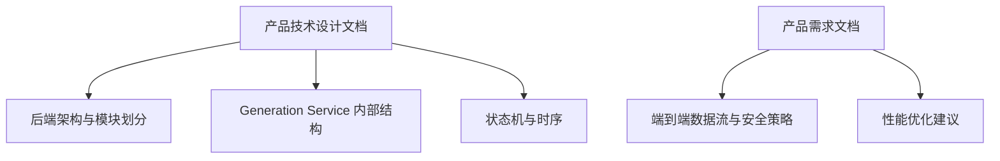
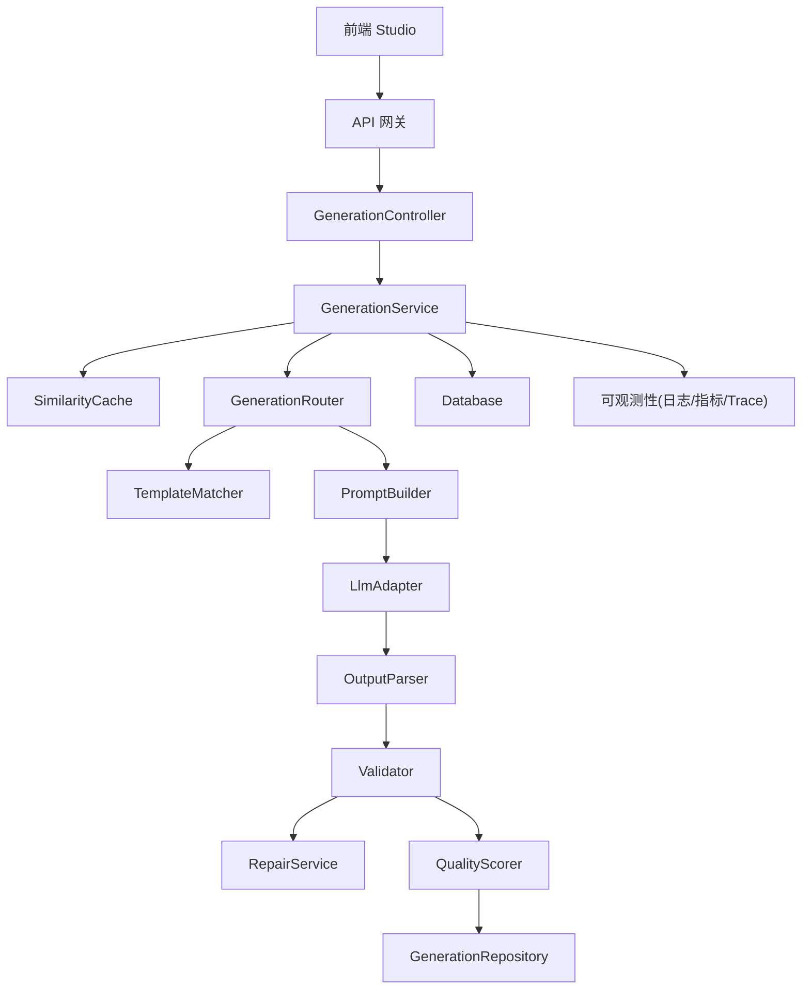
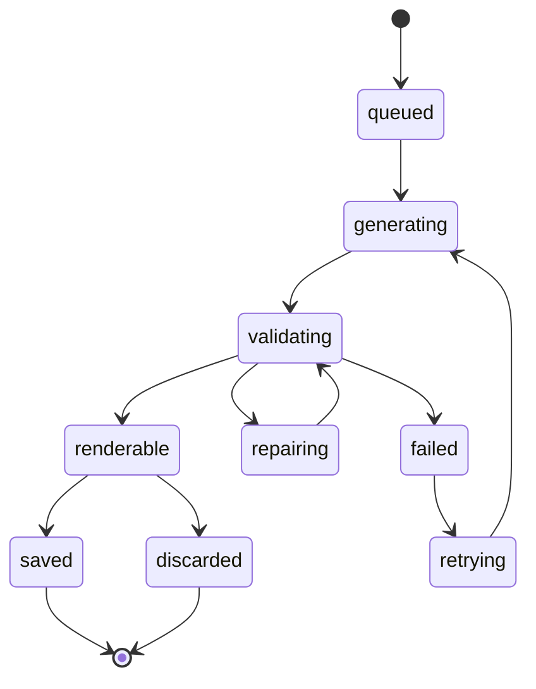
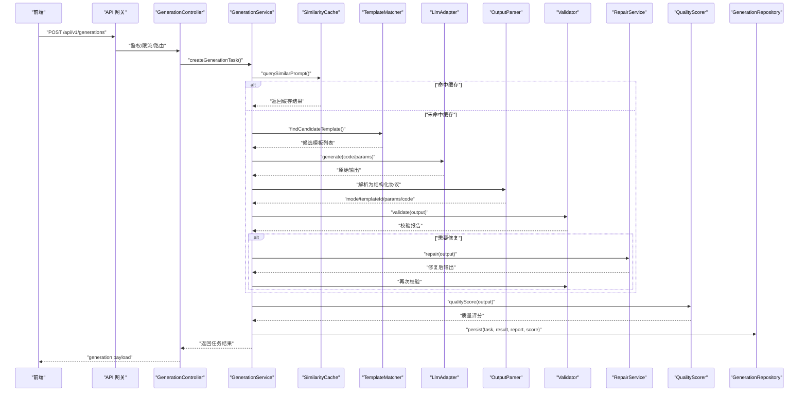
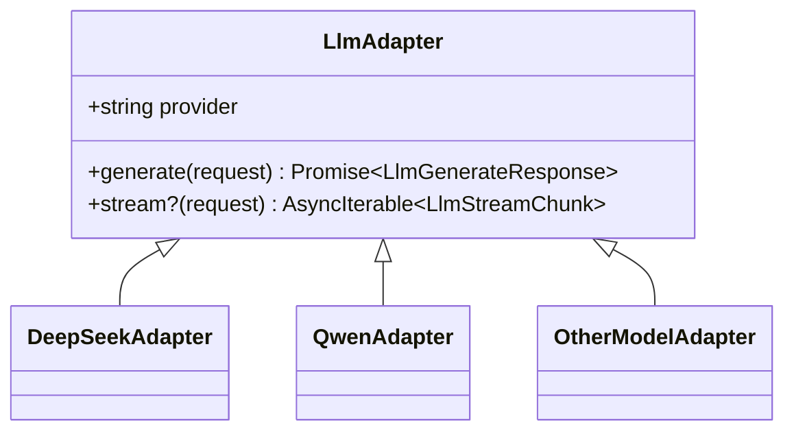
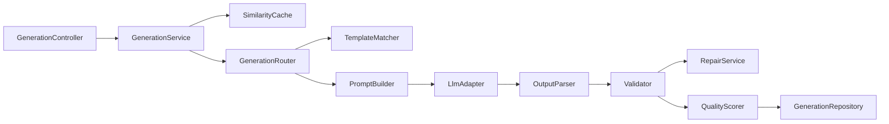

# GenerationService 核心服务

<cite>
**本文引用的文件**   
- [产品技术设计文档](file://tech/product-technical-design.md)
- [产品需求文档](file://prd.md)
</cite>

## 目录
1. [引言](#引言)
2. [项目结构](#项目结构)
3. [核心组件](#核心组件)
4. [架构总览](#架构总览)
5. [详细组件分析](#详细组件分析)
6. [依赖分析](#依赖分析)
7. [性能考虑](#性能考虑)
8. [故障排查指南](#故障排查指南)
9. [结论](#结论)
10. [附录](#附录)

## 引言
本文件聚焦于 ApexForge 的 GenerationService 核心服务，围绕任务生命周期管理、状态机转换逻辑、错误处理策略与重试机制展开，并完整梳理与 GenerationController 的调用链路，覆盖任务创建、执行、验证、保存的全流程。同时说明任务优先级调度、并发控制、超时处理和资源清理机制，并提供扩展新生成模式与自定义业务逻辑的实践指引。

## 项目结构
当前仓库包含两份关键设计文档：
- 产品技术设计文档：定义后端模块划分、Generation Service 内部结构、LLM Adapter 统一接口、API 契约、状态机与时序等。
- 产品需求文档：描述端到端数据流、安全策略与性能优化要点。

图表来源
- [产品技术设计文档:574-631](file://tech/product-technical-design.md#L574-L631)
- [产品技术设计文档:338-390](file://tech/product-technical-design.md#L338-L390)
- [产品需求文档:126-168](file://prd.md#L126-L168)

章节来源
- [产品技术设计文档:574-631](file://tech/product-technical-design.md#L574-L631)
- [产品需求文档:126-168](file://prd.md#L126-L168)

## 核心组件
GenerationService 作为生成任务编排的核心，承担以下职责：
- 接收来自 GenerationController 的任务创建请求，进行参数校验与上下文准备。
- 根据模式选择策略（缓存优先、模板优先、混合、代码）驱动生成路径。
- 协调 SimilarityCache、TemplateMatcher、PromptBuilder、LlmAdapter、OutputParser、Validator、RepairService、QualityScorer、GenerationRepository 等子组件完成一次完整的生成闭环。
- 维护任务状态机流转，记录质量评分与校验报告，持久化到数据库。
- 提供 SSE/WebSocket 事件推送能力，支持前端实时反馈。

章节来源
- [产品技术设计文档:594-609](file://tech/product-technical-design.md#L594-L609)
- [产品技术设计文档:632-722](file://tech/product-technical-design.md#L632-L722)

## 架构总览
GenerationService 在整体系统中的位置与交互如下：

图表来源
- [产品技术设计文档:594-609](file://tech/product-technical-design.md#L594-L609)

章节来源
- [产品技术设计文档:574-631](file://tech/product-technical-design.md#L574-L631)

## 详细组件分析

### 任务生命周期与状态机
GenerationService 使用明确的状态机管理任务从入队到最终落库的全过程，确保幂等与可追踪。

图表来源
- [产品技术设计文档:340-357](file://tech/product-technical-design.md#L340-L357)

章节来源
- [产品技术设计文档:340-357](file://tech/product-technical-design.md#L340-L357)

### 与 GenerationController 的调用链路
从用户发起请求到返回结果的端到端时序如下：

图表来源
- [产品技术设计文档:359-390](file://tech/product-technical-design.md#L359-L390)
- [产品技术设计文档:594-609](file://tech/product-technical-design.md#L594-L609)
- [产品技术设计文档:632-722](file://tech/product-technical-design.md#L632-L722)

章节来源
- [产品技术设计文档:359-390](file://tech/product-technical-design.md#L359-L390)
- [产品技术设计文档:632-722](file://tech/product-technical-design.md#L632-L722)

### 生成模式与优先级调度
GenerationService 内置四种生成模式，按推荐优先级依次尝试：
- Cache Mode：相似 Prompt 直接复用历史结果，显著降低延迟与成本。
- Template Mode：AI 仅生成模板参数，速度快、稳定性高。
- Hybrid Mode：AI 选择模板并补充局部代码，兼顾可控性与灵活性。
- Code Mode：完全自由生成 Three.js 函数，适用于探索性场景。

调度策略要点：
- 先查缓存，命中则快速返回。
- 未命中时，基于类别识别与关键词抽取匹配候选模板。
- 若模板无法充分满足需求，进入 Hybrid 或 Code 模式。
- 所有分支均经过 Validator 与 QualityScorer 评估，必要时触发 RepairService 自动修复。

章节来源
- [产品技术设计文档:329-338](file://tech/product-technical-design.md#L329-L338)
- [产品技术设计文档:392-425](file://tech/product-technical-design.md#L392-L425)

### 错误处理策略与重试机制
错误分类与处理原则：
- 输出协议校验失败：立即终止并返回错误码，避免后续无效计算。
- 文本黑名单命中：阻断危险内容，记录审计日志。
- AST 校验失败：结合 RepairService 尝试修复；若仍失败，降级至更保守模式（如回退到模板）。
- 运行时沙箱错误：前端 iframe 执行阶段捕获，映射为标准错误码，提示重试或降级。
- 模型复杂度超限：提示用户调整描述或切换模板模式。

重试机制：
- 服务端侧：对 LLM 调用失败、网络抖动、临时性错误进行指数退避重试，支持供应商降级。
- 客户端侧：对沙箱执行异常，限制最大重试次数，避免无限循环。
- 全链路记录 traceId，便于定位问题根因。

章节来源
- [产品技术设计文档:428-470](file://tech/product-technical-design.md#L428-L470)
- [产品技术设计文档:508-517](file://tech/product-technical-design.md#L508-L517)
- [产品技术设计文档:611-629](file://tech/product-technical-design.md#L611-L629)

### 并发控制、超时处理与资源清理
- 并发控制：通过队列（BullMQ/RabbitMQ/Kafka）与 Worker 池实现异步削峰填谷；MVP 可使用内存队列或本地队列。
- 超时处理：
  - LLM 调用设置合理超时与熔断阈值。
  - 前端 iframe 执行设置超时，销毁并回收资源。
- 资源清理：
  - 释放旧模型几何体、材质、纹理，避免内存泄漏。
  - 关闭 SSE/WebSocket 连接，清理任务上下文。
  - 对象存储中过期文件定期清理。

章节来源
- [产品技术设计文档:80-100](file://tech/product-technical-design.md#L80-L100)
- [产品技术设计文档:498-507](file://tech/product-technical-design.md#L498-L507)
- [产品技术设计文档:563-571](file://tech/product-technical-design.md#L563-L571)

### 多供应商 LLM Adapter 与统一接口
GenerationService 通过 LlmAdapter 抽象屏蔽底层差异，支持按任务类型、成本与响应速度动态选择供应商，并具备失败重试与降级能力。

图表来源
- [产品技术设计文档:611-629](file://tech/product-technical-design.md#L611-L629)

章节来源
- [产品技术设计文档:611-629](file://tech/product-technical-design.md#L611-L629)

### 扩展新的生成模式与自定义业务逻辑
扩展步骤建议：
- 新增模式枚举与策略类：在 GenerationRouter 中注册新模式，定义匹配规则与降级策略。
- 实现 PromptBuilder 变体：为新模式定制 System Prompt、Few-shot 示例与输出协议约束。
- 接入 LlmAdapter：若需特定供应商或模型，实现 LlmAdapter 接口并注册到选择器。
- 增强 Validator/RepairService：针对新模式输出增加 AST 白名单规则与修复策略。
- 更新 QualityScorer：为新模式定义质量维度与权重，保证评估一致性。
- 完善 API 契约：在控制器层暴露新模式的请求字段与响应结构，保持向后兼容。

参考路径（以设计文档为准）：
- 生成模式与优先级：[产品技术设计文档:329-338](file://tech/product-technical-design.md#L329-L338)
- Prompt 编排与输出协议：[产品技术设计文档:392-425](file://tech/product-technical-design.md#L392-L425)
- LLM Adapter 统一接口：[产品技术设计文档:611-629](file://tech/product-technical-design.md#L611-L629)
- 校验分层与白名单策略：[产品技术设计文档:428-470](file://tech/product-technical-design.md#L428-L470)

章节来源
- [产品技术设计文档:329-338](file://tech/product-technical-design.md#L329-L338)
- [产品技术设计文档:392-425](file://tech/product-technical-design.md#L392-L425)
- [产品技术设计文档:428-470](file://tech/product-technical-design.md#L428-L470)
- [产品技术设计文档:611-629](file://tech/product-technical-design.md#L611-L629)

## 依赖分析
GenerationService 与其周边组件的依赖关系如下：

图表来源
- [产品技术设计文档:594-609](file://tech/product-technical-design.md#L594-L609)

章节来源
- [产品技术设计文档:594-609](file://tech/product-technical-design.md#L594-L609)

## 性能考虑
- 缓存命中优先：相似 Prompt 直接返回，减少 LLM 调用与校验开销。
- 模板优先：参数化生成仅需毫秒级，避免不必要的代码生成。
- 前端渲染优化：Web Worker 反序列化、InstancedMesh 批量渲染、LOD 细节层级。
- 网络优化：CDN 静态资源、Gzip/Brotli 压缩、增量更新。
- 可观测性：traceId 贯穿全链路，记录耗时与质量指标，辅助容量规划与瓶颈定位。

章节来源
- [产品需求文档:155-168](file://prd.md#L155-L168)
- [产品技术设计文档:563-571](file://tech/product-technical-design.md#L563-L571)

## 故障排查指南
常见问题与定位方法：
- 校验失败：检查 Validator 报告中的 blockedReasons 与 warnings，确认是否命中黑名单或 AST 规则。
- 沙箱执行异常：查看前端错误码（SANDBOX_TIMEOUT、SANDBOX_RUNTIME_ERROR、MODEL_JSON_INVALID 等），结合 traceId 定位具体执行上下文。
- LLM 调用失败：核对供应商健康度、配额与速率限制，观察重试与降级日志。
- 质量评分偏低：分析 QualityScorer 各维度得分，针对性优化 Prompt 或模板。
- 资源泄漏：确认前端 dispose 流程与后端连接关闭逻辑是否生效。

章节来源
- [产品技术设计文档:428-470](file://tech/product-technical-design.md#L428-L470)
- [产品技术设计文档:508-517](file://tech/product-technical-design.md#L508-L517)

## 结论
GenerationService 通过清晰的状态机、严格的校验与修复机制、灵活的生成模式与多供应商适配，实现了稳定高效的 AI 生成流水线。配合完善的可观测性与性能优化策略，可在 MVP 到平台化的演进中持续保障质量与体验。

## 附录

### API 契约摘要
- 基础路径：/api/v1
- 认证：JWT 或 API Key
- 通用响应：包含 traceId
- 主要接口：
  - POST /api/v1/generations：创建生成任务
  - GET /api/v1/generations/{taskId}：查询任务状态与结果
  - POST /api/v1/assets：保存为资产
  - GET /api/v1/assets/{assetId}/versions：查询资产版本
  - GET /api/v1/generations/{taskId}/events：SSE 事件订阅

章节来源
- [产品技术设计文档:632-722](file://tech/product-technical-design.md#L632-L722)