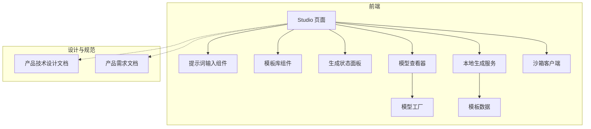
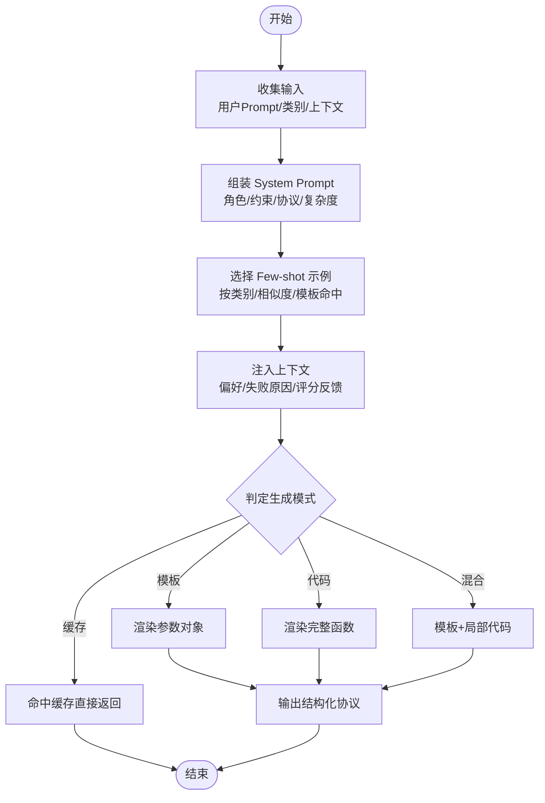
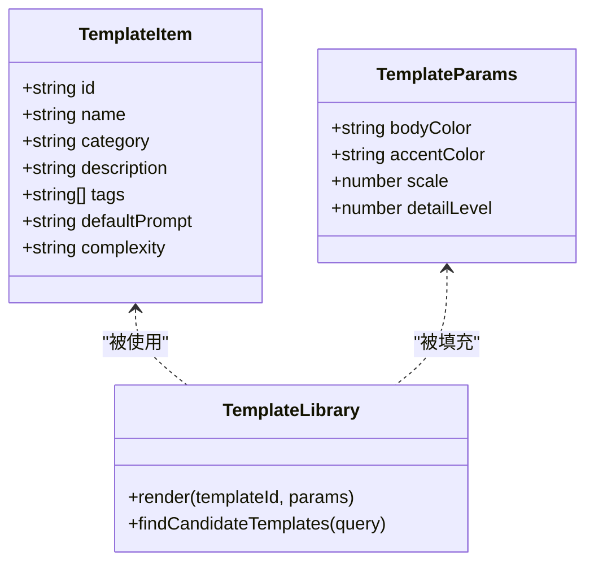
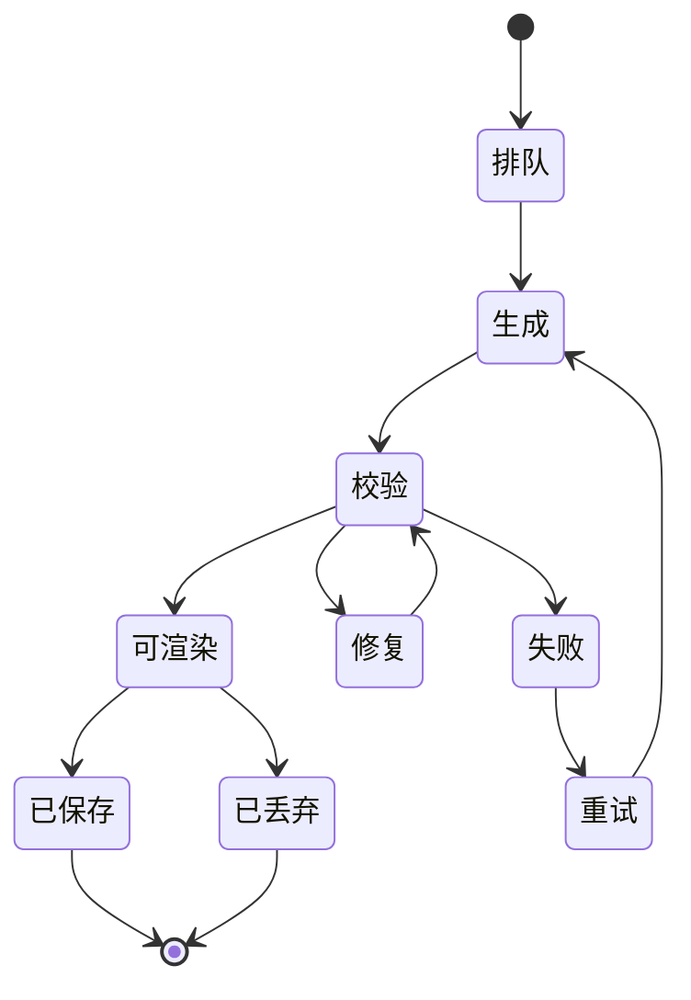
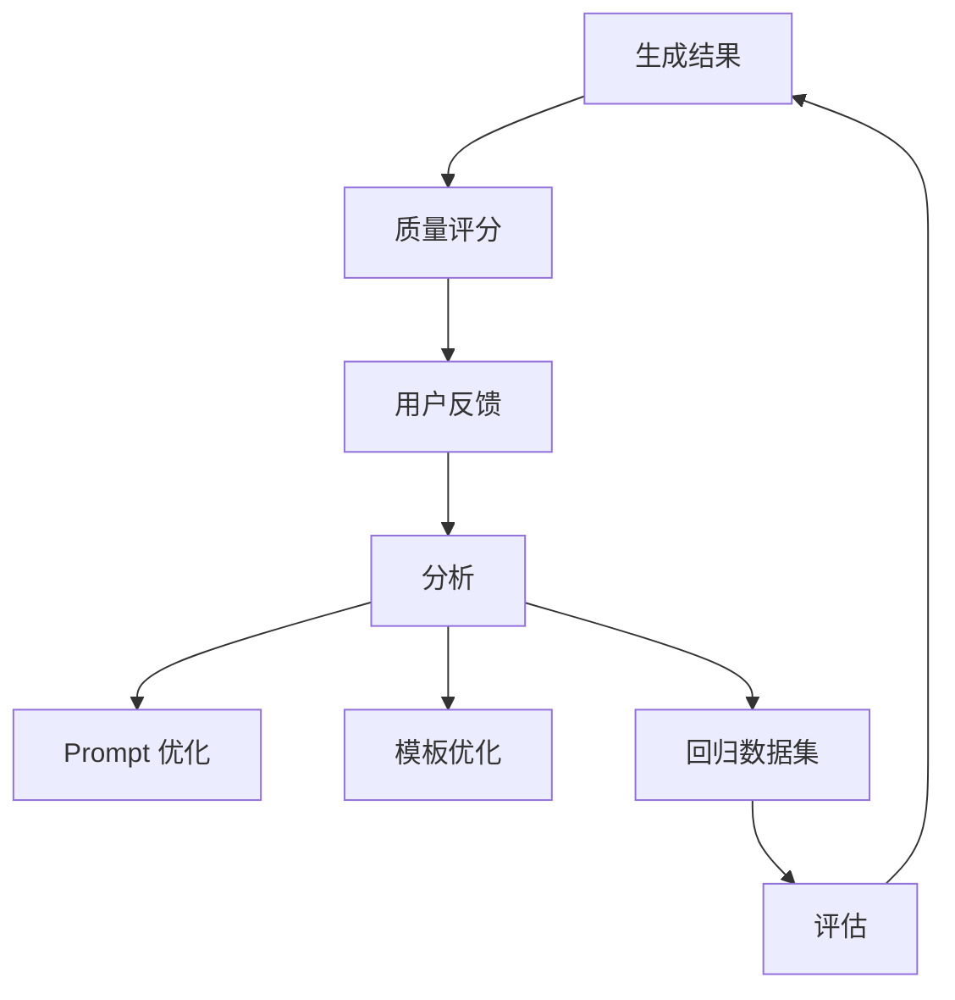
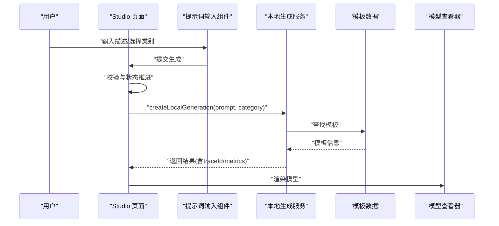
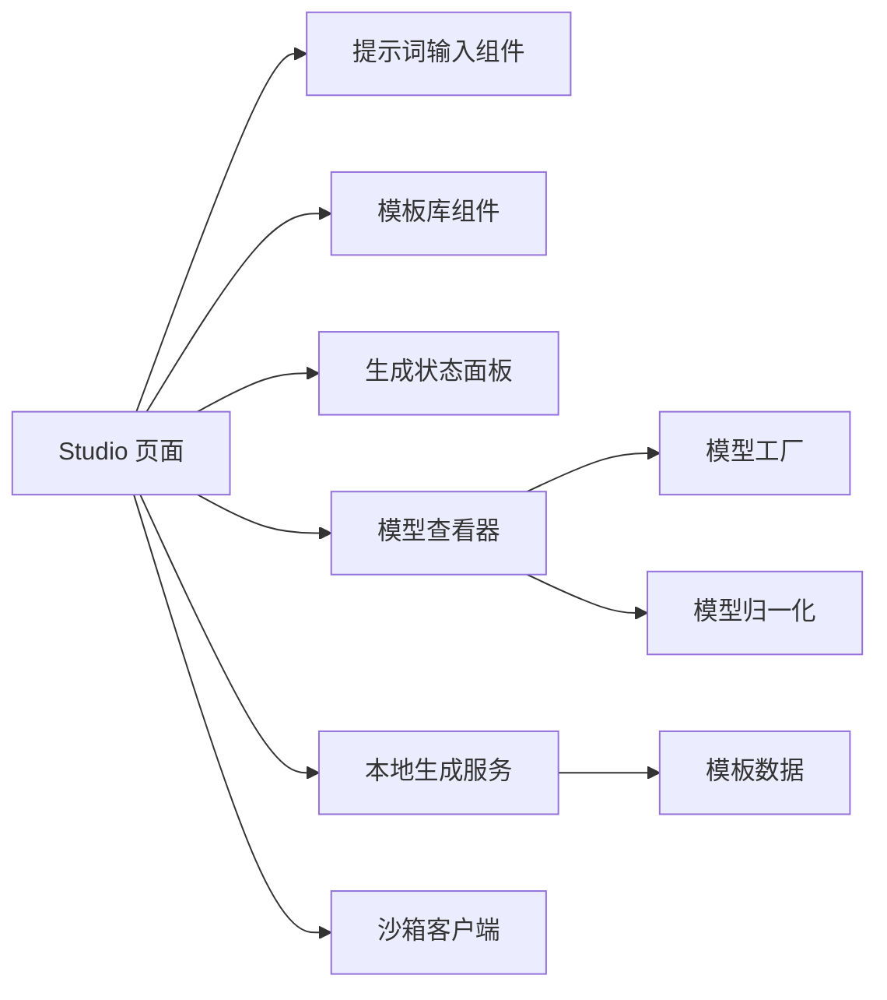

# Prompt 构建器

<cite>
**本文引用的文件**   
- [产品技术设计文档](file://tech/product-technical-design.md)
- [产品需求文档](file://prd.md)
- [Studio 页面](file://src/modules/studio/pages/StudioPage.tsx)
- [本地生成服务](file://src/modules/studio/services/generationService.ts)
- [模板数据](file://src/modules/templates/templateData.ts)
- [模板库组件](file://src/modules/templates/TemplateLibrary.tsx)
- [模型查看器](file://src/modules/viewer/components/ModelViewer.tsx)
- [模型工厂](file://src/modules/viewer/utils/modelFactory.ts)
- [沙箱客户端](file://src/modules/sandbox/SandboxClient.ts)
- [错误映射](file://src/modules/sandbox/errorMapper.ts)
- [通用类型](file://src/shared/types/common.ts)
- [生成类型](file://src/shared/types/generation.ts)
- [模板类型](file://src/shared/types/template.ts)
- [提示词输入组件](file://src/modules/studio/components/PromptInput.tsx)
- [生成状态面板](file://src/modules/studio/components/GenerationPanel.tsx)
- [提示词校验工具](file://src/shared/utils/validators.ts)
</cite>

## 目录
1. [引言](#引言)
2. [项目结构](#项目结构)
3. [核心组件](#核心组件)
4. [架构总览](#架构总览)
5. [详细组件分析](#详细组件分析)
6. [依赖分析](#依赖分析)
7. [性能考虑](#性能考虑)
8. [故障排查指南](#故障排查指南)
9. [结论](#结论)
10. [附录](#附录)

## 引言
本文件面向 ApexForge 的 Prompt 构建器（PromptBuilder）实现与使用，聚焦以下目标：
- System Prompt 组装策略、Few-shot 示例选择机制、上下文信息注入方式与参数化模板渲染流程。
- 不同生成模式（模板、代码、混合、缓存）下的 Prompt 差异与版本管理机制。
- 质量评估指标体系、Prompt 优化策略、A/B 测试框架与效果监控方案。
- Prompt 设计最佳实践与调试工具使用方法。

## 项目结构
当前仓库包含产品与技术设计文档以及前端 MVP 原型代码。MVP 阶段通过前端模拟生成链路，为后续接入后端 Prompt 编排与 LLM 调用预留接口。



图表来源
- [Studio 页面:1-245](file://src/modules/studio/pages/StudioPage.tsx#L1-L245)
- [提示词输入组件:24-68](file://src/modules/studio/components/PromptInput.tsx#L24-L68)
- [模板库组件:1-37](file://src/modules/templates/TemplateLibrary.tsx#L1-L37)
- [生成状态面板:1-21](file://src/modules/studio/components/GenerationPanel.tsx#L1-L21)
- [模型查看器:1-171](file://src/modules/viewer/components/ModelViewer.tsx#L1-L171)
- [模型工厂:1-192](file://src/modules/viewer/utils/modelFactory.ts#L1-L192)
- [本地生成服务:1-29](file://src/modules/studio/services/generationService.ts#L1-L29)
- [模板数据:1-54](file://src/modules/templates/templateData.ts#L1-L54)
- [沙箱客户端:1-19](file://src/modules/sandbox/SandboxClient.ts#L1-L19)
- [产品技术设计文档:1-1149](file://tech/product-technical-design.md#L1-L1149)
- [产品需求文档:1-168](file://prd.md#L1-L168)

章节来源
- [产品技术设计文档:1-1149](file://tech/product-technical-design.md#L1-L1149)
- [产品需求文档:1-168](file://prd.md#L1-L168)

## 核心组件
- Prompt 构建器（概念模块）：负责将用户输入、系统约束、Few-shot 示例、模板摘要与上下文组合成最终 Prompt，并输出结构化协议供 LLM 消费。
- 模板系统：提供骨架、风格变体、细节包、材质预设与参数 Schema，支持 AI 仅生成参数或局部代码。
- 生成路由：根据类别与置信度在模板、代码、混合与缓存模式间切换。
- 安全校验与沙箱：服务端 AST 白名单与黑名单；客户端 iframe 隔离执行与超时销毁。
- 质量评分：可渲染性、匹配度、结构完整性、性能表现、可编辑性等维度。
- 版本管理：System Prompt、Few-shot 示例、模板摘要均版本化，支持回滚与回归测试。

章节来源
- [产品技术设计文档:392-425](file://tech/product-technical-design.md#L392-L425)
- [产品技术设计文档:428-470](file://tech/product-technical-design.md#L428-L470)
- [产品技术设计文档:472-518](file://tech/product-technical-design.md#L472-L518)
- [产品技术设计文档:807-841](file://tech/product-technical-design.md#L807-L841)

## 架构总览
整体生成链路从前端发起请求，经网关到生成服务，再由 Prompt 编排器组织 Prompt，调用 LLM 适配器，产出结果后进入校验与评分，最后返回前端并在沙箱中执行预览。

```mermaid
sequenceDiagram
participant FE as "前端"
participant API as "API 网关"
participant GEN as "生成服务"
participant PROMPT as "Prompt 编排器"
participant LLM as "LLM 适配器"
participant VAL as "校验器"
participant BOX as "沙箱"
FE->>API : "POST /api/v1/generations"
API->>GEN : "创建任务"
GEN->>PROMPT : "组装 System/Few-shot/上下文"
PROMPT-->>GEN : "结构化 Prompt"
GEN->>LLM : "生成代码或参数"
LLM-->>GEN : "输出"
GEN->>VAL : "AST/黑名单/协议校验"
VAL-->>GEN : "报告"
GEN-->>API : "结果"
API-->>FE : "推送结果"
FE->>BOX : "iframe 执行"
BOX-->>FE : "模型 JSON 或错误"
```

图表来源
- [产品技术设计文档:359-391](file://tech/product-technical-design.md#L359-L391)

章节来源
- [产品技术设计文档:359-391](file://tech/product-technical-design.md#L359-L391)

## 详细组件分析

### Prompt 构建器（PromptBuilder）
职责与输入
- 输入：用户原始 Prompt、类别、上下文（历史对话、偏好）、模板候选、系统约束、Few-shot 示例集合、输出协议定义。
- 处理：
  - System Prompt 组装：角色设定、强制约束、输出协议、复杂度限制、安全边界。
  - Few-shot 示例选择：基于类别与相似度检索候选示例，按模板命中情况动态插入。
  - 上下文注入：用户偏好、上次失败原因、模板命中记录、质量评分反馈。
  - 参数化模板渲染：当命中模板时，优先输出参数对象；必要时补充局部代码片段。
- 输出：符合统一协议的 JSON，包含 mode、templateId、params、code、explanation、warnings 等字段。

关键设计要点
- 多模式差异化：
  - 模板模式：强调参数 Schema 与默认值，减少自由生成风险。
  - 代码模式：强化安全约束与复杂度限制，要求暴露固定函数签名。
  - 混合模式：先选模板再补码，兼顾可控性与灵活性。
  - 缓存模式：相似 Prompt 直接复用，避免重复调用。
- 版本管理：每次生成记录 promptVersion，便于回滚与回归测试。
- 质量闭环：结合自动评分与用户反馈持续优化 Prompt 与示例集。



图表来源
- [产品技术设计文档:392-425](file://tech/product-technical-design.md#L392-L425)
- [产品技术设计文档:329-338](file://tech/product-technical-design.md#L329-L338)

章节来源
- [产品技术设计文档:392-425](file://tech/product-technical-design.md#L392-L425)
- [产品技术设计文档:329-338](file://tech/product-technical-design.md#L329-L338)

### 模板系统与参数化渲染
- 模板分层：骨架、风格变体、细节包、材质预设、参数 Schema。
- 匹配策略：类别识别与关键词抽取 → 标签与向量检索 → LLM 选择最匹配模板并生成参数 → 置信度阈值控制降级策略。
- 参数化渲染：前端通过 render(templateId, params) 快速生成模型，避免 LLM 调用。



图表来源
- [模板类型:1-18](file://src/shared/types/template.ts#L1-L18)
- [模板数据:1-54](file://src/modules/templates/templateData.ts#L1-L54)
- [模板库组件:1-37](file://src/modules/templates/TemplateLibrary.tsx#L1-L37)

章节来源
- [模板类型:1-18](file://src/shared/types/template.ts#L1-L18)
- [模板数据:1-54](file://src/modules/templates/templateData.ts#L1-L54)
- [模板库组件:1-37](file://src/modules/templates/TemplateLibrary.tsx#L1-L37)
- [产品技术设计文档:760-804](file://tech/product-technical-design.md#L760-L804)

### 生成模式与状态机
- 模式优先级：缓存 → 模板 → 混合 → 代码。
- 状态流转：排队 → 生成 → 校验 → 可渲染/修复/失败 → 保存/丢弃。



图表来源
- [产品技术设计文档:340-357](file://tech/product-technical-design.md#L340-L357)

章节来源
- [产品技术设计文档:329-357](file://tech/product-technical-design.md#L329-L357)

### 安全校验与沙箱执行
- 服务端校验：协议校验、文本黑名单、AST 白名单、复杂度限制。
- 客户端沙箱：iframe 隔离、CSP 限制、超时销毁、只允许返回结构化 JSON。

```mermaid
sequenceDiagram
participant GEN as "生成服务"
participant VAL as "校验器"
participant BOX as "沙箱"
GEN->>VAL : "AST/黑名单/协议校验"
VAL-->>GEN : "报告(通过/阻断/警告)"
GEN-->>BOX : "发送执行指令(code,params,timeout)"
BOX-->>GEN : "返回模型JSON或错误"
```

图表来源
- [产品技术设计文档:428-470](file://tech/product-technical-design.md#L428-L470)
- [产品技术设计文档:472-518](file://tech/product-technical-design.md#L472-L518)
- [沙箱客户端:1-19](file://src/modules/sandbox/SandboxClient.ts#L1-L19)
- [错误映射:1-200](file://src/modules/sandbox/errorMapper.ts#L1-L200)

章节来源
- [产品技术设计文档:428-518](file://tech/product-technical-design.md#L428-L518)
- [沙箱客户端:1-19](file://src/modules/sandbox/SandboxClient.ts#L1-L19)
- [错误映射:1-200](file://src/modules/sandbox/errorMapper.ts#L1-L200)

### 质量评估指标与闭环
- 评分维度：可渲染性、Prompt 匹配度、结构完整性、性能表现、可编辑性。
- 自动评分输入：生成模式、AST 结果、几何体数量、沙箱执行成功与否、边界盒尺寸、用户反馈。
- 闭环：质量评分 → 用户反馈 → 分析 → Prompt/模板优化 → 回归数据集 → 评估。



图表来源
- [产品技术设计文档:807-841](file://tech/product-technical-design.md#L807-L841)

章节来源
- [产品技术设计文档:807-841](file://tech/product-technical-design.md#L807-L841)

### 前端 MVP 中的 Prompt 工作流
- 用户在 Studio 页面输入描述，选择类别，点击生成。
- 前端进行基础校验（长度、非空），随后模拟状态推进（排队→生成→校验）。
- 调用本地生成服务，基于模板数据返回结果，更新历史记录与质量指标。
- 模型查看器根据类别创建模型并进行归一化处理，展示于 Three.js 场景。



图表来源
- [Studio 页面:1-245](file://src/modules/studio/pages/StudioPage.tsx#L1-L245)
- [提示词输入组件:24-68](file://src/modules/studio/components/PromptInput.tsx#L24-L68)
- [本地生成服务:1-29](file://src/modules/studio/services/generationService.ts#L1-L29)
- [模板数据:1-54](file://src/modules/templates/templateData.ts#L1-L54)
- [模型查看器:1-171](file://src/modules/viewer/components/ModelViewer.tsx#L1-L171)
- [模型工厂:1-192](file://src/modules/viewer/utils/modelFactory.ts#L1-L192)

章节来源
- [Studio 页面:1-245](file://src/modules/studio/pages/StudioPage.tsx#L1-L245)
- [提示词输入组件:24-68](file://src/modules/studio/components/PromptInput.tsx#L24-L68)
- [本地生成服务:1-29](file://src/modules/studio/services/generationService.ts#L1-L29)
- [模板数据:1-54](file://src/modules/templates/templateData.ts#L1-L54)
- [模型查看器:1-171](file://src/modules/viewer/components/ModelViewer.tsx#L1-L171)
- [模型工厂:1-192](file://src/modules/viewer/utils/modelFactory.ts#L1-L192)

## 依赖分析
- 前端模块耦合：
  - Studio 页面依赖提示词输入、模板库、生成状态面板、模型查看器。
  - 本地生成服务依赖模板数据，返回结果包含 traceId 与 metrics。
  - 模型查看器依赖模型工厂与归一化工具，负责场景初始化与资源释放。
- 外部依赖：
  - Three.js 用于渲染与交互。
  - 沙箱客户端预留接口，待接入 iframe 运行时。



图表来源
- [Studio 页面:1-245](file://src/modules/studio/pages/StudioPage.tsx#L1-L245)
- [提示词输入组件:24-68](file://src/modules/studio/components/PromptInput.tsx#L24-L68)
- [模板库组件:1-37](file://src/modules/templates/TemplateLibrary.tsx#L1-L37)
- [生成状态面板:1-21](file://src/modules/studio/components/GenerationPanel.tsx#L1-L21)
- [本地生成服务:1-29](file://src/modules/studio/services/generationService.ts#L1-L29)
- [模板数据:1-54](file://src/modules/templates/templateData.ts#L1-L54)
- [模型查看器:1-171](file://src/modules/viewer/components/ModelViewer.tsx#L1-L171)
- [模型工厂:1-192](file://src/modules/viewer/utils/modelFactory.ts#L1-L192)
- [沙箱客户端:1-19](file://src/modules/sandbox/SandboxClient.ts#L1-L19)

章节来源
- [Studio 页面:1-245](file://src/modules/studio/pages/StudioPage.tsx#L1-L245)
- [本地生成服务:1-29](file://src/modules/studio/services/generationService.ts#L1-L29)
- [模板数据:1-54](file://src/modules/templates/templateData.ts#L1-L54)
- [模型查看器:1-171](file://src/modules/viewer/components/ModelViewer.tsx#L1-L171)
- [模型工厂:1-192](file://src/modules/viewer/utils/modelFactory.ts#L1-L192)
- [沙箱客户端:1-19](file://src/modules/sandbox/SandboxClient.ts#L1-L19)

## 性能考虑
- 前端：
  - 动态加载 Three.js 与沙箱 runtime，降低首屏体积。
  - 模型 JSON 解析放入 Worker，主线程专注渲染挂载。
  - 对重复几何体使用 InstancedMesh，减少绘制调用。
  - 释放旧模型时遍历 dispose geometry/material/texture。
- 服务端：
  - 相似 Prompt 缓存命中直接返回，避免 LLM 调用。
  - 模板模式参数化生成仅需毫秒级耗时。
- 网络：
  - 静态资源 CDN 缓存，Gzip/Brotli 压缩，增量更新。

章节来源
- [产品技术设计文档:563-571](file://tech/product-technical-design.md#L563-L571)
- [产品技术设计文档:155-164](file://tech/product-technical-design.md#L155-L164)

## 故障排查指南
- 常见错误分类与提示：
  - 沙箱超时：模型过于复杂，已终止渲染。
  - 运行时报错：生成代码存在执行问题，可重试。
  - 模型 JSON 非法：模型数据无效，系统将重新生成。
  - 模型复杂度超限：请降低细节或使用模板模式。
  - 未生成有效对象：描述过于模糊，请补充模型主体。
- 调试建议：
  - 检查 traceId 与日志，定位全链路耗时与失败点。
  - 查看 AST 校验报告与黑名单命中项。
  - 确认模板命中与参数 Schema 是否匹配。
  - 在前端控制台观察沙箱消息与错误映射。

章节来源
- [产品技术设计文档:508-517](file://tech/product-technical-design.md#L508-L517)
- [错误映射:1-200](file://src/modules/sandbox/errorMapper.ts#L1-L200)

## 结论
ApexForge 的 Prompt 构建器以“模板优先、安全可控、版本化管理”为核心原则，通过 System Prompt 组装、Few-shot 示例选择、上下文注入与参数化模板渲染，支撑多模式生成与高质量交付。配合严格的安全校验与沙箱执行、完善的质量评分与闭环优化，平台可在保证稳定性的同时持续提升生成效果。

## 附录

### Prompt 设计最佳实践
- 明确角色与约束：限定可用几何体与材质、强制返回结构与阴影设置。
- 结构化输出：采用统一 JSON 协议，便于解析与校验。
- Few-shot 示例：精选 2~3 个高质量示例，覆盖典型结构与参数化技巧。
- 复杂度控制：限制代码长度、AST 深度、循环层数与 Mesh 数量。
- 模板优先：优先使用模板参数化生成，必要时再自由生成代码。

章节来源
- [产品需求文档:85-93](file://prd.md#L85-L93)
- [产品技术设计文档:392-425](file://tech/product-technical-design.md#L392-L425)

### A/B 测试框架与效果监控
- 实验设计：
  - 对比不同 System Prompt 版本与 Few-shot 示例集。
  - 对比模板命中率与参数化成功率。
  - 对比不同 LLM 供应商与温度参数。
- 指标监控：
  - 生成成功率、平均耗时、质量总分与维度分。
  - 校验失败率、沙箱超时率、API 错误率。
  - 用户满意度与保存行为。
- 回归测试：
  - 建立固定 Prompt 集，定期执行回归比较。
  - 针对 Prompt、模板或模型供应商调整后的影响进行评估。

章节来源
- [产品技术设计文档:807-841](file://tech/product-technical-design.md#L807-L841)
- [产品技术设计文档:1040-1077](file://tech/product-technical-design.md#L1040-L1077)

### 调试工具使用方法
- 前端：
  - 使用 Studio 页面的历史记录与质量指标面板定位问题。
  - 打开浏览器开发者工具，观察沙箱消息与错误映射。
- 后端：
  - 通过 traceId 查询全链路日志与质量评分。
  - 查看 AST 校验报告与黑名单命中详情。
- 回归：
  - 使用固定 Prompt 集执行批量回归，导出对比报告。

章节来源
- [Studio 页面:1-245](file://src/modules/studio/pages/StudioPage.tsx#L1-L245)
- [生成状态面板:1-21](file://src/modules/studio/components/GenerationPanel.tsx#L1-L21)
- [产品技术设计文档:868-907](file://tech/product-technical-design.md#L868-L907)