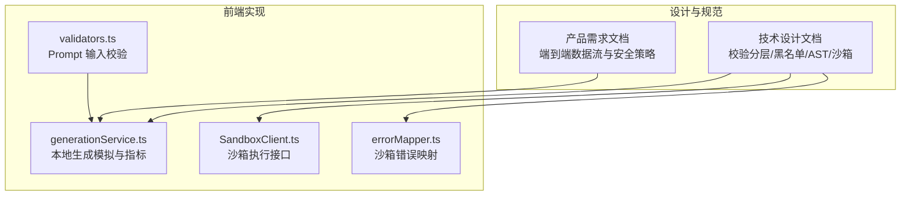
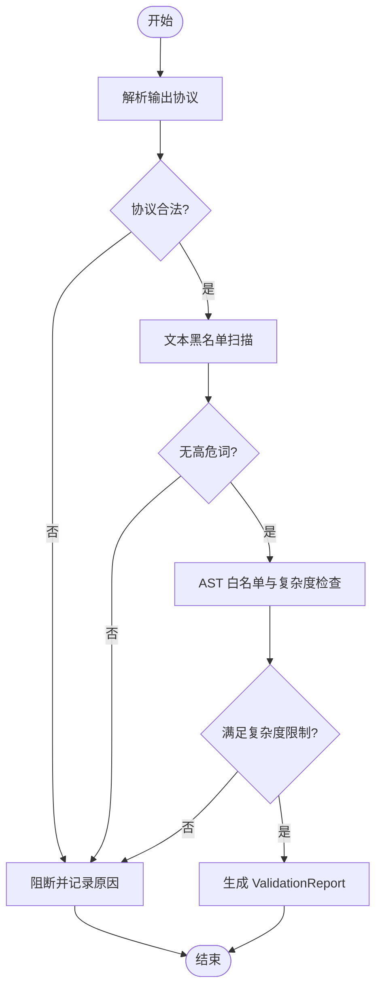
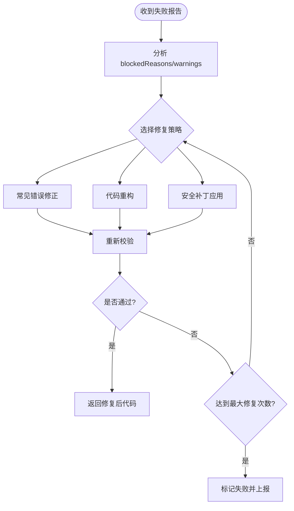
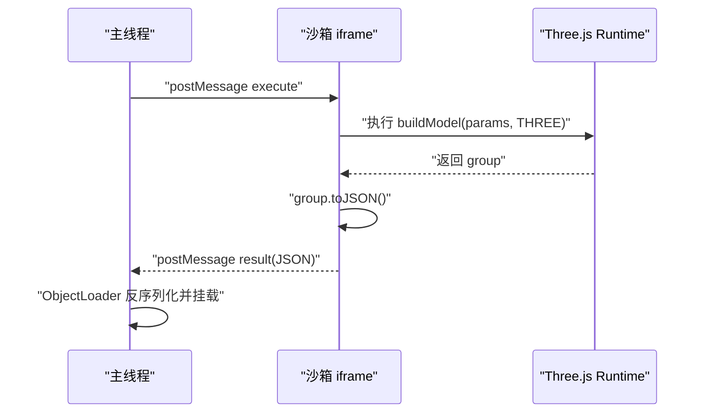
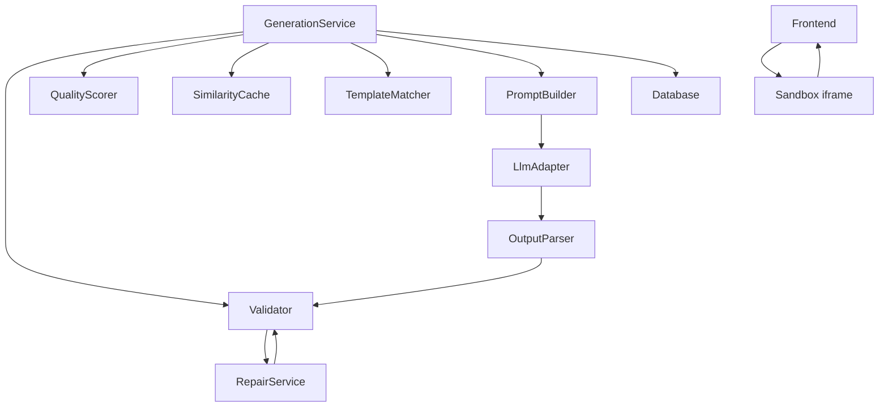

# 安全校验与自动修复

<cite>
**本文引用的文件**
- [tech/product-technical-design.md](file://tech/product-technical-design.md)
- [prd.md](file://prd.md)
- [src/modules/studio/services/generationService.ts](file://src/modules/studio/services/generationService.ts)
- [src/shared/utils/validators.ts](file://src/shared/utils/validators.ts)
- [src/modules/sandbox/SandboxClient.ts](file://src/modules/sandbox/SandboxClient.ts)
- [src/modules/sandbox/errorMapper.ts](file://src/modules/sandbox/errorMapper.ts)
</cite>

## 目录
1. [引言](#引言)
2. [项目结构](#项目结构)
3. [核心组件](#核心组件)
4. [架构总览](#架构总览)
5. [详细组件分析](#详细组件分析)
6. [依赖分析](#依赖分析)
7. [性能考虑](#性能考虑)
8. [故障排查指南](#故障排查指南)
9. [结论](#结论)
10. [附录](#附录)

## 引言
本文件聚焦 ApexForge 的安全校验与自动修复体系，围绕 Validator 的安全检查机制（AST 语法树分析、黑名单 API 检测、复杂度限制、运行时安全检查）以及 RepairService 的自动修复策略（常见错误修正、代码重构、安全补丁应用）进行系统化说明。文档同时给出多层安全防护体系设计、误报率控制与修复成功率优化方法，并提供可操作的安全规则配置与自定义校验器实现指引，帮助工程团队在平台化演进中持续保障 AI 生成代码的安全性、稳定性与可维护性。

## 项目结构
本项目当前仓库包含产品需求与技术设计文档，以及前端 MVP 阶段的若干模块骨架。与安全校验和自动修复直接相关的文件包括：
- 设计与规范：技术设计文档定义了校验分层、黑名单 API、AST 白名单策略、沙箱执行流程与错误分类等。
- 前端服务与类型：本地生成服务与通用校验工具提供基础能力与扩展点。
- 沙箱客户端：定义执行接口与错误映射，为后续 iframe 集成预留位置。



图表来源
- [tech/product-technical-design.md:428-470](file://tech/product-technical-design.md#L428-L470)
- [prd.md:126-151](file://prd.md#L126-L151)
- [src/modules/studio/services/generationService.ts:1-30](file://src/modules/studio/services/generationService.ts#L1-L30)
- [src/shared/utils/validators.ts:1-14](file://src/shared/utils/validators.ts#L1-L14)
- [src/modules/sandbox/SandboxClient.ts:1-19](file://src/modules/sandbox/SandboxClient.ts#L1-L19)
- [src/modules/sandbox/errorMapper.ts:1-12](file://src/modules/sandbox/errorMapper.ts#L1-L12)

章节来源
- [tech/product-technical-design.md:428-470](file://tech/product-technical-design.md#L428-L470)
- [prd.md:126-151](file://prd.md#L126-L151)
- [src/modules/studio/services/generationService.ts:1-30](file://src/modules/studio/services/generationService.ts#L1-L30)
- [src/shared/utils/validators.ts:1-14](file://src/shared/utils/validators.ts#L1-L14)
- [src/modules/sandbox/SandboxClient.ts:1-19](file://src/modules/sandbox/SandboxClient.ts#L1-L19)
- [src/modules/sandbox/errorMapper.ts:1-12](file://src/modules/sandbox/errorMapper.ts#L1-L12)

## 核心组件
- Validator（服务端）
  - 职责：对 LLM 返回的代码进行协议校验、文本黑名单扫描、AST 白名单与复杂度限制，并输出 ValidationReport。
  - 关键能力：
    - 输出协议校验：确保 JSON 结构与字段符合约定。
    - 文本黑名单：快速阻断 eval、网络访问、DOM 访问、动态加载等危险模式。
    - AST 白名单：仅允许安全的变量声明、函数、对象/数组字面量、Math 白名单方法、Three.js 白名单构造器与方法。
    - 复杂度限制：最大代码长度、AST 深度、循环层数、Mesh 数量、顶点估算等。
- RepairService（服务端）
  - 职责：在 Validator 失败时尝试自动修复，提升通过率与用户体验。
  - 典型策略：
    - 常见错误修正：补全缺失 return、修正参数名、替换非白名单 API 为等价安全实现。
    - 代码重构：提取重复逻辑、拆分过长函数、规范化命名与缩进。
    - 安全补丁应用：注入资源上限、超时保护、禁用危险全局访问等。
- SandboxClient（前端）
  - 职责：封装与 iframe 沙箱的通信、超时控制、结果序列化与错误映射。
  - 关键点：postMessage 协议、执行超时销毁、只允许返回结构化 JSON。

章节来源
- [tech/product-technical-design.md:428-470](file://tech/product-technical-design.md#L428-L470)
- [tech/product-technical-design.md:472-518](file://tech/product-technical-design.md#L472-L518)
- [src/modules/sandbox/SandboxClient.ts:1-19](file://src/modules/sandbox/SandboxClient.ts#L1-L19)
- [src/modules/sandbox/errorMapper.ts:1-12](file://src/modules/sandbox/errorMapper.ts#L1-L12)

## 架构总览
下图展示从用户请求到安全校验与自动修复的整体链路，强调 Validator 与 RepairService 的协作关系，以及与沙箱运行时的边界。

```mermaid
sequenceDiagram
participant FE as "前端"
participant API as "API 网关"
participant GEN as "生成服务"
participant VAL as "Validator"
participant REPAIR as "RepairService"
participant BOX as "沙箱 iframe"
participant DB as "数据库"
FE->>API : "POST /api/v1/generations"
API->>GEN : "创建任务"
GEN->>VAL : "校验 LLM 输出"
alt "通过"
VAL-->>GEN : "ValidationReport(通过)"
GEN->>DB : "持久化结果"
GEN-->>FE : "返回可渲染结果"
else "未通过"
VAL-->>GEN : "ValidationReport(失败+原因)"
GEN->>REPAIR : "触发自动修复"
REPAIR-->>VAL : "修复后再次校验"
alt "修复成功"
VAL-->>GEN : "ValidationReport(通过)"
GEN->>DB : "持久化结果"
GEN-->>FE : "返回可渲染结果"
else "仍失败"
GEN-->>FE : "返回失败状态"
end
end
FE->>BOX : "在沙箱中执行模型代码"
BOX-->>FE : "返回模型 JSON 或错误"
```

图表来源
- [tech/product-technical-design.md:359-391](file://tech/product-technical-design.md#L359-L391)
- [tech/product-technical-design.md:428-470](file://tech/product-technical-design.md#L428-L470)
- [tech/product-technical-design.md:472-518](file://tech/product-technical-design.md#L472-L518)

## 详细组件分析

### Validator 安全校验机制
- 校验分层
  - 输出协议校验：确保 mode、templateId、params、code 等字段存在且类型正确。
  - 文本黑名单：正则匹配危险关键词，快速拦截高风险代码。
  - AST 白名单：基于解析后的语法树，严格限制允许的节点类型与调用链。
  - 复杂度限制：代码长度、AST 深度、循环层数、Mesh 数量、顶点估算等阈值。
- 黑名单 API 检测
  - 动态执行：eval、Function、setTimeout/setInterval 字符串参数。
  - 网络访问：fetch、XMLHttpRequest、WebSocket、EventSource、navigator.sendBeacon。
  - DOM 访问：document、window.top、window.parent、localStorage、sessionStorage。
  - 动态加载：import、importScripts、require。
  - 原型污染：__proto__、prototype、constructor 异常链式访问。
  - 计算风险：while(true)、无限递归、过深嵌套循环。
- AST 白名单策略
  - 允许语法：变量/函数声明、对象/数组字面量、基础数学运算与 Math 白名单方法。
  - 允许 API：new THREE.Group()、基础几何体/材质、Mesh/Line 等构造器；group.add()、mesh.position.set()、mesh.rotation.set() 等安全方法。
  - 限制策略：最大代码长度、AST 深度、循环层数、Mesh 数量、顶点估算、禁止访问未声明全局变量（除 THREE/Math/params/安全工具）。
- 复杂度与质量指标
  - 记录 astSummary、complexity、blockedReasons、warnings 等，用于审计与回归测试。



图表来源
- [tech/product-technical-design.md:428-470](file://tech/product-technical-design.md#L428-L470)
- [tech/product-technical-design.md:298-310](file://tech/product-technical-design.md#L298-L310)

章节来源
- [tech/product-technical-design.md:428-470](file://tech/product-technical-design.md#L428-L470)
- [tech/product-technical-design.md:298-310](file://tech/product-technical-design.md#L298-L310)

### RepairService 自动修复策略
- 目标
  - 提高校验通过率，减少人工干预，缩短端到端时延。
- 常见错误自动修正
  - 补全缺失 return、修正参数名与默认值、替换非白名单 API 为等价安全实现。
  - 移除或重写危险调用，注入资源上限与超时保护。
- 代码重构
  - 提取重复逻辑、拆分过长函数、规范化命名与缩进，降低 AST 深度与复杂度。
- 安全补丁应用
  - 注入安全上下文（如受限 Math、受限 THREE 子集）、禁用危险全局访问、强制使用白名单构造器。
- 修复流程
  - 接收 ValidationReport 中的 blockedReasons 与 warnings，按优先级选择修复策略，迭代重试直至通过或达到最大修复次数。



[本节为概念性流程说明，不直接映射具体源码文件]

### 沙箱运行时安全检查
- iframe 隔离方案
  - 主线程通过 postMessage 发送 { executionId, code, params, timeoutMs }。
  - iframe 内执行 buildModel(params, THREE)，成功后 group.toJSON() 返回结构化 JSON。
  - 主线程使用 ObjectLoader 反序列化并挂载场景。
- 安全增强
  - sandbox="allow-scripts"，CSP 限制脚本来源，仅允许预构建 runtime。
  - 每次执行创建任务 ID，超时未返回则销毁 iframe。
  - 只暴露 THREE、安全构建函数与 params，禁止回传函数或 DOM 引用。
- 错误分类与提示
  - SANDBOX_TIMEOUT：执行超时，已安全终止。
  - SANDBOX_RUNTIME_ERROR：运行时报错，可重试或降低复杂度。
  - MODEL_JSON_INVALID：返回结构非法，无法加载到场景。



图表来源
- [tech/product-technical-design.md:472-518](file://tech/product-technical-design.md#L472-L518)
- [src/modules/sandbox/SandboxClient.ts:1-19](file://src/modules/sandbox/SandboxClient.ts#L1-L19)
- [src/modules/sandbox/errorMapper.ts:1-12](file://src/modules/sandbox/errorMapper.ts#L1-L12)

章节来源
- [tech/product-technical-design.md:472-518](file://tech/product-technical-design.md#L472-L518)
- [src/modules/sandbox/SandboxClient.ts:1-19](file://src/modules/sandbox/SandboxClient.ts#L1-L19)
- [src/modules/sandbox/errorMapper.ts:1-12](file://src/modules/sandbox/errorMapper.ts#L1-L12)

### 前端生成服务与输入校验
- 本地生成服务
  - 根据类别选择模板，模拟生成耗时，返回带 traceId 与指标的结果，便于前端展示与追踪。
- Prompt 输入校验
  - 去除首尾空白、长度限制（不超过 2000 字符），为空或超长时返回错误信息。

章节来源
- [src/modules/studio/services/generationService.ts:1-30](file://src/modules/studio/services/generationService.ts#L1-L30)
- [src/shared/utils/validators.ts:1-14](file://src/shared/utils/validators.ts#L1-L14)

## 依赖分析
- 组件耦合与内聚
  - Validator 与 RepairService 高内聚于“代码安全”领域，通过 ValidationReport 契约交互，避免紧耦合。
  - SandboxClient 与 errorMapper 解耦，错误码集中管理，便于统一处理与国际化。
- 外部依赖与集成点
  - 与 LLM Adapter、Template Service、缓存与队列的集成点在 Generation Service 内部编排。
  - 沙箱运行时依赖浏览器环境（iframe、postMessage、ObjectLoader）。
- 潜在循环依赖
  - 当前设计以单向流水线为主（LLM -> Parser -> Validator -> RepairService -> Validator -> Score），未发现循环依赖。



图表来源
- [tech/product-technical-design.md:594-609](file://tech/product-technical-design.md#L594-L609)

章节来源
- [tech/product-technical-design.md:594-609](file://tech/product-technical-design.md#L594-L609)

## 性能考虑
- 服务端
  - 相似 Prompt 缓存命中优先，减少 LLM 调用与校验开销。
  - 模板模式参数化生成仅需毫秒级，避免大模型推理。
  - 校验与修复并行化：黑名单与 AST 校验可分阶段短路，修复策略按优先级顺序执行。
- 前端
  - 模型 JSON 解析放入 Worker，主线程只做渲染挂载。
  - 对重复几何体使用 InstancedMesh，降低绘制调用。
  - 页面不可见时暂停渲染循环，释放旧模型资源。

[本节为通用性能建议，不直接分析具体文件]

## 故障排查指南
- 常见问题定位
  - 校验失败：查看 ValidationReport 的 blockedReasons 与 warnings，确认是否为黑名单命中或复杂度超限。
  - 沙箱错误：根据错误码（SANDBOX_TIMEOUT、SANDBOX_RUNTIME_ERROR、MODEL_JSON_INVALID）判断是超时、运行时报错还是返回结构非法。
  - 生成失败：结合 traceId 与 SSE 事件（queued、generating、validating、repairing、renderable、failed）定位阶段。
- 处理建议
  - 黑名单命中：调整 Prompt 或启用 RepairService 自动修复。
  - 复杂度超限：降级细节或使用模板模式。
  - 沙箱超时：降低 Mesh 数量或几何复杂度，增加超时阈值需谨慎评估安全风险。
  - 返回结构非法：检查 buildModel 返回值与 group.toJSON 序列化的完整性。

章节来源
- [tech/product-technical-design.md:472-518](file://tech/product-technical-design.md#L472-L518)
- [src/modules/sandbox/errorMapper.ts:1-12](file://src/modules/sandbox/errorMapper.ts#L1-L12)

## 结论
ApexForge 的安全校验与自动修复体系以“多层防护 + 可观测 + 可演进”为核心原则：服务端通过协议校验、黑名单与 AST 白名单精准拦截风险，结合 RepairService 的自动修复策略提升通过率；前端通过 iframe 沙箱与严格的 postMessage 协议保障运行时安全。配合 ValidationReport 与 QualityScore 的数据闭环，系统可在持续反馈中优化 Prompt、模板与模型选择策略，兼顾安全性、稳定性与用户体验。

[本节为总结性内容，不直接分析具体文件]

## 附录

### 安全规则配置建议
- 黑名单与白名单
  - 黑名单：动态执行、网络访问、DOM 访问、动态加载、原型污染、计算风险。
  - 白名单：变量/函数声明、对象/数组字面量、Math 白名单方法、Three.js 白名单构造器与方法。
- 复杂度阈值
  - 代码长度、AST 深度、循环层数、Mesh 数量、顶点估算等，可按套餐与场景配置。
- 沙箱策略
  - sandbox 与 CSP 最小权限原则，仅允许必要脚本来源；每次执行独立任务 ID 与超时销毁。

章节来源
- [tech/product-technical-design.md:428-470](file://tech/product-technical-design.md#L428-L470)
- [tech/product-technical-design.md:472-518](file://tech/product-technical-design.md#L472-L518)

### 自定义校验器实现方法
- 扩展点
  - 在 Validator 管线中插入自定义规则（如业务特定 API 白名单、行业合规约束）。
  - 将自定义规则纳入 ValidationReport 的 warnings 与 blockedReasons，便于审计与可视化。
- 实现步骤
  - 定义规则描述与阈值，编写 AST 遍历逻辑与复杂度统计。
  - 注册至校验流水线，支持开关与灰度发布。
  - 与 RepairService 联动，为常见违规提供自动修复策略。
- 验证与回归
  - 建立用例集覆盖正常、边界与恶意输入，定期回归评估误报率与修复成功率。

[本节为方法论指导，不直接分析具体文件]