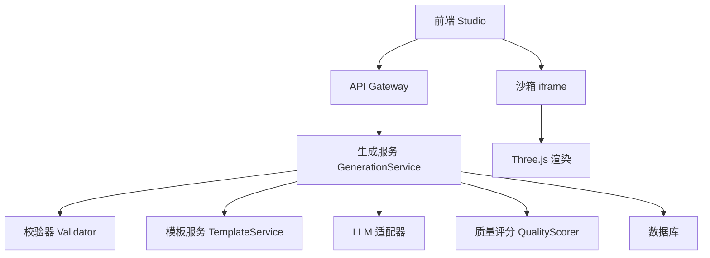
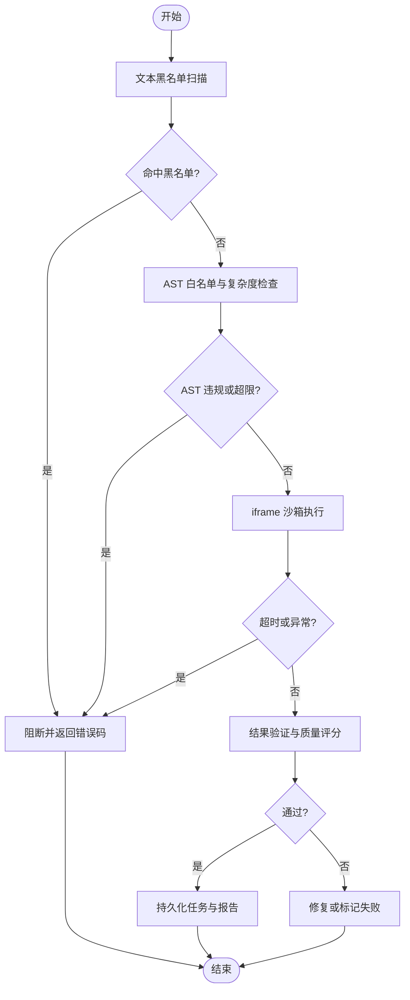
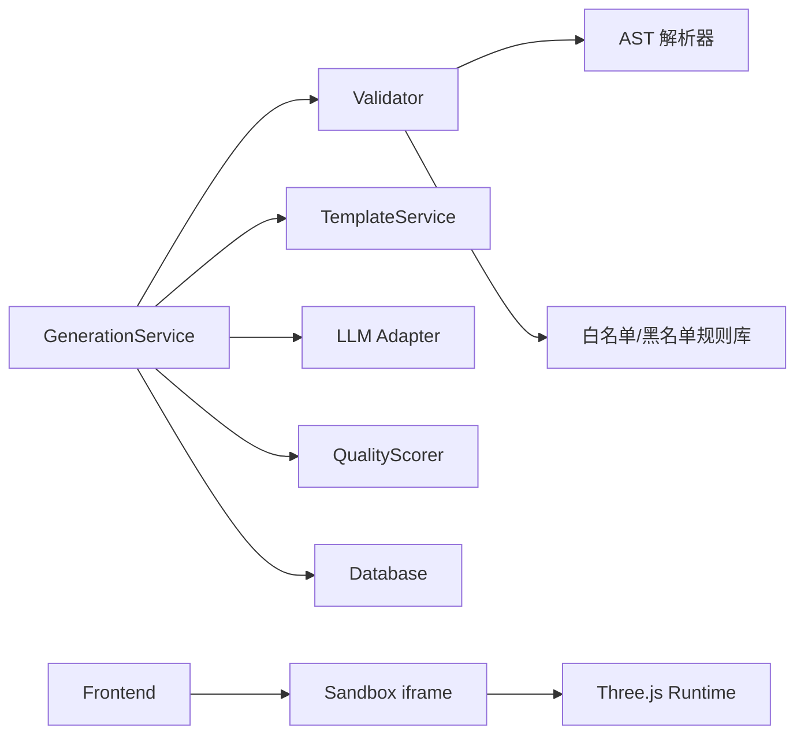

# 安全校验器

<cite>
**本文引用的文件**
- [产品需求文档](file://prd.md)
- [产品技术设计文档](file://tech/product-technical-design.md)
</cite>

## 目录
1. [引言](#引言)
2. [项目结构](#项目结构)
3. [核心组件](#核心组件)
4. [架构总览](#架构总览)
5. [详细组件分析](#详细组件分析)
6. [依赖关系分析](#依赖关系分析)
7. [性能考量](#性能考量)
8. [故障排查指南](#故障排查指南)
9. [结论](#结论)
10. [附录](#附录)

## 引言
本文件面向 ApexForge 的“安全校验器”子系统，聚焦于对 AI 生成的 Three.js 代码进行多层、可配置、可扩展的安全与质量保障。内容涵盖：AST 语法树分析、危险 API 检测、语法限制、复杂度分析、内存泄漏防护、文本黑名单 → AST 白名单 → 运行时沙箱 → 结果验证的多层策略，以及规则配置、性能优化与误报处理机制。同时提供安全策略定制与自定义校验规则的扩展方法，覆盖 AST 解析与遍历、危险函数调用检测、API 白名单管理、代码复杂度评估、内存使用监控、递归深度限制、文件操作安全检查、网络请求过滤等关键能力。

## 项目结构
从仓库现有资料可知，ApexForge 采用前后端分离与模块化服务化架构，MVP 阶段为单体后端加前端 SPA，Beta/Scale 阶段演进为微服务与云原生部署。与安全校验器直接相关的模块包括：
- 生成编排（Generation Service）
- 代码校验（Validator）
- 模板系统（Template Service）
- 沙箱执行（Sandbox iframe）
- 质量评分（Quality Scorer）
- 可观测性（Observability）



图表来源
- [产品技术设计文档:36-62](file://tech/product-technical-design.md#L36-L62)
- [产品技术设计文档:594-609](file://tech/product-technical-design.md#L594-L609)

章节来源
- [产品技术设计文档:36-100](file://tech/product-technical-design.md#L36-L100)
- [产品需求文档:57-84](file://prd.md#L57-L84)

## 核心组件
本节围绕安全校验器的关键能力展开，结合设计文档中的分层策略与实现要点，给出职责边界与交互方式。

- 文本黑名单扫描
  - 目标：快速阻断明显危险模式，如动态执行、网络访问、DOM 访问、原型污染、无限循环等。
  - 位置：服务端，在 LLM 输出进入 AST 前执行。
  - 参考：[产品技术设计文档:441-451](file://tech/product-technical-design.md#L441-L451)

- AST 白名单校验
  - 目标：精确限制允许使用的语法、API、构造器与方法；限制代码长度、AST 深度、循环层数、Mesh 数量、顶点估算等。
  - 位置：服务端，作为强约束层。
  - 参考：[产品技术设计文档:452-469](file://tech/product-technical-design.md#L452-L469)

- 运行时沙箱隔离
  - 目标：在 iframe 中执行生成代码，严格限制权限与资源，超时销毁，仅返回结构化 JSON。
  - 位置：客户端，配合 CSP 与 sandbox 属性。
  - 参考：[产品技术设计文档:474-517](file://tech/product-technical-design.md#L474-L517)

- 结果验证与质量评分
  - 目标：校验模型 JSON 合法性与复杂度指标，计算可渲染性、结构完整性、性能表现等维度分数。
  - 位置：服务端/客户端协同，记录到 ValidationReport 与 QualityScore。
  - 参考：[产品技术设计文档:300-324](file://tech/product-technical-design.md#L300-L324), [产品技术设计文档:808-840](file://tech/product-technical-design.md#L808-L840)

章节来源
- [产品技术设计文档:428-470](file://tech/product-technical-design.md#L428-L470)
- [产品技术设计文档:474-517](file://tech/product-technical-design.md#L474-L517)
- [产品技术设计文档:300-324](file://tech/product-technical-design.md#L300-L324)
- [产品技术设计文档:808-840](file://tech/product-technical-design.md#L808-L840)

## 架构总览
安全校验器贯穿“生成链路”，在多个阶段介入，形成“文本黑名单 → AST 白名单 → 运行时沙箱 → 结果验证”的分层防线。

```mermaid
sequenceDiagram
participant FE as "前端"
participant API as "API 网关"
participant GEN as "生成服务"
participant VAL as "校验器"
participant BOX as "沙箱 iframe"
participant DB as "数据库"
FE->>API : "POST /api/v1/generations"
API->>GEN : "创建任务并编排"
GEN->>VAL : "文本黑名单 + AST 白名单校验"
alt 通过
GEN->>BOX : "postMessage 执行代码"
BOX-->>GEN : "返回序列化模型 JSON"
GEN->>DB : "持久化任务与报告"
GEN-->>FE : "返回可渲染结果"
else 未通过
GEN-->>FE : "返回失败与原因"
end
```

图表来源
- [产品技术设计文档:361-390](file://tech/product-technical-design.md#L361-L390)
- [产品技术设计文档:428-470](file://tech/product-technical-design.md#L428-L470)
- [产品技术设计文档:474-517](file://tech/product-technical-design.md#L474-L517)

章节来源
- [产品技术设计文档:361-390](file://tech/product-technical-design.md#L361-L390)
- [产品技术设计文档:428-470](file://tech/product-technical-design.md#L428-L470)

## 详细组件分析

### 1) AST 解析与遍历
- 目标：将生成代码解析为 AST，遍历节点以识别危险调用、越界全局访问、过度嵌套与复杂结构。
- 关键点：
  - 支持 Babel/Acorn 等解析器，构建完整 AST。
  - 定义 Node 类型白名单与受限节点集合。
  - 统计 AST 深度、分支与循环节点数量。
  - 提取函数签名与参数约定，确保符合 buildModel(params, THREE) 或模板渲染函数契约。
- 参考路径：
  - [产品技术设计文档:452-469](file://tech/product-technical-design.md#L452-L469)
  - [产品需求文档:77-81](file://prd.md#L77-L81)

章节来源
- [产品技术设计文档:452-469](file://tech/product-technical-design.md#L452-L469)
- [产品需求文档:77-81](file://prd.md#L77-L81)

### 2) 危险函数调用检测
- 目标：拦截动态执行、网络访问、DOM 访问、动态加载、原型污染、高风险计算等。
- 策略：
  - 文本黑名单正则匹配快速拦截。
  - AST 层精准定位 CallExpression、MemberExpression、ImportDeclaration 等节点。
  - 维护黑名单 API 清单与上下文判断（如是否属于白名单对象）。
- 参考路径：
  - [产品技术设计文档:441-451](file://tech/product-technical-design.md#L441-L451)
  - [产品需求文档:77-81](file://prd.md#L77-L81)

章节来源
- [产品技术设计文档:441-451](file://tech/product-technical-design.md#L441-L451)
- [产品需求文档:77-81](file://prd.md#L77-L81)

### 3) API 白名单管理
- 目标：限定允许的几何体、材质、变换方法与组操作，避免任意 API 滥用。
- 策略：
  - 白名单包含基础几何体构造器、基础材质、THREE.Group/Mesh/Line 等安全对象。
  - 允许 group.add()、mesh.position.set()、mesh.rotation.set() 等安全方法。
  - 禁止访问未声明全局变量，除 THREE、Math、params、安全工具函数外。
- 参考路径：
  - [产品技术设计文档:452-469](file://tech/product-technical-design.md#L452-L469)

章节来源
- [产品技术设计文档:452-469](file://tech/product-technical-design.md#L452-L469)

### 4) 代码复杂度评估
- 目标：控制代码规模与结构复杂度，防止浏览器卡顿与资源耗尽。
- 指标：
  - 最大代码长度、AST 深度、循环层数、Mesh 数量、几何体顶点估算。
  - 与套餐/环境阈值联动，超限则拒绝或降级。
- 参考路径：
  - [产品技术设计文档:462-469](file://tech/product-technical-design.md#L462-L469)

章节来源
- [产品技术设计文档:462-469](file://tech/product-technical-design.md#L462-L469)

### 5) 内存使用监控与泄漏防护
- 目标：在沙箱执行期间监控内存峰值与增长趋势，及时终止异常进程；在前端释放旧模型资源。
- 措施：
  - 沙箱侧设置执行超时与内存上限，触发后销毁 iframe。
  - 前端在替换模型时遍历 dispose geometry、material、texture。
  - 大模型解析移至 Worker，降低主线程压力。
- 参考路径：
  - [产品技术设计文档:490-517](file://tech/product-technical-design.md#L490-L517)
  - [产品技术设计文档:563-571](file://tech/product-technical-design.md#L563-L571)

章节来源
- [产品技术设计文档:490-517](file://tech/product-technical-design.md#L490-L517)
- [产品技术设计文档:563-571](file://tech/product-technical-design.md#L563-L571)

### 6) 递归深度限制
- 目标：防止深层递归导致的栈溢出与长时间阻塞。
- 策略：
  - AST 层统计递归调用链深度，超过阈值即阻断。
  - 运行时在沙箱内设置最大调用深度保护。
- 参考路径：
  - [产品技术设计文档:462-469](file://tech/product-technical-design.md#L462-L469)

章节来源
- [产品技术设计文档:462-469](file://tech/product-technical-design.md#L462-L469)

### 7) 文件操作安全检查
- 目标：阻止任何文件系统访问与本地资源读取。
- 策略：
  - 文本黑名单与 AST 白名单双重拦截 File API、Node fs 模块等。
  - 沙箱禁用同源访问与外部资源加载。
- 参考路径：
  - [产品技术设计文档:441-451](file://tech/product-technical-design.md#L441-L451)
  - [产品技术设计文档:490-517](file://tech/product-technical-design.md#L490-L517)

章节来源
- [产品技术设计文档:441-451](file://tech/product-technical-design.md#L441-L451)
- [产品技术设计文档:490-517](file://tech/product-technical-design.md#L490-L517)

### 8) 网络请求过滤
- 目标：完全阻断网络访问，避免数据泄露与外部依赖注入。
- 策略：
  - 黑名单包含 fetch、XMLHttpRequest、WebSocket、EventSource、navigator.sendBeacon 等。
  - AST 层拦截相关调用与 importScripts、import 等动态加载。
  - 沙箱启用 sandbox="allow-scripts" 且无网络权限。
- 参考路径：
  - [产品技术设计文档:441-451](file://tech/product-technical-design.md#L441-L451)
  - [产品技术设计文档:490-517](file://tech/product-technical-design.md#L490-L517)

章节来源
- [产品技术设计文档:441-451](file://tech/product-technical-design.md#L441-L451)
- [产品技术设计文档:490-517](file://tech/product-technical-design.md#L490-L517)

### 9) 多层校验流程与时序


图表来源
- [产品技术设计文档:428-470](file://tech/product-technical-design.md#L428-L470)
- [产品技术设计文档:474-517](file://tech/product-technical-design.md#L474-L517)
- [产品技术设计文档:300-324](file://tech/product-technical-design.md#L300-L324)

章节来源
- [产品技术设计文档:428-470](file://tech/product-technical-design.md#L428-L470)
- [产品技术设计文档:474-517](file://tech/product-technical-design.md#L474-L517)
- [产品技术设计文档:300-324](file://tech/product-technical-design.md#L300-L324)

### 10) 校验规则配置与扩展
- 配置项建议：
  - 黑名单 API 列表、白名单 API 列表、最大代码长度、AST 深度、循环层数、Mesh 数量、顶点估算上限、递归深度、超时时间、内存上限。
  - 模板模式开关、Hybrid 模式开关、缓存命中率阈值。
- 扩展点：
  - 插件式规则注册：新增 AST 节点处理器与风险评分权重。
  - 规则版本化：随 Prompt 版本与模板版本同步演进。
  - 灰度发布：按租户或套餐逐步放开更宽松的规则集。
- 参考路径：
  - [产品技术设计文档:462-469](file://tech/product-technical-design.md#L462-L469)
  - [产品技术设计文档:419-425](file://tech/product-technical-design.md#L419-L425)

章节来源
- [产品技术设计文档:462-469](file://tech/product-technical-design.md#L462-L469)
- [产品技术设计文档:419-425](file://tech/product-technical-design.md#L419-L425)

### 11) 误报处理机制
- 自动修复：基于 AST 重写与模板补全，尝试修正轻微违规（如多余注释、非关键命名）。
- 重试策略：最多两次自动重试，结合不同 Prompt 变体或模板候选。
- 人工审核：首次生成或低置信度结果进入人工审核队列。
- 反馈闭环：用户反馈驱动 Prompt 与模板优化，持续降低误报率。
- 参考路径：
  - [产品需求文档:77-84](file://prd.md#L77-L84)
  - [产品技术设计文档:342-357](file://tech/product-technical-design.md#L342-L357)
  - [产品技术设计文档:828-840](file://tech/product-technical-design.md#L828-L840)

章节来源
- [产品需求文档:77-84](file://prd.md#L77-L84)
- [产品技术设计文档:342-357](file://tech/product-technical-design.md#L342-L357)
- [产品技术设计文档:828-840](file://tech/product-technical-design.md#L828-L840)

## 依赖关系分析
安全校验器与生成链路各模块紧密耦合，依赖关系如下：



图表来源
- [产品技术设计文档:594-609](file://tech/product-technical-design.md#L594-L609)
- [产品技术设计文档:474-517](file://tech/product-technical-design.md#L474-L517)

章节来源
- [产品技术设计文档:594-609](file://tech/product-technical-design.md#L594-L609)
- [产品技术设计文档:474-517](file://tech/product-technical-design.md#L474-L517)

## 性能考量
- 前端
  - 动态加载 Three.js 与沙箱 runtime，降低首屏体积。
  - 模型 JSON 解析放入 Worker，主线程只做渲染挂载。
  - 重复几何体优先使用 InstancedMesh，远距离使用 LOD。
  - 释放旧模型时必须遍历 dispose geometry、material、texture。
- 服务端
  - 相似 Prompt 缓存，向量相似度大于阈值时复用结果。
  - 模板模式跳过 LLM 代码生成，改为参数生成。
  - 生成任务异步化，避免 HTTP 长连接占用。
  - LLM 供应商并发与熔断控制。
- 数据库
  - traceId、workspaceId、createdAt 建索引。
  - 大字段迁移至对象存储，仅保存 URL 与摘要。
  - 历史任务按时间归档。

章节来源
- [产品技术设计文档:563-571](file://tech/product-technical-design.md#L563-L571)
- [产品技术设计文档:933-958](file://tech/product-technical-design.md#L933-L958)

## 故障排查指南
- 常见错误码与提示
  - SANDBOX_TIMEOUT：执行超时，模型过于复杂，已终止渲染。
  - SANDBOX_RUNTIME_ERROR：运行时报错，生成代码存在执行问题，可重试。
  - MODEL_JSON_INVALID：返回结构非法，模型数据无效，系统将重新生成。
  - MODEL_TOO_COMPLEX：模型复杂度超限，请降低细节或使用模板模式。
  - MODEL_EMPTY：未生成有效对象，描述过于模糊，请补充模型主体。
- 排查步骤
  - 查看 ValidationReport 与 QualityScore，定位失败原因与指标异常。
  - 检查黑名单与 AST 白名单规则是否过严或过宽。
  - 确认沙箱超时与内存上限配置是否合理。
  - 对比回归测试集，评估 Prompt 与模板变更影响。
- 参考路径
  - [产品技术设计文档:508-517](file://tech/product-technical-design.md#L508-L517)
  - [产品技术设计文档:300-324](file://tech/product-technical-design.md#L300-L324)
  - [产品技术设计文档:808-840](file://tech/product-technical-design.md#L808-L840)

章节来源
- [产品技术设计文档:508-517](file://tech/product-technical-design.md#L508-L517)
- [产品技术设计文档:300-324](file://tech/product-technical-design.md#L300-L324)
- [产品技术设计文档:808-840](file://tech/product-technical-design.md#L808-L840)

## 结论
ApexForge 的安全校验器通过“文本黑名单 → AST 白名单 → 运行时沙箱 → 结果验证”的分层策略，在保证生成灵活性的同时，实现了严格的代码安全与质量保障。借助 AST 分析与复杂度评估、沙箱隔离与超时销毁、结果验证与质量评分，平台能够在大规模场景下稳定运行，并通过规则配置与扩展机制满足企业级定制需求。后续应持续完善误报处理与反馈闭环，提升生成成功率与用户体验。

## 附录
- 术语表
  - AST：抽象语法树，用于静态分析与规则校验。
  - 沙箱：隔离执行环境，限制权限与资源访问。
  - 模板模式：AI 仅生成参数，由预置渲染函数生成模型。
  - Hybrid 模式：AI 选择模板并补充局部代码。
- 参考接口与事件
  - 创建生成任务：POST /api/v1/generations
  - 查询生成任务：GET /api/v1/generations/{taskId}
  - SSE 事件：GET /api/v1/generations/{taskId}/events
- 参考路径
  - [产品技术设计文档:654-756](file://tech/product-technical-design.md#L654-L756)