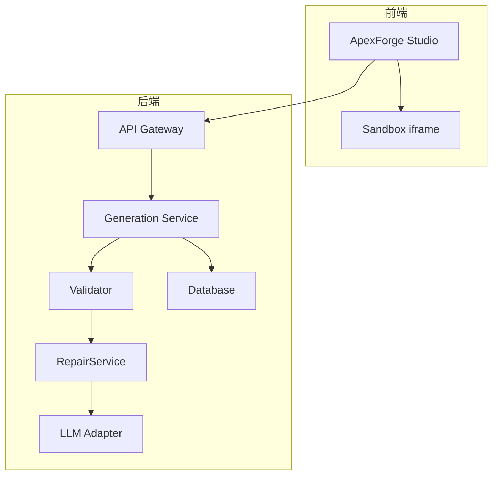
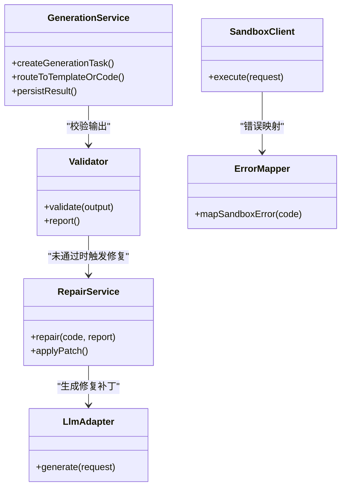
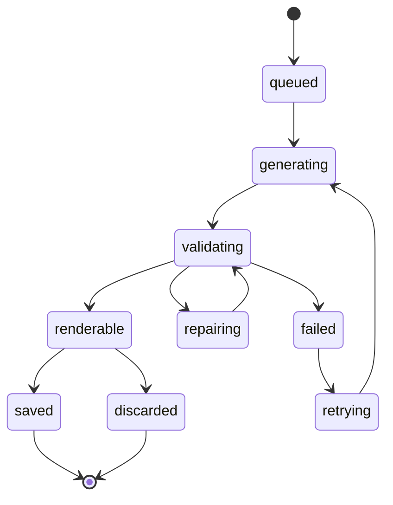
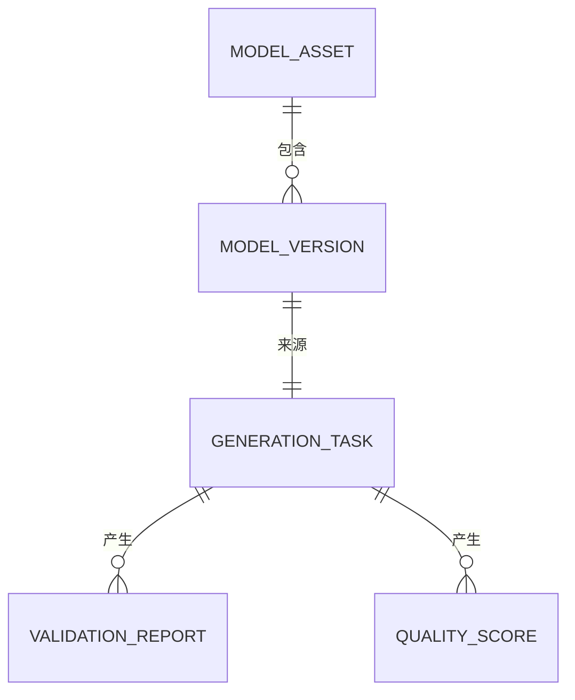

# 自动修复服务

<cite>
**本文引用的文件**   
- [tech/product-technical-design.md](file://tech/product-technical-design.md)
- [prd.md](file://prd.md)
- [src/modules/sandbox/SandboxClient.ts](file://src/modules/sandbox/SandboxClient.ts)
- [src/modules/sandbox/errorMapper.ts](file://src/modules/sandbox/errorMapper.ts)
- [src/modules/studio/services/generationService.ts](file://src/modules/studio/services/generationService.ts)
- [src/modules/viewer/utils/modelNormalizer.ts](file://src/modules/viewer/utils/modelNormalizer.ts)
</cite>

## 目录
1. [引言](#引言)
2. [项目结构](#项目结构)
3. [核心组件](#核心组件)
4. [架构总览](#架构总览)
5. [详细组件分析](#详细组件分析)
6. [依赖分析](#依赖分析)
7. [性能考虑](#性能考虑)
8. [故障排查指南](#故障排查指南)
9. [结论](#结论)
10. [附录](#附录)

## 引言
本文件为 ApexForge 的“自动修复服务”提供系统化、可落地的技术文档。围绕错误诊断、修复策略选择与代码重构技术，覆盖常见错误的自动修正模式（语法错误修复、API 替换、安全漏洞修补、性能优化），并给出修复质量评估、回滚机制与人工审核流程。同时提供修复规则配置与自定义修复策略的实现方法，涵盖错误类型识别、修复方案生成、代码变换引擎、修复效果验证、版本对比、回滚恢复、修复日志记录等关键能力。

## 项目结构
当前仓库包含产品需求与技术设计文档以及前端最小实现骨架。自动修复服务在架构层面由后端 Generation Service 中的 RepairService 驱动，结合 Validator 输出报告进行错误定位与修复策略选择；前端通过沙箱执行与结果校验形成闭环反馈。



图表来源
- [tech/product-technical-design.md:362-390](file://tech/product-technical-design.md#L362-L390)
- [tech/product-technical-design.md:594-609](file://tech/product-technical-design.md#L594-L609)

章节来源
- [tech/product-technical-design.md:362-390](file://tech/product-technical-design.md#L362-L390)
- [tech/product-technical-design.md:594-609](file://tech/product-technical-design.md#L594-L609)

## 核心组件
- 错误诊断层：基于 AST 与黑名单/白名单策略，产出 ValidationReport，标注阻断原因与警告信息，支撑后续修复策略选择。
- 修复策略层：根据诊断结果选择修复路径（模板参数化、局部代码重写、提示词引导重生成）。
- 代码变换引擎：对 AST 进行受控改写，确保仅使用白名单 API 与构造器，限制复杂度与资源消耗。
- 修复效果验证：服务端二次校验 + 客户端沙箱预执行，返回模型 JSON 与复杂度指标。
- 版本对比与回滚：以 ModelVersion 为单位保存代码与参数快照，支持一键回滚到上一稳定版本。
- 修复日志与审计：每个任务带 traceId，记录状态流转、失败原因、评分与修复动作。

章节来源
- [tech/product-technical-design.md:298-324](file://tech/product-technical-design.md#L298-L324)
- [tech/product-technical-design.md:428-470](file://tech/product-technical-design.md#L428-L470)
- [tech/product-technical-design.md:340-357](file://tech/product-technical-design.md#L340-L357)

## 架构总览
自动修复服务嵌入在 Generation 链路中，当 Validator 判定未通过时进入 repairing 状态，触发 RepairService 进行修复尝试，成功后回到 validating 继续流程。

```mermaid
sequenceDiagram
participant FE as "前端"
participant API as "网关"
participant GEN as "生成服务"
participant VAL as "校验器"
participant REPAIR as "修复服务"
participant LLM as "大模型适配器"
participant BOX as "沙箱"
participant DB as "数据库"
FE->>API : "创建生成任务"
API->>GEN : "createGenerationTask"
GEN->>VAL : "validate output"
alt "未通过"
VAL-->>GEN : "validation report"
GEN->>REPAIR : "repair(code, report)"
REPAIR->>LLM : "生成修复补丁或新代码"
LLM-->>REPAIR : "修复后代码/参数"
REPAIR-->>GEN : "修复结果"
GEN->>VAL : "再次校验"
else "通过"
VAL-->>GEN : "通过"
end
GEN->>DB : "持久化任务与结果"
GEN-->>API : "返回结果"
API-->>FE : "渲染载荷"
FE->>BOX : "iframe 执行"
BOX-->>FE : "模型 JSON 或错误"
```

图表来源
- [tech/product-technical-design.md:362-390](file://tech/product-technical-design.md#L362-L390)
- [tech/product-technical-design.md:594-609](file://tech/product-technical-design.md#L594-L609)

## 详细组件分析

### 错误诊断与修复策略选择
- 诊断维度
  - 协议与结构：JSON 输出字段、mode、templateId、code/params 完整性。
  - 文本黑名单：快速拦截危险 API 与关键字。
  - AST 白名单：限制调用栈、循环深度、几何体数量与顶点估算。
  - 运行时沙箱：超时、运行时报错、模型 JSON 无效等。
- 修复策略优先级
  - 模板参数化优先：命中模板则优先调整 params。
  - 局部代码重写：针对语法错误、API 替换、安全违规点进行最小改动。
  - 提示词引导重生成：复杂问题通过 Prompt 编排与 Few-shot 示例引导 LLM 重新生成。
  - 降级与回退：超过阈值时退回上一稳定版本或更保守模板。

章节来源
- [tech/product-technical-design.md:428-470](file://tech/product-technical-design.md#L428-L470)
- [tech/product-technical-design.md:330-338](file://tech/product-technical-design.md#L330-L338)

### 代码变换引擎（AST 级）
- 目标
  - 将非法调用替换为白名单等价实现（如 fetch→受限请求封装）。
  - 修复语法错误（缺失分号、括号不匹配、变量未声明）。
  - 控制复杂度（循环层数、递归深度、Mesh 数量上限）。
- 约束
  - 仅允许白名单 API 与构造器。
  - 最大代码长度、AST 深度、Mesh 数量、顶点估算等阈值可配置。
  - 禁止访问全局对象、DOM、网络与动态加载。

章节来源
- [tech/product-technical-design.md:452-470](file://tech/product-technical-design.md#L452-L470)

### 修复效果验证与沙箱执行
- 服务端二次校验：对修复后的代码再次走 AST 与黑名单检查。
- 客户端沙箱执行：iframe 隔离执行，返回序列化模型 JSON，主线程反序列并挂载。
- 错误映射：统一错误码与用户提示，便于前端展示与重试策略。

章节来源
- [tech/product-technical-design.md:472-518](file://tech/product-technical-design.md#L472-L518)
- [src/modules/sandbox/errorMapper.ts:1-11](file://src/modules/sandbox/errorMapper.ts#L1-L11)
- [src/modules/sandbox/SandboxClient.ts:1-19](file://src/modules/sandbox/SandboxClient.ts#L1-L19)

### 版本对比与回滚恢复
- 版本粒度：ModelVersion 保存 code、params、metrics、截图与来源任务。
- 对比维度：面数、顶点数、材质数、复杂度指标与质量评分。
- 回滚策略：按版本号回滚至最近稳定版本，保留完整审计轨迹。

章节来源
- [tech/product-technical-design.md:255-269](file://tech/product-technical-design.md#L255-L269)
- [tech/product-technical-design.md:340-357](file://tech/product-technical-design.md#L340-L357)

### 修复日志记录与可观测性
- 全链路 traceId：从创建任务到渲染完成全程追踪。
- 事件流：queued、generating、validating、repairing、renderable、failed。
- 指标与评分：ValidationReport 与 QualityScore 用于回归测试与质量监控。

章节来源
- [tech/product-technical-design.md:359-390](file://tech/product-technical-design.md#L359-L390)
- [tech/product-technical-design.md:298-324](file://tech/product-technical-design.md#L298-L324)

### 常见错误的自动修正模式
- 语法错误修复
  - 检测点：AST 解析失败、未声明变量、括号/分号缺失。
  - 修复方式：最小变更补全语法、注入必要 import 与工具函数。
- API 替换
  - 检测点：黑名单 API 出现（fetch、WebSocket、eval 等）。
  - 修复方式：替换为白名单等价实现或移除不安全逻辑。
- 安全漏洞修补
  - 检测点：原型链异常访问、动态加载、跨域访问。
  - 修复方式：删除危险节点、限制作用域、启用 CSP 与 sandbox。
- 性能优化
  - 检测点：Mesh 数量过多、顶点估算过高、循环嵌套过深。
  - 修复方式：合并几何体、实例化重复元素、降低细节层级。

章节来源
- [tech/product-technical-design.md:441-470](file://tech/product-technical-design.md#L441-L470)

### 修复质量评估
- 评分维度
  - 可渲染分：沙箱执行成功率、模型 JSON 有效性。
  - 结构分：几何体组织、命名规范、注释与可读性。
  - Prompt 匹配分：生成内容与用户意图一致性。
  - 性能分：面数、顶点数、材质数与内存占用。
- 评估流程
  - 服务端计算基础指标，客户端补充运行时指标。
  - 低于阈值的修复结果进入人工审核队列。

章节来源
- [tech/product-technical-design.md:311-324](file://tech/product-technical-design.md#L311-L324)
- [tech/product-technical-design.md:472-518](file://tech/product-technical-design.md#L472-L518)

### 人工审核流程
- 触发条件：首次生成、评分低于阈值、安全告警、用户反馈“不满意/违规”。
- 审核内容：Prompt 版本、模板选择、修复策略、最终代码与参数。
- 操作选项：批准发布、打回修复、降级模板、标记为不可用。

章节来源
- [tech/product-technical-design.md:311-324](file://tech/product-technical-design.md#L311-L324)
- [tech/product-technical-design.md:340-357](file://tech/product-technical-design.md#L340-L357)

### 修复规则配置与自定义修复策略
- 规则来源
  - 模板 Schema：参数范围、默认值、校验规则。
  - AST 白名单/黑名单：API 列表、复杂度阈值。
  - 业务策略：类别偏好、风格变体、材质预设。
- 自定义扩展
  - 新增修复插件：注册新的 AST 变换规则与校验器。
  - 动态加载：按任务上下文选择不同规则集。
  - 灰度发布：对新规则进行 A/B 测试与回滚。

章节来源
- [tech/product-technical-design.md:284-296](file://tech/product-technical-design.md#L284-L296)
- [tech/product-technical-design.md:452-470](file://tech/product-technical-design.md#L452-L470)

### 前端集成与渲染归一化
- 生成服务本地模拟：基于模板类别返回结构化结果，便于联调。
- 模型归一化：居中、缩放、边界盒计算，保证视图一致性与性能。

章节来源
- [src/modules/studio/services/generationService.ts:1-30](file://src/modules/studio/services/generationService.ts#L1-L30)
- [src/modules/viewer/utils/modelNormalizer.ts:1-15](file://src/modules/viewer/utils/modelNormalizer.ts#L1-L15)

## 依赖分析
- 模块耦合
  - GenerationService 依赖 Validator 与 RepairService，后者再调用 LLM Adapter。
  - 前端 SandboxClient 与 errorMapper 负责执行与错误映射。
- 外部依赖
  - LLM 供应商抽象接口，支持多模型路由与降级。
  - 数据库持久化任务、资产、版本与审计日志。



图表来源
- [tech/product-technical-design.md:594-609](file://tech/product-technical-design.md#L594-L609)
- [src/modules/sandbox/SandboxClient.ts:1-19](file://src/modules/sandbox/SandboxClient.ts#L1-L19)
- [src/modules/sandbox/errorMapper.ts:1-11](file://src/modules/sandbox/errorMapper.ts#L1-L11)

章节来源
- [tech/product-technical-design.md:594-609](file://tech/product-technical-design.md#L594-L609)
- [src/modules/sandbox/SandboxClient.ts:1-19](file://src/modules/sandbox/SandboxClient.ts#L1-L19)
- [src/modules/sandbox/errorMapper.ts:1-11](file://src/modules/sandbox/errorMapper.ts#L1-L11)

## 性能考虑
- 模板优先与缓存：相似 Prompt 直接复用，减少 LLM 调用与修复开销。
- 复杂度阈值：限制 Mesh 数量、顶点估算与循环深度，避免渲染卡顿。
- 沙箱隔离与超时：防止死循环与阻塞，保障主线程稳定性。
- 增量更新与导出：代码与模型 JSON 增量传输，降低带宽与解析成本。

章节来源
- [tech/product-technical-design.md:452-470](file://tech/product-technical-design.md#L452-L470)
- [tech/product-technical-design.md:472-518](file://tech/product-technical-design.md#L472-L518)

## 故障排查指南
- 常见问题
  - 执行超时：模型过于复杂或存在死循环，需降低复杂度或切换模板。
  - 运行时报错：语法错误或 API 不在白名单，需修复或替换。
  - 模型 JSON 无效：返回结构不符合预期，需校验与规范化。
- 定位步骤
  - 查看 traceId 与事件流，确认处于 repairing 还是 failed。
  - 读取 ValidationReport 与 QualityScore，定位阻断原因与评分详情。
  - 对比 ModelVersion，回滚到上一稳定版本。
- 处理建议
  - 调整模板参数或降级模板。
  - 增加 Few-shot 示例与系统提示约束。
  - 引入人工审核与反馈闭环。

章节来源
- [tech/product-technical-design.md:359-390](file://tech/product-technical-design.md#L359-L390)
- [tech/product-technical-design.md:298-324](file://tech/product-technical-design.md#L298-L324)
- [src/modules/sandbox/errorMapper.ts:1-11](file://src/modules/sandbox/errorMapper.ts#L1-L11)

## 结论
自动修复服务通过“诊断—策略—变换—验证—回滚”的闭环，显著提升了 AI 生成代码的可用性与安全性。以模板优先与 AST 白名单为核心，辅以沙箱隔离与质量评分，可在保证稳定的同时持续进化修复策略。建议在生产环境逐步引入灰度与回归测试，确保修复质量与用户体验稳步提升。

## 附录

### 状态机与事件流


图表来源
- [tech/product-technical-design.md:340-357](file://tech/product-technical-design.md#L340-L357)

### 数据模型关系（与修复相关）


图表来源
- [tech/product-technical-design.md:215-269](file://tech/product-technical-design.md#L215-L269)
- [tech/product-technical-design.md:298-324](file://tech/product-technical-design.md#L298-L324)